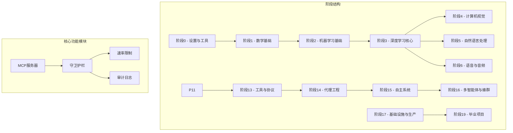
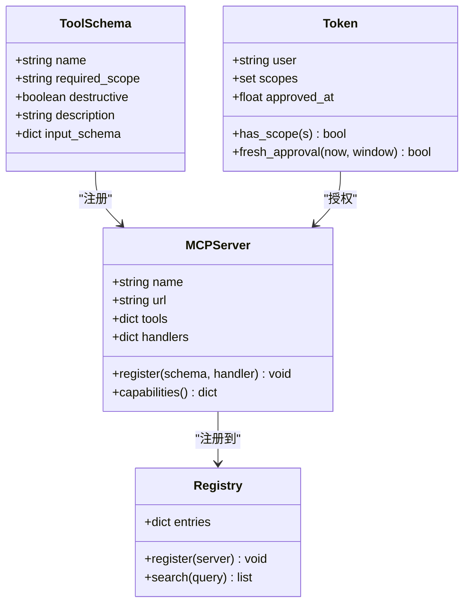
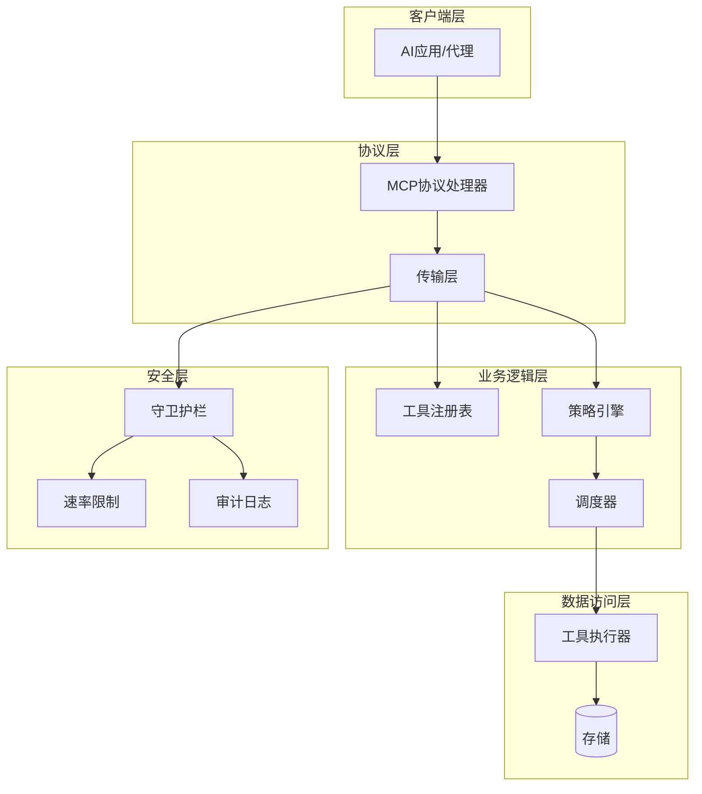
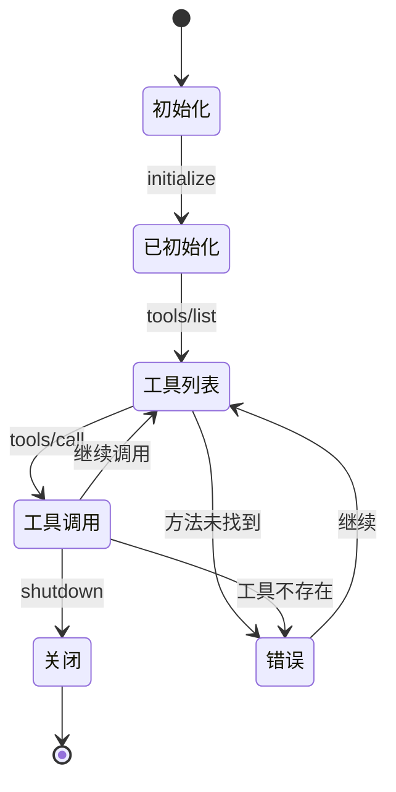
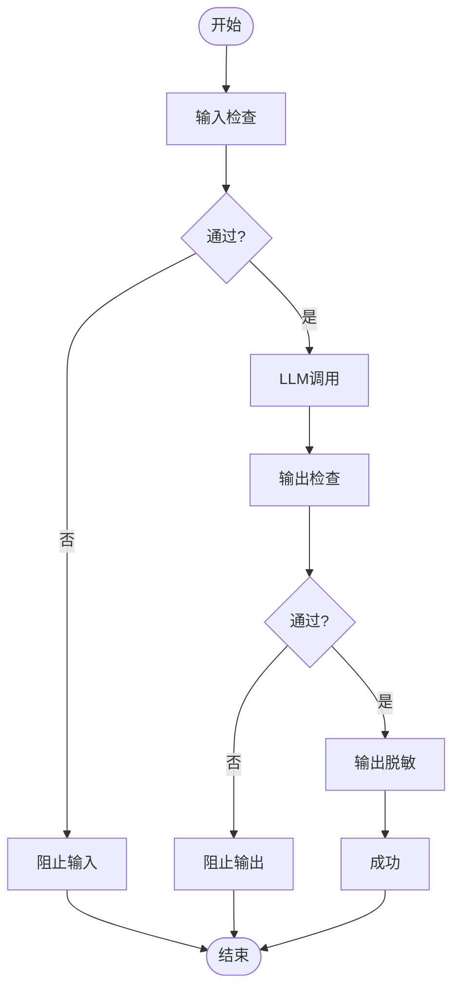
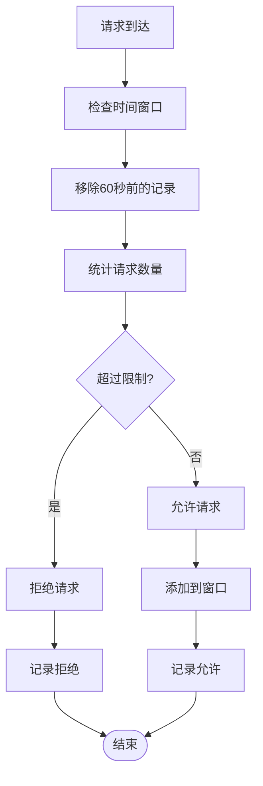
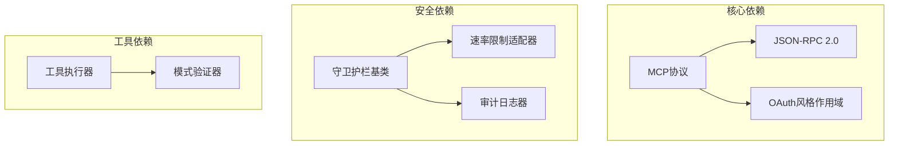

# API参考文档

<cite>
**本文档引用的文件**
- [main.py](file://phases/19-capstone-projects/13-mcp-server-with-registry/code/main.py)
- [protocol.ts](file://phases/19-capstone-projects/13-mcp-server-with-registry/code/ts/src/protocol.ts)
- [transport.ts](file://phases/19-capstone-projects/13-mcp-server-with-registry/code/ts/src/transport.ts)
- [tools.ts](file://phases/19-capstone-projects/13-mcp-server-with-registry/code/ts/src/tools.ts)
- [types.ts](file://phases/19-capstone-projects/13-mcp-server-with-registry/code/ts/src/types.ts)
- [rate_limiter.py](file://guardrails-sandbox/backend/adapters/rate_limiter.py)
- [pipeline.py](file://guardrails-sandbox/backend/pipeline.py)
- [base.py](file://guardrails-sandbox/backend/adapters/base.py)
- [test_api.py](file://test_api.py)
- [README.md](file://README.md)
</cite>

## 目录
1. [简介](#简介)
2. [项目结构](#项目结构)
3. [核心组件](#核心组件)
4. [架构概览](#架构概览)
5. [详细组件分析](#详细组件分析)
6. [依赖关系分析](#依赖关系分析)
7. [性能考虑](#性能考虑)
8. [故障排除指南](#故障排除指南)
9. [结论](#结论)
10. [附录](#附录)

## 简介
本项目是一个完整的AI工程实践框架，专注于构建和部署生产级的AI应用。该项目提供了端到端的解决方案，从基础算法实现到高级工具协议集成，涵盖了现代AI系统开发的所有关键方面。

项目的核心特色包括：
- **MCP协议实现**：完整的Model Context Protocol服务器实现，支持工具发现、调用和安全控制
- **守卫护栏系统**：多层次的安全防护机制，包括输入过滤、策略检查和输出脱敏
- **速率限制**：基于滑动窗口的请求速率控制
- **审计日志**：完整的操作审计和合规追踪
- **多语言支持**：Python和TypeScript双语言实现

## 项目结构
项目采用模块化的层次结构，每个阶段都有明确的学习目标和实践任务：

**图表来源**
- [README.md:58-81](file://README.md#L58-L81)

**章节来源**
- [README.md:241-295](file://README.md#L241-L295)

## 核心组件

### MCP协议服务器
MCP（Model Context Protocol）是现代AI工具集成的标准协议。本项目实现了完整的MCP服务器，支持：

- **工具描述**：动态发现和描述可用工具
- **安全授权**：基于OAuth风格的作用域控制系统
- **传输层抽象**：支持多种传输方式（HTTP、STDIO等）
- **审计追踪**：完整的操作日志记录

### 守卫护栏系统
实现了多层次的安全防护机制：

- **输入过滤**：恶意内容检测和过滤
- **策略检查**：基于Regula-like规则的策略执行
- **输出脱敏**：敏感信息自动脱敏
- **速率限制**：防止滥用和DDoS攻击

### 数据模型
系统使用强类型的数据模型确保数据完整性：

**图表来源**
- [main.py:25-61](file://phases/19-capstone-projects/13-mcp-server-with-registry/code/main.py#L25-L61)
- [main.py:68-79](file://phases/19-capstone-projects/13-mcp-server-with-registry/code/main.py#L68-L79)
- [main.py:37-61](file://phases/19-capstone-projects/13-mcp-server-with-registry/code/main.py#L37-L61)

**章节来源**
- [main.py:1-100](file://phases/19-capstone-projects/13-mcp-server-with-registry/code/main.py#L1-L100)

## 架构概览

系统采用分层架构设计，确保各组件的职责分离和可扩展性：

**图表来源**
- [protocol.ts:12-23](file://phases/19-capstone-projects/13-mcp-server-with-registry/code/ts/src/protocol.ts#L12-L23)
- [transport.ts:37-45](file://phases/19-capstone-projects/13-mcp-server-with-registry/code/ts/src/transport.ts#L37-L45)
- [main.py:126-144](file://phases/19-capstone-projects/13-mcp-server-with-registry/code/main.py#L126-L144)

## 详细组件分析

### MCP协议实现

#### 协议状态管理
协议状态机负责管理MCP连接的生命周期：

**图表来源**
- [protocol.ts:56-83](file://phases/19-capstone-projects/13-mcp-server-with-registry/code/ts/src/protocol.ts#L56-L83)

#### 工具描述系统
工具通过JSON Schema进行精确描述：

| 工具名称 | 描述 | 输入Schema | 注解 |
|---------|------|-----------|------|
| incidents_list | 列出事件 | `{severity: enum[p0,p1,p2]}` | 只读 |
| incidents_get | 获取单个事件 | `{id: string}` | 必需字段 |
| incidents_ack | 确认事件 | `{id: string}` | 破坏性操作 |

**章节来源**
- [tools.ts:11-43](file://phases/19-capstone-projects/13-mcp-server-with-registry/code/ts/src/tools.ts#L11-L43)

### 守卫护栏系统

#### 管线编排
守卫护栏采用流水线模式，支持多层检查：

**图表来源**
- [pipeline.py:86-127](file://guardrails-sandbox/backend/pipeline.py#L86-L127)

#### 速率限制实现
基于滑动窗口的速率限制算法：

**图表来源**
- [rate_limiter.py:22-55](file://guardrails-sandbox/backend/adapters/rate_limiter.py#L22-L55)

**章节来源**
- [rate_limiter.py:1-56](file://guardrails-sandbox/backend/adapters/rate_limiter.py#L1-L56)

### 传输层实现

#### JSON-RPC 2.0协议
TypeScript实现展示了标准JSON-RPC 2.0协议的完整实现：

| 字段 | 类型 | 必需 | 描述 |
|------|------|------|------|
| jsonrpc | "2.0" | 是 | 协议版本 |
| id | number/string/null | 视情况而定 | 请求标识符 |
| method | string | 是 | 方法名称 |
| params | object | 否 | 参数对象 |

**章节来源**
- [types.ts:3-21](file://phases/19-capstone-projects/13-mcp-server-with-registry/code/ts/src/types.ts#L3-L21)

## 依赖关系分析

系统采用松耦合的设计，主要依赖关系如下：

**图表来源**
- [base.py:14-31](file://guardrails-sandbox/backend/adapters/base.py#L14-L31)
- [types.ts:23-46](file://phases/19-capstone-projects/13-mcp-server-with-registry/code/ts/src/types.ts#L23-L46)

**章节来源**
- [pipeline.py:12-24](file://guardrails-sandbox/backend/pipeline.py#L12-L24)

## 性能考虑

### 优化策略
1. **缓存机制**：实现语义缓存减少重复计算
2. **异步处理**：支持并发工具调用
3. **资源池**：复用数据库连接和网络连接
4. **批量处理**：支持批量API调用

### 监控指标
- **延迟监控**：请求处理时间和错误率
- **资源使用**：CPU、内存和网络带宽
- **吞吐量**：每秒处理的请求数
- **错误率**：各种错误类型的统计

## 故障排除指南

### 常见问题
1. **工具调用失败**：检查工具描述和参数验证
2. **权限不足**：验证OAuth作用域和策略规则
3. **超时错误**：检查网络连接和服务器负载
4. **内存泄漏**：监控资源使用情况

### 调试工具
- **审计日志**：完整的操作追踪
- **性能分析**：详细的性能指标
- **错误报告**：结构化的错误信息

**章节来源**
- [main.py:201-234](file://phases/19-capstone-projects/13-mcp-server-with-registry/code/main.py#L201-L234)

## 结论
本项目提供了一个完整的AI工程实践框架，涵盖了从基础算法到生产部署的各个方面。通过MCP协议的实现，系统能够安全地集成各种工具和服务；通过守卫护栏系统，确保了系统的安全性和可靠性；通过完善的监控和审计机制，提供了强大的运维能力。

该框架特别适合需要构建复杂AI应用的企业和研究机构，提供了可扩展、可维护的解决方案。

## 附录

### API版本信息
- **MCP协议版本**：2025-11-25
- **JSON-RPC版本**：2.0
- **守卫护栏版本**：1.0

### 迁移指南
当升级到新版本时，请注意：
1. 检查MCP协议版本兼容性
2. 更新工具描述schema
3. 验证安全策略变更
4. 测试性能影响

### 安全最佳实践
1. 始终使用HTTPS传输
2. 实施适当的速率限制
3. 定期审查权限设置
4. 启用完整的审计日志
5. 定期进行安全评估