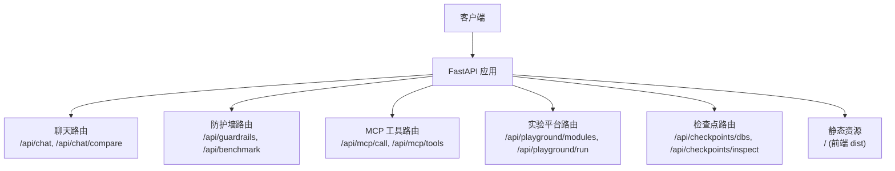
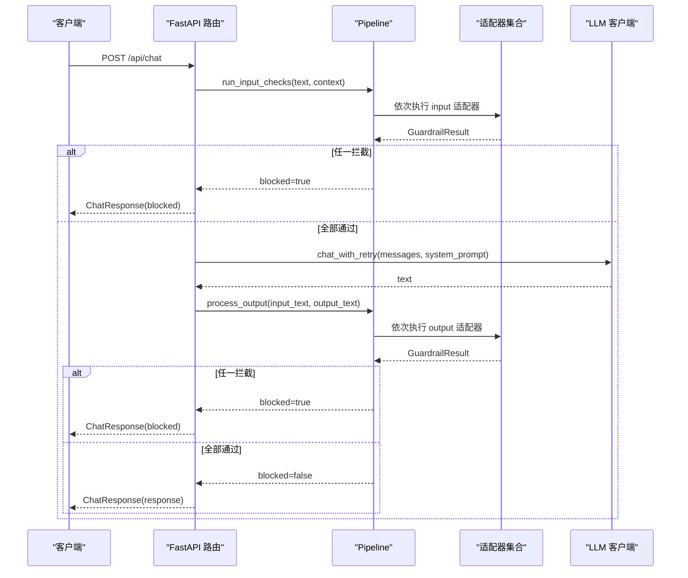
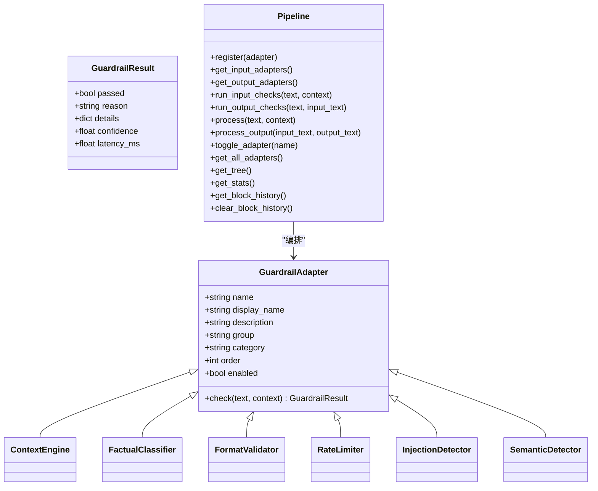
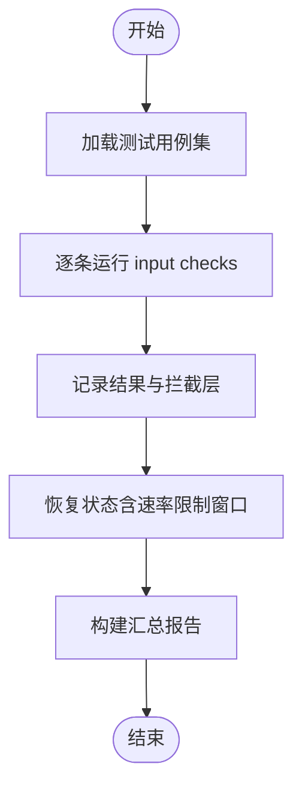
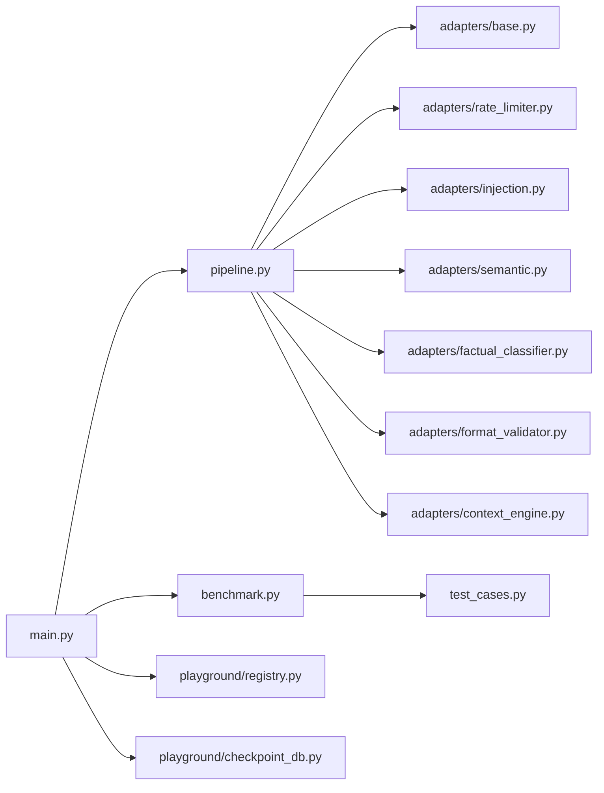

# HTTP REST API

<cite>
**本文引用的文件**
- [main.py](file://guardrails-sandbox/backend/main.py)
- [pipeline.py](file://guardrails-sandbox/backend/pipeline.py)
- [adapters/base.py](file://guardrails-sandbox/backend/adapters/base.py)
- [adapters/context_engine.py](file://guardrails-sandbox/backend/adapters/context_engine.py)
- [adapters/factual_classifier.py](file://guardrails-sandbox/backend/adapters/factual_classifier.py)
- [adapters/format_validator.py](file://guardrails-sandbox/backend/adapters/format_validator.py)
- [adapters/rate_limiter.py](file://guardrails-sandbox/backend/adapters/rate_limiter.py)
- [adapters/injection.py](file://guardrails-sandbox/backend/adapters/injection.py)
- [adapters/semantic.py](file://guardrails-sandbox/backend/adapters/semantic.py)
- [benchmark.py](file://guardrails-sandbox/backend/benchmark.py)
- [test_cases.py](file://guardrails-sandbox/backend/test_cases.py)
- [playground/registry.py](file://guardrails-sandbox/backend/playground/registry.py)
- [playground/checkpoint_db.py](file://guardrails-sandbox/backend/playground/checkpoint_db.py)
</cite>

## 目录
1. [简介](#简介)
2. [项目结构](#项目结构)
3. [核心组件](#核心组件)
4. [架构总览](#架构总览)
5. [详细组件分析](#详细组件分析)
6. [依赖关系分析](#依赖关系分析)
7. [性能考量](#性能考量)
8. [故障排查指南](#故障排查指南)
9. [结论](#结论)
10. [附录](#附录)

## 简介
本文件为“防护墙沙箱”与“实验平台”的HTTP REST API权威文档。涵盖以下范围：
- 防护墙适配器API：context_engine、factual_classifier、format_validator 等，以及输入/输出检查流程、统计与拦截历史。
- 实验平台API：课程模块注册与运行、检查点数据库只读查看。
- 基准测试API：按类别或全量运行测试用例，输出评估指标。
- 请求/响应模型、认证方式、请求头、状态码、速率限制策略、错误处理与示例。

## 项目结构
后端采用FastAPI提供REST服务，核心入口位于主程序，路由组织如下：
- 防护墙与聊天：/api/chat、/api/chat/compare、/api/guardrails、/api/benchmark、/api/mcp/*
- 实验平台：/api/playground/modules、/api/playground/run
- 检查点数据库：/api/checkpoints/dbs、/api/checkpoints/inspect
- 静态资源：挂载前端dist目录作为静态首页

图示来源
- [main.py:118-421](file://guardrails-sandbox/backend/main.py#L118-L421)

章节来源
- [main.py:78-86](file://guardrails-sandbox/backend/main.py#L78-L86)
- [main.py:406-421](file://guardrails-sandbox/backend/main.py#L406-L421)

## 核心组件
- Pipeline：编排所有适配器，按输入/输出阶段执行，支持统计、拦截历史、开关切换。
- 适配器基类：统一的检查接口与结果结构，便于扩展。
- 适配器集合：输入/输出两类，按组/类目/顺序组织，如速率限制、注入检测、语义检测、事实性分类、格式校验、上下文预算等。
- 基准测试：基于测试用例集，评估拦截准确率、误拦率、F1等指标。
- 实验平台注册表：集中注册课程模块，提供分组列表与执行入口。
- 检查点数据库：只读访问LangGraph检查点数据库，返回结构化对话步骤与完整对话。

章节来源
- [pipeline.py:12-285](file://guardrails-sandbox/backend/pipeline.py#L12-L285)
- [adapters/base.py:5-34](file://guardrails-sandbox/backend/adapters/base.py#L5-L34)
- [benchmark.py:10-169](file://guardrails-sandbox/backend/benchmark.py#L10-L169)
- [playground/registry.py:48-118](file://guardrails-sandbox/backend/playground/registry.py#L48-L118)
- [playground/checkpoint_db.py:12-148](file://guardrails-sandbox/backend/playground/checkpoint_db.py#L12-L148)

## 架构总览
下图展示API调用链与防护墙管线的关系：

图示来源
- [main.py:155-221](file://guardrails-sandbox/backend/main.py#L155-L221)
- [pipeline.py:31-161](file://guardrails-sandbox/backend/pipeline.py#L31-L161)

## 详细组件分析

### 防护墙与聊天API
- URL模式与方法
  - GET /api/guardrails：返回适配器清单、统计、树形结构、拦截历史
  - GET /api/adapters/tree：返回适配器树形结构
  - GET /api/guardrails/block-history：返回拦截历史
  - POST /api/guardrails/clear-history：清空拦截历史
  - POST /api/guardrails/toggle：切换某适配器启用状态
  - POST /api/chat：标准聊天，带输入/输出防护
  - POST /api/chat/compare：对比模式（无防护 vs 有防护）
  - POST /api/chat/reset-stats：重置统计
  - POST /api/benchmark：运行基准测试（可选category）
- 请求与响应模型
  - ChatRequest：message、history、system_prompt、user_id、tier
  - ChatResponse：response、blocked、block_stage、block_reason、block_detail、guardrail_logs、total_latency_ms、llm_latency_ms
  - CompareResponse：without_guardrails(ChatResponse)、with_guardrails(ChatResponse)
  - ToggleRequest：name
  - BenchmarkRequest：category(可选)
- 认证与请求头
  - 默认未实现鉴权中间件，CORS允许任意来源/方法/头
  - 如需鉴权，请在应用层添加认证中间件并在路由上标注
- 状态码
  - 成功：200
  - 切换适配器未找到：404
  - LLM调用异常：返回受阻响应（blocked=true）
- 速率限制
  - RateLimiter适配器按用户层级限制RPM（免费/专业/企业）
- 错误处理
  - 输入拦截：返回受阻响应，包含拦截阶段、原因与细节
  - LLM异常：返回受阻响应，block_stage=llm_error
  - 输出拦截：返回受阻响应，block_stage=output
- 示例
  - 成功：POST /api/chat，请求体包含message与history，响应包含response与guardrail_logs
  - 失败：POST /api/chat，输入触发注入检测，响应blocked=true，block_stage="input"
  - 对比：POST /api/chat/compare，返回without_guardrails与with_guardrails两组结果

章节来源
- [main.py:121-153](file://guardrails-sandbox/backend/main.py#L121-L153)
- [main.py:155-221](file://guardrails-sandbox/backend/main.py#L155-L221)
- [main.py:223-257](file://guardrails-sandbox/backend/main.py#L223-L257)
- [main.py:259-266](file://guardrails-sandbox/backend/main.py#L259-L266)
- [main.py:272-281](file://guardrails-sandbox/backend/main.py#L272-L281)
- [adapters/rate_limiter.py:16-56](file://guardrails-sandbox/backend/adapters/rate_limiter.py#L16-L56)

### 防护墙适配器API
- 适配器基类与结果
  - GuardrailAdapter：定义name/display_name/description/group/category/order/enabled与check方法
  - GuardrailResult：passed、reason、details、confidence、latency_ms
- 关键适配器
  - context_engine：输出阶段，分析Token预算、历史压缩、工具选择、中间丢失重排序
  - factual_classifier：输入阶段，识别事实性/创意性问题，影响后续阈值
  - format_validator：输出阶段，校验JSON/Markdown/空输出等格式
  - rate_limiter：输入阶段，按用户层级限制RPM
  - injection_detector：输入阶段，正则匹配注入模式
  - semantic_detector：输入阶段，语义相似度检测
- 统计与树形结构
  - Pipeline提供统计、树形结构、拦截历史、开关切换

图示来源
- [adapters/base.py:5-34](file://guardrails-sandbox/backend/adapters/base.py#L5-L34)
- [adapters/context_engine.py:179-251](file://guardrails-sandbox/backend/adapters/context_engine.py#L179-L251)
- [adapters/factual_classifier.py:20-55](file://guardrails-sandbox/backend/adapters/factual_classifier.py#L20-L55)
- [adapters/format_validator.py:13-86](file://guardrails-sandbox/backend/adapters/format_validator.py#L13-L86)
- [adapters/rate_limiter.py:7-56](file://guardrails-sandbox/backend/adapters/rate_limiter.py#L7-L56)
- [adapters/injection.py:44-88](file://guardrails-sandbox/backend/adapters/injection.py#L44-L88)
- [adapters/semantic.py:38-93](file://guardrails-sandbox/backend/adapters/semantic.py#L38-L93)
- [pipeline.py:12-285](file://guardrails-sandbox/backend/pipeline.py#L12-L285)

章节来源
- [adapters/base.py:5-34](file://guardrails-sandbox/backend/adapters/base.py#L5-L34)
- [adapters/context_engine.py:179-251](file://guardrails-sandbox/backend/adapters/context_engine.py#L179-L251)
- [adapters/factual_classifier.py:20-55](file://guardrails-sandbox/backend/adapters/factual_classifier.py#L20-L55)
- [adapters/format_validator.py:13-86](file://guardrails-sandbox/backend/adapters/format_validator.py#L13-L86)
- [adapters/rate_limiter.py:7-56](file://guardrails-sandbox/backend/adapters/rate_limiter.py#L7-L56)
- [adapters/injection.py:44-88](file://guardrails-sandbox/backend/adapters/injection.py#L44-L88)
- [adapters/semantic.py:38-93](file://guardrails-sandbox/backend/adapters/semantic.py#L38-L93)
- [pipeline.py:12-285](file://guardrails-sandbox/backend/pipeline.py#L12-L285)

### 基准测试API
- URL模式与方法
  - POST /api/benchmark：运行全部或指定类别的测试用例
- 请求与响应
  - BenchmarkRequest：category(可选)
  - 响应：summary、by_category、by_layer、details
- 指标
  - 准确率、TPR、FPR、精确率、F1分数、平均延迟、各类别统计

图示来源
- [benchmark.py:14-169](file://guardrails-sandbox/backend/benchmark.py#L14-L169)
- [test_cases.py:10-155](file://guardrails-sandbox/backend/test_cases.py#L10-L155)

章节来源
- [benchmark.py:10-169](file://guardrails-sandbox/backend/benchmark.py#L10-L169)
- [test_cases.py:10-155](file://guardrails-sandbox/backend/test_cases.py#L10-L155)

### 实验平台API
- URL模式与方法
  - GET /api/playground/modules：返回按phase分组的模块清单（含input_schema）
  - POST /api/playground/run：执行指定模块，返回通用渲染块结果
- 模块注册
  - 通过注册表集中注册，新增模块只需在注册表中加入即可
- 响应
  - 模块执行结果封装为统一结构

章节来源
- [playground/registry.py:48-118](file://guardrails-sandbox/backend/playground/registry.py#L48-L118)
- [main.py:368-378](file://guardrails-sandbox/backend/main.py#L368-L378)

### 检查点数据库API
- URL模式与方法
  - GET /api/checkpoints/dbs：列出可用预置库
  - POST /api/checkpoints/inspect：只读读取并解码检查点库，返回结构化数据
- 安全
  - 仅允许data目录下的预置库，路径解析后必须位于DATA_DIR内，防止目录穿越
  - 以只读模式打开数据库
- 响应
  - 包含数据库文件名、表结构、线程列表、检查点步骤、最后一步消息、完整对话等

章节来源
- [playground/checkpoint_db.py:12-148](file://guardrails-sandbox/backend/playground/checkpoint_db.py#L12-L148)
- [main.py:389-404](file://guardrails-sandbox/backend/main.py#L389-L404)

### MCP 工具代理API
- URL模式与方法
  - POST /api/mcp/call：调用指定工具，返回结果
  - GET /api/mcp/tools：列举可用工具
- 注意
  - 当前实现硬编码了MCP服务器路径，生产环境需替换为可配置项

章节来源
- [main.py:324-357](file://guardrails-sandbox/backend/main.py#L324-L357)

## 依赖关系分析
- 组件耦合
  - 主程序依赖Pipeline与LLM客户端，Pipeline依赖各适配器实现
  - 基准测试依赖测试用例集，实验平台依赖注册表
- 外部依赖
  - sentence-transformers（语义模型）
  - sqlite3（检查点数据库）
  - mcp客户端（MCP工具调用）

图示来源
- [main.py:16-58](file://guardrails-sandbox/backend/main.py#L16-L58)
- [pipeline.py:8-24](file://guardrails-sandbox/backend/pipeline.py#L8-L24)
- [benchmark.py:6-8](file://guardrails-sandbox/backend/benchmark.py#L6-L8)
- [test_cases.py:7-16](file://guardrails-sandbox/backend/test_cases.py#L7-L16)

章节来源
- [main.py:16-58](file://guardrails-sandbox/backend/main.py#L16-L58)
- [pipeline.py:8-24](file://guardrails-sandbox/backend/pipeline.py#L8-L24)
- [benchmark.py:6-8](file://guardrails-sandbox/backend/benchmark.py#L6-L8)
- [test_cases.py:7-16](file://guardrails-sandbox/backend/test_cases.py#L7-L16)

## 性能考量
- 预加载模型
  - 启动时预加载语义模型，避免uvicorn异步环境中的网络问题
- 延迟统计
  - ChatResponse包含total_latency_ms与llm_latency_ms，便于性能监控
- 适配器顺序
  - 通过order控制执行顺序，降低后续适配器负担
- 速率限制
  - 按用户层级限流，防止滥用

章节来源
- [main.py:62-77](file://guardrails-sandbox/backend/main.py#L62-L77)
- [main.py:98-107](file://guardrails-sandbox/backend/main.py#L98-L107)
- [adapters/rate_limiter.py:16-56](file://guardrails-sandbox/backend/adapters/rate_limiter.py#L16-L56)

## 故障排查指南
- 输入被拦截
  - 检查guardrail_logs，定位首个未通过的适配器
  - 若为注入检测，确认输入是否包含已知模式
- 输出被拦截
  - 检查format_validator等输出适配器的details
- LLM调用失败
  - 查看block_stage=llm_error，检查上游服务可用性
- 拦截历史
  - 使用GET /api/guardrails/block-history查看最近拦截
  - 使用POST /api/guardrails/clear-history清理历史
- 基准测试
  - 使用POST /api/benchmark运行评估，关注by_layer定位问题适配器

章节来源
- [main.py:165-210](file://guardrails-sandbox/backend/main.py#L165-L210)
- [pipeline.py:264-285](file://guardrails-sandbox/backend/pipeline.py#L264-L285)
- [benchmark.py:71-81](file://guardrails-sandbox/backend/benchmark.py#L71-L81)

## 结论
本API围绕“防护墙+实验平台”的目标，提供了完整的输入/输出检查、统计与可视化、基准测试、课程模块运行与检查点数据库只读浏览能力。建议在生产环境中增加鉴权、限流与可观测性，并将MCP服务器路径改为可配置项。

## 附录
- 版本控制
  - 本仓库未发现显式的API版本控制机制，建议引入路径前缀版本（如/api/v1/...）或媒体类型版本协商
- 错误处理与状态码
  - 通用：200成功；切换未找到：404；LLM异常：返回受阻响应
- 速率限制策略
  - 按用户层级限制RPM，可在RateLimiter中扩展为IP/Key维度
- 客户端实现建议
  - 统一封装ChatRequest/ChatResponse，复用guardrail_logs进行前端展示
  - 对输出拦截场景，优先展示format_validator等关键适配器的details
  - 在调用MCP工具前，先调用GET /api/mcp/tools获取可用工具清单