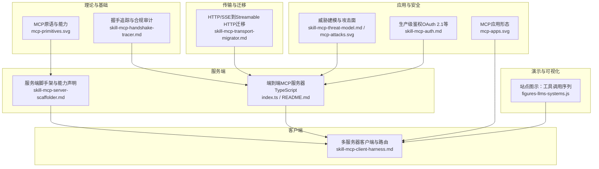
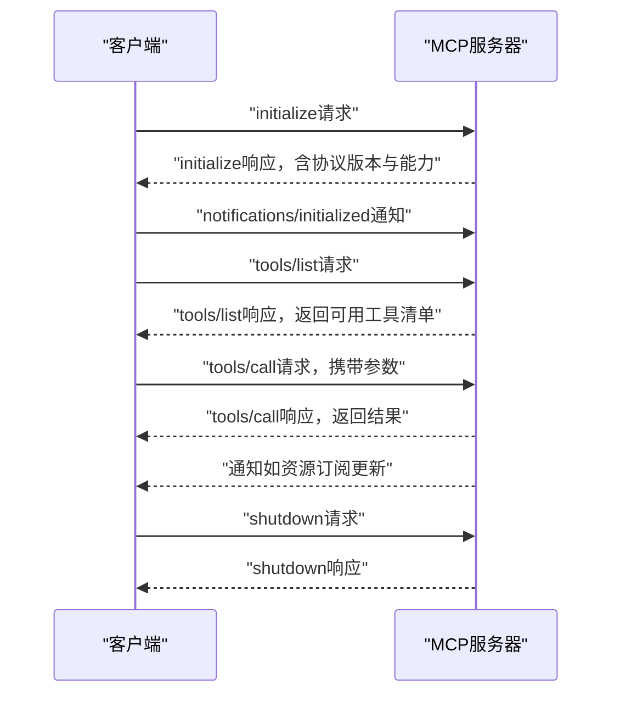
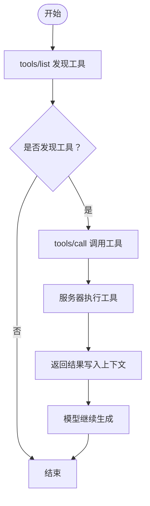
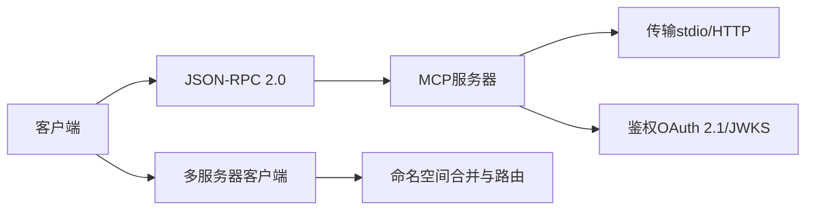

# MCP协议规范

<cite>
**本文引用的文件**
- [index.ts](file://phases/19-capstone-projects/13-mcp-server-with-registry/code/ts/src/index.ts)
- [README.md](file://phases/19-capstone-projects/13-mcp-server-with-registry/code/ts/README.md)
- [mcp-architecture.svg](file://phases/11-llm-engineering/14-model-context-protocol/assets/mcp-architecture.svg)
- [mcp-primitives.svg](file://phases/13-tools-and-protocols/06-mcp-fundamentals/assets/mcp-primitives.svg)
- [skill-mcp-handshake-tracer.md](file://phases/13-tools-and-protocols/06-mcp-fundamentals/outputs/skill-mcp-handshake-tracer.md)
- [skill-mcp-server-scaffolder.md](file://phases/13-tools-and-protocols/07-building-an-mcp-server/outputs/skill-mcp-server-scaffolder.md)
- [skill-mcp-client-harness.md](file://phases/13-tools-and-protocols/08-building-an-mcp-client/outputs/skill-mcp-client-harness.md)
- [skill-mcp-transport-migrator.md](file://phases/13-tools-and-protocols/09-mcp-transports/outputs/skill-mcp-transport-migrator.md)
- [mcp-apps.svg](file://phases/13-tools-and-protocols/14-mcp-apps/assets/mcp-apps.svg)
- [skill-mcp-threat-model.md](file://phases/13-tools-and-protocols/15-mcp-security-tool-poisoning/outputs/skill-mcp-threat-model.md)
- [mcp-attacks.svg](file://phases/13-tools-and-protocols/15-mcp-security-tool-poisoning/assets/mcp-attacks.svg)
- [skill-mcp-auth.md](file://phases/13-tools-and-protocols/18-mcp-auth-production/outputs/skill-mcp-auth.md)
- [figures-llms-systems.js](file://site/figures-llms-systems.js)
</cite>

## 目录
1. [引言](#引言)
2. [项目结构](#项目结构)
3. [核心组件](#核心组件)
4. [架构总览](#架构总览)
5. [详细组件分析](#详细组件分析)
6. [依赖关系分析](#依赖关系分析)
7. [性能考量](#性能考量)
8. [故障排查指南](#故障排查指南)
9. [结论](#结论)
10. [附录](#附录)

## 引言
本规范面向实现与使用 Model Context Protocol（MCP）的工程师与研究者，系统化定义MCP的消息格式、传输协议与事件类型；明确MCP服务器与客户端的握手、消息传递与状态管理；覆盖工具注册、发现与调用的完整流程；给出资源与提示模板的管理规范；并提供异步任务处理与安全加固的最佳实践。本文同时总结课程实验平台中MCP的应用场景与实施建议。

## 项目结构
仓库内围绕MCP形成了“理论学习—工具搭建—迁移与安全—应用实践”的完整路径：
- 理论与基础：MCP原语、握手与生命周期
- 工具与服务端：服务端脚手架与能力声明
- 客户端与路由：多服务器客户端与命名空间合并
- 传输与迁移：从HTTP+Server-Sent Events到Streamable HTTP
- 应用与安全：应用形态、威胁建模与生产级鉴权
- 实验与演示：端到端MCP服务器（TypeScript）与站点图示

**图表来源**
- [mcp-primitives.svg](file://phases/13-tools-and-protocols/06-mcp-fundamentals/assets/mcp-primitives.svg)
- [skill-mcp-handshake-tracer.md](file://phases/13-tools-and-protocols/06-mcp-fundamentals/outputs/skill-mcp-handshake-tracer.md)
- [skill-mcp-server-scaffolder.md](file://phases/13-tools-and-protocols/07-building-an-mcp-server/outputs/skill-mcp-server-scaffolder.md)
- [index.ts](file://phases/19-capstone-projects/13-mcp-server-with-registry/code/ts/src/index.ts)
- [README.md](file://phases/19-capstone-projects/13-mcp-server-with-registry/code/ts/README.md)
- [skill-mcp-client-harness.md](file://phases/13-tools-and-protocols/08-building-an-mcp-client/outputs/skill-mcp-client-harness.md)
- [skill-mcp-transport-migrator.md](file://phases/13-tools-and-protocols/09-mcp-transports/outputs/skill-mcp-transport-migrator.md)
- [mcp-apps.svg](file://phases/13-tools-and-protocols/14-mcp-apps/assets/mcp-apps.svg)
- [skill-mcp-threat-model.md](file://phases/13-tools-and-protocols/15-mcp-security-tool-poisoning/outputs/skill-mcp-threat-model.md)
- [mcp-attacks.svg](file://phases/13-tools-and-protocols/15-mcp-security-tool-poisoning/assets/mcp-attacks.svg)
- [skill-mcp-auth.md](file://phases/13-tools-and-protocols/18-mcp-auth-production/outputs/skill-mcp-auth.md)
- [figures-llms-systems.js](file://site/figures-llms-systems.js)

**章节来源**
- [index.ts:1-12](file://phases/19-capstone-projects/13-mcp-server-with-registry/code/ts/src/index.ts#L1-L12)
- [README.md:1-30](file://phases/19-capstone-projects/13-mcp-server-with-registry/code/ts/README.md#L1-L30)

## 核心组件
- 协议与版本
  - 使用JSON-RPC 2.0承载MCP方法调用；遵循MCP 2025-11-25规范。
  - 版本协商通过initialize响应返回的协议版本进行确认。
- 原语与能力
  - 原语包括：tools（工具）、resources（资源）、prompts（提示模板）、roots（根路径）、sampling（采样）、elicitation（启发）。
  - 能力由服务器在initialize时声明，客户端需在握手阶段完成能力协商。
- 传输与会话
  - 支持标准输入输出（stdio）传输，适合本地或受信环境。
  - 支持Streamable HTTP单端点（/mcp），GET用于SSE流，POST用于请求，DELETE终止会话。
- 安全与鉴权
  - 生产环境推荐OAuth 2.1（含PKCE）与JWKS轮询；对Origin进行显式白名单校验。
- 异步与通知
  - 服务器可向客户端推送通知（如resources/subscribe），客户端应非阻塞处理。

**章节来源**
- [index.ts:1-12](file://phases/19-capstone-projects/13-mcp-server-with-registry/code/ts/src/index.ts#L1-L12)
- [README.md:1-30](file://phases/19-capstone-projects/13-mcp-server-with-registry/code/ts/README.md#L1-L30)
- [skill-mcp-handshake-tracer.md:10-30](file://phases/13-tools-and-protocols/06-mcp-fundamentals/outputs/skill-mcp-handshake-tracer.md#L10-L30)
- [skill-mcp-transport-migrator.md:10-31](file://phases/13-tools-and-protocols/09-mcp-transports/outputs/skill-mcp-transport-migrator.md#L10-L31)
- [skill-mcp-auth.md](file://phases/13-tools-and-protocols/18-mcp-auth-production/outputs/skill-mcp-auth.md)

## 架构总览
下图展示MCP客户端与服务器之间的交互：客户端发起初始化握手，服务器返回能力列表；随后客户端查询工具清单并调用工具，工具执行结果写入上下文后驱动模型继续生成。

**图表来源**
- [figures-llms-systems.js:488-538](file://site/figures-llms-systems.js#L488-L538)
- [skill-mcp-handshake-tracer.md:10-30](file://phases/13-tools-and-protocols/06-mcp-fundamentals/outputs/skill-mcp-handshake-tracer.md#L10-L30)

## 详细组件分析

### 消息格式与协议
- JSON-RPC 2.0承载
  - 请求/响应/通知均采用JSON-RPC 2.0结构；方法名限定在MCP规范允许集合内，扩展需带前缀。
  - 初始化阶段必须完成能力协商，后续消息需满足已协商的能力约束。
- 方法集与事件
  - 生命周期：initialize → initialized通知 → 工具/资源/提示交互 → shutdown。
  - 工具调用：tools/list（发现）、tools/call（执行）。
  - 资源订阅：resources/read（读取）、resources/subscribe（订阅）。
  - 提示模板：prompts/invoke（调用）。
  - 采样与启发：sampling/createMessage、elicitation/...。
- 错误与合规
  - 对于超出规范的方法、未满足能力条件的调用、缺失关键生命周期步骤等情况，应返回相应JSON-RPC错误码并标注原因。

**章节来源**
- [skill-mcp-handshake-tracer.md:10-30](file://phases/13-tools-and-protocols/06-mcp-fundamentals/outputs/skill-mcp-handshake-tracer.md#L10-L30)

### 传输协议与会话管理
- stdio（本地/受信）
  - 手写newline-delimited JSON-RPC over stdio，便于观察字节流与调试。
  - 典型用于本地开发与沙箱环境。
- Streamable HTTP（生产）
  - 单端点/mcp：GET为SSE流，POST为请求，DELETE终止会话。
  - 会话连续性：首次POST生成Mcp-Session-Id，拒绝客户端自定义ID。
  - Origin白名单：仅允许预置生产域名，防止DNS重绑定等风险。
  - 迁移窗口：明确切线日期与60天宽限期，期间301跳转并告警。

**章节来源**
- [index.ts:1-12](file://phases/19-capstone-projects/13-mcp-server-with-registry/code/ts/src/index.ts#L1-L12)
- [README.md:1-30](file://phases/19-capstone-projects/13-mcp-server-with-registry/code/ts/README.md#L1-L30)
- [skill-mcp-transport-migrator.md:10-31](file://phases/13-tools-and-protocols/09-mcp-transports/outputs/skill-mcp-transport-migrator.md#L10-L31)

### 工具注册、发现与调用
- 注册与拆分
  - 将原子操作作为工具，只读数据作为资源，可复用的用户触发模板作为提示。
  - 数据库查询应区分：只读列表/读取作为资源，带参数的查询作为工具。
- 发现与路由
  - 客户端通过tools/list获取服务器能力；多服务器场景下进行命名空间合并，冲突策略可选前缀、拒绝或静默覆盖（后者不推荐）。
  - 调用时按工具归属路由至对应服务器，并基于请求ID匹配响应。
- 调用流程
  - 客户端先发tools/list，再发tools/call，服务器执行后返回结果；结果进入上下文，驱动模型继续生成。

**图表来源**
- [figures-llms-systems.js:488-538](file://site/figures-llms-systems.js#L488-L538)

**章节来源**
- [skill-mcp-server-scaffolder.md:10-31](file://phases/13-tools-and-protocols/07-building-an-mcp-server/outputs/skill-mcp-server-scaffolder.md#L10-L31)
- [skill-mcp-client-harness.md:10-31](file://phases/13-tools-and-protocols/08-building-an-mcp-client/outputs/skill-mcp-client-harness.md#L10-L31)

### 资源与提示模板管理
- 资源（resources）
  - 面向只读数据访问，支持URI方案与MIME类型；可启用resources/subscribe实现持久通知。
  - 不应暴露会话连续性与Origin校验之外的安全缺口。
- 提示模板（prompts）
  - 作为用户可触发的模板命令，参数列表清晰；避免与特权工具混用在同一命名空间。
- 应用形态（apps）
  - MCP应用可聚合多个服务器，形成统一的工具与资源视图，提升用户体验与安全性。

**章节来源**
- [skill-mcp-server-scaffolder.md:10-31](file://phases/13-tools-and-protocols/07-building-an-mcp-server/outputs/skill-mcp-server-scaffolder.md#L10-L31)
- [mcp-apps.svg](file://phases/13-tools-and-protocols/14-mcp-apps/assets/mcp-apps.svg)

### 异步任务与通知
- 订阅与通知
  - 服务器可通过resources/subscribe推送变更；客户端需非阻塞读取，避免通知导致的死锁。
- 任务状态与回查
  - 对于长耗时任务，建议引入异步任务机制并在客户端侧进行状态回查或回调。
- 并发与隔离
  - 多服务器客户端应为每个服务器独立进程与读线程，避免主循环阻塞。

**章节来源**
- [skill-mcp-client-harness.md:10-31](file://phases/13-tools-and-protocols/08-building-an-mcp-client/outputs/skill-mcp-client-harness.md#L10-L31)

### 安全与合规
- 威胁建模
  - 关注工具投毒、权限提升、信息泄露与会话劫持等风险；对高危工具设置破坏性提示与人工审批。
- 生产鉴权
  - 推荐OAuth 2.1（含PKCE）与JWKS轮询；对Origin进行白名单校验；会话ID必须加密随机生成。
- 合规审计
  - 握手追踪技能可对会话进行逐消息标注，检查能力声明、生命周期完整性与参数合规性。

**章节来源**
- [skill-mcp-threat-model.md](file://phases/13-tools-and-protocols/15-mcp-security-tool-poisoning/outputs/skill-mcp-threat-model.md)
- [mcp-attacks.svg](file://phases/13-tools-and-protocols/15-mcp-security-tool-poisoning/assets/mcp-attacks.svg)
- [skill-mcp-auth.md](file://phases/13-tools-and-protocols/18-mcp-auth-production/outputs/skill-mcp-auth.md)

## 依赖关系分析
- 组件耦合
  - 客户端与服务器通过JSON-RPC方法耦合，能力声明决定可用方法集。
  - 多服务器客户端依赖命名空间合并策略与路由函数。
- 外部依赖
  - 传输层依赖操作系统进程与管道（stdio）或HTTP服务器能力。
  - 安全层依赖OAuth 2.1与JWKS服务，以及Origin白名单配置。

**图表来源**
- [skill-mcp-client-harness.md:10-31](file://phases/13-tools-and-protocols/08-building-an-mcp-client/outputs/skill-mcp-client-harness.md#L10-L31)
- [skill-mcp-transport-migrator.md:10-31](file://phases/13-tools-and-protocols/09-mcp-transports/outputs/skill-mcp-transport-migrator.md#L10-L31)
- [skill-mcp-auth.md](file://phases/13-tools-and-protocols/18-mcp-auth-production/outputs/skill-mcp-auth.md)

**章节来源**
- [skill-mcp-client-harness.md:10-31](file://phases/13-tools-and-protocols/08-building-an-mcp-client/outputs/skill-mcp-client-harness.md#L10-L31)

## 性能考量
- I/O与并发
  - stdio模式下注意行分隔与缓冲；HTTP模式下合理设置长连接与SSE心跳。
- 路由与合并
  - 命名空间合并策略影响工具发现与调用延迟；建议默认采用前缀策略以降低冲突概率。
- 会话与重连
  - Streamable HTTP应保留最近事件的环形缓冲以便断线重连恢复。

[本节为通用指导，无需列出具体文件来源]

## 故障排查指南
- 握手与能力
  - 若出现“未声明能力即调用”类错误，检查initialize响应中的能力字段与客户端调用是否匹配。
- 生命周期完整性
  - 缺失initialized通知或tools/list未在shutdown前完成，会导致会话异常终止。
- 传输问题
  - stdio模式下确认newline-delimited解析正确；HTTP模式下核对Mcp-Session-Id生成与Origin白名单。
- 安全相关
  - 若出现403或会话被拒，检查Origin是否在白名单内，会话ID是否为服务端生成。

**章节来源**
- [skill-mcp-handshake-tracer.md:10-30](file://phases/13-tools-and-protocols/06-mcp-fundamentals/outputs/skill-mcp-handshake-tracer.md#L10-L30)
- [skill-mcp-transport-migrator.md:10-31](file://phases/13-tools-and-protocols/09-mcp-transports/outputs/skill-mcp-transport-migrator.md#L10-L31)

## 结论
MCP通过标准化的JSON-RPC承载与能力协商，实现了工具、资源与提示模板的统一抽象。结合安全的传输与鉴权策略、严谨的命名空间合并与路由机制，可在课程实验平台与生产环境中稳定落地。建议优先采用Streamable HTTP与OAuth 2.1，并在多服务器场景下严格限制工具数量与命名空间冲突。

[本节为总结性内容，无需列出具体文件来源]

## 附录

### MCP原语与能力概览
- 原语：tools、resources、prompts、roots、sampling、elicitation。
- 能力：由服务器在initialize中声明，客户端在握手阶段确认。

**章节来源**
- [mcp-primitives.svg](file://phases/13-tools-and-protocols/06-mcp-fundamentals/assets/mcp-primitives.svg)

### 端到端MCP服务器（TypeScript）要点
- 传输：手写JSON-RPC over stdio，便于观察与调试。
- 能力：通过initialize返回协议版本与能力对象。
- 工具：提供tools/list与tools/call；可扩展resources/subscribe与prompts/invoke。

**章节来源**
- [index.ts:1-12](file://phases/19-capstone-projects/13-mcp-server-with-registry/code/ts/src/index.ts#L1-L12)
- [README.md:1-30](file://phases/19-capstone-projects/13-mcp-server-with-registry/code/ts/README.md#L1-L30)