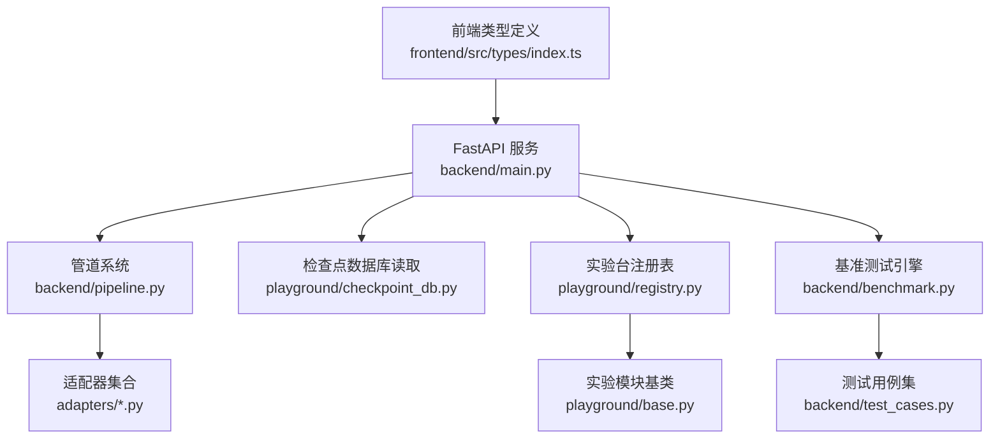
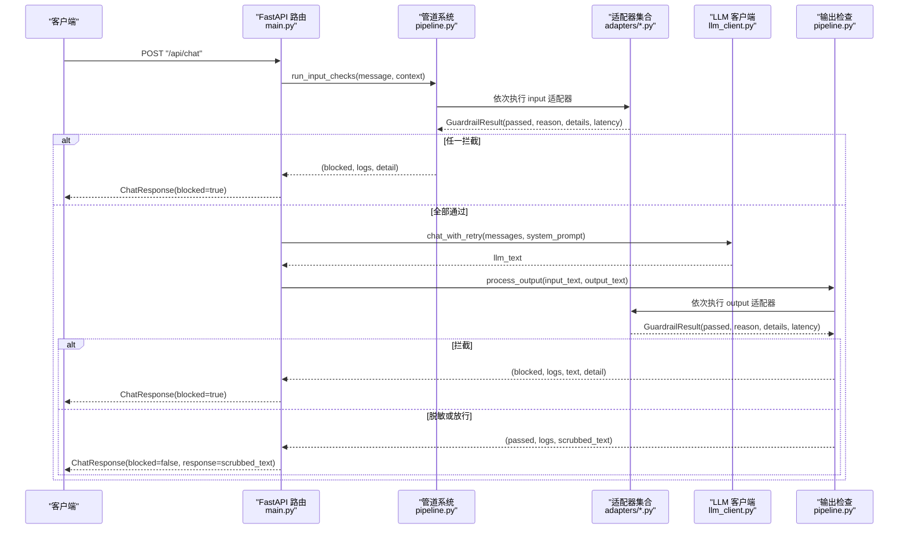
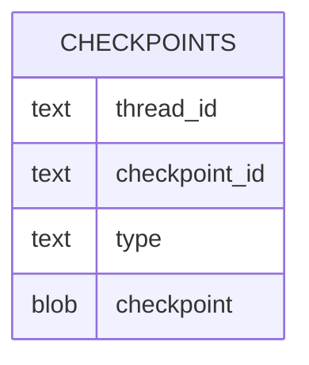
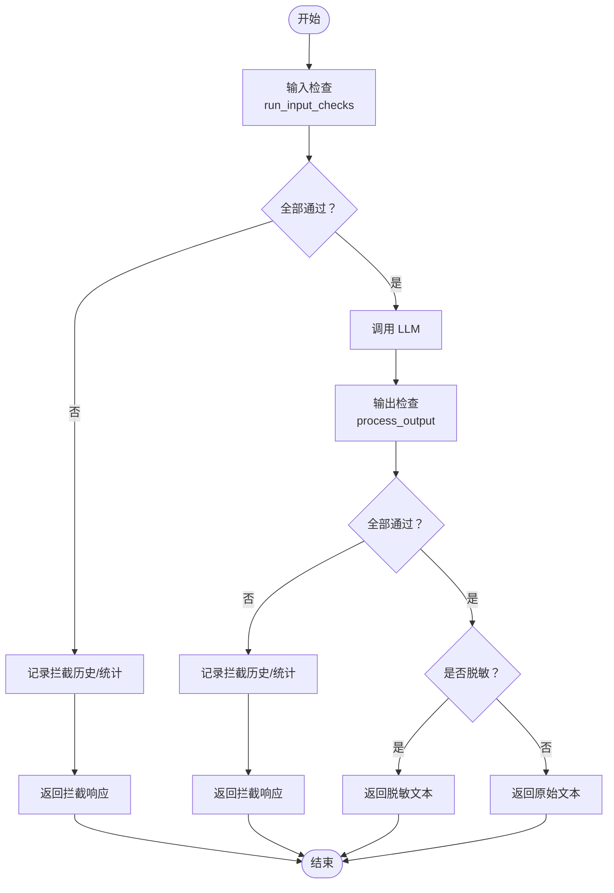
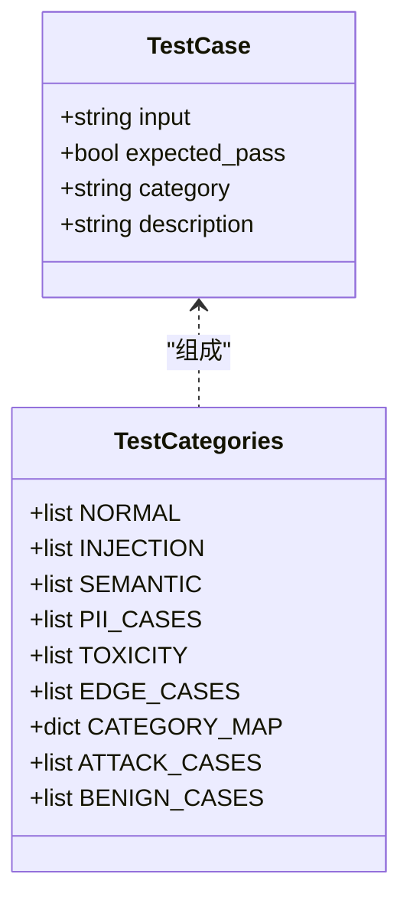
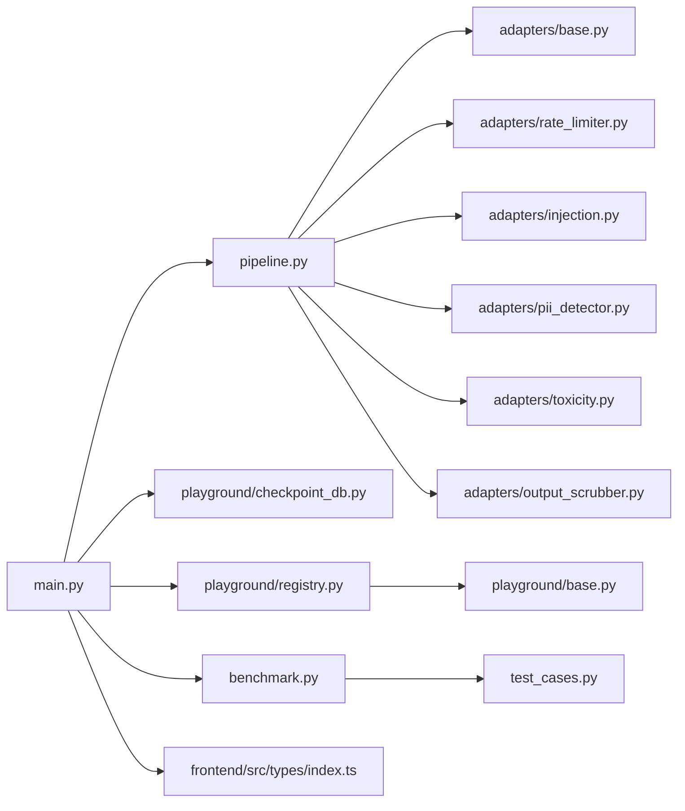

# 数据模型与接口

<cite>
**本文引用的文件**
- [guardrails-sandbox/backend/main.py](file://guardrails-sandbox/backend/main.py)
- [guardrails-sandbox/backend/pipeline.py](file://guardrails-sandbox/backend/pipeline.py)
- [guardrails-sandbox/backend/adapters/base.py](file://guardrails-sandbox/backend/adapters/base.py)
- [guardrails-sandbox/backend/adapters/rate_limiter.py](file://guardrails-sandbox/backend/adapters/rate_limiter.py)
- [guardrails-sandbox/backend/adapters/injection.py](file://guardrails-sandbox/backend/adapters/injection.py)
- [guardrails-sandbox/backend/adapters/pii_detector.py](file://guardrails-sandbox/backend/adapters/pii_detector.py)
- [guardrails-sandbox/backend/adapters/toxicity.py](file://guardrails-sandbox/backend/adapters/toxicity.py)
- [guardrails-sandbox/backend/adapters/output_scrubber.py](file://guardrails-sandbox/backend/adapters/output_scrubber.py)
- [guardrails-sandbox/backend/playground/checkpoint_db.py](file://guardrails-sandbox/backend/playground/checkpoint_db.py)
- [guardrails-sandbox/backend/test_cases.py](file://guardrails-sandbox/backend/test_cases.py)
- [guardrails-sandbox/backend/benchmark.py](file://guardrails-sandbox/backend/benchmark.py)
- [guardrails-sandbox/backend/playground/registry.py](file://guardrails-sandbox/backend/playground/registry.py)
- [guardrails-sandbox/backend/playground/base.py](file://guardrails-sandbox/backend/playground/base.py)
- [guardrails-sandbox/frontend/src/types/index.ts](file://guardrails-sandbox/frontend/src/types/index.ts)
</cite>

## 目录
1. [简介](#简介)
2. [项目结构](#项目结构)
3. [核心组件](#核心组件)
4. [架构总览](#架构总览)
5. [详细组件分析](#详细组件分析)
6. [依赖分析](#依赖分析)
7. [性能考量](#性能考量)
8. [故障排查指南](#故障排查指南)
9. [结论](#结论)
10. [附录](#附录)

## 简介
本文件面向“AI 工程学习实验台”项目，聚焦于数据模型与接口设计，涵盖以下方面：
- 检查点数据库 schema 设计与课程进度、实验结果、性能指标的存储与查询
- 管道系统的数据流转（输入/输出格式、中间状态、短路机制）
- 测试用例的数据结构与验证规则（类别划分、预期结果、评估指标）
- 数据访问模式、缓存策略与性能优化
- 数据生命周期管理、保留策略与归档规则
- 数据安全、隐私要求与访问控制
- 数据迁移路径与版本管理策略

## 项目结构
该项目采用前后端分离的沙箱系统，后端以 FastAPI 提供 API，前端以 TypeScript 类型驱动交互。核心模块包括：
- 管道系统：统一编排 Guardrail 适配器，支持输入/输出双通道检查与短路
- 适配器集合：基础 Guardrail（速率限制、注入检测、PII 检测、毒性过滤、输出脱敏等）
- 检查点数据库：LangGraph 检查点库只读读取与解析
- 基准测试：测试用例集合与评估引擎
- 课程实验台（Playground）：模块化实验注册与渲染块协议

图表来源
- [guardrails-sandbox/backend/main.py](file://guardrails-sandbox/backend/main.py)
- [guardrails-sandbox/backend/pipeline.py](file://guardrails-sandbox/backend/pipeline.py)
- [guardrails-sandbox/backend/adapters/base.py](file://guardrails-sandbox/backend/adapters/base.py)
- [guardrails-sandbox/backend/playground/checkpoint_db.py](file://guardrails-sandbox/backend/playground/checkpoint_db.py)
- [guardrails-sandbox/backend/playground/registry.py](file://guardrails-sandbox/backend/playground/registry.py)
- [guardrails-sandbox/backend/playground/base.py](file://guardrails-sandbox/backend/playground/base.py)
- [guardrails-sandbox/backend/benchmark.py](file://guardrails-sandbox/backend/benchmark.py)
- [guardrails-sandbox/backend/test_cases.py](file://guardrails-sandbox/backend/test_cases.py)
- [guardrails-sandbox/frontend/src/types/index.ts](file://guardrails-sandbox/frontend/src/types/index.ts)

章节来源
- [guardrails-sandbox/backend/main.py](file://guardrails-sandbox/backend/main.py)
- [guardrails-sandbox/frontend/src/types/index.ts](file://guardrails-sandbox/frontend/src/types/index.ts)

## 核心组件
- 管道系统（Pipeline）：负责注册适配器、按顺序执行输入/输出检查、短路拦截、统计与拦截历史记录
- 适配器基类（GuardrailAdapter）与结果（GuardrailResult）：统一的检查接口与返回结构
- 检查点数据库读取（checkpoint_db）：LangGraph 检查点库只读解析，支持 thread 过滤与消息解码
- 基准测试引擎（BenchmarkRunner）：对测试用例运行输入检查，统计准确率、TPR/FPR、按类别/层统计
- 测试用例（TestCase）：标准化输入、预期结果、类别与描述
- 课程实验台（Registry + PlaygroundModule + ModuleResult）：模块化实验注册与渲染块协议

章节来源
- [guardrails-sandbox/backend/pipeline.py](file://guardrails-sandbox/backend/pipeline.py)
- [guardrails-sandbox/backend/adapters/base.py](file://guardrails-sandbox/backend/adapters/base.py)
- [guardrails-sandbox/backend/playground/checkpoint_db.py](file://guardrails-sandbox/backend/playground/checkpoint_db.py)
- [guardrails-sandbox/backend/benchmark.py](file://guardrails-sandbox/backend/benchmark.py)
- [guardrails-sandbox/backend/test_cases.py](file://guardrails-sandbox/backend/test_cases.py)
- [guardrails-sandbox/backend/playground/registry.py](file://guardrails-sandbox/backend/playground/registry.py)
- [guardrails-sandbox/backend/playground/base.py](file://guardrails-sandbox/backend/playground/base.py)

## 架构总览
后端以 FastAPI 提供统一入口，路由将请求交由管道系统处理；管道系统按顺序执行适配器，遇到拦截即短路；LLM 调用完成后进入输出检查阶段；基准测试与检查点数据库读取作为独立能力提供。

图表来源
- [guardrails-sandbox/backend/main.py](file://guardrails-sandbox/backend/main.py)
- [guardrails-sandbox/backend/pipeline.py](file://guardrails-sandbox/backend/pipeline.py)
- [guardrails-sandbox/backend/adapters/base.py](file://guardrails-sandbox/backend/adapters/base.py)

## 详细组件分析

### 数据模型与接口

#### 1) 管道系统数据模型
- 统一输入/输出检查流程，支持短路与累计日志
- 统计信息：总次数、拦截数、通过数、按层统计
- 拦截历史：最多保留 50 条，包含时间戳、输入片段、适配器名、阶段、原因、置信度与详情
- 树形结构：按 group/category/order 展示适配器，便于前端渲染

章节来源
- [guardrails-sandbox/backend/pipeline.py](file://guardrails-sandbox/backend/pipeline.py)

#### 2) 适配器基类与结果
- GuardrailResult：统一返回结构，包含是否通过、原因、细节、置信度、耗时
- GuardrailAdapter：子类仅需实现 check()，统一管理 group/category/name/order/enabled

章节来源
- [guardrails-sandbox/backend/adapters/base.py](file://guardrails-sandbox/backend/adapters/base.py)

#### 3) 适配器实现要点
- 速率限制（RateLimiter）：按用户与等级维护滑动窗口，限制 RPM
- 注入检测（InjectionDetector）：正则匹配已知攻击模式与编码绕过
- PII 检测（PiiDetector）：识别手机号、邮箱、身份证、信用卡、IP 地址，部分类型仅警告
- 毒性过滤（ToxicityFilter）：检测暴力、违法、自残、仇恨、色情内容，支持安全上下文豁免
- 输出脱敏（OutputScrubber）：替换输出中的 PII 为占位符，不拦截

章节来源
- [guardrails-sandbox/backend/adapters/rate_limiter.py](file://guardrails-sandbox/backend/adapters/rate_limiter.py)
- [guardrails-sandbox/backend/adapters/injection.py](file://guardrails-sandbox/backend/adapters/injection.py)
- [guardrails-sandbox/backend/adapters/pii_detector.py](file://guardrails-sandbox/backend/adapters/pii_detector.py)
- [guardrails-sandbox/backend/adapters/toxicity.py](file://guardrails-sandbox/backend/adapters/toxicity.py)
- [guardrails-sandbox/backend/adapters/output_scrubber.py](file://guardrails-sandbox/backend/adapters/output_scrubber.py)

#### 4) 检查点数据库 schema 与读取
- 数据源：LangGraph 检查点库（SQLite），只读模式（mode=ro）
- 安全：限定在 DATA_DIR 内，禁止目录穿越
- 表结构：至少包含 checkpoints 表（包含 thread_id、checkpoint_id、type、checkpoint）
- 解析：使用 JsonPlusSerializer 解码 checkpoint，提取 messages 并转换为前端友好结构
- 查询：支持按 preset_key 选择库，按 thread_id 过滤，返回步骤列表与完整对话

图表来源
- [guardrails-sandbox/backend/playground/checkpoint_db.py](file://guardrails-sandbox/backend/playground/checkpoint_db.py)

章节来源
- [guardrails-sandbox/backend/playground/checkpoint_db.py](file://guardrails-sandbox/backend/playground/checkpoint_db.py)

#### 5) 基准测试数据结构与评估
- 测试用例：TestCase(input, expected_pass, category, description)
- 类别划分：normal、injection、semantic、pii、toxicity、edge
- 评估指标：TPR、FPR、精确率、F1、按类别/层统计、平均延迟
- 报告：汇总、按类别、按层、详细结果

章节来源
- [guardrails-sandbox/backend/test_cases.py](file://guardrails-sandbox/backend/test_cases.py)
- [guardrails-sandbox/backend/benchmark.py](file://guardrails-sandbox/backend/benchmark.py)

#### 6) 课程实验台（Playground）数据模型
- 注册表：集中注册模块，按 phase 分组，暴露 input_schema
- 模块基类：声明 name/display_name/description/phase/lesson/order/input_schema
- 结果协议：ModuleResult（ok、summary、blocks、latency_ms、error），blocks 为前端渲染块数组

章节来源
- [guardrails-sandbox/backend/playground/registry.py](file://guardrails-sandbox/backend/playground/registry.py)
- [guardrails-sandbox/backend/playground/base.py](file://guardrails-sandbox/backend/playground/base.py)

#### 7) 前端类型定义映射
- 适配器信息与树形结构、统计、拦截历史
- 对话响应、对比响应、基准测试结果
- 实验台模块元数据与渲染块类型

章节来源
- [guardrails-sandbox/frontend/src/types/index.ts](file://guardrails-sandbox/frontend/src/types/index.ts)

### 管道系统数据流与中间状态

图表来源
- [guardrails-sandbox/backend/pipeline.py](file://guardrails-sandbox/backend/pipeline.py)

章节来源
- [guardrails-sandbox/backend/pipeline.py](file://guardrails-sandbox/backend/pipeline.py)

### 测试用例数据结构与验证规则

图表来源
- [guardrails-sandbox/backend/test_cases.py](file://guardrails-sandbox/backend/test_cases.py)

章节来源
- [guardrails-sandbox/backend/test_cases.py](file://guardrails-sandbox/backend/test_cases.py)

## 依赖分析
- 管道系统依赖适配器集合，适配器之间无直接耦合，通过统一接口交互
- FastAPI 路由依赖管道系统与 LLM 客户端，基准测试与检查点数据库读取作为独立模块
- 前端类型定义与后端数据模型强绑定，确保接口一致性

图表来源
- [guardrails-sandbox/backend/main.py](file://guardrails-sandbox/backend/main.py)
- [guardrails-sandbox/backend/pipeline.py](file://guardrails-sandbox/backend/pipeline.py)
- [guardrails-sandbox/backend/adapters/base.py](file://guardrails-sandbox/backend/adapters/base.py)
- [guardrails-sandbox/backend/adapters/rate_limiter.py](file://guardrails-sandbox/backend/adapters/rate_limiter.py)
- [guardrails-sandbox/backend/adapters/injection.py](file://guardrails-sandbox/backend/adapters/injection.py)
- [guardrails-sandbox/backend/adapters/pii_detector.py](file://guardrails-sandbox/backend/adapters/pii_detector.py)
- [guardrails-sandbox/backend/adapters/toxicity.py](file://guardrails-sandbox/backend/adapters/toxicity.py)
- [guardrails-sandbox/backend/adapters/output_scrubber.py](file://guardrails-sandbox/backend/adapters/output_scrubber.py)
- [guardrails-sandbox/backend/playground/checkpoint_db.py](file://guardrails-sandbox/backend/playground/checkpoint_db.py)
- [guardrails-sandbox/backend/playground/registry.py](file://guardrails-sandbox/backend/playground/registry.py)
- [guardrails-sandbox/backend/playground/base.py](file://guardrails-sandbox/backend/playground/base.py)
- [guardrails-sandbox/backend/benchmark.py](file://guardrails-sandbox/backend/benchmark.py)
- [guardrails-sandbox/backend/test_cases.py](file://guardrails-sandbox/backend/test_cases.py)
- [guardrails-sandbox/frontend/src/types/index.ts](file://guardrails-sandbox/frontend/src/types/index.ts)

章节来源
- [guardrails-sandbox/backend/main.py](file://guardrails-sandbox/backend/main.py)
- [guardrails-sandbox/frontend/src/types/index.ts](file://guardrails-sandbox/frontend/src/types/index.ts)

## 性能考量
- 适配器执行顺序固定，按 order 排序，避免不必要的重复检查
- 速率限制使用滑动窗口，内存队列开销低，适合高并发场景
- 基准测试对状态进行快照/恢复，保证测试隔离与可重复性
- 检查点数据库只读连接，避免写锁与竞争
- 前端类型定义明确，减少序列化/反序列化错误与额外转换

## 故障排查指南
- 拦截历史：通过 /api/guardrails/block-history 获取最近拦截记录，定位具体适配器与阶段
- 统计信息：/api/guardrails 返回总体与按层统计，快速判断异常趋势
- 检查点读取：/api/checkpoints/inspect 支持 preset 与 thread_id 过滤，若报错检查路径与权限
- 基准测试：/api/benchmark 可按类别运行，结合 by_layer 与 details 定位适配器问题
- 适配器开关：/api/guardrails/toggle 动态启用/禁用，便于灰度验证

章节来源
- [guardrails-sandbox/backend/main.py](file://guardrails-sandbox/backend/main.py)
- [guardrails-sandbox/backend/pipeline.py](file://guardrails-sandbox/backend/pipeline.py)
- [guardrails-sandbox/backend/playground/checkpoint_db.py](file://guardrails-sandbox/backend/playground/checkpoint_db.py)
- [guardrails-sandbox/backend/benchmark.py](file://guardrails-sandbox/backend/benchmark.py)

## 结论
本项目通过清晰的数据模型与接口设计，实现了可扩展、可观测、可评测的 Guardrails 管道系统。检查点数据库、基准测试与实验台模块共同构成了完整的数据生命周期闭环，既满足教学演示需求，也为生产级部署提供了可参考的架构范式。

## 附录

### A. 数据访问模式与缓存策略
- 适配器缓存：语义模型预加载（离线模式），避免异步环境下的连接问题
- 速率限制缓存：内存滑动窗口，按用户维度维护
- 输出脱敏：无外部缓存，实时替换
- 前端缓存：类型定义静态校验，减少运行期错误

章节来源
- [guardrails-sandbox/backend/main.py](file://guardrails-sandbox/backend/main.py)
- [guardrails-sandbox/backend/adapters/rate_limiter.py](file://guardrails-sandbox/backend/adapters/rate_limiter.py)
- [guardrails-sandbox/backend/adapters/output_scrubber.py](file://guardrails-sandbox/backend/adapters/output_scrubber.py)

### B. 数据生命周期管理、保留策略与归档规则
- 拦截历史：最多保留 50 条，超出后移除最旧项
- 统计：持久化于进程内字典，重启丢失；可通过重置接口清空
- 检查点数据库：只读访问，不涉及写入；归档由外部管理
- 基准测试：每次运行生成新结果，不保留历史；可通过外部存储归档

章节来源
- [guardrails-sandbox/backend/pipeline.py](file://guardrails-sandbox/backend/pipeline.py)
- [guardrails-sandbox/backend/benchmark.py](file://guardrails-sandbox/backend/benchmark.py)
- [guardrails-sandbox/backend/playground/checkpoint_db.py](file://guardrails-sandbox/backend/playground/checkpoint_db.py)

### C. 数据安全、隐私要求与访问控制
- 检查点数据库：只读模式（mode=ro），路径解析严格限制在 DATA_DIR 内，防止目录穿越
- PII 处理：输入检测与输出脱敏，敏感信息以哈希摘要形式记录，避免明文泄露
- 速率限制：按用户维度与等级控制，防止滥用
- CORS：允许跨域访问，生产环境建议收紧

章节来源
- [guardrails-sandbox/backend/playground/checkpoint_db.py](file://guardrails-sandbox/backend/playground/checkpoint_db.py)
- [guardrails-sandbox/backend/adapters/pii_detector.py](file://guardrails-sandbox/backend/adapters/pii_detector.py)
- [guardrails-sandbox/backend/adapters/output_scrubber.py](file://guardrails-sandbox/backend/adapters/output_scrubber.py)
- [guardrails-sandbox/backend/adapters/rate_limiter.py](file://guardrails-sandbox/backend/adapters/rate_limiter.py)
- [guardrails-sandbox/backend/main.py](file://guardrails-sandbox/backend/main.py)

### D. 数据迁移路径与版本管理策略
- 适配器演进：通过新增/调整 check() 逻辑与阈值，保持向后兼容；必要时引入版本字段
- 基准测试：新增用例加入 ALL_CASES 与 CATEGORY_MAP，评估指标保持稳定
- 检查点数据库：LangGraph 版本升级时，确保 JsonPlusSerializer 兼容或提供迁移脚本
- 前端类型：变更时同步更新 TypeScript 定义，保证编译期校验

章节来源
- [guardrails-sandbox/backend/test_cases.py](file://guardrails-sandbox/backend/test_cases.py)
- [guardrails-sandbox/backend/playground/checkpoint_db.py](file://guardrails-sandbox/backend/playground/checkpoint_db.py)
- [guardrails-sandbox/frontend/src/types/index.ts](file://guardrails-sandbox/frontend/src/types/index.ts)