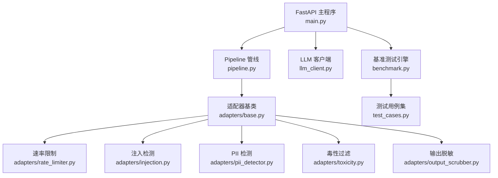
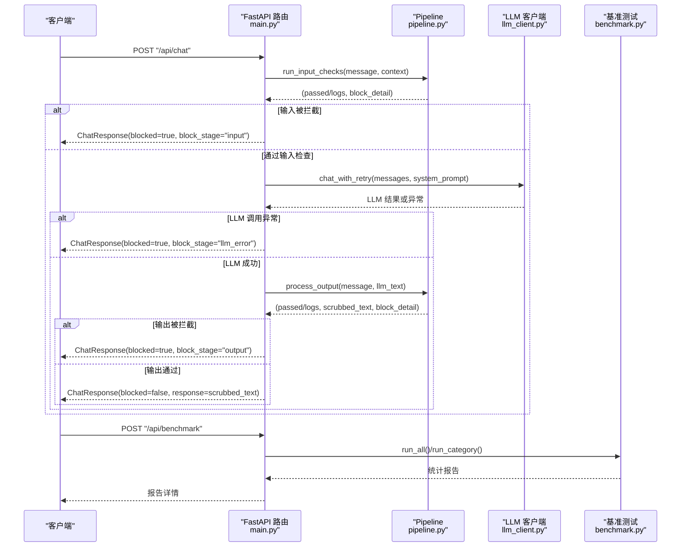
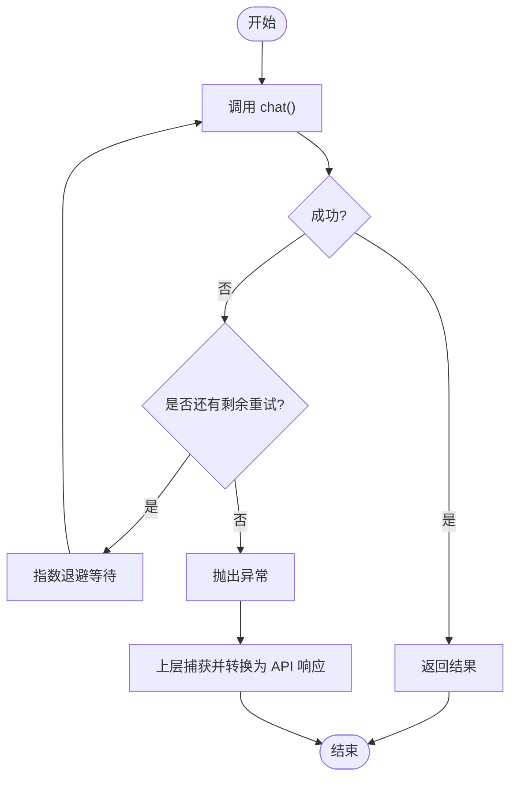
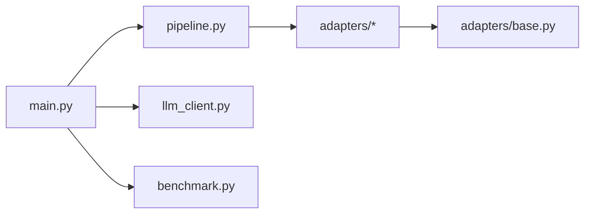

# 错误处理与调试

<cite>
**本文引用的文件**
- [main.py](file://guardrails-sandbox/backend/main.py)
- [llm_client.py](file://guardrails-sandbox/backend/llm_client.py)
- [pipeline.py](file://guardrails-sandbox/backend/pipeline.py)
- [benchmark.py](file://guardrails-sandbox/backend/benchmark.py)
- [base.py](file://guardrails-sandbox/backend/adapters/base.py)
- [rate_limiter.py](file://guardrails-sandbox/backend/adapters/rate_limiter.py)
- [injection.py](file://guardrails-sandbox/backend/adapters/injection.py)
- [output_scrubber.py](file://guardrails-sandbox/backend/adapters/output_scrubber.py)
- [pii_detector.py](file://guardrails-sandbox/backend/adapters/pii_detector.py)
- [toxicity.py](file://guardrails-sandbox/backend/adapters/toxicity.py)
- [test_cases.py](file://guardrails-sandbox/backend/test_cases.py)
- [test_production.py](file://test_production.py)
</cite>

## 目录
1. [简介](#简介)
2. [项目结构](#项目结构)
3. [核心组件](#核心组件)
4. [架构总览](#架构总览)
5. [详细组件分析](#详细组件分析)
6. [依赖分析](#依赖分析)
7. [性能考量](#性能考量)
8. [故障排查指南](#故障排查指南)
9. [结论](#结论)
10. [附录](#附录)

## 简介
本文件聚焦于“防护墙适配器”“LLM 客户端”“基准测试”以及“API 错误处理”的设计与实现，系统梳理错误类型、错误码与错误消息格式，说明输入验证、输出过滤与安全检查失败的处理策略；总结 LLM 客户端的错误恢复与重试机制；记录基准测试中的异常与故障诊断方法；并提供调试工具与日志记录最佳实践，以及 API 监控、告警与性能追踪的配置思路。

## 项目结构
- 后端采用 FastAPI 提供 REST API，统一入口位于主程序，负责路由、适配器注册、LLM 调用与基准测试调度。
- 管线（Pipeline）串联多个 Guardrail 适配器，按类别与顺序执行，支持短路拦截与统计。
- 适配器模块化，涵盖速率限制、注入检测、PII 检测、毒性过滤、输出脱敏等。
- LLM 客户端封装 Anthropic API，提供带指数退避的重试与消息格式化。
- 基准测试引擎对用例集进行批量评估，产出统计指标与拦截层定位。

图表来源
- [main.py:118-280](file://guardrails-sandbox/backend/main.py#L118-L280)
- [pipeline.py:12-285](file://guardrails-sandbox/backend/pipeline.py#L12-L285)
- [llm_client.py:1-51](file://guardrails-sandbox/backend/llm_client.py#L1-L51)
- [benchmark.py:10-169](file://guardrails-sandbox/backend/benchmark.py#L10-L169)
- [base.py:14-34](file://guardrails-sandbox/backend/adapters/base.py#L14-L34)
- [rate_limiter.py:7-56](file://guardrails-sandbox/backend/adapters/rate_limiter.py#L7-L56)
- [injection.py:44-88](file://guardrails-sandbox/backend/adapters/injection.py#L44-L88)
- [pii_detector.py:19-54](file://guardrails-sandbox/backend/adapters/pii_detector.py#L19-L54)
- [toxicity.py:22-64](file://guardrails-sandbox/backend/adapters/toxicity.py#L22-L64)
- [output_scrubber.py:16-56](file://guardrails-sandbox/backend/adapters/output_scrubber.py#L16-L56)
- [test_cases.py:10-155](file://guardrails-sandbox/backend/test_cases.py#L10-L155)

章节来源
- [main.py:118-280](file://guardrails-sandbox/backend/main.py#L118-L280)
- [pipeline.py:12-285](file://guardrails-sandbox/backend/pipeline.py#L12-L285)

## 核心组件
- 防护墙适配器（Guardrail Adapter）
  - 统一接口：check(text, context) 返回 GuardrailResult，包含是否通过、原因、置信度、延迟等。
  - 分类：input（输入）与 output（输出）两类，按 order 排序执行。
- Pipeline 管线
  - 注册适配器，按类别与顺序执行；任一拦截即短路；收集日志与统计；记录拦截历史。
- LLM 客户端
  - 封装 Anthropic API，提供带指数退避的重试与消息格式化。
- 基准测试引擎
  - 对用例集运行 input checks，统计准确率、TPR/FPR、按类别与拦截层聚合，并记录拦截原因。

章节来源
- [base.py:5-34](file://guardrails-sandbox/backend/adapters/base.py#L5-L34)
- [pipeline.py:31-160](file://guardrails-sandbox/backend/pipeline.py#L31-L160)
- [llm_client.py:33-44](file://guardrails-sandbox/backend/llm_client.py#L33-L44)
- [benchmark.py:29-80](file://guardrails-sandbox/backend/benchmark.py#L29-L80)

## 架构总览
下图展示 API 调用链与错误处理路径：输入经 Pipeline 的 input 适配器短路拦截；通过后调用 LLM 客户端；输出经 Pipeline 的 output 适配器过滤或脱敏；异常在各层被捕获并转化为统一响应。

图表来源
- [main.py:155-220](file://guardrails-sandbox/backend/main.py#L155-L220)
- [pipeline.py:31-160](file://guardrails-sandbox/backend/pipeline.py#L31-L160)
- [llm_client.py:33-44](file://guardrails-sandbox/backend/llm_client.py#L33-L44)
- [benchmark.py:14-27](file://guardrails-sandbox/backend/benchmark.py#L14-L27)

## 详细组件分析

### 防护墙适配器与错误类型
- 适配器基类与结果
  - GuardrailResult 字段：passed、reason、details、confidence、latency_ms。
  - GuardrailAdapter 属性：name/display_name/description/group/category/order/enabled。
- 适配器实现要点
  - 速率限制：按用户与等级限制 RPM，超限返回拦截，记录置信度与当前次数。
  - 注入检测：正则匹配攻击模式与编码绕过，阈值决定是否拦截。
  - PII 检测：识别手机号、邮箱、身份证、信用卡等，部分类型仅警告。
  - 毒性过滤：检测暴力、违法、自残、仇恨、色情内容，支持安全上下文豁免。
  - 输出脱敏：替换 PII 为占位符，不影响通过，但修改上下文输出。
- 错误类型与拦截阶段
  - 输入阶段拦截：输入被拦截时，返回 ChatResponse，block_stage="input"。
  - 输出阶段拦截：输出被拦截时，返回 ChatResponse，block_stage="output"。
  - LLM 调用异常：捕获异常并返回 ChatResponse，block_stage="llm_error"。

章节来源
- [base.py:5-34](file://guardrails-sandbox/backend/adapters/base.py#L5-L34)
- [rate_limiter.py:22-55](file://guardrails-sandbox/backend/adapters/rate_limiter.py#L22-L55)
- [injection.py:53-87](file://guardrails-sandbox/backend/adapters/injection.py#L53-L87)
- [pii_detector.py:28-53](file://guardrails-sandbox/backend/adapters/pii_detector.py#L28-L53)
- [toxicity.py:31-63](file://guardrails-sandbox/backend/adapters/toxicity.py#L31-L63)
- [output_scrubber.py:25-55](file://guardrails-sandbox/backend/adapters/output_scrubber.py#L25-L55)
- [main.py:160-220](file://guardrails-sandbox/backend/main.py#L160-L220)

### LLM 客户端错误恢复与重试机制
- 客户端初始化与调用
  - 使用环境变量配置 API Key 与 Base URL，默认模型固定。
  - chat(messages, system_prompt) 直接调用 API 并解析响应。
- 重试策略
  - 指数退避：第 1 次等待 2^0~1 秒，第 2 次等待 2^1~3 秒，依此类推，最多重试 N 次。
  - 异常传播：超过最大重试次数后抛出异常，由上层捕获并转换为 API 响应。
- 消息格式化
  - format_messages 将历史与当前查询组装为标准 messages 列表。

图表来源
- [llm_client.py:33-44](file://guardrails-sandbox/backend/llm_client.py#L33-L44)
- [llm_client.py:46-51](file://guardrails-sandbox/backend/llm_client.py#L46-L51)

章节来源
- [llm_client.py:11-51](file://guardrails-sandbox/backend/llm_client.py#L11-L51)

### 基准测试中的异常与故障诊断
- 用例集
  - 包含正常查询、注入攻击、语义变种、PII、毒性、边界情况等类别，用于评估拦截效果。
- 运行流程
  - 保存/恢复适配器状态与速率限制窗口，避免跨用例干扰。
  - 对每个用例仅运行 input checks，不调用 LLM，确保可重复与可控。
  - 统计正确率、TPR/FPR、精确率、F1 分数与平均延迟。
- 故障诊断
  - 通过 details 与 blocked_by 定位具体拦截层。
  - 按类别与拦截层聚合，识别薄弱环节与误报热点。

章节来源
- [test_cases.py:10-155](file://guardrails-sandbox/backend/test_cases.py#L10-L155)
- [benchmark.py:14-80](file://guardrails-sandbox/backend/benchmark.py#L14-L80)
- [benchmark.py:82-169](file://guardrails-sandbox/backend/benchmark.py#L82-L169)

### API 错误处理与响应格式
- 统一响应模型
  - ChatResponse：包含 response、blocked、block_stage、block_reason、block_detail、guardrail_logs、total_latency_ms、llm_latency_ms。
  - CompareResponse：对比“无防护”与“有防护”的两次调用结果。
- 错误场景
  - 输入拦截：block_stage="input"，返回拦截原因与置信度细节。
  - 输出拦截：block_stage="output"，返回拦截原因与脱敏后的输出。
  - LLM 调用异常：block_stage="llm_error"，返回异常字符串作为 block_reason。
- 路由与状态码
  - 切换适配器：未找到时返回 404 与错误信息。
  - 检查点读取：ValueError/FileNotFoundError 返回明确错误；其他异常返回“读取出错”。

章节来源
- [main.py:90-112](file://guardrails-sandbox/backend/main.py#L90-L112)
- [main.py:147-152](file://guardrails-sandbox/backend/main.py#L147-L152)
- [main.py:155-220](file://guardrails-sandbox/backend/main.py#L155-L220)
- [main.py:398-403](file://guardrails-sandbox/backend/main.py#L398-L403)

## 依赖分析
- 组件耦合
  - main.py 依赖 pipeline、llm_client、benchmark；pipeline 依赖各适配器；适配器依赖 base。
- 外部依赖
  - LLM 客户端依赖第三方 API（Anthropic），需配置 API Key 与 Base URL。
  - 语义模型加载受离线模式影响，需确保本地缓存可用。
- 潜在风险
  - 适配器顺序与阈值直接影响拦截效果，需通过基准测试持续校验。
  - LLM 重试策略与超时设置需结合 SLA 与成本控制。

图表来源
- [main.py:16-18](file://guardrails-sandbox/backend/main.py#L16-L18)
- [pipeline.py:9](file://guardrails-sandbox/backend/pipeline.py#L9)
- [base.py:1-34](file://guardrails-sandbox/backend/adapters/base.py#L1-L34)

章节来源
- [main.py:16-18](file://guardrails-sandbox/backend/main.py#L16-L18)
- [pipeline.py:9](file://guardrails-sandbox/backend/pipeline.py#L9)

## 性能考量
- 适配器延迟
  - 各适配器在 GuardrailResult 中记录 latency_ms，便于定位慢点。
- 管线统计
  - 统计 total/blocked/passed 与按层统计，辅助优化瓶颈层。
- LLM 重试
  - 指数退避降低并发峰值，但增加尾延迟；需结合 QPS 与 SLA 调参。
- 基准测试
  - 以平均延迟与吞吐衡量整体性能，结合 TPR/FPR 评估质量。

章节来源
- [pipeline.py:247-262](file://guardrails-sandbox/backend/pipeline.py#L247-L262)
- [benchmark.py:145-147](file://guardrails-sandbox/backend/benchmark.py#L145-L147)
- [llm_client.py:33-44](file://guardrails-sandbox/backend/llm_client.py#L33-L44)

## 故障排查指南
- 常见错误与定位
  - 输入拦截：查看 block_stage="input" 与 guardrail_logs，确认具体适配器与置信度。
  - 输出拦截：查看 block_stage="output" 与 block_detail，定位拦截层与原因。
  - LLM 调用异常：查看 block_stage="llm_error" 与 block_reason，核对 API Key、Base URL 与网络连通性。
  - 检查点读取失败：区分 ValueError/FileNotFoundError 与通用异常，前者为参数/文件问题，后者为运行时错误。
- 适配器开关与状态
  - 使用切换接口临时禁用可疑适配器，观察拦截率变化以定位问题。
  - 清空拦截历史以便重新采样。
- 基准测试回归
  - 运行指定类别用例，比对 TPR/FPR 与按层统计，发现回归或误报。
- 日志与可观测性
  - 服务端日志包含请求 ID、模型、token、延迟、成本、模板版本与错误标记。
  - 健康检查返回缓存统计、成本汇总与最近请求条目。

章节来源
- [main.py:147-152](file://guardrails-sandbox/backend/main.py#L147-L152)
- [main.py:259-265](file://guardrails-sandbox/backend/main.py#L259-L265)
- [main.py:398-403](file://guardrails-sandbox/backend/main.py#L398-L403)
- [test_production.py:391-415](file://test_production.py#L391-L415)

## 结论
本项目通过模块化的防护墙适配器与统一的 Pipeline 编排，实现了输入/输出双层安全与性能可观测性。LLM 客户端采用指数退避重试保障稳定性；基准测试提供量化评估与回归检测。配合完善的日志与健康检查，能够快速定位与修复异常，支撑生产级部署。

## 附录

### API 错误类型与响应字段
- ChatResponse
  - 字段：response、blocked、block_stage、block_reason、block_detail、guardrail_logs、total_latency_ms、llm_latency_ms。
- CompareResponse
  - 字段：without_guardrails（ChatResponse）、with_guardrails（ChatResponse）。
- 错误场景映射
  - 输入拦截：block_stage="input"，返回拦截原因与置信度。
  - 输出拦截：block_stage="output"，返回拦截原因与脱敏输出。
  - LLM 调用异常：block_stage="llm_error"，返回异常字符串。

章节来源
- [main.py:90-112](file://guardrails-sandbox/backend/main.py#L90-L112)
- [main.py:155-220](file://guardrails-sandbox/backend/main.py#L155-L220)

### 防护墙适配器清单与职责
- 速率限制：按用户与等级限制 RPM，超限拦截。
- 注入检测：正则匹配攻击模式与编码绕过，阈值拦截。
- PII 检测：识别敏感信息，部分类型仅警告。
- 毒性过滤：检测暴力、违法、自残、仇恨、色情内容，支持安全上下文豁免。
- 输出脱敏：替换 PII 为占位符，不影响通过。

章节来源
- [rate_limiter.py:7-56](file://guardrails-sandbox/backend/adapters/rate_limiter.py#L7-L56)
- [injection.py:44-88](file://guardrails-sandbox/backend/adapters/injection.py#L44-L88)
- [pii_detector.py:19-54](file://guardrails-sandbox/backend/adapters/pii_detector.py#L19-L54)
- [toxicity.py:22-64](file://guardrails-sandbox/backend/adapters/toxicity.py#L22-L64)
- [output_scrubber.py:16-56](file://guardrails-sandbox/backend/adapters/output_scrubber.py#L16-L56)

### 基准测试用例类别
- 正常查询、注入攻击、语义变种、PII、毒性、边界情况。
- 用于评估拦截率（TPR）、误拦率（FPR）、精确率与 F1 分数。

章节来源
- [test_cases.py:18-155](file://guardrails-sandbox/backend/test_cases.py#L18-L155)

### 调试工具与日志记录最佳实践
- 服务端日志
  - 包含请求 ID、用户 ID、时间戳、模型、输入/输出 token、延迟、缓存命中、成本、模板版本与错误标记。
- 健康检查
  - 返回服务状态、缓存统计、成本汇总与最近请求条目。
- 建议
  - 为关键路径添加结构化日志与 span ID，便于分布式追踪。
  - 对异常与拦截事件打标签，接入监控面板与告警规则。

章节来源
- [test_production.py:391-415](file://test_production.py#L391-L415)

### API 监控、告警与性能追踪配置思路
- 指标采集
  - 请求量、错误率、拦截率、LLM 调用延迟、适配器延迟、缓存命中率、成本。
- 告警规则
  - 错误率突增、拦截率异常波动、LLM 调用失败率上升、延迟 P95 超阈。
- 追踪
  - 为每次请求分配 trace_id，串联输入检查、LLM 调用与输出处理链路。
- 配置建议
  - 使用统一埋点 SDK（如 OpenTelemetry），结合时序数据库与可视化面板。

[本节为概念性指导，无需源码引用]