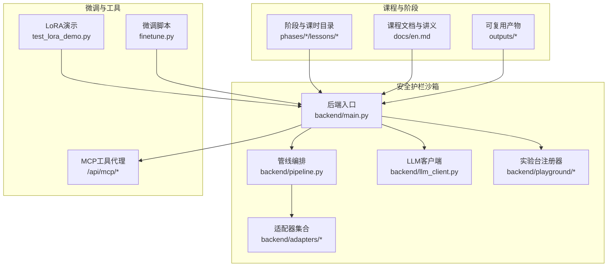
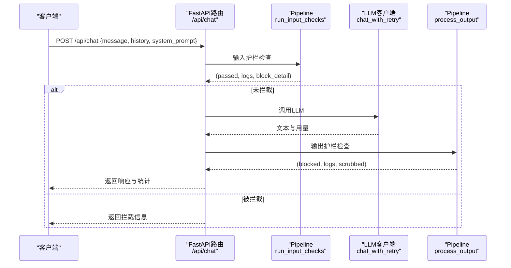
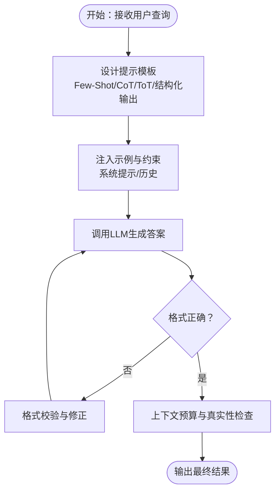
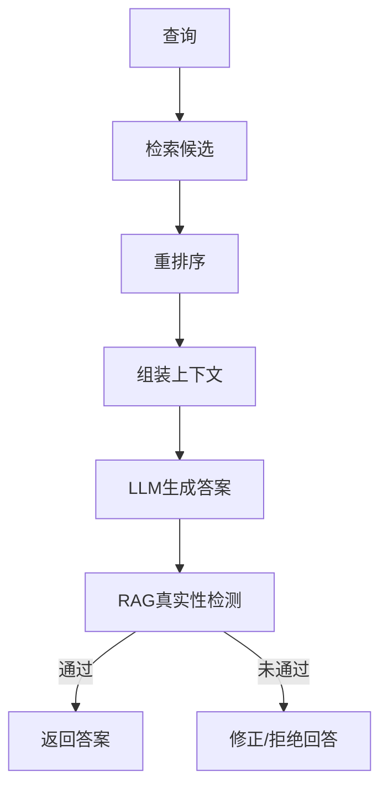
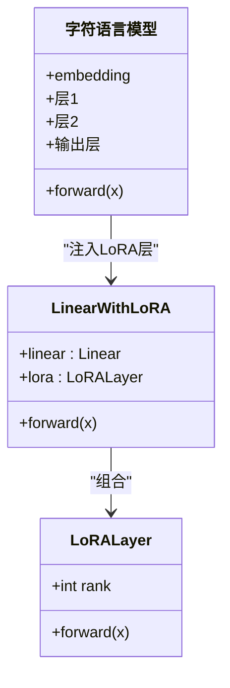
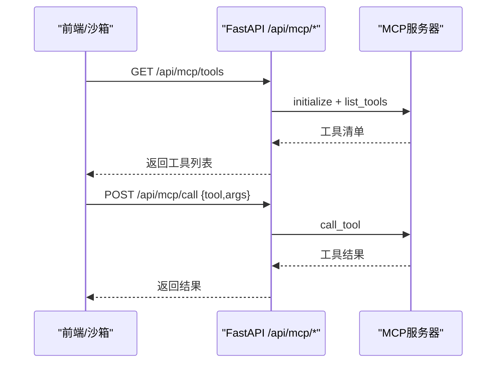
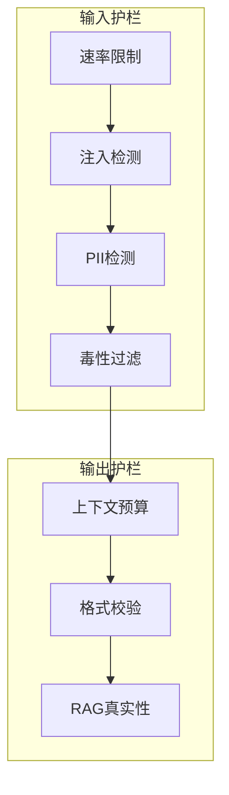
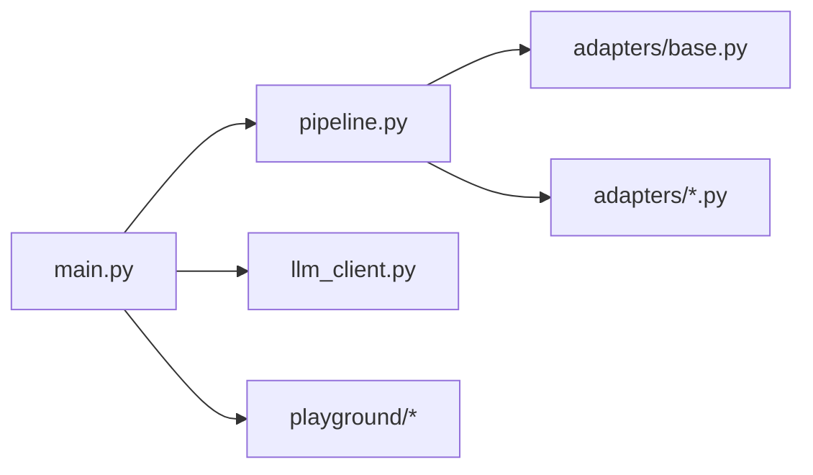

# LLM工程实践

<cite>
**本文引用的文件**
- [README.md](file://README.md)
- [main.py](file://guardrails-sandbox/backend/main.py)
- [pipeline.py](file://guardrails-sandbox/backend/pipeline.py)
- [llm_client.py](file://guardrails-sandbox/backend/llm_client.py)
- [base.py](file://guardrails-sandbox/backend/adapters/base.py)
- [rate_limiter.py](file://guardrails-sandbox/backend/adapters/rate_limiter.py)
- [injection.py](file://guardrails-sandbox/backend/adapters/injection.py)
- [pii_detector.py](file://guardrails-sandbox/backend/adapters/pii_detector.py)
- [toxicity.py](file://guardrails-sandbox/backend/adapters/toxicity.py)
- [context_engine.py](file://guardrails-sandbox/backend/adapters/context_engine.py)
- [rag_groundedness.py](file://guardrails-sandbox/backend/adapters/rag_groundedness.py)
- [format_validator.py](file://guardrails-sandbox/backend/adapters/format_validator.py)
- [test_lora_demo.py](file://test_lora_demo.py)
- [finetune.py](file://finetune.py)
</cite>

## 目录
1. [引言](#引言)
2. [项目结构](#项目结构)
3. [核心组件](#核心组件)
4. [架构总览](#架构总览)
5. [详细组件分析](#详细组件分析)
6. [依赖关系分析](#依赖关系分析)
7. [性能考量](#性能考量)
8. [故障排查指南](#故障排查指南)
9. [结论](#结论)
10. [附录](#附录)

## 引言
本文件面向“LLM工程实践”课程，系统梳理仓库中与提示工程、RAG系统、微调技术、安全防护等生产级LLM应用开发相关的知识与代码资产。通过“从零到一”的工程化视角，结合交互式沙箱与课程实验模块，帮助读者掌握：
- 提示工程技术：few-shot、思维链（CoT）、树状思考（ToT）等模式与最佳实践
- RAG系统：检索、重排序、生成与真实性校验
- LoRA/QLoRA高效微调：参数高效注入、训练与合并
- 函数调用与工具使用：MCP协议与工具生态
- 评估与测试：格式校验、幻觉检测、基准评测
- 生产工程：缓存策略、成本控制、可观测性与安全护栏

## 项目结构
本仓库采用“阶段化课程 + 实践工坊”的组织方式，每个阶段包含若干课时，每课时提供可运行的代码、文档与可复用产物。与本课程目标直接相关的核心模块包括：
- 交互式安全护栏沙箱：FastAPI后端 + Guardrail管线编排 + 多种适配器（输入/输出）
- 课程实验台：Playground模块注册与运行
- 微调演示：LoRA/QLoRA微调前后对比与训练脚本
- MCP工具代理：与外部工具/服务器进行标准化通信

**图示来源**
- [README.md:243-820](file://README.md#L243-L820)
- [main.py:1-421](file://guardrails-sandbox/backend/main.py#L1-L421)
- [pipeline.py:1-285](file://guardrails-sandbox/backend/pipeline.py#L1-L285)

**章节来源**
- [README.md:243-820](file://README.md#L243-L820)

## 核心组件
- Guardrail管线（Pipeline）：统一注册、排序与执行各类护栏适配器，支持输入/输出双通道、统计与拦截历史记录
- 适配器（Adapter）：以插件化方式实现速率限制、注入检测、PII检测、毒性过滤、上下文预算、RAG真实性、格式校验等
- LLM客户端：封装Anthropic API调用，支持重试与消息格式化
- 实验台（Playground）：模块化注册与运行，便于教学与演示
- 微调工具：LoRA/QLoRA参数高效微调与合并，支持快速对比训练效果

**章节来源**
- [pipeline.py:12-285](file://guardrails-sandbox/backend/pipeline.py#L12-L285)
- [base.py:14-34](file://guardrails-sandbox/backend/adapters/base.py#L14-L34)
- [llm_client.py:1-51](file://guardrails-sandbox/backend/llm_client.py#L1-L51)

## 架构总览
交互式沙箱以FastAPI提供REST接口，内部通过Pipeline串联多个Guardrail适配器，形成“输入护栏 → LLM调用 → 输出护栏”的闭环；同时提供对比模式、基准评测、MCP工具代理与实验台。

**图示来源**
- [main.py:155-221](file://guardrails-sandbox/backend/main.py#L155-L221)
- [pipeline.py:31-161](file://guardrails-sandbox/backend/pipeline.py#L31-L161)
- [llm_client.py:33-51](file://guardrails-sandbox/backend/llm_client.py#L33-L51)

## 详细组件分析

### 提示工程与模式
- Few-Shot：通过在系统提示或历史中注入少量示例，引导模型遵循特定风格或格式
- 思维链（CoT）：在推理过程中显式写出中间步骤，降低复杂任务的错误率
- 树状思考（ToT）：在分支探索中评估不同路径，适合需要规划与权衡的任务
- 结构化输出：限定输出格式（JSON/代码块），并通过格式校验适配器保证下游可用性

[本图为概念流程示意，无需图示来源]

**章节来源**
- [format_validator.py:22-86](file://guardrails-sandbox/backend/adapters/format_validator.py#L22-L86)
- [context_engine.py:179-243](file://guardrails-sandbox/backend/adapters/context_engine.py#L179-L243)

### RAG系统实现
RAG由检索、重排序、生成与真实性校验四部分组成：
- 检索：从向量库或全文索引中召回相关段落
- 重排序：使用交叉编码器或语义相似度对候选进行精排
- 生成：将上下文与问题拼接后交给LLM生成答案
- 真实性校验：将答案拆分为事实性断言，在上下文中寻找依据，防止幻觉

**图示来源**
- [rag_groundedness.py:25-99](file://guardrails-sandbox/backend/adapters/rag_groundedness.py#L25-L99)

**章节来源**
- [rag_groundedness.py:16-100](file://guardrails-sandbox/backend/adapters/rag_groundedness.py#L16-L100)

### LoRA与QLoRA高效微调
- 参数高效注入：仅训练少量低秩矩阵（LoRA），冻结主模型权重，显著降低训练成本
- 训练与合并：在下游任务上进行微调，完成后可将adapter合并回主模型，或作为可插拔模块复用
- 对比演示：通过字符级语言模型展示微调前后风格变化，直观体现参数效率优势

**图示来源**
- [test_lora_demo.py:89-153](file://test_lora_demo.py#L89-L153)

**章节来源**
- [test_lora_demo.py:113-153](file://test_lora_demo.py#L113-L153)
- [finetune.py:16-24](file://finetune.py#L16-L24)

### 函数调用与工具使用（MCP）
- MCP工具代理：通过标准传输协议连接外部工具服务器，支持列举工具与调用
- 工具注册与schema：适配器可基于工具意图进行上下文预算分配与选择

**图示来源**
- [main.py:324-357](file://guardrails-sandbox/backend/main.py#L324-L357)

**章节来源**
- [main.py:283-357](file://guardrails-sandbox/backend/main.py#L283-L357)

### 安全护栏与生产工程
- 速率限制：基于滑动窗口的RPM限制，区分用户等级
- 注入检测：正则匹配常见提示注入模式与编码绕过手段
- PII检测：识别手机号、邮箱、身份证、信用卡等敏感信息
- 毒性过滤：过滤暴力、违法、自残、仇恨、色情等内容
- 上下文预算：跟踪Token预算、中间丢失效应与工具选择
- 格式校验：确保JSON/代码块/空输出等格式合规
- RAG真实性：断言级校验，防止幻觉

**图示来源**
- [rate_limiter.py:22-56](file://guardrails-sandbox/backend/adapters/rate_limiter.py#L22-L56)
- [injection.py:53-88](file://guardrails-sandbox/backend/adapters/injection.py#L53-L88)
- [pii_detector.py:28-54](file://guardrails-sandbox/backend/adapters/pii_detector.py#L28-L54)
- [toxicity.py:31-64](file://guardrails-sandbox/backend/adapters/toxicity.py#L31-L64)
- [context_engine.py:179-243](file://guardrails-sandbox/backend/adapters/context_engine.py#L179-L243)
- [format_validator.py:22-86](file://guardrails-sandbox/backend/adapters/format_validator.py#L22-L86)
- [rag_groundedness.py:25-99](file://guardrails-sandbox/backend/adapters/rag_groundedness.py#L25-L99)

**章节来源**
- [rate_limiter.py:7-56](file://guardrails-sandbox/backend/adapters/rate_limiter.py#L7-L56)
- [injection.py:44-88](file://guardrails-sandbox/backend/adapters/injection.py#L44-L88)
- [pii_detector.py:19-54](file://guardrails-sandbox/backend/adapters/pii_detector.py#L19-L54)
- [toxicity.py:22-64](file://guardrails-sandbox/backend/adapters/toxicity.py#L22-L64)
- [context_engine.py:80-177](file://guardrails-sandbox/backend/adapters/context_engine.py#L80-L177)
- [format_validator.py:13-86](file://guardrails-sandbox/backend/adapters/format_validator.py#L13-L86)
- [rag_groundedness.py:16-100](file://guardrails-sandbox/backend/adapters/rag_groundedness.py#L16-L100)

## 依赖关系分析
- 后端入口依赖Pipeline与LLM客户端，Pipeline内部聚合各适配器并按顺序执行
- 适配器均继承自基类，统一返回GuardrailResult，便于统计与可视化
- 实验台通过注册器集中管理模块，便于教学演示与扩展

**图示来源**
- [main.py:16-58](file://guardrails-sandbox/backend/main.py#L16-L58)
- [pipeline.py:12-24](file://guardrails-sandbox/backend/pipeline.py#L12-L24)
- [base.py:14-34](file://guardrails-sandbox/backend/adapters/base.py#L14-L34)

**章节来源**
- [main.py:16-58](file://guardrails-sandbox/backend/main.py#L16-L58)
- [pipeline.py:12-24](file://guardrails-sandbox/backend/pipeline.py#L12-L24)

## 性能考量
- Token预算与中间丢失：通过上下文预算管理器与重排序策略，最大化关键信息的注意力权重
- 并行与批处理：在工具选择与上下文组装时尽量减少冗余计算
- 缓存与成本：利用Prompt/上下文缓存与模型路由，降低重复请求与调用成本
- 观测性：统计拦截率、各适配器延迟与命中详情，辅助定位瓶颈与风险点

[本节为通用指导，无需章节来源]

## 故障排查指南
- LLM调用失败：检查API密钥、基础URL与重试逻辑
- 输出格式异常：启用格式校验适配器，定位JSON/代码块闭合问题
- 幻觉与事实不符：启用RAG真实性检测，核对断言与上下文匹配度
- 拦截频繁：查看拦截历史与统计，调整阈值或禁用特定适配器进行对比
- MCP工具不可用：确认服务器路径与初始化参数，检查传输与权限

**章节来源**
- [llm_client.py:33-51](file://guardrails-sandbox/backend/llm_client.py#L33-L51)
- [format_validator.py:22-86](file://guardrails-sandbox/backend/adapters/format_validator.py#L22-L86)
- [rag_groundedness.py:25-99](file://guardrails-sandbox/backend/adapters/rag_groundedness.py#L25-L99)
- [main.py:147-153](file://guardrails-sandbox/backend/main.py#L147-L153)

## 结论
本课程通过“从零到一”的工程化路径，将提示工程、RAG、微调与安全护栏等关键技术整合到统一的沙箱与实验台中，既满足教学演示需求，又具备生产落地的参考价值。建议在实际项目中：
- 将护栏适配器模块化接入网关或边缘层
- 在RAG流程中引入多粒度真实性校验与可解释性指标
- 采用LoRA/QLoRA进行参数高效微调，结合合并策略提升部署灵活性
- 建立完善的可观测性体系，持续监控拦截率与性能指标

[本节为总结性内容，无需章节来源]

## 附录
- 快速启动：克隆仓库后运行阶段内示例脚本，或启动沙箱后端进行交互式体验
- 课程导航：通过Contents目录定位目标阶段与课时，按“Build It/Use It/Ship It”节奏推进

**章节来源**
- [README.md:113-184](file://README.md#L113-L184)