# RAG系统架构

<cite>
**本文引用的文件**
- [phases/11-llm-engineering/06-rag/outputs/skill-rag-pipeline.md](file://phases/11-llm-engineering/06-rag/outputs/skill-rag-pipeline.md)
- [phases/11-llm-engineering/07-advanced-rag/outputs/skill-advanced-rag.md](file://phases/11-llm-engineering/07-advanced-rag/outputs/skill-advanced-rag.md)
- [phases/19-capstone-projects/02-rag-over-codebase/code/main.py](file://phases/19-capstone-projects/02-rag-over-codebase/code/main.py)
- [phases/19-capstone-projects/02-rag-over-codebase/code/ts/src/index_store.ts](file://phases/19-capstone-projects/02-rag-over-codebase/code/ts/src/index_store.ts)
- [phases/19-capstone-projects/02-rag-over-codebase/code/ts/src/retrieval.ts](file://phases/19-capstone-projects/02-rag-over-codebase/code/ts/src/retrieval.ts)
- [phases/19-capstone-projects/02-rag-over-codebase/code/ts/src/types.ts](file://phases/19-capstone-projects/02-rag-over-codebase/code/ts/src/types.ts)
- [phases/19-capstone-projects/02-rag-over-codebase/assets/hybrid-retrieval.svg](file://phases/19-capstone-projects/02-rag-over-codebase/assets/hybrid-retrieval.svg)
- [phases/19-capstone-projects/08-production-rag-chatbot/outputs/skill-production-rag.md](file://phases/19-capstone-projects/08-production-rag-chatbot/outputs/skill-production-rag.md)
- [guardrails-sandbox/backend/adapters/context_engine.py](file://guardrails-sandbox/backend/adapters/context_engine.py)
- [site/vue-app/summary/src/data/modules/memgpt-virtual-context.js](file://site/vue-app/summary/src/data/modules/memgpt-virtual-context.js)
- [site/vue-app/summary/src/data/modules/mem0-hybrid.js](file://site/vue-app/summary/src/data/modules/mem0-hybrid.js)
- [site/summary/assets/index-CrTox38F.js](file://site/summary/assets/index-CrTox38F.js)
- [site/lesson.html](file://site/lesson.html)
</cite>

## 目录
1. [简介](#简介)
2. [项目结构](#项目结构)
3. [核心组件](#核心组件)
4. [架构总览](#架构总览)
5. [详细组件分析](#详细组件分析)
6. [依赖分析](#依赖分析)
7. [性能考虑](#性能考虑)
8. [故障排查指南](#故障排查指南)
9. [结论](#结论)
10. [附录](#附录)

## 简介
本文件面向RAG（检索增强生成）系统工程师与技术读者，系统化梳理从基础到高级的RAG架构设计与实现要点，覆盖向量检索、BM25混合检索、重排序器、生成器、文档分块、嵌入索引、查询扩展、多路召回、上下文压缩、错误注入与生产级集成等主题，并提供性能调优与工程落地建议。

## 项目结构
该仓库以“阶段-课程-技能”组织RAG相关内容，涵盖：
- 基础RAG流水线与调试清单
- 高级RAG技术（混合检索、重排、评估）
- 端到端代码库RAG示例（向量+BM25+RRF+重排）
- 生产级聊天机器人RAG（合规域、守卫护栏、漂移监控）
- 上下文工程与虚拟上下文管理
- 多模态RAG与检索可视化

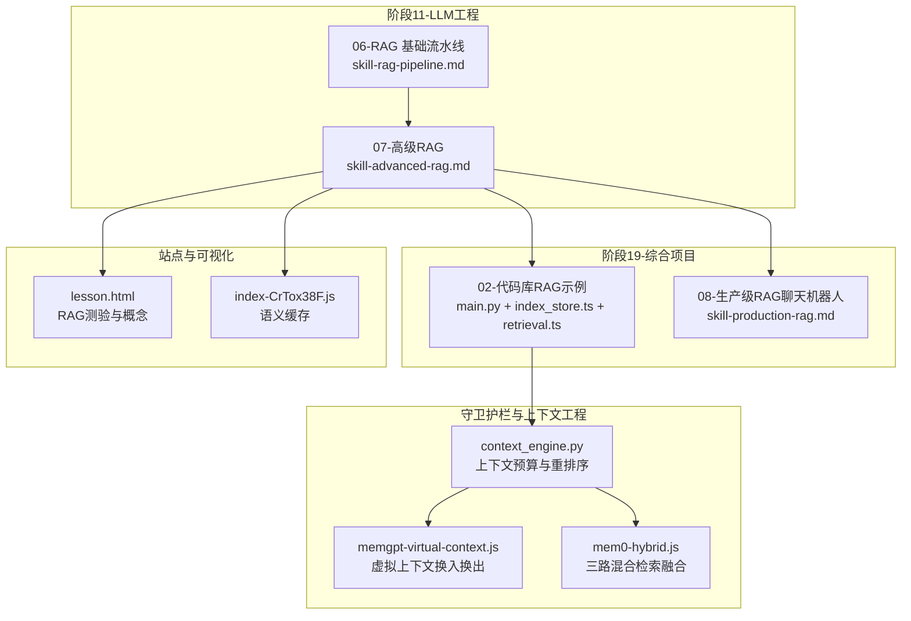

**图表来源**
- [phases/11-llm-engineering/06-rag/outputs/skill-rag-pipeline.md:10-70](file://phases/11-llm-engineering/06-rag/outputs/skill-rag-pipeline.md#L10-L70)
- [phases/11-llm-engineering/07-advanced-rag/outputs/skill-advanced-rag.md:10-62](file://phases/11-llm-engineering/07-advanced-rag/outputs/skill-advanced-rag.md#L10-L62)
- [phases/19-capstone-projects/02-rag-over-codebase/code/main.py:1-219](file://phases/19-capstone-projects/02-rag-over-codebase/code/main.py#L1-L219)
- [phases/19-capstone-projects/08-production-rag-chatbot/outputs/skill-production-rag.md:10-48](file://phases/19-capstone-projects/08-production-rag-chatbot/outputs/skill-production-rag.md#L10-L48)
- [guardrails-sandbox/backend/adapters/context_engine.py:1-29](file://guardrails-sandbox/backend/adapters/context_engine.py#L1-L29)
- [site/vue-app/summary/src/data/modules/memgpt-virtual-context.js:34-88](file://site/vue-app/summary/src/data/modules/memgpt-virtual-context.js#L34-L88)
- [site/vue-app/summary/src/data/modules/mem0-hybrid.js:1-26](file://site/vue-app/summary/src/data/modules/mem0-hybrid.js#L1-L26)
- [site/lesson.html:3226-3232](file://site/lesson.html#L3226-L3232)
- [site/summary/assets/index-CrTox38F.js:922-948](file://site/summary/assets/index-CrTox38F.js#L922-L948)

**章节来源**
- [phases/11-llm-engineering/06-rag/outputs/skill-rag-pipeline.md:10-70](file://phases/11-llm-engineering/06-rag/outputs/skill-rag-pipeline.md#L10-L70)
- [phases/11-llm-engineering/07-advanced-rag/outputs/skill-advanced-rag.md:10-62](file://phases/11-llm-engineering/07-advanced-rag/outputs/skill-advanced-rag.md#L10-L62)
- [phases/19-capstone-projects/02-rag-over-codebase/code/main.py:1-219](file://phases/19-capstone-projects/02-rag-over-codebase/code/main.py#L1-L219)
- [phases/19-capstone-projects/08-production-rag-chatbot/outputs/skill-production-rag.md:10-48](file://phases/19-capstone-projects/08-production-rag-chatbot/outputs/skill-production-rag.md#L10-L48)
- [guardrails-sandbox/backend/adapters/context_engine.py:1-29](file://guardrails-sandbox/backend/adapters/context_engine.py#L1-L29)
- [site/vue-app/summary/src/data/modules/memgpt-virtual-context.js:34-88](file://site/vue-app/summary/src/data/modules/memgpt-virtual-context.js#L34-L88)
- [site/vue-app/summary/src/data/modules/mem0-hybrid.js:1-26](file://site/vue-app/summary/src/data/modules/mem0-hybrid.js#L1-L26)
- [site/lesson.html:3226-3232](file://site/lesson.html#L3226-L3232)
- [site/summary/assets/index-CrTox38F.js:922-948](file://site/summary/assets/index-CrTox38F.js#L922-L948)

## 核心组件
- 文档分块与元数据
  - AST感知函数级切片，保留符号名、摘要、正文，便于语义与符号重排。
- 向量检索
  - 使用确定性哈希嵌入作为“占位嵌入”，支持余弦相似度检索；实际部署可用专业嵌入模型。
- BM25稀疏检索
  - 字段加权（符号x4、摘要x2、正文x1），计算IDF与归一化分数。
- 混合检索与重排
  - 并行双索引检索，RRF融合，随后基于查询-符号/摘要重叠进行轻量重排。
- 生成与提示工程
  - 将系统指令、策略块、重排后的上下文与用户问题拼接，使用合成模型生成答案并返回可溯源引用。
- 上下文预算与重排序
  - 将“中间丢失”效应转化为首尾优先的动态上下文组装策略。
- 虚拟上下文与混合记忆
  - 主上下文容量受限时，按页换出；检索命中后换入回答，支持溯源引用。
- 语义缓存
  - 基于词袋嵌入与余弦相似度的简单语义缓存，降低重复查询成本。

**章节来源**
- [phases/19-capstone-projects/02-rag-over-codebase/code/main.py:25-37](file://phases/19-capstone-projects/02-rag-over-codebase/code/main.py#L25-L37)
- [phases/19-capstone-projects/02-rag-over-codebase/code/main.py:65-92](file://phases/19-capstone-projects/02-rag-over-codebase/code/main.py#L65-L92)
- [phases/19-capstone-projects/02-rag-over-codebase/code/main.py:99-142](file://phases/19-capstone-projects/02-rag-over-codebase/code/main.py#L99-L142)
- [phases/19-capstone-projects/02-rag-over-codebase/code/main.py:149-176](file://phases/19-capstone-projects/02-rag-over-codebase/code/main.py#L149-L176)
- [guardrails-sandbox/backend/adapters/context_engine.py:14-29](file://guardrails-sandbox/backend/adapters/context_engine.py#L14-L29)
- [site/vue-app/summary/src/data/modules/memgpt-virtual-context.js:34-88](file://site/vue-app/summary/src/data/modules/memgpt-virtual-context.js#L34-L88)
- [site/summary/assets/index-CrTox38F.js:922-948](file://site/summary/assets/index-CrTox38F.js#L922-L948)

## 架构总览
下图展示从查询到生成的完整链路：文档入库（分块+嵌入）→ 查询嵌入→检索（向量+BM25）→融合（RRF）→重排→提示组装→生成→溯源。

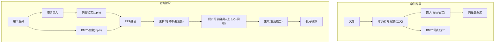

**图表来源**
- [phases/19-capstone-projects/02-rag-over-codebase/code/main.py:80-92](file://phases/19-capstone-projects/02-rag-over-codebase/code/main.py#L80-L92)
- [phases/19-capstone-projects/02-rag-over-codebase/code/main.py:103-142](file://phases/19-capstone-projects/02-rag-over-codebase/code/main.py#L103-L142)
- [phases/19-capstone-projects/02-rag-over-codebase/code/main.py:149-176](file://phases/19-capstone-projects/02-rag-over-codebase/code/main.py#L149-L176)
- [phases/19-capstone-projects/08-production-rag-chatbot/outputs/skill-production-rag.md:14-22](file://phases/19-capstone-projects/08-production-rag-chatbot/outputs/skill-production-rag.md#L14-L22)

## 详细组件分析

### 组件A：向量检索与BM25检索
- 向量检索
  - 使用确定性哈希嵌入，避免随机性；余弦相似度打分；支持字段加权拼接文本。
- BM25检索
  - 对符号、摘要、正文进行加权分词；维护文档长度、词频、逆文档频率；按公式计算归一化得分。
- 关键差异
  - 向量擅长语义近似，对词汇变化鲁棒；BM25对精确匹配与词序敏感，适合事实型问答。

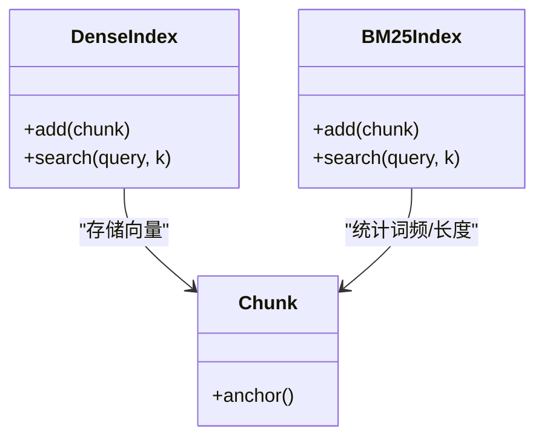

**图表来源**
- [phases/19-capstone-projects/02-rag-over-codebase/code/main.py:80-92](file://phases/19-capstone-projects/02-rag-over-codebase/code/main.py#L80-L92)
- [phases/19-capstone-projects/02-rag-over-codebase/code/main.py:103-142](file://phases/19-capstone-projects/02-rag-over-codebase/code/main.py#L103-L142)

**章节来源**
- [phases/19-capstone-projects/02-rag-over-codebase/code/main.py:65-92](file://phases/19-capstone-projects/02-rag-over-codebase/code/main.py#L65-L92)
- [phases/19-capstone-projects/02-rag-over-codebase/code/main.py:99-142](file://phases/19-capstone-projects/02-rag-over-codebase/code/main.py#L99-L142)

### 组件B：混合检索与RRF融合
- 并行检索
  - 向量与BM25各自检索top-50候选。
- RRF融合
  - 对同一锚点（Chunk锚定标识）的排名取倒数和进行融合，消除单一信号偏差。
- 融合收益
  - 提升召回质量，尤其在词汇不匹配或长尾查询场景。

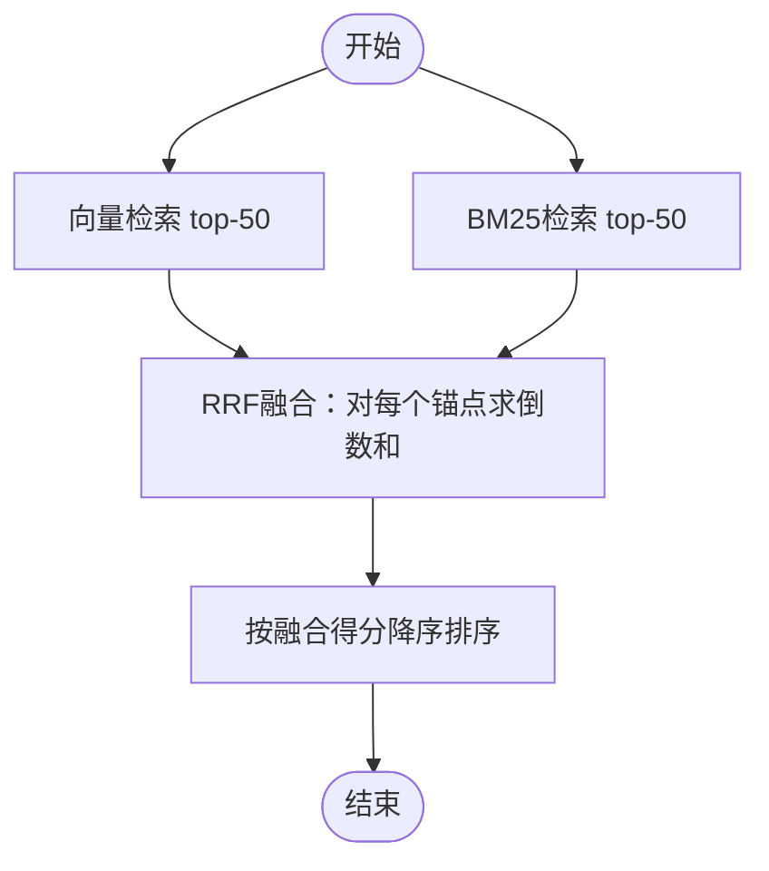

**图表来源**
- [phases/19-capstone-projects/02-rag-over-codebase/code/main.py:149-160](file://phases/19-capstone-projects/02-rag-over-codebase/code/main.py#L149-L160)

**章节来源**
- [phases/11-llm-engineering/07-advanced-rag/outputs/skill-advanced-rag.md:15-19](file://phases/11-llm-engineering/07-advanced-rag/outputs/skill-advanced-rag.md#L15-L19)
- [phases/19-capstone-projects/02-rag-over-codebase/code/main.py:149-160](file://phases/19-capstone-projects/02-rag-over-codebase/code/main.py#L149-L160)

### 组件C：重排序器（轻量跨编码器）
- 设计思路
  - 以查询与候选符号、摘要的词重叠作为代理信号，对融合结果进行加权提升。
- 实践价值
  - 在候选池足够大时显著提升精排效果，延迟可控。

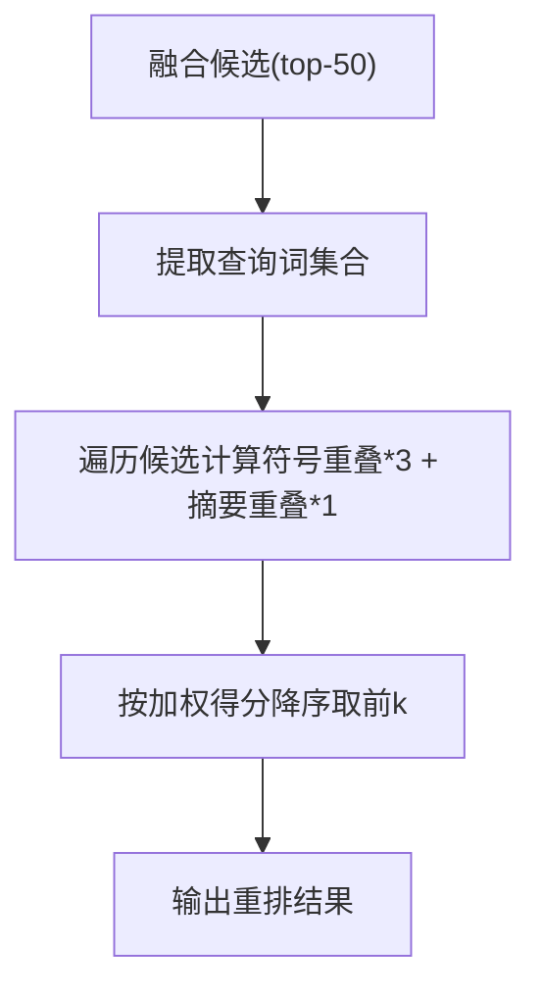

**图表来源**
- [phases/19-capstone-projects/02-rag-over-codebase/code/main.py:167-176](file://phases/19-capstone-projects/02-rag-over-codebase/code/main.py#L167-L176)

**章节来源**
- [phases/19-capstone-projects/02-rag-over-codebase/code/main.py:167-176](file://phases/19-capstone-projects/02-rag-over-codebase/code/main.py#L167-L176)

### 组件D：生成与提示组装
- 提示模板
  - 系统说明 + 政策块 + 重排上下文 + 用户问题。
- 生成策略
  - 合成模型生成，返回带可溯源引用的答案。
- 生产要点
  - 稳定提示前缀、目标提示缓存命中率、严格的角色/司法域过滤。

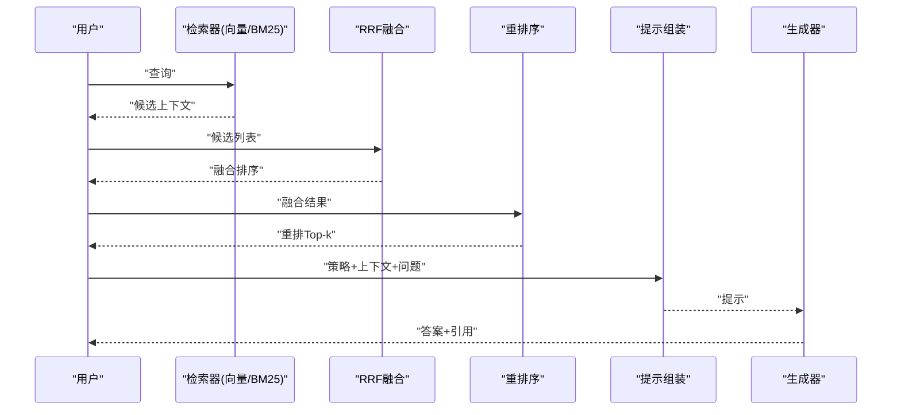

**图表来源**
- [phases/19-capstone-projects/08-production-rag-chatbot/outputs/skill-production-rag.md:16-22](file://phases/19-capstone-projects/08-production-rag-chatbot/outputs/skill-production-rag.md#L16-L22)
- [phases/19-capstone-projects/02-rag-over-codebase/code/main.py:183-195](file://phases/19-capstone-projects/02-rag-over-codebase/code/main.py#L183-L195)

**章节来源**
- [phases/19-capstone-projects/08-production-rag-chatbot/outputs/skill-production-rag.md:16-22](file://phases/19-capstone-projects/08-production-rag-chatbot/outputs/skill-production-rag.md#L16-L22)
- [phases/19-capstone-projects/02-rag-over-codebase/code/main.py:183-195](file://phases/19-capstone-projects/02-rag-over-codebase/code/main.py#L183-L195)

### 组件E：上下文预算与重排序（中间丢失效应）
- 核心思想
  - 将“中间丢失”转化为“首尾优先”的动态上下文组装策略，确保关键信息在窗口两端。
- 实践方法
  - 按相关性得分两两分组，交替合并至首尾，形成更稳定的上下文序列。

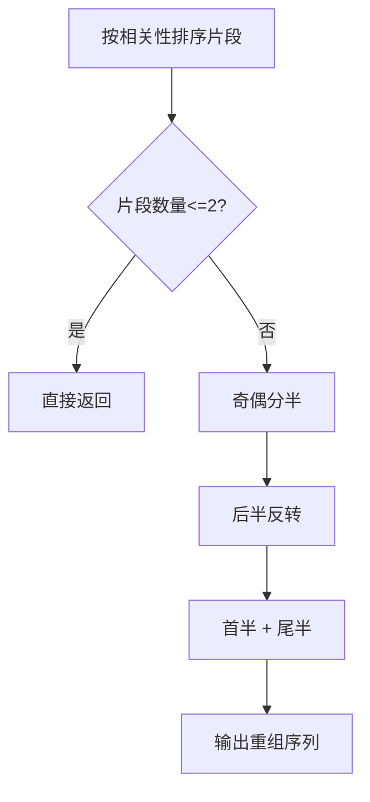

**图表来源**
- [guardrails-sandbox/backend/adapters/context_engine.py:20-29](file://guardrails-sandbox/backend/adapters/context_engine.py#L20-L29)

**章节来源**
- [guardrails-sandbox/backend/adapters/context_engine.py:14-29](file://guardrails-sandbox/backend/adapters/context_engine.py#L14-L29)

### 组件F：虚拟上下文与记忆换入换出
- 场景
  - 长会话中主上下文容量有限，通过“换出最旧到磁盘、命中检索后换入”的机制维持可追溯回答。
- 关键点
  - 归档时保存引用（citation），回答可溯源；注意记忆腐烂、投毒与引用丢失风险。

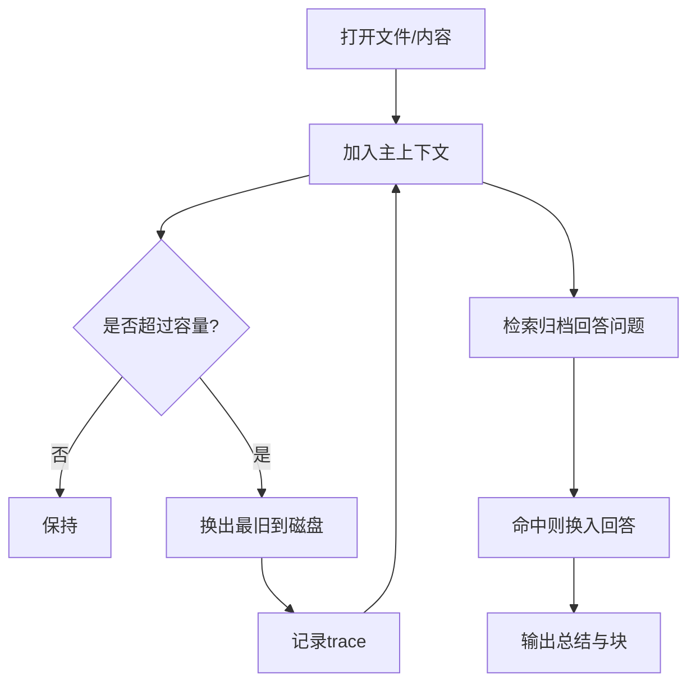

**图表来源**
- [site/vue-app/summary/src/data/modules/memgpt-virtual-context.js:34-88](file://site/vue-app/summary/src/data/modules/memgpt-virtual-context.js#L34-L88)
- [guardrails-sandbox/backend/playground/modules/memgpt_virtual_context.py:88-100](file://guardrails-sandbox/backend/playground/modules/memgpt_virtual_context.py#L88-L100)

**章节来源**
- [site/vue-app/summary/src/data/modules/memgpt-virtual-context.js:34-88](file://site/vue-app/summary/src/data/modules/memgpt-virtual-context.js#L34-L88)
- [guardrails-sandbox/backend/playground/modules/memgpt_virtual_context.py:88-100](file://guardrails-sandbox/backend/playground/modules/memgpt_virtual_context.py#L88-L100)

### 组件G：三路混合检索（向量/KV/图）
- 存储类型
  - 向量：语义相似（偏好召回）
  - KV：精确事实（语言/工具）
  - 图：关系推理（依赖/影响）
- 融合评分
  - 相关性·权重 + 重要性·权重 + 时效性·权重；冲突检测支持软删除与时间查询。

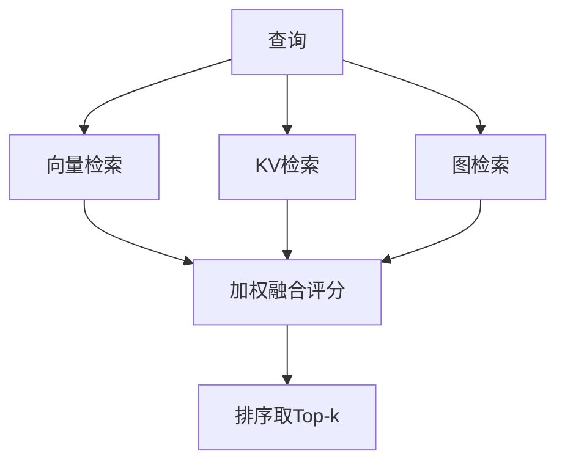

**图表来源**
- [site/vue-app/summary/src/data/modules/mem0-hybrid.js:1-26](file://site/vue-app/summary/src/data/modules/mem0-hybrid.js#L1-L26)

**章节来源**
- [site/vue-app/summary/src/data/modules/mem0-hybrid.js:1-26](file://site/vue-app/summary/src/data/modules/mem0-hybrid.js#L1-L26)

### 组件H：语义缓存
- 思想
  - 将查询映射为词袋向量，按余弦相似度匹配缓存条目；命中即返回并更新访问计数。
- 参数
  - 相似度阈值、最大条目数、TTL、命中/未命中计数。

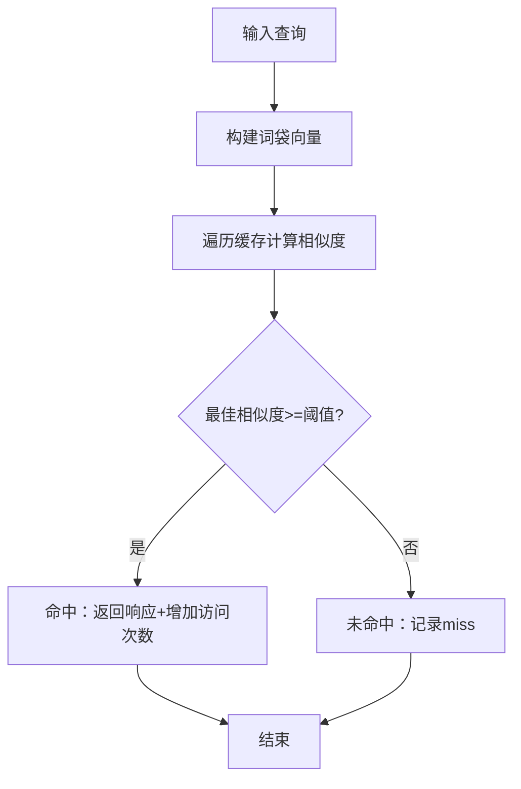

**图表来源**
- [site/summary/assets/index-CrTox38F.js:922-948](file://site/summary/assets/index-CrTox38F.js#L922-L948)

**章节来源**
- [site/summary/assets/index-CrTox38F.js:922-948](file://site/summary/assets/index-CrTox38F.js#L922-L948)

## 依赖分析
- 组件耦合
  - 检索器与重排序器解耦，便于独立优化；生成器仅依赖提示组装模块。
- 外部依赖
  - 嵌入模型（占位/真实）、向量数据库、稀疏索引（BM25）、重排模型（跨编码器）、合成模型、守卫护栏与监控平台。
- 数据流
  - 文档→分块→嵌入→索引；查询→嵌入→检索→融合→重排→提示→生成。

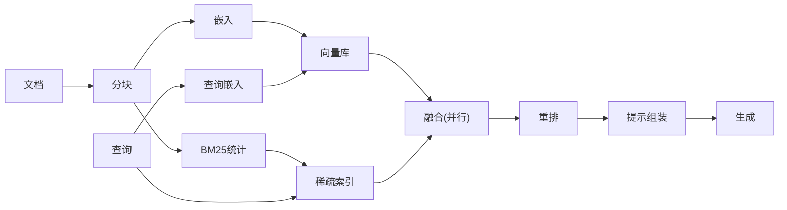

**图表来源**
- [phases/19-capstone-projects/02-rag-over-codebase/code/main.py:80-92](file://phases/19-capstone-projects/02-rag-over-codebase/code/main.py#L80-L92)
- [phases/19-capstone-projects/02-rag-over-codebase/code/main.py:103-142](file://phases/19-capstone-projects/02-rag-over-codebase/code/main.py#L103-L142)
- [phases/19-capstone-projects/02-rag-over-codebase/code/main.py:149-176](file://phases/19-capstone-projects/02-rag-over-codebase/code/main.py#L149-L176)

**章节来源**
- [phases/19-capstone-projects/02-rag-over-codebase/code/main.py:80-92](file://phases/19-capstone-projects/02-rag-over-codebase/code/main.py#L80-L92)
- [phases/19-capstone-projects/02-rag-over-codebase/code/main.py:103-142](file://phases/19-capstone-projects/02-rag-over-codebase/code/main.py#L103-L142)
- [phases/19-capstone-projects/02-rag-over-codebase/code/main.py:149-176](file://phases/19-capstone-projects/02-rag-over-codebase/code/main.py#L149-L176)

## 性能考虑
- 检索阶段
  - 并行双索引检索，候选池扩大至top-50再重排，平衡召回与延迟。
  - RRF融合无需额外模型，延迟极低。
- 重排阶段
  - 轻量重排（符号/摘要重叠）成本低；跨编码器重排延迟约50-200ms，适合高价值查询。
- 上下文工程
  - “中间丢失”重排序减少无效填充，提高窗口利用效率。
- 缓存与提示复用
  - 语义缓存与提示缓存结合，显著降低重复查询成本。
- 生产部署
  - 角色/司法域过滤前置，避免跨域泄露；严格提示前缀顺序，保障缓存经济性。

**章节来源**
- [phases/11-llm-engineering/07-advanced-rag/outputs/skill-advanced-rag.md:40-42](file://phases/11-llm-engineering/07-advanced-rag/outputs/skill-advanced-rag.md#L40-L42)
- [guardrails-sandbox/backend/adapters/context_engine.py:20-29](file://guardrails-sandbox/backend/adapters/context_engine.py#L20-L29)
- [site/summary/assets/index-CrTox38F.js:922-948](file://site/summary/assets/index-CrTox38F.js#L922-L948)
- [phases/19-capstone-projects/08-production-rag-chatbot/outputs/skill-production-rag.md:16-22](file://phases/19-capstone-projects/08-production-rag-chatbot/outputs/skill-production-rag.md#L16-L22)

## 故障排查指南
- 基础RAG常见问题
  - 嵌入模型不一致导致向量不可比；分块过小/过大破坏上下文；未设置温度=0导致幻觉。
- 高级RAG常见问题
  - BM25与向量索引搜索不同语料；重排候选池过小；滥用HyDE；未评估改动效果。
- 生产级问题
  - 跨域泄露（角色/司法域过滤必须前置）；提示前缀重排破坏缓存；缺少红队与监控。

**章节来源**
- [phases/11-llm-engineering/06-rag/outputs/skill-rag-pipeline.md:45-53](file://phases/11-llm-engineering/06-rag/outputs/skill-rag-pipeline.md#L45-L53)
- [phases/11-llm-engineering/07-advanced-rag/outputs/skill-advanced-rag.md:47-53](file://phases/11-llm-engineering/07-advanced-rag/outputs/skill-advanced-rag.md#L47-L53)
- [phases/19-capstone-projects/08-production-rag-chatbot/outputs/skill-production-rag.md:34-46](file://phases/19-capstone-projects/08-production-rag-chatbot/outputs/skill-production-rag.md#L34-L46)

## 结论
本仓库提供了从基础到高级的RAG系统全栈实现路径：先以确定性嵌入与BM25搭建可运行骨架，再引入RRF融合与轻量重排，最终在生产环境中叠加守卫护栏、提示缓存、漂移监控与合规过滤。通过严格的评估与工程实践，可在保证可解释性与可溯源性的前提下，获得稳定且高效的RAG系统。

## 附录
- 概念测验与要点
  - RAG核心在于“检索相关上下文后再生成”；嵌入模型产生稠密向量；向量相似度常用余弦相似度。
  - 高级RAG的关键改进包括：关键词提权、兜底搜索、误判过滤等。

**章节来源**
- [site/lesson.html:3226-3232](file://site/lesson.html#L3226-L3232)