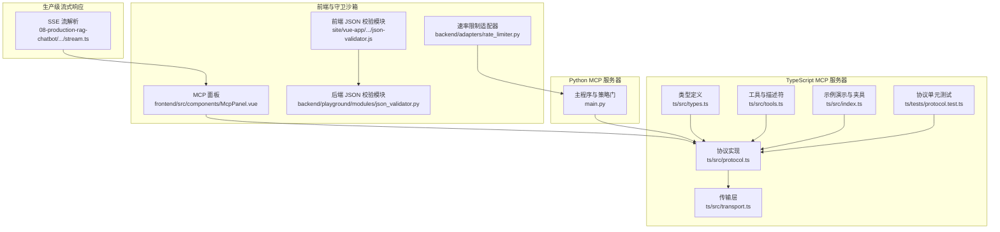
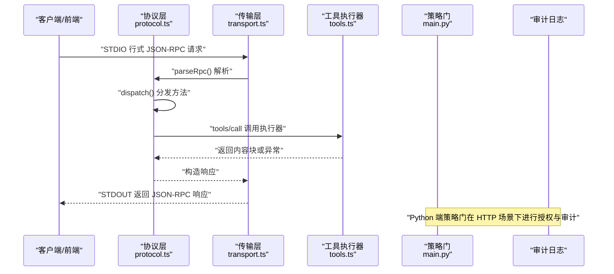
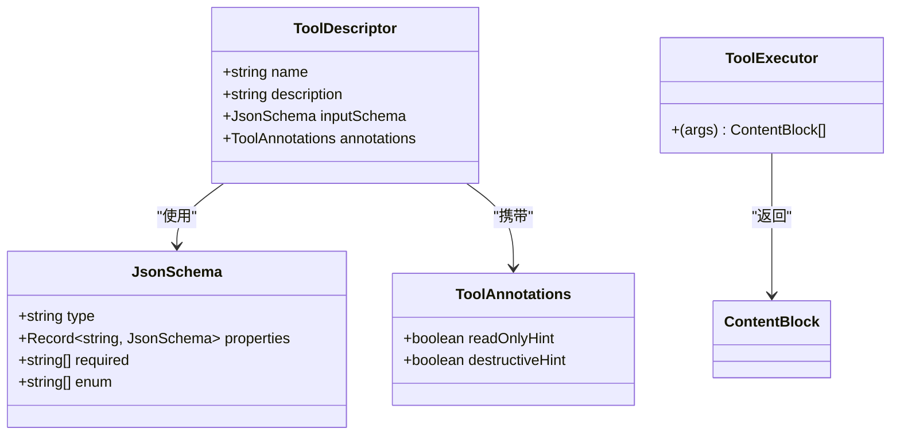
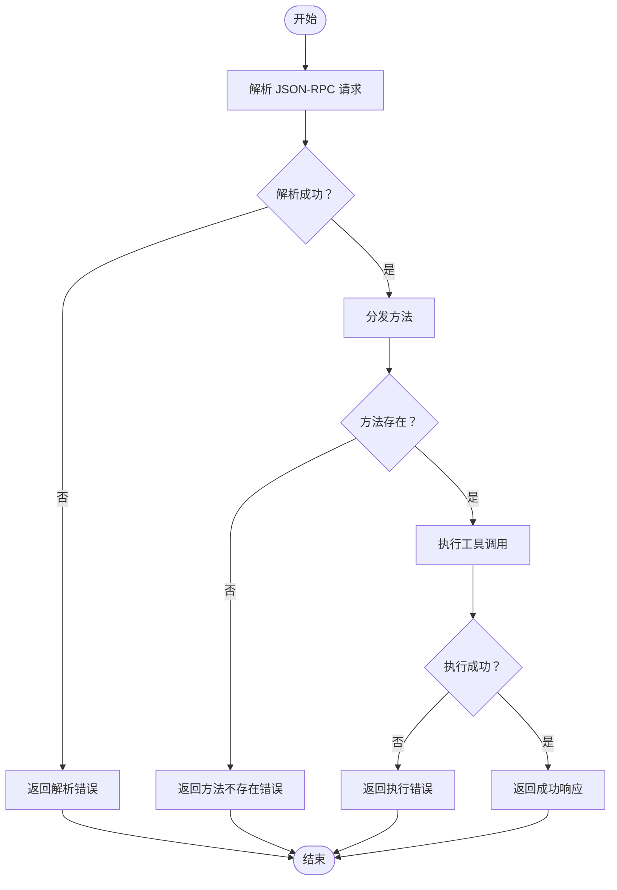
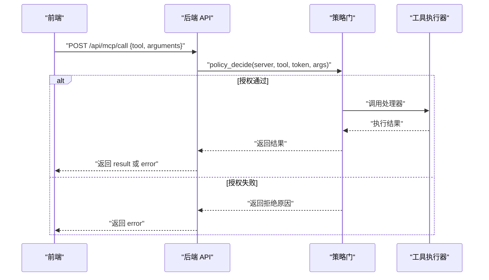
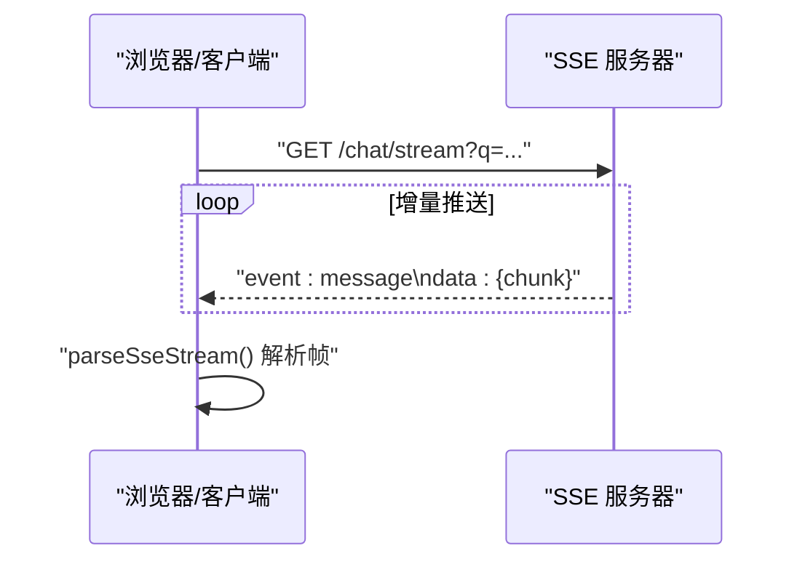
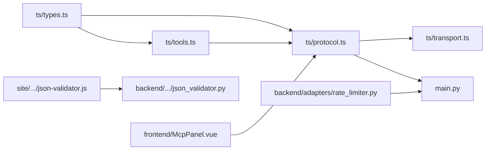

# 函数调用与工具集成

<cite>
**本文引用的文件**
- [协议类型定义（TypeScript）](file://phases/19-capstone-projects/13-mcp-server-with-registry/code/ts/src/types.ts)
- [协议实现（TypeScript）](file://phases/19-capstone-projects/13-mcp-server-with-registry/code/ts/src/protocol.ts)
- [传输层（TypeScript）](file://phases/19-capstone-projects/13-mcp-server-with-registry/code/ts/src/transport.ts)
- [工具与描述符（TypeScript）](file://phases/19-capstone-projects/13-mcp-server-with-registry/code/ts/src/tools.ts)
- [示例演示与请求夹具（TypeScript）](file://phases/19-capstone-projects/13-mcp-server-with-registry/code/ts/src/index.ts)
- [协议单元测试（TypeScript）](file://phases/19-capstone-projects/13-mcp-server-with-registry/code/ts/tests/protocol.test.ts)
- [Python MCP 服务器与策略门（Python）](file://phases/19-capstone-projects/13-mcp-server-with-registry/code/main.py)
- [前端 MCP 面板（Vue）](file://guardrails-sandbox/frontend/src/components/McpPanel.vue)
- [后端 JSON 校验模块（Python）](file://guardrails-sandbox/backend/playground/modules/json_validator.py)
- [前端 JSON 校验模块（Vue）](file://site/vue-app/summary/src/data/modules/json-validator.js)
- [SSE 流解析（TypeScript 生产级聊天机器人）](file://phases/19-capstone-projects/08-production-rag-chatbot/code/ts/src/stream.ts)
- [计划与预算（TypeScript 终端原生编码代理）](file://phases/19-capstone-projects/01-terminal-native-coding-agent/code/ts/src/plan.ts)
- [钩子与破坏性命令防护（TypeScript 终端原生编码代理）](file://phases/19-capstone-projects/01-terminal-native-coding-agent/code/ts/src/hooks.ts)
- [速率限制适配器（Python 守卫沙箱）](file://guardrails-sandbox/backend/adapters/rate_limiter.py)
</cite>

## 目录
1. [引言](#引言)
2. [项目结构](#项目结构)
3. [核心组件](#核心组件)
4. [架构总览](#架构总览)
5. [详细组件分析](#详细组件分析)
6. [依赖分析](#依赖分析)
7. [性能考虑](#性能考虑)
8. [故障排查指南](#故障排查指南)
9. [结论](#结论)
10. [附录](#附录)

## 引言
本文件围绕“函数调用与工具集成”主题，系统梳理仓库中与工具接口、Schema 设计、参数验证、错误处理、注册与发现、调用流程、并发与流式响应、超时控制等相关的实现与最佳实践。文档以 TypeScript 的 MCP 内部服务器与 Python 的 MCP 策略门为核心，结合前端交互与生产级流式响应能力，给出从协议到应用的全链路技术说明。

## 项目结构
本专题涉及的关键目录与文件：
- TypeScript MCP 内部服务器：协议、传输、工具与类型定义，以及示例演示与测试
- Python MCP 服务器与策略门：工具 Schema、权限策略、审计日志与注册表
- 前端 MCP 面板：基于工具 Schema 动态渲染输入表单并发起调用
- JSON 校验模块：前后端通用的结构化输出校验
- 生产级 SSE 流：服务端事件流式响应
- 终端原生编码代理：计划与预算、钩子与破坏性命令防护

图表来源
- [协议类型定义（TypeScript）:1-53](file://phases/19-capstone-projects/13-mcp-server-with-registry/code/ts/src/types.ts#L1-L53)
- [协议实现（TypeScript）:1-100](file://phases/19-capstone-projects/13-mcp-server-with-registry/code/ts/src/protocol.ts#L1-L100)
- [传输层（TypeScript）:1-46](file://phases/19-capstone-projects/13-mcp-server-with-registry/code/ts/src/transport.ts#L1-L46)
- [工具与描述符（TypeScript）:1-73](file://phases/19-capstone-projects/13-mcp-server-with-registry/code/ts/src/tools.ts#L1-L73)
- [示例演示与请求夹具（TypeScript）:14-58](file://phases/19-capstone-projects/13-mcp-server-with-registry/code/ts/src/index.ts#L14-L58)
- [协议单元测试（TypeScript）:1-79](file://phases/19-capstone-projects/13-mcp-server-with-registry/code/ts/tests/protocol.test.ts#L1-L79)
- [Python MCP 服务器与策略门（Python）:1-238](file://phases/19-capstone-projects/13-mcp-server-with-registry/code/main.py#L1-L238)
- [前端 MCP 面板（Vue）:47-104](file://guardrails-sandbox/frontend/src/components/McpPanel.vue#L47-L104)
- [前端 JSON 校验模块（Vue）:45-95](file://site/vue-app/summary/src/data/modules/json-validator.js#L45-L95)
- [后端 JSON 校验模块（Python）:68-97](file://guardrails-sandbox/backend/playground/modules/json_validator.py#L68-L97)
- [SSE 流解析（TypeScript 生产级聊天机器人）:68-92](file://phases/19-capstone-projects/08-production-rag-chatbot/code/ts/src/stream.ts#L68-L92)

章节来源
- [协议类型定义（TypeScript）:1-53](file://phases/19-capstone-projects/13-mcp-server-with-registry/code/ts/src/types.ts#L1-L53)
- [协议实现（TypeScript）:1-100](file://phases/19-capstone-projects/13-mcp-server-with-registry/code/ts/src/protocol.ts#L1-L100)
- [传输层（TypeScript）:1-46](file://phases/19-capstone-projects/13-mcp-server-with-registry/code/ts/src/transport.ts#L1-L46)
- [工具与描述符（TypeScript）:1-73](file://phases/19-capstone-projects/13-mcp-server-with-registry/code/ts/src/tools.ts#L1-L73)
- [示例演示与请求夹具（TypeScript）:14-58](file://phases/19-capstone-projects/13-mcp-server-with-registry/code/ts/src/index.ts#L14-L58)
- [协议单元测试（TypeScript）:1-79](file://phases/19-capstone-projects/13-mcp-server-with-registry/code/ts/tests/protocol.test.ts#L1-L79)
- [Python MCP 服务器与策略门（Python）:1-238](file://phases/19-capstone-projects/13-mcp-server-with-registry/code/main.py#L1-L238)
- [前端 MCP 面板（Vue）:47-104](file://guardrails-sandbox/frontend/src/components/McpPanel.vue#L47-L104)
- [前端 JSON 校验模块（Vue）:45-95](file://site/vue-app/summary/src/data/modules/json-validator.js#L45-L95)
- [后端 JSON 校验模块（Python）:68-97](file://guardrails-sandbox/backend/playground/modules/json_validator.py#L68-L97)
- [SSE 流解析（TypeScript 生产级聊天机器人）:68-92](file://phases/19-capstone-projects/08-production-rag-chatbot/code/ts/src/stream.ts#L68-L92)

## 核心组件
- JSON-RPC 2.0 协议与状态机：初始化、列出工具、调用工具、关闭，支持错误码与幂等 ID
- 工具 Schema 与执行器：工具描述符（名称、描述、输入 JSON Schema、注解）、执行器签名与返回内容块
- 传输层：STDIO 行式解析与回放、错误包装与响应发送
- Python 策略门：基于 Scope 的授权、破坏性工具的人工审批窗口、负载大小限制、审计日志
- 前端 MCP 面板：根据工具 Schema 动态生成表单，默认值填充、调用与错误展示
- JSON 校验：前后端一致的结构化输出校验，字段类型与必填项检查
- 流式响应：SSE 事件帧编码与解析，支持增量输出
- 计划与预算：最大轮次、Token 与费用预算，钩子与破坏性命令防护

章节来源
- [协议实现（TypeScript）:12-83](file://phases/19-capstone-projects/13-mcp-server-with-registry/code/ts/src/protocol.ts#L12-L83)
- [工具与描述符（TypeScript）:11-43](file://phases/19-capstone-projects/13-mcp-server-with-registry/code/ts/src/tools.ts#L11-L43)
- [传输层（TypeScript）:7-23](file://phases/19-capstone-projects/13-mcp-server-with-registry/code/ts/src/transport.ts#L7-L23)
- [Python MCP 服务器与策略门（Python）:85-143](file://phases/19-capstone-projects/13-mcp-server-with-registry/code/main.py#L85-L143)
- [前端 MCP 面板（Vue）:47-86](file://guardrails-sandbox/frontend/src/components/McpPanel.vue#L47-L86)
- [前端 JSON 校验模块（Vue）:45-95](file://site/vue-app/summary/src/data/modules/json-validator.js#L45-L95)
- [后端 JSON 校验模块（Python）:68-97](file://guardrails-sandbox/backend/playground/modules/json_validator.py#L68-L97)
- [SSE 流解析（TypeScript 生产级聊天机器人）:68-92](file://phases/19-capstone-projects/08-production-rag-chatbot/code/ts/src/stream.ts#L68-L92)
- [计划与预算（TypeScript 终端原生编码代理）:31-62](file://phases/19-capstone-projects/01-terminal-native-coding-agent/code/ts/src/plan.ts#L31-L62)
- [钩子与破坏性命令防护（TypeScript 终端原生编码代理）:34-51](file://phases/19-capstone-projects/01-terminal-native-coding-agent/code/ts/src/hooks.ts#L34-L51)

## 架构总览
下图展示了从客户端到工具执行的整体调用链路，涵盖协议握手、工具发现、参数校验、策略门、执行与响应。

图表来源
- [协议实现（TypeScript）:56-83](file://phases/19-capstone-projects/13-mcp-server-with-registry/code/ts/src/protocol.ts#L56-L83)
- [传输层（TypeScript）:7-23](file://phases/19-capstone-projects/13-mcp-server-with-registry/code/ts/src/transport.ts#L7-L23)
- [工具与描述符（TypeScript）:45-72](file://phases/19-capstone-projects/13-mcp-server-with-registry/code/ts/src/tools.ts#L45-L72)
- [Python MCP 服务器与策略门（Python）:126-143](file://phases/19-capstone-projects/13-mcp-server-with-registry/code/main.py#L126-L143)

## 详细组件分析

### JSON Schema 与工具接口标准化
- 工具描述符包含名称、描述、输入 JSON Schema 与注解（只读/破坏性提示），用于前端动态表单与策略门决策
- 输入 Schema 支持属性、必填项、枚举等约束，便于前端自动渲染与后端严格校验
- 执行器返回统一的内容块数组，便于后续流式拼接与观察

图表来源
- [协议类型定义（TypeScript）:23-46](file://phases/19-capstone-projects/13-mcp-server-with-registry/code/ts/src/types.ts#L23-L46)
- [工具与描述符（TypeScript）:11-43](file://phases/19-capstone-projects/13-mcp-server-with-registry/code/ts/src/tools.ts#L11-L43)

章节来源
- [协议类型定义（TypeScript）:23-46](file://phases/19-capstone-projects/13-mcp-server-with-registry/code/ts/src/types.ts#L23-L46)
- [工具与描述符（TypeScript）:11-43](file://phases/19-capstone-projects/13-mcp-server-with-registry/code/ts/src/tools.ts#L11-L43)

### 参数验证与错误处理
- 前端根据工具 Schema 自动生成表单并填充默认值，避免缺参
- 后端 JSON 校验模块对必填字段与类型进行检查，并输出结构化错误
- 协议层在解析失败、方法不存在、执行异常时返回标准错误码与消息
- Python 策略门对未知工具、Scope 不足、破坏性工具未获新鲜人工批准、载荷过大等情况进行拒绝并记录审计

图表来源
- [协议实现（TypeScript）:85-99](file://phases/19-capstone-projects/13-mcp-server-with-registry/code/ts/src/protocol.ts#L85-L99)
- [传输层（TypeScript）:10-20](file://phases/19-capstone-projects/13-mcp-server-with-registry/code/ts/src/transport.ts#L10-L20)
- [后端 JSON 校验模块（Python）:68-97](file://guardrails-sandbox/backend/playground/modules/json_validator.py#L68-L97)
- [前端 JSON 校验模块（Vue）:45-95](file://site/vue-app/summary/src/data/modules/json-validator.js#L45-L95)

章节来源
- [传输层（TypeScript）:10-20](file://phases/19-capstone-projects/13-mcp-server-with-registry/code/ts/src/transport.ts#L10-L20)
- [协议实现（TypeScript）:85-99](file://phases/19-capstone-projects/13-mcp-server-with-registry/code/ts/src/protocol.ts#L85-L99)
- [后端 JSON 校验模块（Python）:68-97](file://guardrails-sandbox/backend/playground/modules/json_validator.py#L68-L97)
- [前端 JSON 校验模块（Vue）:45-95](file://site/vue-app/summary/src/data/modules/json-validator.js#L45-L95)

### 工具注册、发现与调用流程
- 工具注册：TypeScript 侧通过描述符与执行器映射注册；Python 侧通过工具 Schema 与处理器注册
- 工具发现：tools/list 返回工具清单与输入 Schema，前端据此渲染表单
- 调用流程：前端提交工具名与参数，后端策略门决策通过后执行，返回内容块或错误

图表来源
- [前端 MCP 面板（Vue）:60-86](file://guardrails-sandbox/frontend/src/components/McpPanel.vue#L60-L86)
- [Python MCP 服务器与策略门（Python）:126-143](file://phases/19-capstone-projects/13-mcp-server-with-registry/code/main.py#L126-L143)

章节来源
- [前端 MCP 面板（Vue）:60-86](file://guardrails-sandbox/frontend/src/components/McpPanel.vue#L60-L86)
- [Python MCP 服务器与策略门（Python）:126-143](file://phases/19-capstone-projects/13-mcp-server-with-registry/code/main.py#L126-L143)

### 并发调用、流式响应与超时控制
- 并发调用：终端原生编码代理通过钩子与预算机制管理多步任务，可在计划阶段并行安排互不依赖的任务
- 流式响应：生产级聊天机器人使用 SSE 将长文本分片推送，前端逐帧解析并渲染
- 超时控制：代理预算包含最大轮次与费用上限，策略门可扩展加入请求超时与重试策略

图表来源
- [SSE 流解析（TypeScript 生产级聊天机器人）:68-92](file://phases/19-capstone-projects/08-production-rag-chatbot/code/ts/src/stream.ts#L68-L92)

章节来源
- [SSE 流解析（TypeScript 生产级聊天机器人）:68-92](file://phases/19-capstone-projects/08-production-rag-chatbot/code/ts/src/stream.ts#L68-L92)
- [计划与预算（TypeScript 终端原生编码代理）:31-62](file://phases/19-capstone-projects/01-terminal-native-coding-agent/code/ts/src/plan.ts#L31-L62)

### 实际项目中的工具集成案例与最佳实践
- 前端动态表单：根据工具 Schema 自动填充默认值，减少用户输入负担
- 参数校验前置：前后端统一 JSON 校验，尽早暴露缺参与类型不匹配问题
- 破坏性命令防护：在 PreToolUse 钩子中拦截高风险命令，避免误操作
- 策略门与审计：Python 端策略门结合 Scope 与人工审批窗口，所有调用写入审计日志并脱敏

章节来源
- [前端 MCP 面板（Vue）:47-86](file://guardrails-sandbox/frontend/src/components/McpPanel.vue#L47-L86)
- [前端 JSON 校验模块（Vue）:45-95](file://site/vue-app/summary/src/data/modules/json-validator.js#L45-L95)
- [后端 JSON 校验模块（Python）:68-97](file://guardrails-sandbox/backend/playground/modules/json_validator.py#L68-L97)
- [钩子与破坏性命令防护（TypeScript 终端原生编码代理）:34-51](file://phases/19-capstone-projects/01-terminal-native-coding-agent/code/ts/src/hooks.ts#L34-L51)
- [Python MCP 服务器与策略门（Python）:85-143](file://phases/19-capstone-projects/13-mcp-server-with-registry/code/main.py#L85-L143)

## 依赖分析
- TypeScript 侧：类型定义驱动协议与传输，工具描述符驱动执行器映射
- Python 侧：策略门依赖工具 Schema 与令牌 Scope，注册表负责聚合各服务器能力文档
- 前后端：JSON 校验模块提供一致的结构化输出校验能力

图表来源
- [协议类型定义（TypeScript）:1-53](file://phases/19-capstone-projects/13-mcp-server-with-registry/code/ts/src/types.ts#L1-L53)
- [协议实现（TypeScript）:1-100](file://phases/19-capstone-projects/13-mcp-server-with-registry/code/ts/src/protocol.ts#L1-L100)
- [传输层（TypeScript）:1-46](file://phases/19-capstone-projects/13-mcp-server-with-registry/code/ts/src/transport.ts#L1-L46)
- [工具与描述符（TypeScript）:1-73](file://phases/19-capstone-projects/13-mcp-server-with-registry/code/ts/src/tools.ts#L1-L73)
- [Python MCP 服务器与策略门（Python）:1-238](file://phases/19-capstone-projects/13-mcp-server-with-registry/code/main.py#L1-L238)
- [前端 MCP 面板（Vue）:47-104](file://guardrails-sandbox/frontend/src/components/McpPanel.vue#L47-L104)
- [前端 JSON 校验模块（Vue）:45-95](file://site/vue-app/summary/src/data/modules/json-validator.js#L45-L95)
- [后端 JSON 校验模块（Python）:68-97](file://guardrails-sandbox/backend/playground/modules/json_validator.py#L68-L97)
- [速率限制适配器（Python 守卫沙箱）:33-55](file://guardrails-sandbox/backend/adapters/rate_limiter.py#L33-L55)

章节来源
- [协议实现（TypeScript）:1-100](file://phases/19-capstone-projects/13-mcp-server-with-registry/code/ts/src/protocol.ts#L1-L100)
- [Python MCP 服务器与策略门（Python）:1-238](file://phases/19-capstone-projects/13-mcp-server-with-registry/code/main.py#L1-L238)

## 性能考虑
- JSON 解析与校验：尽量在边缘层（前端/网关）完成参数校验，减少无效调用
- 流式传输：SSE 增量推送降低首字节延迟，适合长文本生成场景
- 预算与限流：代理预算与速率限制适配器共同控制资源消耗，防止雪崩
- 策略门优化：将昂贵的策略计算缓存化，必要时引入异步审批通道

## 故障排查指南
- 协议错误
  - 解析失败：检查 JSON-RPC 包装与字段完整性
  - 方法不存在：确认方法名与 ID 是否匹配
  - 执行异常：捕获异常并返回结构化错误，避免崩溃
- 参数校验失败
  - 缺少必填字段或类型不匹配：前后端统一校验，输出明确错误信息
- 策略门拒绝
  - 未知工具：确认工具是否已注册
  - 缺少 Scope：检查令牌范围
  - 破坏性工具未获新鲜人工批准：刷新审批时间戳
  - 载荷过大：压缩参数或拆分调用
- 审计与可观测性
  - 审计日志包含脱敏后的参数与结果，便于回溯

章节来源
- [传输层（TypeScript）:10-20](file://phases/19-capstone-projects/13-mcp-server-with-registry/code/ts/src/transport.ts#L10-L20)
- [协议实现（TypeScript）:75-82](file://phases/19-capstone-projects/13-mcp-server-with-registry/code/ts/src/protocol.ts#L75-L82)
- [后端 JSON 校验模块（Python）:68-97](file://guardrails-sandbox/backend/playground/modules/json_validator.py#L68-L97)
- [前端 JSON 校验模块（Vue）:45-95](file://site/vue-app/summary/src/data/modules/json-validator.js#L45-L95)
- [Python MCP 服务器与策略门（Python）:85-143](file://phases/19-capstone-projects/13-mcp-server-with-registry/code/main.py#L85-L143)

## 结论
本专题以 MCP 协议为基础，结合 TypeScript 的内部服务器与 Python 的策略门，构建了从工具 Schema、参数校验、授权与审计到前端交互与流式响应的完整闭环。通过统一的 JSON Schema 与严格的错误处理，系统在保证安全性的同时提升了可用性与可维护性。建议在实际项目中：
- 以工具 Schema 驱动前端表单与后端校验
- 在策略门中引入超时与重试机制
- 使用 SSE 进行长文本流式输出
- 通过预算与限流控制资源消耗

## 附录
- 示例演示与夹具：包含 initialize、tools/list、tools/call、shutdown 的完整交互序列
- 单元测试：覆盖 initialize、tools/list、tools/call 的正确性与错误分支

章节来源
- [示例演示与请求夹具（TypeScript）:14-58](file://phases/19-capstone-projects/13-mcp-server-with-registry/code/ts/src/index.ts#L14-L58)
- [协议单元测试（TypeScript）:1-79](file://phases/19-capstone-projects/13-mcp-server-with-registry/code/ts/tests/protocol.test.ts#L1-L79)