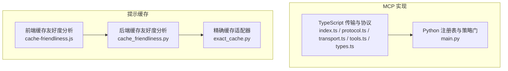
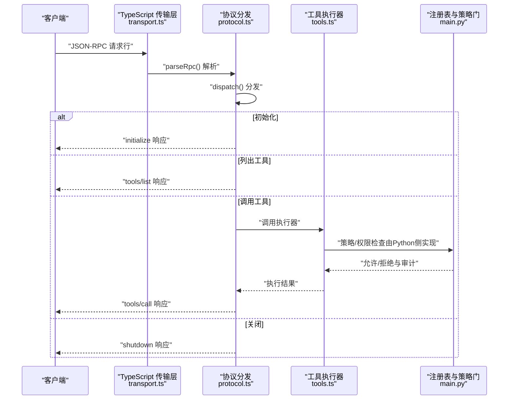
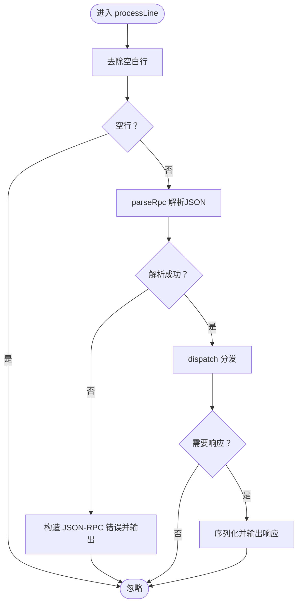
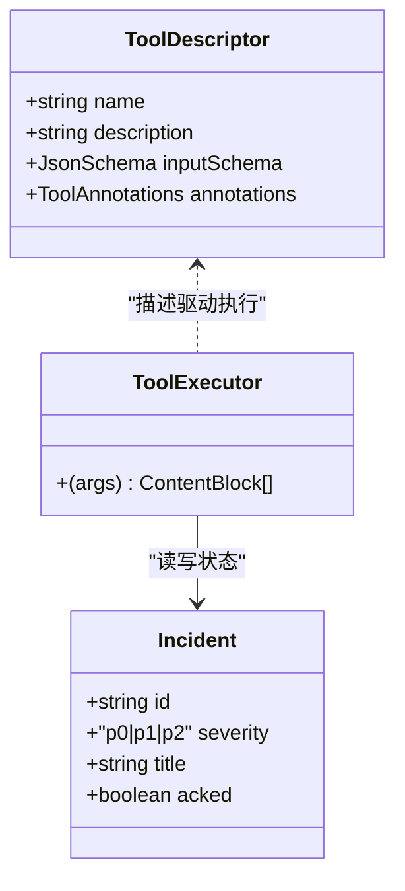
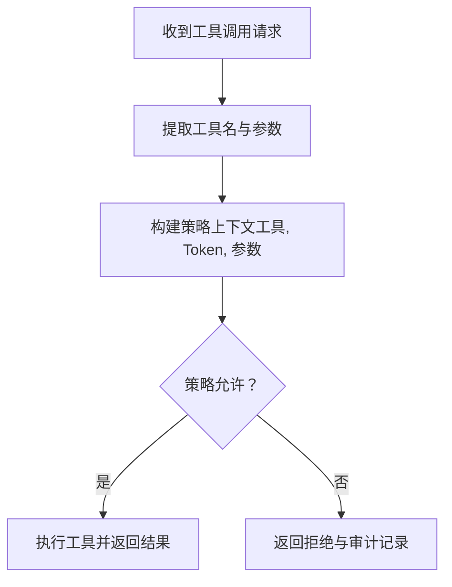
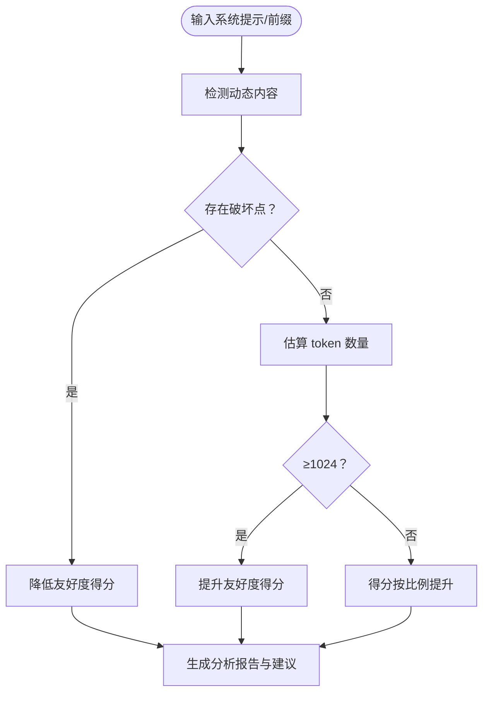
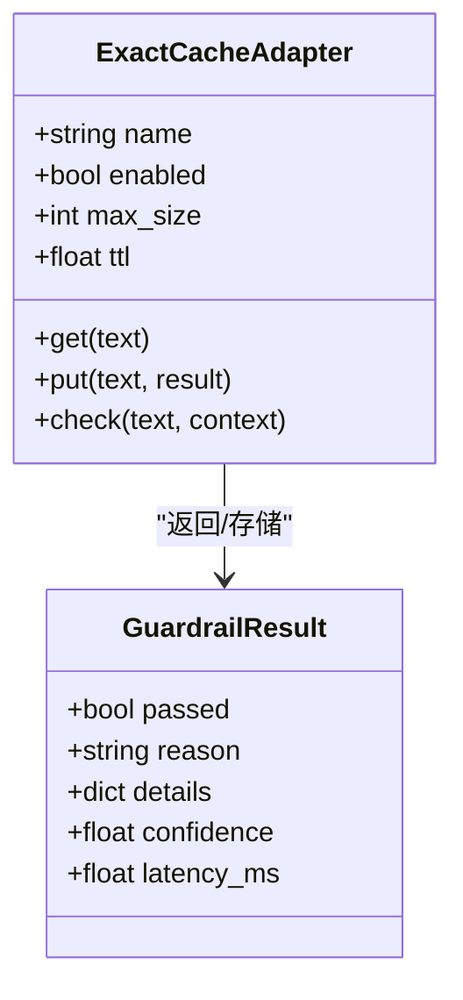
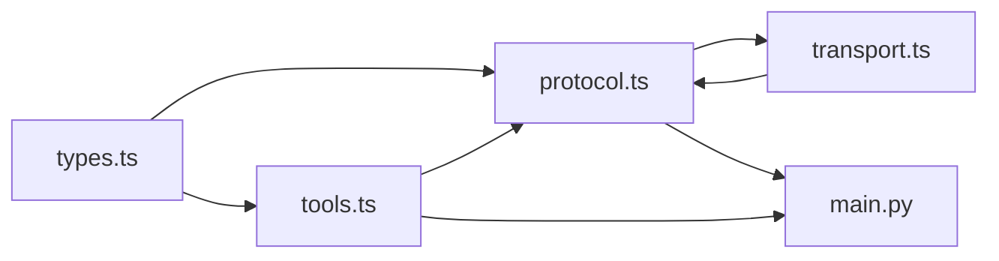

# 协议与标准

<cite>
**本文引用的文件**   
- [index.ts](file://phases/19-capstone-projects/13-mcp-server-with-registry/code/ts/src/index.ts)
- [protocol.ts](file://phases/19-capstone-projects/13-mcp-server-with-registry/code/ts/src/protocol.ts)
- [transport.ts](file://phases/19-capstone-projects/13-mcp-server-with-registry/code/ts/src/transport.ts)
- [tools.ts](file://phases/19-capstone-projects/13-mcp-server-with-registry/code/ts/src/tools.ts)
- [types.ts](file://phases/19-capstone-projects/13-mcp-server-with-registry/code/ts/src/types.ts)
- [protocol.test.ts](file://phases/19-capstone-projects/13-mcp-server-with-registry/code/ts/tests/protocol.test.ts)
- [main.py](file://phases/19-capstone-projects/13-mcp-server-with-registry/code/main.py)
- [cache_friendliness.py](file://guardrails-sandbox/backend/playground/modules/cache_friendliness.py)
- [cache-friendliness.js](file://site/vue-app/summary/src/data/modules/cache-friendliness.js)
- [exact_cache.py](file://guardrails-sandbox/backend/adapters/exact_cache.py)
- [data.js](file://site/data.js)
</cite>

## 目录
1. [引言](#引言)
2. [项目结构](#项目结构)
3. [核心组件](#核心组件)
4. [架构总览](#架构总览)
5. [详细组件分析](#详细组件分析)
6. [依赖关系分析](#依赖关系分析)
7. [性能考量](#性能考量)
8. [故障排查指南](#故障排查指南)
9. [结论](#结论)
10. [附录](#附录)

## 引言
本文件面向LLM相关的协议与标准，聚焦两大主题：
- 模型上下文协议（Model Context Protocol，MCP）：基于仓库中“内部MCP服务器”实现，系统化阐述协议规范、传输机制、安全与授权设计，并给出最佳实践与兼容性指南。
- 提示缓存协议（Prompt Caching）：结合仓库中的“前缀缓存友好度分析”与“精确缓存适配器”，深入讲解缓存策略、失效机制与一致性保障，提供可落地的实现与部署建议。

## 项目结构
本仓库围绕“协议与标准”形成两条主线：
- MCP 实现线：TypeScript侧的MCP传输层与工具执行器，配合Python侧的注册表与策略门控，构成端到端的内部MCP服务器示例。
- 提示缓存线：前端与后端的“缓存友好度分析”模块，以及Guardrails沙箱中的“精确缓存适配器”，覆盖从策略制定到执行落地的全链路。

图示来源
- [index.ts:1-12](file://phases/19-capstone-projects/13-mcp-server-with-registry/code/ts/src/index.ts#L1-L12)
- [protocol.ts:1-100](file://phases/19-capstone-projects/13-mcp-server-with-registry/code/ts/src/protocol.ts#L1-L100)
- [transport.ts:1-45](file://phases/19-capstone-projects/13-mcp-server-with-registry/code/ts/src/transport.ts#L1-L45)
- [tools.ts:1-73](file://phases/19-capstone-projects/13-mcp-server-with-registry/code/ts/src/tools.ts#L1-L73)
- [main.py:48-237](file://phases/19-capstone-projects/13-mcp-server-with-registry/code/main.py#L48-L237)
- [cache-friendliness.js:1-105](file://site/vue-app/summary/src/data/modules/cache-friendliness.js#L1-L105)
- [cache_friendliness.py:1-98](file://guardrails-sandbox/backend/playground/modules/cache_friendliness.py#L1-L98)
- [exact_cache.py:1-69](file://guardrails-sandbox/backend/adapters/exact_cache.py#L1-L69)

章节来源
- [index.ts:1-12](file://phases/19-capstone-projects/13-mcp-server-with-registry/code/ts/src/index.ts#L1-L12)
- [protocol.ts:1-100](file://phases/19-capstone-projects/13-mcp-server-with-registry/code/ts/src/protocol.ts#L1-L100)
- [transport.ts:1-45](file://phases/19-capstone-projects/13-mcp-server-with-registry/code/ts/src/transport.ts#L1-L45)
- [tools.ts:1-73](file://phases/19-capstone-projects/13-mcp-server-with-registry/code/ts/src/tools.ts#L1-L73)
- [main.py:48-237](file://phases/19-capstone-projects/13-mcp-server-with-registry/code/main.py#L48-L237)
- [cache-friendliness.js:1-105](file://site/vue-app/summary/src/data/modules/cache-friendliness.js#L1-L105)
- [cache_friendliness.py:1-98](file://guardrails-sandbox/backend/playground/modules/cache_friendliness.py#L1-L98)
- [exact_cache.py:1-69](file://guardrails-sandbox/backend/adapters/exact_cache.py#L1-L69)

## 核心组件
- MCP 传输与协议（TypeScript）
  - 协议版本与服务器信息常量、状态机、方法分发与JSON-RPC解析。
  - 支持初始化、列出工具、调用工具、关闭等核心方法。
- MCP 工具与执行器
  - 定义三类模拟工具（列表、查询、确认），并提供对应的执行器。
- MCP 传输层（TypeScript）
  - 行式JSON-RPC处理、fixture回放与stdio服务循环。
- Python 注册表与策略门
  - 提供能力文档、OAuth风格作用域集合、OPA风格策略函数与审计日志。
- 提示缓存友好度分析（前后端）
  - 前端JS与后端Python模块，识别破坏前缀缓存的动态内容，评估最小可缓存块，输出盈亏平衡建议。
- 精确缓存适配器（Guardrails）
  - 针对输入文本的精确缓存，支持TTL与容量淘汰，加速Guardrail流水线。

章节来源
- [protocol.ts:1-100](file://phases/19-capstone-projects/13-mcp-server-with-registry/code/ts/src/protocol.ts#L1-L100)
- [tools.ts:1-73](file://phases/19-capstone-projects/13-mcp-server-with-registry/code/ts/src/tools.ts#L1-L73)
- [transport.ts:1-45](file://phases/19-capstone-projects/13-mcp-server-with-registry/code/ts/src/transport.ts#L1-L45)
- [main.py:48-237](file://phases/19-capstone-projects/13-mcp-server-with-registry/code/main.py#L48-L237)
- [cache-friendliness.js:1-105](file://site/vue-app/summary/src/data/modules/cache-friendliness.js#L1-L105)
- [cache_friendliness.py:1-98](file://guardrails-sandbox/backend/playground/modules/cache_friendliness.py#L1-L98)
- [exact_cache.py:1-69](file://guardrails-sandbox/backend/adapters/exact_cache.py#L1-L69)

## 架构总览
下图展示MCP端到端交互：客户端通过JSON-RPC over stdio发起请求，TypeScript协议层进行解析与分发，调用Python侧注册表与策略门完成鉴权与执行，最终返回结果或错误码。

图示来源
- [transport.ts:1-45](file://phases/19-capstone-projects/13-mcp-server-with-registry/code/ts/src/transport.ts#L1-L45)
- [protocol.ts:56-83](file://phases/19-capstone-projects/13-mcp-server-with-registry/code/ts/src/protocol.ts#L56-L83)
- [tools.ts:45-72](file://phases/19-capstone-projects/13-mcp-server-with-registry/code/ts/src/tools.ts#L45-L72)
- [main.py:48-237](file://phases/19-capstone-projects/13-mcp-server-with-registry/code/main.py#L48-L237)

## 详细组件分析

### MCP 协议与传输组件
- 协议版本与状态
  - 固定协议版本与服务器信息，状态包含工具描述符、执行器映射与关闭标志。
- 方法分发
  - initialize：返回协议版本、能力声明与服务器信息。
  - tools/list：返回可用工具清单。
  - tools/call：按名称查找执行器并执行，异常转为错误响应。
  - shutdown：设置关闭标志，后续传输层停止读取。
- JSON-RPC 解析
  - 校验jsonrpc 2.0信封与方法名，非法请求返回相应错误码。
- 传输层
  - 行式输入逐行解析，错误时返回JSON-RPC错误；支持fixture回放与持续stdio服务循环。

图示来源
- [transport.ts:7-23](file://phases/19-capstone-projects/13-mcp-server-with-registry/code/ts/src/transport.ts#L7-L23)
- [protocol.ts:85-99](file://phases/19-capstone-projects/13-mcp-server-with-registry/code/ts/src/protocol.ts#L85-L99)
- [protocol.ts:56-83](file://phases/19-capstone-projects/13-mcp-server-with-registry/code/ts/src/protocol.ts#L56-L83)

章节来源
- [protocol.ts:12-54](file://phases/19-capstone-projects/13-mcp-server-with-registry/code/ts/src/protocol.ts#L12-L54)
- [protocol.ts:56-83](file://phases/19-capstone-projects/13-mcp-server-with-registry/code/ts/src/protocol.ts#L56-L83)
- [protocol.ts:85-99](file://phases/19-capstone-projects/13-mcp-server-with-registry/code/ts/src/protocol.ts#L85-L99)
- [transport.ts:1-45](file://phases/19-capstone-projects/13-mcp-server-with-registry/code/ts/src/transport.ts#L1-L45)
- [types.ts:1-54](file://phases/19-capstone-projects/13-mcp-server-with-registry/code/ts/src/types.ts#L1-L54)

### MCP 工具与执行器
- 工具描述
  - incidents_list：按严重级别过滤事件列表（只读）。
  - incidents_get：按ID获取单个事件（只读）。
  - incidents_ack：确认事件（写操作，需授权）。
- 执行器
  - incidents_list：筛选并返回事件列表。
  - incidents_get：按ID返回事件，不存在抛错。
  - incidents_ack：更新事件确认状态并返回结果。

图示来源
- [tools.ts:11-43](file://phases/19-capstone-projects/13-mcp-server-with-registry/code/ts/src/tools.ts#L11-L43)
- [tools.ts:45-72](file://phases/19-capstone-projects/13-mcp-server-with-registry/code/ts/src/tools.ts#L45-L72)
- [types.ts:35-53](file://phases/19-capstone-projects/13-mcp-server-with-registry/code/ts/src/types.ts#L35-L53)

章节来源
- [tools.ts:1-73](file://phases/19-capstone-projects/13-mcp-server-with-registry/code/ts/src/tools.ts#L1-L73)
- [types.ts:30-54](file://phases/19-capstone-projects/13-mcp-server-with-registry/code/ts/src/types.ts#L30-L54)

### Python 注册表与策略门
- 能力文档
  - 返回服务器名称、传输类型、URL与工具清单（含所需作用域、是否破坏性与输入模式）。
- Token与作用域
  - 用户身份、作用域集合与“人类批准”新鲜度窗口。
- 策略与审计
  - 基于工具、Token与参数的策略函数，支持只读/写操作与破坏性工具的授权控制，并记录审计条目。

图示来源
- [main.py:48-61](file://phases/19-capstone-projects/13-mcp-server-with-registry/code/main.py#L48-L61)
- [main.py:68-79](file://phases/19-capstone-projects/13-mcp-server-with-registry/code/main.py#L68-L79)
- [main.py:201-233](file://phases/19-capstone-projects/13-mcp-server-with-registry/code/main.py#L201-L233)

章节来源
- [main.py:48-237](file://phases/19-capstone-projects/13-mcp-server-with-registry/code/main.py#L48-L237)

### 提示缓存友好度分析
- 动态内容检测
  - 时间戳、会话ID、随机值等破坏前缀缓存的特征。
- 最小可缓存块
  - 以字符长度估算token数量，阈值为1024 token。
- 友好度评分与建议
  - 综合“满足最小块”与“无破坏点”两项，给出分数与布局建议（稳定内容置顶、可变内容置底）。
- 盈亏平衡
  - 在特定写入溢价下，计算复用次数与节省比例，辅助决策是否启用缓存。

图示来源
- [cache_friendliness.py:18-98](file://guardrails-sandbox/backend/playground/modules/cache_friendliness.py#L18-L98)
- [cache-friendliness.js:4-91](file://site/vue-app/summary/src/data/modules/cache-friendliness.js#L4-L91)

章节来源
- [cache_friendliness.py:1-98](file://guardrails-sandbox/backend/playground/modules/cache_friendliness.py#L1-L98)
- [cache-friendliness.js:1-105](file://site/vue-app/summary/src/data/modules/cache-friendliness.js#L1-L105)

### 精确缓存适配器
- 设计目标
  - 对相同输入直接返回历史结果，避免重复检测。
- 关键特性
  - TTL过期与容量淘汰，SHA-256键生成，基准测试模式跳过缓存。
- 流水线集成
  - 作为首个执行器，命中则短路返回，未命中则交由下游继续处理。

图示来源
- [exact_cache.py:12-69](file://guardrails-sandbox/backend/adapters/exact_cache.py#L12-L69)

章节来源
- [exact_cache.py:1-69](file://guardrails-sandbox/backend/adapters/exact_cache.py#L1-L69)

## 依赖关系分析
- 组件耦合
  - protocol.ts 与 tools.ts 通过类型接口耦合；transport.ts 仅依赖 protocol.ts 的导出。
  - main.py 与TS侧通过JSON-RPC协议解耦，Python侧负责策略与注册表，TS侧负责传输。
- 外部依赖
  - MCP协议版本与JSON-RPC 2.0；提示缓存分析依赖正则匹配与前端/后端渲染模块。
- 潜在环依赖
  - 当前结构清晰，无循环导入迹象。

图示来源
- [types.ts:1-54](file://phases/19-capstone-projects/13-mcp-server-with-registry/code/ts/src/types.ts#L1-L54)
- [protocol.ts:1-100](file://phases/19-capstone-projects/13-mcp-server-with-registry/code/ts/src/protocol.ts#L1-L100)
- [tools.ts:1-73](file://phases/19-capstone-projects/13-mcp-server-with-registry/code/ts/src/tools.ts#L1-L73)
- [transport.ts:1-45](file://phases/19-capstone-projects/13-mcp-server-with-registry/code/ts/src/transport.ts#L1-L45)
- [main.py:48-237](file://phases/19-capstone-projects/13-mcp-server-with-registry/code/main.py#L48-L237)

章节来源
- [protocol.ts:1-100](file://phases/19-capstone-projects/13-mcp-server-with-registry/code/ts/src/protocol.ts#L1-L100)
- [tools.ts:1-73](file://phases/19-capstone-projects/13-mcp-server-with-registry/code/ts/src/tools.ts#L1-L73)
- [transport.ts:1-45](file://phases/19-capstone-projects/13-mcp-server-with-registry/code/ts/src/transport.ts#L1-L45)
- [main.py:48-237](file://phases/19-capstone-projects/13-mcp-server-with-registry/code/main.py#L48-L237)

## 性能考量
- MCP 传输
  - 行式JSON-RPC避免缓冲区复杂性，但需注意错误码与空行处理的开销。
  - 工具执行器应尽量无副作用，减少I/O与外部依赖。
- 提示缓存
  - 动态内容位于前缀顶部会导致缓存未命中，应遵循“稳定内容置顶、可变内容置底”的布局。
  - 最小可缓存块建议≥1024 token；在高写入溢价场景下，N≥2即可回本，N≥3更推荐。
- Guardrails 精确缓存
  - 合理设置max_size与ttl，避免内存膨胀；基准测试模式禁用缓存以保证公平对比。

## 故障排查指南
- MCP 协议错误
  - -32600：无效请求（信封格式错误）；-32601：方法未找到；-32700：解析失败。
  - 使用测试用例覆盖未知方法、解析失败与通知消息等边界情况。
- 传输层问题
  - 空行与非JSON输入会被忽略或返回错误；确保客户端严格遵循JSON-RPC 2.0。
- 工具调用失败
  - 未知工具名将返回错误；执行器抛出异常也会转换为错误响应。
- 提示缓存未命中
  - 检查是否存在时间戳、会话ID等动态内容；确认估算token数是否达到阈值。
- 精确缓存未命中
  - 确认输入是否完全一致（含空白与大小写）；检查TTL是否过期。

章节来源
- [protocol.test.ts:81-123](file://phases/19-capstone-projects/13-mcp-server-with-registry/code/ts/tests/protocol.test.ts#L81-L123)
- [protocol.ts:75-82](file://phases/19-capstone-projects/13-mcp-server-with-registry/code/ts/src/protocol.ts#L75-L82)
- [transport.ts:7-23](file://phases/19-capstone-projects/13-mcp-server-with-registry/code/ts/src/transport.ts#L7-L23)
- [cache_friendliness.py:74-98](file://guardrails-sandbox/backend/playground/modules/cache_friendliness.py#L74-L98)
- [exact_cache.py:28-42](file://guardrails-sandbox/backend/adapters/exact_cache.py#L28-L42)

## 结论
本仓库提供了MCP与提示缓存两个关键领域的完整实现与分析路径：MCP通过TypeScript传输层与Python注册表/策略门实现端到端握手、工具发现与调用；提示缓存通过前后端分析与精确缓存适配器，给出了可操作的策略与落地手段。建议在生产环境中结合OAuth授权、能力文档与审计日志，确保协议安全与合规。

## 附录
- MCP 生产授权技能清单（仓库内技能标签）
  - 包含OAuth、CIMD、DCR、JWKS刷新、PKCE、RFC系列等关键词，用于构建生产级MCP授权体系。

章节来源
- [data.js:13587-13634](file://site/data.js#L13587-L13634)