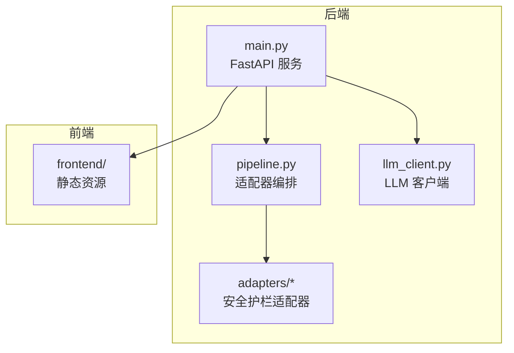
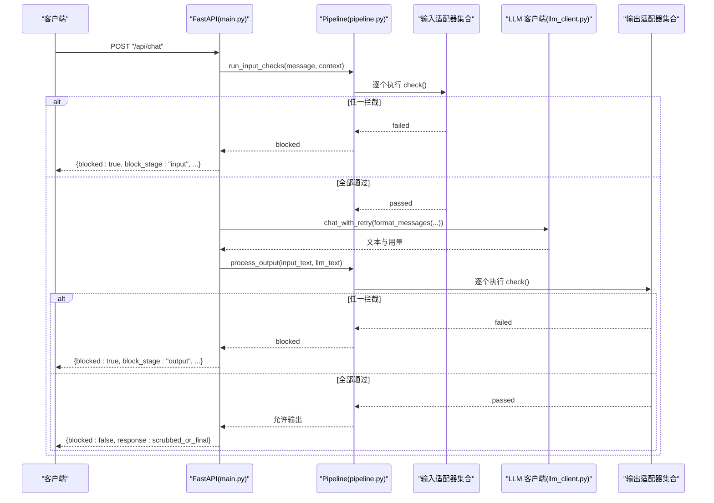
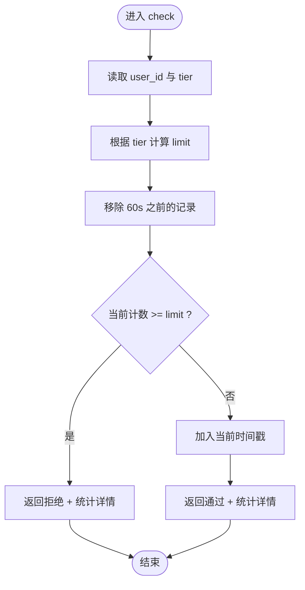
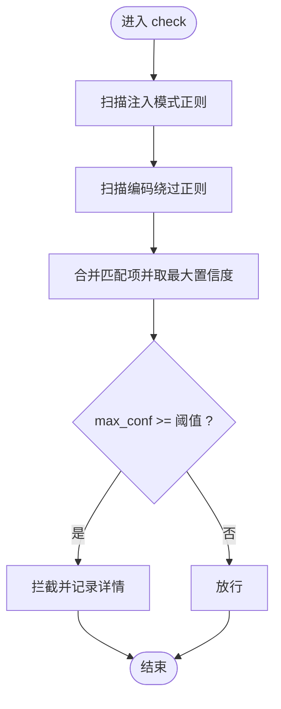
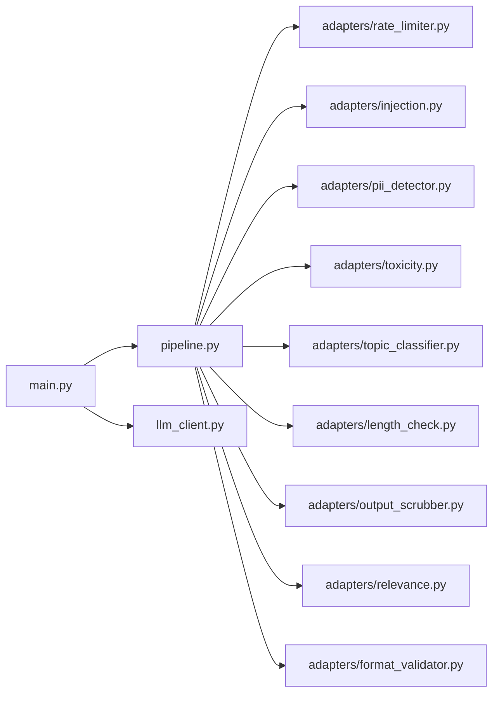

# 安全防护与治理

<cite>
**本文引用的文件**   
- [guardrails-sandbox/backend/adapters/base.py](file://guardrails-sandbox/backend/adapters/base.py)
- [guardrails-sandbox/backend/adapters/rate_limiter.py](file://guardrails-sandbox/backend/adapters/rate_limiter.py)
- [guardrails-sandbox/backend/adapters/injection.py](file://guardrails-sandbox/backend/adapters/injection.py)
- [guardrails-sandbox/backend/adapters/pii_detector.py](file://guardrails-sandbox/backend/adapters/pii_detector.py)
- [guardrails-sandbox/backend/adapters/toxicity.py](file://guardrails-sandbox/backend/adapters/toxicity.py)
- [guardrails-sandbox/backend/adapters/topic_classifier.py](file://guardrails-sandbox/backend/adapters/topic_classifier.py)
- [guardrails-sandbox/backend/adapters/length_check.py](file://guardrails-sandbox/backend/adapters/length_check.py)
- [guardrails-sandbox/backend/adapters/output_scrubber.py](file://guardrails-sandbox/backend/adapters/output_scrubber.py)
- [guardrails-sandbox/backend/adapters/relevance.py](file://guardrails-sandbox/backend/adapters/relevance.py)
- [guardrails-sandbox/backend/adapters/format_validator.py](file://guardrails-sandbox/backend/adapters/format_validator.py)
- [guardrails-sandbox/backend/pipeline.py](file://guardrails-sandbox/backend/pipeline.py)
- [guardrails-sandbox/backend/main.py](file://guardrails-sandbox/backend/main.py)
- [guardrails-sandbox/backend/llm_client.py](file://guardrails-sandbox/backend/llm_client.py)
- [guardrails-sandbox/backend/playground/base.py](file://guardrails-sandbox/backend/playground/base.py)
</cite>

## 目录
1. [引言](#引言)
2. [项目结构](#项目结构)
3. [核心组件](#核心组件)
4. [架构总览](#架构总览)
5. [详细组件分析](#详细组件分析)
6. [依赖关系分析](#依赖关系分析)
7. [性能考量](#性能考量)
8. [故障排查指南](#故障排查指南)
9. [结论](#结论)
10. [附录](#附录)

## 引言
本文件面向企业级 LLM 应用的安全防护与治理，系统梳理“安全护栏”（Guardrails）的设计原理与实现方法，覆盖输入侧的提示注入检测、速率限制、内容过滤、毒性检测、PII 识别、长度检查、话题分类，以及输出侧的相关性检查、格式校验与 PII 脱敏。文档同时给出合规治理的审计日志、访问控制、数据保护思路，配套安全事件响应、风险评估与威胁建模流程，并总结企业级部署的最佳实践与实施指南。

## 项目结构
本项目以“适配器 + 管线”的方式组织安全护栏能力，核心目录如下：
- backend/adapters：各类 Guardrail 适配器（输入/输出检查与处理）
- backend/pipeline.py：统一编排与统计
- backend/main.py：FastAPI 服务入口，集成适配器与 LLM 调用
- backend/llm_client.py：LLM 客户端封装与重试策略
- backend/playground/base.py：课程实验台模块抽象（与安全护栏并列的可扩展教学工具）

图表来源
- [guardrails-sandbox/backend/main.py:1-421](file://guardrails-sandbox/backend/main.py#L1-L421)
- [guardrails-sandbox/backend/pipeline.py:1-285](file://guardrails-sandbox/backend/pipeline.py#L1-L285)
- [guardrails-sandbox/backend/llm_client.py:1-51](file://guardrails-sandbox/backend/llm_client.py#L1-L51)

章节来源
- [guardrails-sandbox/backend/main.py:1-421](file://guardrails-sandbox/backend/main.py#L1-L421)
- [guardrails-sandbox/backend/pipeline.py:1-285](file://guardrails-sandbox/backend/pipeline.py#L1-L285)

## 核心组件
- 适配器基类与结果模型
  - GuardrailAdapter：定义统一接口与元数据（分组、类别、顺序、启用状态），子类仅需实现 check()。
  - GuardrailResult：封装通过/拒绝、原因、置信度、耗时与细节。
- 管线 Pipeline：负责注册适配器、按类别与顺序执行、统计与拦截历史记录。
- 服务入口 main：注册所有适配器，提供 API 路由，串联输入/输出检查与 LLM 调用。
- LLM 客户端 llm_client：封装调用、重试与消息格式化。

章节来源
- [guardrails-sandbox/backend/adapters/base.py:1-34](file://guardrails-sandbox/backend/adapters/base.py#L1-L34)
- [guardrails-sandbox/backend/pipeline.py:1-285](file://guardrails-sandbox/backend/pipeline.py#L1-L285)
- [guardrails-sandbox/backend/main.py:1-421](file://guardrails-sandbox/backend/main.py#L1-L421)
- [guardrails-sandbox/backend/llm_client.py:1-51](file://guardrails-sandbox/backend/llm_client.py#L1-L51)

## 架构总览
下图展示一次聊天请求在服务端的完整路径：输入检查（短路）、LLM 调用、输出检查（短路）、返回最终结果与日志。

图表来源
- [guardrails-sandbox/backend/main.py:155-221](file://guardrails-sandbox/backend/main.py#L155-L221)
- [guardrails-sandbox/backend/pipeline.py:31-161](file://guardrails-sandbox/backend/pipeline.py#L31-L161)
- [guardrails-sandbox/backend/llm_client.py:33-51](file://guardrails-sandbox/backend/llm_client.py#L33-L51)

## 详细组件分析

### 速率限制（RateLimiter）
- 设计要点
  - 基于滑动窗口的 RPM 限制，按用户维度维护时间戳队列。
  - 支持不同等级（免费/专业/企业）的限额。
- 行为特征
  - 超限时返回拒绝，包含等级、当前计数与上限；否则记录当前计数。
  - 低置信度用于快速短路，避免后续昂贵检查。
- 性能影响
  - O(n) 维护窗口（n 为该用户近一分钟内的请求数），常量空间；整体开销极低。

图表来源
- [guardrails-sandbox/backend/adapters/rate_limiter.py:19-55](file://guardrails-sandbox/backend/adapters/rate_limiter.py#L19-L55)

章节来源
- [guardrails-sandbox/backend/adapters/rate_limiter.py:1-56](file://guardrails-sandbox/backend/adapters/rate_limiter.py#L1-L56)

### 提示注入检测（InjectionDetector）
- 设计要点
  - 正则匹配已知攻击模式（英文/中文），涵盖“忽略先前指令”“开发者模式”“越狱”“打印系统提示”等。
  - 额外检测编码绕过（Unicode、Base64、ROT13、十六进制等）。
- 行为特征
  - 计算最大置信度，超过阈值即拦截；记录匹配项与数量。
- 适用场景
  - 防范 jailbreak、越狱提示、系统提示泄露等高风险输入。

图表来源
- [guardrails-sandbox/backend/adapters/injection.py:53-88](file://guardrails-sandbox/backend/adapters/injection.py#L53-L88)

章节来源
- [guardrails-sandbox/backend/adapters/injection.py:1-88](file://guardrails-sandbox/backend/adapters/injection.py#L1-L88)

### PII 检测（PiiDetector）
- 设计要点
  - 检测手机号、邮箱、身份证、信用卡号、IP 地址等。
  - 对 IP 地址采用“警告”策略以降低误报。
- 行为特征
  - 发现阻断型 PII 即拦截；记录检测到的类型、哈希摘要与置信度。
- 数据保护
  - 仅记录哈希片段，不存储明文敏感信息。

章节来源
- [guardrails-sandbox/backend/adapters/pii_detector.py:1-54](file://guardrails-sandbox/backend/adapters/pii_detector.py#L1-L54)

### 毒性过滤（ToxicityFilter）
- 设计要点
  - 检测暴力、违法活动、自残、仇恨言论、色情等类别。
  - 安全上下文前缀豁免（如“如何预防/帮助…”），避免误伤正当讨论。
- 行为特征
  - 依据类别置信度阈值决定拦截；记录命中类别与置信度。

章节来源
- [guardrails-sandbox/backend/adapters/toxicity.py:1-64](file://guardrails-sandbox/backend/adapters/toxicity.py#L1-L64)

### 话题分类（TopicClassifier）
- 设计要点
  - 明确禁止关键词优先拦截；允许白名单式宽松策略。
- 行为特征
  - 匹配到禁止词即拦截；否则放行。

章节来源
- [guardrails-sandbox/backend/adapters/topic_classifier.py:1-54](file://guardrails-sandbox/backend/adapters/topic_classifier.py#L1-L54)

### 长度检查（LengthChecker）
- 设计要点
  - 字符数与词数双阈值，防止超长输入导致资源滥用。
- 行为特征
  - 超限即拦截，返回计数与上限。

章节来源
- [guardrails-sandbox/backend/adapters/length_check.py:1-37](file://guardrails-sandbox/backend/adapters/length_check.py#L1-L37)

### 输出脱敏（OutputScrubber）
- 设计要点
  - 将检测到的 PII 替换为占位符，不阻断，仅净化输出。
- 行为特征
  - 修改上下文中的“脱敏输出”，供后续检查或返回使用。

章节来源
- [guardrails-sandbox/backend/adapters/output_scrubber.py:1-56](file://guardrails-sandbox/backend/adapters/output_scrubber.py#L1-L56)

### 相关性检查（RelevanceChecker）
- 设计要点
  - 基于关键词重叠度评估输出与输入的相关性。
  - 停用词过滤与最小意义词数阈值，避免短回答误判。
- 行为特征
  - 低于阈值拦截；记录重叠度与共享词。

章节来源
- [guardrails-sandbox/backend/adapters/relevance.py:1-70](file://guardrails-sandbox/backend/adapters/relevance.py#L1-L70)

### 格式校验（FormatValidator）
- 设计要点
  - 验证 JSON 可解析性、Markdown 代码块闭合、空输出、用户显式要求 JSON 的一致性。
- 行为特征
  - 错误级别拦截，警告级别仅记录；返回错误/警告清单与置信度。

章节来源
- [guardrails-sandbox/backend/adapters/format_validator.py:1-86](file://guardrails-sandbox/backend/adapters/format_validator.py#L1-L86)

### 管线编排（Pipeline）
- 设计要点
  - 按 order 排序执行；输入侧短路拦截；输出侧短路拦截；支持统计与拦截历史。
  - 提供树形结构视图（分组/类别/适配器）与开关控制。
- 行为特征
  - 统计 by_layer、总次数、拦截率；记录最近 50 条拦截历史。

章节来源
- [guardrails-sandbox/backend/pipeline.py:1-285](file://guardrails-sandbox/backend/pipeline.py#L1-L285)

### 服务入口（FastAPI）
- 设计要点
  - 注册所有适配器；提供获取适配器树、切换开关、清空历史、对比模式、基准测试等管理接口。
  - 对外暴露聊天接口，串联输入/输出检查与 LLM 调用。
- 安全特性
  - CORS 允许跨域；提供开关与统计接口便于运维治理。

章节来源
- [guardrails-sandbox/backend/main.py:1-421](file://guardrails-sandbox/backend/main.py#L1-L421)

### LLM 客户端（llm_client）
- 设计要点
  - 统一封装调用参数与返回结构；提供指数退避重试；格式化消息。
- 行为特征
  - 返回文本、模型名与 token 使用量；异常时重试。

章节来源
- [guardrails-sandbox/backend/llm_client.py:1-51](file://guardrails-sandbox/backend/llm_client.py#L1-L51)

## 依赖关系分析
- 组件耦合
  - main.py 仅依赖 pipeline 与 llm_client，保持清晰边界。
  - pipeline 仅依赖 adapters 的接口契约，不关心具体实现。
  - adapters 之间无直接耦合，均实现统一基类接口。
- 关键依赖链
  - main → pipeline → adapters（输入/输出）
  - main → llm_client（外部模型服务）

图表来源
- [guardrails-sandbox/backend/main.py:24-58](file://guardrails-sandbox/backend/main.py#L24-L58)
- [guardrails-sandbox/backend/pipeline.py:18-23](file://guardrails-sandbox/backend/pipeline.py#L18-L23)

章节来源
- [guardrails-sandbox/backend/main.py:1-421](file://guardrails-sandbox/backend/main.py#L1-L421)
- [guardrails-sandbox/backend/pipeline.py:1-285](file://guardrails-sandbox/backend/pipeline.py#L1-L285)

## 性能考量
- 时间复杂度
  - 正则匹配类适配器（注入、PII、毒性、话题、长度、相关性、格式）通常为 O(n) 文本扫描，n 为输入长度。
  - 速率限制为 O(k) 维护窗口（k 为近一分钟请求数），常量空间。
- 空间复杂度
  - 适配器内部使用有限状态（如队列、集合），与输入规模无关。
- 并发与吞吐
  - 服务端采用同步 FastAPI，适合中小并发；高并发建议引入异步或水平扩展。
- 模型加载
  - 预加载语义模型以规避异步环境连接问题，减少首次延迟。

章节来源
- [guardrails-sandbox/backend/main.py:62-76](file://guardrails-sandbox/backend/main.py#L62-L76)
- [guardrails-sandbox/backend/adapters/rate_limiter.py:19-55](file://guardrails-sandbox/backend/adapters/rate_limiter.py#L19-L55)

## 故障排查指南
- 常见问题定位
  - 输入被拦截：查看 block_stage 与 block_reason，确认具体适配器与置信度。
  - 输出被拦截：检查输出相关性、格式校验与 PII 脱敏是否触发。
  - LLM 调用失败：关注 llm_error 阶段与异常信息。
- 运维工具
  - 获取适配器树与统计：/api/guardrails
  - 切换适配器开关：/api/guardrails/toggle
  - 查看拦截历史：/api/guardrails/block-history
  - 清空历史：/api/guardrails/clear-history
  - 对比模式：/api/chat/compare
  - 基准测试：/api/benchmark
- 日志与可观测性
  - guardrail_logs 含每个适配器的通过/拒绝、置信度与耗时。
  - total_latency_ms 与 llm_latency_ms 便于定位瓶颈。

章节来源
- [guardrails-sandbox/backend/main.py:121-153](file://guardrails-sandbox/backend/main.py#L121-L153)
- [guardrails-sandbox/backend/main.py:223-281](file://guardrails-sandbox/backend/main.py#L223-L281)
- [guardrails-sandbox/backend/pipeline.py:247-285](file://guardrails-sandbox/backend/pipeline.py#L247-L285)

## 结论
本项目以“适配器 + 管线”的架构实现了覆盖输入/输出全链路的安全护栏体系，具备可插拔、可开关、可观测与可扩展的治理能力。结合速率限制、注入检测、内容过滤、PII 识别、格式校验与脱敏等机制，能够有效降低 LLM 应用的安全风险。建议在生产环境中配合完善的审计日志、访问控制与数据保护策略，持续进行风险评估与威胁建模，确保安全与合规的落地执行。

## 附录

### 合规治理与审计日志
- 审计日志
  - 记录拦截历史（时间戳、输入片段、适配器、阶段、原因、置信度与详情），支持清空与导出。
- 访问控制
  - 速率限制按等级区分；建议结合 API Key 与网关策略实现细粒度权限。
- 数据保护
  - PII 检测仅记录哈希摘要；输出脱敏替换敏感信息；避免在日志中留存明文敏感数据。

章节来源
- [guardrails-sandbox/backend/pipeline.py:264-285](file://guardrails-sandbox/backend/pipeline.py#L264-L285)
- [guardrails-sandbox/backend/adapters/pii_detector.py:35-53](file://guardrails-sandbox/backend/adapters/pii_detector.py#L35-L53)
- [guardrails-sandbox/backend/adapters/output_scrubber.py:25-55](file://guardrails-sandbox/backend/adapters/output_scrubber.py#L25-L55)

### 安全事件响应与风险评估
- 流程建议
  - 快速定位：依据 block_stage 与适配器名称锁定风险源。
  - 降级与隔离：临时关闭高误报适配器或临时放宽阈值。
  - 回滚与修复：更新规则集或模型参数，重新上线灰度验证。
  - 报告与归档：记录事件、处置过程与改进措施。
- 威胁建模
  - 关注提示注入、越狱、系统提示泄露、敏感信息泄漏、滥用与 DoS 等威胁面。

章节来源
- [guardrails-sandbox/backend/main.py:147-152](file://guardrails-sandbox/backend/main.py#L147-L152)
- [guardrails-sandbox/backend/pipeline.py:237-245](file://guardrails-sandbox/backend/pipeline.py#L237-L245)

### 企业级部署最佳实践
- 基础设施
  - 使用容器化与编排平台，配置健康检查与弹性伸缩。
  - 前置网关/反向代理实现限流、WAF 与 TLS 终止。
- 安全加固
  - 严格凭据管理（API Key、密钥轮换）；最小权限原则。
  - 网络隔离与出站策略；审计与告警联动。
- 运维治理
  - 开启并定期审查拦截历史与统计数据；建立变更评审与回滚机制。
  - 对高风险适配器配置告警阈值与人工复核流程。

章节来源
- [guardrails-sandbox/backend/main.py:78-85](file://guardrails-sandbox/backend/main.py#L78-L85)
- [guardrails-sandbox/backend/llm_client.py:11-12](file://guardrails-sandbox/backend/llm_client.py#L11-L12)