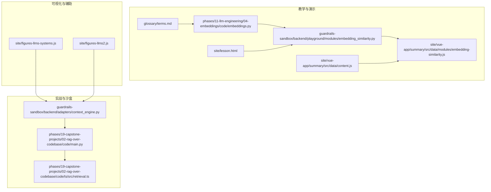
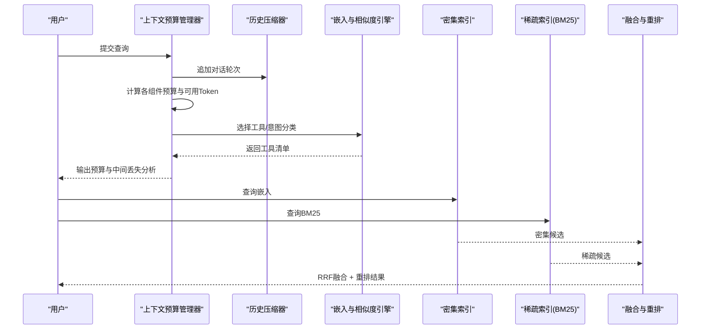
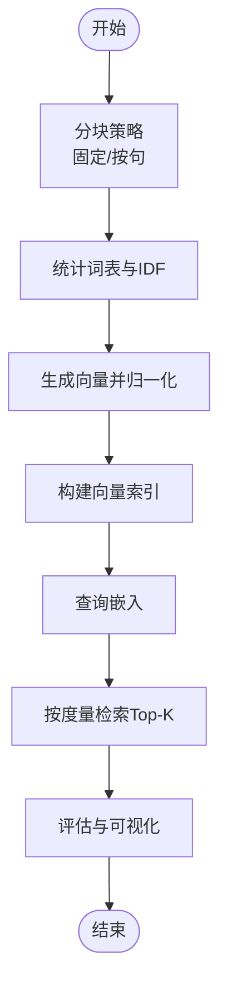
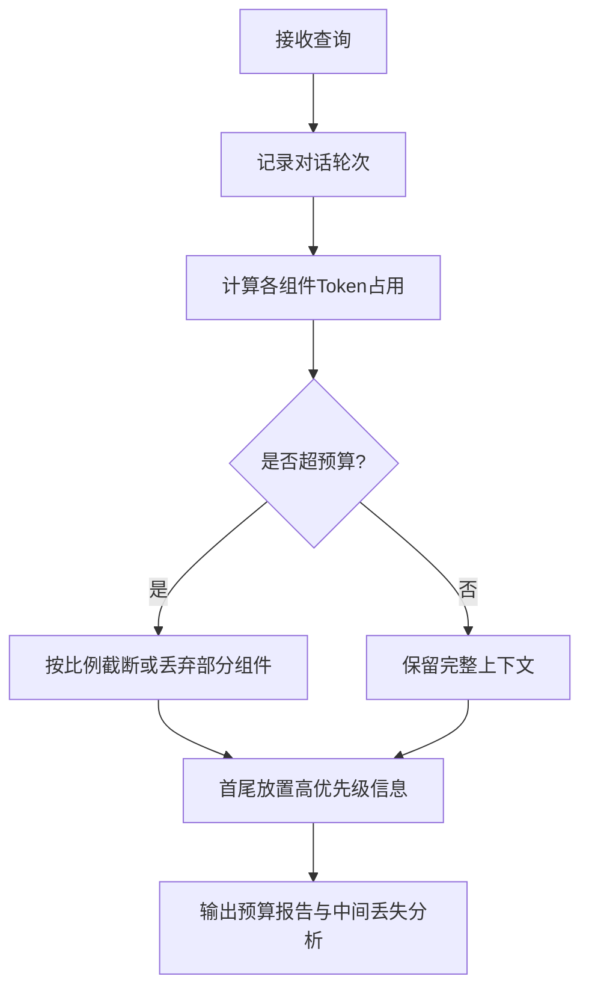
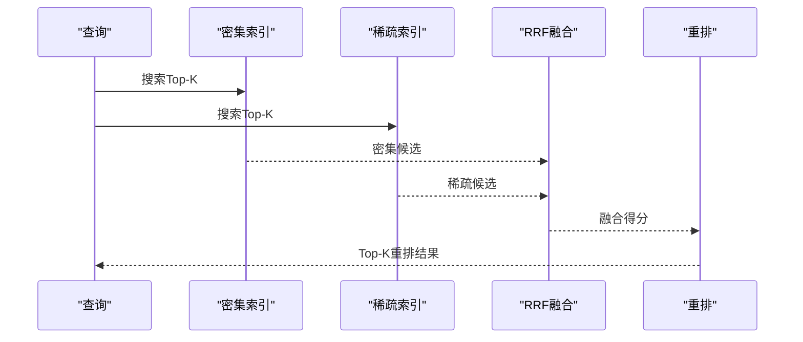
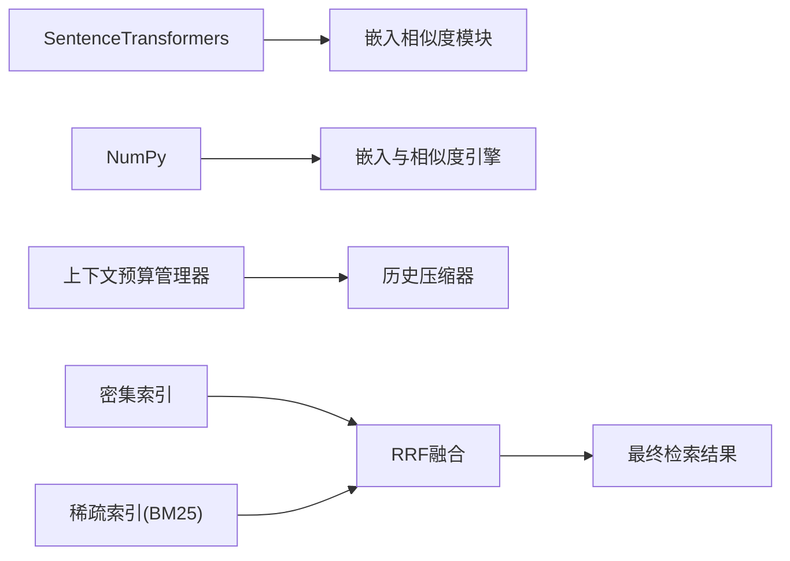

# 嵌入与上下文工程

<cite>
**本文引用的文件**
- [guardrails-sandbox/backend/adapters/context_engine.py](file://guardrails-sandbox/backend/adapters/context_engine.py)
- [phases/11-llm-engineering/04-embeddings/code/embeddings.py](file://phases/11-llm-engineering/04-embeddings/code/embeddings.py)
- [guardrails-sandbox/backend/playground/modules/embedding_similarity.py](file://guardrails-sandbox/backend/playground/modules/embedding_similarity.py)
- [test_embedding.py](file://test_embedding.py)
- [site/vue-app/summary/src/data/content.js](file://site/vue-app/summary/src/data/content.js)
- [site/vue-app/summary/src/data/modules/embedding-similarity.js](file://site/vue-app/summary/src/data/modules/embedding-similarity.js)
- [site/figures-llms-systems.js](file://site/figures-llms-systems.js)
- [site/figures-llms2.js](file://site/figures-llms2.js)
- [site/lesson.html](file://site/lesson.html)
- [glossary/terms.md](file://glossary/terms.md)
- [phases/05-nlp-foundations-to-advanced/23-chunking-strategies-rag/outputs/skill-chunker.zh.md](file://phases/05-nlp-foundations-to-advanced/23-chunking-strategies-rag/outputs/skill-chunker.zh.md)
- [phases/19-capstone-projects/02-rag-over-codebase/code/main.py](file://phases/19-capstone-projects/02-rag-over-codebase/code/main.py)
- [phases/19-capstone-projects/02-rag-over-codebase/code/ts/src/retrieval.ts](file://phases/19-capstone-projects/02-rag-over-codebase/code/ts/src/retrieval.ts)
</cite>

## 目录
1. [引言](#引言)
2. [项目结构](#项目结构)
3. [核心组件](#核心组件)
4. [架构总览](#架构总览)
5. [详细组件分析](#详细组件分析)
6. [依赖关系分析](#依赖关系分析)
7. [性能考量](#性能考量)
8. [故障排查指南](#故障排查指南)
9. [结论](#结论)
10. [附录](#附录)

## 引言
本文件围绕嵌入技术和上下文工程两大主题，系统梳理仓库中的实现与教学材料，覆盖嵌入向量的概念、生成与应用、相似度计算与评估、上下文长度管理与窗口优化、动态上下文构建策略，并结合实际项目需求给出模型与策略选择建议。读者可据此快速理解并落地嵌入与上下文工程的关键能力。

## 项目结构
本仓库将嵌入与上下文工程相关内容分布在多个层次：
- 教学与演示：课程代码、前端可视化模块、术语与问答材料
- 实战与沙盒：上下文预算管理器、向量相似度模块、RAG示例与检索融合流程
- 可视化与辅助：上下文窗口滑动图、滑动窗口注意力图等

**图表来源**
- [phases/11-llm-engineering/04-embeddings/code/embeddings.py:1-418](file://phases/11-llm-engineering/04-embeddings/code/embeddings.py#L1-L418)
- [guardrails-sandbox/backend/playground/modules/embedding_similarity.py:1-84](file://guardrails-sandbox/backend/playground/modules/embedding_similarity.py#L1-L84)
- [guardrails-sandbox/backend/adapters/context_engine.py:1-251](file://guardrails-sandbox/backend/adapters/context_engine.py#L1-L251)
- [phases/19-capstone-projects/02-rag-over-codebase/code/main.py:61-218](file://phases/19-capstone-projects/02-rag-over-codebase/code/main.py#L61-L218)
- [phases/19-capstone-projects/02-rag-over-codebase/code/ts/src/retrieval.ts:1-54](file://phases/19-capstone-projects/02-rag-over-codebase/code/ts/src/retrieval.ts#L1-L54)
- [site/vue-app/summary/src/data/content.js:67-99](file://site/vue-app/summary/src/data/content.js#L67-L99)
- [site/vue-app/summary/src/data/modules/embedding-similarity.js:37-65](file://site/vue-app/summary/src/data/modules/embedding-similarity.js#L37-L65)
- [site/figures-llms-systems.js:215-234](file://site/figures-llms-systems.js#L215-L234)
- [site/figures-llms2.js:333-376](file://site/figures-llms2.js#L333-L376)
- [site/lesson.html:3226-3232](file://site/lesson.html#L3226-L3232)
- [glossary/terms.md:68-88](file://glossary/terms.md#L68-L88)

**章节来源**
- [phases/11-llm-engineering/04-embeddings/code/embeddings.py:1-418](file://phases/11-llm-engineering/04-embeddings/code/embeddings.py#L1-L418)
- [guardrails-sandbox/backend/adapters/context_engine.py:1-251](file://guardrails-sandbox/backend/adapters/context_engine.py#L1-L251)

## 核心组件
- 嵌入与相似度
  - 文档分块：固定大小+重叠、按句切分
  - 嵌入器：TF-IDF词频加权向量，支持批量嵌入与归一化
  - 相似度：余弦相似度、点积、欧氏距离、汉明距离
  - 向量索引：支持多种相似度度量的检索
  - 示例与评估：对比不同度量、Matryoshka降维、二进制量化、分块大小实验
- 上下文工程
  - 预算管理：组件级Token分配、生成预留、剩余与占用率统计
  - 中间丢失重排序：重要信息优先置于首尾
  - 对话历史压缩：超限时摘要合并
  - 工具选择：基于查询意图的动态工具注册与预算控制
- RAG与检索融合
  - 密集索引：确定性哈希嵌入（用于演示）
  - 稀疏索引：BM25
  - 融合与重排：RRF、基于符号/摘要重叠的重排

**章节来源**
- [phases/11-llm-engineering/04-embeddings/code/embeddings.py:6-173](file://phases/11-llm-engineering/04-embeddings/code/embeddings.py#L6-L173)
- [guardrails-sandbox/backend/adapters/context_engine.py:80-171](file://guardrails-sandbox/backend/adapters/context_engine.py#L80-L171)
- [phases/19-capstone-projects/02-rag-over-codebase/code/main.py:61-218](file://phases/19-capstone-projects/02-rag-over-codebase/code/main.py#L61-L218)

## 架构总览
下图展示从“查询到上下文组装再到检索融合”的端到端流程，以及嵌入与相似度在其中的位置。

**图表来源**
- [guardrails-sandbox/backend/adapters/context_engine.py:179-242](file://guardrails-sandbox/backend/adapters/context_engine.py#L179-L242)
- [phases/19-capstone-projects/02-rag-over-codebase/code/main.py:183-195](file://phases/19-capstone-projects/02-rag-over-codebase/code/main.py#L183-L195)
- [phases/19-capstone-projects/02-rag-over-codebase/code/ts/src/retrieval.ts:27-44](file://phases/19-capstone-projects/02-rag-over-codebase/code/ts/src/retrieval.ts#L27-L44)

## 详细组件分析

### 嵌入与相似度引擎
- 文档分块
  - 固定大小+重叠：适合规则明确、长度可控的文档
  - 按句切分：保持语义完整性，避免跨句片段割裂
- 嵌入器
  - TF-IDF加权向量，归一化后作为稠密向量
  - 支持批量嵌入，便于索引构建
- 相似度与索引
  - 多种度量：余弦、点积、欧氏、汉明
  - 索引支持Top-K检索与元数据回填
- 高级特性
  - Matryoshka降维：对同一查询/文档在不同维度上做相似度评估
  - 二进制量化：显著降低存储开销，保留相对顺序一致性
  - 分块大小实验：在召回与上下文占用之间权衡

**图表来源**
- [phases/11-llm-engineering/04-embeddings/code/embeddings.py:138-173](file://phases/11-llm-engineering/04-embeddings/code/embeddings.py#L138-L173)

**章节来源**
- [phases/11-llm-engineering/04-embeddings/code/embeddings.py:6-173](file://phases/11-llm-engineering/04-embeddings/code/embeddings.py#L6-L173)
- [site/vue-app/summary/src/data/content.js:74-83](file://site/vue-app/summary/src/data/content.js#L74-L83)
- [site/vue-app/summary/src/data/modules/embedding-similarity.js:37-65](file://site/vue-app/summary/src/data/modules/embedding-similarity.js#L37-L65)
- [site/lesson.html:3226-3232](file://site/lesson.html#L3226-L3232)

### 上下文预算与中间丢失重排序
- 预算管理
  - 组件级分配：系统提示、工具、历史、生成预留、检索等
  - 动态截断：当超过可用Token时，按比例缩短文本
  - 占用率与剩余：实时统计与报告
- 中间丢失重排序
  - 将高优先级信息置于上下文首尾，降低被模型“遗忘”的概率
- 对话历史压缩
  - 超限时将早期轮次摘要化，减少冗余

**图表来源**
- [guardrails-sandbox/backend/adapters/context_engine.py:80-129](file://guardrails-sandbox/backend/adapters/context_engine.py#L80-L129)
- [guardrails-sandbox/backend/adapters/context_engine.py:20-29](file://guardrails-sandbox/backend/adapters/context_engine.py#L20-L29)

**章节来源**
- [guardrails-sandbox/backend/adapters/context_engine.py:14-129](file://guardrails-sandbox/backend/adapters/context_engine.py#L14-L129)
- [site/figures-llms-systems.js:215-234](file://site/figures-llms-systems.js#L215-L234)
- [site/figures-llms2.js:333-376](file://site/figures-llms2.js#L333-L376)

### RAG与检索融合
- 密集索引
  - 使用确定性哈希嵌入（演示用），可替换为真实模型
- 稀疏索引
  - 自行实现BM25，支持IDF与文档长度归一化
- 融合与重排
  - Reciprocal Rank Fusion（RRF）：对不同来源的候选进行秩倒数融合
  - 重排：基于查询与符号/摘要的重叠度加权

**图表来源**
- [phases/19-capstone-projects/02-rag-over-codebase/code/main.py:126-195](file://phases/19-capstone-projects/02-rag-over-codebase/code/main.py#L126-L195)
- [phases/19-capstone-projects/02-rag-over-codebase/code/ts/src/retrieval.ts:6-44](file://phases/19-capstone-projects/02-rag-over-codebase/code/ts/src/retrieval.ts#L6-L44)

**章节来源**
- [phases/19-capstone-projects/02-rag-over-codebase/code/main.py:61-218](file://phases/19-capstone-projects/02-rag-over-codebase/code/main.py#L61-L218)
- [phases/19-capstone-projects/02-rag-over-codebase/code/ts/src/retrieval.ts:1-54](file://phases/19-capstone-projects/02-rag-over-codebase/code/ts/src/retrieval.ts#L1-L54)

## 依赖关系分析
- 嵌入与相似度
  - 依赖NumPy进行向量运算
  - 通过SentenceTransformers加载中文优化模型进行相似度演示
- 上下文工程
  - 依赖基础适配器框架输出GuardrailResult
  - 与全局预算与历史压缩器共享状态
- RAG与检索
  - Python版与TypeScript版并行实现，逻辑一致

**图表来源**
- [guardrails-sandbox/backend/playground/modules/embedding_similarity.py:43-46](file://guardrails-sandbox/backend/playground/modules/embedding_similarity.py#L43-L46)
- [phases/11-llm-engineering/04-embeddings/code/embeddings.py:1-10](file://phases/11-llm-engineering/04-embeddings/code/embeddings.py#L1-L10)
- [guardrails-sandbox/backend/adapters/context_engine.py:1-11](file://guardrails-sandbox/backend/adapters/context_engine.py#L1-L11)
- [phases/19-capstone-projects/02-rag-over-codebase/code/main.py:149-176](file://phases/19-capstone-projects/02-rag-over-codebase/code/main.py#L149-L176)

**章节来源**
- [guardrails-sandbox/backend/playground/modules/embedding_similarity.py:1-84](file://guardrails-sandbox/backend/playground/modules/embedding_similarity.py#L1-L84)
- [phases/11-llm-engineering/04-embeddings/code/embeddings.py:1-10](file://phases/11-llm-engineering/04-embeddings/code/embeddings.py#L1-L10)
- [guardrails-sandbox/backend/adapters/context_engine.py:1-11](file://guardrails-sandbox/backend/adapters/context_engine.py#L1-L11)

## 性能考量
- 嵌入与检索
  - 度量选择：余弦相似度忽略幅度差异，更适合语义匹配
  - 存储优化：二进制量化可显著降低存储；Matryoshka降维可在不同精度间折中
  - 分块策略：过小会丢失上下文，过大稀释相关性；需结合查询分布做消融实验
- 上下文窗口
  - 滚动上下文：超出窗口的旧token会被“遗忘”，应通过摘要或检索回填
  - 滑动窗口注意力：以宽度w限制注意力范围，降低计算复杂度
- RAG融合
  - RRF对不同来源的候选进行秩倒数融合，兼顾多样性与相关性
  - 重排阶段加入符号/摘要重叠度，提升最终相关性

**章节来源**
- [phases/11-llm-engineering/04-embeddings/code/embeddings.py:351-413](file://phases/11-llm-engineering/04-embeddings/code/embeddings.py#L351-L413)
- [site/figures-llms-systems.js:215-234](file://site/figures-llms-systems.js#L215-L234)
- [site/figures-llms2.js:333-376](file://site/figures-llms2.js#L333-L376)
- [phases/19-capstone-projects/02-rag-over-codebase/code/main.py:149-176](file://phases/19-capstone-projects/02-rag-over-codebase/code/main.py#L149-L176)

## 故障排查指南
- 嵌入相似度异常
  - 确认输入非空且已清洗
  - 检查模型加载路径与本地文件可用性
  - 参考相似度阈值与评分说明进行判断
- 上下文预算不足
  - 检查各组件分配是否合理，必要时缩短文本或移除低优先级组件
  - 关注生成预留是否过大导致其他组件无空间
- 检索效果不佳
  - 调整分块大小与重叠，结合查询分布做A/B测试
  - 在RRF与重排阶段增加符号/摘要重叠权重
- 术语与概念偏差
  - 参考术语表对“分块”“对比学习”“余弦相似度”等进行统一理解

**章节来源**
- [guardrails-sandbox/backend/playground/modules/embedding_similarity.py:48-83](file://guardrails-sandbox/backend/playground/modules/embedding_similarity.py#L48-L83)
- [guardrails-sandbox/backend/adapters/context_engine.py:89-106](file://guardrails-sandbox/backend/adapters/context_engine.py#L89-L106)
- [phases/19-capstone-projects/02-rag-over-codebase/code/main.py:167-176](file://phases/19-capstone-projects/02-rag-over-codebase/code/main.py#L167-L176)
- [glossary/terms.md:68-88](file://glossary/terms.md#L68-L88)

## 结论
本仓库提供了从理论到实践的嵌入与上下文工程闭环：通过清晰的分块策略与相似度度量，构建稳定可靠的向量检索；通过预算管理与中间丢失重排序，保障长上下文下的信息可见性；通过RAG融合与重排，实现多源信息的高质量整合。结合可视化与教学材料，读者可快速掌握并迭代优化自身系统的嵌入与上下文工程能力。

## 附录
- 嵌入模型与适用场景（来自教学材料）
  - shibing624/text2vec-base-chinese：中文优化，适合中文语料的相似度任务
  - OpenAI text-embedding-3-small：高精度、商业可用
  - BGE-M3：开源免费
  - Voyage-3：面向多语言与代码场景
- 分块策略建议（来自技能文档）
  - 明确策略、块大小、重叠、最小/最大Token保护、评估方案（Recall@5）

**章节来源**
- [site/vue-app/summary/src/data/content.js:74-83](file://site/vue-app/summary/src/data/content.js#L74-L83)
- [phases/05-nlp-foundations-to-advanced/23-chunking-strategies-rag/outputs/skill-chunker.zh.md:10-18](file://phases/05-nlp-foundations-to-advanced/23-chunking-strategies-rag/outputs/skill-chunker.zh.md#L10-L18)