# 成本优化与缓存

<cite>
**本文引用的文件**
- [caching_cost.py](file://phases/11-llm-engineering/11-caching-cost/code/caching_cost.py)
- [exact_cache.py](file://guardrails-sandbox/backend/adapters/exact_cache.py)
- [rate_limiter.py](file://guardrails-sandbox/backend/adapters/rate_limiter.py)
- [base.py](file://guardrails-sandbox/backend/adapters/base.py)
- [pipeline.py](file://guardrails-sandbox/backend/pipeline.py)
- [cost-estimator.js](file://site/vue-app/summary/src/data/modules/cost-estimator.js)
- [index-CrTox38F.js](file://site/summary/assets/index-CrTox38F.js)
- [figures-llms-systems.js](file://site/figures-llms-systems.js)
- [figures-infra.js](file://site/figures-infra.js)
</cite>

## 目录
1. [引言](#引言)
2. [项目结构](#项目结构)
3. [核心组件](#核心组件)
4. [架构总览](#架构总览)
5. [详细组件分析](#详细组件分析)
6. [依赖分析](#依赖分析)
7. [性能考虑](#性能考虑)
8. [故障排查指南](#故障排查指南)
9. [结论](#结论)
10. [附录](#附录)

## 引言
本技术文档聚焦于大型语言模型（LLM）应用的成本优化与缓存策略，系统阐述推理成本构成、缓存设计与实现、预算与资源管理、以及异步与批处理等性能优化手段。文档以仓库中的演示代码与可视化素材为基础，结合面向生产的 Guardrails 管线，给出可落地的工程实践与最佳实践。

## 项目结构
本项目围绕“缓存与成本优化”主题提供了两类材料：
- 演示与教学代码：位于 phases/11-llm-engineering/11-caching-cost/code/caching_cost.py，涵盖精确缓存、语义缓存、令牌桶限流、成本跟踪、模型路由与演示运行。
- 生产级 Guardrails 管线：位于 guardrails-sandbox/backend，包含适配器基类、精确缓存适配器、速率限制适配器、以及编排管道，支撑输入/输出安全与性能治理。

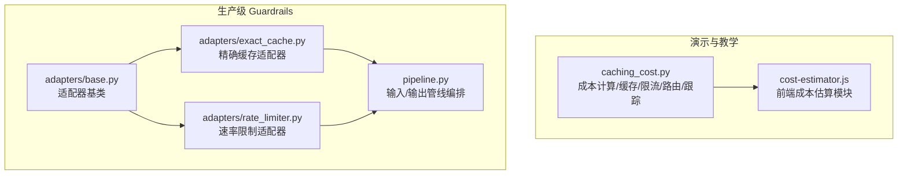

**图表来源**
- [caching_cost.py:1-511](file://phases/11-llm-engineering/11-caching-cost/code/caching_cost.py#L1-L511)
- [cost-estimator.js:1-73](file://site/vue-app/summary/src/data/modules/cost-estimator.js#L1-L73)
- [base.py:1-34](file://guardrails-sandbox/backend/adapters/base.py#L1-L34)
- [exact_cache.py:1-69](file://guardrails-sandbox/backend/adapters/exact_cache.py#L1-L69)
- [rate_limiter.py:1-56](file://guardrails-sandbox/backend/adapters/rate_limiter.py#L1-L56)
- [pipeline.py:1-285](file://guardrails-sandbox/backend/pipeline.py#L1-L285)

**章节来源**
- [caching_cost.py:1-511](file://phases/11-llm-engineering/11-caching-cost/code/caching_cost.py#L1-L511)
- [cost-estimator.js:1-73](file://site/vue-app/summary/src/data/modules/cost-estimator.js#L1-L73)
- [base.py:1-34](file://guardrails-sandbox/backend/adapters/base.py#L1-L34)
- [exact_cache.py:1-69](file://guardrails-sandbox/backend/adapters/exact_cache.py#L1-L69)
- [rate_limiter.py:1-56](file://guardrails-sandbox/backend/adapters/rate_limiter.py#L1-L56)
- [pipeline.py:1-285](file://guardrails-sandbox/backend/pipeline.py#L1-L285)

## 核心组件
- 成本计算与跟踪：提供按模型、输入/输出/缓存输入的计费模型与调用日志记录、预算告警、按模型聚合统计。
- 缓存体系：精确缓存（完全相同输入命中）、语义缓存（向量相似度命中）、事实性分类器（区分事实性与创意性问题）。
- 速率限制：基于令牌桶与滑动窗口的两级限流（RPM/TMP），按用户等级分配额度。
- 模型路由：根据问题复杂度选择合适模型，平衡成本与质量。
- Guardrails 管线：将适配器按类别与顺序编排，输入/输出阶段短路拦截，支持开关与统计。

**章节来源**
- [caching_cost.py:25-43](file://phases/11-llm-engineering/11-caching-cost/code/caching_cost.py#L25-L43)
- [caching_cost.py:46-93](file://phases/11-llm-engineering/11-caching-cost/code/caching_cost.py#L46-L93)
- [caching_cost.py:115-162](file://phases/11-llm-engineering/11-caching-cost/code/caching_cost.py#L115-L162)
- [caching_cost.py:165-227](file://phases/11-llm-engineering/11-caching-cost/code/caching_cost.py#L165-L227)
- [caching_cost.py:230-304](file://phases/11-llm-engineering/11-caching-cost/code/caching_cost.py#L230-L304)
- [caching_cost.py:320-328](file://phases/11-llm-engineering/11-caching-cost/code/caching_cost.py#L320-L328)
- [exact_cache.py:12-69](file://guardrails-sandbox/backend/adapters/exact_cache.py#L12-L69)
- [rate_limiter.py:7-56](file://guardrails-sandbox/backend/adapters/rate_limiter.py#L7-L56)
- [pipeline.py:12-127](file://guardrails-sandbox/backend/pipeline.py#L12-L127)

## 架构总览
下图展示从请求到响应的关键路径：输入经 Guardrails 管线，随后进入缓存层（精确/语义），命中则直接返回；未命中则进行模型路由与调用，再回填缓存并返回。

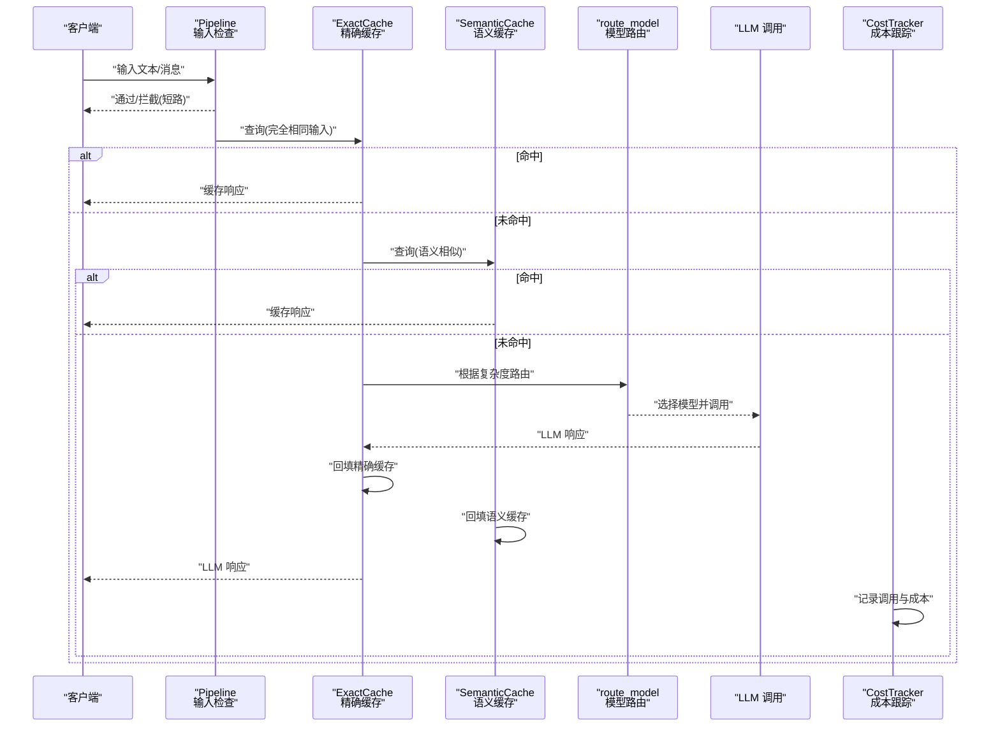

**图表来源**
- [pipeline.py:31-56](file://guardrails-sandbox/backend/pipeline.py#L31-L56)
- [exact_cache.py:44-69](file://guardrails-sandbox/backend/adapters/exact_cache.py#L44-L69)
- [caching_cost.py:115-162](file://phases/11-llm-engineering/11-caching-cost/code/caching_cost.py#L115-L162)
- [caching_cost.py:320-328](file://phases/11-llm-engineering/11-caching-cost/code/caching_cost.py#L320-L328)
- [caching_cost.py:331-341](file://phases/11-llm-engineering/11-caching-cost/code/caching_cost.py#L331-L341)
- [caching_cost.py:230-304](file://phases/11-llm-engineering/11-caching-cost/code/caching_cost.py#L230-L304)

## 详细组件分析

### 成本计算与跟踪
- 成本模型：按模型区分 input/output/cached_input 三档计费，cached_input 用于已命中缓存的输入部分，体现“提示缓存”的价值。
- 跟踪器：记录每次调用的模型、token 数、延迟、缓存状态，支持预算告警、按模型聚合、缓存节省统计与摘要。
- 成本估算前端模块：提供交互式成本估算界面，支持不同模型与命中率对比，辅助预算规划。

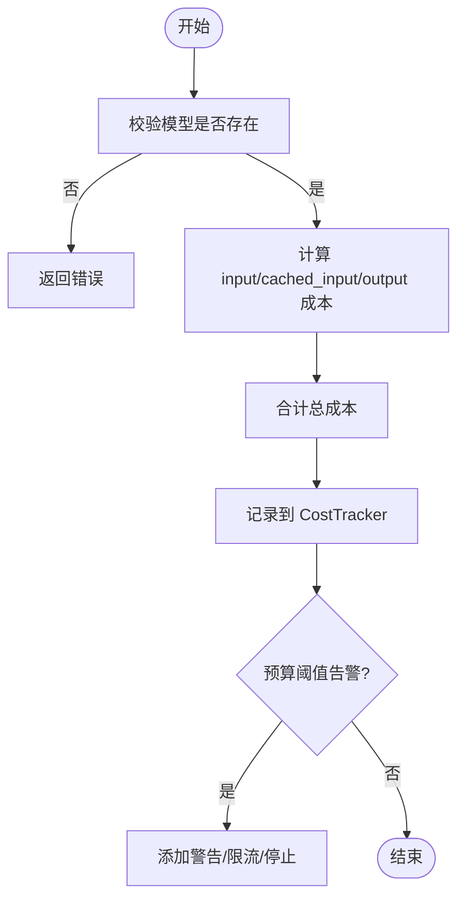

**图表来源**
- [caching_cost.py:25-43](file://phases/11-llm-engineering/11-caching-cost/code/caching_cost.py#L25-L43)
- [caching_cost.py:230-304](file://phases/11-llm-engineering/11-caching-cost/code/caching_cost.py#L230-L304)
- [cost-estimator.js:11-54](file://site/vue-app/summary/src/data/modules/cost-estimator.js#L11-L54)

**章节来源**
- [caching_cost.py:25-43](file://phases/11-llm-engineering/11-caching-cost/code/caching_cost.py#L25-L43)
- [caching_cost.py:230-304](file://phases/11-llm-engineering/11-caching-cost/code/caching_cost.py#L230-L304)
- [cost-estimator.js:1-73](file://site/vue-app/summary/src/data/modules/cost-estimator.js#L1-L73)

### 精确缓存（ExactCache）
- 设计要点：对完全相同的输入（模型、消息、温度）生成哈希键，命中返回缓存；温度 > 0 时不缓存（非确定性）。
- 生命周期：TTL 过期自动清理，满容量时按最旧淘汰；统计命中/未命中与命中率。
- 适用场景：确定性问题（temperature=0）且表达完全一致的重复查询。

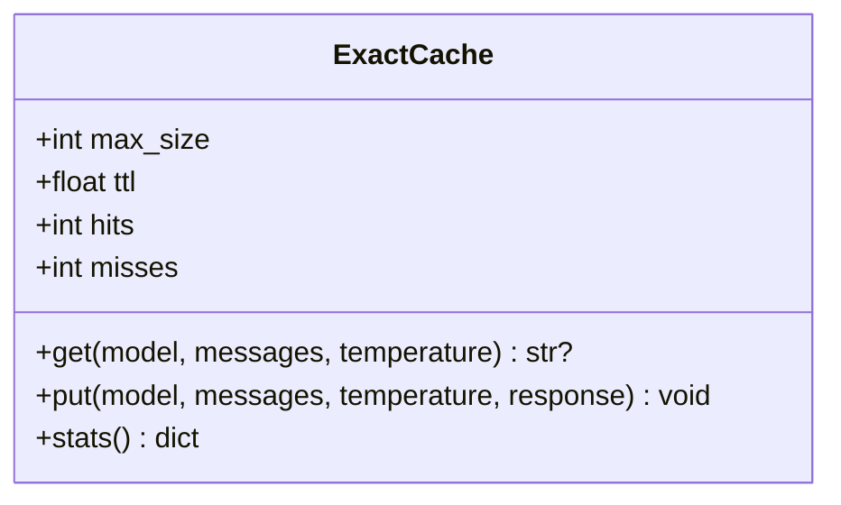

**图表来源**
- [caching_cost.py:46-93](file://phases/11-llm-engineering/11-caching-cost/code/caching_cost.py#L46-L93)
- [exact_cache.py:20-43](file://guardrails-sandbox/backend/adapters/exact_cache.py#L20-L43)

**章节来源**
- [caching_cost.py:46-93](file://phases/11-llm-engineering/11-caching-cost/code/caching_cost.py#L46-L93)
- [exact_cache.py:12-69](file://guardrails-sandbox/backend/adapters/exact_cache.py#L12-L69)

### 语义缓存（SemanticCache）
- 设计要点：对问题进行向量化（词袋归一化/句子编码），计算余弦相似度，超过阈值则命中。
- 生命周期：TTL 过期清理，满容量按最旧淘汰；统计命中/未命中与命中率。
- 适用场景：用户表达多样化但语义一致的问题（如客服问答）。

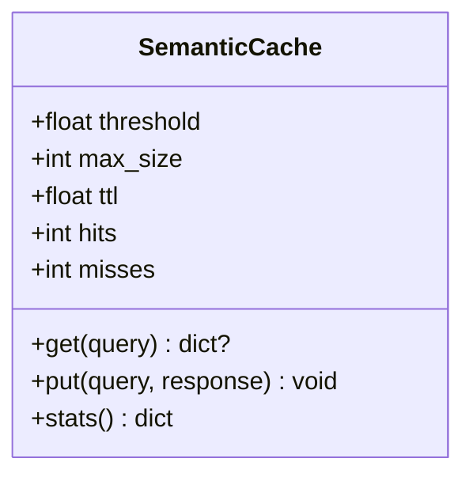

**图表来源**
- [caching_cost.py:115-162](file://phases/11-llm-engineering/11-caching-cost/code/caching_cost.py#L115-L162)
- [index-CrTox38F.js:275-313](file://site/summary/assets/index-CrTox38F.js#L275-L313)

**章节来源**
- [caching_cost.py:115-162](file://phases/11-llm-engineering/11-caching-cost/code/caching_cost.py#L115-L162)
- [index-CrTox38F.js:275-313](file://site/summary/assets/index-CrTox38F.js#L275-L313)

### 事实性分类器（FactualClassifier）
- 设计要点：在语义缓存前加入事实性/创意性二分类，避免将创意性问题（如“写差评”）缓存，防止污染缓存与误导。
- 实现建议：使用小型 cross-encoder 模型对问题进行分类，阈值 > 0.5 视为 factual。

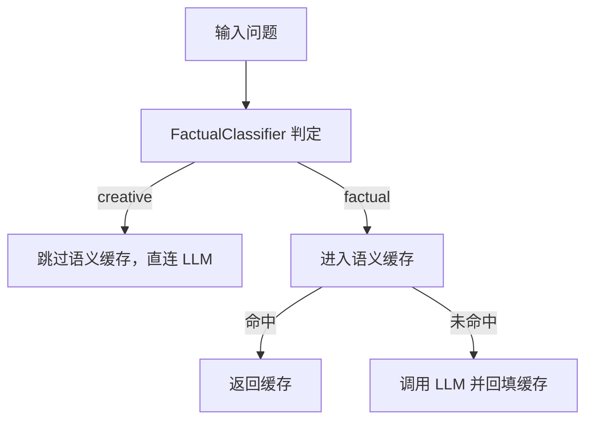

**图表来源**
- [index-CrTox38F.js:632-638](file://site/summary/assets/index-CrTox38F.js#L632-L638)

**章节来源**
- [index-CrTox38F.js:632-638](file://site/summary/assets/index-CrTox38F.js#L632-L638)

### 令牌桶限流（TokenBucketRateLimiter）
- 设计要点：按用户等级设置容量与补充速率，支持每分钟最大请求数（RPM）与每日 token 总额限制，双重保护。
- 使用建议：结合成本跟踪与预算告警，达到阈值自动降级或限流。

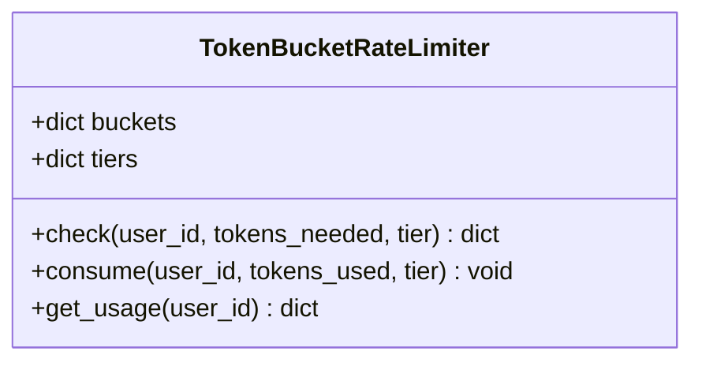

**图表来源**
- [caching_cost.py:165-227](file://phases/11-llm-engineering/11-caching-cost/code/caching_cost.py#L165-L227)

**章节来源**
- [caching_cost.py:165-227](file://phases/11-llm-engineering/11-caching-cost/code/caching_cost.py#L165-L227)

### 模型路由（route_model）
- 设计要点：根据关键词与长度将问题分为 simple/medium/complex，结合用户 tier 选择合适模型，平衡成本与质量。
- 实现建议：可扩展为基于小模型的自动分类器，或引入 LLM 自判路由目标。

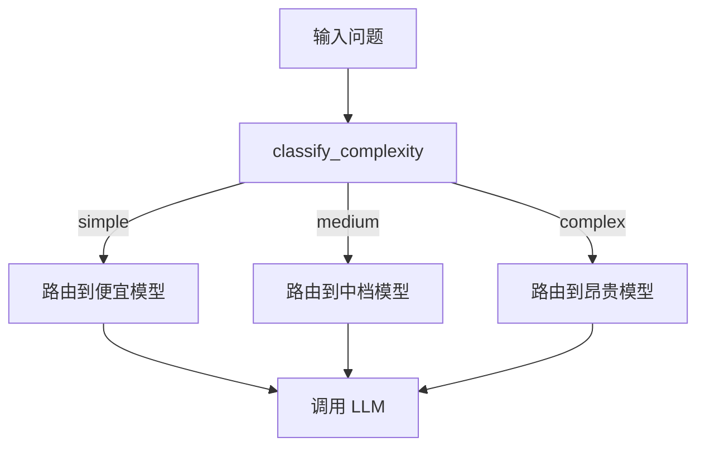

**图表来源**
- [caching_cost.py:311-328](file://phases/11-llm-engineering/11-caching-cost/code/caching_cost.py#L311-L328)

**章节来源**
- [caching_cost.py:311-328](file://phases/11-llm-engineering/11-caching-cost/code/caching_cost.py#L311-L328)

### Guardrails 管线（Pipeline）
- 设计要点：将适配器按类别（input/output）与顺序（order）编排，输入阶段短路拦截，输出阶段可进行脱敏与二次检查。
- 适用场景：生产级安全与合规，前置拦截显著降低 API 调用与成本。

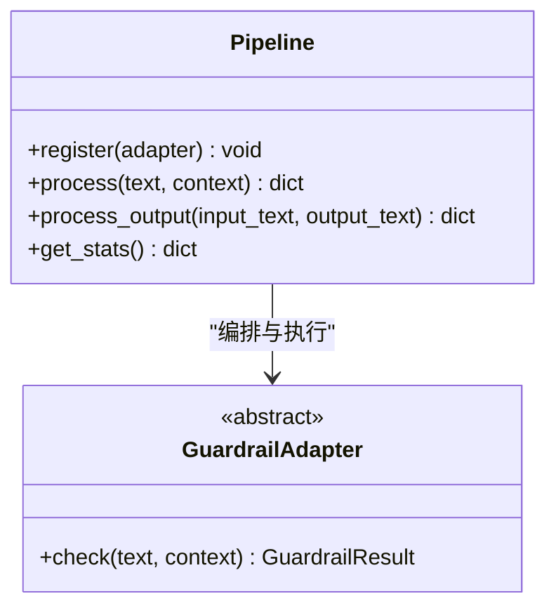

**图表来源**
- [pipeline.py:12-127](file://guardrails-sandbox/backend/pipeline.py#L12-L127)
- [base.py:14-31](file://guardrails-sandbox/backend/adapters/base.py#L14-L31)

**章节来源**
- [pipeline.py:12-127](file://guardrails-sandbox/backend/pipeline.py#L12-L127)
- [base.py:14-31](file://guardrails-sandbox/backend/adapters/base.py#L14-L31)

## 依赖分析
- 组件耦合：缓存层与路由/限流/跟踪相互独立，通过统一的调用入口串联；Guardrails 管线作为前置过滤器，降低下游压力。
- 外部依赖：语义缓存使用句子向量编码器；前端成本估算模块提供交互式体验。
- 可能的循环依赖：当前文件间无循环导入，结构清晰。

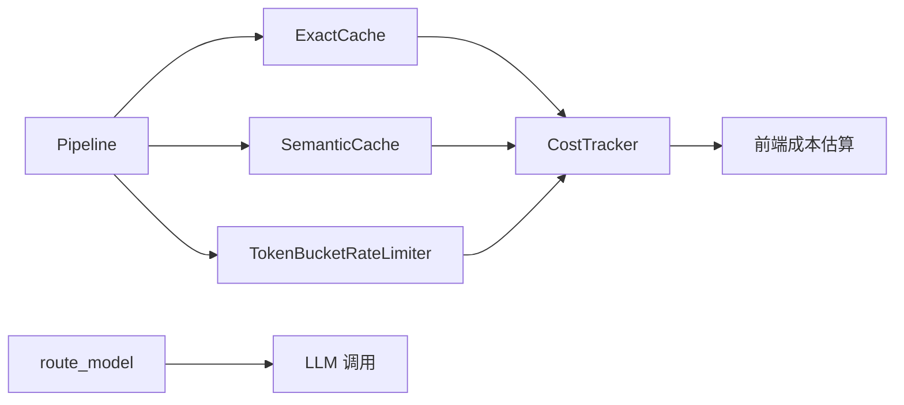

**图表来源**
- [caching_cost.py:230-304](file://phases/11-llm-engineering/11-caching-cost/code/caching_cost.py#L230-L304)
- [exact_cache.py:44-69](file://guardrails-sandbox/backend/adapters/exact_cache.py#L44-L69)
- [rate_limiter.py:22-56](file://guardrails-sandbox/backend/adapters/rate_limiter.py#L22-L56)
- [pipeline.py:31-56](file://guardrails-sandbox/backend/pipeline.py#L31-L56)
- [cost-estimator.js:1-73](file://site/vue-app/summary/src/data/modules/cost-estimator.js#L1-L73)

**章节来源**
- [caching_cost.py:230-304](file://phases/11-llm-engineering/11-caching-cost/code/caching_cost.py#L230-L304)
- [exact_cache.py:44-69](file://guardrails-sandbox/backend/adapters/exact_cache.py#L44-L69)
- [rate_limiter.py:22-56](file://guardrails-sandbox/backend/adapters/rate_limiter.py#L22-L56)
- [pipeline.py:31-56](file://guardrails-sandbox/backend/pipeline.py#L31-L56)
- [cost-estimator.js:1-73](file://site/vue-app/summary/src/data/modules/cost-estimator.js#L1-L73)

## 性能考虑
- 批量与连续批处理：通过增大批大小提升吞吐，但会增加单请求延迟；应在“膝点”附近选择最优批大小。
- 连续批填充：GPU Slot 连续填充可提升利用率，减少空闲。
- 异步与并发：在 Guardrails 管线与 LLM 调用之间采用异步与连接池，避免阻塞；结合滑动窗口限流控制突发。
- 预取与预热：热点问题提前回填缓存，冷启动时预热向量模型与路由策略。

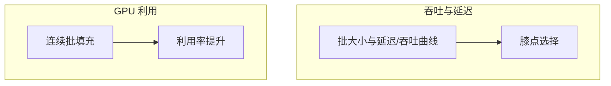

**图表来源**
- [figures-infra.js:267-302](file://site/figures-infra.js#L267-L302)
- [figures-llms-systems.js:278-335](file://site/figures-llms-systems.js#L278-L335)

**章节来源**
- [figures-infra.js:267-302](file://site/figures-infra.js#L267-L302)
- [figures-llms-systems.js:278-335](file://site/figures-llms-systems.js#L278-L335)

## 故障排查指南
- 缓存未命中
  - 精确缓存：检查 temperature 是否为 0；确认消息结构与键一致。
  - 语义缓存：调整相似度阈值；确认 TTL 未过期；必要时更换向量模型。
- 限流触发
  - 检查用户等级与额度；观察每分钟请求数是否超限；核对每日 token 消耗。
- 预算告警
  - 关注 CostTracker 的警告级别；及时降级或切换模型；核对路由策略。
- Guardrails 拦截
  - 查看管线统计与拦截历史；定位具体适配器；评估误杀率并调整阈值。

**章节来源**
- [caching_cost.py:165-227](file://phases/11-llm-engineering/11-caching-cost/code/caching_cost.py#L165-L227)
- [caching_cost.py:230-304](file://phases/11-llm-engineering/11-caching-cost/code/caching_cost.py#L230-L304)
- [pipeline.py:247-285](file://guardrails-sandbox/backend/pipeline.py#L247-L285)

## 结论
通过“精确缓存 + 语义缓存 + 事实性过滤 + 模型路由 + 令牌桶限流 + 成本跟踪”的组合拳，可在保证质量的前提下显著降低成本与延迟。生产环境中建议以 Guardrails 管线作为前置过滤器，配合前端成本估算工具进行预算规划，并在异步与批处理方面持续优化。

## 附录
- 成本控制案例与最佳实践
  - 确定性问题（temperature=0）优先走精确缓存；语义缓存用于多样化表达。
  - 复杂度高的问题使用昂贵模型，简单问题走便宜模型；结合路由策略动态选择。
  - 严格限流与预算告警，达到阈值自动降级或限流。
  - 定期评估缓存命中率与相似度阈值，持续优化。