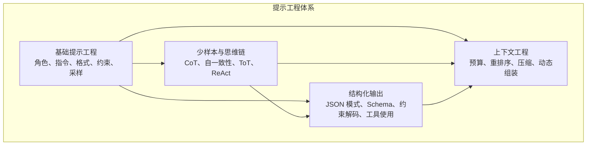
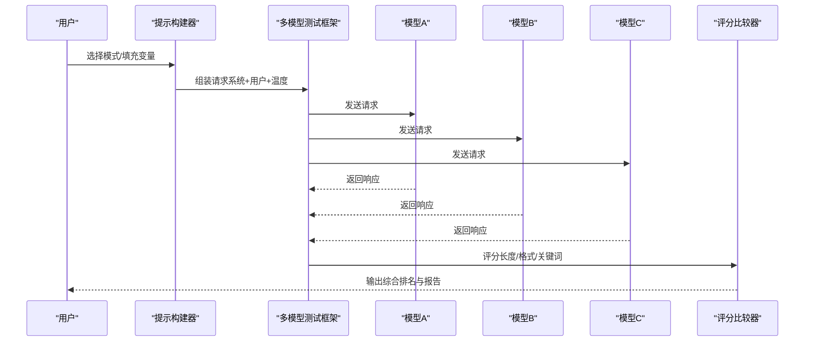
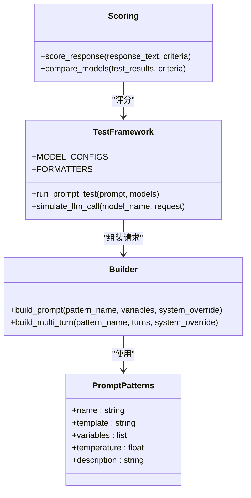
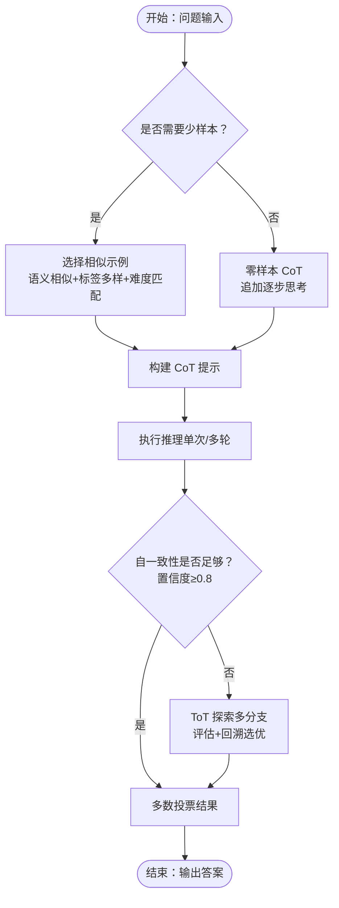
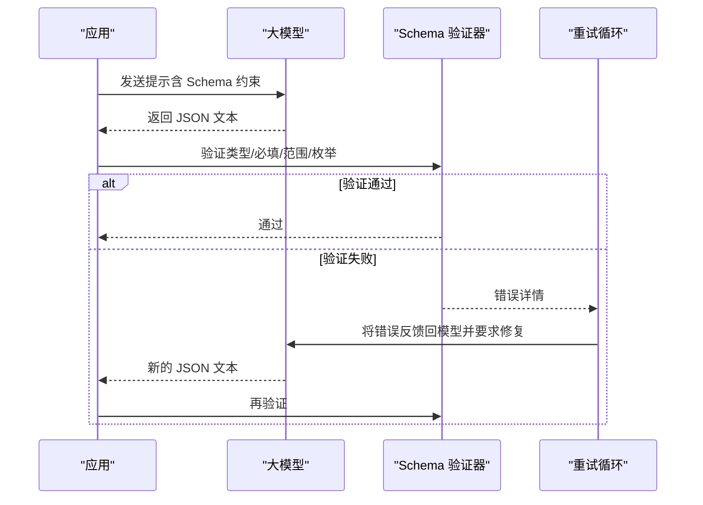
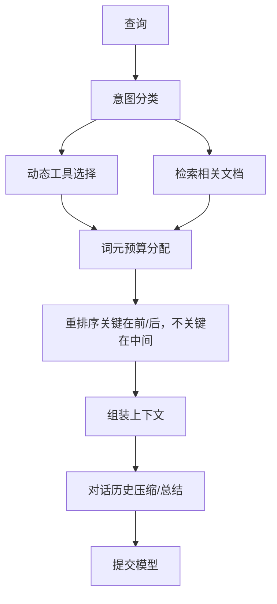
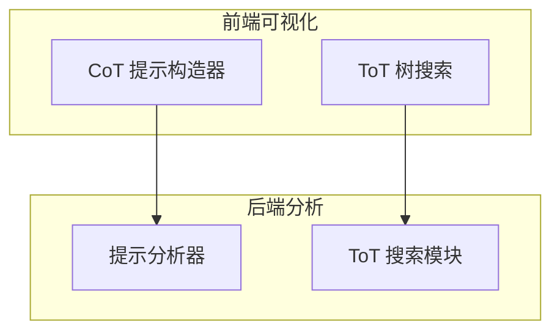
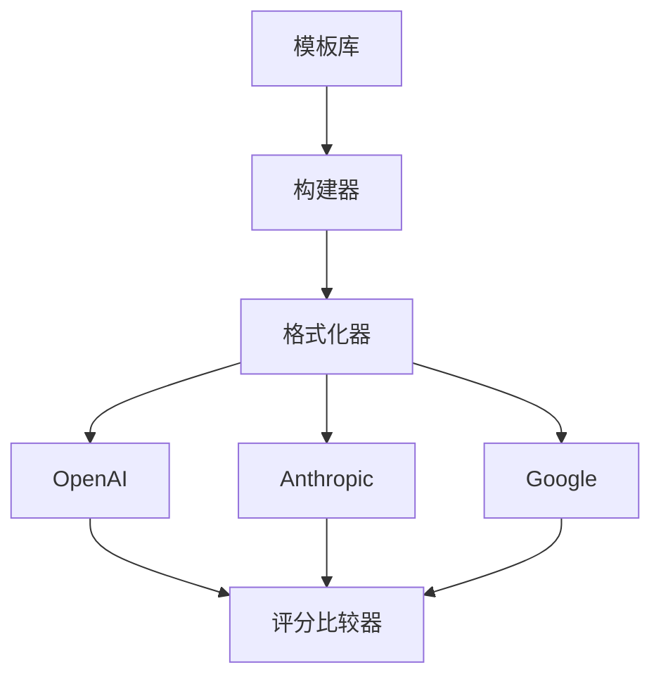

# 基础提示设计

<cite>
**本文档引用的文件**
- [phases/11-llm-engineering/01-prompt-engineering/docs/zh.md](file://phases/11-llm-engineering/01-prompt-engineering/docs/zh.md)
- [phases/11-llm-engineering/02-few-shot-cot/docs/zh.md](file://phases/11-llm-engineering/02-few-shot-cot/docs/zh.md)
- [phases/11-llm-engineering/03-structured-outputs/docs/zh.md](file://phases/11-llm-engineering/03-structured-outputs/docs/zh.md)
- [phases/11-llm-engineering/05-context-engineering/docs/zh.md](file://phases/11-llm-engineering/05-context-engineering/docs/zh.md)
- [site/vue-app/summary/src/data/modules/cot-prompt-builder.js](file://site/vue-app/summary/src/data/modules/cot-prompt-builder.js)
- [site/vue-app/summary/src/data/modules/tot-search.js](file://site/vue-app/summary/src/data/modules/tot-search.js)
- [guardrails-sandbox/backend/playground/modules/prompt_analyzer.py](file://guardrails-sandbox/backend/playground/modules/prompt_analyzer.py)
- [guardrails-sandbox/backend/playground/modules/tot_search.py](file://guardrails-sandbox/backend/playground/modules/tot_search.py)
</cite>

## 目录
1. [简介](#简介)
2. [项目结构](#项目结构)
3. [核心组件](#核心组件)
4. [架构概览](#架构概览)
5. [详细组件分析](#详细组件分析)
6. [依赖关系分析](#依赖关系分析)
7. [性能考量](#性能考量)
8. [故障排查指南](#故障排查指南)
9. [结论](#结论)
10. [附录](#附录)

## 简介
本指南围绕“基础提示设计”展开，系统阐述提示工程的核心理念与实践方法，包括提示模板设计原则、上下文构建策略、指令明确化技巧等。文档以阶段 11 的四门课程为知识基础，结合前端可视化模块与后端分析工具，提供从概念到代码实现的完整路径。读者将学会如何编写高质量提示语句（清晰指令、适当上下文、合理格式约束），掌握提示优化方法、常见陷阱与调试技巧，并通过问答、文本生成、代码编写等典型任务案例，理解提示设计在实际场景中的应用效果。

## 项目结构
本项目将“提示工程”拆分为四大核心模块：
- 基础提示工程：提示词构成、角色提示、指令清晰度、输出格式控制、约束指定、温度与采样
- 少样本与思维链：零样本/少样本对比、示例选择、思维链 CoT、自一致性 Self-Consistency、思维树 ToT、ReAct
- 结构化输出：JSON 模式、Schema 验证、约束解码、函数调用/工具使用
- 上下文工程：词元预算、中间丢失效应、动态上下文组装、历史压缩、工具修剪

**章节来源**
- [phases/11-llm-engineering/01-prompt-engineering/docs/zh.md:11-39](file://phases/11-llm-engineering/01-prompt-engineering/docs/zh.md#L11-L39)
- [phases/11-llm-engineering/02-few-shot-cot/docs/zh.md:1-26](file://phases/11-llm-engineering/02-few-shot-cot/docs/zh.md#L1-L26)
- [phases/11-llm-engineering/03-structured-outputs/docs/zh.md:1-31](file://phases/11-llm-engineering/03-structured-outputs/docs/zh.md#L1-L31)
- [phases/11-llm-engineering/05-context-engineering/docs/zh.md:1-27](file://phases/11-llm-engineering/05-context-engineering/docs/zh.md#L1-L27)

## 核心组件
本节聚焦基础提示设计的五大支柱：提示词构成、角色提示、指令清晰度、输出格式控制、约束指定与温度采样。

- 提示词构成
  - 系统消息：设定身份、规则、约束，跨轮次持久存在
  - 用户消息：实际任务或问题，每轮变化
  - 助手预填充：部分回复以引导格式（如 JSON 前缀）

- 角色提示
  - 具体角色激活更窄、更高质量的分布；角色越具体，质量越高，但需避免过具体导致幻觉

- 指令清晰度
  - 明确格式、长度、受众、包含/排除内容、提供期望示例
  - 模糊指令带来模型猜测分支，降低命中概率

- 输出格式控制
  - JSON/XML/Markdown/编号列表/分隔符模式
  - 在不使用结构化输出 API 时，仍可通过显式指令引导格式

- 约束指定
  - 否定约束（消除输出空间大区域）
  - 肯定约束（每次回复的结构保障）
  - 条件约束（边界情况处理）

- 温度与采样
  - 温度控制随机性；Top-p 限制采样范围
  - 不同任务场景的推荐设置：确定性（提取/分类/代码）、保守（总结/分析/技术写作）、平衡（问答/解释）、创造（头脑风暴/创意写作）、混乱（避免在生产使用）

**章节来源**
- [phases/11-llm-engineering/01-prompt-engineering/docs/zh.md:40-187](file://phases/11-llm-engineering/01-prompt-engineering/docs/zh.md#L40-L187)

## 架构概览
下图展示了从“提示设计”到“输出评估”的端到端流程：模板库 → 构建器 → 多模型测试 → 评分比较 → 测试套件运行器。

**图示来源**
- [phases/11-llm-engineering/01-prompt-engineering/docs/zh.md:497-696](file://phases/11-llm-engineering/01-prompt-engineering/docs/zh.md#L497-L696)

**章节来源**
- [phases/11-llm-engineering/01-prompt-engineering/docs/zh.md:497-696](file://phases/11-llm-engineering/01-prompt-engineering/docs/zh.md#L497-L696)

## 详细组件分析

### 组件A：提示模板库与构建器
- 模板模式
  - 角色模式、模板模式、元提示模式、思维链模式、少样本模式、护栏模式、分解模式、批判模式、受众适应模式、边界模式
  - 每个模式包含名称、模板、变量、推荐温度与描述

- 构建器
  - 通过填充变量并组装完整消息结构（系统+用户+可选预填充）
  - 支持多轮对话消息序列

- 多模型测试框架
  - 统一封装 OpenAI、Anthropic、Google 的请求格式
  - 模拟 LLM 调用，返回响应、token 使用、延迟与完成原因
  - 便于跨模型对比与稳定性评估

**图示来源**
- [phases/11-llm-engineering/01-prompt-engineering/docs/zh.md:303-496](file://phases/11-llm-engineering/01-prompt-engineering/docs/zh.md#L303-L496)
- [phases/11-llm-engineering/01-prompt-engineering/docs/zh.md:497-696](file://phases/11-llm-engineering/01-prompt-engineering/docs/zh.md#L497-L696)

**章节来源**
- [phases/11-llm-engineering/01-prompt-engineering/docs/zh.md:303-496](file://phases/11-llm-engineering/01-prompt-engineering/docs/zh.md#L303-L496)
- [phases/11-llm-engineering/01-prompt-engineering/docs/zh.md:497-696](file://phases/11-llm-engineering/01-prompt-engineering/docs/zh.md#L497-L696)

### 组件B：少样本与思维链（CoT）最佳实践
- 少样本提示
  - 示例选择：语义相似性、标签多样性、难度匹配
  - 示例数量：3-5 个为佳，收益递减

- 思维链（CoT）
  - 零样本 CoT：追加“让我们逐步思考”
  - 少样本 CoT：提供包含推理步骤的示例
  - 在多步推理任务上显著提升准确率

- 自一致性（Self-Consistency）
  - 温度 > 0 采样 N 个推理路径，多数投票
  - N=3 为最低有效值，N=5 捕捉大部分收益

- 思维树（ToT）
  - 生成多个候选思路 → 评估 → 搜索（BFS/DFS）→ 修剪低分分支
  - 适用于搜索空间大但可评估的问题（如 24 点游戏）

**图示来源**
- [phases/11-llm-engineering/02-few-shot-cot/docs/zh.md:27-195](file://phases/11-llm-engineering/02-few-shot-cot/docs/zh.md#L27-L195)

**章节来源**
- [phases/11-llm-engineering/02-few-shot-cot/docs/zh.md:27-195](file://phases/11-llm-engineering/02-few-shot-cot/docs/zh.md#L27-L195)

### 组件C：结构化输出与约束解码
- 结构化输出谱系
  - 基于提示（~90% 有效）
  - JSON 模式（保证有效 JSON，无 Schema 保证）
  - Schema 模式（匹配指定 Schema）
  - 约束解码（词元级强制，100% 合规）

- JSON Schema 与 Pydantic
  - 定义对象、数组、枚举、最小/最大值等约束
  - Pydantic 自动生成 Schema，Instructor 自动重试

- 函数调用/工具使用
  - 模型输出结构化参数，OpenAI 称为“函数调用”，Anthropic 称为“工具使用”

**图示来源**
- [phases/11-llm-engineering/03-structured-outputs/docs/zh.md:32-136](file://phases/11-llm-engineering/03-structured-outputs/docs/zh.md#L32-L136)

**章节来源**
- [phases/11-llm-engineering/03-structured-outputs/docs/zh.md:32-136](file://phases/11-llm-engineering/03-structured-outputs/docs/zh.md#L32-L136)

### 组件D：上下文工程与词元预算
- 上下文窗口是稀缺资源
  - 组件竞争：系统提示词、工具定义、检索上下文、对话历史、少样本示例、生成预算
  - 中间丢失效应：模型对上下文开头/结尾注意力更高，中间信息更易被忽略

- 上下文压缩策略
  - 历史总结、相关性过滤、工具修剪、递归总结

- 动态上下文组装
  - 查询意图分类 → 相关工具选择 → 检索相关文档 → 包含相关历史 → 匹配任务的少样本示例 → 按重要性排列

**图示来源**
- [phases/11-llm-engineering/05-context-engineering/docs/zh.md:30-159](file://phases/11-llm-engineering/05-context-engineering/docs/zh.md#L30-L159)

**章节来源**
- [phases/11-llm-engineering/05-context-engineering/docs/zh.md:30-159](file://phases/11-llm-engineering/05-context-engineering/docs/zh.md#L30-L159)

### 组件E：前端可视化与后端分析工具
- 前端模块
  - CoT 提示构造器：对比 Zero-shot / Zero-shot-CoT / Few-shot-CoT 三种提示词拼法
  - Tree of Thoughts 树搜索：对比 CoT 与 ToT 的搜索策略与评估

- 后端模块
  - 提示分析器：检查提示完整性（维度命中率、缺失要素、建议补充）
  - ToT 搜索模块：展示扩展+评估+回溯/剪枝的搜索过程

**图示来源**
- [site/vue-app/summary/src/data/modules/cot-prompt-builder.js:36-66](file://site/vue-app/summary/src/data/modules/cot-prompt-builder.js#L36-L66)
- [site/vue-app/summary/src/data/modules/tot-search.js:99-131](file://site/vue-app/summary/src/data/modules/tot-search.js#L99-L131)
- [guardrails-sandbox/backend/playground/modules/prompt_analyzer.py:65-92](file://guardrails-sandbox/backend/playground/modules/prompt_analyzer.py#L65-L92)
- [guardrails-sandbox/backend/playground/modules/tot_search.py:106-119](file://guardrails-sandbox/backend/playground/modules/tot_search.py#L106-L119)

**章节来源**
- [site/vue-app/summary/src/data/modules/cot-prompt-builder.js:36-66](file://site/vue-app/summary/src/data/modules/cot-prompt-builder.js#L36-L66)
- [site/vue-app/summary/src/data/modules/tot-search.js:99-131](file://site/vue-app/summary/src/data/modules/tot-search.js#L99-L131)
- [guardrails-sandbox/backend/playground/modules/prompt_analyzer.py:65-92](file://guardrails-sandbox/backend/playground/modules/prompt_analyzer.py#L65-L92)
- [guardrails-sandbox/backend/playground/modules/tot_search.py:106-119](file://guardrails-sandbox/backend/playground/modules/tot_search.py#L106-L119)

## 依赖关系分析
- 模块耦合
  - 模板库与构建器强耦合：构建器依赖模板变量与描述
  - 测试框架与构建器弱耦合：通过统一请求格式对接多模型
  - 评分比较器与测试框架弱耦合：接收标准化结果进行评分

- 外部依赖
  - OpenAI、Anthropic、Google 的 API 差异通过格式化器抽象
  - 前端模块与后端分析模块通过数据结构对接

**图示来源**
- [phases/11-llm-engineering/01-prompt-engineering/docs/zh.md:529-571](file://phases/11-llm-engineering/01-prompt-engineering/docs/zh.md#L529-L571)

**章节来源**
- [phases/11-llm-engineering/01-prompt-engineering/docs/zh.md:529-571](file://phases/11-llm-engineering/01-prompt-engineering/docs/zh.md#L529-L571)

## 性能考量
- 温度与采样
  - 确定性任务（提取/分类/代码）使用低温度；创造性任务（头脑风暴/创意写作）使用高温度
  - Top-p 限制采样范围，避免过度随机

- 上下文窗口
  - 将系统提示词、关键指令置于开头；当前查询与最相关上下文置于末尾
  - 中间丢失效应：将重要信息重复在末尾，或通过重排序提升注意力

- 结构化输出
  - 优先使用 JSON 模式/Schem 模式/约束解码，减少后处理与重试成本
  - 函数调用/工具使用在模型需选择合适 Schema 时更高效

- 思维链与思维树
  - CoT 适用于多步推理；ToT 适用于搜索/规划问题，但成本较高
  - 自一致性在基础准确率 60-85% 的模型上收益显著，N=3-5 已具性价比

**章节来源**
- [phases/11-llm-engineering/01-prompt-engineering/docs/zh.md:140-187](file://phases/11-llm-engineering/01-prompt-engineering/docs/zh.md#L140-L187)
- [phases/11-llm-engineering/05-context-engineering/docs/zh.md:59-103](file://phases/11-llm-engineering/05-context-engineering/docs/zh.md#L59-L103)
- [phases/11-llm-engineering/03-structured-outputs/docs/zh.md:32-60](file://phases/11-llm-engineering/03-structured-outputs/docs/zh.md#L32-L60)
- [phases/11-llm-engineering/02-few-shot-cot/docs/zh.md:102-142](file://phases/11-llm-engineering/02-few-shot-cot/docs/zh.md#L102-L142)

## 故障排查指南
- 常见陷阱
  - 提示注入：用户覆盖系统提示词；缓解措施：输入验证、分隔符、输出过滤
  - 过度约束：规则过多导致模型将能力用于遵循指令而非完成任务
  - 矛盾指令：同时要求简洁与全面；模型会任意选择其一
  - 假设模型特定行为：在某模型有效不代表在其他模型同样有效

- 调试技巧
  - 从温度=0 开始测试，分离提示质量与采样随机性
  - 使用少样本示例锚定格式与风格
  - 通过前后对比（模糊 vs 具体）定位问题
  - 使用前端可视化模块对比不同提示词的效果

- 提示完整性检查
  - 维度命中率与缺失要素清单，辅助识别可补充的要素

**章节来源**
- [phases/11-llm-engineering/01-prompt-engineering/docs/zh.md:280-300](file://phases/11-llm-engineering/01-prompt-engineering/docs/zh.md#L280-L300)
- [guardrails-sandbox/backend/playground/modules/prompt_analyzer.py:65-92](file://guardrails-sandbox/backend/playground/modules/prompt_analyzer.py#L65-L92)

## 结论
基础提示设计是将人类意图转化为机器可执行指令的关键。通过模板化设计、上下文工程与结构化输出，配合多模型测试与评分比较，能够系统性提升提示质量与任务表现。在实际应用中，应坚持“具体优于模糊”的指令设计原则，合理分配上下文预算，利用 CoT/ToT 等推理策略提升复杂任务的准确率，并通过约束解码与 Schema 验证确保输出的类型合规与业务可用。

## 附录
- 实战建议
  - 问答任务：使用少样本 CoT + 自一致性；对高风险推理任务启用 ToT
  - 文本生成：明确格式（编号列表/分隔符）与长度限制；必要时使用 JSON 模式
  - 代码编写：结合上下文工程与工具使用；对关键信息重复在上下文末尾
  - 结构化提取：优先 Schema 模式/约束解码；失败时使用 Instructor 自动重试

- 参考资料
  - 基础提示工程：角色、指令、格式、约束、采样
  - 少样本与思维链：示例选择、CoT、自一致性、ToT、ReAct
  - 结构化输出：JSON 模式、Schema、约束解码、函数调用/工具使用
  - 上下文工程：词元预算、中间丢失、动态组装、历史压缩、工具修剪