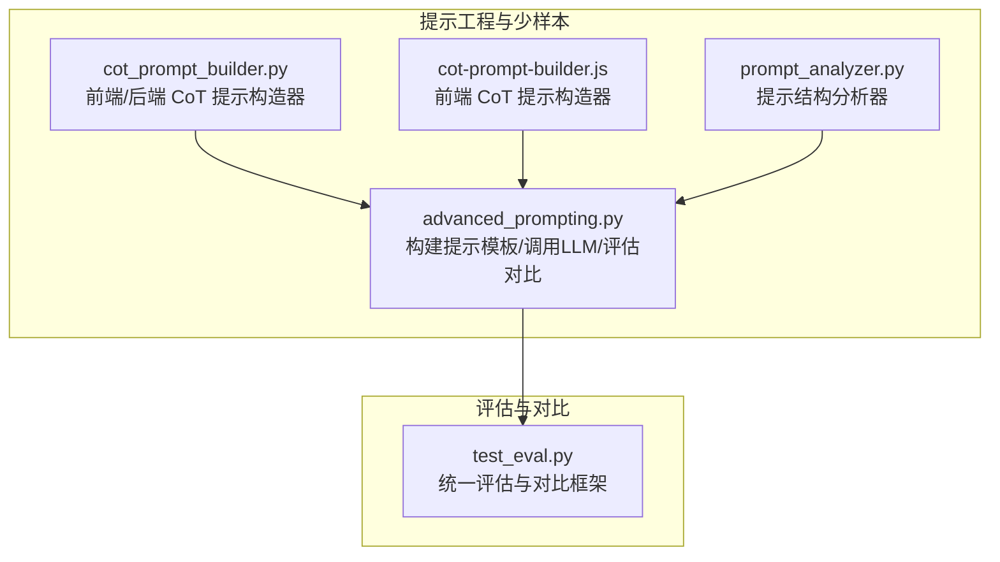
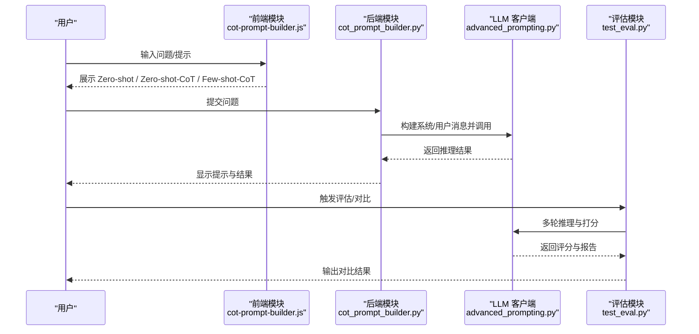
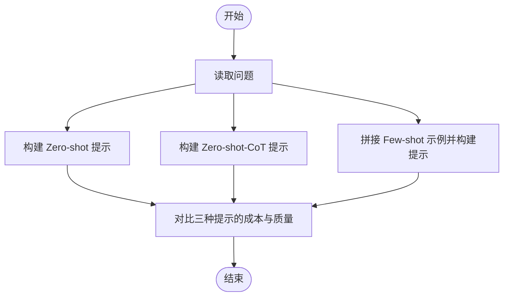
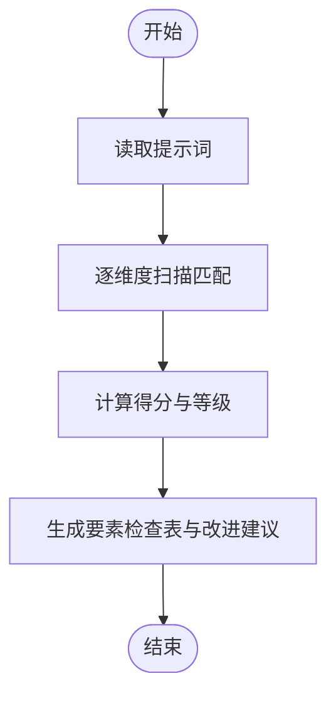
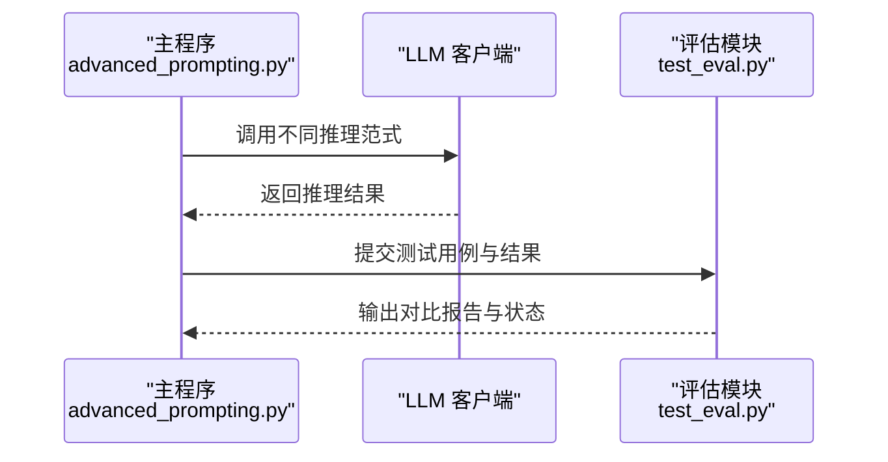
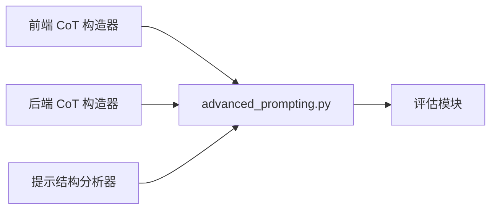

# 少样本学习

<cite>
**本文引用的文件**   
- [advanced_prompting.py](file://phases/11-llm-engineering/02-few-shot-cot/code/advanced_prompting.py)
- [cot_prompt_builder.py](file://guardrails-sandbox/backend/playground/modules/cot_prompt_builder.py)
- [cot-prompt-builder.js](file://site/vue-app/summary/src/data/modules/cot-prompt-builder.js)
- [prompt_analyzer.py](file://guardrails-sandbox/backend/playground/modules/prompt_analyzer.py)
- [test_eval.py](file://test_eval.py)
</cite>

## 目录
1. [引言](#引言)
2. [项目结构](#项目结构)
3. [核心组件](#核心组件)
4. [架构总览](#架构总览)
5. [详细组件分析](#详细组件分析)
6. [依赖关系分析](#依赖关系分析)
7. [性能考量](#性能考量)
8. [故障排查指南](#故障排查指南)
9. [结论](#结论)
10. [附录](#附录)

## 引言
本文件围绕少样本学习（few-shot learning）在提示工程与推理任务中的实践展开，系统阐述示例选择策略、示例组织方式、提示模板设计、正向与反向示例的使用技巧，并结合仓库中的 CoT（思维链）提示构造器与提示结构分析器，给出可复用的实现路径与评估方法。文档同时覆盖示例质量评估、数量优化、排序策略等高级技巧，并通过分类、生成、推理等典型任务场景说明少样本学习的应用效果与性能表现。

## 项目结构
本项目在“LLM 工程”阶段提供了少样本与思维链的实战代码与可视化工具，主要涉及以下模块：
- 提示构造与对比：提供 Zero-shot、Zero-shot-CoT、Few-shot-CoT 的提示模板拼接与对比，便于理解不同复杂度下的 token 成本与推理质量权衡。
- 提示结构分析：对用户输入的提示词进行结构化要素扫描，给出评分与改进建议，辅助提升提示质量。
- 推理流程与评估：提供多种推理范式（如 Self-Consistency、Tree-of-Thought、ReAct 等）与统一的评估框架，支撑少样本学习在复杂任务上的落地。

图示来源
- [advanced_prompting.py:123-188](file://phases/11-llm-engineering/02-few-shot-cot/code/advanced_prompting.py#L123-L188)
- [cot_prompt_builder.py:30-80](file://guardrails-sandbox/backend/playground/modules/cot_prompt_builder.py#L30-L80)
- [cot-prompt-builder.js:18-52](file://site/vue-app/summary/src/data/modules/cot-prompt-builder.js#L18-L52)
- [prompt_analyzer.py:34-93](file://guardrails-sandbox/backend/playground/modules/prompt_analyzer.py#L34-L93)
- [test_eval.py:175-248](file://test_eval.py#L175-L248)

章节来源
- [advanced_prompting.py:1-548](file://phases/11-llm-engineering/02-few-shot-cot/code/advanced_prompting.py#L1-L548)
- [cot_prompt_builder.py:1-80](file://guardrails-sandbox/backend/playground/modules/cot_prompt_builder.py#L1-L80)
- [cot-prompt-builder.js:1-66](file://site/vue-app/summary/src/data/modules/cot-prompt-builder.js#L1-L66)
- [prompt_analyzer.py:1-93](file://guardrails-sandbox/backend/playground/modules/prompt_analyzer.py#L1-L93)
- [test_eval.py:175-248](file://test_eval.py#L175-L248)

## 核心组件
- 提示模板构建器（CoT）
  - 提供 Zero-shot、Zero-shot-CoT、Few-shot-CoT 三类模板的本地拼接与对比，便于直观理解 token 成本与推理质量的关系。
  - 后端与前端版本保持一致的示例与逻辑，便于教学演示与交互体验。
- 提示结构分析器
  - 自动扫描提示词是否包含角色设定、明确任务、输出格式、约束条件、示例、上下文等关键要素，给出评分与改进建议。
- 统一评估与对比框架
  - 提供统一的评测入口与对比报告，支持多维度（如相关性、正确性、有用性、安全性）的量化评估与回归检测。

章节来源
- [advanced_prompting.py:123-188](file://phases/11-llm-engineering/02-few-shot-cot/code/advanced_prompting.py#L123-L188)
- [cot_prompt_builder.py:30-80](file://guardrails-sandbox/backend/playground/modules/cot_prompt_builder.py#L30-L80)
- [cot-prompt-builder.js:18-52](file://site/vue-app/summary/src/data/modules/cot-prompt-builder.js#L18-L52)
- [prompt_analyzer.py:34-93](file://guardrails-sandbox/backend/playground/modules/prompt_analyzer.py#L34-L93)
- [test_eval.py:175-248](file://test_eval.py#L175-L248)

## 架构总览
下图展示了从“提示构造/分析”到“推理执行/评估对比”的端到端流程，体现少样本学习在提示工程中的关键环节与数据流。

图示来源
- [cot-prompt-builder.js:18-52](file://site/vue-app/summary/src/data/modules/cot-prompt-builder.js#L18-L52)
- [cot_prompt_builder.py:43-80](file://guardrails-sandbox/backend/playground/modules/cot_prompt_builder.py#L43-L80)
- [advanced_prompting.py:160-188](file://phases/11-llm-engineering/02-few-shot-cot/code/advanced_prompting.py#L160-L188)
- [test_eval.py:175-248](file://test_eval.py#L175-L248)

## 详细组件分析

### 组件A：提示模板构建器（CoT）
- 功能概述
  - 本地拼接 Zero-shot、Zero-shot-CoT、Few-shot-CoT 三类提示，用于教学与演示，无需调用 LLM。
  - 前后端版本保持一致的示例与逻辑，便于在浏览器端快速验证提示效果。
- 关键实现要点
  - 示例组织：以“问题-推理-答案”的结构组织示例，确保推理过程与最终答案对齐。
  - 模板设计：通过系统提示与用户提示的组合，约束模型输出风格与格式。
  - 数量与排序：支持指定示例数量与顺序，便于探索示例数量与排序策略对效果的影响。
- 使用建议
  - 正向示例：优先选择与目标任务相似、推理路径清晰的示例。
  - 反向示例：可选加入“错误示范 + 正确修正”，帮助模型识别边界情况。
  - 排序策略：按难度递增或按主题聚类排序，有助于模型逐步建立知识迁移。

图示来源
- [cot-prompt-builder.js:18-52](file://site/vue-app/summary/src/data/modules/cot-prompt-builder.js#L18-L52)
- [cot_prompt_builder.py:43-80](file://guardrails-sandbox/backend/playground/modules/cot_prompt_builder.py#L43-L80)

章节来源
- [cot-prompt-builder.js:1-66](file://site/vue-app/summary/src/data/modules/cot-prompt-builder.js#L1-L66)
- [cot_prompt_builder.py:1-80](file://guardrails-sandbox/backend/playground/modules/cot_prompt_builder.py#L1-L80)

### 组件B：提示结构分析器
- 功能概述
  - 对用户输入的提示词进行结构化扫描，识别是否具备“角色设定、明确任务、输出格式、约束条件、示例、上下文”等关键要素。
  - 输出评分与改进建议，辅助提升提示质量与稳定性。
- 关键实现要点
  - 匹配规则：基于关键词与正则表达式进行模式匹配，统计命中维度并计算得分。
  - 评分体系：按维度权重归一化，给出“高质量/基本可用/过于简单”的判定与建议。
- 使用建议
  - 在少样本场景中，优先补齐“示例”维度，以增强模型对任务的理解与泛化能力。
  - 明确“输出格式”与“约束条件”，减少模型自由发挥带来的不确定性。

图示来源
- [prompt_analyzer.py:47-93](file://guardrails-sandbox/backend/playground/modules/prompt_analyzer.py#L47-L93)

章节来源
- [prompt_analyzer.py:1-93](file://guardrails-sandbox/backend/playground/modules/prompt_analyzer.py#L1-L93)

### 组件C：推理流程与评估框架
- 功能概述
  - 提供多种推理范式（Zero-shot、Zero-shot-CoT、Few-shot-CoT、Self-Consistency、Tree-of-Thought、ReAct 等），并在统一评估框架下进行对比。
  - 支持多维度评分与回归检测，保障模型改进的稳定性。
- 关键实现要点
  - 推理范式：通过系统提示与用户提示的组合，约束模型输出风格与格式；部分范式引入温度采样与投票机制以提升鲁棒性。
  - 评估框架：提供统一的评测入口与对比报告，支持多维度（如相关性、正确性、有用性、安全性）的量化评估与回归检测。
- 使用建议
  - 在少样本场景中，优先采用 Few-shot-CoT 以稳定输出风格；若对准确率要求极高，可引入 Self-Consistency 或 Tree-of-Thought。
  - 通过评估框架持续监控改进效果，避免回归。

图示来源
- [advanced_prompting.py:160-211](file://phases/11-llm-engineering/02-few-shot-cot/code/advanced_prompting.py#L160-L211)
- [test_eval.py:175-248](file://test_eval.py#L175-L248)

章节来源
- [advanced_prompting.py:160-211](file://phases/11-llm-engineering/02-few-shot-cot/code/advanced_prompting.py#L160-L211)
- [test_eval.py:175-248](file://test_eval.py#L175-L248)

## 依赖关系分析
- 组件耦合
  - 前后端 CoT 提示构造器共享相同的示例与模板逻辑，降低维护成本。
  - 提示结构分析器独立于推理流程，可作为提示质量前置校验工具。
  - 评估框架与推理流程解耦，支持对不同范式的统一对比。
- 外部依赖
  - LLM 客户端调用 OpenAI Chat Completions API，需配置密钥与模型参数。
  - 评估模块依赖统一的评测接口与对比逻辑，确保结果一致性。

图示来源
- [cot-prompt-builder.js:18-52](file://site/vue-app/summary/src/data/modules/cot-prompt-builder.js#L18-L52)
- [cot_prompt_builder.py:43-80](file://guardrails-sandbox/backend/playground/modules/cot_prompt_builder.py#L43-L80)
- [prompt_analyzer.py:34-93](file://guardrails-sandbox/backend/playground/modules/prompt_analyzer.py#L34-L93)
- [advanced_prompting.py:160-188](file://phases/11-llm-engineering/02-few-shot-cot/code/advanced_prompting.py#L160-L188)
- [test_eval.py:175-248](file://test_eval.py#L175-L248)

章节来源
- [cot-prompt-builder.js:1-66](file://site/vue-app/summary/src/data/modules/cot-prompt-builder.js#L1-L66)
- [cot_prompt_builder.py:1-80](file://guardrails-sandbox/backend/playground/modules/cot_prompt_builder.py#L1-L80)
- [prompt_analyzer.py:1-93](file://guardrails-sandbox/backend/playground/modules/prompt_analyzer.py#L1-L93)
- [advanced_prompting.py:160-188](file://phases/11-llm-engineering/02-few-shot-cot/code/advanced_prompting.py#L160-L188)
- [test_eval.py:175-248](file://test_eval.py#L175-L248)

## 性能考量
- Token 成本与推理质量
  - Zero-shot 提示成本最低，适合明确、单步任务；Few-shot-CoT 成本最高但质量最稳定，适合复杂推理与固定输出风格。
  - Zero-shot-CoT 在几乎零成本的情况下即可显著提升推理质量，适合作为中间方案。
- 温度采样与多样性
  - Self-Consistency 通过多次采样与投票提升准确率，但会显著增加 token 与延迟成本。
- 评估与回归检测
  - 通过统一评估框架对多维度指标进行量化评估，及时发现回归并拦截发布。

## 故障排查指南
- 提示质量不足
  - 使用提示结构分析器扫描提示词，补齐缺失的关键要素（角色设定、明确任务、输出格式、约束条件、示例、上下文）。
- 推理不稳定或结果偏差
  - 在少样本场景中优先采用 Few-shot-CoT；若对准确率要求极高，引入 Self-Consistency 或 Tree-of-Thought。
  - 通过评估框架对比不同范式的效果，定位问题根因。
- 评估与对比异常
  - 检查测试用例与参考输出的一致性，确保评测入口与对比逻辑正常运行。

章节来源
- [prompt_analyzer.py:47-93](file://guardrails-sandbox/backend/playground/modules/prompt_analyzer.py#L47-L93)
- [advanced_prompting.py:191-211](file://phases/11-llm-engineering/02-few-shot-cot/code/advanced_prompting.py#L191-L211)
- [test_eval.py:175-248](file://test_eval.py#L175-L248)

## 结论
本项目通过“提示构造器 + 提示分析器 + 推理流程 + 评估框架”的闭环，系统化地展示了少样本学习在提示工程中的关键实践：示例选择与组织、提示模板设计、正向与反向示例的使用、示例数量与排序策略，以及统一的评估与回归检测机制。在分类、生成、推理等任务中，合理运用 Few-shot-CoT 与 Self-Consistency 等范式，可在保证质量的同时平衡 token 成本与延迟，实现稳定高效的少样本学习落地。

## 附录
- 示例质量评估清单
  - 是否包含角色设定与任务描述
  - 是否明确输出格式与约束条件
  - 是否提供正向与反向示例
  - 是否具备足够的上下文信息
- 示例数量优化建议
  - 从 1–3 个示例起步，逐步增加至 5–7 个，观察准确率与 token 成本的拐点。
- 排序策略建议
  - 按难度递增排序，先易后难；或按主题聚类排序，帮助模型建立知识迁移。