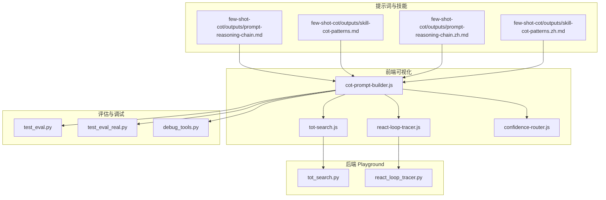
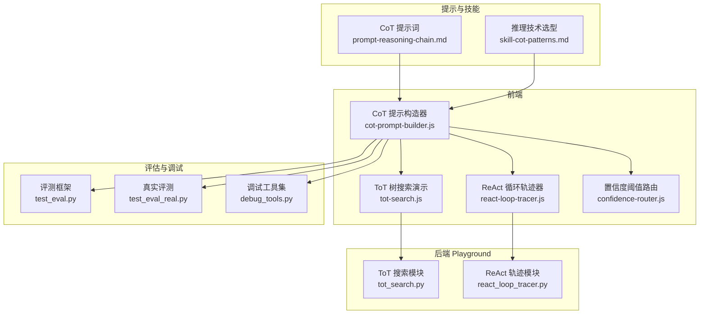
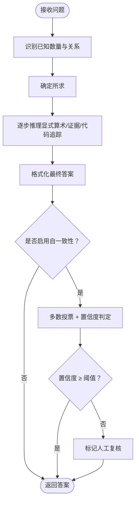
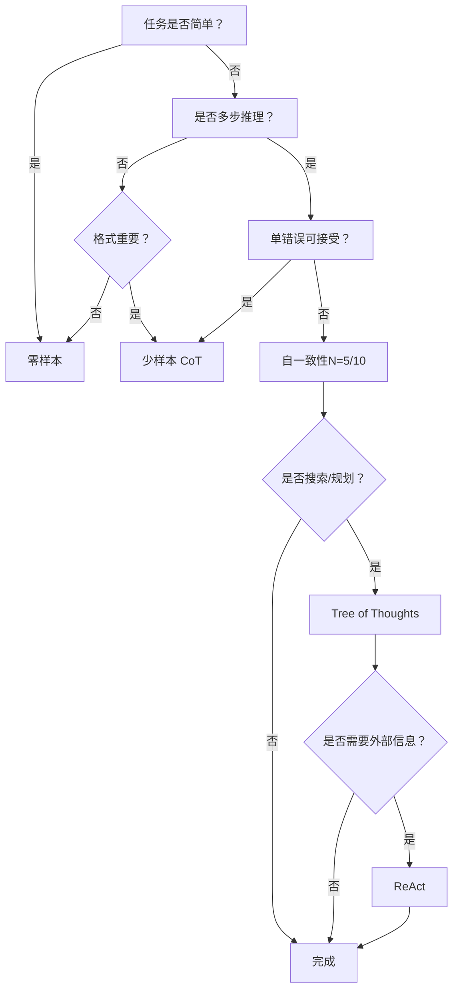
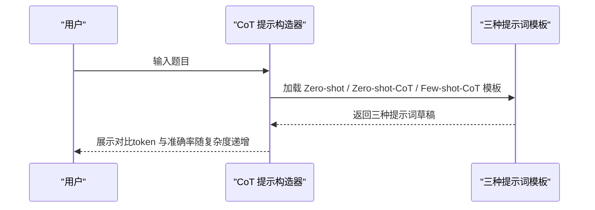
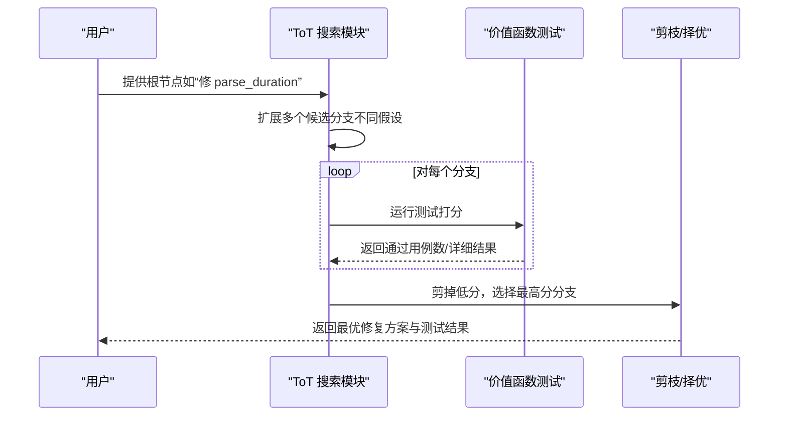
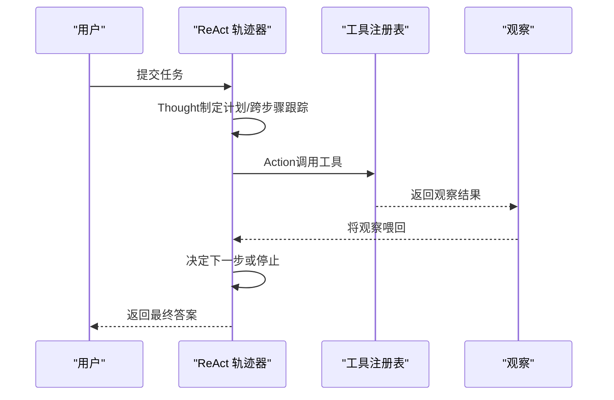
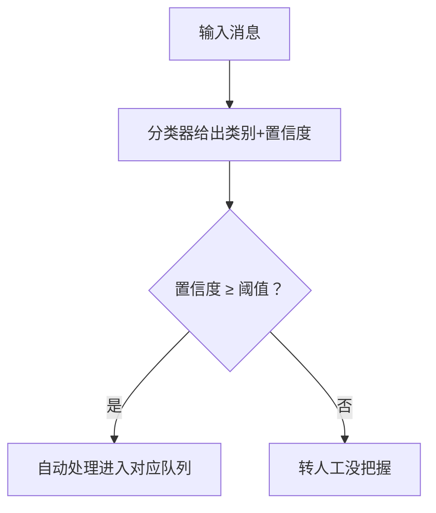
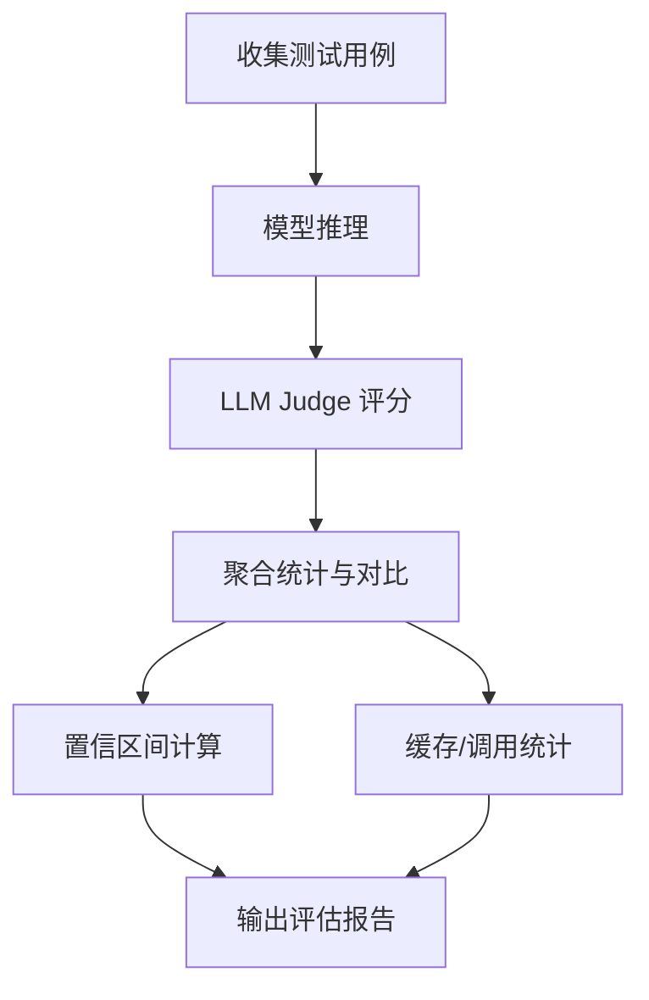
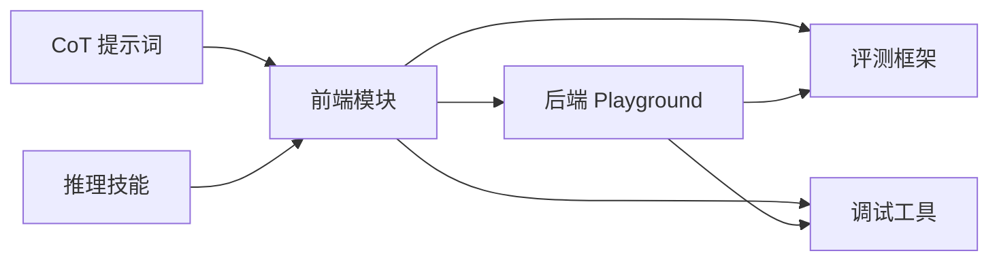

# 思维链推理

<cite>
**本文引用的文件**
- [prompt-reasoning-chain.md](file://phases/11-llm-engineering/02-few-shot-cot/outputs/prompt-reasoning-chain.md)
- [prompt-reasoning-chain.zh.md](file://phases/11-llm-engineering/02-few-shot-cot/outputs/prompt-reasoning-chain.zh.md)
- [skill-cot-patterns.md](file://phases/11-llm-engineering/02-few-shot-cot/outputs/skill-cot-patterns.md)
- [skill-cot-patterns.zh.md](file://phases/11-llm-engineering/02-few-shot-cot/outputs/skill-cot-patterns.zh.md)
- [cot-prompt-builder.js](file://site/vue-app/summary/src/data/modules/cot-prompt-builder.js)
- [content.js](file://site/vue-app/summary/src/data/content.js)
- [tot-search.js](file://site/vue-app/summary/src/data/modules/tot-search.js)
- [tot_search.py](file://guardrails-sandbox/backend/playground/modules/tot_search.py)
- [react-loop-tracer.js](file://site/vue-app/summary/src/data/modules/react-loop-tracer.js)
- [react_loop_tracer.py](file://guardrails-sandbox/backend/playground/modules/react_loop_tracer.py)
- [confidence-router.js](file://site/vue-app/summary/src/data/modules/confidence-router.js)
- [test_eval.py](file://test_eval.py)
- [test_eval_real.py](file://test_eval_real.py)
- [debug_tools.py](file://phases/00-setup-and-tooling/12-debugging-and-profiling/code/debug_tools.py)
</cite>

## 目录
1. [引言](#引言)
2. [项目结构](#项目结构)
3. [核心组件](#核心组件)
4. [架构总览](#架构总览)
5. [详细组件分析](#详细组件分析)
6. [依赖分析](#依赖分析)
7. [性能考量](#性能考量)
8. [故障排查指南](#故障排查指南)
9. [结论](#结论)
10. [附录](#附录)

## 引言
本文件围绕“思维链推理（Chain-of-Thought, CoT）”在本仓库中的设计与实践进行系统化整理，覆盖提示词工程、推理技术选型、多步计算与逻辑推理、自一致性（Self-Consistency）与树搜索（Tree of Thoughts, ToT）、ReAct 循环、置信度路由与评估体系、以及性能优化与调试方法。文档旨在帮助读者从原理到实现、从提示设计到工程落地，全面掌握 CoT 在复杂推理任务中的应用。

## 项目结构
本仓库将 CoT 相关内容组织在“LLM 工程”阶段的“少样本与思维链”课程中，并配套前端可视化模块、后端 Playground 演示、以及评估与调试工具，形成“提示词 → 技术选型 → 演示验证 → 评估与优化”的完整闭环。

图示来源
- [prompt-reasoning-chain.md:1-100](file://phases/11-llm-engineering/02-few-shot-cot/outputs/prompt-reasoning-chain.md#L1-L100)
- [skill-cot-patterns.md:1-121](file://phases/11-llm-engineering/02-few-shot-cot/outputs/skill-cot-patterns.md#L1-L121)
- [cot-prompt-builder.js:36-66](file://site/vue-app/summary/src/data/modules/cot-prompt-builder.js#L36-L66)
- [tot-search.js:99-131](file://site/vue-app/summary/src/data/modules/tot-search.js#L99-L131)
- [tot_search.py:56-119](file://guardrails-sandbox/backend/playground/modules/tot_search.py#L56-L119)
- [react-loop-tracer.js:1-187](file://site/vue-app/summary/src/data/modules/react-loop-tracer.js#L1-L187)
- [react_loop_tracer.py:69-107](file://guardrails-sandbox/backend/playground/modules/react_loop_tracer.py#L69-L107)
- [confidence-router.js:1-80](file://site/vue-app/summary/src/data/modules/confidence-router.js#L1-L80)
- [test_eval.py:175-216](file://test_eval.py#L175-L216)
- [test_eval_real.py:422-446](file://test_eval_real.py#L422-L446)
- [debug_tools.py:277-310](file://phases/00-setup-and-tooling/12-debugging-and-profiling/code/debug_tools.py#L277-L310)

章节来源
- [prompt-reasoning-chain.md:1-100](file://phases/11-llm-engineering/02-few-shot-cot/outputs/prompt-reasoning-chain.md#L1-L100)
- [skill-cot-patterns.md:1-121](file://phases/11-llm-engineering/02-few-shot-cot/outputs/skill-cot-patterns.md#L1-L121)
- [cot-prompt-builder.js:36-66](file://site/vue-app/summary/src/data/modules/cot-prompt-builder.js#L36-L66)

## 核心组件
- 生产级少样本 CoT 提示词：提供结构化思维链模板、示例与自一致性协议，支持多域适配与自动化抽取。
- 推理技术选型技能：基于任务复杂度、准确率要求与成本约束的决策树与技术矩阵，指导技术组合与取舍。
- 前端 CoT 提示词构造器：对比 Zero-shot、Zero-shot-CoT、Few-shot-CoT 三种提示词的拼装方式与效果差异。
- ToT 树搜索演示：将推理转化为可回溯、可评分的搜索树，结合测试作为价值函数进行剪枝与择优。
- ReAct 循环轨迹器：本地演示“思考→行动→观察→停止”的 Agent 循环，便于理解与调试。
- 置信度阈值路由：基于置信度阈值的自动/人工分流策略，体现推理质量与成本的平衡。
- 评估与调试工具：统一的评测框架、置信区间计算、缓存统计与调试工具集，支撑持续优化。

章节来源
- [prompt-reasoning-chain.md:1-100](file://phases/11-llm-engineering/02-few-shot-cot/outputs/prompt-reasoning-chain.md#L1-L100)
- [skill-cot-patterns.md:1-121](file://phases/11-llm-engineering/02-few-shot-cot/outputs/skill-cot-patterns.md#L1-L121)
- [cot-prompt-builder.js:36-66](file://site/vue-app/summary/src/data/modules/cot-prompt-builder.js#L36-L66)
- [tot-search.js:99-131](file://site/vue-app/summary/src/data/modules/tot-search.js#L99-L131)
- [react-loop-tracer.js:1-187](file://site/vue-app/summary/src/data/modules/react-loop-tracer.js#L1-L187)
- [confidence-router.js:1-80](file://site/vue-app/summary/src/data/modules/confidence-router.js#L1-L80)
- [test_eval.py:175-216](file://test_eval.py#L175-L216)
- [test_eval_real.py:422-446](file://test_eval_real.py#L422-L446)
- [debug_tools.py:277-310](file://phases/00-setup-and-tooling/12-debugging-and-profiling/code/debug_tools.py#L277-L310)

## 架构总览
下图展示了从“提示词与技能”到“前端演示与后端 Playground”，再到“评估与调试”的整体架构与数据流。

图示来源
- [prompt-reasoning-chain.md:1-100](file://phases/11-llm-engineering/02-few-shot-cot/outputs/prompt-reasoning-chain.md#L1-L100)
- [skill-cot-patterns.md:1-121](file://phases/11-llm-engineering/02-few-shot-cot/outputs/skill-cot-patterns.md#L1-L121)
- [cot-prompt-builder.js:36-66](file://site/vue-app/summary/src/data/modules/cot-prompt-builder.js#L36-L66)
- [tot-search.js:99-131](file://site/vue-app/summary/src/data/modules/tot-search.js#L99-L131)
- [react-loop-tracer.js:1-187](file://site/vue-app/summary/src/data/modules/react-loop-tracer.js#L1-L187)
- [confidence-router.js:1-80](file://site/vue-app/summary/src/data/modules/confidence-router.js#L1-L80)
- [tot_search.py:56-119](file://guardrails-sandbox/backend/playground/modules/tot_search.py#L56-L119)
- [react_loop_tracer.py:69-107](file://guardrails-sandbox/backend/playground/modules/react_loop_tracer.py#L69-L107)
- [test_eval.py:175-216](file://test_eval.py#L175-L216)
- [test_eval_real.py:422-446](file://test_eval_real.py#L422-L446)
- [debug_tools.py:277-310](file://phases/00-setup-and-tooling/12-debugging-and-profiling/code/debug_tools.py#L277-L310)

## 详细组件分析

### 组件A：生产级 CoT 提示词与自一致性协议
- 设计要点
  - 结构化思维链：明确“识别已知→确定所求→逐步推理→显式算术→最终格式化答案”的五步法。
  - 示例驱动：提供多道数学类示例，确保模型遵循一致的中间推理与输出格式。
  - 自一致性协议：通过多样本抽样与多数投票提升鲁棒性，配合置信度阈值决定人工复核。
  - 领域适配指南：将算术步骤替换为证据收集、代码追踪或法律/医学推理步骤，保持最终答案格式一致。
- 关键路径
  - 提示词模板与示例：[prompt-reasoning-chain.md:10-78](file://phases/11-llm-engineering/02-few-shot-cot/outputs/prompt-reasoning-chain.md#L10-L78)
  - 自一致性协议：[prompt-reasoning-chain.md:80-87](file://phases/11-llm-engineering/02-few-shot-cot/outputs/prompt-reasoning-chain.md#L80-L87)
  - 领域适配指南：[prompt-reasoning-chain.md:89-99](file://phases/11-llm-engineering/02-few-shot-cot/outputs/prompt-reasoning-chain.md#L89-L99)

图示来源
- [prompt-reasoning-chain.md:10-87](file://phases/11-llm-engineering/02-few-shot-cot/outputs/prompt-reasoning-chain.md#L10-L87)

章节来源
- [prompt-reasoning-chain.md:1-100](file://phases/11-llm-engineering/02-few-shot-cot/outputs/prompt-reasoning-chain.md#L1-L100)
- [prompt-reasoning-chain.zh.md:1-100](file://phases/11-llm-engineering/02-few-shot-cot/outputs/prompt-reasoning-chain.zh.md#L1-L100)

### 组件B：推理技术选型与成本-准确率权衡
- 决策树与技术矩阵
  - 快速决策：简单事实查找示例优先零样本；多步推理优先 CoT；单错误可接受用少样本 CoT；搜索/规划问题倾向 ToT；需要外部信息用 ReAct。
  - 成本-准确率权衡：不同技术的成本倍数、延迟与准确率提升差异明确，便于生产级取舍。
- 模型特定建议
  - GPT-4o/Claude 等：少样本 CoT 已具较高准确率，自一致性用于关键任务；Gemini 大上下文利于示例驱动。
- 反模式警示
  - 对简单任务使用 CoT、温度 0 的自一致性、盲目 ToT、坏示例、答案格式不一致等常见误区。

图示来源
- [skill-cot-patterns.md:14-34](file://phases/11-llm-engineering/02-few-shot-cot/outputs/skill-cot-patterns.md#L14-L34)

章节来源
- [skill-cot-patterns.md:1-121](file://phases/11-llm-engineering/02-few-shot-cot/outputs/skill-cot-patterns.md#L1-L121)
- [skill-cot-patterns.zh.md:1-121](file://phases/11-llm-engineering/02-few-shot-cot/outputs/skill-cot-patterns.zh.md#L1-L121)

### 组件C：前端 CoT 提示词构造器（Zero-shot / Zero-shot-CoT / Few-shot-CoT）
- 功能概述
  - 输入题目，对比三种提示词的拼装方式与效果差异，帮助理解不同提示词在 token 成本与推理质量上的权衡。
- 关键点
  - Zero-shot：最省 token，难题易错。
  - Zero-shot-CoT：加一句“一步步思考”，几乎零成本提升。
  - Few-shot-CoT：给范例，最稳，但 token 最多。
  - Self-Consistency：采样多次，进一步提升准确率，但 token 成本显著上升。

图示来源
- [cot-prompt-builder.js:36-66](file://site/vue-app/summary/src/data/modules/cot-prompt-builder.js#L36-L66)

章节来源
- [cot-prompt-builder.js:36-66](file://site/vue-app/summary/src/data/modules/cot-prompt-builder.js#L36-L66)

### 组件D：ToT 树搜索（多分支 + 自我评估 + 回溯）
- 核心思想
  - 将推理建模为可回溯的搜索树：提出多个候选→评估→剪枝→择优，避免单路径错误导致的全局失败。
- 价值函数
  - 在代码助手场景中，单元测试充当免费且可靠的“价值函数”，对候选修复方案进行客观打分。
- 与 ReAct/LATS 的关系
  - ToT 与 ReAct（策略 Policy）结合，再叠加反思（Reflexion）形成 LATS，进一步提升稳定性与成功率。

图示来源
- [tot-search.js:99-131](file://site/vue-app/summary/src/data/modules/tot-search.js#L99-L131)
- [tot_search.py:56-119](file://guardrails-sandbox/backend/playground/modules/tot_search.py#L56-L119)

章节来源
- [content.js:1373-1413](file://site/vue-app/summary/src/data/content.js#L1373-L1413)
- [tot-search.js:99-131](file://site/vue-app/summary/src/data/modules/tot-search.js#L99-L131)
- [tot_search.py:56-119](file://guardrails-sandbox/backend/playground/modules/tot_search.py#L56-L119)

### 组件E：ReAct 循环轨迹器（思考 → 行动 → 观察）
- 组件构成
  - 工具注册表：计算器、键值存储等本地工具，模拟外部调用。
  - 预置任务脚本：提供“思考→行动→观察”的示例序列，便于理解 Agent 循环。
  - 停止条件与轮次预算：防止无限循环，控制成本与延迟。
- 价值
  - 通过本地演示 ReAct 的“计划→跨步骤跟踪→意外纠错”能力，加深对工具调用与反馈闭环的理解。

图示来源
- [react-loop-tracer.js:1-187](file://site/vue-app/summary/src/data/modules/react-loop-tracer.js#L1-L187)
- [react_loop_tracer.py:69-107](file://guardrails-sandbox/backend/playground/modules/react_loop_tracer.py#L69-L107)

章节来源
- [react-loop-tracer.js:1-187](file://site/vue-app/summary/src/data/modules/react-loop-tracer.js#L1-L187)
- [react_loop_tracer.py:69-107](file://guardrails-sandbox/backend/playground/modules/react_loop_tracer.py#L69-L107)

### 组件F：置信度阈值路由（自动/人工分流）
- 核心思路
  - 对每条消息给出类别与置信度，低于阈值自动转人工，高于阈值自动处理；通过调整阈值权衡“自动率/人工率”。
- 生产落地
  - 规则匹配→小分类模型（主力）→LLM（兜底）→低于阈值升人工，避免 LLM 自报置信度的“自信地错”。

图示来源
- [confidence-router.js:1-80](file://site/vue-app/summary/src/data/modules/confidence-router.js#L1-L80)

章节来源
- [confidence-router.js:1-80](file://site/vue-app/summary/src/data/modules/confidence-router.js#L1-L80)

### 组件G：评测框架与质量评估
- 评测指标
  - relevance、correctness、helpfulness、safety 等维度评分，支持对比基线与新版本的差异。
- 置信区间
  - 使用 Wilson 区间估计总体平均分的置信区间，辅助判断改进是否显著。
- 缓存与统计
  - 精确缓存/语义缓存统计、节省的 API 调用次数，支撑成本优化与效果验证。

图示来源
- [test_eval.py:175-216](file://test_eval.py#L175-L216)
- [test_eval_real.py:422-446](file://test_eval_real.py#L422-L446)

章节来源
- [test_eval.py:175-216](file://test_eval.py#L175-L216)
- [test_eval_real.py:422-446](file://test_eval_real.py#L422-L446)

## 依赖分析
- 组件耦合
  - 前端模块（cot-prompt-builder、tot-search、react-loop-tracer、confidence-router）依赖提示词与技能文档，形成“提示词 → 可视化 → 演示 → 评估”的闭环。
  - 后端 Playground 模块（tot_search、react_loop_tracer）承接前端演示，提供可运行的搜索与轨迹演示。
- 外部依赖
  - 评测与调试工具（test_eval、test_eval_real、debug_tools）独立于前端/后端模块，提供质量保障与工程化支持。

图示来源
- [prompt-reasoning-chain.md:1-100](file://phases/11-llm-engineering/02-few-shot-cot/outputs/prompt-reasoning-chain.md#L1-L100)
- [skill-cot-patterns.md:1-121](file://phases/11-llm-engineering/02-few-shot-cot/outputs/skill-cot-patterns.md#L1-L121)
- [cot-prompt-builder.js:36-66](file://site/vue-app/summary/src/data/modules/cot-prompt-builder.js#L36-L66)
- [tot_search.py:56-119](file://guardrails-sandbox/backend/playground/modules/tot_search.py#L56-L119)
- [react_loop_tracer.py:69-107](file://guardrails-sandbox/backend/playground/modules/react_loop_tracer.py#L69-L107)
- [test_eval.py:175-216](file://test_eval.py#L175-L216)
- [debug_tools.py:277-310](file://phases/00-setup-and-tooling/12-debugging-and-profiling/code/debug_tools.py#L277-L310)

章节来源
- [prompt-reasoning-chain.md:1-100](file://phases/11-llm-engineering/02-few-shot-cot/outputs/prompt-reasoning-chain.md#L1-L100)
- [skill-cot-patterns.md:1-121](file://phases/11-llm-engineering/02-few-shot-cot/outputs/skill-cot-patterns.md#L1-L121)
- [cot-prompt-builder.js:36-66](file://site/vue-app/summary/src/data/modules/cot-prompt-builder.js#L36-L66)
- [tot_search.py:56-119](file://guardrails-sandbox/backend/playground/modules/tot_search.py#L56-L119)
- [react_loop_tracer.py:69-107](file://guardrails-sandbox/backend/playground/modules/react_loop_tracer.py#L69-L107)
- [test_eval.py:175-216](file://test_eval.py#L175-L216)
- [debug_tools.py:277-310](file://phases/00-setup-and-tooling/12-debugging-and-profiling/code/debug_tools.py#L277-L310)

## 性能考量
- Token 与成本
  - CoT 与 ToT 显著增加 token 消耗，需结合任务复杂度与准确率目标进行取舍；自一致性成本更高，适合高风险场景。
- 延迟与吞吐
  - ReAct/ToT 的多步调用带来延迟；可通过工具调用优化、缓存与路由策略降低延迟。
- 评测与监控
  - 使用评测框架与置信区间评估改进效果；利用调试工具定位 NaN、梯度异常与内存峰值，保障稳定性。

## 故障排查指南
- 常见问题
  - 简单任务使用 CoT 导致 token 浪费。
  - 自一致性温度设为 0 导致样本完全相同。
  - ToT 盲目使用导致 LLM 调用爆炸。
  - 少样本示例含错误，误导模型。
  - 答案格式不一致导致多数投票失败。
- 调试方法
  - 使用调试工具集进行形状检查、NaN 检测、梯度健康度与 GPU 内存分析。
  - 在关键路径插入断点，交互式检查张量与中间结果。
  - 对数据加载、前向/反向传播分别计时，定位瓶颈。

章节来源
- [skill-cot-patterns.md:76-86](file://phases/11-llm-engineering/02-few-shot-cot/outputs/skill-cot-patterns.md#L76-L86)
- [debug_tools.py:277-310](file://phases/00-setup-and-tooling/12-debugging-and-profiling/code/debug_tools.py#L277-L310)

## 结论
本仓库提供了从提示词工程到技术选型、从演示验证到评估优化的完整 CoT 实践路径。通过结构化思维链、自一致性与 ToT 的组合，辅以 ReAct 的工具调用与置信度路由，能够在复杂推理任务中取得更高的准确率与更好的工程可控性。建议在生产中采用“少样本 CoT + 自一致性（按需）+ ToT（难题）”的分层策略，并结合评测与调试工具持续迭代。

## 附录
- 实战建议
  - 从少样本 CoT 开始，逐步引入自一致性与 ToT，严格控制 token 成本与延迟。
  - 为每个领域定义一致的答案格式，确保多数投票与自动化抽取的可靠性。
  - 将评测与调试纳入日常开发流程，建立基线与回归测试。