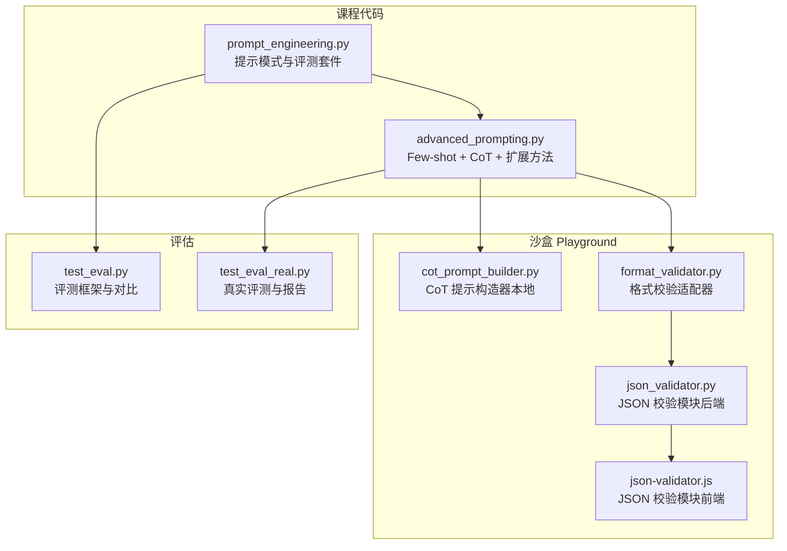
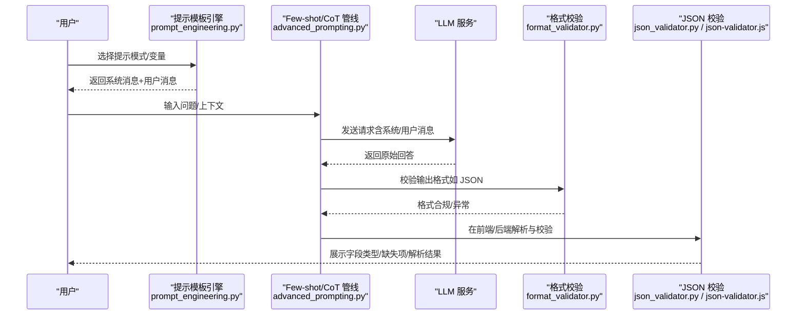
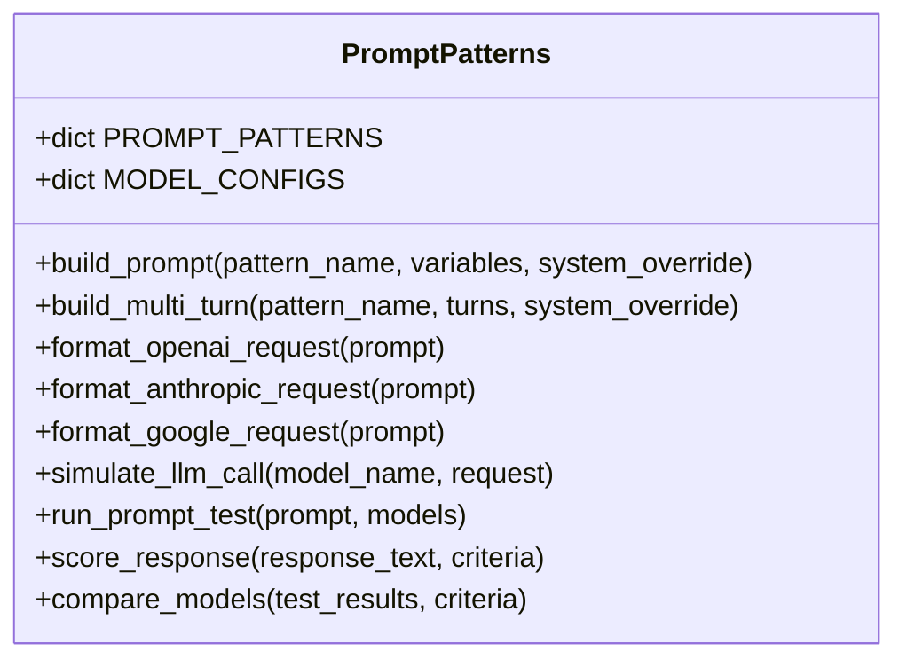
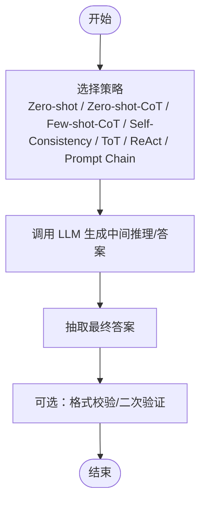
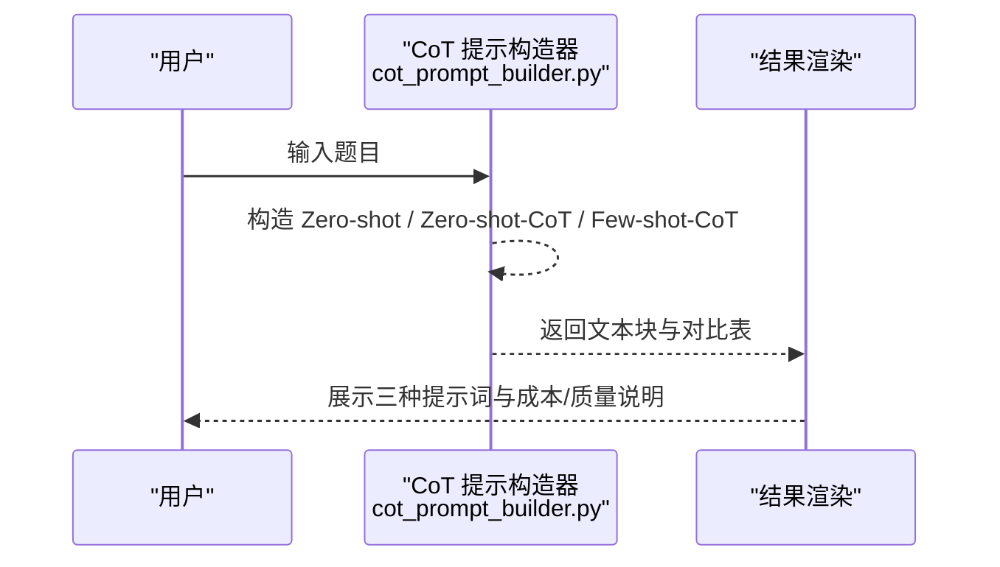
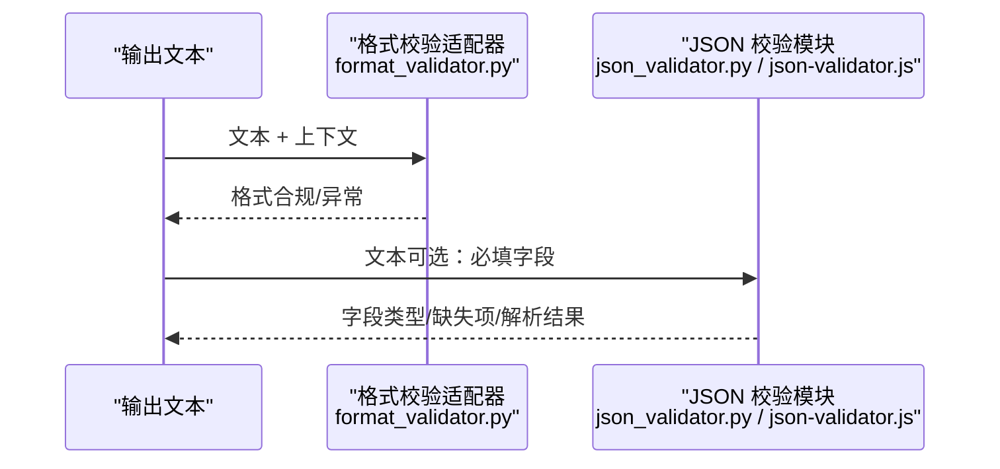
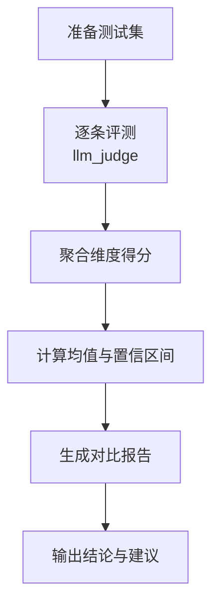
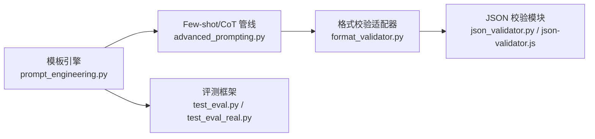

# 提示工程

<cite>
**本文引用的文件**
- [phases/11-llm-engineering/01-prompt-engineering/code/prompt_engineering.py](file://phases/11-llm-engineering/01-prompt-engineering/code/prompt_engineering.py)
- [phases/11-llm-engineering/02-few-shot-cot/code/advanced_prompting.py](file://phases/11-llm-engineering/02-few-shot-cot/code/advanced_prompting.py)
- [guardrails-sandbox/backend/playground/modules/cot_prompt_builder.py](file://guardrails-sandbox/backend/playground/modules/cot_prompt_builder.py)
- [guardrails-sandbox/backend/adapters/format_validator.py](file://guardrails-sandbox/backend/adapters/format_validator.py)
- [guardrails-sandbox/backend/playground/modules/json_validator.py](file://guardrails-sandbox/backend/playground/modules/json_validator.py)
- [site/vue-app/summary/src/data/modules/json-validator.js](file://site/vue-app/summary/src/data/modules/json-validator.js)
- [test_eval.py](file://test_eval.py)
- [test_eval_real.py](file://test_eval_real.py)
</cite>

## 目录
1. [简介](#简介)
2. [项目结构](#项目结构)
3. [核心组件](#核心组件)
4. [架构总览](#架构总览)
5. [详细组件分析](#详细组件分析)
6. [依赖分析](#依赖分析)
7. [性能考量](#性能考量)
8. [故障排查指南](#故障排查指南)
9. [结论](#结论)
10. [附录](#附录)

## 简介
本文件系统性梳理提示工程的关键技术与最佳实践，围绕以下主题展开：
- Few-shot 学习与思维链（Chain-of-Thought, CoT）
- 结构化输出与格式约束
- 提示模板设计：上下文构建、指令明确化、输出格式约束
- 提示优化策略、调试技巧与性能评估方法
- 实战案例：在课程与沙盒工具中的具体实现与可视化

目标读者既包括初学者，也面向希望在实际项目中落地提示工程的工程师。

## 项目结构
本仓库中与提示工程直接相关的模块主要分布在“llm 工程”阶段的课程代码与“安全护栏沙盒”的前端/后端 Playground 工具中；同时包含测试与评估脚本，用于对比不同提示策略的效果。

图示来源
- [phases/11-llm-engineering/01-prompt-engineering/code/prompt_engineering.py](file://phases/11-llm-engineering/01-prompt-engineering/code/prompt_engineering.py)
- [phases/11-llm-engineering/02-few-shot-cot/code/advanced_prompting.py](file://phases/11-llm-engineering/02-few-shot-cot/code/advanced_prompting.py)
- [guardrails-sandbox/backend/playground/modules/cot_prompt_builder.py](file://guardrails-sandbox/backend/playground/modules/cot_prompt_builder.py)
- [guardrails-sandbox/backend/adapters/format_validator.py](file://guardrails-sandbox/backend/adapters/format_validator.py)
- [guardrails-sandbox/backend/playground/modules/json_validator.py](file://guardrails-sandbox/backend/playground/modules/json_validator.py)
- [site/vue-app/summary/src/data/modules/json-validator.js](file://site/vue-app/summary/src/data/modules/json-validator.js)
- [test_eval.py](file://test_eval.py)
- [test_eval_real.py](file://test_eval_real.py)

章节来源
- [phases/11-llm-engineering/01-prompt-engineering/code/prompt_engineering.py](file://phases/11-llm-engineering/01-prompt-engineering/code/prompt_engineering.py)
- [phases/11-llm-engineering/02-few-shot-cot/code/advanced_prompting.py](file://phases/11-llm-engineering/02-few-shot-cot/code/advanced_prompting.py)
- [guardrails-sandbox/backend/playground/modules/cot_prompt_builder.py](file://guardrails-sandbox/backend/playground/modules/cot_prompt_builder.py)
- [guardrails-sandbox/backend/adapters/format_validator.py](file://guardrails-sandbox/backend/adapters/format_validator.py)
- [guardrails-sandbox/backend/playground/modules/json_validator.py](file://guardrails-sandbox/backend/playground/modules/json_validator.py)
- [site/vue-app/summary/src/data/modules/json-validator.js](file://site/vue-app/summary/src/data/modules/json-validator.js)
- [test_eval.py](file://test_eval.py)
- [test_eval_real.py](file://test_eval_real.py)

## 核心组件
- 提示模式与模板引擎：统一管理多种提示模式（角色扮演、少样本、思维链、模板填充、批判、边界守卫、元提示、分解、受众适配等），支持跨模型请求格式化与模拟调用。
- Few-shot 与思维链管线：提供 Zero-shot、Zero-shot-CoT、Few-shot-CoT、Self-Consistency、Tree-of-Thought、ReAct、提示链等多种推理增强策略。
- 结构化输出与格式校验：在输出端拦截格式错误，确保下游可解析。
- Playground 可视化与交互：本地构造提示词，对比不同策略的成本与质量；前端/后端 JSON 校验工具。
- 评测与对比：提供评测框架、置信区间计算与对比报告，支撑提示优化闭环。

章节来源
- [phases/11-llm-engineering/01-prompt-engineering/code/prompt_engineering.py](file://phases/11-llm-engineering/01-prompt-engineering/code/prompt_engineering.py)
- [phases/11-llm-engineering/02-few-shot-cot/code/advanced_prompting.py](file://phases/11-llm-engineering/02-few-shot-cot/code/advanced_prompting.py)
- [guardrails-sandbox/backend/playground/modules/cot_prompt_builder.py](file://guardrails-sandbox/backend/playground/modules/cot_prompt_builder.py)
- [guardrails-sandbox/backend/adapters/format_validator.py](file://guardrails-sandbox/backend/adapters/format_validator.py)
- [guardrails-sandbox/backend/playground/modules/json_validator.py](file://guardrails-sandbox/backend/playground/modules/json_validator.py)
- [site/vue-app/summary/src/data/modules/json-validator.js](file://site/vue-app/summary/src/data/modules/json-validator.js)
- [test_eval.py](file://test_eval.py)
- [test_eval_real.py](file://test_eval_real.py)

## 架构总览
提示工程在本项目中的整体流程如下：
- 设计阶段：选择或组合提示模式，构建系统消息与用户消息，必要时注入上下文与示例。
- 执行阶段：格式化为各模型的请求体，发送至 LLM；或在本地 Playground 中仅构造提示词进行对比。
- 后处理阶段：对输出进行格式校验与结构化解析；必要时进行二次验证或提示链处理。
- 评估阶段：使用评测框架打分、对比不同策略，生成报告与建议。

图示来源
- [phases/11-llm-engineering/01-prompt-engineering/code/prompt_engineering.py](file://phases/11-llm-engineering/01-prompt-engineering/code/prompt_engineering.py)
- [phases/11-llm-engineering/02-few-shot-cot/code/advanced_prompting.py](file://phases/11-llm-engineering/02-few-shot-cot/code/advanced_prompting.py)
- [guardrails-sandbox/backend/adapters/format_validator.py](file://guardrails-sandbox/backend/adapters/format_validator.py)
- [guardrails-sandbox/backend/playground/modules/json_validator.py](file://guardrails-sandbox/backend/playground/modules/json_validator.py)
- [site/vue-app/summary/src/data/modules/json-validator.js](file://site/vue-app/summary/src/data/modules/json-validator.js)

## 详细组件分析

### 组件A：提示模式与模板引擎（prompt_engineering.py）
- 功能要点
  - 统一定义多种提示模式（模板），包括角色扮演、少样本、思维链、模板填充、批判、边界守卫、元提示、分解、受众适配等。
  - 提供构建提示与多轮对话的能力，支持系统消息覆盖与元数据记录。
  - 将提示格式化为 OpenAI/Anthropic/Google 的请求体，并提供模拟调用以估算 token 与延迟。
  - 内置评测套件：对响应进行关键词命中、禁止短语、格式合法性（JSON/要点/编号列表）等评分，并综合排序。
- 关键接口
  - 构建提示：build_prompt(pattern_name, variables, system_override)
  - 多轮对话：build_multi_turn(pattern_name, turns, system_override)
  - 请求格式化：format_openai_request/format_anthropic_request/format_google_request
  - 模拟调用：simulate_llm_call(model_name, request)
  - 评测：run_prompt_test + score_response + compare_models
  - 示例测试套件：TEST_SUITE（包含 Persona/Few-Shot/Chain-of-Thought/Template Fill/Guardrail）

图示来源
- [phases/11-llm-engineering/01-prompt-engineering/code/prompt_engineering.py](file://phases/11-llm-engineering/01-prompt-engineering/code/prompt_engineering.py)

章节来源
- [phases/11-llm-engineering/01-prompt-engineering/code/prompt_engineering.py](file://phases/11-llm-engineering/01-prompt-engineering/code/prompt_engineering.py)

### 组件B：Few-shot 与思维链管线（advanced_prompting.py）
- 功能要点
  - 提供 Zero-shot、Zero-shot-CoT、Few-shot-CoT 的提示构造函数与推理流程。
  - Self-Consistency：多次采样投票，提升准确性。
  - Tree-of-Thought：生成多个初始思路，评估与扩展，迭代选择最优路径。
  - ReAct：在推理过程中允许“思考-行动-观察”，适合需要外部计算或检索的任务。
  - 提示链（Prompt Chain）：拆分为“提取事实-求解-验证”三段式，降低出错概率。
  - 答案抽取：从模型输出中提取最终答案，支持多种标记模式。
- 关键接口
  - 构造提示：build_zero_shot_prompt/build_zero_shot_cot_prompt/build_cot_prompt
  - 推理求解：zero_shot_solve/zero_shot_cot_solve/few_shot_cot_solve/self_consistency_solve/tree_of_thought_solve/react_solve/prompt_chain_solve
  - 答案抽取：extract_answer

图示来源
- [phases/11-llm-engineering/02-few-shot-cot/code/advanced_prompting.py](file://phases/11-llm-engineering/02-few-shot-cot/code/advanced_prompting.py)

章节来源
- [phases/11-llm-engineering/02-few-shot-cot/code/advanced_prompting.py](file://phases/11-llm-engineering/02-few-shot-cot/code/advanced_prompting.py)

### 组件C：CoT 提示构造器（cot_prompt_builder.py）
- 功能要点
  - 输入一道题目，本地构造 Zero-shot、Zero-shot-CoT、Few-shot-CoT 三种提示词，无需调用 LLM。
  - 对比三种策略的 token 成本与质量，辅助教学与快速迭代。
- 关键接口
  - run(inputs)：接收题目，返回三种提示词与对比表格。

图示来源
- [guardrails-sandbox/backend/playground/modules/cot_prompt_builder.py](file://guardrails-sandbox/backend/playground/modules/cot_prompt_builder.py)

章节来源
- [guardrails-sandbox/backend/playground/modules/cot_prompt_builder.py](file://guardrails-sandbox/backend/playground/modules/cot_prompt_builder.py)

### 组件D：格式校验与结构化输出（format_validator.py / json_validator.py / json-validator.js）
- 功能要点
  - 格式校验适配器：检测 JSON 解析失败等格式问题，作为输出守卫。
  - 后端 JSON 校验模块：解析 JSON、统计字段类型、校验必填字段、输出结构化结果。
  - 前端 JSON 校验模块：与后端功能一致，便于本地演示与调试。
- 关键接口
  - 格式校验适配器：check(text, context)
  - 后端模块：run(inputs) 返回 summary/blocks
  - 前端模块：runJsonValidator(inputs) 返回 summary/blocks

图示来源
- [guardrails-sandbox/backend/adapters/format_validator.py](file://guardrails-sandbox/backend/adapters/format_validator.py)
- [guardrails-sandbox/backend/playground/modules/json_validator.py](file://guardrails-sandbox/backend/playground/modules/json_validator.py)
- [site/vue-app/summary/src/data/modules/json-validator.js](file://site/vue-app/summary/src/data/modules/json-validator.js)

章节来源
- [guardrails-sandbox/backend/adapters/format_validator.py](file://guardrails-sandbox/backend/adapters/format_validator.py)
- [guardrails-sandbox/backend/playground/modules/json_validator.py](file://guardrails-sandbox/backend/playground/modules/json_validator.py)
- [site/vue-app/summary/src/data/modules/json-validator.js](file://site/vue-app/summary/src/data/modules/json-validator.js)

### 组件E：评测与对比（test_eval.py / test_eval_real.py）
- 功能要点
  - 评测框架：定义测试用例、评分维度（相关性、正确性、有用性、安全性）、对比基线与新版本。
  - 置信区间：使用 Wilson 区间估计，给出稳健的统计结论。
  - 报告生成：汇总平均分、分类得分、低分用例、缓存统计等。
- 关键接口
  - 评测执行：run_eval(model_name, suite, version)
  - 对比报告：compare(baseline, new_results)
  - 实战评测：test_eval_real.py 展示真实场景下的评测流程与结论。

图示来源
- [test_eval.py](file://test_eval.py)
- [test_eval_real.py](file://test_eval_real.py)

章节来源
- [test_eval.py](file://test_eval.py)
- [test_eval_real.py](file://test_eval_real.py)

## 依赖分析
- 组件耦合
  - 模板引擎与 Few-shot/CoT 管线：模板引擎负责构造系统/用户消息，管线负责组织推理流程与答案抽取。
  - 格式校验适配器与 JSON 校验模块：前者在上游拦截格式错误，后者在前端/后端进行细粒度解析与校验。
  - 评测模块：独立于具体提示策略，提供统一的评估与对比能力。
- 外部依赖
  - OpenAI 客户端：用于真实 LLM 调用（advanced_prompting.py 中使用）。
  - 前端 Vue 应用：承载 Playground 与 JSON 校验的可视化展示。

图示来源
- [phases/11-llm-engineering/01-prompt-engineering/code/prompt_engineering.py](file://phases/11-llm-engineering/01-prompt-engineering/code/prompt_engineering.py)
- [phases/11-llm-engineering/02-few-shot-cot/code/advanced_prompting.py](file://phases/11-llm-engineering/02-few-shot-cot/code/advanced_prompting.py)
- [guardrails-sandbox/backend/adapters/format_validator.py](file://guardrails-sandbox/backend/adapters/format_validator.py)
- [guardrails-sandbox/backend/playground/modules/json_validator.py](file://guardrails-sandbox/backend/playground/modules/json_validator.py)
- [site/vue-app/summary/src/data/modules/json-validator.js](file://site/vue-app/summary/src/data/modules/json-validator.js)
- [test_eval.py](file://test_eval.py)
- [test_eval_real.py](file://test_eval_real.py)

章节来源
- [phases/11-llm-engineering/01-prompt-engineering/code/prompt_engineering.py](file://phases/11-llm-engineering/01-prompt-engineering/code/prompt_engineering.py)
- [phases/11-llm-engineering/02-few-shot-cot/code/advanced_prompting.py](file://phases/11-llm-engineering/02-few-shot-cot/code/advanced_prompting.py)
- [guardrails-sandbox/backend/adapters/format_validator.py](file://guardrails-sandbox/backend/adapters/format_validator.py)
- [guardrails-sandbox/backend/playground/modules/json_validator.py](file://guardrails-sandbox/backend/playground/modules/json_validator.py)
- [site/vue-app/summary/src/data/modules/json-validator.js](file://site/vue-app/summary/src/data/modules/json-validator.js)
- [test_eval.py](file://test_eval.py)
- [test_eval_real.py](file://test_eval_real.py)

## 性能考量
- Token 与延迟
  - 模板引擎提供模拟调用，估算不同提示模式的 token 使用与 API 延迟，便于在设计阶段权衡成本与质量。
- 准确性与稳定性
  - Few-shot-CoT 通常最稳定；Self-Consistency 通过多次采样投票进一步提升；Tree-of-Thought 适合复杂推理；ReAct 适合需要外部计算/检索的任务。
- 输出格式
  - 格式错误比内容错误更致命，需在输出端强制校验，避免下游解析崩溃。

章节来源
- [phases/11-llm-engineering/01-prompt-engineering/code/prompt_engineering.py](file://phases/11-llm-engineering/01-prompt-engineering/code/prompt_engineering.py)
- [phases/11-llm-engineering/02-few-shot-cot/code/advanced_prompting.py](file://phases/11-llm-engineering/02-few-shot-cot/code/advanced_prompting.py)
- [guardrails-sandbox/backend/adapters/format_validator.py](file://guardrails-sandbox/backend/adapters/format_validator.py)

## 故障排查指南
- 输出格式异常
  - 使用格式校验适配器与 JSON 校验模块定位问题，检查 JSON 是否合法、字段是否齐全、类型是否匹配。
- 答案抽取失败
  - 检查提示中是否明确要求“最终答案”的标记格式；若模型未遵循，调整提示或增加显式约束。
- 评测分数偏低
  - 通过评测框架对比不同策略，关注低分用例，针对性优化提示或引入结构化输出约束。

章节来源
- [guardrails-sandbox/backend/adapters/format_validator.py](file://guardrails-sandbox/backend/adapters/format_validator.py)
- [guardrails-sandbox/backend/playground/modules/json_validator.py](file://guardrails-sandbox/backend/playground/modules/json_validator.py)
- [site/vue-app/summary/src/data/modules/json-validator.js](file://site/vue-app/summary/src/data/modules/json-validator.js)
- [test_eval.py](file://test_eval.py)
- [test_eval_real.py](file://test_eval_real.py)

## 结论
本项目提供了从提示设计、推理增强到输出校验与评测对比的完整闭环。通过模板引擎与多种提示模式，结合 Few-shot 与思维链策略，能够在不同任务上取得稳定且可控的性能。配合严格的格式校验与评测体系，可以持续优化提示质量，降低生产风险。

## 附录
- 提示模板设计清单
  - 明确角色与目标（Persona）
  - 提供上下文与背景（Context）
  - 给出清晰指令与约束（Instruction + Constraints）
  - 插入少样本示例（Few-shot）
  - 强制结构化输出（Structured Output）
  - 明确最终答案标记（Final Answer Marker）
- 实战建议
  - 先用 Zero-shot 快速验证任务可行性
  - 若不稳定，逐步引入 CoT 与 Few-shot
  - 对结构化输出任务，务必在提示中约束输出格式并在下游严格校验
  - 使用评测框架持续对比与回归测试