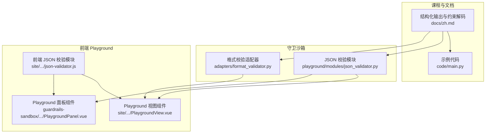
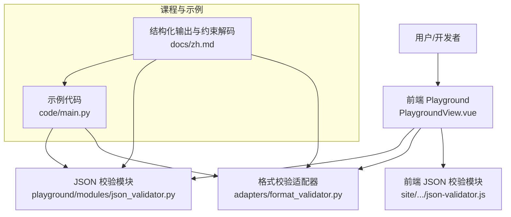
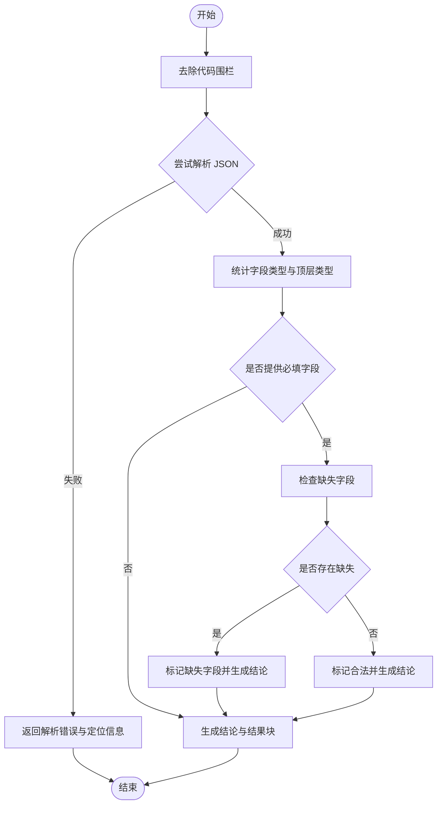
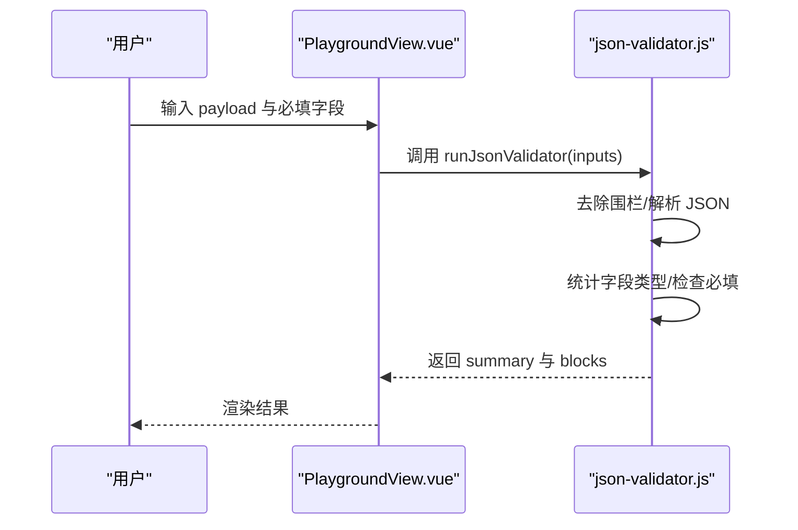
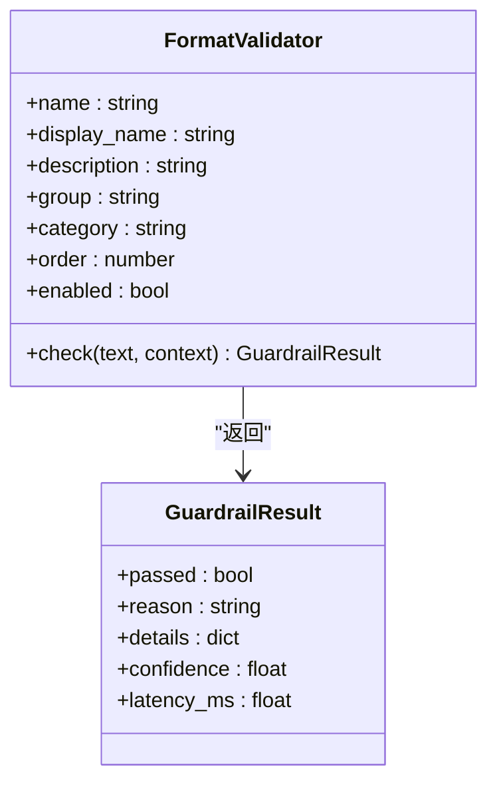
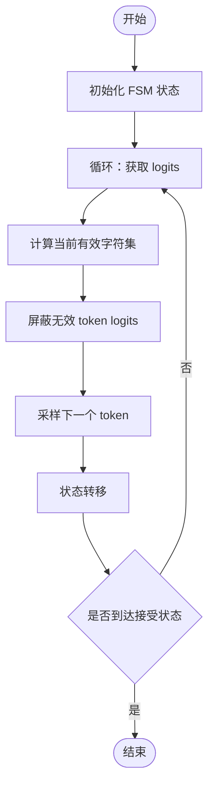
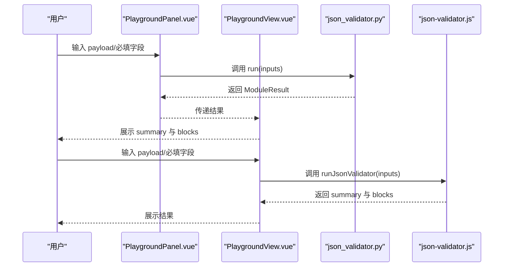
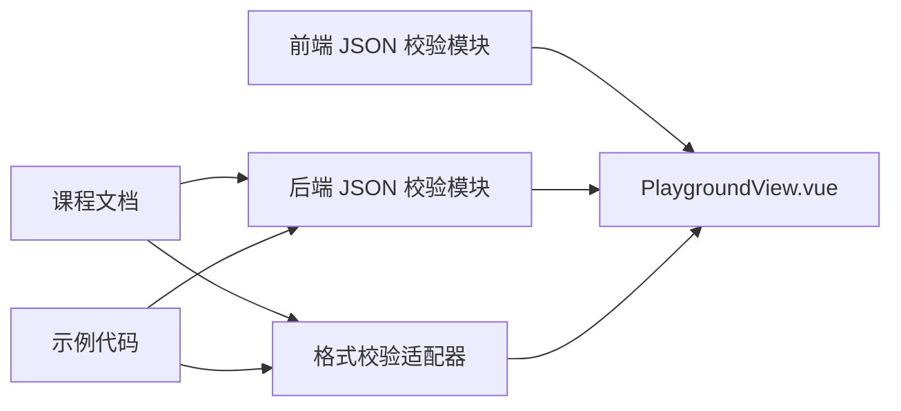

# 结构化输出

<cite>
**本文档引用的文件**
- [phases/05-nlp-foundations-to-advanced/20-structured-outputs-constrained-decoding/docs/zh.md](file://phases/05-nlp-foundations-to-advanced/20-structured-outputs-constrained-decoding/docs/zh.md)
- [phases/05-nlp-foundations-to-advanced/20-structured-outputs-constrained-decoding/code/main.py](file://phases/05-nlp-foundations-to-advanced/20-structured-outputs-constrained-decoding/code/main.py)
- [guardrails-sandbox/backend/adapters/format_validator.py](file://guardrails-sandbox/backend/adapters/format_validator.py)
- [guardrails-sandbox/backend/playground/modules/json_validator.py](file://guardrails-sandbox/backend/playground/modules/json_validator.py)
- [site/vue-app/summary/src/data/modules/json-validator.js](file://site/vue-app/summary/src/data/modules/json-validator.js)
- [site/vue-app/summary/src/components/PlaygroundView.vue](file://site/vue-app/summary/src/components/PlaygroundView.vue)
- [guardrails-sandbox/frontend/src/components/PlaygroundPanel.vue](file://guardrails-sandbox/frontend/src/components/PlaygroundPanel.vue)
</cite>

## 目录
1. [简介](#简介)
2. [项目结构](#项目结构)
3. [核心组件](#核心组件)
4. [架构总览](#架构总览)
5. [详细组件分析](#详细组件分析)
6. [依赖分析](#依赖分析)
7. [性能考虑](#性能考虑)
8. [故障排查指南](#故障排查指南)
9. [结论](#结论)
10. [附录](#附录)

## 简介
本文件围绕“结构化输出”的设计原理与实现方法展开，重点覆盖以下方面：
- JSON 格式约束与校验：包括解析合法性、字段齐全性、类型一致性、嵌套结构处理等
- XML 输出规范与表格数据生成的实践要点
- 严格输出格式模板设计：字段定义、数据类型验证、嵌套结构处理
- 具体实现示例：数据提取、配置生成、报告格式化等场景
- 输出质量控制、格式验证、错误恢复策略
- 生产环境中的应用价值与实施效果

## 项目结构
本仓库中与“结构化输出”直接相关的关键模块与资源分布如下：
- 课程与文档：结构化输出与约束解码的理论与实践说明
- 示例代码：从头实现正则约束解码、Outlines JSON Schema、Instructor 重试等
- 守卫沙箱：格式校验适配器与 Playground 模块，提供 JSON 校验与可视化结果
- 前端 Playground：表单驱动与结果渲染，支持本地 JSON 校验与展示

**图表来源**
- [phases/05-nlp-foundations-to-advanced/20-structured-outputs-constrained-decoding/docs/zh.md:1-223](file://phases/05-nlp-foundations-to-advanced/20-structured-outputs-constrained-decoding/docs/zh.md#L1-L223)
- [phases/05-nlp-foundations-to-advanced/20-structured-outputs-constrained-decoding/code/main.py:1-129](file://phases/05-nlp-foundations-to-advanced/20-structured-outputs-constrained-decoding/code/main.py#L1-L129)
- [guardrails-sandbox/backend/adapters/format_validator.py:1-86](file://guardrails-sandbox/backend/adapters/format_validator.py#L1-L86)
- [guardrails-sandbox/backend/playground/modules/json_validator.py:1-98](file://guardrails-sandbox/backend/playground/modules/json_validator.py#L1-L98)
- [site/vue-app/summary/src/data/modules/json-validator.js:1-95](file://site/vue-app/summary/src/data/modules/json-validator.js#L1-L95)
- [site/vue-app/summary/src/components/PlaygroundView.vue:35-71](file://site/vue-app/summary/src/components/PlaygroundView.vue#L35-L71)
- [guardrails-sandbox/frontend/src/components/PlaygroundPanel.vue:144-179](file://guardrails-sandbox/frontend/src/components/PlaygroundPanel.vue#L144-L179)

**章节来源**
- [phases/05-nlp-foundations-to-advanced/20-structured-outputs-constrained-decoding/docs/zh.md:1-223](file://phases/05-nlp-foundations-to-advanced/20-structured-outputs-constrained-decoding/docs/zh.md#L1-L223)
- [phases/05-nlp-foundations-to-advanced/20-structured-outputs-constrained-decoding/code/main.py:1-129](file://phases/05-nlp-foundations-to-advanced/20-structured-outputs-constrained-decoding/code/main.py#L1-L129)
- [guardrails-sandbox/backend/adapters/format_validator.py:1-86](file://guardrails-sandbox/backend/adapters/format_validator.py#L1-L86)
- [guardrails-sandbox/backend/playground/modules/json_validator.py:1-98](file://guardrails-sandbox/backend/playground/modules/json_validator.py#L1-L98)
- [site/vue-app/summary/src/data/modules/json-validator.js:1-95](file://site/vue-app/summary/src/data/modules/json-validator.js#L1-L95)
- [site/vue-app/summary/src/components/PlaygroundView.vue:35-71](file://site/vue-app/summary/src/components/PlaygroundView.vue#L35-L71)
- [guardrails-sandbox/frontend/src/components/PlaygroundPanel.vue:144-179](file://guardrails-sandbox/frontend/src/components/PlaygroundPanel.vue#L144-L179)

## 核心组件
- 结构化输出与约束解码（理论与实践）
  - 三类方法：提示工程、原生结构化输出 API、约束解码
  - 约束解码在每步屏蔽无效 token，确保 100% 有效输出
  - 适用场景：本地模型、递归 schema、跨提供商可移植性
- JSON 校验器（本地）
  - 前端与后端双实现，支持去除 Markdown 代码围栏、字段齐全性与类型检查、结果表格化展示
- 格式校验适配器（运行时）
  - 检测 JSON 解析失败、Markdown 代码块闭合、空输出、期望 JSON 但非 JSON 等问题
- 前端 Playground
  - schema 驱动表单、结果区域渲染、交互式调试

**章节来源**
- [phases/05-nlp-foundations-to-advanced/20-structured-outputs-constrained-decoding/docs/zh.md:10-22](file://phases/05-nlp-foundations-to-advanced/20-structured-outputs-constrained-decoding/docs/zh.md#L10-L22)
- [phases/05-nlp-foundations-to-advanced/20-structured-outputs-constrained-decoding/docs/zh.md:24-51](file://phases/05-nlp-foundations-to-advanced/20-structured-outputs-constrained-decoding/docs/zh.md#L24-L51)
- [guardrails-sandbox/backend/playground/modules/json_validator.py:1-98](file://guardrails-sandbox/backend/playground/modules/json_validator.py#L1-L98)
- [site/vue-app/summary/src/data/modules/json-validator.js:1-95](file://site/vue-app/summary/src/data/modules/json-validator.js#L1-L95)
- [guardrails-sandbox/backend/adapters/format_validator.py:1-86](file://guardrails-sandbox/backend/adapters/format_validator.py#L1-L86)

## 架构总览
结构化输出在本项目中的实现由“课程文档 + 示例代码 + 守卫沙箱 + 前端 Playground”构成闭环，既可用于教学演示，也可作为生产级质量保障工具。

**图表来源**
- [phases/05-nlp-foundations-to-advanced/20-structured-outputs-constrained-decoding/docs/zh.md:1-223](file://phases/05-nlp-foundations-to-advanced/20-structured-outputs-constrained-decoding/docs/zh.md#L1-L223)
- [phases/05-nlp-foundations-to-advanced/20-structured-outputs-constrained-decoding/code/main.py:1-129](file://phases/05-nlp-foundations-to-advanced/20-structured-outputs-constrained-decoding/code/main.py#L1-L129)
- [guardrails-sandbox/backend/playground/modules/json_validator.py:1-98](file://guardrails-sandbox/backend/playground/modules/json_validator.py#L1-L98)
- [guardrails-sandbox/backend/adapters/format_validator.py:1-86](file://guardrails-sandbox/backend/adapters/format_validator.py#L1-L86)
- [site/vue-app/summary/src/components/PlaygroundView.vue:35-71](file://site/vue-app/summary/src/components/PlaygroundView.vue#L35-L71)
- [site/vue-app/summary/src/data/modules/json-validator.js:1-95](file://site/vue-app/summary/src/data/modules/json-validator.js#L1-L95)

## 详细组件分析

### JSON 校验器（后端）
- 输入：payload（JSON 文本）、required_fields（可选，逗号分隔）
- 处理流程：
  - 去除 Markdown 代码围栏
  - JSON 解析与错误定位（行列号）
  - 字段类型统计与顶层类型标注
  - 必填字段缺失检查
  - 结果以表格、键值对、JSON 原始数据块展示
- 输出：summary（结论）、blocks（结构化结果块）

**图表来源**
- [guardrails-sandbox/backend/playground/modules/json_validator.py:32-97](file://guardrails-sandbox/backend/playground/modules/json_validator.py#L32-L97)

**章节来源**
- [guardrails-sandbox/backend/playground/modules/json_validator.py:1-98](file://guardrails-sandbox/backend/playground/modules/json_validator.py#L1-L98)

### JSON 校验器（前端）
- 输入：payload、required_fields
- 处理流程：与后端一致，但使用前端类型判断与 UI 块渲染
- 输出：summary、blocks（表格、键值对、JSON 原始）

**图表来源**
- [site/vue-app/summary/src/components/PlaygroundView.vue:35-71](file://site/vue-app/summary/src/components/PlaygroundView.vue#L35-L71)
- [site/vue-app/summary/src/data/modules/json-validator.js:14-78](file://site/vue-app/summary/src/data/modules/json-validator.js#L14-L78)

**章节来源**
- [site/vue-app/summary/src/data/modules/json-validator.js:1-95](file://site/vue-app/summary/src/data/modules/json-validator.js#L1-L95)

### 格式校验适配器（运行时）
- 功能：在输出链路中拦截格式错误，避免下游解析崩溃
- 检测项：
  - JSON 解析失败
  - Markdown 代码块未闭合
  - 期望 JSON 但非 JSON
  - 空输出
- 输出：passed、reason、details（errors/warnings）、confidence、latency_ms

**图表来源**
- [guardrails-sandbox/backend/adapters/format_validator.py:13-85](file://guardrails-sandbox/backend/adapters/format_validator.py#L13-L85)

**章节来源**
- [guardrails-sandbox/backend/adapters/format_validator.py:1-86](file://guardrails-sandbox/backend/adapters/format_validator.py#L1-L86)

### 约束解码与示例代码
- 理论：在每步生成中屏蔽无效 token，确保输出语法有效
- 示例：从头实现正则约束解码（PhoneFSM），对比无约束随机生成
- 适用：本地模型、扁平 schema、需要 100% 合规的场景

**图表来源**
- [phases/05-nlp-foundations-to-advanced/20-structured-outputs-constrained-decoding/code/main.py:59-78](file://phases/05-nlp-foundations-to-advanced/20-structured-outputs-constrained-decoding/code/main.py#L59-L78)

**章节来源**
- [phases/05-nlp-foundations-to-advanced/20-structured-outputs-constrained-decoding/docs/zh.md:24-51](file://phases/05-nlp-foundations-to-advanced/20-structured-outputs-constrained-decoding/docs/zh.md#L24-L51)
- [phases/05-nlp-foundations-to-advanced/20-structured-outputs-constrained-decoding/code/main.py:1-129](file://phases/05-nlp-foundations-to-advanced/20-structured-outputs-constrained-decoding/code/main.py#L1-L129)

### 前端 Playground 交互
- 表单：schema 驱动，支持 textarea、number、text 等控件
- 结果区：渲染 summary 与 blocks（表格、键值对、JSON）
- 交互：回车触发、Tab 填入示例、错误提示

**图表来源**
- [guardrails-sandbox/frontend/src/components/PlaygroundPanel.vue:144-179](file://guardrails-sandbox/frontend/src/components/PlaygroundPanel.vue#L144-L179)
- [site/vue-app/summary/src/components/PlaygroundView.vue:35-71](file://site/vue-app/summary/src/components/PlaygroundView.vue#L35-L71)
- [guardrails-sandbox/backend/playground/modules/json_validator.py:32-97](file://guardrails-sandbox/backend/playground/modules/json_validator.py#L32-L97)
- [site/vue-app/summary/src/data/modules/json-validator.js:14-78](file://site/vue-app/summary/src/data/modules/json-validator.js#L14-L78)

**章节来源**
- [guardrails-sandbox/frontend/src/components/PlaygroundPanel.vue:144-179](file://guardrails-sandbox/frontend/src/components/PlaygroundPanel.vue#L144-L179)
- [site/vue-app/summary/src/components/PlaygroundView.vue:35-71](file://site/vue-app/summary/src/components/PlaygroundView.vue#L35-L71)

## 依赖分析
- 组件耦合
  - JSON 校验器（前后端）与 Playground 视图强耦合，通过 schema 驱动表单与结果渲染
  - 格式校验适配器与后端 GuardrailResult 约定强耦合
- 外部依赖
  - JSON 解析（标准库）
  - 前端类型判断（typeof、Array.isArray）
  - Markdown 围栏处理（字符串替换）

**图表来源**
- [site/vue-app/summary/src/data/modules/json-validator.js:1-95](file://site/vue-app/summary/src/data/modules/json-validator.js#L1-L95)
- [guardrails-sandbox/backend/playground/modules/json_validator.py:1-98](file://guardrails-sandbox/backend/playground/modules/json_validator.py#L1-L98)
- [guardrails-sandbox/backend/adapters/format_validator.py:1-86](file://guardrails-sandbox/backend/adapters/format_validator.py#L1-L86)
- [phases/05-nlp-foundations-to-advanced/20-structured-outputs-constrained-decoding/docs/zh.md:1-223](file://phases/05-nlp-foundations-to-advanced/20-structured-outputs-constrained-decoding/docs/zh.md#L1-L223)
- [phases/05-nlp-foundations-to-advanced/20-structured-outputs-constrained-decoding/code/main.py:1-129](file://phases/05-nlp-foundations-to-advanced/20-structured-outputs-constrained-decoding/code/main.py#L1-L129)

**章节来源**
- [site/vue-app/summary/src/data/modules/json-validator.js:1-95](file://site/vue-app/summary/src/data/modules/json-validator.js#L1-L95)
- [guardrails-sandbox/backend/playground/modules/json_validator.py:1-98](file://guardrails-sandbox/backend/playground/modules/json_validator.py#L1-L98)
- [guardrails-sandbox/backend/adapters/format_validator.py:1-86](file://guardrails-sandbox/backend/adapters/format_validator.py#L1-L86)
- [phases/05-nlp-foundations-to-advanced/20-structured-outputs-constrained-decoding/docs/zh.md:1-223](file://phases/05-nlp-foundations-to-advanced/20-structured-outputs-constrained-decoding/docs/zh.md#L1-L223)
- [phases/05-nlp-foundations-to-advanced/20-structured-outputs-constrained-decoding/code/main.py:1-129](file://phases/05-nlp-foundations-to-advanced/20-structured-outputs-constrained-decoding/code/main.py#L1-L129)

## 性能考虑
- 约束解码通常更快：缩小下一 token 搜索空间、对强制 token 可跳过生成
- 本地校验开销极低：仅 JSON 解析与字符串处理
- 前端校验适合快速迭代：无需调用后端，即时反馈
- 运行时格式校验：轻量级，避免下游解析失败导致的昂贵回滚

[本节为通用指导，不直接分析具体文件]

## 故障排查指南
- JSON 解析失败
  - 前端：提示错误类型、消息与定位（行列号），建议检查引号/逗号/括号配对
  - 后端：提供行/列定位，便于快速定位问题
- Markdown 代码围栏
  - 前端/后端均支持去除围栏，避免解析干扰
- 必填字段缺失
  - 明确列出缺失字段，辅助补齐 schema 或提示用户修正
- 格式校验拦截
  - JSON 解析失败、代码块未闭合、空输出、期望 JSON 但非 JSON
  - 通过 GuardrailResult 的 details 与 confidence 辅助决策

**章节来源**
- [guardrails-sandbox/backend/playground/modules/json_validator.py:46-59](file://guardrails-sandbox/backend/playground/modules/json_validator.py#L46-L59)
- [site/vue-app/summary/src/data/modules/json-validator.js:30-43](file://site/vue-app/summary/src/data/modules/json-validator.js#L30-L43)
- [guardrails-sandbox/backend/adapters/format_validator.py:30-68](file://guardrails-sandbox/backend/adapters/format_validator.py#L30-L68)

## 结论
本项目提供了从理论到实践的完整“结构化输出”能力：
- 通过课程文档与示例代码，掌握约束解码与多种实现路径
- 通过 JSON 校验器与格式校验适配器，构建本地与运行时的质量保障
- 通过前端 Playground，实现快速迭代与可视化反馈
在生产环境中，建议将“格式校验拦截 + JSON 校验 + 约束解码（必要时）”组合使用，以获得高合规率、低延迟与高稳定性。

[本节为总结性内容，不直接分析具体文件]

## 附录

### 设计严格输出格式模板的步骤
- 字段定义
  - 明确必填字段与可选字段
  - 为每个字段指定类型（字符串、数字、布尔、数组、对象）
  - 对复杂字段给出嵌套 schema 或示例
- 数据类型验证
  - 数字范围、枚举集合、正则表达式
  - 空值处理（允许 null 或拒绝）
- 嵌套结构处理
  - 递归 schema 使用 CFG（如 XGrammar）或展平策略
  - 字段顺序：推理在前，答案在后，避免过早承诺
- 输出质量控制
  - 合规率目标 100%
  - 语义有效性（LLM 评判）
  - 字段覆盖率、延迟 p50/p99
- 错误恢复
  - 格式校验失败时的降级策略（回退模型、拒绝服务）
  - 重试上限与指数退避

**章节来源**
- [phases/05-nlp-foundations-to-advanced/20-structured-outputs-constrained-decoding/docs/zh.md:152-172](file://phases/05-nlp-foundations-to-advanced/20-structured-outputs-constrained-decoding/docs/zh.md#L152-L172)
- [phases/05-nlp-foundations-to-advanced/20-structured-outputs-constrained-decoding/docs/zh.md:41-51](file://phases/05-nlp-foundations-to-advanced/20-structured-outputs-constrained-decoding/docs/zh.md#L41-L51)

### XML 输出规范与表格数据生成要点
- XML 输出规范
  - 使用明确的根元素与命名空间
  - 属性与元素的类型声明与约束
  - 空元素与自闭合标签的一致性
- 表格数据生成
  - 表头与行数据的对齐与类型映射
  - 特殊字符转义与换行处理
  - 与 JSON 的双向映射策略（保持字段语义一致）

[本节为通用指导，不直接分析具体文件]

### 典型应用场景与实现要点
- 数据提取
  - 使用约束解码确保 JSON Schema 合规
  - 前端/后端 JSON 校验器双重验证
- 配置生成
  - 通过格式校验适配器拦截非 JSON 输出
  - schema 设计强调必填字段与枚举约束
- 报告格式化
  - 使用表格块与键值对块组织输出
  - 保留原始 JSON 以便机器消费与人工审阅

**章节来源**
- [guardrails-sandbox/backend/adapters/format_validator.py:30-60](file://guardrails-sandbox/backend/adapters/format_validator.py#L30-L60)
- [guardrails-sandbox/backend/playground/modules/json_validator.py:68-90](file://guardrails-sandbox/backend/playground/modules/json_validator.py#L68-L90)
- [site/vue-app/summary/src/data/modules/json-validator.js:69-76](file://site/vue-app/summary/src/data/modules/json-validator.js#L69-L76)