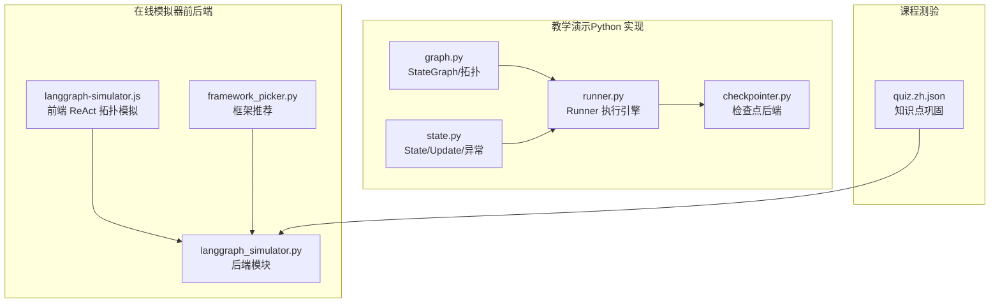
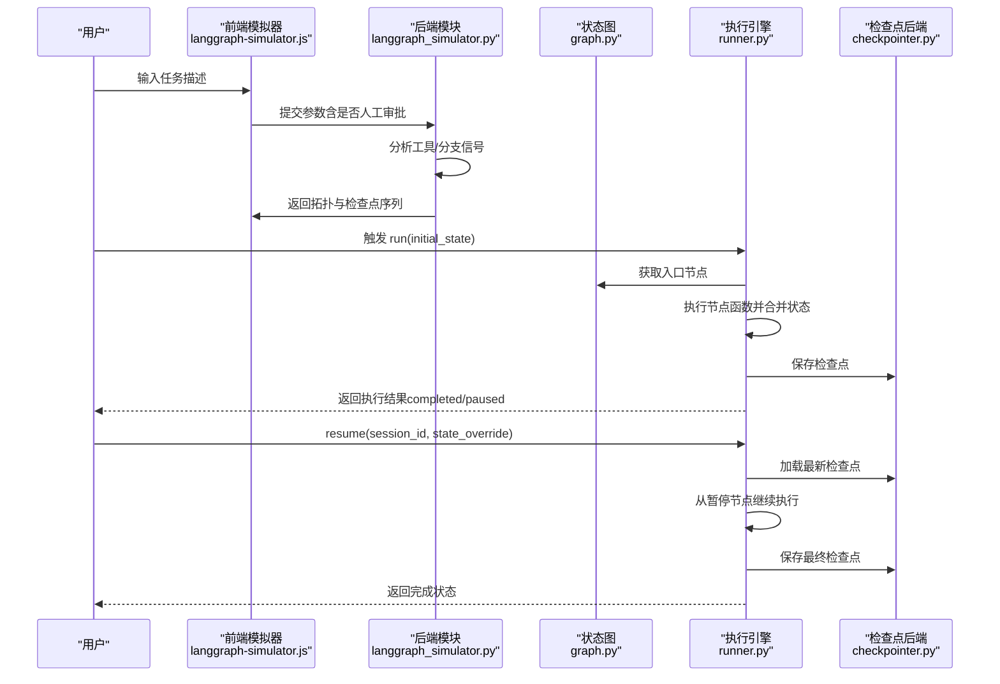
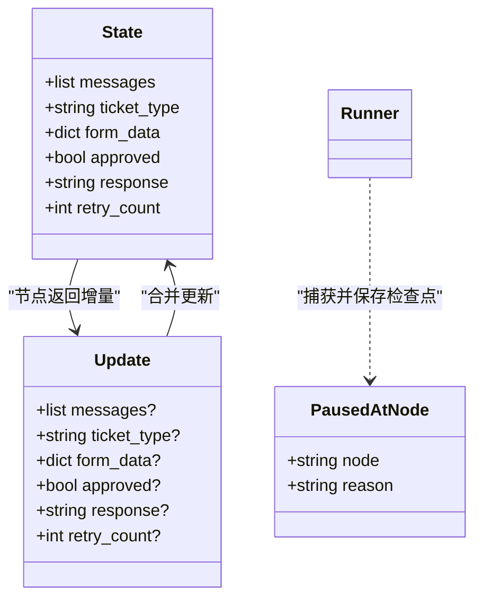
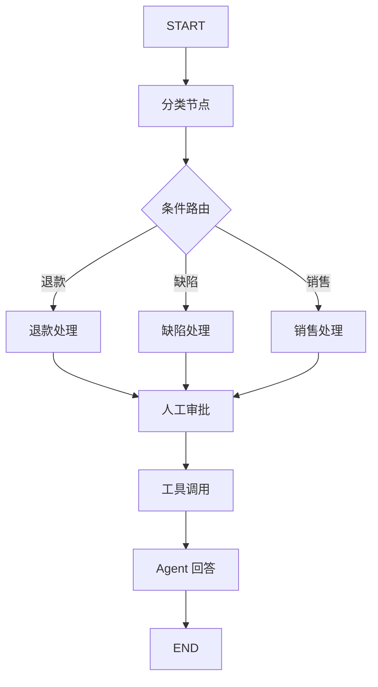
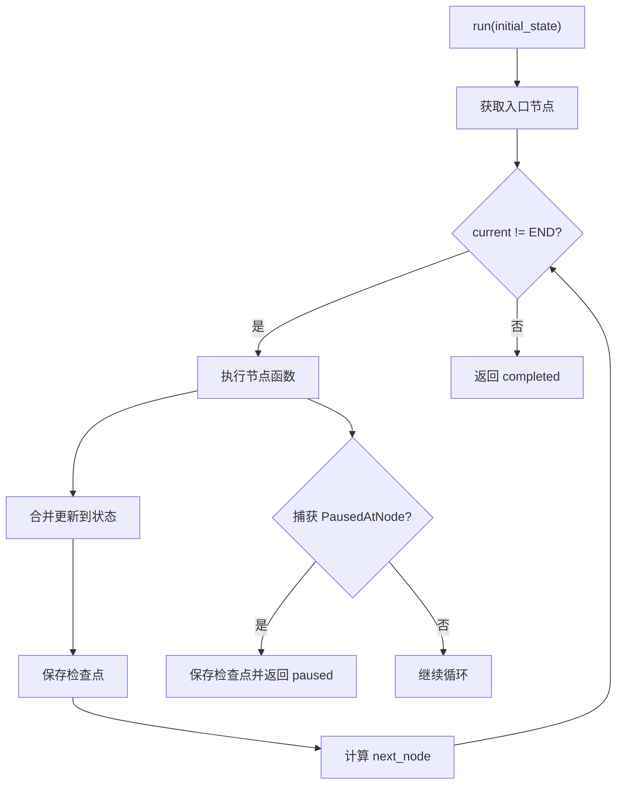
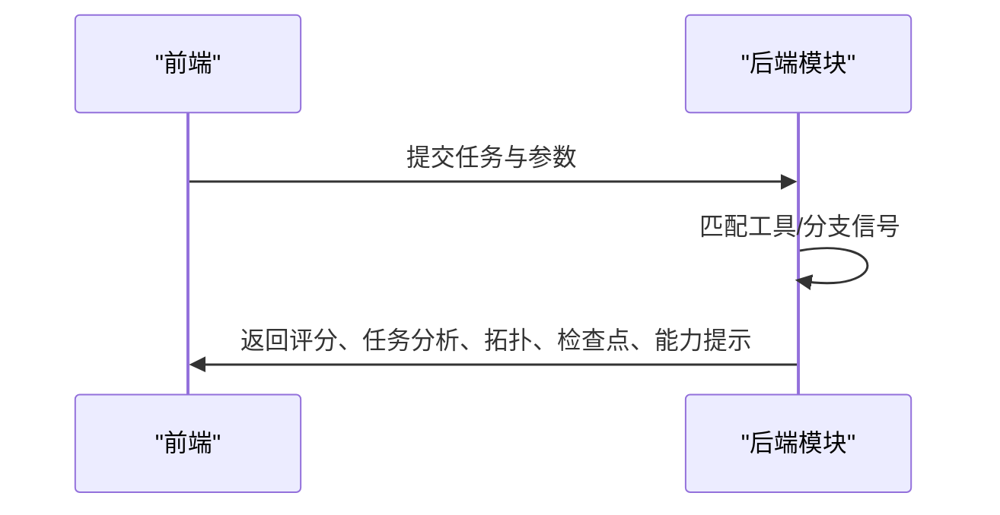
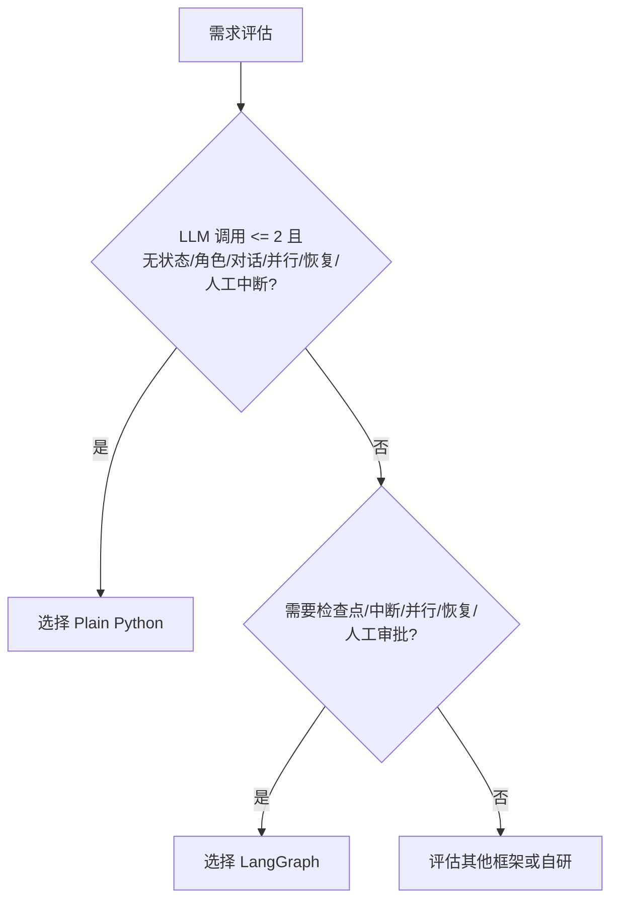
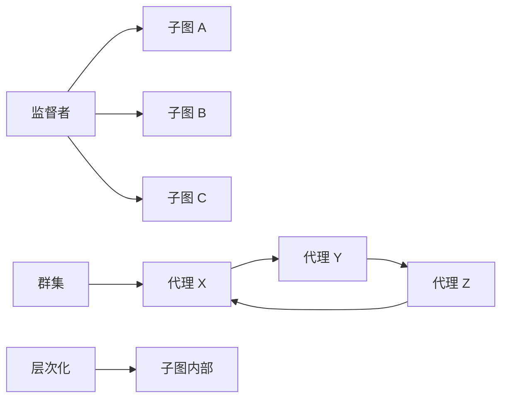
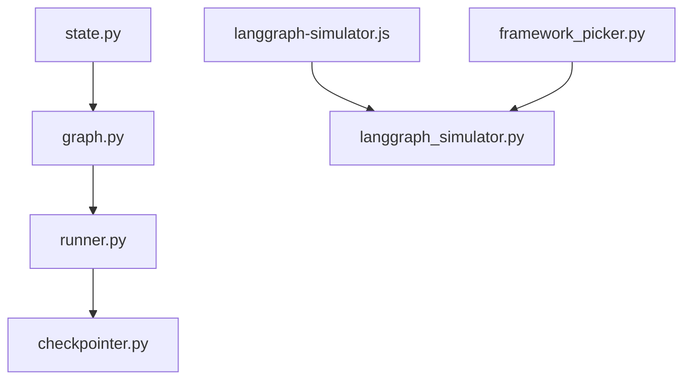

# 智能体框架与状态机

<cite>
**本文引用的文件**   
- [graph.py](file://phases/14-agent-engineering/13-langgraph-stateful-graphs/outputs/skill-demo/graph.py)
- [state.py](file://phases/14-agent-engineering/13-langgraph-stateful-graphs/outputs/skill-demo/state.py)
- [runner.py](file://phases/14-agent-engineering/13-langgraph-stateful-graphs/outputs/skill-demo/runner.py)
- [checkpointer.py](file://phases/14-agent-engineering/13-langgraph-stateful-graphs/outputs/skill-demo/checkpointer.py)
- [langgraph_simulator.py](file://guardrails-sandbox/backend/playground/modules/langgraph_simulator.py)
- [framework_picker.py](file://guardrails-sandbox/backend/playground/modules/framework_picker.py)
- [langgraph-simulator.js](file://site/vue-app/summary/src/data/modules/langgraph-simulator.js)
- [quiz.zh.json](file://phases/14-agent-engineering/13-langgraph-stateful-graphs/quiz.zh.json)
</cite>

## 目录
1. [简介](#简介)
2. [项目结构](#项目结构)
3. [核心组件](#核心组件)
4. [架构总览](#架构总览)
5. [详细组件分析](#详细组件分析)
6. [依赖分析](#依赖分析)
7. [性能考量](#性能考量)
8. [故障排查指南](#故障排查指南)
9. [结论](#结论)
10. [附录](#附录)

## 简介
本文件面向智能体系统的设计与实现，围绕“LangGraph 等智能体框架”与“状态机模式”的结合进行系统化技术阐述。重点涵盖：
- 状态管理：TypedDict 类型化状态、reducer 合并策略、不可变性与可追踪性
- 消息传递：消息列表的附加与合并、工具调用与人工审批的协作
- 并发控制：检查点持久化、中断与恢复、流式输出与历史回放
- 状态机模式：节点、边、入口/出口、条件路由与拓扑组合
- 框架对比：Plain Python、LangGraph 的适用场景与权衡
- 复杂系统扩展：监督者、群集、层次化子图等多智能体编排

## 项目结构
本仓库中与智能体框架和状态机直接相关的内容主要分布在以下位置：
- 教学与演示代码：phases/14-agent-engineering/13-langgraph-stateful-graphs/outputs/skill-demo
- 在线模拟器与前端可视化：site/vue-app/summary/src/data/modules/langgraph-simulator.js
- 后端模拟器与框架推荐模块：guardrails-sandbox/backend/playground/modules
- 课程测验与知识巩固：phases/14-agent-engineering/13-langgraph-stateful-graphs/quiz.zh.json

**图表来源**
- [graph.py:1-302](file://phases/14-agent-engineering/13-langgraph-stateful-graphs/outputs/skill-demo/graph.py#L1-L302)
- [state.py:1-93](file://phases/14-agent-engineering/13-langgraph-stateful-graphs/outputs/skill-demo/state.py#L1-L93)
- [runner.py:1-203](file://phases/14-agent-engineering/13-langgraph-stateful-graphs/outputs/skill-demo/runner.py#L1-L203)
- [checkpointer.py:1-153](file://phases/14-agent-engineering/13-langgraph-stateful-graphs/outputs/skill-demo/checkpointer.py#L1-L153)
- [langgraph-simulator.js:1-58](file://site/vue-app/summary/src/data/modules/langgraph-simulator.js#L1-L58)
- [langgraph_simulator.py:1-119](file://guardrails-sandbox/backend/playground/modules/langgraph_simulator.py#L1-L119)
- [framework_picker.py:28-51](file://guardrails-sandbox/backend/playground/modules/framework_picker.py#L28-L51)
- [quiz.zh.json:1-40](file://phases/14-agent-engineering/13-langgraph-stateful-graphs/quiz.zh.json#L1-L40)

**章节来源**
- [graph.py:1-302](file://phases/14-agent-engineering/13-langgraph-stateful-graphs/outputs/skill-demo/graph.py#L1-L302)
- [state.py:1-93](file://phases/14-agent-engineering/13-langgraph-stateful-graphs/outputs/skill-demo/state.py#L1-L93)
- [runner.py:1-203](file://phases/14-agent-engineering/13-langgraph-stateful-graphs/outputs/skill-demo/runner.py#L1-L203)
- [checkpointer.py:1-153](file://phases/14-agent-engineering/13-langgraph-stateful-graphs/outputs/skill-demo/checkpointer.py#L1-L153)
- [langgraph-simulator.js:1-58](file://site/vue-app/summary/src/data/modules/langgraph-simulator.js#L1-L58)
- [langgraph_simulator.py:1-119](file://guardrails-sandbox/backend/playground/modules/langgraph_simulator.py#L1-L119)
- [framework_picker.py:28-51](file://guardrails-sandbox/backend/playground/modules/framework_picker.py#L28-L51)
- [quiz.zh.json:1-40](file://phases/14-agent-engineering/13-langgraph-stateful-graphs/quiz.zh.json#L1-L40)

## 核心组件
- 状态模型（State/Update）：以 TypedDict 描述可追踪的状态字段，节点返回 Update 进行增量合并，确保历史消息不被覆盖
- 状态图（StateGraph）：声明式地注册节点、固定边与条件边，支持入口设置与三种常见拓扑（监督者、群集、层次化）
- 执行引擎（Runner）：驱动状态图迭代执行，自动保存检查点，捕获暂停异常并支持恢复
- 检查点后端（Checkpointer）：抽象接口与 SQLite/内存实现，保证状态完整序列化与历史可追溯
- 在线模拟器（LangGraph Simulator）：前端/后端双端 ReAct 拓扑模拟，展示检查点序列与中断流程
- 框架推荐（Framework Picker）：基于需求维度给出 Plain Python/LangGraph 的选型建议

**章节来源**
- [state.py:15-54](file://phases/14-agent-engineering/13-langgraph-stateful-graphs/outputs/skill-demo/state.py#L15-L54)
- [graph.py:17-64](file://phases/14-agent-engineering/13-langgraph-stateful-graphs/outputs/skill-demo/graph.py#L17-L64)
- [runner.py:20-74](file://phases/14-agent-engineering/13-langgraph-stateful-graphs/outputs/skill-demo/runner.py#L20-L74)
- [checkpointer.py:20-41](file://phases/14-agent-engineering/13-langgraph-stateful-graphs/outputs/skill-demo/checkpointer.py#L20-L41)
- [langgraph_simulator.py:27-118](file://guardrails-sandbox/backend/playground/modules/langgraph_simulator.py#L27-L118)
- [framework_picker.py:28-51](file://guardrails-sandbox/backend/playground/modules/framework_picker.py#L28-L51)

## 架构总览
下图展示了从“任务描述”到“状态图执行”的端到端流程，以及关键的检查点与中断机制。

**图表来源**
- [langgraph-simulator.js:14-58](file://site/vue-app/summary/src/data/modules/langgraph-simulator.js#L14-L58)
- [langgraph_simulator.py:43-118](file://guardrails-sandbox/backend/playground/modules/langgraph_simulator.py#L43-L118)
- [runner.py:77-122](file://phases/14-agent-engineering/13-langgraph-stateful-graphs/outputs/skill-demo/runner.py#L77-L122)
- [checkpointer.py:77-116](file://phases/14-agent-engineering/13-langgraph-stateful-graphs/outputs/skill-demo/checkpointer.py#L77-L116)
- [graph.py:224-247](file://phases/14-agent-engineering/13-langgraph-stateful-graphs/outputs/skill-demo/graph.py#L224-L247)

## 详细组件分析

### 状态模型与消息合并
- TypedDict 状态：明确字段类型与职责边界，便于静态校验与 IDE 支持
- Update 增量更新：节点仅返回需要变更的字段，避免覆盖历史
- 消息合并策略：通过 reducer（如 add_messages）实现“追加”而非“覆盖”，保障消息链路完整性

**图表来源**
- [state.py:15-54](file://phases/14-agent-engineering/13-langgraph-stateful-graphs/outputs/skill-demo/state.py#L15-L54)
- [runner.py:51-61](file://phases/14-agent-engineering/13-langgraph-stateful-graphs/outputs/skill-demo/runner.py#L51-L61)

**章节来源**
- [state.py:15-54](file://phases/14-agent-engineering/13-langgraph-stateful-graphs/outputs/skill-demo/state.py#L15-L54)

### 状态图与拓扑
- 节点注册：add_node(name, fn)，名称需唯一且不能使用保留哨兵
- 边注册：固定边 add_edge(src, dst)、条件边 add_conditional_edges(router, path_map)
- 入口设置：set_entry 指定 START → 实际入口
- 三种拓扑：
  - 监督者：中央路由器分发到子图
  - 群集：代理间通过交接路由器轮转
  - 层次化：嵌套子图，复用入口/出口

**图表来源**
- [graph.py:214-247](file://phases/14-agent-engineering/13-langgraph-stateful-graphs/outputs/skill-demo/graph.py#L214-L247)

**章节来源**
- [graph.py:17-64](file://phases/14-agent-engineering/13-langgraph-stateful-graphs/outputs/skill-demo/graph.py#L17-L64)
- [graph.py:254-302](file://phases/14-agent-engineering/13-langgraph-stateful-graphs/outputs/skill-demo/graph.py#L254-L302)

### 执行引擎与检查点
- 核心循环：从入口节点开始，执行节点函数、合并状态、保存检查点、决定下一节点
- 暂停机制：节点抛出 PausedAtNode 异常，保存当前状态并返回 paused
- 恢复流程：resume 读取最新检查点，可注入 state_override（如人工审批），从暂停节点继续

**图表来源**
- [runner.py:36-74](file://phases/14-agent-engineering/13-langgraph-stateful-graphs/outputs/skill-demo/runner.py#L36-L74)
- [checkpointer.py:77-116](file://phases/14-agent-engineering/13-langgraph-stateful-graphs/outputs/skill-demo/checkpointer.py#L77-L116)

**章节来源**
- [runner.py:20-122](file://phases/14-agent-engineering/13-langgraph-stateful-graphs/outputs/skill-demo/runner.py#L20-L122)
- [checkpointer.py:20-116](file://phases/14-agent-engineering/13-langgraph-stateful-graphs/outputs/skill-demo/checkpointer.py#L20-L116)

### 在线模拟器与前端可视化
- 前端模拟器：根据任务描述识别工具/分支信号，输出“Agent 形状度”评分、四节点 ReAct 拓扑、检查点序列与四大超能力提示
- 后端模块：与前端交互，解析输入并生成模块化输出块（评分、键值、表格、列表）

**图表来源**
- [langgraph-simulator.js:14-58](file://site/vue-app/summary/src/data/modules/langgraph-simulator.js#L14-L58)
- [langgraph_simulator.py:43-118](file://guardrails-sandbox/backend/playground/modules/langgraph_simulator.py#L43-L118)

**章节来源**
- [langgraph-simulator.js:1-58](file://site/vue-app/summary/src/data/modules/langgraph-simulator.js#L1-L58)
- [langgraph_simulator.py:27-118](file://guardrails-sandbox/backend/playground/modules/langgraph_simulator.py#L27-L118)

### 框架对比与选型建议
- Plain Python：LLM 调用 ≤ 2 次且无状态/角色/对话/并行/恢复/人工中断需求时，无需引入框架
- LangGraph：需要类型化状态、检查点、中断、Send 扇出（并行）、时光回溯等能力时优先选择

**图表来源**
- [framework_picker.py:28-51](file://guardrails-sandbox/backend/playground/modules/framework_picker.py#L28-L51)

**章节来源**
- [framework_picker.py:28-51](file://guardrails-sandbox/backend/playground/modules/framework_picker.py#L28-L51)

### 复杂系统扩展与多智能体编排
- 监督者模式：中央路由器将任务分发给多个专家子图，适合“经理协调团队”
- 群集模式：多个对等代理通过交接路由器轮转，适合协商与资源共享
- 层次化模式：嵌套子图，复用入口/出口，适合复杂流程的模块化组织

**图表来源**
- [graph.py:254-302](file://phases/14-agent-engineering/13-langgraph-stateful-graphs/outputs/skill-demo/graph.py#L254-L302)

**章节来源**
- [graph.py:254-302](file://phases/14-agent-engineering/13-langgraph-stateful-graphs/outputs/skill-demo/graph.py#L254-L302)

## 依赖分析
- 组件内聚与耦合
  - StateGraph 与 Runner 解耦：图负责声明，执行由 Runner 负责，便于替换执行策略
  - Runner 依赖 Checkpointer 接口：通过抽象隔离存储细节，支持 SQLite/内存实现切换
  - 模拟器与执行引擎分离：前后端各司其职，便于独立演进与测试
- 外部依赖
  - 本教学实现仅使用 Python 标准库，不依赖 langgraph/langchain 等外部库，强调“从零实现”的学习目标

**图表来源**
- [state.py:1-93](file://phases/14-agent-engineering/13-langgraph-stateful-graphs/outputs/skill-demo/state.py#L1-L93)
- [graph.py:1-302](file://phases/14-agent-engineering/13-langgraph-stateful-graphs/outputs/skill-demo/graph.py#L1-L302)
- [runner.py:1-203](file://phases/14-agent-engineering/13-langgraph-stateful-graphs/outputs/skill-demo/runner.py#L1-L203)
- [checkpointer.py:1-153](file://phases/14-agent-engineering/13-langgraph-stateful-graphs/outputs/skill-demo/checkpointer.py#L1-L153)
- [langgraph-simulator.js:1-58](file://site/vue-app/summary/src/data/modules/langgraph-simulator.js#L1-L58)
- [langgraph_simulator.py:1-119](file://guardrails-sandbox/backend/playground/modules/langgraph_simulator.py#L1-L119)
- [framework_picker.py:28-51](file://guardrails-sandbox/backend/playground/modules/framework_picker.py#L28-L51)

**章节来源**
- [runner.py:11-13](file://phases/14-agent-engineering/13-langgraph-stateful-graphs/outputs/skill-demo/runner.py#L11-L13)

## 性能考量
- 检查点频率与成本：每次节点转换保存检查点，有助于快速恢复但增加 IO 成本；可按场景调整保存策略
- 序列化开销：状态完整序列化为 JSON，建议在生产环境使用高性能存储（如 SQLite WAL 模式）
- 并行与扇出：Send 扇出可提升吞吐，但需注意状态一致性与资源竞争
- 前端模拟器：纯前端运行，避免网络延迟，适合教学演示与快速验证

## 故障排查指南
- 消息覆盖问题：若未使用 reducer，新消息会覆盖旧历史；务必为消息字段配置合并策略
- 未设置入口：调用 run 前需 set_entry，否则抛出运行时错误
- 暂停恢复：resume 时若无检查点记录会报错；确认 session_id 正确且已保存检查点
- 恢复注入：state_override 仅在 resume 时生效，用于人工干预（如审批开关）

**章节来源**
- [runner.py:90-96](file://phases/14-agent-engineering/13-langgraph-stateful-graphs/outputs/skill-demo/runner.py#L90-L96)
- [runner.py:110-113](file://phases/14-agent-engineering/13-langgraph-stateful-graphs/outputs/skill-demo/runner.py#L110-L113)
- [langgraph_simulator.py:107-110](file://guardrails-sandbox/backend/playground/modules/langgraph_simulator.py#L107-L110)

## 结论
本教学体系以“从零实现”为核心，将智能体框架（LangGraph）与状态机模式深度融合：
- 通过 TypedDict 与 reducer 实现可追踪、可恢复的状态管理
- 通过 StateGraph 的节点/边/路由表达复杂流程，并以 Runner 提供稳定的执行与检查点机制
- 通过在线模拟器与框架推荐模块，帮助开发者在不同阶段做出合适的技术选型
- 面向复杂系统，提供监督者、群集、层次化等拓扑扩展，支撑多智能体协同与流水线编排

## 附录
- 知识巩固：课程测验覆盖“有状态图”“持久化执行”“拓扑类型”等关键概念
- 开发指南要点
  - 明确 Agent 形状：多步骤、工具调用、条件分支 → 适合用状态图建模
  - 使用 reducer：messages 必须配置合并策略，避免覆盖
  - 合理设置入口与条件路由：确保图的可执行性与可维护性
  - 利用检查点与中断：在长流程中提供可控的暂停与恢复能力
  - 选型建议：根据 LLM 调用次数与功能需求决定是否采用 LangGraph

**章节来源**
- [quiz.zh.json:1-40](file://phases/14-agent-engineering/13-langgraph-stateful-graphs/quiz.zh.json#L1-L40)