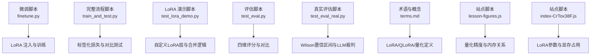
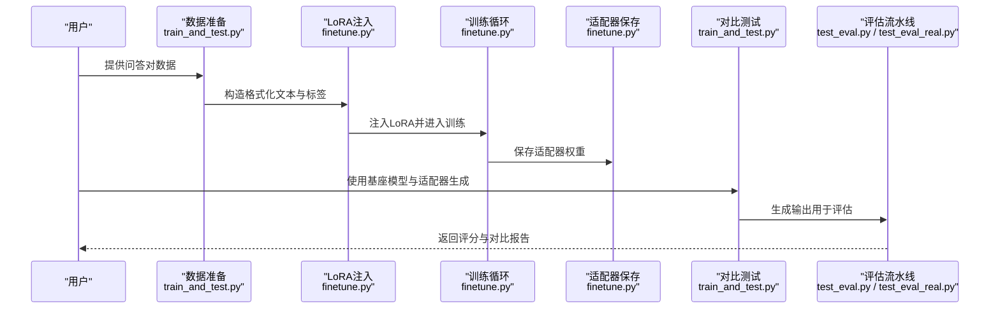
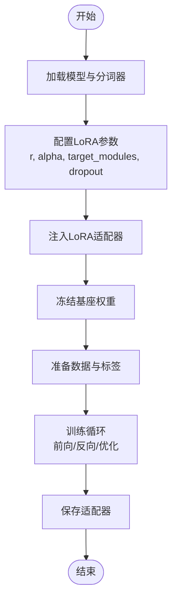
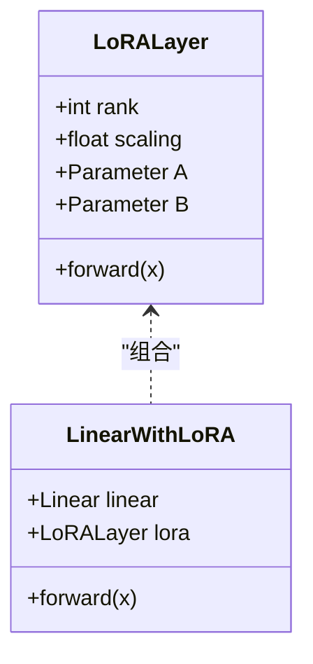
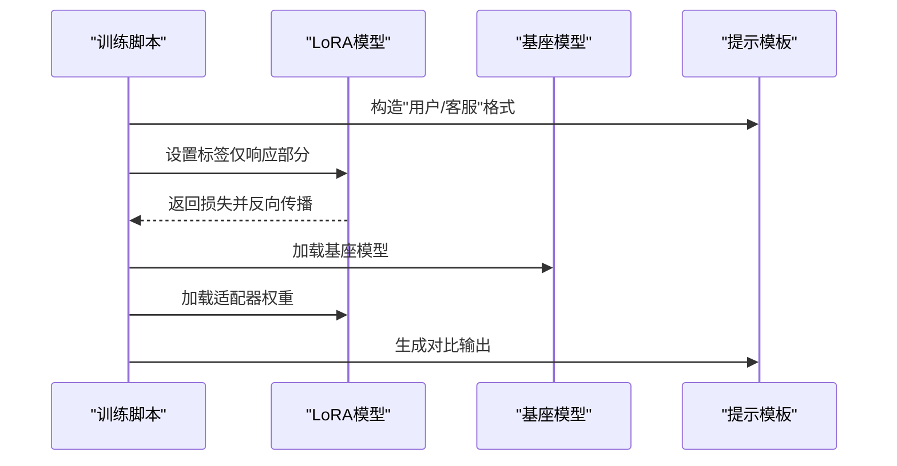
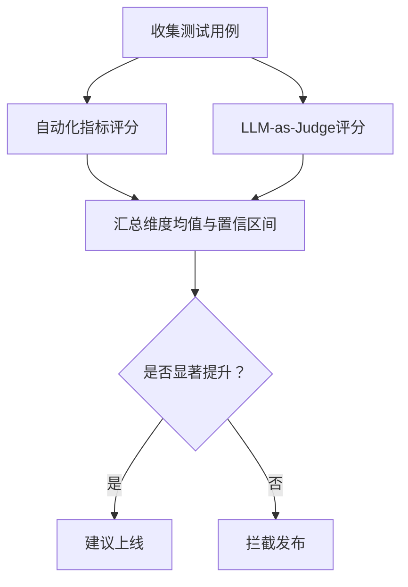
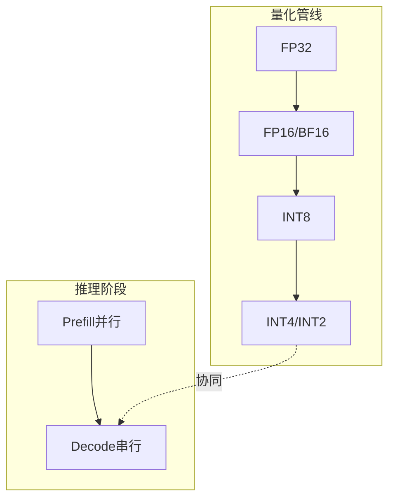
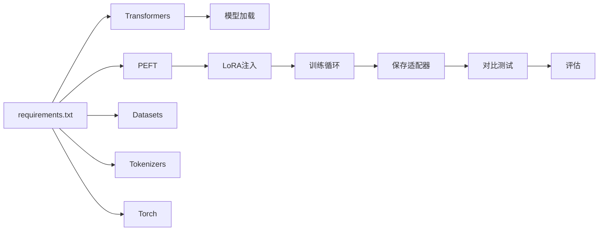

# 模型微调与优化

<cite>
**本文引用的文件**
- [finetune.py](file://finetune.py)
- [train_and_test.py](file://train_and_test.py)
- [test_lora_demo.py](file://test_lora_demo.py)
- [requirements.txt](file://requirements.txt)
- [terms.md](file://glossary/terms.md)
- [test_eval.py](file://test_eval.py)
- [test_eval_real.py](file://test_eval_real.py)
- [index-CrTox38F.js](file://site/summary/assets/index-CrTox38F.js)
- [data.js](file://site/data.js)
- [lesson-figures.js](file://site/lesson-figures.js)
- [content.js](file://site/vue-app/summary/src/data/content.js)
- [debug_tools.py](file://phases/00-setup-and-tooling/12-debugging-and-profiling/code/debug_tools.py)
</cite>

## 目录
1. [引言](#引言)
2. [项目结构](#项目结构)
3. [核心组件](#核心组件)
4. [架构总览](#架构总览)
5. [详细组件分析](#详细组件分析)
6. [依赖关系分析](#依赖关系分析)
7. [性能考量](#性能考量)
8. [故障排查指南](#故障排查指南)
9. [结论](#结论)
10. [附录](#附录)

## 引言
本技术文档聚焦于模型微调与优化，系统讲解LoRA（低秩适应）与QLoRA（量化LoRA）等高效微调方法的原理与实现，并结合仓库中的脚本与评估工具，给出从数据准备、训练配置、参数调整到效果评估与推理优化的完整实践路径。文档同时对比全参数微调与高效微调的成本与收益，帮助开发者在资源约束与质量目标之间做出合理选择。

## 项目结构
围绕微调与优化的关键文件组织如下：
- 微调脚本：提供LoRA注入、数据准备、训练循环与适配器保存的最小可用流程
- 教程演示：以字符级语言模型直观展示LoRA注入、训练与合并过程
- 评估工具：提供自动化指标与LLM-as-Judge的评估框架
- 术语与概念：解释LoRA、QLoRA、量化等关键概念
- 推理与量化：站点脚本中包含量化与推理优化相关内容

图示来源
- [finetune.py](file://finetune.py)
- [train_and_test.py](file://train_and_test.py)
- [test_lora_demo.py](file://test_lora_demo.py)
- [test_eval.py](file://test_eval.py)
- [test_eval_real.py](file://test_eval_real.py)
- [terms.md](file://glossary/terms.md)
- [lesson-figures.js](file://site/lesson-figures.js)
- [index-CrTox38F.js](file://site/summary/assets/index-CrTox38F.js)

章节来源
- [finetune.py](file://finetune.py)
- [train_and_test.py](file://train_and_test.py)
- [test_lora_demo.py](file://test_lora_demo.py)
- [test_eval.py](file://test_eval.py)
- [test_eval_real.py](file://test_eval_real.py)
- [terms.md](file://glossary/terms.md)
- [lesson-figures.js](file://site/lesson-figures.js)
- [index-CrTox38F.js](file://site/summary/assets/index-CrTox38F.js)

## 核心组件
- LoRA适配器注入与训练：通过peft库配置LoRA参数并在指定模块插入低秩更新，显著降低可训练参数规模
- 自定义LoRA实现：以字符级语言模型为例，手动实现LoRA层与合并逻辑，便于理解与定制
- 数据准备与标签化损失：构造“用户/客服”格式文本，仅对“客服”后的token计算损失，避免前缀干扰
- 评估流水线：提供自动化指标与LLM-as-Judge两种评估方式，支持分维度对比与统计显著性检验
- 量化与推理优化：涵盖精度-存储权衡、推理阶段预填充与解码阶段的性能特征

章节来源
- [finetune.py](file://finetune.py)
- [train_and_test.py](file://train_and_test.py)
- [test_lora_demo.py](file://test_lora_demo.py)
- [test_eval.py](file://test_eval.py)
- [test_eval_real.py](file://test_eval_real.py)
- [terms.md](file://glossary/terms.md)
- [lesson-figures.js](file://site/lesson-figures.js)
- [index-CrTox38F.js](file://site/summary/assets/index-CrTox38F.js)

## 架构总览
以下序列图展示了从数据到训练再到评估的整体流程，体现LoRA高效微调在端到端流水线中的位置与作用。

图示来源
- [train_and_test.py](file://train_and_test.py)
- [finetune.py](file://finetune.py)
- [test_eval.py](file://test_eval.py)
- [test_eval_real.py](file://test_eval_real.py)

## 详细组件分析

### LoRA高效微调实现
- LoRA配置要点：秩r、缩放系数alpha、目标模块target_modules、dropout
- 参数规模控制：仅训练低秩矩阵A、B，其余权重冻结，大幅减少可训练参数
- 训练稳定性：通过标签化损失仅对响应部分计算梯度，避免前缀污染

图示来源
- [finetune.py](file://finetune.py)
- [train_and_test.py](file://train_and_test.py)

章节来源
- [finetune.py](file://finetune.py)
- [train_and_test.py](file://train_and_test.py)

### 自定义LoRA组件与合并
- LoRA层实现：以低秩分解形式构造增量更新，叠加到原始线性层
- 注入策略：定位目标子模块（如注意力投影层），替换为带LoRA的包装层
- 合并机制：训练结束后将LoRA增量合并回原权重，得到完整模型

图示来源
- [test_lora_demo.py](file://test_lora_demo.py)

章节来源
- [test_lora_demo.py](file://test_lora_demo.py)

### 标签化损失与对比测试
- 标签策略：仅对“客服：”之后的token计算交叉熵，忽略“用户：...”前缀
- 对比测试：在同一提示下比较基座模型与加载适配器后的生成结果

图示来源
- [train_and_test.py](file://train_and_test.py)

章节来源
- [train_and_test.py](file://train_and_test.py)

### 评估流水线与统计显著性
- 自动化指标：适用于有标准答案的任务（如摘要、翻译）
- LLM-as-Judge：面向开放问答的四维评分（相关性、准确性、有用性、安全性）
- 统计检验：使用Wilson置信区间判断改进是否显著

图示来源
- [test_eval.py](file://test_eval.py)
- [test_eval_real.py](file://test_eval_real.py)
- [content.js](file://site/vue-app/summary/src/data/content.js)

章节来源
- [test_eval.py](file://test_eval.py)
- [test_eval_real.py](file://test_eval_real.py)
- [content.js](file://site/vue-app/summary/src/data/content.js)

### 量化与推理优化
- 量化精度与存储：从FP32到INT4的位宽变化带来内存与吞吐的权衡
- 推理阶段特征：预填充阶段并行、解码阶段串行，优化需区分场景
- LoRA与量化协同：QLoRA在冻结基座权重的同时训练低秩增量，进一步降低显存占用

图示来源
- [lesson-figures.js](file://site/lesson-figures.js)
- [data.js](file://site/data.js)
- [index-CrTox38F.js](file://site/summary/assets/index-CrTox38F.js)

章节来源
- [lesson-figures.js](file://site/lesson-figures.js)
- [data.js](file://site/data.js)
- [index-CrTox38F.js](file://site/summary/assets/index-CrTox38F.js)

## 依赖关系分析
- 运行环境依赖：PyTorch、Transformers、PEFT、Datasets、Tokenizers等
- 关键依赖链：模型加载与分词器 → LoRA配置与注入 → 训练循环 → 适配器保存 → 对比测试 → 评估

图示来源
- [requirements.txt](file://requirements.txt)
- [finetune.py](file://finetune.py)
- [train_and_test.py](file://train_and_test.py)

章节来源
- [requirements.txt](file://requirements.txt)
- [finetune.py](file://finetune.py)
- [train_and_test.py](file://train_and_test.py)

## 性能考量
- 显存与参数规模：LoRA将可训练参数从数亿降至数万量级，显著降低显存占用
- 训练效率：冻结大部分权重，训练收敛更快、更稳定
- 推理成本：LoRA适配器体积小，易于部署；QLoRA在冻结基座权重基础上进一步节省显存
- 评估开销：自动化指标快速但缺乏语义深度；LLM-as-Judge更贴近真实需求，但成本更高

## 故障排查指南
- 设备与张量一致性：确保模型与输入张量在同一设备上，避免设备不匹配导致的错误
- 梯度异常检测：监控loss与梯度是否出现NaN/Inf，及时定位数值不稳定源
- 形状与维度：训练前使用调试工具检查batch形状与模块输出维度，保证前向通路无错
- 学习率与损失曲线：观察loss下降趋势，必要时调整学习率或增加正则

章节来源
- [debug_tools.py](file://phases/00-setup-and-tooling/12-debugging-and-profiling/code/debug_tools.py)

## 结论
本仓库提供了从LoRA高效微调到评估与量化的完整实践路径。通过仅训练低秩增量，LoRA在保持高质量的同时大幅降低训练与部署成本；QLoRA进一步冻结基座权重，使更大模型也能在有限资源下高效训练与推理。结合标签化损失与系统化评估，开发者可以在可控成本下持续迭代模型质量。

## 附录
- 最佳实践清单
  - 优先采用LoRA进行高效微调，针对注意力投影层设置target_modules
  - 使用标签化损失仅对响应部分计算梯度，避免前缀污染
  - 评估采用LLM-as-Judge并辅以Wilson置信区间，确保改进具有统计意义
  - 在资源受限时考虑QLoRA，结合量化进一步降低显存占用
  - 使用调试工具定期检查设备一致性、梯度状态与张量形状