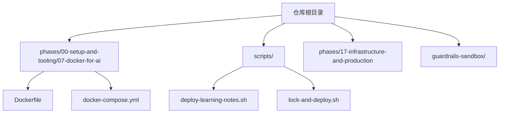
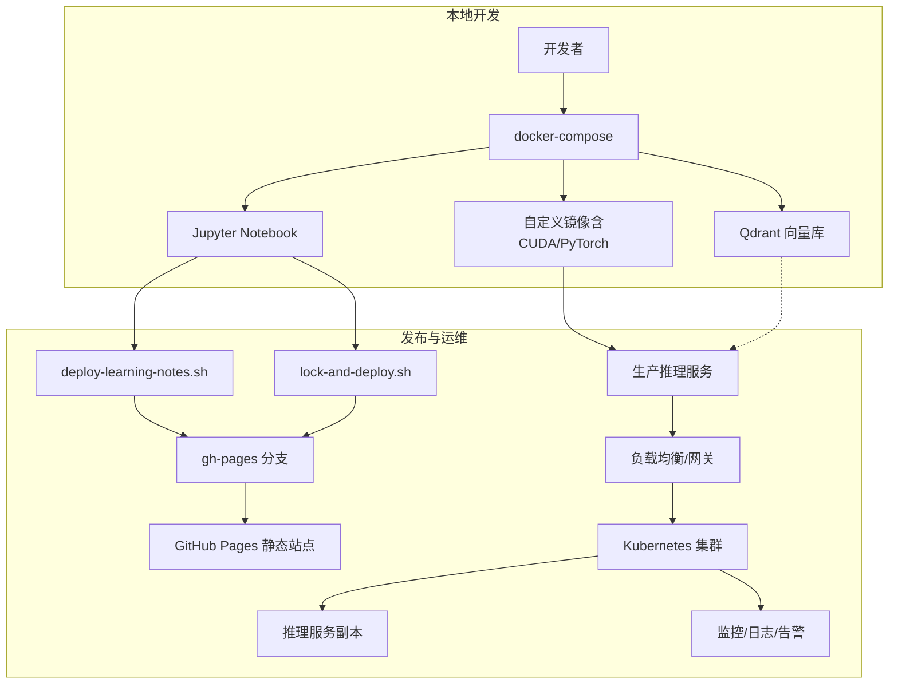
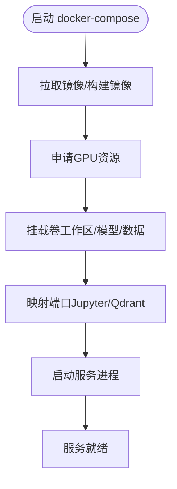
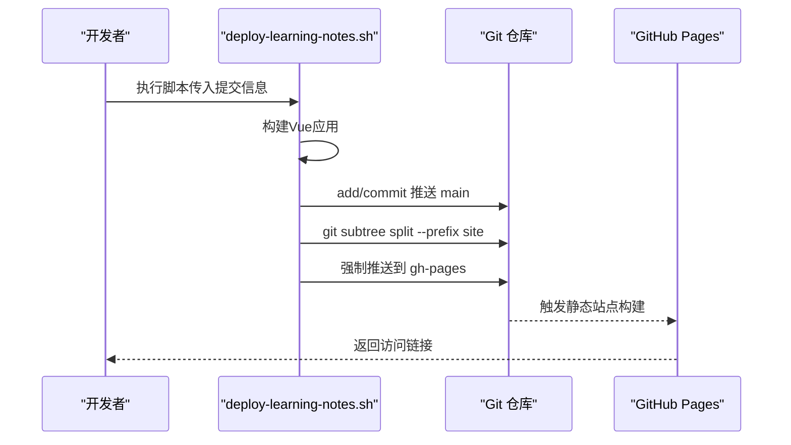
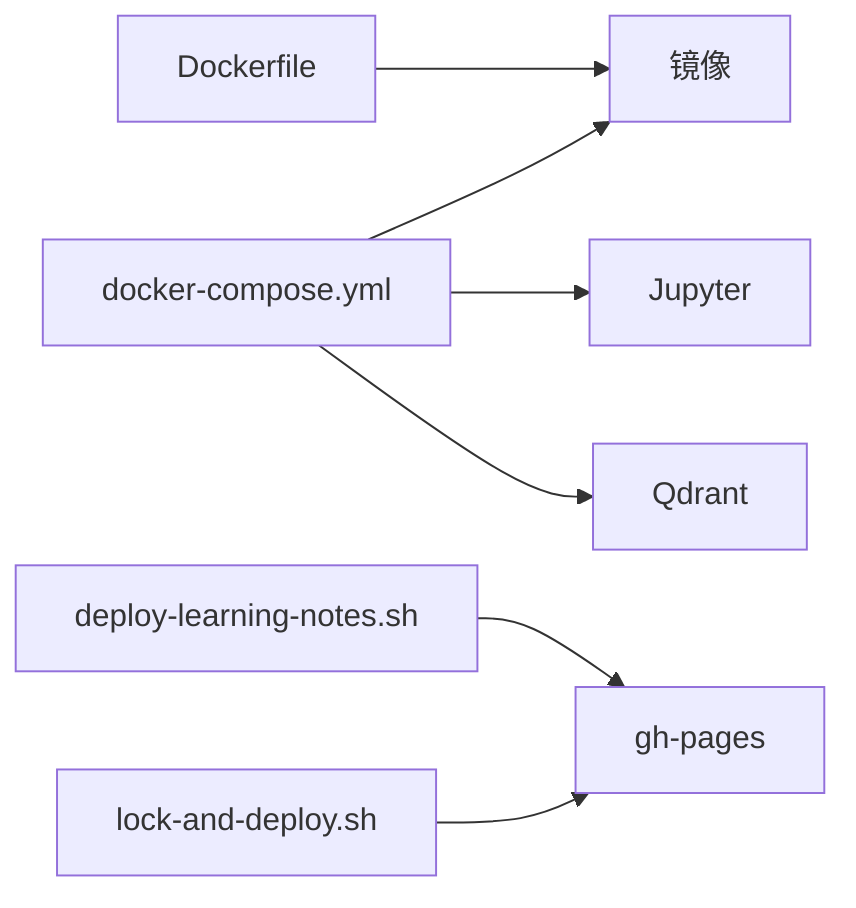

# 生产部署与运维

<cite>
**本文引用的文件**
- [README.md](file://README.md)
- [Dockerfile](file://phases/00-setup-and-tooling/07-docker-for-ai/code/Dockerfile)
- [docker-compose.yml](file://phases/00-setup-and-tooling/07-docker-for-ai/code/docker-compose.yml)
- [deploy-learning-notes.sh](file://scripts/deploy-learning-notes.sh)
- [lock-and-deploy.sh](file://scripts/lock-and-deploy.sh)
- [run.sh](file://guardrails-sandbox/run.sh)
</cite>

## 目录
1. [简介](#简介)
2. [项目结构](#项目结构)
3. [核心组件](#核心组件)
4. [架构总览](#架构总览)
5. [详细组件分析](#详细组件分析)
6. [依赖关系分析](#依赖关系分析)
7. [性能考虑](#性能考虑)
8. [故障排查指南](#故障排查指南)
9. [结论](#结论)
10. [附录](#附录)

## 简介
本技术文档面向LLM应用在生产环境中的部署与运维，结合仓库中已有的容器化与自动化部署脚本，系统阐述从服务部署、负载均衡、故障转移，到容器化、Kubernetes编排、自动化运维、性能监控、日志管理、告警通知、版本管理、灰度发布与回滚、CI/CD流水线与生产最佳实践的完整方案。文档以仓库现有实现为基础，辅以概念性架构图与流程图，帮助读者快速落地。

## 项目结构
仓库采用“阶段化课程”组织方式，生产部署与运维相关内容主要分布在以下位置：
- 容器化与本地开发：phases/00-setup-and-tooling/07-docker-for-ai
- 自动化部署脚本：scripts/
- 生产基础设施与运维主题：phases/17-infrastructure-and-production
- 安全与沙箱示例：guardrails-sandbox/

图表来源
- [Dockerfile:1-44](file://phases/00-setup-and-tooling/07-docker-for-ai/code/Dockerfile#L1-L44)
- [docker-compose.yml:1-33](file://phases/00-setup-and-tooling/07-docker-for-ai/code/docker-compose.yml#L1-L33)
- [deploy-learning-notes.sh:1-47](file://scripts/deploy-learning-notes.sh#L1-L47)
- [lock-and-deploy.sh:1-96](file://scripts/lock-and-deploy.sh#L1-L96)

章节来源
- [README.md:240-820](file://README.md#L240-L820)

## 核心组件
- 容器镜像与运行时
  - CUDA 12.4.1 + Ubuntu 22.04 基础镜像，预装 Python 3.12、PyTorch 2.3.1（CUDA 12.4）、常用科学计算与AI生态依赖，暴露Jupyter端口，挂载工作区与模型/数据卷。
- 开发与测试编排
  - docker-compose 提供本地Jupyter Notebook服务与向量数据库（Qdrant）服务，支持GPU直通与持久化存储。
- 自动化部署
  - deploy-learning-notes.sh：构建Vue应用、提交并推送主分支、将site子树推送到gh-pages分支，作为静态站点发布。
  - lock-and-deploy.sh：锁定历史学习内容、同步至site、临时切换到gh-pages分支进行部署，并在完成后恢复工作区状态。
- 安全与沙箱
  - guardrails-sandbox/run.sh：演示安全规则执行入口，便于在生产侧集成安全前置检查。

章节来源
- [Dockerfile:1-44](file://phases/00-setup-and-tooling/07-docker-for-ai/code/Dockerfile#L1-L44)
- [docker-compose.yml:1-33](file://phases/00-setup-and-tooling/07-docker-for-ai/code/docker-compose.yml#L1-L33)
- [deploy-learning-notes.sh:1-47](file://scripts/deploy-learning-notes.sh#L1-L47)
- [lock-and-deploy.sh:1-96](file://scripts/lock-and-deploy.sh#L1-L96)
- [run.sh](file://guardrails-sandbox/run.sh)

## 架构总览
下图展示从本地开发到生产发布的整体路径，涵盖容器化、编排、静态站点发布与安全前置检查。

图表来源
- [docker-compose.yml:1-33](file://phases/00-setup-and-tooling/07-docker-for-ai/code/docker-compose.yml#L1-L33)
- [Dockerfile:1-44](file://phases/00-setup-and-tooling/07-docker-for-ai/code/Dockerfile#L1-L44)
- [deploy-learning-notes.sh:1-47](file://scripts/deploy-learning-notes.sh#L1-L47)
- [lock-and-deploy.sh:1-96](file://scripts/lock-and-deploy.sh#L1-L96)

## 详细组件分析

### 组件A：容器化与本地开发（Dockerfile 与 docker-compose）
- 设计要点
  - 基于CUDA官方镜像，确保GPU加速能力；安装Python 3.12与PyTorch CUDA 12.4，满足LLM训练/推理需求。
  - 暴露Jupyter端口并映射宿主机目录，便于在容器内直接运行Notebook。
  - 使用NVIDIA设备直通，支持多GPU资源调度。
- 数据流与处理逻辑
  - docker-compose 启动时，按服务顺序拉起Jupyter与Qdrant；Jupyter通过命令行参数绑定到0.0.0.0，允许外部访问。
  - 卷挂载将工作区、模型与数据持久化，避免容器重建导致数据丢失。
- 优化建议
  - 将依赖安装拆分为多阶段构建，减少镜像体积。
  - 在生产环境使用只读根文件系统与最小权限用户运行容器。
  - 为Jupyter启用认证或通过反向代理限制访问范围。

图表来源
- [docker-compose.yml:1-33](file://phases/00-setup-and-tooling/07-docker-for-ai/code/docker-compose.yml#L1-L33)
- [Dockerfile:1-44](file://phases/00-setup-and-tooling/07-docker-for-ai/code/Dockerfile#L1-L44)

章节来源
- [Dockerfile:1-44](file://phases/00-setup-and-tooling/07-docker-for-ai/code/Dockerfile#L1-L44)
- [docker-compose.yml:1-33](file://phases/00-setup-and-tooling/07-docker-for-ai/code/docker-compose.yml#L1-L33)

### 组件B：自动化部署脚本（静态站点发布）
- 设计要点
  - deploy-learning-notes.sh：构建Vue应用 → 提交并推送主分支 → 使用git subtree将site目录推送到gh-pages，作为GitHub Pages发布源。
  - lock-and-deploy.sh：锁定历史学习内容、同步到site、临时切换到gh-pages分支进行部署，并在完成后恢复工作区状态。
- 流程与时序

图表来源
- [deploy-learning-notes.sh:1-47](file://scripts/deploy-learning-notes.sh#L1-L47)

章节来源
- [deploy-learning-notes.sh:1-47](file://scripts/deploy-learning-notes.sh#L1-L47)
- [lock-and-deploy.sh:1-96](file://scripts/lock-and-deploy.sh#L1-L96)

### 组件C：安全与沙箱（guardrails-sandbox）
- 设计要点
  - run.sh 作为安全前置检查的入口示例，可在生产侧集成输入/输出清洗、合规校验与速率限制等能力。
- 集成建议
  - 将沙箱规则与网关/路由层结合，在请求进入LLM推理前统一执行安全校验。
  - 结合日志与可观测性平台，记录违规事件并触发告警。

章节来源
- [run.sh](file://guardrails-sandbox/run.sh)

## 依赖关系分析
- 组件耦合
  - docker-compose 依赖 Dockerfile 构建的镜像；镜像内包含PyTorch与CUDA，直接影响推理性能与兼容性。
  - 部署脚本依赖Git工作流与远程仓库；静态站点发布依赖gh-pages作为发布源。
- 外部依赖
  - NVIDIA GPU驱动与容器运行时（如containerd/docker）。
  - GitHub Pages（静态站点托管）。
- 潜在风险
  - 镜像体积大可能影响拉取速度与冷启动时间。
  - 静态发布流程对网络与Git操作稳定性敏感。

图表来源
- [Dockerfile:1-44](file://phases/00-setup-and-tooling/07-docker-for-ai/code/Dockerfile#L1-L44)
- [docker-compose.yml:1-33](file://phases/00-setup-and-tooling/07-docker-for-ai/code/docker-compose.yml#L1-L33)
- [deploy-learning-notes.sh:1-47](file://scripts/deploy-learning-notes.sh#L1-L47)
- [lock-and-deploy.sh:1-96](file://scripts/lock-and-deploy.sh#L1-L96)

章节来源
- [Dockerfile:1-44](file://phases/00-setup-and-tooling/07-docker-for-ai/code/Dockerfile#L1-L44)
- [docker-compose.yml:1-33](file://phases/00-setup-and-tooling/07-docker-for-ai/code/docker-compose.yml#L1-L33)
- [deploy-learning-notes.sh:1-47](file://scripts/deploy-learning-notes.sh#L1-L47)
- [lock-and-deploy.sh:1-96](file://scripts/lock-and-deploy.sh#L1-L96)

## 性能考虑
- 容器镜像与运行时
  - 使用CUDA 12.4与对应PyTorch轮子，确保GPU算力充分利用；建议在生产镜像中移除不必要的开发工具以减小体积。
- 编排与资源
  - 通过NVIDIA设备插件与资源配额控制GPU分配；在Kubernetes中使用节点选择器与亲和性保证GPU节点。
- 推理优化
  - 结合生产阶段课程中的量化、批处理、KV缓存与推测解码等技术，降低延迟与提升吞吐。
- 部署与发布
  - 使用git subtree将静态资源独立发布，缩短构建与发布链路；在CI中缓存依赖与构建产物。

## 故障排查指南
- 容器无法启动或GPU不可见
  - 检查宿主机是否安装正确版本的NVIDIA驱动与容器运行时；确认docker-compose中devices配置与宿主机GPU匹配。
- Jupyter端口冲突或无法访问
  - 修改映射端口或停止占用端口的服务；确保防火墙放行映射端口。
- 部署失败或页面不更新
  - 检查gh-pages分支是否被强制推送成功；确认静态站点构建任务已触发；必要时清理浏览器缓存。
- 安全前置检查未生效
  - 确认沙箱入口脚本已被正确集成到网关/路由层；检查日志与告警通道是否正常。

章节来源
- [docker-compose.yml:1-33](file://phases/00-setup-and-tooling/07-docker-for-ai/code/docker-compose.yml#L1-L33)
- [deploy-learning-notes.sh:1-47](file://scripts/deploy-learning-notes.sh#L1-L47)
- [lock-and-deploy.sh:1-96](file://scripts/lock-and-deploy.sh#L1-L96)
- [run.sh](file://guardrails-sandbox/run.sh)

## 结论
本仓库提供了从容器化开发到静态站点自动发布的基础能力，结合生产阶段课程中的推理优化、观测与治理理念，可进一步扩展为完整的LLM生产部署与运维体系。建议在现有基础上引入Kubernetes编排、AI网关、监控与告警平台，并完善灰度发布与回滚机制，以满足高可用与可演进的生产要求。

## 附录
- 版本管理与发布
  - 使用Git标签与分支策略管理版本；通过CI触发自动化构建与发布。
- 灰度发布与回滚
  - 采用蓝绿/金丝雀发布策略，结合流量切分与健康检查；异常时快速回滚至上一稳定版本。
- CI/CD流水线
  - 包含代码检查、单元测试、容器镜像构建、静态站点发布与部署验证等步骤。
- 生产最佳实践
  - 资源隔离与配额、安全前置检查、可观测性覆盖、合规审计与成本治理。