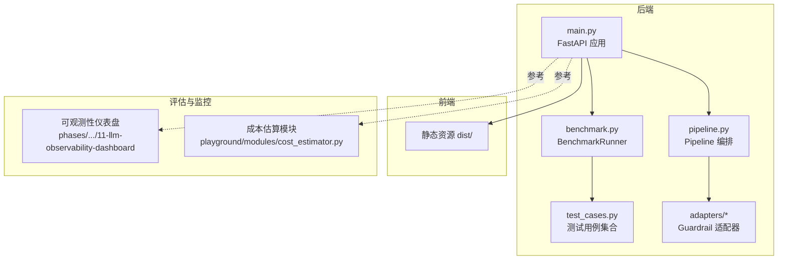
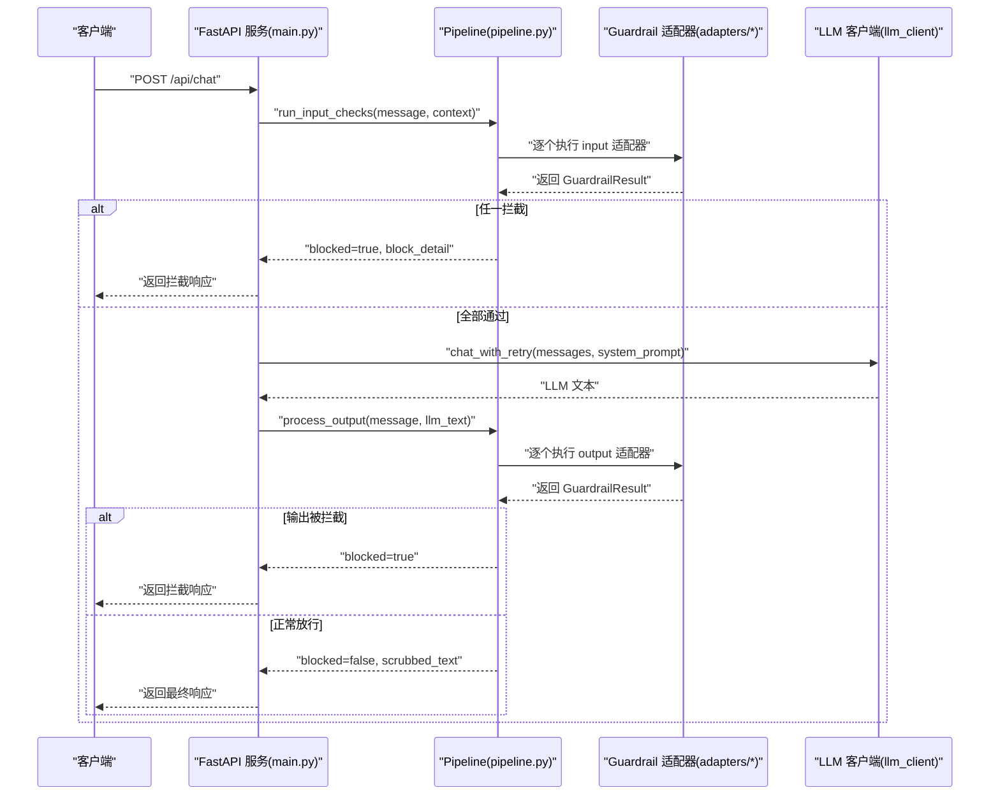
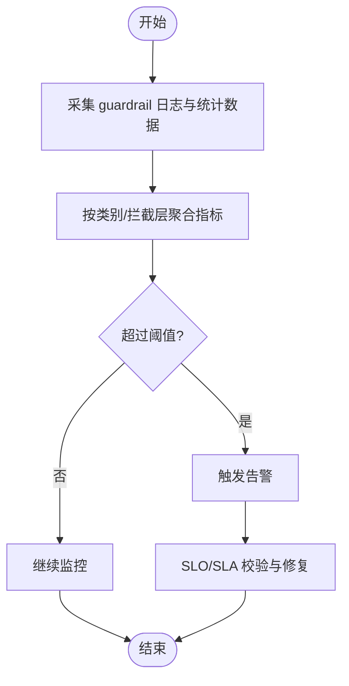
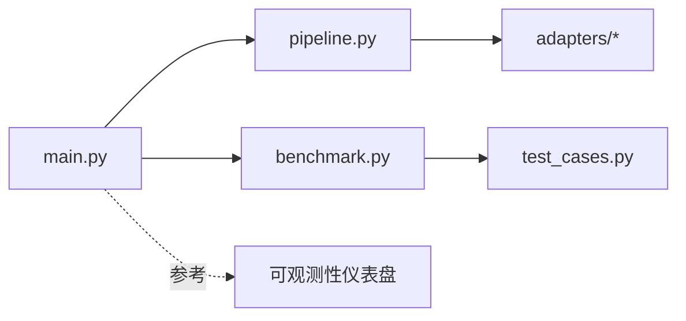

# 评估与监控

<cite>
**本文引用的文件**
- [backend/main.py](file://guardrails-sandbox/backend/main.py)
- [backend/pipeline.py](file://guardrails-sandbox/backend/pipeline.py)
- [backend/benchmark.py](file://guardrails-sandbox/backend/benchmark.py)
- [backend/test_cases.py](file://guardrails-sandbox/backend/test_cases.py)
- [backend/adapters/base.py](file://guardrails-sandbox/backend/adapters/base.py)
- [backend/adapters/injection.py](file://guardrails-sandbox/backend/adapters/injection.py)
- [backend/adapters/toxicity.py](file://guardrails-sandbox/backend/adapters/toxicity.py)
- [backend/adapters/pii_detector.py](file://guardrails-sandbox/backend/adapters/pii_detector.py)
- [site/vue-app/summary/src/data/content.js](file://site/vue-app/summary/src/data/content.js)
- [phases/19-capstone-projects/11-llm-observability-dashboard/code/main.py](file://phases/19-capstone-projects/11-llm-observability-dashboard/code/main.py)
</cite>

## 目录
1. [简介](#简介)
2. [项目结构](#项目结构)
3. [核心组件](#核心组件)
4. [架构总览](#架构总览)
5. [详细组件分析](#详细组件分析)
6. [依赖关系分析](#依赖关系分析)
7. [性能考量](#性能考量)
8. [故障排查指南](#故障排查指南)
9. [结论](#结论)
10. [附录](#附录)

## 简介
本文件面向LLM应用的评估与监控，围绕以下目标展开：
- 评估框架：涵盖自动化指标、LLM-as-Judge（人工评估）与A/B测试的完整流程与最佳实践
- 关键指标：准确性、一致性、安全性等的定义、计算与分析方法
- 监控系统：日志采集、指标追踪、异常告警与可观测性仪表盘
- 实用工具：性能基准测试、成本分析、用户体验评估
- 流水线与最佳实践：从数据到指标、从指标到告警的闭环

本仓库提供了可直接运行的“Guardrails沙箱”后端与前端，以及多个能力模块（如评测、成本估算、可观测性仪表盘），可作为评估与监控体系的参考实现。

## 项目结构
本项目以“沙箱+评估+监控”为主线组织，后端采用FastAPI提供REST接口，前端为静态资源托管；评估与监控能力通过模块化适配器与基准测试Runner实现。

图表来源
- [backend/main.py:1-421](file://guardrails-sandbox/backend/main.py#L1-L421)
- [backend/pipeline.py:1-285](file://guardrails-sandbox/backend/pipeline.py#L1-L285)
- [backend/benchmark.py:1-169](file://guardrails-sandbox/backend/benchmark.py#L1-L169)
- [backend/test_cases.py:1-155](file://guardrails-sandbox/backend/test_cases.py#L1-L155)

章节来源
- [backend/main.py:1-421](file://guardrails-sandbox/backend/main.py#L1-L421)
- [backend/pipeline.py:1-285](file://guardrails-sandbox/backend/pipeline.py#L1-L285)
- [backend/benchmark.py:1-169](file://guardrails-sandbox/backend/benchmark.py#L1-L169)
- [backend/test_cases.py:1-155](file://guardrails-sandbox/backend/test_cases.py#L1-L155)

## 核心组件
- Pipeline：统一编排输入/输出Guardrail适配器，支持短路拦截、统计与拦截历史记录
- GuardrailAdapter/GuardrailResult：适配器抽象与检查结果结构
- BenchmarkRunner：基于测试用例集的自动化评估，输出TPR/FPR/准确率等指标
- TestCases：标准化的测试用例集合，覆盖正常、注入、语义、PII、毒性、边界等类别
- FastAPI服务：提供聊天、对比模式、基准测试、适配器开关、拦截历史等接口

章节来源
- [backend/pipeline.py:12-285](file://guardrails-sandbox/backend/pipeline.py#L12-L285)
- [backend/adapters/base.py:5-34](file://guardrails-sandbox/backend/adapters/base.py#L5-L34)
- [backend/benchmark.py:10-169](file://guardrails-sandbox/backend/benchmark.py#L10-L169)
- [backend/test_cases.py:10-155](file://guardrails-sandbox/backend/test_cases.py#L10-L155)
- [backend/main.py:121-281](file://guardrails-sandbox/backend/main.py#L121-L281)

## 架构总览
下图展示从客户端请求到LLM调用再到输出检查的完整链路，并标注了评估与监控的关键节点。

图表来源
- [backend/main.py:155-221](file://guardrails-sandbox/backend/main.py#L155-L221)
- [backend/pipeline.py:31-161](file://guardrails-sandbox/backend/pipeline.py#L31-L161)
- [backend/adapters/base.py:29-31](file://guardrails-sandbox/backend/adapters/base.py#L29-L31)

章节来源
- [backend/main.py:155-221](file://guardrails-sandbox/backend/main.py#L155-L221)
- [backend/pipeline.py:31-161](file://guardrails-sandbox/backend/pipeline.py#L31-L161)

## 详细组件分析

### 评估框架：自动化指标、人工评估与A/B测试
- 自动化指标（自动化指标）
  - 使用测试用例集对Pipeline进行批量验证，计算准确率、TPR、FPR、精确率、F1等
  - 支持按类别与拦截层聚合统计，便于定位薄弱环节
- LLM-as-Judge（人工评估）
  - 通过四维评分体系（relevance/correctness/helpfulness/safety）对回答质量进行打分
  - 适合开放对话、客服等难以用自动化指标衡量的场景
- A/B测试
  - 对比“无Guardrails”与“有Guardrails”的输出差异，量化安全与体验的权衡
  - 可扩展至多版本策略对比，结合置信区间进行统计显著性判断

章节来源
- [backend/benchmark.py:14-169](file://guardrails-sandbox/backend/benchmark.py#L14-L169)
- [backend/test_cases.py:10-155](file://guardrails-sandbox/backend/test_cases.py#L10-L155)
- [backend/main.py:223-257](file://guardrails-sandbox/backend/main.py#L223-L257)
- [site/vue-app/summary/src/data/content.js:469-499](file://site/vue-app/summary/src/data/content.js#L469-L499)

### 关键评估指标与计算
- 准确率（Accuracy）：正确拦截/放行的样本占总数的比例
- TPR（真正例率）：攻击用例被正确拦截的比例
- FPR（假正例率）：正常用例被错误拦截的比例
- 精确率（Precision）：拦截中真正攻击的比例
- F1分数：精确率与召回率的调和平均
- 平均延迟（ms）：各适配器耗时累加的平均值

章节来源
- [backend/benchmark.py:124-161](file://guardrails-sandbox/backend/benchmark.py#L124-L161)

### 监控系统：日志、指标与告警
- 日志采集
  - Pipeline在每次拦截时记录时间戳、输入片段、拦截适配器、阶段、原因与置信度
  - 支持清空与查看拦截历史，便于回溯
- 指标追踪
  - 统计总数、拦截数、通过数与按拦截层的通过/拦截计数
  - 计算拦截率百分比
- 异常告警
  - 结合可观测性仪表盘，对吞吐、时延、成本、漂移（PSI）等进行阈值告警
  - 可扩展为基于规则或模型的异常检测

图表来源
- [backend/pipeline.py:247-285](file://guardrails-sandbox/backend/pipeline.py#L247-L285)
- [phases/19-capstone-projects/11-llm-observability-dashboard/code/main.py:238-257](file://phases/19-capstone-projects/11-llm-observability-dashboard/code/main.py#L238-L257)

章节来源
- [backend/pipeline.py:247-285](file://guardrails-sandbox/backend/pipeline.py#L247-L285)
- [phases/19-capstone-projects/11-llm-observability-dashboard/code/main.py:238-257](file://phases/19-capstone-projects/11-llm-observability-dashboard/code/main.py#L238-L257)

### 实用工具与方法
- 性能基准测试
  - 基于TestCases运行BenchmarkRunner，得到整体与分层指标
  - 可按类别筛选运行，快速定位问题域
- 成本分析
  - 估算模型调用成本与缓存节省，辅助容量规划与优化
- 用户体验评估
  - 通过对比模式（有/无Guardrails）观察回答一致性与安全性
  - 引入置信区间（Wilson CI）提升评估稳健性

章节来源
- [backend/benchmark.py:14-28](file://guardrails-sandbox/backend/benchmark.py#L14-L28)
- [backend/main.py:223-257](file://guardrails-sandbox/backend/main.py#L223-L257)
- [site/vue-app/summary/src/data/content.js:486-499](file://site/vue-app/summary/src/data/content.js#L486-L499)

### Guardrail适配器与评估要点
- 注入检测（InjectionDetector）
  - 基于正则匹配已知攻击模式与编码绕过，输出最高置信度与匹配详情
- 毒性过滤（ToxicityFilter）
  - 检测暴力、违法、自残、仇恨、色情等敏感内容，支持安全上下文豁免
- PII检测（PiiDetector）
  - 识别手机号、邮箱、身份证、信用卡等敏感信息，区分拦截与警告

章节来源
- [backend/adapters/injection.py:44-88](file://guardrails-sandbox/backend/adapters/injection.py#L44-L88)
- [backend/adapters/toxicity.py:22-64](file://guardrails-sandbox/backend/adapters/toxicity.py#L22-L64)
- [backend/adapters/pii_detector.py:19-54](file://guardrails-sandbox/backend/adapters/pii_detector.py#L19-L54)

## 依赖关系分析
- 服务入口依赖Pipeline与BenchmarkRunner
- Pipeline依赖各GuardrailAdapter实现
- 评估依赖TestCases与BenchmarkRunner
- 监控依赖Pipeline统计与拦截历史

图表来源
- [backend/main.py:16-58](file://guardrails-sandbox/backend/main.py#L16-L58)
- [backend/pipeline.py:12-24](file://guardrails-sandbox/backend/pipeline.py#L12-L24)
- [backend/benchmark.py:14-19](file://guardrails-sandbox/backend/benchmark.py#L14-L19)
- [backend/test_cases.py:139-155](file://guardrails-sandbox/backend/test_cases.py#L139-L155)

章节来源
- [backend/main.py:16-58](file://guardrails-sandbox/backend/main.py#L16-L58)
- [backend/pipeline.py:12-24](file://guardrails-sandbox/backend/pipeline.py#L12-L24)
- [backend/benchmark.py:14-19](file://guardrails-sandbox/backend/benchmark.py#L14-L19)
- [backend/test_cases.py:139-155](file://guardrails-sandbox/backend/test_cases.py#L139-L155)

## 性能考量
- 适配器顺序与短路：Pipeline按order排序，任一拦截即短路，降低整体延迟
- 统计与历史：拦截历史最多保留固定条目，避免内存膨胀
- 预加载模型：启动时预热语义模型，减少首次调用开销
- 延迟度量：每条日志记录适配器耗时，便于定位慢点

章节来源
- [backend/pipeline.py:22-23](file://guardrails-sandbox/backend/pipeline.py#L22-L23)
- [backend/pipeline.py:264-285](file://guardrails-sandbox/backend/pipeline.py#L264-L285)
- [backend/main.py:62-77](file://guardrails-sandbox/backend/main.py#L62-L77)

## 故障排查指南
- 拦截历史
  - 查看最近拦截记录，确认拦截适配器、阶段与原因
  - 清空历史以便重新观测
- 适配器开关
  - 动态启用/禁用特定Guardrail，隔离问题来源
- 对比模式
  - 对同一输入分别运行“有/无Guardrails”，快速定位安全策略影响
- 观测性仪表盘
  - 关注吞吐、时延、成本与漂移（PSI）等指标，及时发现异常

章节来源
- [backend/main.py:136-152](file://guardrails-sandbox/backend/main.py#L136-L152)
- [backend/main.py:223-257](file://guardrails-sandbox/backend/main.py#L223-L257)
- [phases/19-capstone-projects/11-llm-observability-dashboard/code/main.py:238-257](file://phases/19-capstone-projects/11-llm-observability-dashboard/code/main.py#L238-L257)

## 结论
本项目提供了从“评估—监控—优化”的闭环能力：以Pipeline为核心串联Guardrail适配器，以BenchmarkRunner驱动自动化评估，以拦截历史与统计指标支撑监控与告警，并辅以对比模式与可观测性仪表盘，形成可落地的评估与监控实践。建议在生产环境中结合A/B测试与置信区间，持续迭代安全策略与性能表现。

## 附录
- 术语与概念
  - TPR/FPR/Precision/F1：评估二分类模型的核心指标
  - PSI：用于检测分布漂移的指标
  - LLM-as-Judge：以LLM对回答质量进行打分的评估范式
- 参考资料
  - 评估框架与四维评分体系说明
  - 可观测性仪表盘的告警与漂移检测

章节来源
- [site/vue-app/summary/src/data/content.js:469-499](file://site/vue-app/summary/src/data/content.js#L469-L499)
- [phases/19-capstone-projects/11-llm-observability-dashboard/code/main.py:238-257](file://phases/19-capstone-projects/11-llm-observability-dashboard/code/main.py#L238-L257)