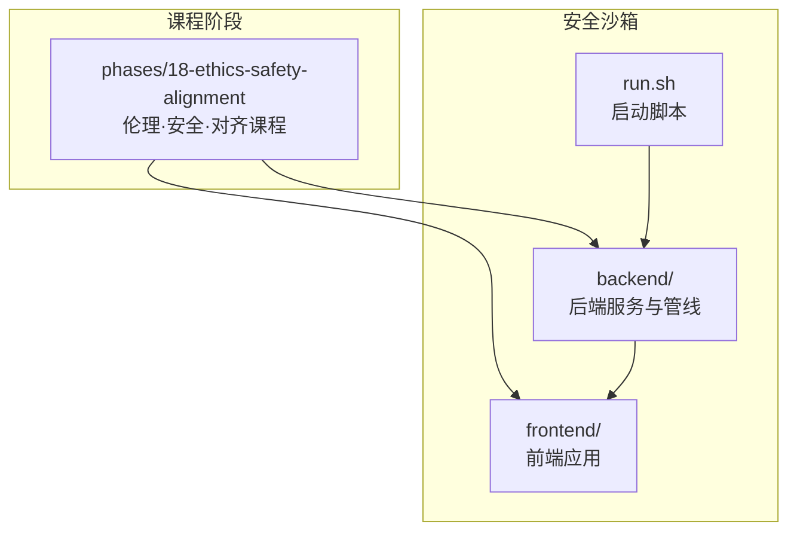
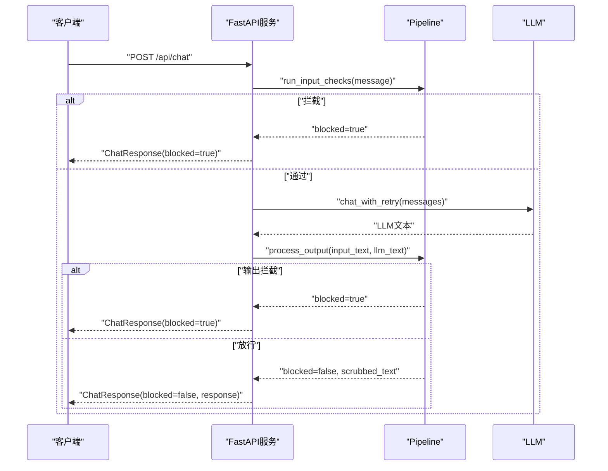
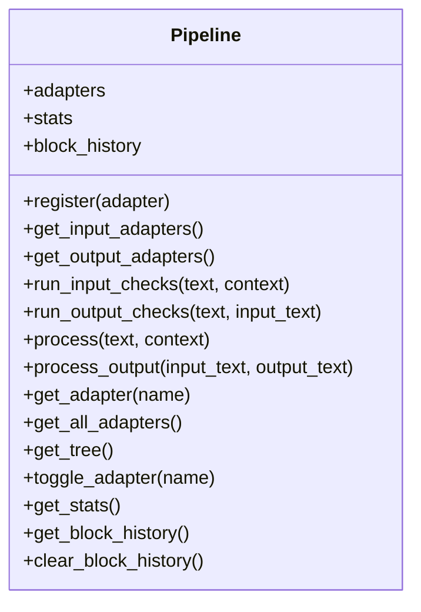
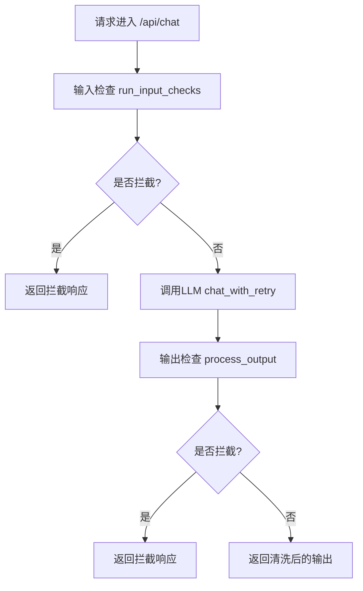
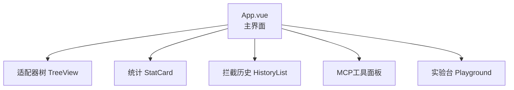
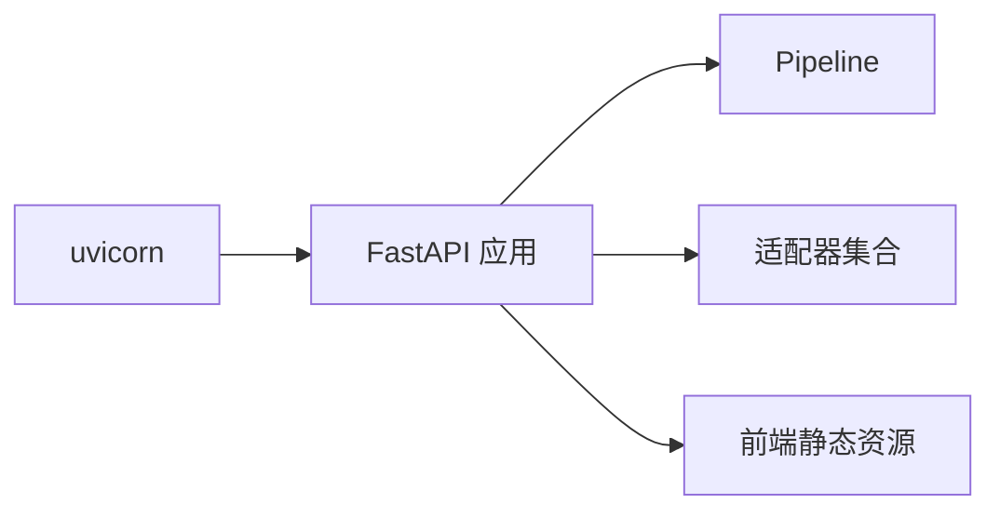

# 伦理、安全与对齐

<cite>
**本文引用的文件**   
- [phases/18-ethics-safety-alignment/README.md](file://phases/18-ethics-safety-alignment/README.md)
- [guardrails-sandbox/backend/pipeline.py](file://guardrails-sandbox/backend/pipeline.py)
- [guardrails-sandbox/backend/main.py](file://guardrails-sandbox/backend/main.py)
- [guardrails-sandbox/frontend/index.html](file://guardrails-sandbox/frontend/index.html)
- [guardrails-sandbox/frontend/package.json](file://guardrails-sandbox/frontend/package.json)
- [guardrails-sandbox/frontend/src/main.ts](file://guardrails-sandbox/frontend/src/main.ts)
- [guardrails-sandbox/frontend/src/App.vue](file://guardrails-sandbox/frontend/src/App.vue)
- [guardrails-sandbox/frontend/src/components/](file://guardrails-sandbox/frontend/src/components/)
- [guardrails-sandbox/frontend/tsconfig.json](file://guardrails-sandbox/frontend/tsconfig.json)
- [guardrails-sandbox/frontend/vite.config.ts](file://guardrails-sandbox/frontend/vite.config.ts)
- [guardrails-sandbox/run.sh](file://guardrails-sandbox/run.sh)
</cite>

## 目录
1. [引言](#引言)
2. [项目结构](#项目结构)
3. [核心组件](#核心组件)
4. [架构总览](#架构总览)
5. [详细组件分析](#详细组件分析)
6. [依赖分析](#依赖分析)
7. [性能考虑](#性能考虑)
8. [故障排查指南](#故障排查指南)
9. [结论](#结论)
10. [附录](#附录)

## 引言
本课程围绕“伦理、安全与对齐”展开，聚焦于构建对人类有益的AI系统。课程内容覆盖AI安全与对齐的关键议题，包括但不限于：
- 对齐技术：指令遵循对齐信号、奖励黑客与广义Goodhart效应、直接偏好优化家族（DPO/RLHF等）
- 对齐挑战：Mesa优化、睡眠代理等隐蔽对齐失效风险及应对思路
- 安全测试：红队技术、自动化攻击、多轮越狱、ASCII艺术/视觉越狱等对抗测试方法
- 治理框架：Frontier安全框架、RSP、PF、FSF等安全治理与合规体系
- 公平性与代表性伤害：偏见评估与缓解策略
- 合规与可追溯性：监管框架、数据溯源、模型/系统/数据集卡片等要求
- 职业责任：从业者在安全与对齐上的伦理与职业责任

该仓库提供了完整的教学阶段与配套沙箱系统，便于理论与实践结合。

## 项目结构
本课程以“阶段化学习”组织，第18阶段集中于伦理、安全与对齐；配套的Guardrails沙箱提供端到端的输入/输出安全管线演示与可视化。

图示来源
- [phases/18-ethics-safety-alignment/README.md:1-6](file://phases/18-ethics-safety-alignment/README.md#L1-L6)
- [guardrails-sandbox/backend/main.py:1-421](file://guardrails-sandbox/backend/main.py#L1-L421)
- [guardrails-sandbox/run.sh](file://guardrails-sandbox/run.sh)

章节来源
- [phases/18-ethics-safety-alignment/README.md:1-6](file://phases/18-ethics-safety-alignment/README.md#L1-L6)

## 核心组件
- 安全管线（Pipeline）：负责注册与排序各类Guardrail适配器，按输入/输出阶段执行检查，支持短路拦截、统计与拦截历史记录。
- 适配器集合：包含速率限制、注入检测、语义/事实分类、毒性过滤、主题分类、格式校验、PII检测、长度检查、相关性检查、RAG一致性、上下文引擎、输出清洗等。
- FastAPI服务：提供聊天接口、对比模式、基准测试、MCP工具调用、实验台与检查点数据库查看等能力。
- 前端应用：基于Vue+Vite的可视化界面，展示适配器树、统计与拦截历史，支持切换与重置。

章节来源
- [guardrails-sandbox/backend/pipeline.py:12-285](file://guardrails-sandbox/backend/pipeline.py#L12-L285)
- [guardrails-sandbox/backend/main.py:24-58](file://guardrails-sandbox/backend/main.py#L24-L58)
- [guardrails-sandbox/backend/main.py:155-221](file://guardrails-sandbox/backend/main.py#L155-L221)
- [guardrails-sandbox/frontend/src/App.vue](file://guardrails-sandbox/frontend/src/App.vue)
- [guardrails-sandbox/frontend/src/main.ts](file://guardrails-sandbox/frontend/src/main.ts)

## 架构总览
下图展示了从请求到响应的完整流程，包括输入检查、LLM调用、输出检查与结果返回。

图示来源
- [guardrails-sandbox/backend/main.py:155-221](file://guardrails-sandbox/backend/main.py#L155-L221)
- [guardrails-sandbox/backend/pipeline.py:31-160](file://guardrails-sandbox/backend/pipeline.py#L31-L160)

## 详细组件分析

### 安全管线（Pipeline）设计
Pipeline负责：
- 注册与排序适配器（按分组、类别、顺序）
- 输入/输出阶段的短路检查
- 统计与拦截历史记录
- 输出清洗与脱敏

图示来源
- [guardrails-sandbox/backend/pipeline.py:12-285](file://guardrails-sandbox/backend/pipeline.py#L12-L285)

章节来源
- [guardrails-sandbox/backend/pipeline.py:12-285](file://guardrails-sandbox/backend/pipeline.py#L12-L285)

### FastAPI服务与路由
服务提供以下关键接口：
- 获取适配器树与统计
- 切换适配器启用状态
- 对话接口（含对比模式）
- 基准测试运行
- MCP工具调用与列表
- 实验台模块运行
- 检查点数据库查看

图示来源
- [guardrails-sandbox/backend/main.py:155-221](file://guardrails-sandbox/backend/main.py#L155-L221)
- [guardrails-sandbox/backend/pipeline.py:58-160](file://guardrails-sandbox/backend/pipeline.py#L58-L160)

章节来源
- [guardrails-sandbox/backend/main.py:121-281](file://guardrails-sandbox/backend/main.py#L121-L281)

### 前端应用与可视化
前端提供：
- 适配器树形视图（分组/类别/适配器）
- 统计面板（总数、拦截数、通过数、拦截率）
- 拦截历史列表
- 适配器开关与重置统计

图示来源
- [guardrails-sandbox/frontend/src/App.vue](file://guardrails-sandbox/frontend/src/App.vue)
- [guardrails-sandbox/frontend/src/main.ts](file://guardrails-sandbox/frontend/src/main.ts)

章节来源
- [guardrails-sandbox/frontend/src/App.vue](file://guardrails-sandbox/frontend/src/App.vue)
- [guardrails-sandbox/frontend/src/main.ts](file://guardrails-sandbox/frontend/src/main.ts)

### 适配器类型概览
课程中涉及的适配器类型（节选）：
- 输入类：注入检测、语义/事实分类、毒性过滤、主题分类、格式校验、长度检查、提示词泄露检测、RAG一致性、上下文引擎
- 输出类：输出清洗、PII检测、相关性检查
- 控制类：速率限制

章节来源
- [guardrails-sandbox/backend/main.py:24-58](file://guardrails-sandbox/backend/main.py#L24-L58)
- [guardrails-sandbox/backend/pipeline.py:25-29](file://guardrails-sandbox/backend/pipeline.py#L25-L29)

### 对齐技术与挑战（课程主题）
- 指令遵循对齐信号：如何将人类意图转化为可执行的对齐信号
- 奖励黑客与Goodhart效应：目标函数与真实价值之间的偏差
- 直接偏好优化（DPO）家族：从偏好数据中学习而非仅依赖奖励模型
- Mesa优化与欺骗性对齐：内部目标与外在表现不一致的风险
- 睡眠代理：持久性欺骗与长期隐藏意图
- 红队与自动化攻击：系统性对抗测试与越狱方法
- ASCII/视觉越狱：非传统输入形式的对抗测试
- 治理框架：Frontier安全框架、RSP、PF、FSF
- 公平性与代表性伤害：偏见评估与缓解策略
- 合规与可追溯性：监管框架、数据溯源、模型/系统/数据集卡片

说明：上述主题在课程阶段中以文档、测验与实验的形式呈现，便于学习者系统掌握。

## 依赖分析
- 后端依赖：FastAPI、SentenceTransformer（离线加载）、uvicorn（开发服务器）
- 前端依赖：Vue、TypeScript、Vite
- 运行方式：通过run.sh启动后端服务，静态资源由FastAPI挂载

图示来源
- [guardrails-sandbox/backend/main.py:79-85](file://guardrails-sandbox/backend/main.py#L79-L85)
- [guardrails-sandbox/run.sh](file://guardrails-sandbox/run.sh)

章节来源
- [guardrails-sandbox/frontend/package.json](file://guardrails-sandbox/frontend/package.json)
- [guardrails-sandbox/frontend/tsconfig.json](file://guardrails-sandbox/frontend/tsconfig.json)
- [guardrails-sandbox/frontend/vite.config.ts](file://guardrails-sandbox/frontend/vite.config.ts)
- [guardrails-sandbox/run.sh](file://guardrails-sandbox/run.sh)

## 性能考虑
- 管线短路：任一适配器拦截即短路，减少后续处理开销
- 统计与历史：维护拦截历史上限，避免内存膨胀
- 模型预加载：离线加载语义模型，避免异步环境连接问题
- 前端渲染：树形结构与统计面板按需刷新，提升交互体验

章节来源
- [guardrails-sandbox/backend/pipeline.py:48-56](file://guardrails-sandbox/backend/pipeline.py#L48-L56)
- [guardrails-sandbox/backend/pipeline.py:264-285](file://guardrails-sandbox/backend/pipeline.py#L264-L285)
- [guardrails-sandbox/backend/main.py:62-76](file://guardrails-sandbox/backend/main.py#L62-L76)

## 故障排查指南
- LLM调用失败：检查消息格式与系统提示，确认网络与模型可用性
- 拦截误判：通过对比模式（无防护与有防护）验证适配器行为，必要时调整阈值或禁用特定适配器
- 拦截历史：查看拦截原因与置信度，定位问题适配器
- MCP工具：确认工具服务器路径与初始化参数，确保Stdio通信正常
- 基准测试：按类别运行，观察各适配器通过率与延迟

章节来源
- [guardrails-sandbox/backend/main.py:186-194](file://guardrails-sandbox/backend/main.py#L186-L194)
- [guardrails-sandbox/backend/main.py:223-256](file://guardrails-sandbox/backend/main.py#L223-L256)
- [guardrails-sandbox/backend/main.py:272-280](file://guardrails-sandbox/backend/main.py#L272-L280)
- [guardrails-sandbox/backend/main.py:324-356](file://guardrails-sandbox/backend/main.py#L324-L356)
- [guardrails-sandbox/backend/pipeline.py:264-285](file://guardrails-sandbox/backend/pipeline.py#L264-L285)

## 结论
本课程将伦理、安全与对齐的理论与实践紧密结合，通过安全沙箱系统直观展示输入/输出安全管线的工作机制。学习者可在真实环境中演练对齐技术、对抗测试与治理框架，培养在复杂AI系统中平衡功能、安全与伦理的能力。从业者应始终将“对人类有益”的目标置于首位，严格履行职业责任与伦理义务。

## 附录
- 课程阶段入口：参见阶段目录下的README
- 沙箱启动：使用run.sh启动后端服务，访问本地8000端口
- 前端构建：通过Vite配置进行开发与打包

章节来源
- [phases/18-ethics-safety-alignment/README.md:1-6](file://phases/18-ethics-safety-alignment/README.md#L1-L6)
- [guardrails-sandbox/run.sh](file://guardrails-sandbox/run.sh)
- [guardrails-sandbox/frontend/vite.config.ts](file://guardrails-sandbox/frontend/vite.config.ts)