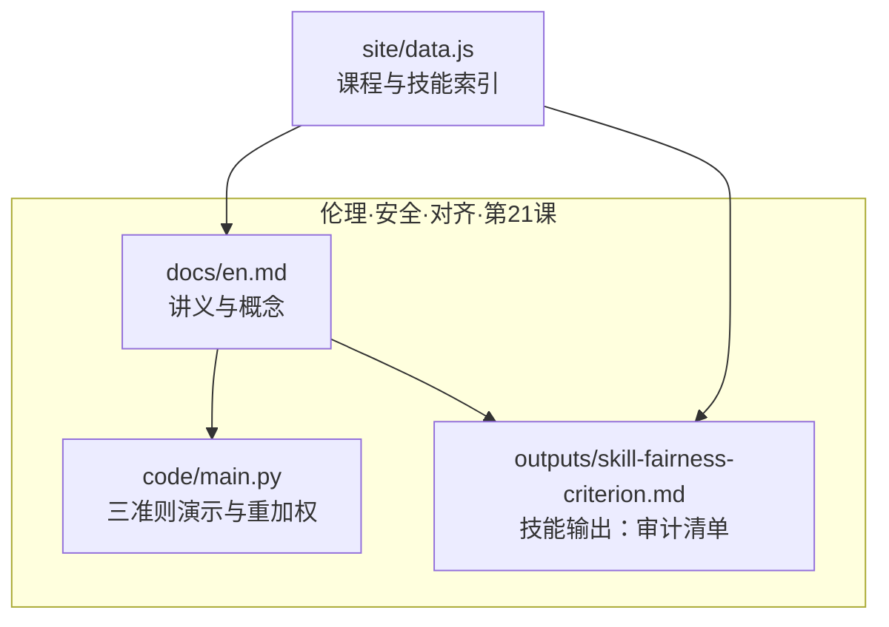
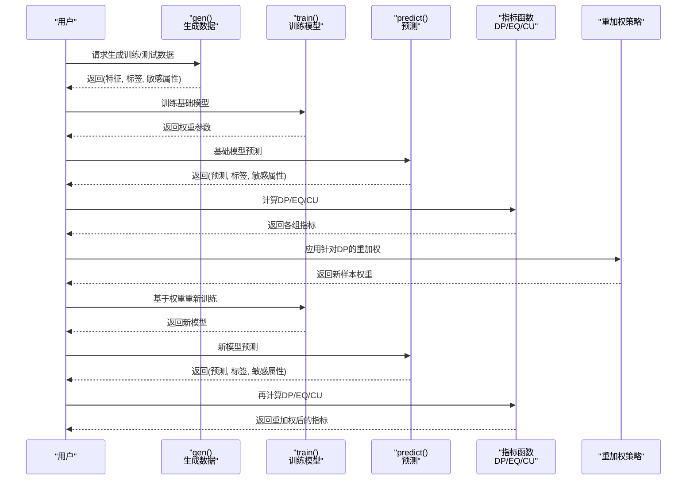
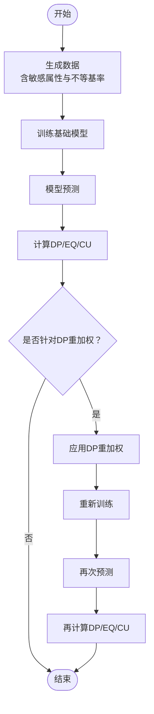
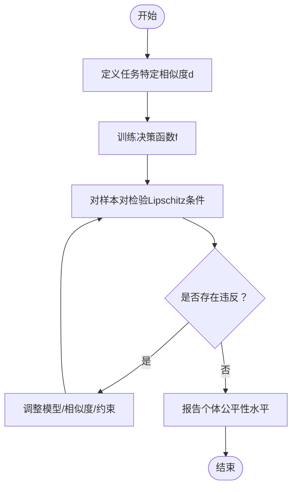
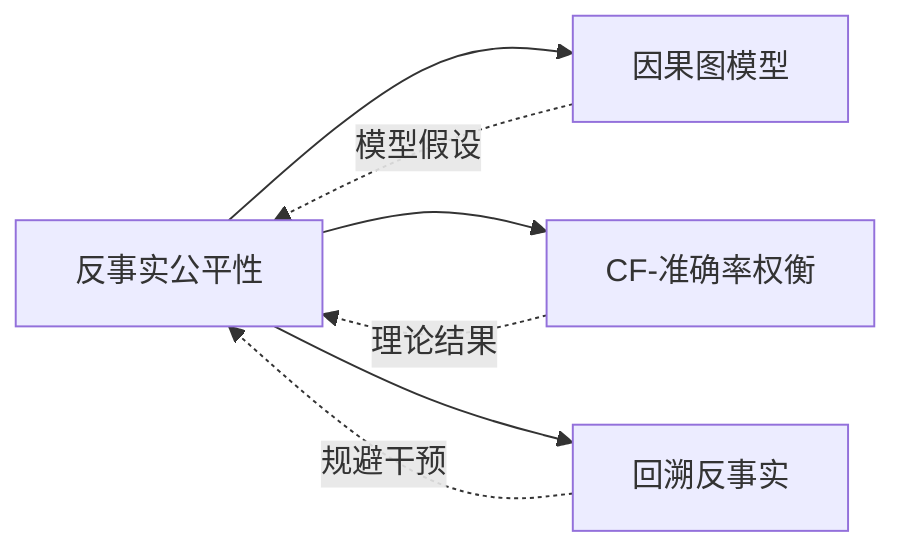
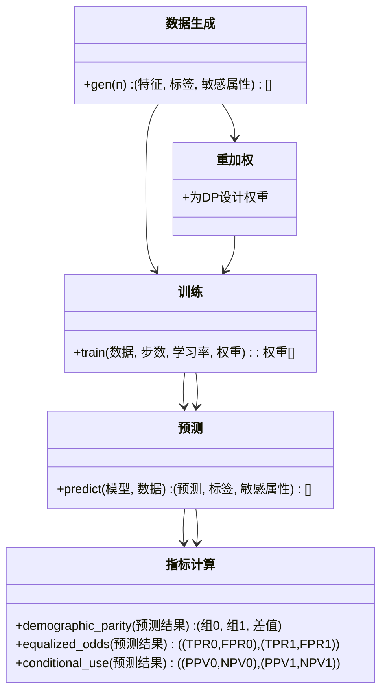
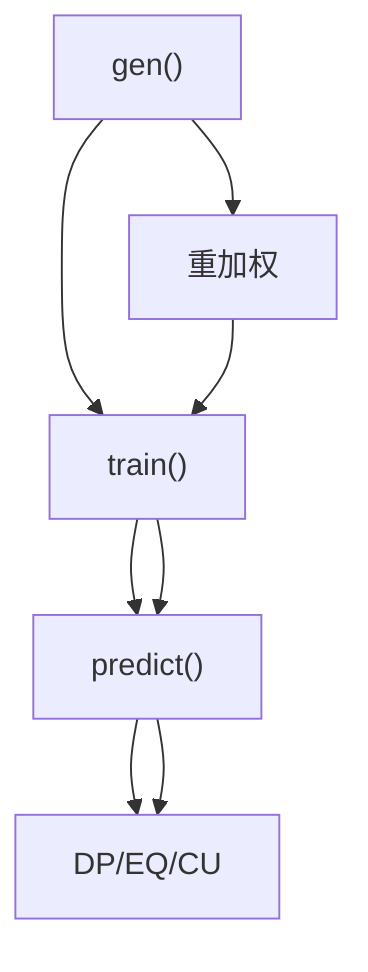

# 公平性标准

<cite>
**本文引用的文件**   
- [公平性标准（英文）](file://phases/18-ethics-safety-alignment/21-fairness-criteria-group-individual-counterfactual/docs/en.md)
- [主程序（公平性三准则演示）](file://phases/18-ethics-safety-alignment/21-fairness-criteria-group-individual-counterfactual/code/main.py)
- [技能输出：公平性准则审计](file://phases/18-ethics-safety-alignment/21-fairness-criteria-group-individual-counterfactual/outputs/skill-fairness-criterion.md)
- [站点数据：技能与课程索引](file://site/data.js)
</cite>

## 目录
1. [简介](#简介)
2. [项目结构](#项目结构)
3. [核心组件](#核心组件)
4. [架构总览](#架构总览)
5. [详细组件分析](#详细组件分析)
6. [依赖分析](#依赖分析)
7. [性能考量](#性能考量)
8. [故障排查指南](#故障排查指南)
9. [结论](#结论)
10. [附录](#附录)

## 简介
本文件围绕“公平性标准”主题，系统梳理三类核心公平性准则：群体公平性（Demographic Parity）、个体公平性（Individual Fairness）与反事实公平性（Counterfactual Fairness），并结合 Chouldechova/Kleinberg-Mullainathan-Raghavan 不可能定理、Dwork 等人关于个体公平性的 Lipschitz 条件以及 Kusner 等人的反事实公平性因果图模型进行深入阐述。同时，给出基于仓库内示例代码的实践路径与评估指标计算方法，帮助读者从理论到实践全面掌握公平性准则的设计、权衡与落地。

## 项目结构
该主题位于“伦理、安全与对齐”阶段第 21 课，配套有英文讲义、可运行的 Python 示例与技能输出文档。示例代码以最小化第三方依赖的方式，构建二分类场景，演示三类群体公平性指标的计算与重加权策略的影响。

图表来源
- [公平性标准（英文）:1-101](file://phases/18-ethics-safety-alignment/21-fairness-criteria-group-individual-counterfactual/docs/en.md#L1-L101)
- [主程序（公平性三准则演示）:1-138](file://phases/18-ethics-safety-alignment/21-fairness-criteria-group-individual-counterfactual/code/main.py#L1-L138)
- [技能输出：公平性准则审计:1-30](file://phases/18-ethics-safety-alignment/21-fairness-criteria-group-individual-counterfactual/outputs/skill-fairness-criterion.md#L1-L30)
- [站点数据：技能与课程索引:3822-3834](file://site/data.js#L3822-L3834)

章节来源
- [公平性标准（英文）:1-101](file://phases/18-ethics-safety-alignment/21-fairness-criteria-group-individual-counterfactual/docs/en.md#L1-L101)
- [主程序（公平性三准则演示）:1-138](file://phases/18-ethics-safety-alignment/21-fairness-criteria-group-individual-counterfactual/code/main.py#L1-L138)
- [技能输出：公平性准则审计:1-30](file://phases/18-ethics-safety-alignment/21-fairness-criteria-group-individual-counterfactual/outputs/skill-fairness-criterion.md#L1-L30)
- [站点数据：技能与课程索引:3822-3834](file://site/data.js#L3822-L3834)

## 核心组件
- 讲义文档：系统阐述三类公平性准则、不可能定理、个体公平性 Lipschitz 条件、反事实公平性因果图模型、CF-准确率权衡、回溯反事实与哲学上的统一性。
- 示例代码：生成含敏感属性的二分类数据，训练简单逻辑回归分类器，计算三类群体公平性指标，并演示针对“人口统计公平性”的重加权策略及其代价。
- 技能输出：提供一个“公平性准则审计”的可交付物模板，指导识别所宣称的标准、核查基率、因果图依赖、相似性度量与干预合法性。

章节来源
- [公平性标准（英文）:10-82](file://phases/18-ethics-safety-alignment/21-fairness-criteria-group-individual-counterfactual/docs/en.md#L10-L82)
- [主程序（公平性三准则演示）:21-133](file://phases/18-ethics-safety-alignment/21-fairness-criteria-group-individual-counterfactual/code/main.py#L21-L133)
- [技能输出：公平性准则审计:10-29](file://phases/18-ethics-safety-alignment/21-fairness-criteria-group-individual-counterfactual/outputs/skill-fairness-criterion.md#L10-L29)

## 架构总览
以下序列图展示从“生成数据→训练模型→计算公平性指标→重加权→再评估”的完整流程，体现三类群体公平性指标的计算与重加权策略的对比。

图表来源
- [主程序（公平性三准则演示）:21-124](file://phases/18-ethics-safety-alignment/21-fairness-criteria-group-individual-counterfactual/code/main.py#L21-L124)

章节来源
- [主程序（公平性三准则演示）:101-133](file://phases/18-ethics-safety-alignment/21-fairness-criteria-group-individual-counterfactual/code/main.py#L101-L133)

## 详细组件分析

### 群体公平性（Demographic Parity、Equalized Odds、Conditional Use Accuracy Equality）
- 定义与差异
  - 人口统计公平性：各组接受率一致，强调“正例比率”在不同敏感属性组之间相等。
  - 等化几率：真阳性率与假阳性率在各组均相等，强调“判别一致性”。
  - 条件使用准确性：在预测为正/负的前提下，真实正/负的比率在各组相等，关注“预测价值”。
- 不可能定理（Chouldechova/KMR 2017）
  - 在“基率不等”的情况下，三者不可同时满足，必须在政策层面做出取舍。
- 实践要点
  - 通过重加权策略提升某一项指标时，会对其他指标造成影响，需明确权衡与取舍。

图表来源
- [主程序（公平性三准则演示）:101-124](file://phases/18-ethics-safety-alignment/21-fairness-criteria-group-individual-counterfactual/code/main.py#L101-L124)

章节来源
- [公平性标准（英文）:23-29](file://phases/18-ethics-safety-alignment/21-fairness-criteria-group-individual-counterfactual/docs/en.md#L23-L29)
- [主程序（公平性三准则演示）:65-86](file://phases/18-ethics-safety-alignment/21-fairness-criteria-group-individual-counterfactual/code/main.py#L65-L86)
- [主程序（公平性三准则演示）:113-124](file://phases/18-ethics-safety-alignment/21-fairness-criteria-group-individual-counterfactual/code/main.py#L113-L124)

### 个体公平性（Individual Fairness）与 Lipschitz 条件
- 核心思想
  - 相似个体应得到相似决策；形式化为决策映射 f 对相似度度量 d 的 Lipschitz 有界性：|f(x) - f(x')| ≤ L · d(x, x')。
- 关键点
  - 相似性度量 d 是任务特定且由政策决定的，属于“规范性选择”，非统计估计问题。
- 实践建议
  - 在非敏感特征上定义合适的距离（如 L2），统计违反 Lipschitz 的样本比例，作为个体公平性的经验度量。

图表来源
- [公平性标准（英文）:31-35](file://phases/18-ethics-safety-alignment/21-fairness-criteria-group-individual-counterfactual/docs/en.md#L31-L35)
- [主程序（公平性三准则演示）:75-75](file://phases/18-ethics-safety-alignment/21-fairness-criteria-group-individual-counterfactual/code/main.py#L75-L75)

章节来源
- [公平性标准（英文）:31-35](file://phases/18-ethics-safety-alignment/21-fairness-criteria-group-individual-counterfactual/docs/en.md#L31-L35)

### 反事实公平性（Counterfactual Fairness）与因果图模型
- 核心思想
  - 在给定因果模型下，当敏感属性被反事实地改变时，决策保持不变，则对该个体而言是公平的。
- 因果图依赖
  - 反事实公平性依赖于所假设的因果 DAG；其合理性取决于该模型的正确性与可解释性。
- CF-准确率权衡与回溯反事实
  - 学术界发现存在反事实公平性与预测准确率之间的固有权衡；已有模型无关的方法可在保证最优预测的同时，转换为满足反事实公平性的模型，且准确率损失有界。
  - 回溯反事实避免对受保护属性进行干预，从而规避法律与伦理问题。

图表来源
- [公平性标准（英文）:37-57](file://phases/18-ethics-safety-alignment/21-fairness-criteria-group-individual-counterfactual/docs/en.md#L37-L57)

章节来源
- [公平性标准（英文）:37-57](file://phases/18-ethics-safety-alignment/21-fairness-criteria-group-individual-counterfactual/docs/en.md#L37-L57)

### 不可能定理（Chouldechova/Kleinberg-Mullainathan-Raghavan 2017）
- 含义
  - 在“基率不等”的现实条件下，三类群体公平性准则不可同时满足；必须在政策层面做出取舍。
- 影响
  - 强调公平性选择的规范性本质，而非仅靠统计方法即可解决；在部署前需明确目标与代价。

章节来源
- [公平性标准（英文）](file://phases/18-ethics-safety-alignment/21-fairness-criteria-group-individual-counterfactual/docs/en.md#L29)

### 代码实现与评估指标计算方法
- 数据生成
  - 生成含敏感属性 A 的二分类数据，两组具有不同的基率（例如 A=0 基率为 0.3，A=1 基率为 0.6），特征与标签存在噪声相关。
- 模型训练
  - 使用随机梯度下降训练简单的逻辑回归模型，支持样本级权重（用于重加权）。
- 预测与评估
  - 基于阈值 0 的线性决策边界进行预测，随后分别计算：
    - 人口统计公平性（Demographic Parity）
    - 等化几率（Equalized Odds，包括 TPR 与 FPR）
    - 条件使用准确性（Conditional Use Accuracy，包括 PPV 与 NPV）
- 重加权策略
  - 针对人口统计公平性，对正样本进行加权（例如 A=0 且 y=1 提高权重，A=1 且 y=1 降低权重），观察对其他两项指标的影响。

图表来源
- [主程序（公平性三准则演示）:21-124](file://phases/18-ethics-safety-alignment/21-fairness-criteria-group-individual-counterfactual/code/main.py#L21-L124)

章节来源
- [主程序（公平性三准则演示）:21-124](file://phases/18-ethics-safety-alignment/21-fairness-criteria-group-individual-counterfactual/code/main.py#L21-L124)

## 依赖分析
- 组件耦合
  - 数据生成与训练/预测紧密耦合；指标计算依赖预测结果；重加权通过样本权重影响训练过程。
- 外部依赖
  - 示例代码仅使用标准库（math、random），便于在无外部依赖环境下运行与教学。
- 可能的循环依赖
  - 未发现循环导入；模块职责清晰：生成→训练→预测→指标→重加权→再训练→再评估。

图表来源
- [主程序（公平性三准则演示）:21-124](file://phases/18-ethics-safety-alignment/21-fairness-criteria-group-individual-counterfactual/code/main.py#L21-L124)

章节来源
- [主程序（公平性三准则演示）:21-124](file://phases/18-ethics-safety-alignment/21-fairness-criteria-group-individual-counterfactual/code/main.py#L21-L124)

## 性能考量
- 计算复杂度
  - 训练采用小批量随机梯度下降，时间复杂度近似 O(N·T)，其中 N 为样本数，T 为迭代次数；指标计算为 O(N)。
- 可扩展性
  - 当前实现面向教学演示，若扩展至大规模数据，可引入更高效的优化器与批处理策略。
- 数值稳定性
  - 逻辑回归使用 Sigmoid 激活，注意对极端线性组合的数值稳定处理（已在实现中通过阈值化进行简化）。

## 故障排查指南
- 基率不等导致的冲突
  - 若宣称同时满足三类群体公平性，需明确指出基率不等的现实条件，并解释不可能定理的约束。
- 反事实公平性声明无效
  - 若未提供因果 DAG 或未说明假设，反事实公平性声明缺乏依据。
- 个体公平性声明模糊
  - 未明确相似度度量 d 的任务特定性与政策选择，需补充说明。
- 干预合法性问题
  - 若使用传统反事实干预受保护属性，需考虑回溯反事实方案以规避法律与伦理风险。

章节来源
- [技能输出：公平性准则审计:14-29](file://phases/18-ethics-safety-alignment/21-fairness-criteria-group-individual-counterfactual/outputs/skill-fairness-criterion.md#L14-L29)

## 结论
- 公平性准则的选择本质上是规范性决策，统计方法无法在“基率不等”的条件下同时满足三类群体公平性。
- 个体公平性强调相似个体获得相似决策，但相似度度量需由政策决定；反事实公平性依赖因果模型，且存在与准确率的固有权衡。
- 通过示例代码可直观理解三类群体公平性指标的计算与重加权策略的代价，为实际部署中的公平性权衡提供实证参考。

## 附录
- 进一步阅读
  - Dwork et al. — Fairness through Awareness（个体公平性）
  - Kusner et al. — Counterfactual Fairness（反事实公平性）
  - Chouldechova — Fair prediction with disparate impact（不可能定理）
  - Backtracking Counterfactuals（规避受保护属性干预的新范式）

章节来源
- [公平性标准（英文）:95-101](file://phases/18-ethics-safety-alignment/21-fairness-criteria-group-individual-counterfactual/docs/en.md#L95-L101)