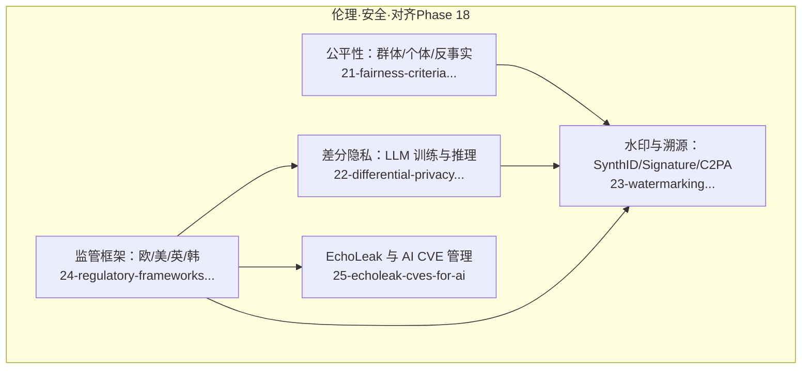
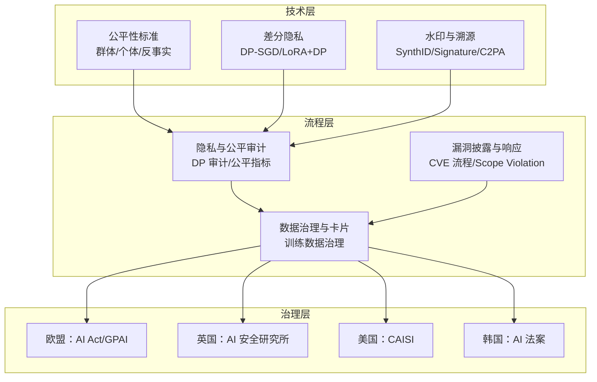
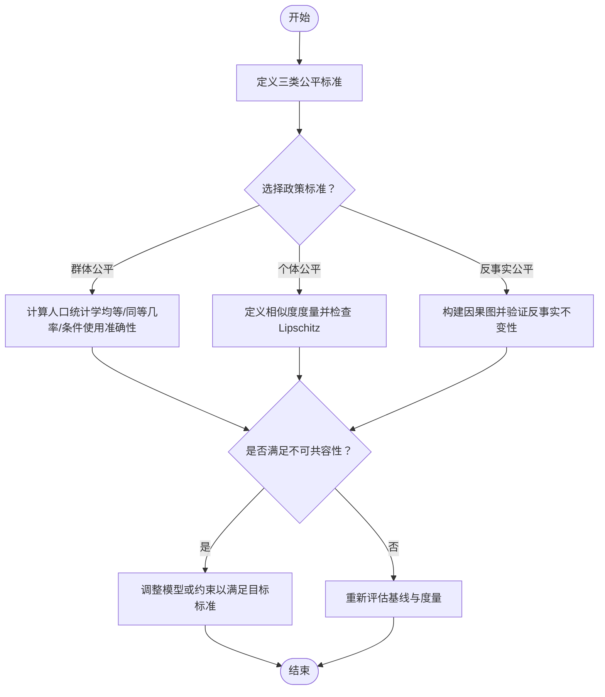
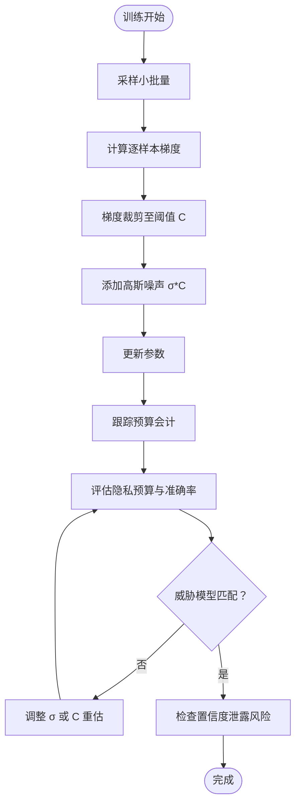
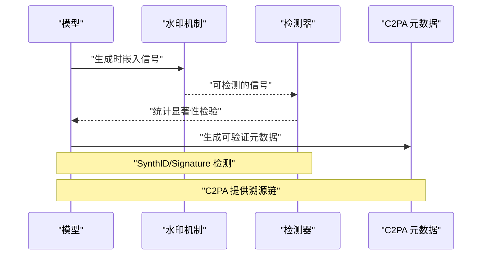
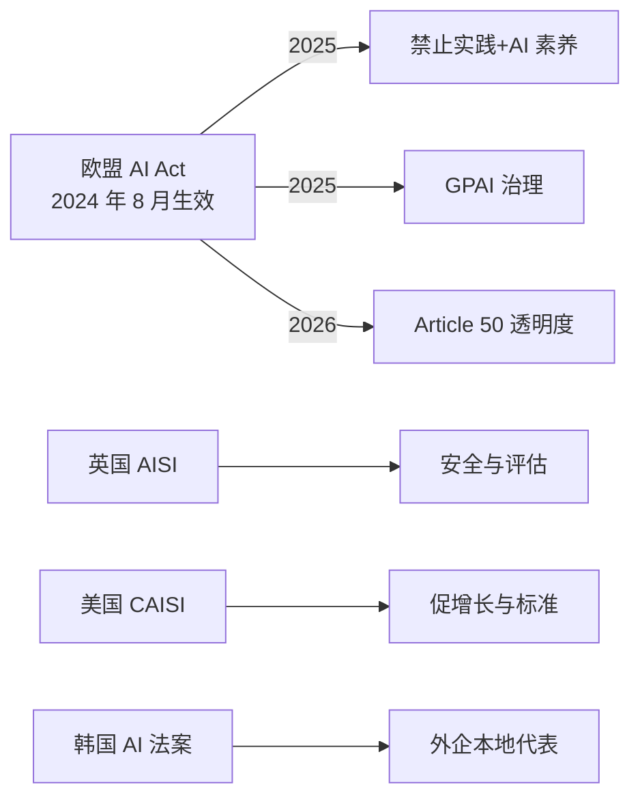
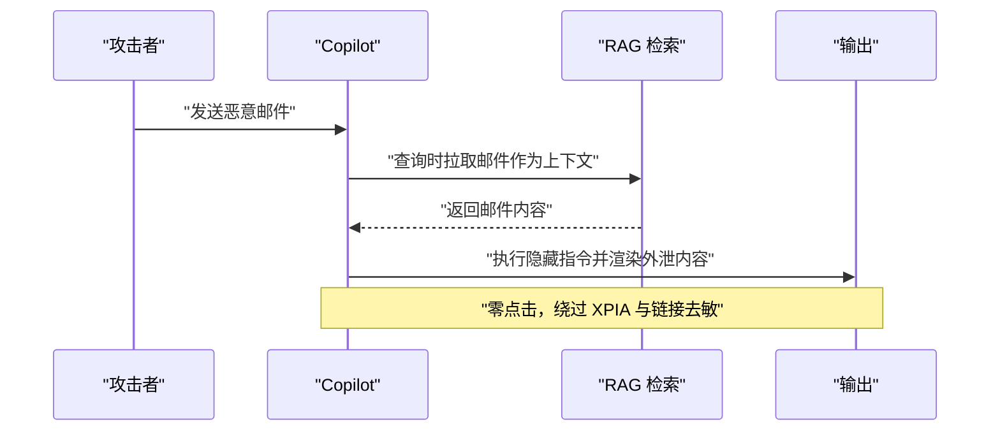
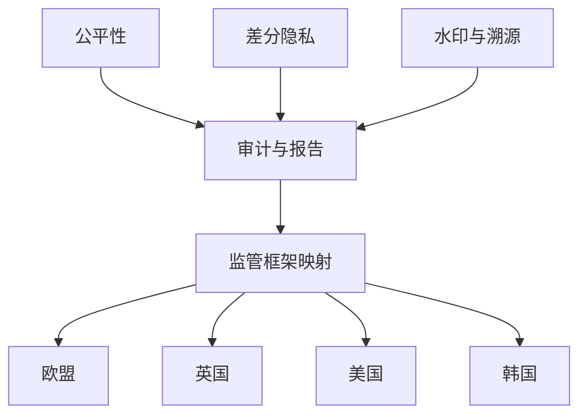

# 合规标准与监管

<cite>
**本文引用的文件**
- [公平性标准：群体与个体反事实公平](file://phases/18-ethics-safety-alignment/21-fairness-criteria-group-individual-counterfactual/docs/en.md)
- [LLM 差分隐私技术](file://phases/18-ethics-safety-alignment/22-differential-privacy-for-llms/docs/en.md)
- [水印技术：SynthID、Stable Signature、C2PA](file://phases/18-ethics-safety-alignment/23-watermarking-synthid-stable-signature-c2pa/docs/en.md)
- [监管框架：欧盟、美国、英国、韩国](file://phases/18-ethics-safety-alignment/24-regulatory-frameworks-eu-us-uk-korea/docs/en.md)
- [EchoLeak 与 AI 相关的 CVE 漏洞](file://phases/18-ethics-safety-alignment/25-echoleak-cves-for-ai/docs/en.md)
</cite>

## 目录
1. 引言
2. 项目结构
3. 核心组件
4. 架构总览
5. 详细组件分析
6. 依赖关系分析
7. 性能考量
8. 故障排查指南
9. 结论
10. 附录

## 引言
本文件面向企业与工程团队，系统化梳理“合规标准与监管”主题下的三大技术支柱与两大制度体系：群体与个人反事实公平性标准、LLM 差分隐私技术、以及水印与溯源（SynthID、Stable Signature、C2PA）；并结合欧盟、美国、英国、韩国等主要司法辖区的 AI 监管框架，给出可落地的合规实施路径与最佳实践。同时，结合 EchoLeak 等 AI 相关 CVE 的漏洞管理经验，形成从技术到流程再到治理的闭环。

## 项目结构
本仓库在“伦理、安全与对齐”阶段提供了与合规直接相关的核心课程模块，涵盖公平性、隐私、溯源与监管四类主题，并配套输出成果与练习，便于企业对照自身部署进行差距评估与改进。

图示来源
- [公平性标准：群体与个体反事实公平:1-101](file://phases/18-ethics-safety-alignment/21-fairness-criteria-group-individual-counterfactual/docs/en.md#L1-L101)
- [LLM 差分隐私技术:1-112](file://phases/18-ethics-safety-alignment/22-differential-privacy-for-llms/docs/en.md#L1-L112)
- [水印技术：SynthID、Stable Signature、C2PA:1-115](file://phases/18-ethics-safety-alignment/23-watermarking-synthid-stable-signature-c2pa/docs/en.md#L1-L115)
- [监管框架：欧盟、美国、英国、韩国:1-124](file://phases/18-ethics-safety-alignment/24-regulatory-frameworks-eu-us-uk-korea/docs/en.md#L1-L124)
- [EchoLeak 与 AI 相关的 CVE 漏洞:1-109](file://phases/18-ethics-safety-alignment/25-echoleak-cves-for-ai/docs/en.md#L1-L109)

章节来源
- [公平性标准：群体与个体反事实公平:1-101](file://phases/18-ethics-safety-alignment/21-fairness-criteria-group-individual-counterfactual/docs/en.md#L1-L101)
- [LLM 差分隐私技术:1-112](file://phases/18-ethics-safety-alignment/22-differential-privacy-for-llms/docs/en.md#L1-L112)
- [水印技术：SynthID、Stable Signature、C2PA:1-115](file://phases/18-ethics-safety-alignment/23-watermarking-synthid-stable-signature-c2pa/docs/en.md#L1-L115)
- [监管框架：欧盟、美国、英国、韩国:1-124](file://phases/18-ethics-safety-alignment/24-regulatory-frameworks-eu-us-uk-korea/docs/en.md#L1-L124)
- [EchoLeak 与 AI 相关的 CVE 漏洞:1-109](file://phases/18-ethics-safety-alignment/25-echoleak-cves-for-ai/docs/en.md#L1-L109)

## 核心组件
- 群体与个体反事实公平性标准：明确三类公平准则（群体公平、个体公平、反事实公平），并讨论不可共容性与法律干预问题，为企业在模型训练与上线前的公平性设计提供方法论。
- LLM 差分隐私：系统讲解 (ε, δ)-差分隐私与 DP-SGD 标准流程，覆盖 LoRA + DP-SGD 的高效微调配置、可验证性与审计要点，以及新兴攻击（如基于置信度的隐私反转）与防御建议。
- 水印与溯源：SynthID（跨模态）、Stable Signature（图像）、C2PA（可信元数据）三者互补，分别承担“生成信号”和“可验证元信息”的职责，并结合 EU AI Act 的透明度义务。
- 监管框架：梳理 EU AI Act、GPAI 行为准则、UK AISI、US CAISI、Korea AI Framework Act 的适用范围、时间线与核心义务，指导企业进行多法域合规映射。
- AI CVE 与漏洞管理：以 EchoLeak 为例，定义“LLM 作用域违规”（LLM Scope Violation）威胁模型，提出三边界控制（检索、作用域、输出）与披露流程建议。

章节来源
- [公平性标准：群体与个体反事实公平:10-82](file://phases/18-ethics-safety-alignment/21-fairness-criteria-group-individual-counterfactual/docs/en.md#L10-L82)
- [LLM 差分隐私技术:10-92](file://phases/18-ethics-safety-alignment/22-differential-privacy-for-llms/docs/en.md#L10-L92)
- [水印技术：SynthID、Stable Signature、C2PA:10-95](file://phases/18-ethics-safety-alignment/23-watermarking-synthid-stable-signature-c2pa/docs/en.md#L10-L95)
- [监管框架：欧盟、美国、英国、韩国:10-105](file://phases/18-ethics-safety-alignment/24-regulatory-frameworks-eu-us-uk-korea/docs/en.md#L10-L105)
- [EchoLeak 与 AI 相关的 CVE 漏洞:10-90](file://phases/18-ethics-safety-alignment/25-echoleak-cves-for-ai/docs/en.md#L10-L90)

## 架构总览
下图展示合规体系中“技术—流程—治理”的三层架构：技术层包含公平性、差分隐私与水印溯源；流程层包括数据治理、审计与漏洞披露；治理层由多法域监管框架驱动。

图示来源
- [LLM 差分隐私技术:73-79](file://phases/18-ethics-safety-alignment/22-differential-privacy-for-llms/docs/en.md#L73-L79)
- [水印技术：SynthID、Stable Signature、C2PA:80-82](file://phases/18-ethics-safety-alignment/23-watermarking-synthid-stable-signature-c2pa/docs/en.md#L80-L82)
- [监管框架：欧盟、美国、英国、韩国:86-92](file://phases/18-ethics-safety-alignment/24-regulatory-frameworks-eu-us-uk-korea/docs/en.md#L86-L92)
- [EchoLeak 与 AI 相关的 CVE 漏洞:71-77](file://phases/18-ethics-safety-alignment/25-echoleak-cves-for-ai/docs/en.md#L71-L77)

## 详细组件分析

### 组件一：公平性标准（群体/个体/反事实）
- 群体公平：包括人口统计学均等、同等几率、条件使用准确性相等；存在不可共容性定理（基率不等时三者不可同时满足）。
- 个体公平：基于相似输入应得到相似决策的 Lipschitz 条件，强调相似度度量的政策选择性。
- 反事实公平：在因果图下，敏感属性的反事实改变不应影响决策；2024 年理论指出存在准确率-反事实公平权衡；回溯式反事实避免对受保护属性的干预，更易满足法律合规。
- 哲学整合：在给定因果图的前提下，某些群体公平与反事实公平可互为表里，但无法解决基率不等导致的不可共容性。

图示来源
- [公平性标准：群体与个体反事实公平:23-57](file://phases/18-ethics-safety-alignment/21-fairness-criteria-group-individual-counterfactual/docs/en.md#L23-L57)

章节来源
- [公平性标准：群体与个体反事实公平:10-82](file://phases/18-ethics-safety-alignment/21-fairness-criteria-group-individual-counterfactual/docs/en.md#L10-L82)

### 组件二：LLM 差分隐私技术
- (ε, δ)-差分隐私：对任意单个样本扰动，输出分布需近似一致；DP-SGD 是标准训练范式，包含梯度裁剪与高斯噪声注入。
- 实践配置：LoRA + DP-SGD 在参数效率与隐私保障之间取得平衡；不同威胁模型下 ε 值差异较大，需结合预算会计与实用目标审慎选择。
- 新兴证据与攻防：2024-2025 年间“插入金丝雀的成员推断”与“训练数据提取”呈现矛盾，后文研究指出二者测量对象不同；PMixED 提供推理时差分隐私替代方案；隐私反转（基于置信度）成为新攻击面，需限制置信度暴露。
- 审计要点：核验 ε/δ、使用的预算会计、MIA 评估协议、以及是否评估置信度泄露向量。

图示来源
- [LLM 差分隐私技术:30-44](file://phases/18-ethics-safety-alignment/22-differential-precision-for-llms/docs/en.md#L30-L44)

章节来源
- [LLM 差分隐私技术:10-92](file://phases/18-ethics-safety-alignment/22-differential-privacy-for-llms/docs/en.md#L10-L92)

### 组件三：水印与溯源（SynthID、Stable Signature、C2PA）
- SynthID（文本）：在解码步通过哈希决定词汇分区并偏向绿色集合，从而在统计上可检测；具备跨模态统一探测器（文本/图像/音频/视频）。
- Stable Signature（图像）：微调潜在扩散解码器嵌入固定消息，检测来自潜在空间；2024 年研究指出可通过后处理微调移除水印。
- C2PA：基于签名的可信元数据标准，承载丰富链路信息，但易被剥离；与水印互补：前者信息丰富、后者持久性强。
- 法律与监管：EU AI Act Article 50 要求对生成内容进行透明度标注，推动技术落地。

图示来源
- [水印技术：SynthID、Stable Signature、C2PA:23-67](file://phases/18-ethics-safety-alignment/23-watermarking-synthid-stable-signature-c2pa/docs/en.md#L23-L67)

章节来源
- [水印技术：SynthID、Stable Signature、C2PA:10-95](file://phases/18-ethics-safety-alignment/23-watermarking-synthid-stable-signature-c2pa/docs/en.md#L10-L95)

### 组件四：监管框架（欧盟、美国、英国、韩国）
- 欧盟：AI Act 分级治理（禁止、高风险、通用基础模型、有限风险），2025 年起逐步生效；GPAI 行为准则（透明、版权、安全与安保）自 2026 年 8 月起强制执行；Article 50 透明度规则于 2026 年 8 月生效。
- 英国：AI 安全研究所（AISI）更名为 AI 安全研究所，聚焦前沿能力安全；开源 Inspect 评估工具。
- 美国：AI 安全研究所改组为国家标准化与创新中心（CAISI），强调“促增长”政策取向，减少预部署评估，强化标准与创新支持。
- 韩国：AI 法案（2024 年 12 月通过，2025 年 1 月生效）建立 MSIT 下的 AISI，要求外企本地代表、高影响力 AI 风险评估与安全措施。

图示来源
- [监管框架：欧盟、美国、英国、韩国:23-71](file://phases/18-ethics-safety-alignment/24-regulatory-frameworks-eu-us-uk-korea/docs/en.md#L23-L71)

章节来源
- [监管框架：欧盟、美国、英国、韩国:10-105](file://phases/18-ethics-safety-alignment/24-regulatory-frameworks-eu-us-uk-korea/docs/en.md#L10-L105)

### 组件五：EchoLeak 与 AI 相关 CVE 管理
- EchoLeak（CVE-2025-32711，CVSS 9.3）：零点击提示注入，利用 RAG 将外部未受信任输入纳入上下文，触发特权作用域访问与数据外泄；绕过 XPIA 过滤与链接去敏。
- LLM 作用域违规（LLM Scope Violation）：将 OS 层“作用域违规”类比到 LLM 层，强调“检索边界、作用域边界、输出边界”必须独立控制。
- 相关事件：CamoLeak（CVSS 9.6，GitHub Copilot Chat）通过图像代理触发远程执行；另见 Copilot RCE（CVE-2025-53773）。
- 演练与防御：通过状态转换日志重建攻击轨迹；简单隔离策略（阻断由不受信任内容触发的工具调用）即可有效阻止外泄。

图示来源
- [EchoLeak 与 AI 相关的 CVE 漏洞:23-47](file://phases/18-ethics-safety-alignment/25-echoleak-cves-for-ai/docs/en.md#L23-L47)

章节来源
- [EchoLeak 与 AI 相关的 CVE 漏洞:10-90](file://phases/18-ethics-safety-alignment/25-echoleak-cves-for-ai/docs/en.md#L10-L90)

## 依赖关系分析
- 技术依赖：公平性与差分隐私共同服务于“可审计的负责任 AI”，水印与溯源则为监管透明度提供技术抓手；监管框架驱动技术与流程的落地边界。
- 多法域依赖：企业若在多司法辖区运营，通常以最严格规则为准（2026 年多为 EU AI Act），需在产品设计阶段即考虑合规映射与控制矩阵。

图示来源
- [监管框架：欧盟、美国、英国、韩国:86-92](file://phases/18-ethics-safety-alignment/24-regulatory-frameworks-eu-us-uk-korea/docs/en.md#L86-L92)
- [LLM 差分隐私技术:73-79](file://phases/18-ethics-safety-alignment/22-differential-privacy-for-llms/docs/en.md#L73-L79)
- [水印技术：SynthID、Stable Signature、C2PA:80-82](file://phases/18-ethics-safety-alignment/23-watermarking-synthid-stable-signature-c2pa/docs/en.md#L80-L82)

章节来源
- [监管框架：欧盟、美国、英国、韩国:82-92](file://phases/18-ethics-safety-alignment/24-regulatory-frameworks-eu-us-uk-korea/docs/en.md#L82-L92)
- [LLM 差分隐私技术:69-79](file://phases/18-ethics-safety-alignment/22-differential-privacy-for-llms/docs/en.md#L69-L79)
- [水印技术：SynthID、Stable Signature、C2PA:72-82](file://phases/18-ethics-safety-alignment/23-watermarking-synthid-stable-signature-c2pa/docs/en.md#L72-L82)

## 性能考量
- 公平性：群体公平与个体/反事实公平在不同度量下可能产生冲突，需在业务目标与法律约束之间权衡；回溯式反事实可降低对受保护属性干预的法律风险。
- 差分隐私：LoRA + DP-SGD 在参数效率与隐私预算之间折中；较低 ε 值带来更强隐私但更大效用损失，需结合威胁模型与预算会计进行动态调优；注意隐私反转攻击对置信度泄露的额外防护。
- 水印与溯源：SynthID 跨模态统一检测器提升覆盖率；图像水印易受后处理微调移除，需引入发布签名与版本治理；C2PA 元数据可被剥离，应与水印组合使用。
- 监管与流程：多法域合规会增加开发与审计成本，建议在设计阶段即纳入合规控制矩阵与披露流程，避免后期返工。

## 故障排查指南
- 公平性问题
  - 症状：不同群体的 TPR/FPR/PPV 不一致；相似样本获得不同决策。
  - 排查：计算三类群体公平指标，检查是否存在不可共容性；评估个体公平 Lipschitz 常数与相似度度量；采用回溯式反事实视角审视敏感属性干预问题。
- 差分隐私问题
  - 症状：隐私预算耗尽或效用大幅下降；成员推断成功率异常。
  - 排查：核验 DP-SGD 参数（σ、C）与预算会计；确认是否进行金丝雀 MIA 评估；检查置信度暴露是否受限。
- 水印与溯源问题
  - 症状：跨模态检测失败；图像水印被移除；C2PA 元数据缺失。
  - 排查：验证 SynthID 检测阈值与 z-score；评估 Stable Signature 是否被后处理微调破坏；确保 C2PA 签名链完整且平台支持解析。
- CVE 与 Scope Violation
  - 症状：零点击提示注入导致数据外泄；检索边界被绕过。
  - 排查：重建攻击轨迹，验证三边界控制是否独立落实；限制输出目的地与工具调用来源；完善披露与响应流程。

章节来源
- [公平性标准：群体与个体反事实公平:71-82](file://phases/18-ethics-safety-alignment/21-fairness-criteria-group-individual-counterfactual/docs/en.md#L71-L82)
- [LLM 差分隐私技术:73-92](file://phases/18-ethics-safety-alignment/22-differential-privacy-for-llms/docs/en.md#L73-L92)
- [水印技术：SynthID、Stable Signature、C2PA:76-95](file://phases/18-ethics-safety-alignment/23-watermarking-synthid-stable-signature-c2pa/docs/en.md#L76-L95)
- [EchoLeak 与 AI 相关的 CVE 漏洞:71-90](file://phases/18-ethics-safety-alignment/25-echoleak-cves-for-ai/docs/en.md#L71-L90)

## 结论
企业应在产品设计阶段即嵌入公平性、差分隐私与水印溯源等技术控制，并依据多法域监管框架（尤其是 EU AI Act）制定合规路线图。结合 EchoLeak 等真实 CVE 的教训，建立覆盖“检索—作用域—输出”的三边界控制与漏洞披露流程，形成从技术到治理的闭环，持续迭代以应对不断演进的威胁与法规环境。

## 附录
- 术语速览
  - 群体公平：人口统计学均等、同等几率、条件使用准确性相等
  - 个体公平：Lipschitz 条件下的相似输入相似决策
  - 反事实公平：敏感属性反事实改变不影响决策
  - 差分隐私：(ε, δ)-差分隐私与 DP-SGD
  - SynthID：跨模态水印信号
  - Stable Signature：图像水印（潜在空间嵌入）
  - C2PA：可信元数据标准
  - LLM Scope Violation：LLM 作用域违规威胁模型