# 安全漏洞管理

<cite>
**本文引用的文件**
- [guardrails-sandbox/backend/main.py](file://guardrails-sandbox/backend/main.py)
- [guardrails-sandbox/backend/pipeline.py](file://guardrails-sandbox/backend/pipeline.py)
- [guardrails-sandbox/backend/adapters/base.py](file://guardrails-sandbox/backend/adapters/base.py)
- [guardrails-sandbox/backend/adapters/injection.py](file://guardrails-sandbox/backend/adapters/injection.py)
- [guardrails-sandbox/backend/adapters/prompt_leak.py](file://guardrails-sandbox/backend/adapters/prompt_leak.py)
- [guardrails-sandbox/backend/adapters/pii_detector.py](file://guardrails-sandbox/backend/adapters/pii_detector.py)
- [guardrails-sandbox/backend/adapters/format_validator.py](file://guardrails-sandbox/backend/adapters/format_validator.py)
- [guardrails-sandbox/backend/adapters/toxicity.py](file://guardrails-sandbox/backend/adapters/toxicity.py)
- [phases/18-ethics-safety-alignment/25-echoleak-cves-for-ai/README.md](file://phases/18-ethics-safety-alignment/25-echoleak-cves-for-ai/README.md)
- [site/data.js](file://site/data.js)
- [site/figures-agents-alignment.js](file://site/figures-agents-alignment.js)
- [phases/19-capstone-projects/87-end-to-end-safety-gate/code/safety_gate.py](file://phases/19-capstone-projects/87-end-to-end-safety-gate/code/safety_gate.py)
</cite>

## 目录
1. [引言](#引言)
2. [项目结构](#项目结构)
3. [核心组件](#核心组件)
4. [架构总览](#架构总览)
5. [详细组件分析](#详细组件分析)
6. [依赖分析](#依赖分析)
7. [性能考虑](#性能考虑)
8. [故障排查指南](#故障排查指南)
9. [结论](#结论)
10. [附录](#附录)

## 引言
本技术文档围绕AI安全漏洞管理展开，聚焦于EchoLeak漏洞发现平台在AI领域的应用与威胁建模方法，系统梳理AI系统常见CVE漏洞类型（模型投毒、后门攻击、推理攻击等），并给出分类、评级与修复策略。文档还覆盖AI供应链安全与第三方组件风险管理、漏洞扫描工具与检测方法的使用指南，并结合仓库中的安全沙箱与端到端安全门控实现进行实操参考。

## 项目结构
本仓库包含完整的AI工程学习路径与安全主题课程，其中与安全漏洞管理直接相关的核心模块位于：
- guardrails-sandbox：基于FastAPI的交互式安全沙箱，内置多层Guardrails适配器，支持输入/输出拦截与统计分析
- phases/18-ethics-safety-alignment/25-echoleak-cves-for-ai：EchoLeak与AI相关CVE专题课程
- site/data.js：课程技能标签与索引，包含echoleak、cve等关键词
- 其他capstone项目中的安全门控实现，体现端到端安全策略

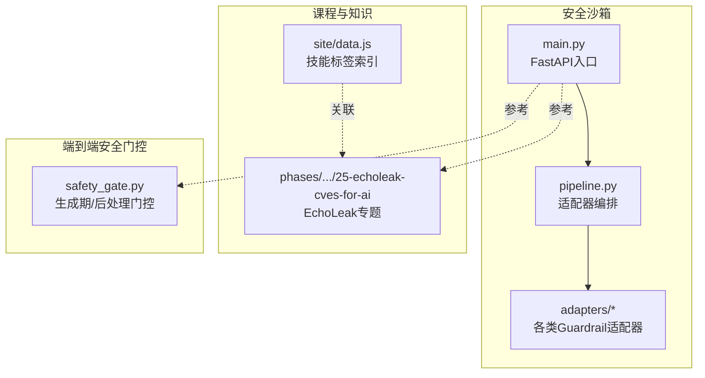

**图表来源**
- [guardrails-sandbox/backend/main.py:1-421](file://guardrails-sandbox/backend/main.py#L1-L421)
- [guardrails-sandbox/backend/pipeline.py:1-285](file://guardrails-sandbox/backend/pipeline.py#L1-L285)
- [phases/18-ethics-safety-alignment/25-echoleak-cves-for-ai/README.md](file://phases/18-ethics-safety-alignment/25-echoleak-cves-for-ai/README.md)
- [site/data.js:18440-18484](file://site/data.js#L18440-L18484)
- [phases/19-capstone-projects/87-end-to-end-safety-gate/code/safety_gate.py:121-182](file://phases/19-capstone-projects/87-end-to-end-safety-gate/code/safety_gate.py#L121-L182)

**章节来源**
- [guardrails-sandbox/backend/main.py:1-421](file://guardrails-sandbox/backend/main.py#L1-L421)
- [guardrails-sandbox/backend/pipeline.py:1-285](file://guardrails-sandbox/backend/pipeline.py#L1-L285)
- [site/data.js:18440-18484](file://site/data.js#L18440-L18484)

## 核心组件
- 适配器基类与结果模型
  - GuardrailAdapter：定义统一接口与元信息（分组、类别、顺序、启用状态）
  - GuardrailResult：封装检查结果（通过/拒绝、置信度、耗时、详情）
- 输入/输出拦截管线
  - Pipeline：注册、排序、短路执行、统计与拦截历史记录
- 典型适配器
  - 注入检测（提示注入、编码绕过）
  - Prompt泄露检测（系统提示关键词与元指令标志）
  - PII检测（手机号、邮箱、身份证、信用卡等）
  - 格式校验（JSON/代码块/空输出）
  - 毒性过滤（暴力、违法、自残、仇恨、色情）
- EchoLeak与CVE专题
  - 课程README提供EchoLeak与AI相关CVE的威胁建模与实践要点
- 端到端安全门控
  - 生成期窗口检测与后处理规则引擎评估

**章节来源**
- [guardrails-sandbox/backend/adapters/base.py:1-34](file://guardrails-sandbox/backend/adapters/base.py#L1-L34)
- [guardrails-sandbox/backend/pipeline.py:12-285](file://guardrails-sandbox/backend/pipeline.py#L12-L285)
- [guardrails-sandbox/backend/adapters/injection.py:1-88](file://guardrails-sandbox/backend/adapters/injection.py#L1-L88)
- [guardrails-sandbox/backend/adapters/prompt_leak.py:1-94](file://guardrails-sandbox/backend/adapters/prompt_leak.py#L1-L94)
- [guardrails-sandbox/backend/adapters/pii_detector.py:1-54](file://guardrails-sandbox/backend/adapters/pii_detector.py#L1-L54)
- [guardrails-sandbox/backend/adapters/format_validator.py:1-86](file://guardrails-sandbox/backend/adapters/format_validator.py#L1-L86)
- [guardrails-sandbox/backend/adapters/toxicity.py:1-63](file://guardrails-sandbox/backend/adapters/toxicity.py#L1-L63)
- [phases/18-ethics-safety-alignment/25-echoleak-cves-for-ai/README.md](file://phases/18-ethics-safety-alignment/25-echoleak-cves-for-ai/README.md)
- [phases/19-capstone-projects/87-end-to-end-safety-gate/code/safety_gate.py:121-182](file://phases/19-capstone-projects/87-end-to-end-safety-gate/code/safety_gate.py#L121-L182)

## 架构总览
下图展示安全沙箱的整体请求流：客户端请求进入后，先经输入适配器链路短路拦截，若通过再调用LLM，随后进入输出适配器链路进行脱敏与二次拦截；同时提供对比模式、基准测试、MCP工具调用等扩展能力。

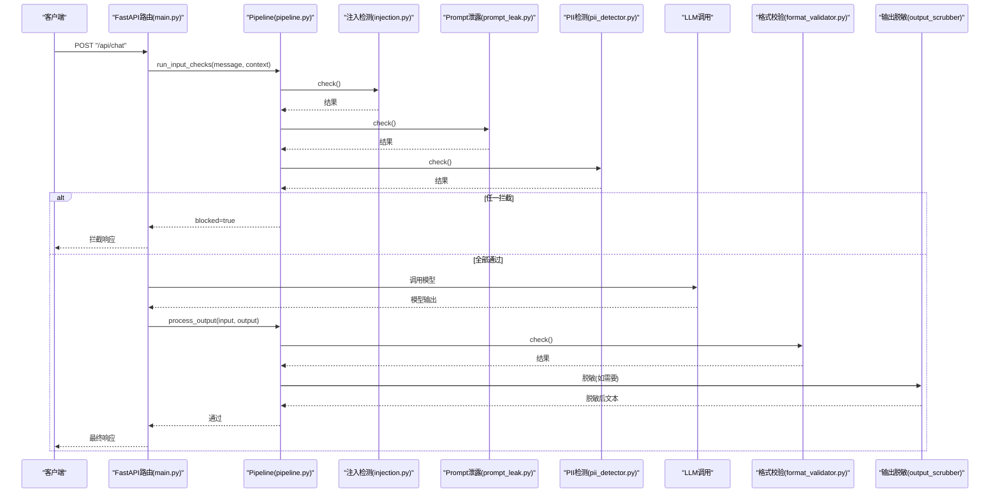

**图表来源**
- [guardrails-sandbox/backend/main.py:155-220](file://guardrails-sandbox/backend/main.py#L155-L220)
- [guardrails-sandbox/backend/pipeline.py:31-160](file://guardrails-sandbox/backend/pipeline.py#L31-L160)
- [guardrails-sandbox/backend/adapters/injection.py:53-87](file://guardrails-sandbox/backend/adapters/injection.py#L53-L87)
- [guardrails-sandbox/backend/adapters/prompt_leak.py:44-93](file://guardrails-sandbox/backend/adapters/prompt_leak.py#L44-L93)
- [guardrails-sandbox/backend/adapters/pii_detector.py:28-53](file://guardrails-sandbox/backend/adapters/pii_detector.py#L28-L53)
- [guardrails-sandbox/backend/adapters/format_validator.py:22-85](file://guardrails-sandbox/backend/adapters/format_validator.py#L22-L85)

## 详细组件分析

### 组件A：适配器基类与结果模型
- 设计要点
  - 统一的check(text, context)接口，便于扩展新适配器
  - GuardrailResult标准化返回，包含通过/拒绝、置信度、耗时与细节
  - 通过group/category/order控制UI树形结构与执行顺序
- 复杂度与性能
  - 单次check为O(n)正则匹配或简单字符串检索，整体开销可控
  - 建议在高频场景下缓存正则编译结果与静态模式

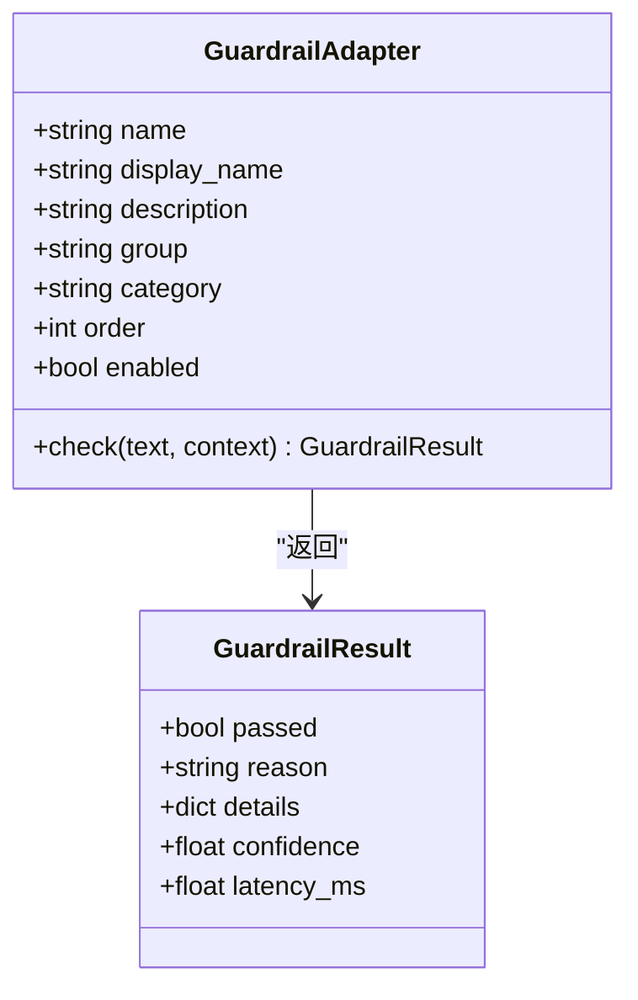

**图表来源**
- [guardrails-sandbox/backend/adapters/base.py:5-34](file://guardrails-sandbox/backend/adapters/base.py#L5-L34)

**章节来源**
- [guardrails-sandbox/backend/adapters/base.py:1-34](file://guardrails-sandbox/backend/adapters/base.py#L1-L34)

### 组件B：注入检测（提示注入）
- 功能概述
  - 正则匹配已知注入模式（英文与中文），并检测编码绕过
  - 输出最大置信度与命中详情，超过阈值即拦截
- 算法流程

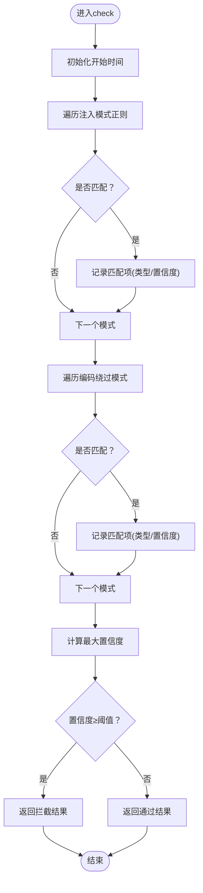

**图表来源**
- [guardrails-sandbox/backend/adapters/injection.py:53-87](file://guardrails-sandbox/backend/adapters/injection.py#L53-L87)

**章节来源**
- [guardrails-sandbox/backend/adapters/injection.py:1-88](file://guardrails-sandbox/backend/adapters/injection.py#L1-L88)

### 组件C：Prompt泄露检测
- 功能概述
  - 支持两种检测方式：敏感短语匹配、系统提示关键词密度
  - 可通过set_system_prompt注入真实系统提示，提升检测精度
- 流程图

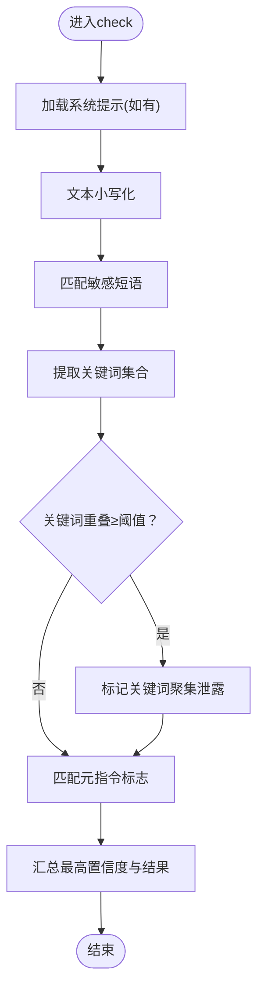

**图表来源**
- [guardrails-sandbox/backend/adapters/prompt_leak.py:44-93](file://guardrails-sandbox/backend/adapters/prompt_leak.py#L44-L93)

**章节来源**
- [guardrails-sandbox/backend/adapters/prompt_leak.py:1-94](file://guardrails-sandbox/backend/adapters/prompt_leak.py#L1-L94)

### 组件D：PII检测
- 功能概述
  - 检测手机号、邮箱、身份证、信用卡、IP地址等
  - 对高风险类型直接拦截，低误报类型仅警告
- 流程图

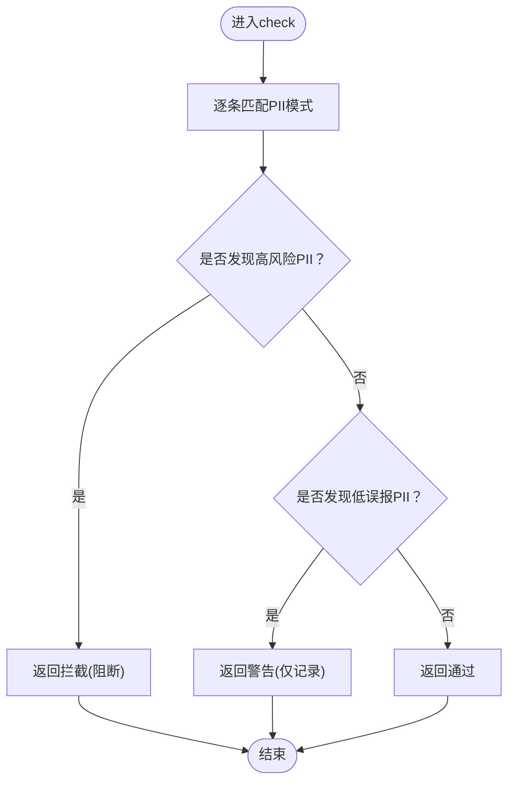

**图表来源**
- [guardrails-sandbox/backend/adapters/pii_detector.py:28-53](file://guardrails-sandbox/backend/adapters/pii_detector.py#L28-L53)

**章节来源**
- [guardrails-sandbox/backend/adapters/pii_detector.py:1-54](file://guardrails-sandbox/backend/adapters/pii_detector.py#L1-L54)

### 组件E：格式校验
- 功能概述
  - 校验JSON合法性、Markdown代码块闭合、空输出、显式要求返回JSON但未满足等
- 流程图

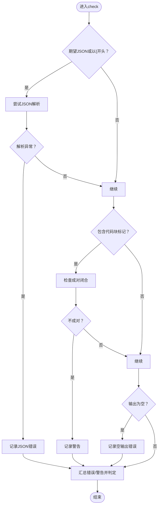

**图表来源**
- [guardrails-sandbox/backend/adapters/format_validator.py:22-85](file://guardrails-sandbox/backend/adapters/format_validator.py#L22-L85)

**章节来源**
- [guardrails-sandbox/backend/adapters/format_validator.py:1-86](file://guardrails-sandbox/backend/adapters/format_validator.py#L1-L86)

### 组件F：毒性过滤
- 功能概述
  - 检测暴力、违法、自残、仇恨、色情等敏感内容
  - 支持安全上下文豁免（如“如何预防”等）
- 流程图

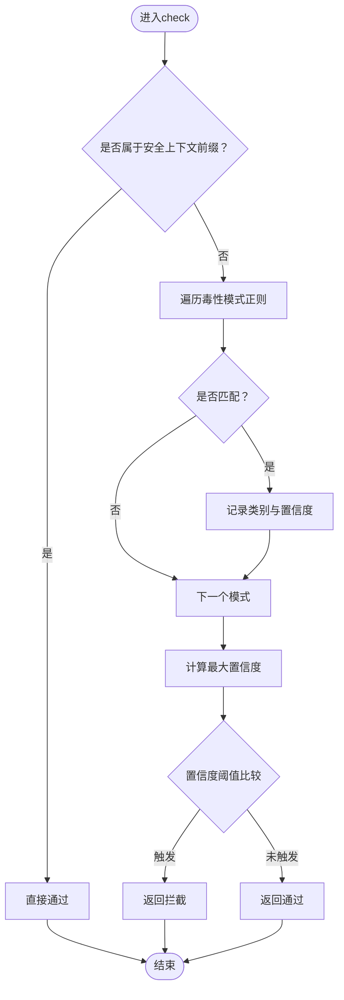

**图表来源**
- [guardrails-sandbox/backend/adapters/toxicity.py:31-63](file://guardrails-sandbox/backend/adapters/toxicity.py#L31-L63)

**章节来源**
- [guardrails-sandbox/backend/adapters/toxicity.py:1-63](file://guardrails-sandbox/backend/adapters/toxicity.py#L1-L63)

### 组件G：端到端安全门控（生成期/后处理）
- 功能概述
  - 生成期：滑动窗口匹配终止模式，支持提前终止与部分输出截断
  - 后处理：分类器动作与规则引擎评估，聚合信号决定放行/脱敏/警告/拦截
- 流程图

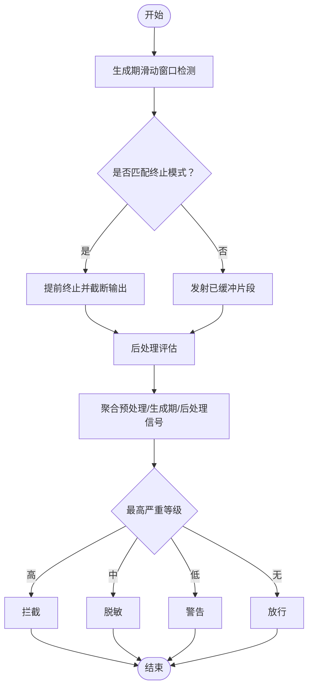

**图表来源**
- [phases/19-capstone-projects/87-end-to-end-safety-gate/code/safety_gate.py:121-182](file://phases/19-capstone-projects/87-end-to-end-safety-gate/code/safety_gate.py#L121-L182)

**章节来源**
- [phases/19-capstone-projects/87-end-to-end-safety-gate/code/safety_gate.py:121-182](file://phases/19-capstone-projects/87-end-to-end-safety-gate/code/safety_gate.py#L121-L182)

## 依赖分析
- 组件耦合
  - Pipeline集中编排适配器，遵循“输入短路、输出短路”的原则，降低耦合
  - 适配器间无直接依赖，通过统一接口与上下文传递参数
- 外部依赖
  - FastAPI、pydantic、正则表达式、SentenceTransformer（语义模型）
- 潜在风险
  - 正则误报/漏报需定期维护模式库
  - 语义模型加载需离线缓存避免并发HTTP连接问题

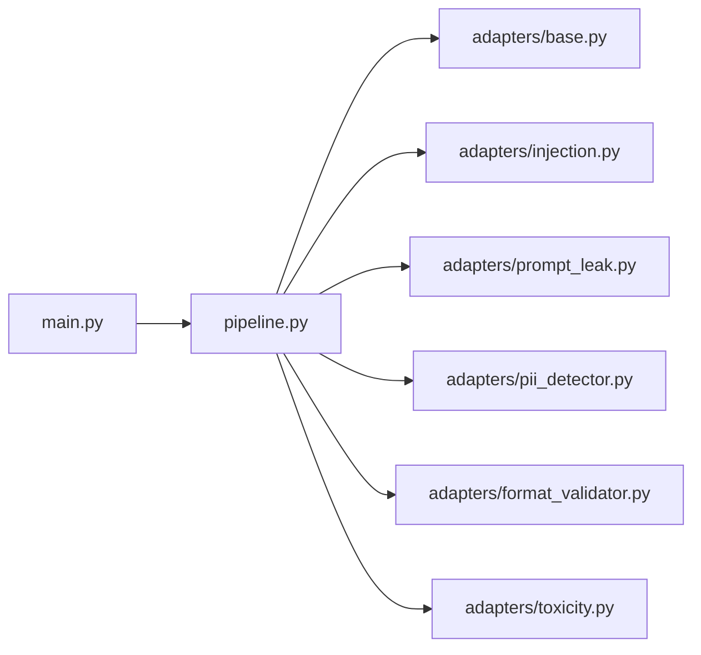

**图表来源**
- [guardrails-sandbox/backend/main.py:24-58](file://guardrails-sandbox/backend/main.py#L24-L58)
- [guardrails-sandbox/backend/pipeline.py:18-23](file://guardrails-sandbox/backend/pipeline.py#L18-L23)

**章节来源**
- [guardrails-sandbox/backend/main.py:24-58](file://guardrails-sandbox/backend/main.py#L24-L58)
- [guardrails-sandbox/backend/pipeline.py:18-23](file://guardrails-sandbox/backend/pipeline.py#L18-L23)

## 性能考虑
- 适配器执行顺序与短路
  - 将高置信度阈值、快速匹配的适配器前置（如注入检测、PII检测），减少后续开销
- 并发与模型加载
  - 预加载语义模型并强制离线，避免uvicorn异步环境下的HTTP连接问题
- 日志与统计
  - 通过Pipeline记录每层通过/拦截次数与拦截历史，便于定位热点与优化

**章节来源**
- [guardrails-sandbox/backend/main.py:62-76](file://guardrails-sandbox/backend/main.py#L62-L76)
- [guardrails-sandbox/backend/pipeline.py:25-56](file://guardrails-sandbox/backend/pipeline.py#L25-L56)

## 故障排查指南
- 常见问题
  - 请求被拦截：查看guardrail_logs中首个未通过的适配器，核对reason与details
  - LLM调用失败：关注llm_error阶段返回，检查消息格式与系统提示
  - 输出被拦截：确认输出适配器（格式校验、脱敏）是否触发
- 排查步骤
  - 使用对比模式（/api/chat/compare）对比开启/关闭Guardrails的效果
  - 通过切换适配器开关（/api/guardrails/toggle）定位具体适配器
  - 查看拦截历史（/api/guardrails/block-history）与统计数据（/api/guardrails）

**章节来源**
- [guardrails-sandbox/backend/main.py:147-220](file://guardrails-sandbox/backend/main.py#L147-L220)
- [guardrails-sandbox/backend/pipeline.py:264-285](file://guardrails-sandbox/backend/pipeline.py#L264-L285)

## 结论
本项目通过可插拔的Guardrails适配器与Pipeline编排，构建了面向AI系统的多层次安全防线。结合EchoLeak与CVE专题课程，能够系统化地识别与缓解提示注入、Prompt泄露、PII外泄、格式错误等典型风险。建议在生产环境中持续演进模式库、完善端到端门控策略，并将安全纳入CI/CD与供应链治理流程。

## 附录

### EchoLeak与AI相关CVE威胁建模
- EchoLeak作为漏洞发现平台，强调对LLM作用域违规（LLM Scope Violation）的识别与修复
- 常见AI系统CVE类型
  - 模型投毒：训练数据污染导致模型行为异常
  - 后门攻击：在训练/推理阶段植入隐蔽触发器
  - 推理攻击：提示注入、越狱、系统提示泄露等
- 分类与评级
  - 可参考CVSS或组织内部风险矩阵，结合影响面（数据、隐私、业务连续性）与利用难度
- 修复策略
  - 输入/输出双侧拦截、最小权限与特权分离、脱敏与审计日志、定期模式库更新与回归测试

**章节来源**
- [phases/18-ethics-safety-alignment/25-echoleak-cves-for-ai/README.md](file://phases/18-ethics-safety-alignment/25-echoleak-cves-for-ai/README.md)

### 漏洞扫描工具与检测方法使用指南
- 沙箱内置检测
  - 注入检测、Prompt泄露、PII检测、格式校验、毒性过滤
- 外部工具集成
  - MCP工具调用接口可用于接入外部扫描/合规工具
- 使用建议
  - 将Guardrails作为默认防御层，结合端到端安全门控与日志审计

**章节来源**
- [guardrails-sandbox/backend/main.py:324-356](file://guardrails-sandbox/backend/main.py#L324-L356)

### 安全门控最佳实践
- 生成期与后处理双轨制
  - 生成期提前终止潜在危险输出，后处理综合评估并分级处置
- 信号聚合与决策
  - 依据预处理、生成期、后处理三阶段信号，采用分级策略（放行/脱敏/警告/拦截）

**章节来源**
- [phases/19-capstone-projects/87-end-to-end-safety-gate/code/safety_gate.py:121-182](file://phases/19-capstone-projects/87-end-to-end-safety-gate/code/safety_gate.py#L121-L182)

### Guardrails可视化与教学资源
- Guardrails门禁流程图（概念示意）
  - 展示输入过滤、策略检查、输出过滤的有序安全门禁链路

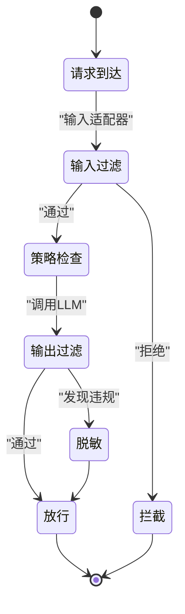

**图表来源**
- [site/figures-agents-alignment.js:366-391](file://site/figures-agents-alignment.js#L366-L391)