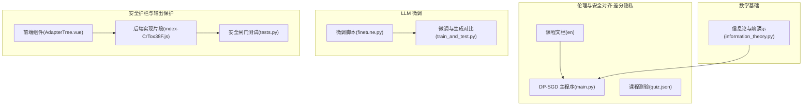
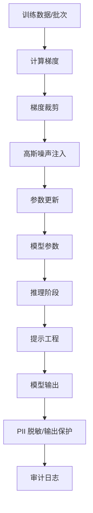
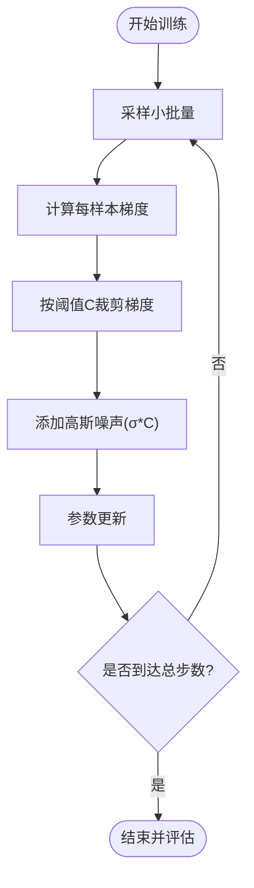
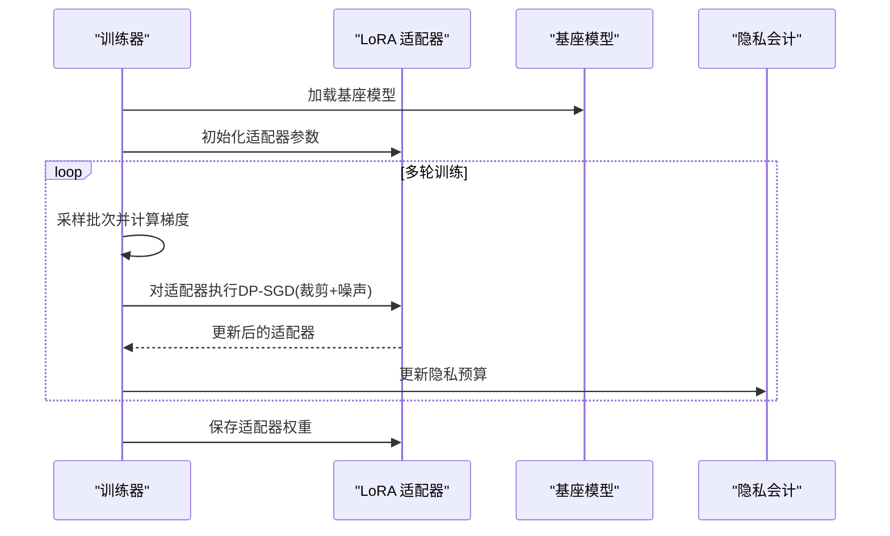
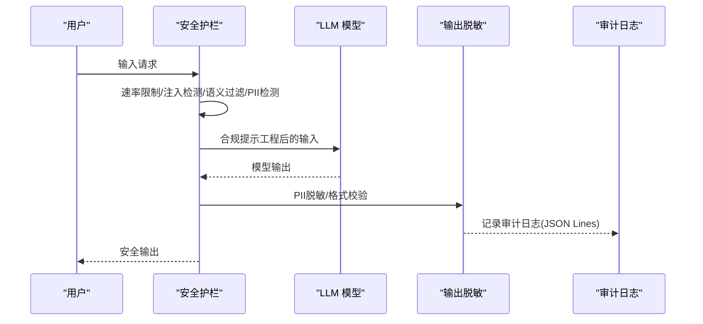
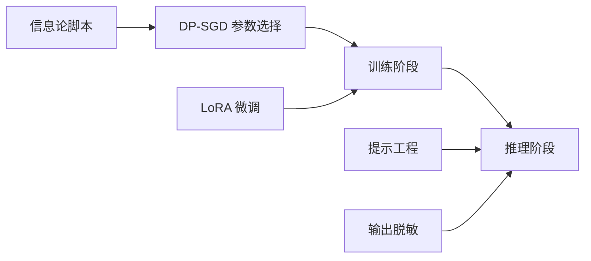

# 差分隐私技术

<cite>
**本文引用的文件**
- [差分隐私课程文档（英文）](file://phases/18-ethics-safety-alignment/22-differential-privacy-for-llms/docs/en.md)
- [差分隐私课程主程序](file://phases/18-ethics-safety-alignment/22-differential-privacy-for-llms/code/main.py)
- [伦理与安全课程测验（差分隐私）](file://phases/18-ethics-safety-alignment/22-differential-privacy-for-llms/quiz.json)
- [信息论与熵演示（包含高斯噪声与正则化关系）](file://phases/01-math-foundations/09-information-theory/code/information_theory.py)
- [LLM 微调脚本（LoRA 适配器保存与加载）](file://finetune.py)
- [LLM 微调与生成对比（适配器加载与推理）](file://train_and_test.py)
- [LLM 安全护栏前端组件（提示工程与输出保护）](file://guardrails-sandbox/frontend/src/components/AdapterTree.vue)
- [端到端安全闸门测试（输出脱敏与拦截）](file://phases/19-capstone-projects/87-end-to-end-safety-gate/code/tests.py)
- [LLM 安全护栏后端实现片段（PII 脱敏与审计日志）](file://site/summary/assets/index-CrTox38F.js)
</cite>

## 目录
1. [引言](#引言)
2. [项目结构](#项目结构)
3. [核心组件](#核心组件)
4. [架构总览](#架构总览)
5. [详细组件分析](#详细组件分析)
6. [依赖分析](#依赖分析)
7. [性能考虑](#性能考虑)
8. [故障排查指南](#故障排查指南)
9. [结论](#结论)
10. [附录](#附录)

## 引言
本技术文档围绕大语言模型（LLM）中的差分隐私（Differential Privacy, DP）展开，系统梳理 ε-差分隐私与 δ-差分隐私的数学定义，讲解拉普拉斯机制与指数机制在训练与推理中的应用，并结合仓库中“伦理与安全”课程中的 DP-SGD 实现，给出隐私预算分配策略、性能权衡与实用建议。同时，文档补充提示工程与输出保护在实际场景中的落地方法，帮助读者在工程实践中平衡隐私与效用。

## 项目结构
本仓库与差分隐私相关的核心资源集中在“伦理与安全对齐”阶段的第22课，配套有教学文档、可运行的 DP-SGD 示例与测验；同时，数学基础（信息论）与 LLM 微调（LoRA）脚本为理解 DP 的噪声注入与参数高效微调提供了背景知识；安全护栏与输出保护相关内容可用于部署期的隐私增强与审计。

**图示来源**
- [差分隐私课程文档（英文）](file://phases/18-ethics-safety-alignment/22-differential-privacy-for-llms/docs/en.md)
- [差分隐私课程主程序](file://phases/18-ethics-safety-alignment/22-differential-privacy-for-llms/code/main.py)
- [伦理与安全课程测验（差分隐私）](file://phases/18-ethics-safety-alignment/22-differential-privacy-for-llms/quiz.json)
- [信息论与熵演示（包含高斯噪声与正则化关系）](file://phases/01-math-foundations/09-information-theory/code/information_theory.py)
- [LLM 微调脚本（LoRA 适配器保存与加载）](file://finetune.py)
- [LLM 微调与生成对比（适配器加载与推理）](file://train_and_test.py)
- [LLM 安全护栏前端组件（提示工程与输出保护）](file://guardrails-sandbox/frontend/src/components/AdapterTree.vue)
- [端到端安全闸门测试（输出脱敏与拦截）](file://phases/19-capstone-projects/87-end-to-end-safety-gate/code/tests.py)
- [LLM 安全护栏后端实现片段（PII 脱敏与审计日志）](file://site/summary/assets/index-CrTox38F.js)

**章节来源**
- [差分隐私课程文档（英文）](file://phases/18-ethics-safety-alignment/22-differential-privacy-for-llms/docs/en.md)
- [差分隐私课程主程序](file://phases/18-ethics-safety-alignment/22-differential-privacy-for-llms/code/main.py)
- [伦理与安全课程测验（差分隐私）](file://phases/18-ethics-safety-alignment/22-differential-privacy-for-llms/quiz.json)
- [信息论与熵演示（包含高斯噪声与正则化关系）](file://phases/01-math-foundations/09-information-theory/code/information_theory.py)
- [LLM 微调脚本（LoRA 适配器保存与加载）](file://finetune.py)
- [LLM 微调与生成对比（适配器加载与推理）](file://train_and_test.py)
- [LLM 安全护栏前端组件（提示工程与输出保护）](file://guardrails-sandbox/frontend/src/components/AdapterTree.vue)
- [端到端安全闸门测试（输出脱敏与拦截）](file://phases/19-capstone-projects/87-end-to-end-safety-gate/code/tests.py)
- [LLM 安全护栏后端实现片段（PII 脱敏与审计日志）](file://site/summary/assets/index-CrTox38F.js)

## 核心组件
- 数学基础与噪声注入
  - 高斯噪声与正则化：信息论脚本展示了目标熵与正则化的联系，有助于理解噪声强度与泛化/正则化之间的关系，为 DP 的噪声规模选择提供直觉参考。
- DP-SGD 训练流程
  - 课程主程序实现了 DP-SGD 的最小可运行示例，包括梯度裁剪、高斯噪声注入与参数更新，用于演示隐私-效用权衡。
- 参数高效微调（LoRA）
  - 微调脚本与对比脚本展示了 LoRA 适配器的训练与加载流程，为“LoRA + DP-SGD”的常见配置提供工程基础。
- 提示工程与输出保护
  - 前端组件与后端实现展示了提示工程、输出脱敏与审计日志等在生产环境中的落地方法，为隐私预算之外的附加保护提供参考。
- 测验与学习目标
  - 测验与课程文档明确了关键概念、步骤与评估方法，便于自检与教学使用。

**章节来源**
- [信息论与熵演示（包含高斯噪声与正则化关系）](file://phases/01-math-foundations/09-information-theory/code/information_theory.py)
- [差分隐私课程主程序](file://phases/18-ethics-safety-alignment/22-differential-privacy-for-llms/code/main.py)
- [LLM 微调脚本（LoRA 适配器保存与加载）](file://finetune.py)
- [LLM 微调与生成对比（适配器加载与推理）](file://train_and_test.py)
- [LLM 安全护栏前端组件（提示工程与输出保护）](file://guardrails-sandbox/frontend/src/components/AdapterTree.vue)
- [伦理与安全课程测验（差分隐私）](file://phases/18-ethics-safety-alignment/22-differential-privacy-for-llms/quiz.json)

## 架构总览
下图展示从数据到模型再到输出的端到端流程，其中 DP-SGD 在训练阶段注入噪声以满足 (ε, δ)-差分隐私；提示工程与输出保护在推理阶段进一步降低隐私泄露风险；审计与拦截在部署期保障合规与可追溯。

**图示来源**
- [差分隐私课程主程序](file://phases/18-ethics-safety-alignment/22-differential-privacy-for-llms/code/main.py)
- [LLM 微调脚本（LoRA 适配器保存与加载）](file://finetune.py)
- [LLM 微调与生成对比（适配器加载与推理）](file://train_and_test.py)
- [LLM 安全护栏前端组件（提示工程与输出保护）](file://guardrails-sandbox/frontend/src/components/AdapterTree.vue)
- [LLM 安全护栏后端实现片段（PII 脱敏与审计日志）](file://site/summary/assets/index-CrTox38F.js)

## 详细组件分析

### 组件A：DP-SGD 训练流程
- 功能概述
  - 实现梯度裁剪、高斯噪声注入与参数更新，演示隐私预算与准确率的权衡。
- 关键步骤
  - 梯度裁剪：限制每条样本的梯度范数，避免单样本对全局更新影响过大。
  - 噪声注入：按比例添加高斯噪声，噪声强度与噪声倍数 σ 和裁剪阈值 C 相关。
  - 参数更新：使用带噪梯度进行参数迭代。
- 隐私预算估算
  - 使用近似高斯机制组合界估算 ε，辅助理解不同 σ 与步数对隐私的影响。
- 性能与效用
  - 较高的 σ 增加噪声，降低 ε，但可能损害准确率；需结合任务目标选择合适的预算与噪声规模。

**图示来源**
- [差分隐私课程主程序](file://phases/18-ethics-safety-alignment/22-differential-precision-for-llms/code/main.py)

**章节来源**
- [差分隐私课程主程序](file://phases/18-ethics-safety-alignment/22-differential-privacy-for-llms/code/main.py)

### 组件B：参数高效微调（LoRA + DP-SGD）
- 功能概述
  - 将 DP-SGD 应用于低秩适配器（LoRA），减少存储与计算开销，同时保持对适配器的 DP 保证。
- 工程要点
  - 仅对适配器参数注入噪声，基座模型固定，适合前沿大模型的高效微调。
  - 适配器保存与加载流程确保微调结果可复用与可部署。

**图示来源**
- [LLM 微调脚本（LoRA 适配器保存与加载）](file://finetune.py)
- [LLM 微调与生成对比（适配器加载与推理）](file://train_and_test.py)

**章节来源**
- [LLM 微调脚本（LoRA 适配器保存与加载）](file://finetune.py)
- [LLM 微调与生成对比（适配器加载与推理）](file://train_and_test.py)

### 组件C：提示工程与输出保护
- 功能概述
  - 在提示工程与输出保护层面降低隐私泄露风险，如防止系统提示词泄露、对输出进行 PII 脱敏与审计日志记录。
- 关键点
  - 前端组件涵盖多层护栏：速率限制、注入检测、语义过滤、PII 检测、毒性过滤、输出脱敏、相关性检查等。
  - 后端实现包含 PII 脱敏与审计日志，支持 JSON Lines 格式与告警联动。

**图示来源**
- [LLM 安全护栏前端组件（提示工程与输出保护）](file://guardrails-sandbox/frontend/src/components/AdapterTree.vue)
- [LLM 安全护栏后端实现片段（PII 脱敏与审计日志）](file://site/summary/assets/index-CrTox38F.js)
- [端到端安全闸门测试（输出脱敏与拦截）](file://phases/19-capstone-projects/87-end-to-end-safety-gate/code/tests.py)

**章节来源**
- [LLM 安全护栏前端组件（提示工程与输出保护）](file://guardrails-sandbox/frontend/src/components/AdapterTree.vue)
- [LLM 安全护栏后端实现片段（PII 脱敏与审计日志）](file://site/summary/assets/index-CrTox38F.js)
- [端到端安全闸门测试（输出脱敏与拦截）](file://phases/19-capstone-projects/87-end-to-end-safety-gate/code/tests.py)

### 组件D：隐私预算分配与评估
- 学习目标与测验
  - 课程文档与测验明确了 (ε, δ)-差分隐私的定义、DP-SGD 步骤、LoRA + DP-SGD 的配置、PMixED 与 DP 推理替代方案、DP 反演攻击与防御等关键主题。
- 实践建议
  - 在训练阶段采用 DP-SGD 并跟踪隐私预算；在推理阶段采用 PMixED 或输出脱敏等手段降低泄露面；对置信度暴露进行限制，避免 DP 反演。

**章节来源**
- [差分隐私课程文档（英文）](file://phases/18-ethics-safety-alignment/22-differential-privacy-for-llms/docs/en.md)
- [伦理与安全课程测验（差分隐私）](file://phases/18-ethics-safety-alignment/22-differential-privacy-for-llms/quiz.json)

## 依赖分析
- 组件耦合
  - DP-SGD 依赖于梯度裁剪与噪声注入，二者共同决定隐私预算与模型收敛行为。
  - LoRA + DP-SGD 将 DP 的适用范围扩展至参数高效微调，降低资源消耗。
  - 提示工程与输出保护作为部署期的补充，与 DP 形成“算法隐私 + 工程隐私”的双保险。
- 外部依赖
  - 信息论脚本为噪声强度与正则化的关系提供直观理解，有助于指导 DP 的参数选择。

**图示来源**
- [信息论与熵演示（包含高斯噪声与正则化关系）](file://phases/01-math-foundations/09-information-theory/code/information_theory.py)
- [差分隐私课程主程序](file://phases/18-ethics-safety-alignment/22-differential-privacy-for-llms/code/main.py)
- [LLM 微调脚本（LoRA 适配器保存与加载）](file://finetune.py)
- [LLM 安全护栏前端组件（提示工程与输出保护）](file://guardrails-sandbox/frontend/src/components/AdapterTree.vue)

**章节来源**
- [信息论与熵演示（包含高斯噪声与正则化关系）](file://phases/01-math-foundations/09-information-theory/code/information_theory.py)
- [差分隐私课程主程序](file://phases/18-ethics-safety-alignment/22-differential-privacy-for-llms/code/main.py)
- [LLM 微调脚本（LoRA 适配器保存与加载）](file://finetune.py)
- [LLM 安全护栏前端组件（提示工程与输出保护）](file://guardrails-sandbox/frontend/src/components/AdapterTree.vue)

## 性能考虑
- 计算与内存
  - DP-SGD 在每个样本上计算梯度并注入噪声，带来额外计算与通信开销；LoRA + DP-SGD 将更新限定在适配器，显著降低存储与通信压力。
- 效用损失
  - 噪声强度与隐私预算呈负相关：更低的 ε 需要更强的噪声，可能导致准确率下降；应结合任务目标与威胁模型选择合适的 σ 与 C。
- 推理效率
  - PMixED 等推理期 DP 方案可避免训练期的高成本，但需重新评估威胁模型与可用性。

## 故障排查指南
- 训练不稳定或效果差
  - 检查梯度裁剪阈值 C 是否过小导致信息丢失，或 σ 是否过大导致过度正则化。
- 隐私预算超支
  - 确认使用的隐私会计是否与 DP-SGD 步骤一致，避免低估步数或噪声规模。
- 输出泄露或合规问题
  - 检查提示工程是否充分，输出脱敏是否覆盖 PII 类型，审计日志是否启用并可检索。
- 测试与验证
  - 使用课程测验与安全闸门测试验证护栏逻辑与输出脱敏是否生效。

**章节来源**
- [伦理与安全课程测验（差分隐私）](file://phases/18-ethics-safety-alignment/22-differential-privacy-for-llms/quiz.json)
- [端到端安全闸门测试（输出脱敏与拦截）](file://phases/19-capstone-projects/87-end-to-end-safety-gate/code/tests.py)
- [LLM 安全护栏后端实现片段（PII 脱敏与审计日志）](file://site/summary/assets/index-CrTox38F.js)

## 结论
本仓库提供了从理论到实践的差分隐私在 LLM 中的应用路径：以 DP-SGD 为核心训练机制，结合 LoRA 的参数高效微调，辅以推理期的 PMixED 或输出脱敏等工程手段，在隐私与效用之间取得平衡。课程文档、主程序与测验构成了完整的教学与评估闭环，建议在实际部署中将算法隐私与工程隐私相结合，建立完善的审计与监控体系。

## 附录
- 数学基础参考
  - 信息论脚本中的高斯分布与熵的概念有助于理解噪声注入与正则化之间的关系。
- 实战清单
  - 明确威胁模型与预算目标，选择合适的 σ 与 C；
  - 优先采用 LoRA + DP-SGD；
  - 推理期可选 PMixED 或输出脱敏；
  - 限制置信度暴露，避免 DP 反演；
  - 建立审计日志与告警机制，定期回溯与评估。

**章节来源**
- [信息论与熵演示（包含高斯噪声与正则化关系）](file://phases/01-math-foundations/09-information-theory/code/information_theory.py)
- [差分隐私课程文档（英文）](file://phases/18-ethics-safety-alignment/22-differential-privacy-for-llms/docs/en.md)