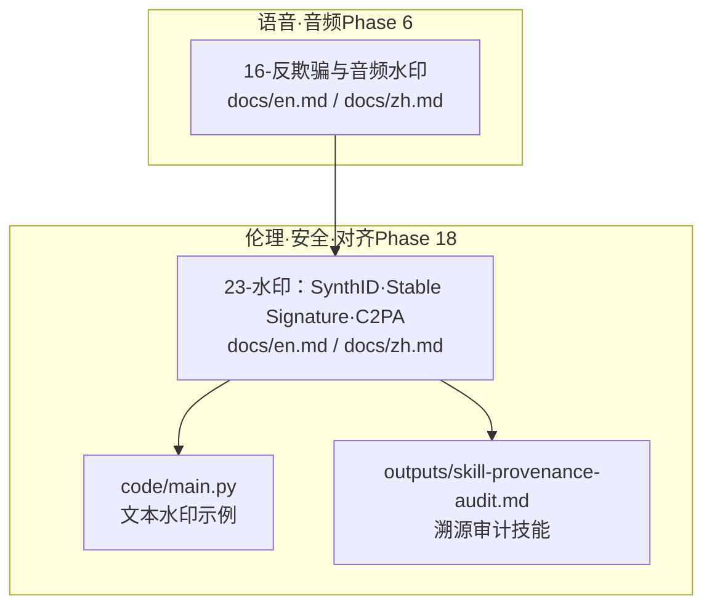
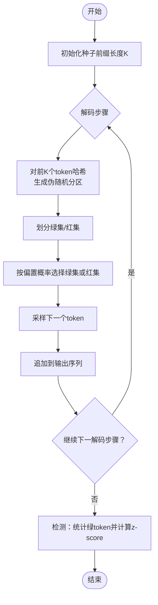
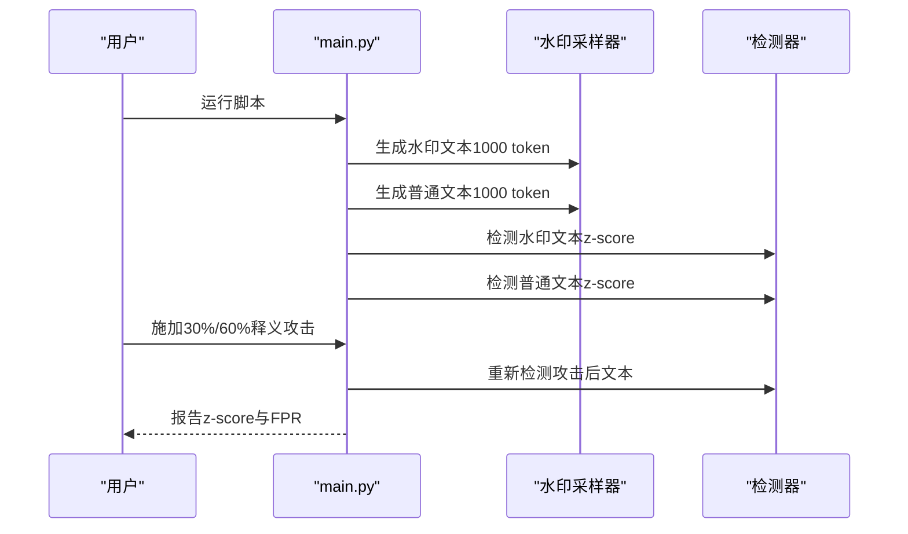
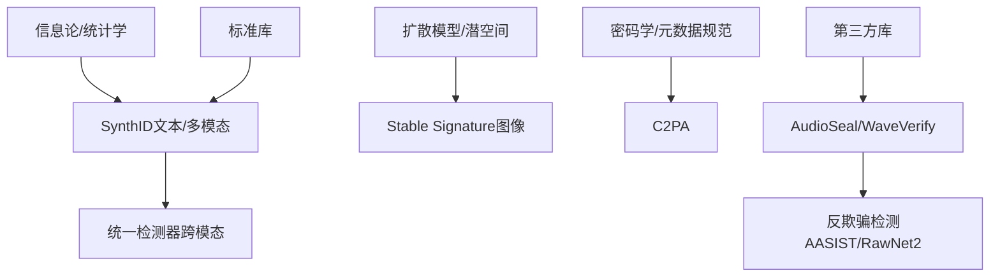

# 数字水印技术

<cite>
**本文引用的文件**
- [phases/18-ethics-safety-alignment/23-watermarking-synthid-stable-signature-c2pa/docs/en.md](file://phases/18-ethics-safety-alignment/23-watermarking-synthid-stable-signature-c2pa/docs/en.md)
- [phases/18-ethics-safety-alignment/23-watermarking-synthid-stable-signature-c2pa/docs/zh.md](file://phases/18-ethics-safety-alignment/23-watermarking-synthid-stable-signature-c2pa/docs/zh.md)
- [phases/18-ethics-safety-alignment/23-watermarking-synthid-stable-signature-c2pa/code/main.py](file://phases/18-ethics-safety-alignment/23-watermarking-synthid-stable-signature-c2pa/code/main.py)
- [phases/18-ethics-safety-alignment/23-watermarking-synthid-stable-signature-c2pa/outputs/skill-provenance-audit.md](file://phases/18-ethics-safety-alignment/23-watermarking-synthid-stable-signature-c2pa/outputs/skill-provenance-audit.md)
- [phases/06-speech-and-audio/16-anti-spoofing-audio-watermarking/docs/en.md](file://phases/06-speech-and-audio/16-anti-spoofing-audio-watermarking/docs/en.md)
- [phases/06-speech-and-audio/16-anti-spoofing-audio-watermarking/docs/zh.md](file://phases/06-speech-and-audio/16-anti-spoofing-audio-watermarking/docs/zh.md)
- [glossary/terms.md](file://glossary/terms.md)
- [glossary/terms.zh.md](file://glossary/terms.zh.md)
</cite>

## 目录
1. [引言](#引言)
2. [项目结构](#项目结构)
3. [核心组件](#核心组件)
4. [架构概览](#架构概览)
5. [详细组件分析](#详细组件分析)
6. [依赖关系分析](#依赖关系分析)
7. [性能考量](#性能考量)
8. [故障排查指南](#故障排查指南)
9. [结论](#结论)
10. [附录](#附录)

## 引言
本技术文档围绕数字水印在AI生成内容中的溯源、版权保护与真实性验证展开，重点解析三类关键技术：SynthID（文本/多模态水印）、Stable Signature（图像水印）与C2PA（可信元数据标准）。文档结合仓库中的教学材料与示例代码，系统阐述水印算法的工作原理、实现细节、鲁棒性与安全性考量，并提供可复用的工具链与部署建议。

## 项目结构
本仓库将数字水印主题置于“伦理、安全与对齐”阶段的课程中，配套有英文与中文文档、示例代码与技能产出文件。音频水印相关内容位于“语音与音频”阶段，二者共同构成端到端的水印与溯源体系。

图表来源
- [phases/18-ethics-safety-alignment/23-watermarking-synthid-stable-signature-c2pa/docs/en.md:1-115](file://phases/18-ethics-safety-alignment/23-watermarking-synthid-stable-signature-c2pa/docs/en.md#L1-L115)
- [phases/18-ethics-safety-alignment/23-watermarking-synthid-stable-signature-c2pa/code/main.py:1-112](file://phases/18-ethics-safety-alignment/23-watermarking-synthid-stable-signature-c2pa/code/main.py#L1-L112)
- [phases/18-ethics-safety-alignment/23-watermarking-synthid-stable-signature-c2pa/outputs/skill-provenance-audit.md:1-30](file://phases/18-ethics-safety-alignment/23-watermarking-synthid-stable-signature-c2pa/outputs/skill-provenance-audit.md#L1-L30)
- [phases/06-speech-and-audio/16-anti-spoofing-audio-watermarking/docs/en.md:1-193](file://phases/06-speech-and-audio/16-anti-spoofing-audio-watermarking/docs/en.md#L1-L193)

章节来源
- [phases/18-ethics-safety-alignment/23-watermarking-synthid-stable-signature-c2pa/docs/en.md:1-115](file://phases/18-ethics-safety-alignment/23-watermarking-synthid-stable-signature-c2pa/docs/en.md#L1-L115)
- [phases/18-ethics-safety-alignment/23-watermarking-synthid-stable-signature-c2pa/docs/zh.md:1-115](file://phases/18-ethics-safety-alignment/23-watermarking-synthid-stable-signature-c2pa/docs/zh.md#L1-L115)
- [phases/06-speech-and-audio/16-anti-spoofing-audio-watermarking/docs/en.md:1-193](file://phases/06-speech-and-audio/16-anti-spoofing-audio-watermarking/docs/en.md#L1-L193)
- [phases/06-speech-and-audio/16-anti-spoofing-audio-watermarking/docs/zh.md:1-193](file://phases/06-speech-and-audio/16-anti-spoofing-audio-watermarking/docs/zh.md#L1-L193)

## 核心组件
- SynthID（文本/多模态水印）
  - 机制：在解码每一步，基于前K个token的哈希对词表进行伪随机分区，将词汇分为“绿集”和“红集”，通过向绿集logits加偏δ引导采样偏向绿集，使生成文本中绿token比例显著高于随机。
  - 检测：对生成序列的每个前缀重新哈希，统计绿token数量并计算z-score，z-score显著大于0即判定为水印文本。
  - 属性：对读者不可感知（δ足够小）、可检测（需词汇表分区函数）、对释义不鲁棒（重写破坏信号）。
- Stable Signature（图像水印）
  - 机制：微调潜扩散解码器，使每个输出在潜表示中携带固定二进制消息；检测时通过神经解码器从潜变量中解码。
  - 性能：裁剪10%内容仍可>90%检测，FPR<1e-6；但2024年研究指出可通过后处理微调移除水印。
- C2PA（可信元数据）
  - 机制：基于公钥签名的不可篡改元数据标准，记录创作主体、时间、所做变换等信息。
  - 价值：元数据可被剥离但携带丰富出处信息；水印在转码中更稳健但信息量有限；二者互补。

章节来源
- [phases/18-ethics-safety-alignment/23-watermarking-synthid-stable-signature-c2pa/docs/en.md:23-66](file://phases/18-ethics-safety-alignment/23-watermarking-synthid-stable-signature-c2pa/docs/en.md#L23-L66)
- [phases/18-ethics-safety-alignment/23-watermarking-synthid-stable-signature-c2pa/docs/zh.md:23-66](file://phases/18-ethics-safety-alignment/23-watermarking-synthid-stable-signature-c2pa/docs/zh.md#L23-L66)

## 架构概览
下图展示了文本水印（SynthID-text风格）的端到端流程：采样阶段对词表分区并偏向绿集，检测阶段统计绿token并计算z-score。

图表来源
- [phases/18-ethics-safety-alignment/23-watermarking-synthid-stable-signature-c2pa/code/main.py:25-64](file://phases/18-ethics-safety-alignment/23-watermarking-synthid-stable-signature-c2pa/code/main.py#L25-L64)

章节来源
- [phases/18-ethics-safety-alignment/23-watermarking-synthid-stable-signature-c2pa/code/main.py:1-112](file://phases/18-ethics-safety-alignment/23-watermarking-synthid-stable-signature-c2pa/code/main.py#L1-L112)

## 详细组件分析

### SynthID 文本水印（示例代码）
- 数据结构与复杂度
  - 词表：整数0..N-1；分区函数基于SHA-256哈希，时间复杂度O(K)（K为上下文长度）；采样与检测均为O(T)（T为生成长度）。
- 处理逻辑
  - 采样：每步计算绿集，按偏置概率选择池，随机采样。
  - 检测：对每个前缀重新计算绿集，统计绿token数量，计算z-score。
- 实现要点
  - 偏置概率bias控制水印强度与可检测性；K越大，分区越稳定但对上下文敏感。
  - 释义攻击会破坏分区一致性，导致z-score显著下降。
- 使用示例
  - 运行脚本生成水印与普通文本，观察z-score差异；对水印文本施加不同比例的释义攻击，记录z-score变化；统计人类文本上的假阳性率。

图表来源
- [phases/18-ethics-safety-alignment/23-watermarking-synthid-stable-signature-c2pa/code/main.py:76-107](file://phases/18-ethics-safety-alignment/23-watermarking-synthid-stable-signature-c2pa/code/main.py#L76-L107)

章节来源
- [phases/18-ethics-safety-alignment/23-watermarking-synthid-stable-signature-c2pa/code/main.py:1-112](file://phases/18-ethics-safety-alignment/23-watermarking-synthid-stable-signature-c2pa/code/main.py#L1-L112)

### Stable Signature 图像水印（机制与攻防）
- 机制要点
  - 微调潜扩散解码器，使每个输出在潜空间携带固定消息；检测通过神经解码器从潜变量中还原。
  - 在裁剪10%内容情况下仍具备高检测率与极低假阳性率。
- 安全风险
  - 2024年研究指出，可通过后处理微调去除水印，质量基本不受损，说明其对抗鲁棒性有限。
- 防护建议
  - 对微调发布实施签名与审计；对解码器变更建立白名单与完整性校验。

章节来源
- [phases/18-ethics-safety-alignment/23-watermarking-synthid-stable-signature-c2pa/docs/en.md:40-44](file://phases/18-ethics-safety-alignment/23-watermarking-synthid-stable-signature-c2pa/docs/en.md#L40-L44)
- [phases/18-ethics-safety-alignment/23-watermarking-synthid-stable-signature-c2pa/docs/zh.md:40-44](file://phases/18-ethics-safety-alignment/23-watermarking-synthid-stable-signature-c2pa/docs/zh.md#L40-L44)

### C2PA 元数据（标准与实践）
- 角色定位
  - 提供可验证、不可篡改的创作与处理记录；可被剥离，但承载丰富出处信息。
- 与水印的互补性
  - 水印在转码中更稳健；元数据携带更多信息；二者结合提供更强的溯源能力。
- 合规与监管
  - 欧盟AI法案第50条与透明度规范对AI生成内容标注提出要求，推动技术与制度协同。

章节来源
- [phases/18-ethics-safety-alignment/23-watermarking-synthid-stable-signature-c2pa/docs/en.md:50-57](file://phases/18-ethics-safety-alignment/23-watermarking-synthid-stable-signature-c2pa/docs/en.md#L50-L57)
- [phases/18-ethics-safety-alignment/23-watermarking-synthid-stable-signature-c2pa/docs/zh.md:50-57](file://phases/18-ethics-safety-alignment/23-watermarking-synthid-stable-signature-c2pa/docs/zh.md#L50-L57)

### 音频水印（补充：AudioSeal/WaveVerify）
- AudioSeal
  - 局部化嵌入（逐帧）、联合训练生成器与检测器、鲁棒性强（经受MP3/AAC压缩、均衡、变速、噪声等）、容量16比特/帧。
- WaveVerify
  - 针对时域攻击（反转、变速）的改进检测器，与AudioSeal互补。
- 与文本/图像水印的对比
  - 音频水印强调鲁棒性与实时性，检测器需兼顾速度与准确性；与文本/图像水印类似，仍需配合检测与元数据。

章节来源
- [phases/06-speech-and-audio/16-anti-spoofing-audio-watermarking/docs/en.md:43-63](file://phases/06-speech-and-audio/16-anti-spoofing-audio-watermarking/docs/en.md#L43-L63)
- [phases/06-speech-and-audio/16-anti-spoofing-audio-watermarking/docs/zh.md:43-63](file://phases/06-speech-and-audio/16-anti-spoofing-audio-watermarking/docs/zh.md#L43-L63)

## 依赖关系分析
- 概念依赖
  - SynthID依赖信息论中的熵与统计显著性（z-score）；Stable Signature依赖扩散模型的潜空间表示；C2PA依赖密码学签名与元数据规范。
- 实现依赖
  - 示例代码依赖标准库（hashlib、math、random）；音频水印示例依赖第三方库（如AudioSeal）。
- 互操作性
  - SynthID统一检测器（2025）提供跨模态API；音频水印与反欺骗检测（AASIST/RawNet2）形成闭环。

图表来源
- [phases/18-ethics-safety-alignment/23-watermarking-synthid-stable-signature-c2pa/docs/en.md:46-48](file://phases/18-ethics-safety-alignment/23-watermarking-synthid-stable-signature-c2pa/docs/en.md#L46-L48)
- [phases/06-speech-and-audio/16-anti-spoofing-audio-watermarking/docs/en.md:35-41](file://phases/06-speech-and-audio/16-anti-spoofing-audio-watermarking/docs/en.md#L35-L41)

章节来源
- [phases/18-ethics-safety-alignment/23-watermarking-synthid-stable-signature-c2pa/docs/en.md:1-115](file://phases/18-ethics-safety-alignment/23-watermarking-synthid-stable-signature-c2pa/docs/en.md#L1-L115)
- [phases/06-speech-and-audio/16-anti-spoofing-audio-watermarking/docs/en.md:1-193](file://phases/06-speech-and-audio/16-anti-spoofing-audio-watermarking/docs/en.md#L1-L193)

## 性能考量
- 计算开销
  - SynthID：每步分区与采样为O(K)，整体O(T)；检测亦为O(T)。K增大提升稳定性但增加上下文依赖。
  - Stable Signature：解码器微调带来额外训练成本；检测依赖神经解码器，需平衡精度与延迟。
  - AudioSeal：检测器可达数百倍实时速度，适合在线部署。
- 鲁棒性
  - 文本水印对释义攻击脆弱；图像水印对裁剪较鲁棒但易被后处理微调移除；音频水印对常见压缩与变换鲁棒，但音高偏移仍是普遍弱点。
- 可扩展性
  - 跨模态统一检测器可降低部署复杂度；音频水印与反欺骗检测结合可覆盖更多对抗场景。

## 故障排查指南
- 常见问题
  - 水印未被检测：确认是否使用了正确的词汇表分区函数；检查偏置概率与上下文长度K；确保生成长度足够（示例建议≥1000 token）。
  - 释义破坏信号：预期z-score下降；若未下降，检查是否正确实现了随机替换比例。
  - 假阳性过高：在人类文本上统计FPR，调整阈值或增加生成长度。
  - 微调移除水印：对解码器变更实施签名与审计；限制发布渠道。
  - 音频水印失效：注意音高偏移攻击；采用时域鲁棒检测器（如WaveVerify）或结合反欺骗检测。
- 工具与流程
  - 使用示例脚本进行端到端验证；对不同攻击强度进行对照实验；记录z-score与比特恢复准确率；结合C2PA元数据与统一检测器形成闭环。

章节来源
- [phases/18-ethics-safety-alignment/23-watermarking-synthid-stable-signature-c2pa/code/main.py:76-107](file://phases/18-ethics-safety-alignment/23-watermarking-synthid-stable-signature-c2pa/code/main.py#L76-L107)
- [phases/18-ethics-safety-alignment/23-watermarking-synthid-stable-signature-c2pa/outputs/skill-provenance-audit.md:10-29](file://phases/18-ethics-safety-alignment/23-watermarking-synthid-stable-signature-c2pa/outputs/skill-provenance-audit.md#L10-L29)
- [phases/06-speech-and-audio/16-anti-spoofing-audio-watermarking/docs/en.md:65-67](file://phases/06-speech-and-audio/16-anti-spoofing-audio-watermarking/docs/en.md#L65-L67)

## 结论
数字水印在AI生成内容的溯源、版权保护与真实性验证中扮演关键角色。SynthID提供跨模态的可检测信号，Stable Signature在图像领域具备高鲁棒性但面临后处理攻击，C2PA提供不可篡改的元数据证据。结合仓库中的示例代码与技能产出，可构建从生成到检测再到审计的完整工具链，并在合规框架下落地部署。

## 附录
- 术语速查（节选）
  - 令牌（Token）：分词器产生的子词单元，是语言模型的基本单位。
  - 采样（Sampling）：在语言模型中按概率分布选择下一个词元的过程。
  - 置信度（Confidence）：模型对预测结果的把握程度，常用于阈值设定。
  - 假阳性率（FPR）：在真实人类文本中错误判定为水印的比例。
  - 统一检测器（Cross-modal detector）：SynthID 2025推出的跨文本/图像/音频/视频的单一检测接口。

章节来源
- [glossary/terms.md:339-346](file://glossary/terms.md#L339-L346)
- [glossary/terms.md:347-350](file://glossary/terms.md#L347-L350)
- [glossary/terms.md:313-324](file://glossary/terms.md#L313-L324)
- [glossary/terms.zh.md:339-346](file://glossary/terms.zh.md#L339-L346)
- [glossary/terms.zh.md:347-350](file://glossary/terms.zh.md#L347-L350)
- [glossary/terms.zh.md:313-324](file://glossary/terms.zh.md#L313-L324)