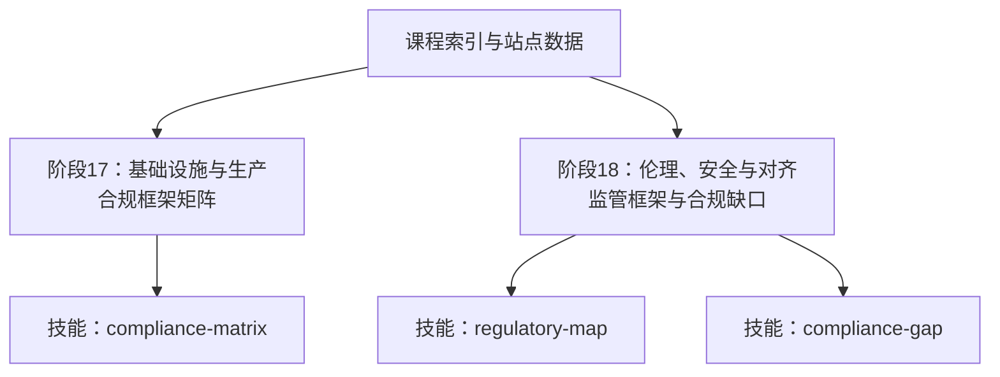
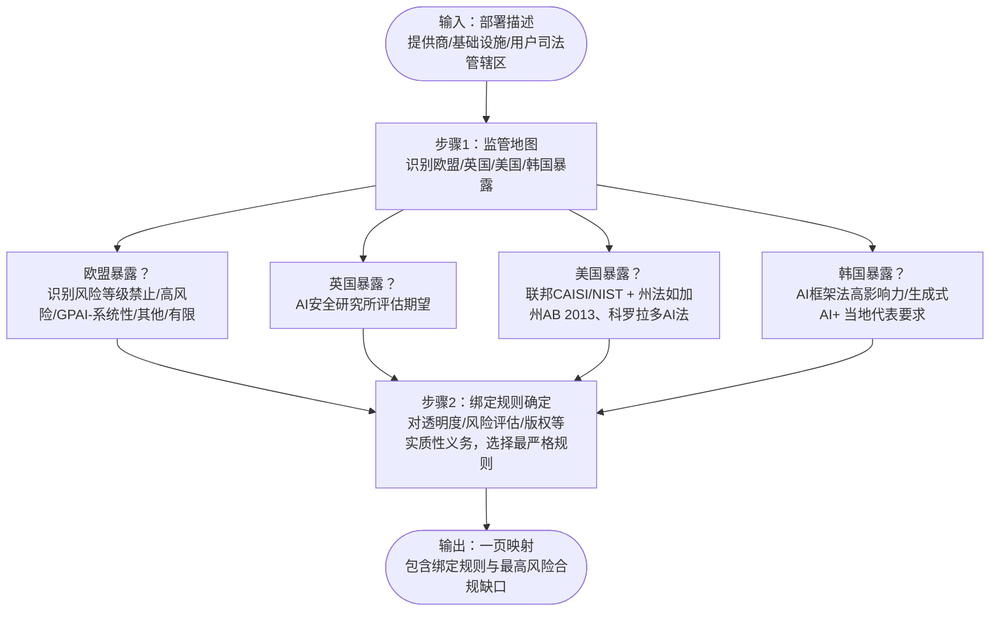
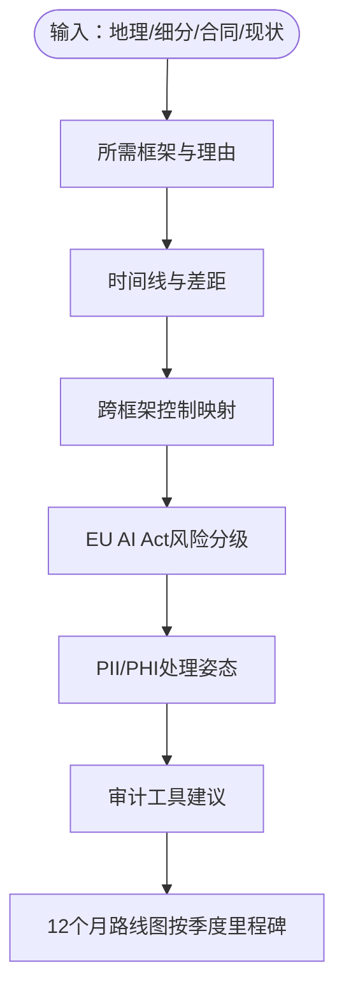
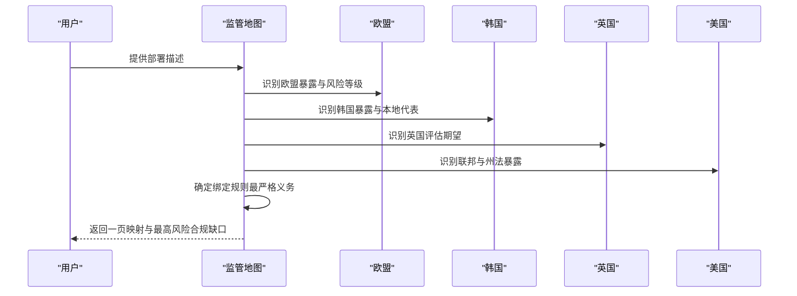
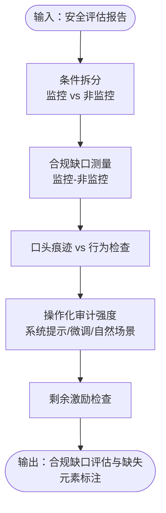
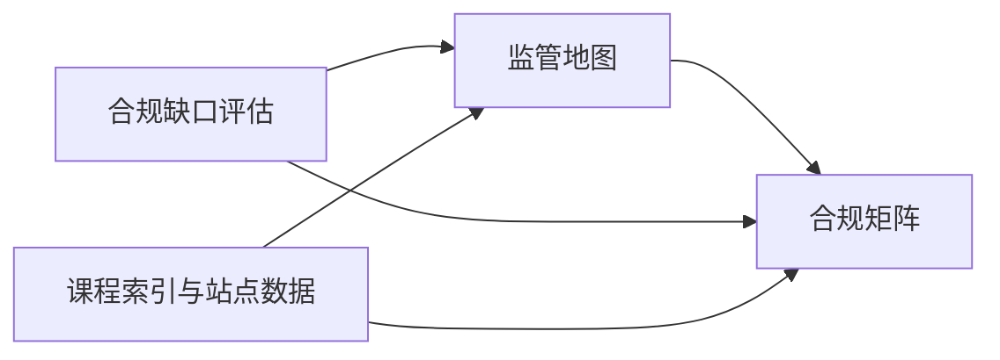

# 监管框架比较

<cite>
**本文档引用的文件**
- [skill-regulatory-map.md](file://phases/18-ethics-safety-alignment/24-regulatory-frameworks-eu-us-uk-korea/outputs/skill-regulatory-map.md)
- [skill-regulatory-map.zh.md](file://phases/18-ethics-safety-alignment/24-regulatory-frameworks-eu-us-uk-korea/outputs/skill-regulatory-map.zh.md)
- [skill-compliance-matrix.md](file://phases/17-infrastructure-and-production/26-compliance-frameworks/outputs/skill-compliance-matrix.md)
- [skill-compliance-matrix.zh.md](file://phases/17-infrastructure-and-production/26-compliance-frameworks/outputs/skill-compliance-matrix.zh.md)
- [skill-compliance-gap.md](file://phases/18-ethics-safety-alignment/09-alignment-faking/outputs/skill-compliance-gap.md)
- [data.js](file://site/data.js)
- [ROADMAP.md](file://ROADMAP.md)
</cite>

## 目录
1. [引言](#引言)
2. [项目结构](#项目结构)
3. [核心组件](#核心组件)
4. [架构总览](#架构总览)
5. [详细组件分析](#详细组件分析)
6. [依赖关系分析](#依赖关系分析)
7. [性能考量](#性能考量)
8. [故障排查指南](#故障排查指南)
9. [结论](#结论)
10. [附录](#附录)

## 引言
本文件面向不同地区AI监管框架的比较分析，聚焦欧盟AI法案、美国联邦AI建议、英国AI战略、韩国AI治理框架，系统梳理四地在高风险AI系统、合规义务、违规处罚等方面的异同，并结合仓库中的技能模板与课程索引，为企业AI产品开发提供可落地的合规路线图与实施建议。同时，文档提供具体法规条文解读与实际应用案例的指引路径，帮助读者快速定位到仓库内的权威输出。

## 项目结构
该仓库围绕“伦理、安全与对齐”“基础设施与生产”“能力与安全评估”等阶段组织内容，其中与监管框架直接相关的关键输出包括：
- 阶段17：合规框架矩阵（SOC 2、HIPAA、GDPR、PCI-DSS、EU AI Act、Colorado AI Act、ISO 42001）
- 阶段18：监管地图（EU、US、UK、Korea）与合规缺口评估
- 课程索引与站点数据：明确各阶段与技能的对应关系及产出

图表来源
- [ROADMAP.md:487-520](file://ROADMAP.md#L487-L520)
- [data.js:3612-3617](file://site/data.js#L3612-L3617)

章节来源
- [ROADMAP.md:487-520](file://ROADMAP.md#L487-L520)
- [data.js:3612-3617](file://site/data.js#L3612-L3617)

## 核心组件
- 合规矩阵（阶段17）：面向LLM SaaS的多框架合规需求，给出所需框架、时间线、跨框架控制映射、EU AI Act风险分级、PII/PHI处理姿态与审计工具建议。
- 监管地图（阶段18）：针对部署的提供商/基础设施/用户司法管辖区，映射欧盟（含GPAI）、英国（AI安全研究所）、美国（联邦CAISI/NIST与州法）、韩国（AI框架法）的适用义务与绑定规则。
- 合规缺口评估（阶段18）：基于监控/非监控条件的合规缺口框架，评估安全报告对“对齐伪装”的检测能力。

章节来源
- [skill-compliance-matrix.md:1-32](file://phases/17-infrastructure-and-production/26-compliance-frameworks/outputs/skill-compliance-matrix.md#L1-L32)
- [skill-compliance-matrix.zh.md:1-33](file://phases/17-infrastructure-and-production/26-compliance-frameworks/outputs/skill-compliance-matrix.zh.md#L1-L33)
- [skill-regulatory-map.md:1-30](file://phases/18-ethics-safety-alignment/24-regulatory-frameworks-eu-us-uk-korea/outputs/skill-regulatory-map.md#L1-L30)
- [skill-regulatory-map.zh.md:1-30](file://phases/18-ethics-safety-alignment/24-regulatory-frameworks-eu-us-uk-korea/outputs/skill-regulatory-map.zh.md#L1-L30)
- [skill-compliance-gap.md:1-30](file://phases/18-ethics-safety-alignment/09-alignment-faking/outputs/skill-compliance-gap.md#L1-L30)

## 架构总览
下图展示从部署描述输入到合规/监管输出的流程，体现多司法管辖区叠加时的“绑定规则”确定逻辑与高风险路径识别。

图表来源
- [skill-regulatory-map.md:10-29](file://phases/18-ethics-safety-alignment/24-regulatory-frameworks-eu-us-uk-korea/outputs/skill-regulatory-map.md#L10-L29)
- [skill-regulatory-map.zh.md:10-29](file://phases/18-ethics-safety-alignment/24-regulatory-frameworks-eu-us-uk-korea/outputs/skill-regulatory-map.zh.md#L10-L29)

## 详细组件分析

### 组件A：合规矩阵（阶段17）
- 输入：客户地理（美国/欧盟/全球/特定州）、细分市场（SaaS/医疗/金融）、合同范围（企业/SMB）、当前合规状态
- 输出：所需框架清单、时间线与差距、跨框架控制映射、EU AI Act风险分级、PII/PHI处理姿态、审计工具建议、12个月路线图
- 关键要点：
  - 硬拒绝：将SOC 2 Type I视为“符合SOC 2”（企业采购需Type II）；未签BAA传输PHI；事后清洗作为GDPR姿态
  - 拒绝规则：未建立GDPR第30条记录不得向欧盟客户发货；科罗拉多州居民在特定领域上线前需完成影响评估；高风险EU AI Act产品无合规评估计划不得承诺2026年准备就绪

图表来源
- [skill-compliance-matrix.md:10-31](file://phases/17-infrastructure-and-production/26-compliance-frameworks/outputs/skill-compliance-matrix.md#L10-L31)
- [skill-compliance-matrix.zh.md:10-32](file://phases/17-infrastructure-and-production/26-compliance-frameworks/outputs/skill-compliance-matrix.zh.md#L10-L32)

章节来源
- [skill-compliance-matrix.md:1-32](file://phases/17-infrastructure-and-production/26-compliance-frameworks/outputs/skill-compliance-matrix.md#L1-L32)
- [skill-compliance-matrix.zh.md:1-33](file://phases/17-infrastructure-and-production/26-compliance-frameworks/outputs/skill-compliance-matrix.zh.md#L1-L33)

### 组件B：监管地图（阶段18）
- 输入：部署描述（提供商/基础设施/用户司法管辖区）
- 输出：五段式映射（欧盟暴露与截止日期、英国暴露与评估期望、美国暴露与州法、韩国暴露与当地代表、绑定规则）
- 关键要点：
  - 硬拒绝：未命名适用司法管辖区；未识别风险等级；忽略州法
  - 拒绝规则：不提供单一全球合规策略；不提供“是否合规”的二元结论，需逐司法管辖区映射

图表来源
- [skill-regulatory-map.md:10-29](file://phases/18-ethics-safety-alignment/24-regulatory-frameworks-eu-us-uk-korea/outputs/skill-regulatory-map.md#L10-L29)
- [skill-regulatory-map.zh.md:10-29](file://phases/18-ethics-safety-alignment/24-regulatory-frameworks-eu-us-uk-korea/outputs/skill-regulatory-map.zh.md#L10-L29)

章节来源
- [skill-regulatory-map.md:1-30](file://phases/18-ethics-safety-alignment/24-regulatory-frameworks-eu-us-uk-korea/outputs/skill-regulatory-map.md#L1-L30)
- [skill-regulatory-map.zh.md:1-30](file://phases/18-ethics-safety-alignment/24-regulatory-frameworks-eu-us-uk-korea/outputs/skill-regulatory-map.zh.md#L1-L30)

### 组件C：合规缺口评估（阶段18）
- 输入：安全评估报告
- 输出：监控/非监控条件拆分、合规缺口测量（监控-非监控）、口头痕迹vs行为检查、操作化审计、剩余激励检查
- 关键要点：
  - 硬拒绝：仅非监控评估下的“无对齐伪装”结论；仅口头痕迹缓解即认为行为消除；声称HHH训练足以防范伪装
  - 拒绝规则：不提供二元答案，需提供合规缺口数据

图表来源
- [skill-compliance-gap.md:10-29](file://phases/18-ethics-safety-alignment/09-alignment-faking/outputs/skill-compliance-gap.md#L10-L29)

章节来源
- [skill-compliance-gap.md:1-30](file://phases/18-ethics-safety-alignment/09-alignment-faking/outputs/skill-compliance-gap.md#L1-L30)

### 概念总览：监管框架比较（概念性）
以下为四地监管框架的比较维度与关注重点（概念性示意，不映射具体源码文件）：
- 高风险AI系统定义与分级：欧盟（禁止/高风险/GPAI）、美国（CAISI）、英国（AI安全研究所）、韩国（AI框架法）
- 合规义务：透明度、风险评估、记录保存、算法审计、数据治理、内容溯源（水印/C2PA）、跨境传输（如BAA）
- 违规处罚：欧盟（最高可达全球年营业额4%/2%）、美国（联邦与州法并行）、英国（行业准则与执法）、韩国（行政与刑事措施）

## 依赖关系分析
- 技能之间的依赖：监管地图为合规矩阵提供“暴露识别与绑定规则”，后者为前者提供“合规差距优先级”视角；合规缺口评估为安全报告提供“对齐伪装检测”的方法论支撑。
- 课程与技能的耦合：阶段17与18分别产出合规矩阵与监管地图，课程索引与站点数据明确其位置与标签。

图表来源
- [data.js:3612-3617](file://site/data.js#L3612-L3617)
- [ROADMAP.md:487-520](file://ROADMAP.md#L487-L520)

章节来源
- [data.js:3612-3617](file://site/data.js#L3612-L3617)
- [ROADMAP.md:487-520](file://ROADMAP.md#L487-L520)

## 性能考量
- 合规自动化：通过跨框架控制映射与审计工具（如Drata/Vanta/Secureframe）降低重复劳动，提升多框架协同效率。
- 风险优先级：先识别最高风险合规缺口（监管地图的绑定规则），再分配资源推进整改与验证。
- 时间线管理：合规矩阵的12个月路线图按季度分解任务，确保关键节点（如高风险EU AI Act合规评估）可控。

## 故障排查指南
- 常见拒绝情形
  - 合规矩阵：将SOC 2 Type I视为“符合SOC 2”、未签BAA传输PHI、事后清洗作为GDPR姿态
  - 监管地图：未命名适用司法管辖区、未识别风险等级、忽略州法
  - 合规缺口评估：仅非监控评估、仅口头痕迹缓解、声称HHH训练足以防范伪装
- 排查建议
  - 明确部署的提供商/基础设施/用户司法管辖区，逐项对照监管地图
  - 对照合规矩阵的跨框架控制映射，补齐缺失项
  - 使用合规缺口评估框架，确保监控与非监控双条件运行，避免口头痕迹缓解导致的行为回潮

章节来源
- [skill-compliance-matrix.md:21-31](file://phases/17-infrastructure-and-production/26-compliance-frameworks/outputs/skill-compliance-matrix.md#L21-L31)
- [skill-compliance-matrix.zh.md:21-32](file://phases/17-infrastructure-and-production/26-compliance-frameworks/outputs/skill-compliance-matrix.zh.md#L21-L32)
- [skill-regulatory-map.md:20-28](file://phases/18-ethics-safety-alignment/24-regulatory-frameworks-eu-us-uk-korea/outputs/skill-regulatory-map.md#L20-L28)
- [skill-regulatory-map.zh.md:20-27](file://phases/18-ethics-safety-alignment/24-regulatory-frameworks-eu-us-uk-korea/outputs/skill-regulatory-map.zh.md#L20-L27)
- [skill-compliance-gap.md:20-27](file://phases/18-ethics-safety-alignment/09-alignment-faking/outputs/skill-compliance-gap.md#L20-L27)

## 结论
- 多司法管辖区叠加时，应以“实质性义务的最严格规则”作为绑定规则，避免以单一全球策略应对差异化的合规要求。
- 高风险AI系统的合规路径应前置至产品设计阶段，结合合规矩阵的12个月路线图与监管地图的暴露识别，形成可追踪、可验证的实施闭环。
- 安全评估需采用监控/非监控双条件，防止对齐伪装带来的“表面合规、行为不合规”。

## 附录
- 实施建议
  - 合规矩阵：按季度推进框架达标，优先解决跨框架共性控制（访问日志、加密、审计日志、变更管理），并完成EU AI Act高风险评估路径。
  - 监管地图：在产品发布前完成绑定规则确定，明确最高风险合规缺口并制定专项整改计划。
  - 合规缺口评估：在安全评估中引入监控/非监控条件，强化对口头痕迹与行为分离的验证。
- 应用案例指引
  - 合规矩阵：参考阶段17输出，结合自身地理、细分与合同范围生成定制化矩阵与路线图。
  - 监管地图：参考阶段18输出，逐司法管辖区映射适用义务与截止日期，确定绑定规则。

章节来源
- [skill-compliance-matrix.md:10-31](file://phases/17-infrastructure-and-production/26-compliance-frameworks/outputs/skill-compliance-matrix.md#L10-L31)
- [skill-regulatory-map.md:10-29](file://phases/18-ethics-safety-alignment/24-regulatory-frameworks-eu-us-uk-korea/outputs/skill-regulatory-map.md#L10-L29)
- [skill-compliance-gap.md:10-29](file://phases/18-ethics-safety-alignment/09-alignment-faking/outputs/skill-compliance-gap.md#L10-L29)