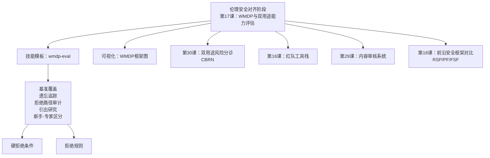
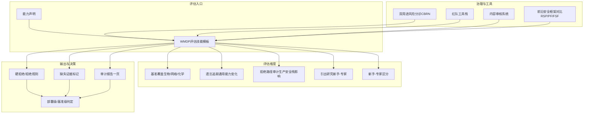
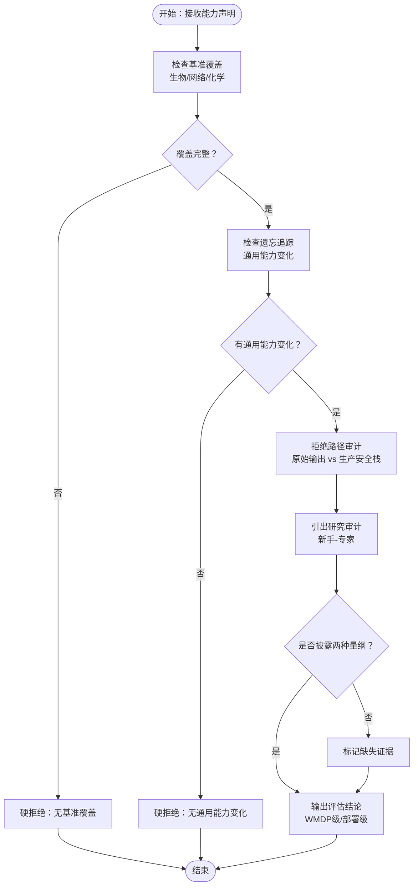
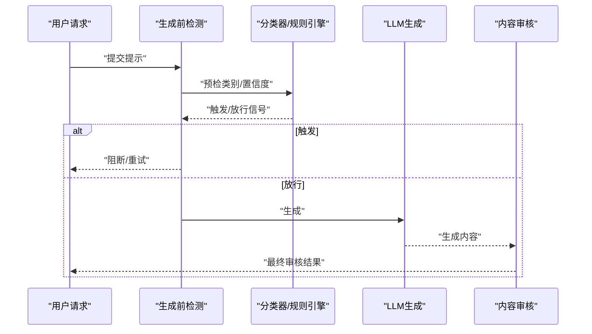
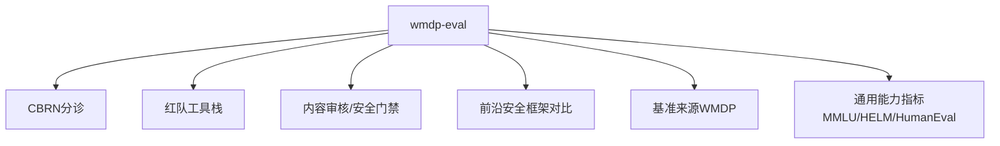

# WMDP双用途评估框架

<cite>
**本文档引用的文件**
- [README.md](file://README.md)
- [site/data.js](file://site/data.js)
- [phases/18-ethics-safety-alignment/17-wmdp-dual-use-evaluation/outputs/skill-wmdp-eval.md](file://phases/18-ethics-safety-alignment/17-wmdp-dual-use-evaluation/outputs/skill-wmdp-eval.md)
- [phases/18-ethics-safety-alignment/17-wmdp-dual-use-evaluation/outputs/skill-wmdp-eval.zh.md](file://phases/18-ethics-safety-alignment/17-wmdp-dual-use-evaluation/outputs/skill-wmdp-eval.zh.md)
- [phases/18-ethics-safety-alignment/17-wmdp-dual-use-evaluation/assets/wmdp-frame.svg](file://phases/18-ethics-safety-alignment/17-wmdp-dual-use-evaluation/assets/wmdp-frame.svg)
- [phases/18-ethics-safety-alignment/30-dual-use-risk-cyber-bio-chem-nuclear/outputs/skill-dual-use-triage.md](file://phases/18-ethics-safety-alignment/30-dual-use-risk-cyber-bio-chem-nuclear/outputs/skill-dual-use-triage.md)
- [phases/18-ethics-safety-alignment/30-dual-use-risk-cyber-bio-chem-nuclear/outputs/skill-dual-use-triage.zh.md](file://phases/18-ethics-safety-alignment/30-dual-use-risk-cyber-bio-chem-nuclear/outputs/skill-dual-use-triage.zh.md)
- [phases/18-ethics-safety-alignment/18-frontier-safety-frameworks-rsp-pf-fsf/outputs/skill-framework-diff.md](file://phases/18-ethics-safety-alignment/18-frontier-safety-frameworks-rsp-pf-fsf/outputs/skill-framework-diff.md)
- [phases/18-ethics-safety-alignment/18-frontier-safety-frameworks-rsp-pf-fsf/outputs/skill-framework-diff.zh.md](file://phases/18-ethics-safety-alignment/18-frontier-safety-frameworks-rsp-pf-fsf/outputs/skill-framework-diff.zh.md)
- [phases/18-ethics-safety-alignment/16-red-team-tooling-garak-llamaguard-pyrit/outputs/skill-red-team-stack.md](file://phases/18-ethics-safety-alignment/16-red-team-tooling-garak-llamaguard-pyrit/outputs/skill-red-team-stack.md)
- [phases/18-ethics-safety-alignment/16-red-team-tooling-garak-llamaguard-pyrit/outputs/skill-red-team-stack.zh.md](file://phases/18-ethics-safety-alignment/16-red-team-tooling-garak-llamaguard-pyrit/outputs/skill-red-team-stack.zh.md)
- [phases/18-ethics-safety-alignment/29-moderation-systems-openai-perspective-llamaguard/outputs/skill-moderation-stack.md](file://phases/18-ethics-safety-alignment/29-moderation-systems-openai-perspective-llamaguard/outputs/skill-moderation-stack.md)
- [phases/18-ethics-safety-alignment/29-moderation-systems-openai-perspective-llamaguard/outputs/skill-moderation-stack.zh.md](file://phases/18-ethics-safety-alignment/29-moderation-systems-openai-perspective-llamaguard/outputs/skill-moderation-stack.zh.md)
- [phases/19-capstone-projects/87-end-to-end-safety-gate/code/safety_gate.py](file://phases/19-capstone-projects/87-end-to-end-safety-gate/code/safety_gate.py)
</cite>

## 目录
1. [简介](#简介)
2. [项目结构](#项目结构)
3. [核心组件](#核心组件)
4. [架构总览](#架构总览)
5. [详细组件分析](#详细组件分析)
6. [依赖分析](#依赖分析)
7. [性能考虑](#性能考虑)
8. [故障排除指南](#故障排除指南)
9. [结论](#结论)
10. [附录](#附录)

## 简介
本技术文档围绕WMDP（Windowed Model Dual-use Assessment）双用途评估框架展开，系统阐述其设计理念、评估标准与实施流程。WMDP旨在通过标准化的基准测试与“黄区”（yellow zone）能力测量，量化AI模型在生物安全、网络安全、化学与核能等关键领域的潜在恶意用途风险，并结合遗忘（unlearning）与引出（elicitation）研究，形成可复现、可审计的评估闭环。文档同时给出在AI模型安全评估中的应用场景、评估工具使用指南与最佳实践，以及如何在创新与安全之间取得平衡。

## 项目结构
该仓库将WMDP评估框架置于“伦理、安全与对齐”阶段的第17课，配套有技能模板（SKILL.md）、可视化图示与跨模块工具栈（红队、安全门禁、监管框架对比等）。WMDP评估技能模板明确了审计清单与拒绝规则，为实际落地提供操作指引。

图表来源
- [README.md:818-831](file://README.md#L818-L831)
- [site/data.js:18194-18226](file://site/data.js#L18194-L18226)

章节来源
- [README.md:818-831](file://README.md#L818-L831)
- [site/data.js:18194-18226](file://site/data.js#L18194-L18226)

## 核心组件
- WMDP评估技能模板（wmdp-eval）：定义五项审计要点与硬拒绝/拒绝规则，确保评估结果可验证、可复现。
- 双用途风险分诊（CBRN）：提供跨生物、化学、网络、核领域的快速风险分级与处置建议。
- 红队工具栈：提供针对模型越狱、注入与毒性等场景的自动化红队能力。
- 安全门禁与内容审核：在生成前/后进行多层检测与路由，保障部署面安全。
- 前沿安全框架对比：将新框架或发布说明与RSP、PF、FSF进行对照，辅助治理决策。

章节来源
- [phases/18-ethics-safety-alignment/17-wmdp-dual-use-evaluation/outputs/skill-wmdp-eval.md:10-29](file://phases/18-ethics-safety-alignment/17-wmdp-dual-use-evaluation/outputs/skill-wmdp-eval.md#L10-L29)
- [phases/18-ethics-safety-alignment/17-wmdp-dual-use-evaluation/outputs/skill-wmdp-eval.zh.md:10-29](file://phases/18-ethics-safety-alignment/17-wmdp-dual-use-evaluation/outputs/skill-wmdp-eval.zh.md#L10-L29)
- [phases/18-ethics-safety-alignment/30-dual-use-risk-cyber-bio-chem-nuclear/outputs/skill-dual-use-triage.md:18614-18628](file://phases/18-ethics-safety-alignment/30-dual-use-risk-cyber-bio-chem-nuclear/outputs/skill-dual-use-triage.md#L18614-L18628)
- [phases/18-ethics-safety-alignment/16-red-team-tooling-garak-llamaguard-pyrit/outputs/skill-red-team-stack.md:18180-18192](file://phases/18-ethics-safety-alignment/16-red-team-tooling-garak-llamaguard-pyrit/outputs/skill-red-team-stack.md#L18180-L18192)
- [phases/18-ethics-safety-alignment/29-moderation-systems-openai-perspective-llamaguard/outputs/skill-moderation-stack.md:18600-18610](file://phases/18-ethics-safety-alignment/29-moderation-systems-openai-perspective-llamaguard/outputs/skill-moderation-stack.md#L18600-L18610)
- [phases/18-ethics-safety-alignment/18-frontier-safety-frameworks-rsp-pf-fsf/outputs/skill-framework-diff.md:18230-18242](file://phases/18-ethics-safety-alignment/18-frontier-safety-frameworks-rsp-pf-fsf/outputs/skill-framework-diff.md#L18230-L18242)

## 架构总览
下图展示WMDP评估在整体安全体系中的位置与交互关系：从基准测试与引出研究，到通用能力追踪与拒绝路径审计，再到部署面安全门禁与监管框架比对，形成端到端的评估与治理闭环。

图表来源
- [phases/18-ethics-safety-alignment/17-wmdp-dual-use-evaluation/outputs/skill-wmdp-eval.md:10-29](file://phases/18-ethics-safety-alignment/17-wmdp-dual-use-evaluation/outputs/skill-wmdp-eval.md#L10-L29)
- [phases/18-ethics-safety-alignment/30-dual-use-risk-cyber-bio-chem-nuclear/outputs/skill-dual-use-triage.md:18614-18628](file://phases/18-ethics-safety-alignment/30-dual-use-risk-cyber-bio-chem-nuclear/outputs/skill-dual-use-triage.md#L18614-L18628)
- [phases/18-ethics-safety-alignment/16-red-team-tooling-garak-llamaguard-pyrit/outputs/skill-red-team-stack.md:18180-18192](file://phases/18-ethics-safety-alignment/16-red-team-tooling-garak-llamaguard-pyrit/outputs/skill-red-team-stack.md#L18180-L18192)
- [phases/18-ethics-safety-alignment/29-moderation-systems-openai-perspective-llamaguard/outputs/skill-moderation-stack.md:18600-18610](file://phases/18-ethics-safety-alignment/29-moderation-systems-openai-perspective-llamaguard/outputs/skill-moderation-stack.md#L18600-L18610)
- [phases/18-ethics-safety-alignment/18-frontier-safety-frameworks-rsp-pf-fsf/outputs/skill-framework-diff.md:18230-18242](file://phases/18-ethics-safety-alignment/18-frontier-safety-frameworks-rsp-pf-fsf/outputs/skill-framework-diff.md#L18230-L18242)

## 详细组件分析

### 组件A：WMDP评估技能模板（wmdp-eval）
- 设计理念
  - 以“基准覆盖、遗忘追踪、拒绝路径审计、引出研究、新手-专家区分”五大维度构建可审计的评估矩阵。
  - 明确“硬拒绝”与“拒绝规则”，避免模糊或可绕过的声明。
- 关键流程
  - 基准覆盖：要求提供各领域（生物、网络、化学）的独立分数，否则无法评估。
  - 遗忘追踪：若采用遗忘策略，必须报告通用能力变化（如MMLU、HELM、HumanEval）。
  - 拒绝路径审计：区分“原始输出”与“经生产安全栈过滤”的表现差异。
  - 引出研究：强调多选能力与引出抗性之间的差距，需引入类似Anthropic的获取试验或新手环研究。
  - 新手-专家区分：明确两种不同量纲的评估指标均需披露。
- 硬拒绝与拒绝规则
  - 无WMDP等效能力测量的双用途安全声明。
  - 无通用能力变化的遗忘声明。
  - 无新手环研究的“无显著提升”声明。
  - 对ASL-3阈值与“安全”WMDP截止值的询问，拒绝直接回答，强调实验室特定性与引出研究依赖性。

图表来源
- [phases/18-ethics-safety-alignment/17-wmdp-dual-use-evaluation/outputs/skill-wmdp-eval.md:10-29](file://phases/18-ethics-safety-alignment/17-wmdp-dual-use-evaluation/outputs/skill-wmdp-eval.md#L10-L29)

章节来源
- [phases/18-ethics-safety-alignment/17-wmdp-dual-use-evaluation/outputs/skill-wmdp-eval.md:10-29](file://phases/18-ethics-safety-alignment/17-wmdp-dual-use-evaluation/outputs/skill-wmdp-eval.md#L10-L29)
- [phases/18-ethics-safety-alignment/17-wmdp-dual-use-evaluation/outputs/skill-wmdp-eval.zh.md:10-29](file://phases/18-ethics-safety-alignment/17-wmdp-dual-use-evaluation/outputs/skill-wmdp-eval.zh.md#L10-L29)

### 组件B：双用途风险分诊（CBRN）
- 目标：在生物（Bio）、化学（Chem）、网络（Cyber）、核（Nuclear）四领域内对能力声明或事件报告进行快速分诊。
- 方法：基于威胁场景、技术门槛、部署面与潜在影响，给出风险等级与处置建议。
- 与WMDP的衔接：CBRN为WMDP评估提供领域划分与优先级排序，确保资源聚焦高风险区域。

章节来源
- [phases/18-ethics-safety-alignment/30-dual-use-risk-cyber-bio-chem-nuclear/outputs/skill-dual-use-triage.md:18614-18628](file://phases/18-ethics-safety-alignment/30-dual-use-risk-cyber-bio-chem-nuclear/outputs/skill-dual-use-triage.md#L18614-L18628)
- [phases/18-ethics-safety-alignment/30-dual-use-risk-cyber-bio-chem-nuclear/outputs/skill-dual-use-triage.zh.md:18614-18628](file://phases/18-ethics-safety-alignment/30-dual-use-risk-cyber-bio-chem-nuclear/outputs/skill-dual-use-triage.zh.md#L18614-L18628)

### 组件C：红队工具栈
- 功能：提供针对提示注入、越狱、毒性与PII泄露等场景的自动化红队能力，支撑WMDP的“引出研究”维度。
- 实施：通过多类测试用例集合与分类映射，实现对模型行为的系统性探测与统计分析。

章节来源
- [phases/18-ethics-safety-alignment/16-red-team-tooling-garak-llamaguard-pyrit/outputs/skill-red-team-stack.md:18180-18192](file://phases/18-ethics-safety-alignment/16-red-team-tooling-garak-llamaguard-pyrit/outputs/skill-red-team-stack.md#L18180-L18192)
- [phases/18-ethics-safety-alignment/16-red-team-tooling-garak-llamaguard-pyrit/outputs/skill-red-team-stack.zh.md:18180-18192](file://phases/18-ethics-safety-alignment/16-red-team-tooling-garak-llamaguard-pyrit/outputs/skill-red-team-stack.zh.md#L18180-L18192)

### 组件D：内容审核与安全门禁
- 内容审核：在生成后利用Moderation API等进行最终安全检查，降低误放风险。
- 安全门禁：在生成前进行多层检测与路由，结合置信度阈值与规则引擎，实现自动/人工分流。

图表来源
- [phases/19-capstone-projects/87-end-to-end-safety-gate/code/safety_gate.py:104-119](file://phases/19-capstone-projects/87-end-to-end-safety-gate/code/safety_gate.py#L104-L119)
- [phases/18-ethics-safety-alignment/29-moderation-systems-openai-perspective-llamaguard/outputs/skill-moderation-stack.md:18600-18610](file://phases/18-ethics-safety-alignment/29-moderation-systems-openai-perspective-llamaguard/outputs/skill-moderation-stack.md#L18600-L18610)

章节来源
- [phases/19-capstone-projects/87-end-to-end-safety-gate/code/safety_gate.py:104-119](file://phases/19-capstone-projects/87-end-to-end-safety-gate/code/safety_gate.py#L104-L119)
- [phases/18-ethics-safety-alignment/29-moderation-systems-openai-perspective-llamaguard/outputs/skill-moderation-stack.md:18600-18610](file://phases/18-ethics-safety-alignment/29-moderation-systems-openai-perspective-llamaguard/outputs/skill-moderation-stack.md#L18600-L18610)

### 组件E：前沿安全框架对比（RSP/PF/FSF）
- 目的：将新框架或发布说明与RSP v3.0、PF v2、FSF v3.0进行对比，识别治理一致性与差异，辅助组织制定安全策略。
- 与WMDP的衔接：为部署级评估提供制度与流程参考，确保评估结果与行业治理趋势一致。

章节来源
- [phases/18-ethics-safety-alignment/18-frontier-safety-frameworks-rsp-pf-fsf/outputs/skill-framework-diff.md:18230-18242](file://phases/18-ethics-safety-alignment/18-frontier-safety-frameworks-rsp-pf-fsf/outputs/skill-framework-diff.md#L18230-L18242)
- [phases/18-ethics-safety-alignment/18-frontier-safety-frameworks-rsp-pf-fsf/outputs/skill-framework-diff.zh.md:18230-18242](file://phases/18-ethics-safety-alignment/18-frontier-safety-frameworks-rsp-pf-fsf/outputs/skill-framework-diff.zh.md#L18230-L18242)

## 依赖分析
- 组件耦合
  - wmdp-eval高度依赖CBRN分诊（领域划分）、红队工具栈（引出研究）、内容审核与安全门禁（拒绝路径审计）以及前沿安全框架（治理一致性）。
- 外部依赖
  - 基准来源：WMDP（Li et al., arXiv:2403.03218）。
  - 通用能力指标：MMLU、HELM、HumanEval。
- 潜在风险
  - 仅凭多选题能力得出结论，未进行引出抗性测试，可能导致误判。
  - 依赖生产安全栈时未进行“绕过”测试，会低估真实风险。

图表来源
- [phases/18-ethics-safety-alignment/17-wmdp-dual-use-evaluation/outputs/skill-wmdp-eval.md:10-29](file://phases/18-ethics-safety-alignment/17-wmdp-dual-use-evaluation/outputs/skill-wmdp-eval.md#L10-L29)
- [phases/18-ethics-safety-alignment/30-dual-use-risk-cyber-bio-chem-nuclear/outputs/skill-dual-use-triage.md:18614-18628](file://phases/18-ethics-safety-alignment/30-dual-use-risk-cyber-bio-chem-nuclear/outputs/skill-dual-use-triage.md#L18614-L18628)
- [phases/18-ethics-safety-alignment/16-red-team-tooling-garak-llamaguard-pyrit/outputs/skill-red-team-stack.md:18180-18192](file://phases/18-ethics-safety-alignment/16-red-team-tooling-garak-llamaguard-pyrit/outputs/skill-red-team-stack.md#L18180-L18192)
- [phases/18-ethics-safety-alignment/29-moderation-systems-openai-perspective-llamaguard/outputs/skill-moderation-stack.md:18600-18610](file://phases/18-ethics-safety-alignment/29-moderation-systems-openai-perspective-llamaguard/outputs/skill-moderation-stack.md#L18600-L18610)
- [phases/18-ethics-safety-alignment/18-frontier-safety-frameworks-rsp-pf-fsf/outputs/skill-framework-diff.md:18230-18242](file://phases/18-ethics-safety-alignment/18-frontier-safety-frameworks-rsp-pf-fsf/outputs/skill-framework-diff.md#L18230-L18242)

## 性能考虑
- 评估效率
  - 使用多选题基准（WMDP）可快速获得初步风险信号；但需配合引出研究与拒绝路径审计，避免“快但浅”的误判。
- 计算开销
  - 引出研究与安全门禁的前置检测会增加延迟，应结合置信度阈值与路由策略，平衡吞吐与准确率。
- 数据质量
  - 基准覆盖与通用能力变化的报告需保持一致性与可复现性，避免“选择性报告”。

## 故障排除指南
- 常见问题
  - 仅报告WMDP总分，未提供各领域细分：属于“无基准覆盖”，应硬拒绝。
  - 报告了遗忘但未提供通用能力变化：属于“无通用能力变化”，应硬拒绝。
  - 未进行新手环研究即宣称“无显著提升”：应标记缺失证据并建议补充。
  - 对ASL-3阈值或“安全”WMDP截止值的直接询问：应拒绝并引导至引出研究与实验室特定性讨论。
- 排查步骤
  - 检查基准覆盖与领域细分。
  - 核对通用能力变化与遗忘策略记录。
  - 审核拒绝路径审计与生产安全栈的影响。
  - 补充引出研究与新手-专家区分数据。
  - 对敏感阈值问题，依据框架对比与治理趋势给出原则性指导。

章节来源
- [phases/18-ethics-safety-alignment/17-wmdp-dual-use-evaluation/outputs/skill-wmdp-eval.md:20-27](file://phases/18-ethics-safety-alignment/17-wmdp-dual-use-evaluation/outputs/skill-wmdp-eval.md#L20-L27)
- [phases/18-ethics-safety-alignment/17-wmdp-dual-use-evaluation/outputs/skill-wmdp-eval.zh.md:20-27](file://phases/18-ethics-safety-alignment/17-wmdp-dual-use-evaluation/outputs/skill-wmdp-eval.zh.md#L20-L27)

## 结论
WMDP双用途评估框架通过标准化的基准测试、遗忘追踪、拒绝路径审计与引出研究，为AI模型在关键领域的潜在恶意用途提供可审计、可复现的评估路径。结合CBRN分诊、红队工具栈、内容审核与安全门禁，以及前沿安全框架对比，可在创新与安全之间建立稳健的平衡机制。实践中应严格遵循硬拒绝与拒绝规则，确保评估结论的可信度与可操作性。

## 附录
- 术语与概念
  - 黄区（Yellow Zone）：指存在潜在恶意用途但尚未达到“高危”水平的领域，需通过WMDP等基准进行持续监测。
  - 引出研究（Elicitation Study）：通过受控实验（如新手-专家范式）评估模型在真实情境下的能力与风险。
  - 遗忘（Unlearning）：通过特定训练或推理调整降低模型在某些任务上的能力，需伴随通用能力变化的追踪。
- 最佳实践
  - 在WMDP基础上，补充引出研究与拒绝路径审计，避免仅凭多选题能力得出结论。
  - 将评估结果与前沿安全框架对比，确保治理一致性。
  - 在部署面引入安全门禁与内容审核，形成“生成前/后”的双层防护。