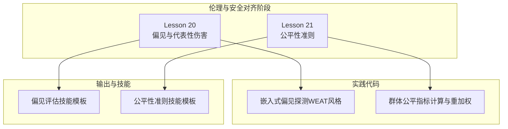
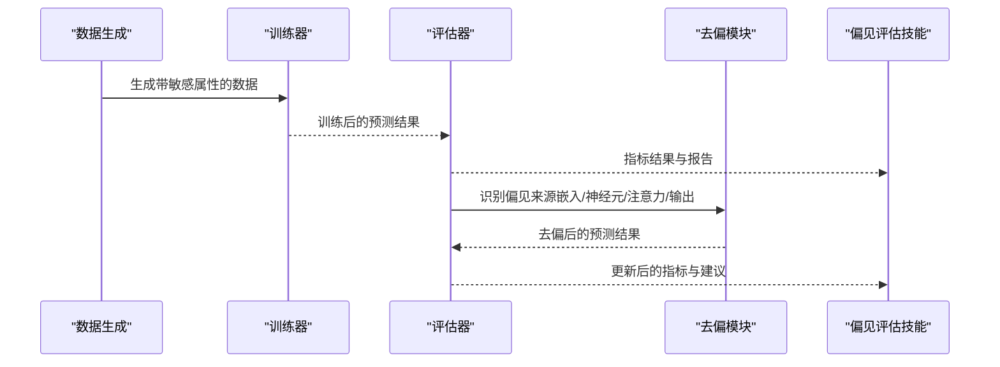
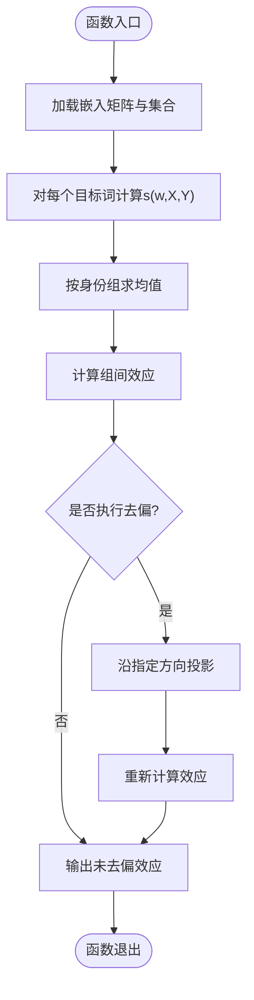
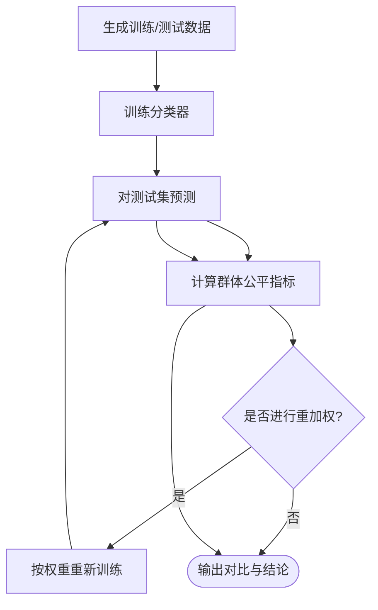
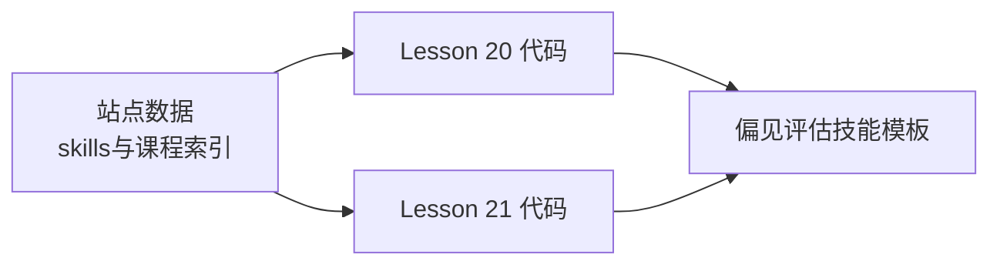

# 偏见与代表性伤害

<cite>
**本文引用的文件**
- [phases/18-ethics-safety-alignment/20-bias-representational-harm/code/main.py](file://phases/18-ethics-safety-alignment/20-bias-representational-harm/code/main.py)
- [phases/18-ethics-safety-alignment/21-fairness-criteria-group-individual-counterfactual/code/main.py](file://phases/18-ethics-safety-alignment/21-fairness-criteria-group-individual-counterfactual/code/main.py)
- [phases/18-ethics-safety-alignment/20-bias-representational-harm/outputs/skill-bias-eval.md](file://phases/18-ethics-safety-alignment/20-bias-representational-harm/outputs/skill-bias-eval.md)
- [site/data.js](file://site/data.js)
- [README.md](file://README.md)
- [ROADMAP.md](file://ROADMAP.md)
</cite>

## 目录
1. [引言](#引言)
2. [项目结构](#项目结构)
3. [核心组件](#核心组件)
4. [架构总览](#架构总览)
5. [详细组件分析](#详细组件分析)
6. [依赖关系分析](#依赖关系分析)
7. [性能考量](#性能考量)
8. [故障排除指南](#故障排除指南)
9. [结论](#结论)
10. [附录](#附录)

## 引言
本文件围绕“偏见与代表性伤害”主题，结合仓库中伦理与安全对齐阶段的相关内容，系统梳理AI系统中偏见的来源、表现与影响机制，阐述代表性伤害的概念、测量方法与缓解策略，并讨论不同类型的偏见（性别、种族、社会经济地位等）在模型中的体现。同时，提供偏见检测、评估与纠正的技术工具与方法，给出公平性指标设计与实施指南，并说明代表性不足对系统性能与社会公正的影响。

## 项目结构
该仓库将“偏见与代表性伤害”的教学与实践内容组织在伦理与安全对齐阶段的两个课程中：
- Lesson 20：偏见与代表性伤害（代表性的嵌入式偏见测量与去偏示例）
- Lesson 21：公平性准则（群体、个体与反事实公平）

此外，站点数据与技能清单中提供了相关学习资源与技能标签，便于构建偏见评估与公平性审计的工作流。

图表来源
- [phases/18-ethics-safety-alignment/20-bias-representational-harm/code/main.py:1-102](file://phases/18-ethics-safety-alignment/20-bias-representational-harm/code/main.py#L1-L102)
- [phases/18-ethics-safety-alignment/21-fairness-criteria-group-individual-counterfactual/code/main.py:1-138](file://phases/18-ethics-safety-alignment/21-fairness-criteria-group-individual-counterfactual/code/main.py#L1-L138)
- [phases/18-ethics-safety-alignment/20-bias-representational-harm/outputs/skill-bias-eval.md:1-30](file://phases/18-ethics-safety-alignment/20-bias-representational-harm/outputs/skill-bias-eval.md#L1-L30)

章节来源
- [README.md:821-822](file://README.md#L821-L822)
- [ROADMAP.md:509-510](file://ROADMAP.md#L509-L510)
- [site/data.js:3822-3834](file://site/data.js#L3822-L3834)

## 核心组件
- 嵌入式偏见探测器（WEAT风格）
  - 使用低维示例嵌入，定义身份组与属性集合，计算目标词与属性集合的余弦相似度差值，进而得到组间效应大小；演示去偏后效果变化。
- 群体公平指标计算器与重加权
  - 构造二分类场景，敏感属性存在基率差异；训练简单逻辑回归分类器并报告三类群体公平指标；通过样本重加权实现针对某一指标的优化，并观察其他指标的变化。
- 偏见评估技能模板
  - 提供基于三类指标框架与交叉性文献的审计清单，覆盖指标类别、伤害类型分离、交叉性覆盖、去偏机制与轴多样性等维度。

章节来源
- [phases/18-ethics-safety-alignment/20-bias-representational-harm/code/main.py:1-102](file://phases/18-ethics-safety-alignment/20-bias-representational-harm/code/main.py#L1-L102)
- [phases/18-ethics-safety-alignment/21-fairness-criteria-group-individual-counterfactual/code/main.py:1-138](file://phases/18-ethics-safety-alignment/21-fairness-criteria-group-individual-counterfactual/code/main.py#L1-L138)
- [phases/18-ethics-safety-alignment/20-bias-representational-harm/outputs/skill-bias-eval.md:1-30](file://phases/18-ethics-safety-alignment/20-bias-representational-harm/outputs/skill-bias-eval.md#L1-L30)

## 架构总览
下图展示从数据生成、模型训练到公平性评估与去偏干预的整体流程，以及与技能模板的对接关系。

图表来源
- [phases/18-ethics-safety-alignment/21-fairness-criteria-group-individual-counterfactual/code/main.py:21-53](file://phases/18-ethics-safety-alignment/21-fairness-criteria-group-individual-counterfactual/code/main.py#L21-L53)
- [phases/18-ethics-safety-alignment/20-bias-representational-harm/code/main.py:48-68](file://phases/18-ethics-safety-alignment/20-bias-representational-harm/code/main.py#L48-L68)
- [phases/18-ethics-safety-alignment/20-bias-representational-harm/outputs/skill-bias-eval.md:10-29](file://phases/18-ethics-safety-alignment/20-bias-representational-harm/outputs/skill-bias-eval.md#L10-L29)

## 详细组件分析

### 组件A：嵌入式偏见探测（WEAT风格）
- 功能概述
  - 在低维语义空间中定义身份轴与属性轴，计算目标词与属性集合的余弦相似度差值，得到组间关联效应；通过投影去除特定方向的偏见，比较去偏前后的效应变化。
- 关键流程
  - 定义嵌入矩阵与身份/属性集合
  - 计算余弦相似度与组间得分差
  - 去偏：沿性别方向进行投影
  - 输出前后对比与结论
- 复杂度与性能
  - 余弦相似度计算为线性复杂度；整体流程适合小规模示例教学与快速验证。
- 错误处理与边界情况
  - 分母加入极小值避免除零；对空集合进行保护性分母处理。
- 可扩展性
  - 可替换为更高维的预训练嵌入；可扩展至多属性与多轴组合。

图表来源
- [phases/18-ethics-safety-alignment/20-bias-representational-harm/code/main.py:42-68](file://phases/18-ethics-safety-alignment/20-bias-representational-harm/code/main.py#L42-L68)

章节来源
- [phases/18-ethics-safety-alignment/20-bias-representational-harm/code/main.py:1-102](file://phases/18-ethics-safety-alignment/20-bias-representational-harm/code/main.py#L1-L102)

### 组件B：群体公平指标与重加权
- 功能概述
  - 在二分类任务中，构造敏感属性基率不均衡的数据；训练逻辑回归分类器；报告三类群体公平指标；通过样本重加权优化某一指标，并观察其他指标的代价。
- 关键流程
  - 数据生成：按敏感属性分配不同基率
  - 训练：逻辑回归参数更新
  - 预测：对测试集进行预测
  - 指标计算：人口统计学公平、相等化几率、条件使用准确性
  - 重加权：针对某指标调整样本权重
- 复杂度与性能
  - 训练与评估均为线性复杂度；适合课堂演示与小规模实验。
- 错误处理与边界情况
  - 对分母为零的情况进行保护性处理；随机种子固定以保证可复现。
- 可扩展性
  - 可替换为更复杂的模型；可引入正则化或鲁棒训练策略。

图表来源
- [phases/18-ethics-safety-alignment/21-fairness-criteria-group-individual-counterfactual/code/main.py:21-53](file://phases/18-ethics-safety-alignment/21-fairness-criteria-group-individual-counterfactual/code/main.py#L21-L53)
- [phases/18-ethics-safety-alignment/21-fairness-criteria-group-individual-counterfactual/code/main.py:65-86](file://phases/18-ethics-safety-alignment/21-fairness-criteria-group-individual-counterfactual/code/main.py#L65-L86)
- [phases/18-ethics-safety-alignment/21-fairness-criteria-group-individual-counterfactual/code/main.py:113-124](file://phases/18-ethics-safety-alignment/21-fairness-criteria-group-individual-counterfactual/code/main.py#L113-L124)

章节来源
- [phases/18-ethics-safety-alignment/21-fairness-criteria-group-individual-counterfactual/code/main.py:1-138](file://phases/18-ethics-safety-alignment/21-fairness-criteria-group-individual-counterfactual/code/main.py#L1-L138)

### 组件C：偏见评估技能模板
- 功能概述
  - 提供一个可复用的审计清单，用于评估偏见报告或公平性声明，覆盖指标类别、伤害类型分离、交叉性覆盖、去偏机制与轴多样性等维度。
- 审计要点
  - 指标覆盖率：至少包含三类指标（嵌入式、概率式、生成文本式）
  - 伤害类型分离：区分代表性伤害与分配性伤害
  - 交叉性覆盖：是否考虑多重身份交集
  - 去偏机制：嵌入、神经元、SAE特征、注意力头或后验过滤
  - 轴多样性：是否涵盖除二元性别外的其他轴
- 禁止与拒绝规则
  - 单一指标类别宣称“已去偏”视为硬拒绝
  - 缺少交叉性评估的公平性声明视为硬拒绝
  - 无通用能力损失评估的去偏干预视为硬拒绝
  - 拒绝“是否完全无偏”的二元判断
  - 不提供单一去偏操作推荐，需结合偏见来源定位

章节来源
- [phases/18-ethics-safety-alignment/20-bias-representational-harm/outputs/skill-bias-eval.md:1-30](file://phases/18-ethics-safety-alignment/20-bias-representational-harm/outputs/skill-bias-eval.md#L1-L30)

## 依赖关系分析
- Lesson 20 与 Lesson 21 的代码相互独立但互补：前者关注代表性层面的嵌入式偏见，后者关注分配层面的群体公平指标。
- 技能模板作为统一的审计框架，可对接两类指标体系与去偏策略。
- 站点数据与技能清单为学习路径与技能标签提供支撑，便于构建端到端的偏见治理工作流。

图表来源
- [site/data.js:3822-3834](file://site/data.js#L3822-L3834)
- [phases/18-ethics-safety-alignment/20-bias-representational-harm/code/main.py:1-102](file://phases/18-ethics-safety-alignment/20-bias-representational-harm/code/main.py#L1-L102)
- [phases/18-ethics-safety-alignment/21-fairness-criteria-group-individual-counterfactual/code/main.py:1-138](file://phases/18-ethics-safety-alignment/21-fairness-criteria-group-individual-counterfactual/code/main.py#L1-L138)
- [phases/18-ethics-safety-alignment/20-bias-representational-harm/outputs/skill-bias-eval.md:1-30](file://phases/18-ethics-safety-alignment/20-bias-representational-harm/outputs/skill-bias-eval.md#L1-L30)

章节来源
- [site/data.js:3822-3834](file://site/data.js#L3822-L3834)
- [README.md:821-822](file://README.md#L821-L822)
- [ROADMAP.md:509-510](file://ROADMAP.md#L509-L510)

## 性能考量
- 教学示例采用低维嵌入与小规模数据，便于理解算法原理与可视化结果。
- 实际应用中，应使用高维预训练嵌入与大规模数据集，结合分布式训练与高效指标计算。
- 去偏策略的成本（如通用能力下降）需要在代表性伤害与分配性公平之间进行权衡。

## 故障排除指南
- 指标异常或不稳定
  - 检查数据生成过程中的基率设置与噪声参数
  - 确认分母保护与边界条件处理
- 去偏无效或过度
  - 核对去偏方向与投影公式
  - 结合技能模板检查是否仅依赖单一指标类别
- 报告缺失关键维度
  - 使用技能模板逐项核对：指标类别、伤害类型分离、交叉性覆盖、去偏机制与轴多样性

章节来源
- [phases/18-ethics-safety-alignment/20-bias-representational-harm/code/main.py:42-68](file://phases/18-ethics-safety-alignment/20-bias-representational-harm/code/main.py#L42-L68)
- [phases/18-ethics-safety-alignment/21-fairness-criteria-group-individual-counterfactual/code/main.py:65-86](file://phases/18-ethics-safety-alignment/21-fairness-criteria-group-individual-counterfactual/code/main.py#L65-L86)
- [phases/18-ethics-safety-alignment/20-bias-representational-harm/outputs/skill-bias-eval.md:20-29](file://phases/18-ethics-safety-alignment/20-bias-representational-harm/outputs/skill-bias-eval.md#L20-L29)

## 结论
本仓库通过两门课程与配套技能模板，提供了从代表性伤害测量到群体公平指标评估再到去偏干预的完整教学与实践路径。建议在实际部署中：
- 同时覆盖三类指标（嵌入式、概率式、生成文本式），并区分代表性与分配性伤害
- 强化交叉性评估与轴多样性覆盖
- 明确去偏来源与通用能力成本，并避免单一指标宣称“已去偏”
- 将技能模板纳入持续评估与审计流程，确保公平性与代表性在全生命周期内得到保障

## 附录
- 学习与实践建议
  - 先完成Lesson 20的嵌入式偏见探测，再完成Lesson 21的群体公平指标计算
  - 使用技能模板对现有模型进行系统性审计
  - 在真实场景中逐步引入更复杂的去偏策略与评估指标

章节来源
- [README.md:821-822](file://README.md#L821-L822)
- [ROADMAP.md:509-510](file://ROADMAP.md#L509-L510)
- [site/data.js:3822-3834](file://site/data.js#L3822-L3834)