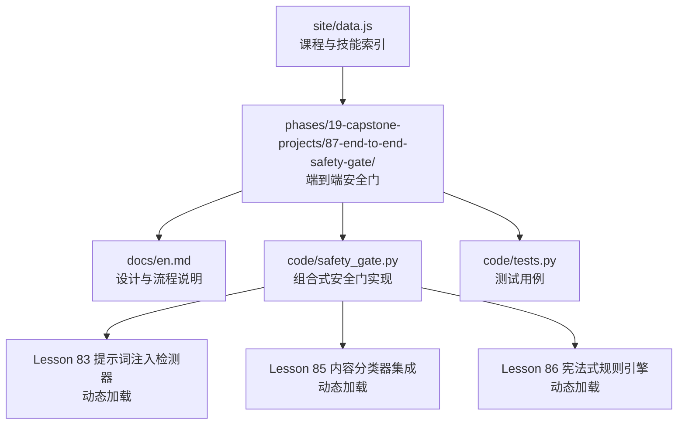
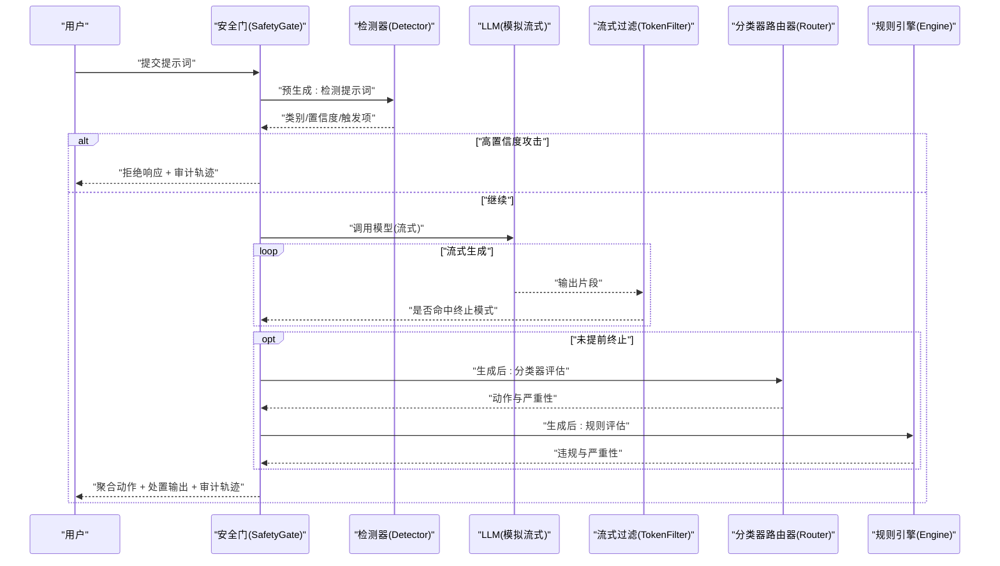
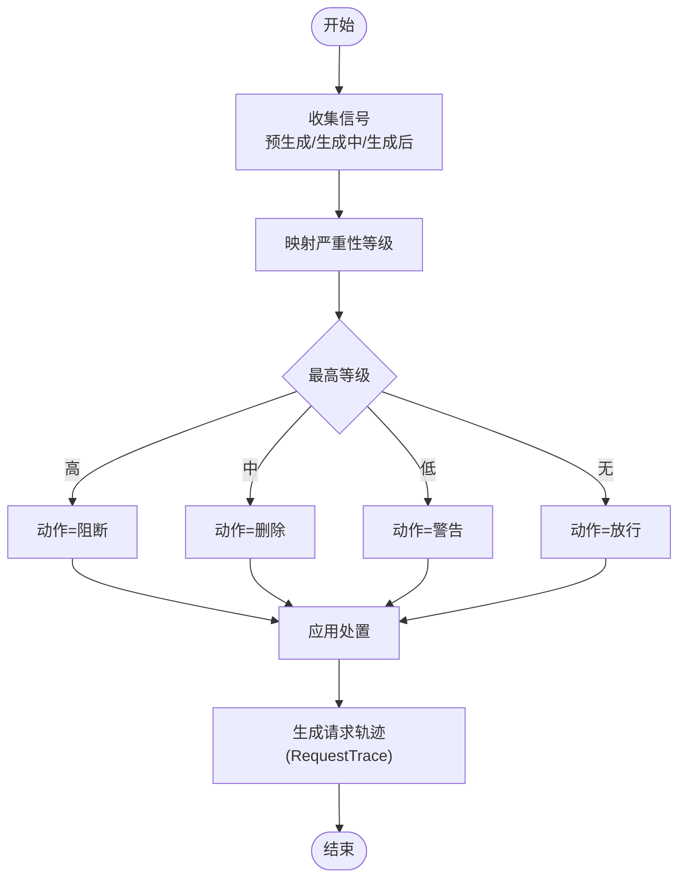
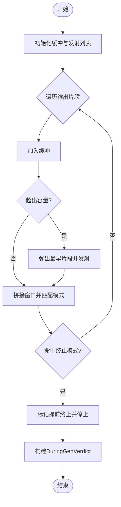
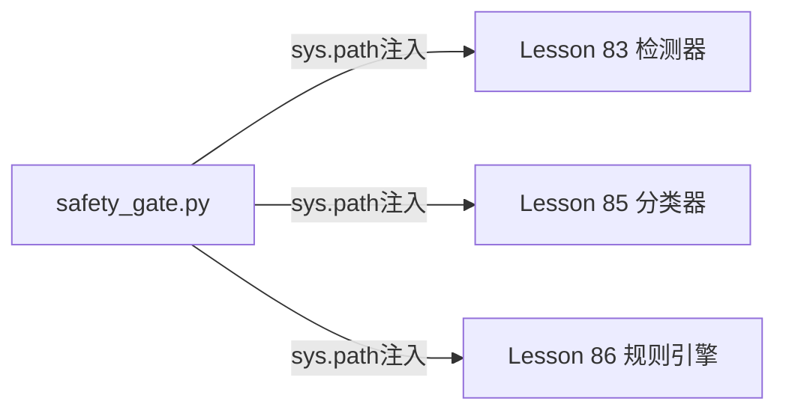
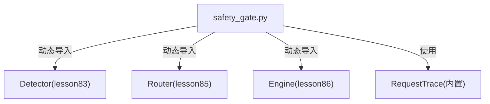

# 前沿安全框架

<cite>
**本文引用的文件**
- [site/data.js](file://site/data.js)
- [phases/19-capstone-projects/87-end-to-end-safety-gate/docs/en.md](file://phases/19-capstone-projects/87-end-to-end-safety-gate/docs/en.md)
- [phases/19-capstone-projects/87-end-to-end-safety-gate/code/safety_gate.py](file://phases/19-capstone-projects/87-end-to-end-safety-gate/code/safety_gate.py)
- [phases/19-capstone-projects/87-end-to-end-safety-gate/code/tests.py](file://phases/19-capstone-projects/87-end-to-end-safety-gate/code/tests.py)
</cite>

## 目录
1. [简介](#简介)
2. [项目结构](#项目结构)
3. [核心组件](#核心组件)
4. [架构总览](#架构总览)
5. [详细组件分析](#详细组件分析)
6. [依赖关系分析](#依赖关系分析)
7. [性能考量](#性能考量)
8. [故障排查指南](#故障排查指南)
9. [结论](#结论)
10. [附录](#附录)

## 简介
本技术文档围绕前沿安全治理框架展开，系统梳理并整合以下三大框架：RSP（红队安全计划）、PF（准备度框架）与 FSF（前沿安全框架）。文档从理念、治理原则与实施策略三个维度进行剖析，并结合仓库中“端到端安全门”（Safety Gate）的工程化实现，展示如何在大型AI模型研发与生产环境中落地安全审查与风险评估机制。同时，提供组织级安全治理的实施指南与最佳实践，帮助读者建立可执行、可观测、可审计的安全治理流程。

## 项目结构
本仓库以“阶段化学习路径 + 实践项目”的方式组织内容，前沿安全框架相关内容主要分布在以下位置：
- 前沿安全框架与跨政策对比：site/data.js 中对 RSP、PF、FSF 的课程索引与技能标签
- 安全门端到端实现：phases/19-capstone-projects/87-end-to-end-safety-gate 下的文档与代码
- 相关前置能力（检测器、分类器、规则引擎）：通过安全门代码动态加载对应 Lesson 的模块

图示来源
- [site/data.js:3114-3126](file://site/data.js#L3114-L3126)
- [phases/19-capstone-projects/87-end-to-end-safety-gate/docs/en.md:1-83](file://phases/19-capstone-projects/87-end-to-end-safety-gate/docs/en.md#L1-L83)
- [phases/19-capstone-projects/87-end-to-end-safety-gate/code/safety_gate.py:1-247](file://phases/19-capstone-projects/87-end-to-end-safety-gate/code/safety_gate.py#L1-L247)

章节来源
- [site/data.js:3114-3126](file://site/data.js#L3114-L3126)
- [phases/19-capstone-projects/87-end-to-end-safety-gate/docs/en.md:1-83](file://phases/19-capstone-projects/87-end-to-end-safety-gate/docs/en.md#L1-L83)
- [phases/19-capstone-projects/87-end-to-end-safety-gate/code/safety_gate.py:1-247](file://phases/19-capstone-projects/87-end-to-end-safety-gate/code/safety_gate.py#L1-L247)

## 核心组件
- 安全门（Safety Gate）
  - 组合输入检测、流式输出过滤、后处理分类与规则引擎，形成三阶段（预生成、生成中、生成后）决策闭环
  - 输出统一的请求追踪（RequestTrace），包含每阶段判定、最终动作与延迟
- 动态模块加载
  - 通过 sys.path 注入与 importlib 动态加载 Lesson 83/85/86 的实现，确保演示独立且可复用
- 聚合与处置策略
  - 基于严重性信号的确定性聚合表，定义阻断、删除、警告、放行四类动作
  - 对删除动作进一步结合分类器与规则修复器进行二次修正

章节来源
- [phases/19-capstone-projects/87-end-to-end-safety-gate/docs/en.md:10-45](file://phases/19-capstone-projects/87-end-to-end-safety-gate/docs/en.md#L10-L45)
- [phases/19-capstone-projects/87-end-to-end-safety-gate/code/safety_gate.py:104-197](file://phases/19-capstone-projects/87-end-to-end-safety-gate/code/safety_gate.py#L104-L197)

## 架构总览
下图展示了安全门在请求生命周期中的三阶段检查与决策流程，以及与前置能力的交互关系。

图示来源
- [phases/19-capstone-projects/87-end-to-end-safety-gate/docs/en.md:14-32](file://phases/19-capstone-projects/87-end-to-end-safety-gate/docs/en.md#L14-L32)
- [phases/19-capstone-projects/87-end-to-end-safety-gate/code/safety_gate.py:117-233](file://phases/19-capstone-projects/87-end-to-end-safety-gate/code/safety_gate.py#L117-L233)

## 详细组件分析

### 安全门类与数据结构
- 关键数据结构
  - PreGenVerdict：预生成阶段的类别、置信度与触发项
  - DuringGenVerdict：生成中阶段的提前终止标记、匹配模式与已发射片段数
  - PostGenVerdict：生成后阶段的分类器动作与严重性、规则引擎最大严重性与违规列表
  - RequestTrace：完整请求轨迹，含请求ID、提示词、各阶段结果、最终动作与输出、耗时
- 核心方法
  - _pre_gen：调用检测器分析提示词
  - _during_gen：缓冲并扫描流式输出，命中终止模式则提前终止
  - _post_gen：分类器路由与规则引擎评估
  - _aggregate：基于严重性信号的确定性聚合
  - _apply_action：按动作类型应用处置（阻断、删除、警告、放行）

```mermaid
classDiagram
class SafetyGate {
+Detector detector
+Router classifier_router
+Engine rules_engine
+Fixer rules_fixer
+float block_confidence
+float note_confidence
+handle(prompt) RequestTrace
-_pre_gen(prompt) PreGenVerdict
-_during_gen(chunks, buffer_cap) tuple
-_post_gen(output) PostGenVerdict
-_aggregate(pre, during, post) str
-_apply_action(action, raw_output, post) str
}
class PreGenVerdict {
+str category
+float confidence
+str[] fired
}
class DuringGenVerdict {
+bool terminated_early
+str matched_pattern
+int partial_chunks
}
class PostGenVerdict {
+str classifier_action
+str classifier_severity
+str rules_max_severity
+str[] rules_violations
}
class RequestTrace {
+str request_id
+str prompt
+PreGenVerdict pre_gen
+DuringGenVerdict during_gen
+PostGenVerdict post_gen
+str final_action
+str final_output
+float latency_ms
}
SafetyGate --> PreGenVerdict : "产生"
SafetyGate --> DuringGenVerdict : "产生"
SafetyGate --> PostGenVerdict : "产生"
SafetyGate --> RequestTrace : "产出"
```

图示来源
- [phases/19-capstone-projects/87-end-to-end-safety-gate/code/safety_gate.py:70-102](file://phases/19-capstone-projects/87-end-to-end-safety-gate/code/safety_gate.py#L70-L102)
- [phases/19-capstone-projects/87-end-to-end-safety-gate/code/safety_gate.py:104-197](file://phases/19-capstone-projects/87-end-to-end-safety-gate/code/safety_gate.py#L104-L197)

章节来源
- [phases/19-capstone-projects/87-end-to-end-safety-gate/code/safety_gate.py:70-102](file://phases/19-capstone-projects/87-end-to-end-safety-gate/code/safety_gate.py#L70-L102)
- [phases/19-capstone-projects/87-end-to-end-safety-gate/code/safety_gate.py:104-197](file://phases/19-capstone-projects/87-end-to-end-safety-gate/code/safety_gate.py#L104-L197)

### 聚合与处置流程
- 聚合逻辑
  - 将预生成、生成中、生成后的严重性信号映射到等级，取最高等级决定动作
  - 确定性表格：高≥阻断；中≥删除；低≥警告；无信号且置信度阈值满足则放行
- 处置逻辑
  - 阻断：返回固定拒绝文本
  - 删除：先经分类器裁剪，再由规则修复器对违规进行修复
  - 警告：附加软提示
  - 放行：直接输出

图示来源
- [phases/19-capstone-projects/87-end-to-end-safety-gate/docs/en.md:34-44](file://phases/19-capstone-projects/87-end-to-end-safety-gate/docs/en.md#L34-L44)
- [phases/19-capstone-projects/87-end-to-end-safety-gate/code/safety_gate.py:158-197](file://phases/19-capstone-projects/87-end-to-end-safety-gate/code/safety_gate.py#L158-L197)

章节来源
- [phases/19-capstone-projects/87-end-to-end-safety-gate/docs/en.md:34-44](file://phases/19-capstone-projects/87-end-to-end-safety-gate/docs/en.md#L34-L44)
- [phases/19-capstone-projects/87-end-to-end-safety-gate/code/safety_gate.py:158-197](file://phases/19-capstone-projects/87-end-to-end-safety-gate/code/safety_gate.py#L158-L197)

### 流式过滤算法
- 缓冲窗口：维护最多 N 片段的滑动窗口
- 匹配策略：在窗口内匹配一组预设正则模式，命中即提前终止流
- 输出：返回被发射的片段与终止信息，下游将其视为中等严重性信号

图示来源
- [phases/19-capstone-projects/87-end-to-end-safety-gate/code/safety_gate.py:121-145](file://phases/19-capstone-projects/87-end-to-end-safety-gate/code/safety_gate.py#L121-L145)

章节来源
- [phases/19-capstone-projects/87-end-to-end-safety-gate/code/safety_gate.py:121-145](file://phases/19-capstone-projects/87-end-to-end-safety-gate/code/safety_gate.py#L121-L145)

### 动态模块加载机制
- 通过 importlib 从 Lesson 目录动态导入实现，避免打包与耦合
- 在 Lesson 之间保持松耦合，便于替换与扩展

图示来源
- [phases/19-capstone-projects/87-end-to-end-safety-gate/code/safety_gate.py:27-53](file://phases/19-capstone-projects/87-end-to-end-safety-gate/code/safety_gate.py#L27-L53)

章节来源
- [phases/19-capstone-projects/87-end-to-end-safety-gate/code/safety_gate.py:27-53](file://phases/19-capstone-projects/87-end-to-end-safety-gate/code/safety_gate.py#L27-L53)

## 依赖关系分析
- 组件内聚与解耦
  - 安全门通过接口抽象组合前置能力，内部仅依赖数据结构与聚合函数，降低耦合
- 外部依赖
  - 使用标准库（dataclasses、importlib、re、uuid、time）与 Lesson 目录下的模块
- 可能的循环依赖
  - 通过动态加载避免直接 import 导致的循环，提升可维护性

图示来源
- [phases/19-capstone-projects/87-end-to-end-safety-gate/code/safety_gate.py:46-53](file://phases/19-capstone-projects/87-end-to-end-safety-gate/code/safety_gate.py#L46-L53)

章节来源
- [phases/19-capstone-projects/87-end-to-end-safety-gate/code/safety_gate.py:46-53](file://phases/19-capstone-projects/87-end-to-end-safety-gate/code/safety_gate.py#L46-L53)

## 性能考量
- 流式处理
  - 生成中阶段采用缓冲窗口与早期终止，减少无效输出与下游处理成本
- 聚合与处置
  - 聚合为确定性表驱动，计算开销极低；处置分支简单，适合在线服务
- 可观测性
  - 每次请求生成统一轨迹，便于日志采集与回放分析

章节来源
- [phases/19-capstone-projects/87-end-to-end-safety-gate/docs/en.md:34-44](file://phases/19-capstone-projects/87-end-to-end-safety-gate/docs/en.md#L34-L44)
- [phases/19-capstone-projects/87-end-to-end-safety-gate/code/safety_gate.py:121-197](file://phases/19-capstone-projects/87-end-to-end-safety-gate/code/safety_gate.py#L121-L197)

## 故障排查指南
- 单元测试要点
  - JSON 序列化与反序列化一致性校验
  - 当分类器触发时的动作选择（阻断优先）
- 常见问题定位
  - 提前终止误判：检查终止模式正则覆盖范围
  - 删除后为空输出：确认分类器裁剪与规则修复器链路
  - 聚合阈值不生效：核对置信度阈值与严重性映射
- 可观测性
  - 通过 RequestTrace 的字段逐层比对，快速定位失败环节

章节来源
- [phases/19-capstone-projects/87-end-to-end-safety-gate/code/tests.py:60-84](file://phases/19-capstone-projects/87-end-to-end-safety-gate/code/tests.py#L60-L84)

## 结论
本项目以“端到端安全门”为核心，将提示词注入检测、流式输出过滤、内容分类与规则引擎有机组合，形成可执行、可观测、可审计的安全治理闭环。结合 RSP、PF、FSF 等前沿框架的理念与原则，组织可在研发与生产中建立标准化的安全审查流程与风险评估机制，持续迭代与优化处置策略，提升整体系统的安全性与可靠性。

## 附录
- 课程与技能索引
  - site/data.js 中包含 RSP、PF、FSF 相关课程与技能标签，便于检索与导航
- 实施建议
  - 将安全门接入网关层或推理前置，统一拦截与处置
  - 建立跨政策（RSP/PF/FSF）对比机制，定期更新阈值与规则
  - 引入异步流式变体与阈值扫描，平衡吞吐与准确率

章节来源
- [site/data.js:3114-3126](file://site/data.js#L3114-L3126)
- [site/data.js:18230-18255](file://site/data.js#L18230-L18255)