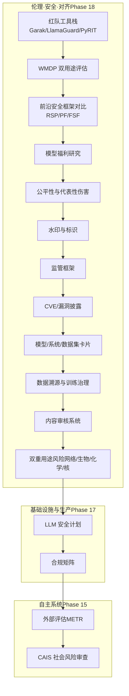
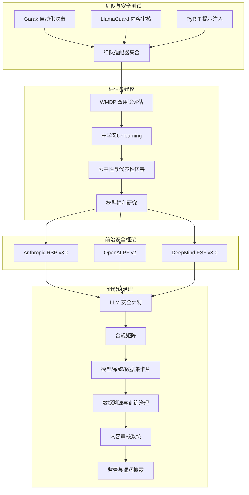
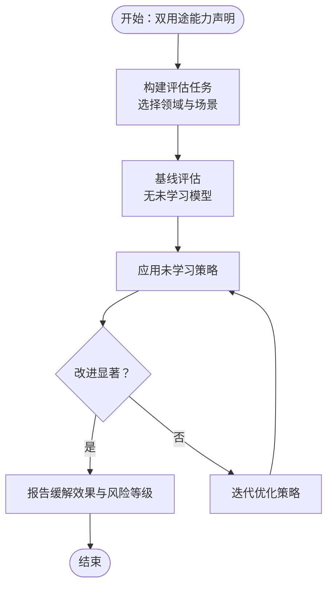
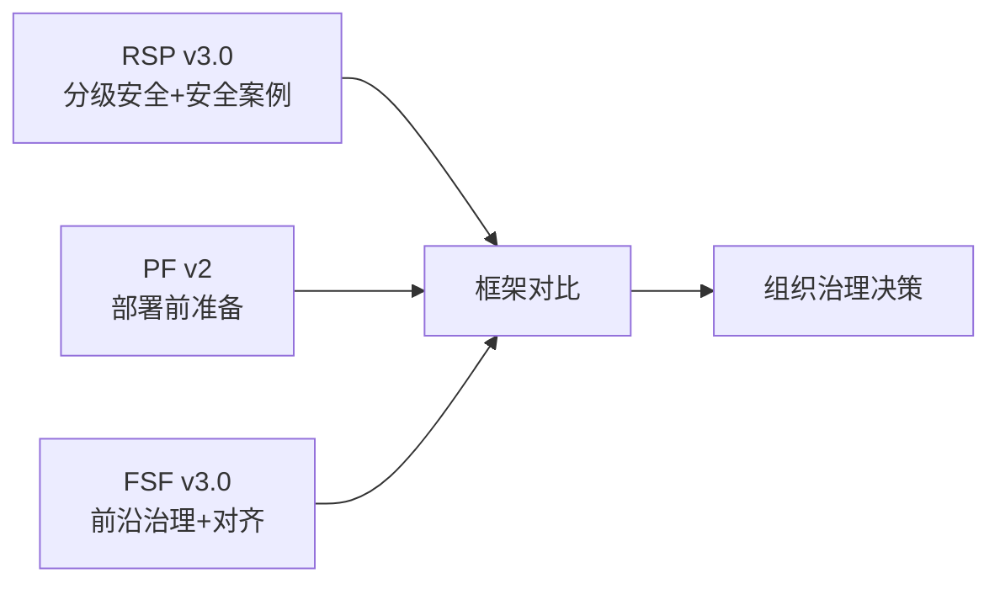
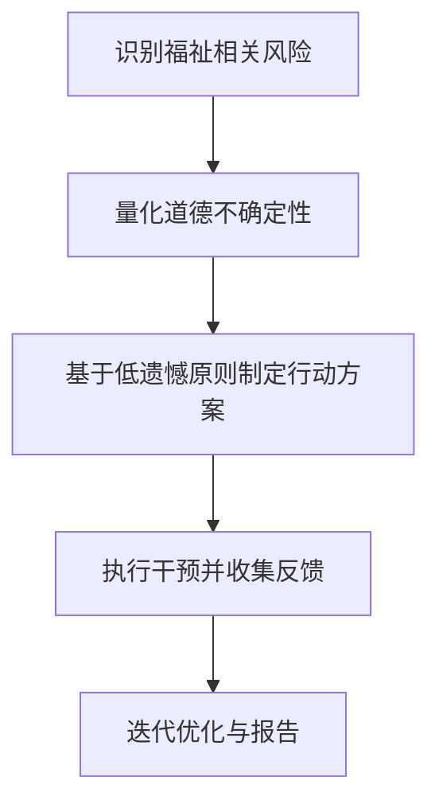
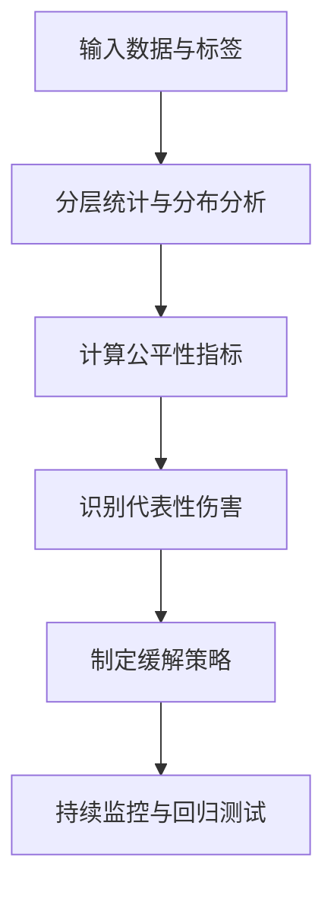
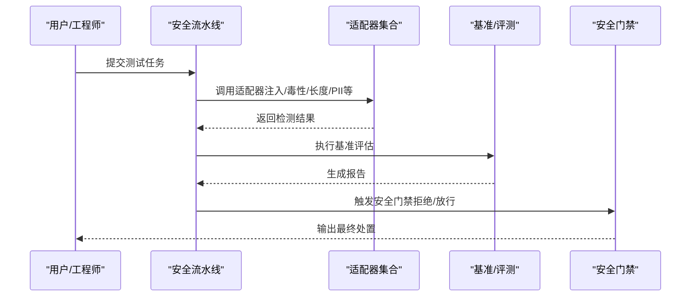
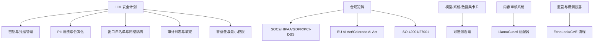
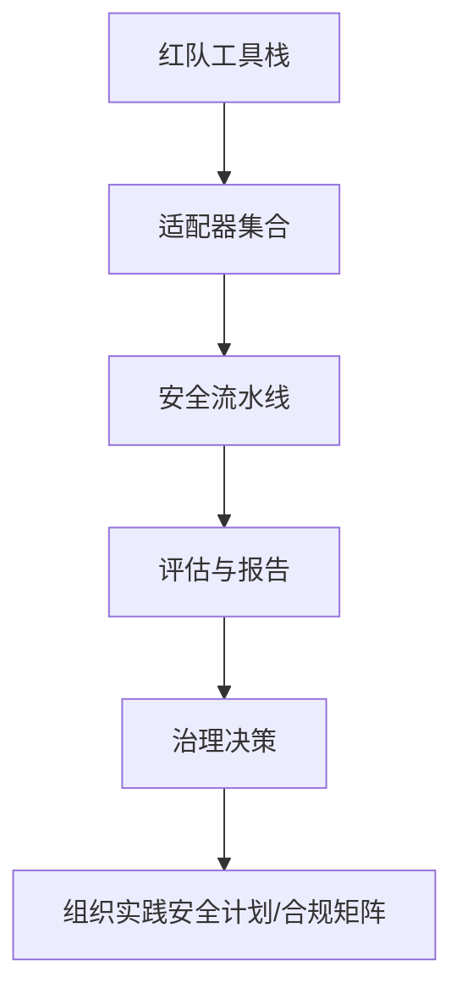

# 安全治理框架

<cite>
**本文引用的文件**
- [site/data.js](file://site/data.js)
- [phases/18-ethics-safety-alignment/16-red-team-tooling-garak-llamaguard-pyrit/outputs/skill-red-team-stack.md](file://phases/18-ethics-safety-alignment/16-red-team-tooling-garak-llamaguard-pyrit/outputs/skill-red-team-stack.md)
- [phases/18-ethics-safety-alignment/16-red-team-tooling-garak-llamaguard-pyrit/outputs/skill-red-team-stack.zh.md](file://phases/18-ethics-safety-alignment/16-red-team-tooling-garak-llamaguard-pyrit/outputs/skill-red-team-stack.zh.md)
- [phases/18-ethics-safety-alignment/17-wmdp-dual-use-evaluation/outputs/skill-wmdp-eval.md](file://phases/18-ethics-safety-alignment/17-wmdp-dual-use-evaluation/outputs/skill-wmdp-eval.md)
- [phases/18-ethics-safety-alignment/17-wmdp-dual-use-evaluation/outputs/skill-wmdp-eval.zh.md](file://phases/18-ethics-safety-alignment/17-wmdp-dual-use-evaluation/outputs/skill-wmdp-eval.zh.md)
- [phases/18-ethics-safety-alignment/18-frontier-safety-frameworks-rsp-pf-fsf/outputs/skill-framework-diff.md](file://phases/18-ethics-safety-alignment/18-frontier-safety-frameworks-rsp-pf-fsf/outputs/skill-framework-diff.md)
- [phases/18-ethics-safety-alignment/18-frontier-safety-frameworks-rsp-pf-fsf/outputs/skill-framework-diff.zh.md](file://phases/18-ethics-safety-alignment/18-frontier-safety-frameworks-rsp-pf-fsf/outputs/skill-framework-diff.zh.md)
- [phases/18-ethics-safety-alignment/19-model-welfare-research/outputs/skill-welfare-assessment.md](file://phases/18-ethics-safety-alignment/19-model-welfare-research/outputs/skill-welfare-assessment.md)
- [phases/18-ethics-safety-alignment/19-model-welfare-research/outputs/skill-welfare-assessment.zh.md](file://phases/18-ethics-safety-alignment/19-model-welfare-research/outputs/skill-welfare-assessment.zh.md)
- [phases/18-ethics-safety-alignment/20-bias-representational-harm/outputs/skill-bias-eval.md](file://phases/18-ethics-safety-alignment/20-bias-representational-harm/outputs/skill-bias-eval.md)
- [phases/18-ethics-safety-alignment/20-bias-representational-harm/outputs/skill-bias-eval.zh.md](file://phases/18-ethics-safety-alignment/20-bias-representational-harm/outputs/skill-bias-eval.zh.md)
- [phases/18-ethics-safety-alignment/21-fairness-criteria-group-individual-counterfactual/outputs/skill-fairness-criteria.md](file://phases/18-ethics-safety-alignment/21-fairness-criteria-group-individual-counterfactual/outputs/skill-fairness-criteria.md)
- [phases/18-ethics-safety-alignment/21-fairness-criteria-group-individual-counterfactual/outputs/skill-fairness-criteria.zh.md](file://phases/18-ethics-safety-alignment/21-fairness-criteria-group-individual-counterfactual/outputs/skill-fairness-criteria.zh.md)
- [phases/18-ethics-safety-alignment/23-watermarking-synthid-stable-signature-c2pa/outputs/skill-watermarking.md](file://phases/18-ethics-safety-alignment/23-watermarking-synthid-stable-signature-c2pa/outputs/skill-watermarking.md)
- [phases/18-ethics-safety-alignment/23-watermarking-synthid-stable-signature-c2pa/outputs/skill-watermarking.zh.md](file://phases/18-ethics-safety-alignment/23-watermarking-synthid-stable-signature-c2pa/outputs/skill-watermarking.zh.md)
- [phases/18-ethics-safety-alignment/24-regulatory-frameworks-eu-us-uk-korea/outputs/skill-regulatory-frameworks.md](file://phases/18-ethics-safety-alignment/24-regulatory-frameworks-eu-us-uk-korea/outputs/skill-regulatory-frameworks.md)
- [phases/18-ethics-safety-alignment/24-regulatory-frameworks-eu-us-uk-korea/outputs/skill-regulatory-frameworks.zh.md](file://phases/18-ethics-safety-alignment/24-regulatory-frameworks-eu-us-uk-korea/outputs/skill-regulatory-frameworks.zh.md)
- [phases/18-ethics-safety-alignment/25-echoleak-cves-for-ai/outputs/skill-echoleak-cves.md](file://phases/18-ethics-safety-alignment/25-echoleak-cves-for-ai/outputs/skill-echoleak-cves.md)
- [phases/18-ethics-safety-alignment/25-echoleak-cves-for-ai/outputs/skill-echoleak-cves.zh.md](file://phases/18-ethics-safety-alignment/25-echoleak-cves-for-ai/outputs/skill-echoleak-cves.zh.md)
- [phases/18-ethics-safety-alignment/26-model-system-dataset-cards/outputs/skill-model-system-cards.md](file://phases/18-ethics-safety-alignment/26-model-system-dataset-cards/outputs/skill-model-system-cards.md)
- [phases/18-ethics-safety-alignment/26-model-system-dataset-cards/outputs/skill-model-system-cards.zh.md](file://phases/18-ethics-safety-alignment/26-model-system-dataset-cards/outputs/skill-model-system-cards.zh.md)
- [phases/18-ethics-safety-alignment/27-data-provenance-training-governance/outputs/skill-data-provenance.md](file://phases/18-ethics-safety-alignment/27-data-provenance-training-governance/outputs/skill-data-provenance.md)
- [phases/18-ethics-safety-alignment/27-data-provenance-training-governance/outputs/skill-data-provenance.zh.md](file://phases/18-ethics-safety-alignment/27-data-provenance-training-governance/outputs/skill-data-provenance.zh.md)
- [phases/18-ethics-safety-alignment/29-moderation-systems-openai-perspective-llamaguard/outputs/skill-moderation-systems.md](file://phases/18-ethics-safety-alignment/29-moderation-systems-openai-perspective-llamaguard/outputs/skill-moderation-systems.md)
- [phases/18-ethics-safety-alignment/29-moderation-systems-openai-perspective-llamaguard/outputs/skill-moderation-systems.zh.md](file://phases/18-ethics-safety-alignment/29-moderation-systems-openai-perspective-llamaguard/outputs/skill-moderation-systems.zh.md)
- [phases/18-ethics-safety-alignment/30-dual-use-risk-cyber-bio-chem-nuclear/outputs/skill-dual-use-risk.md](file://phases/18-ethics-safety-alignment/30-dual-use-risk-cyber-bio-chem-nuclear/outputs/skill-dual-use-risk.md)
- [phases/18-ethics-safety-alignment/30-dual-use-risk-cyber-bio-chem-nuclear/outputs/skill-dual-use-risk.zh.md](file://phases/18-ethics-safety-alignment/30-dual-use-risk-cyber-bio-chem-nuclear/outputs/skill-dual-use-risk.zh.md)
- [phases/17-infrastructure-and-production/25-security-secrets-audit/outputs/skill-llm-security-plan.md](file://phases/17-infrastructure-and-production/25-security-secrets-audit/outputs/skill-llm-security-plan.md)
- [phases/17-infrastructure-and-production/25-security-secrets-audit/outputs/skill-llm-security-plan.zh.md](file://phases/17-infrastructure-and-production/25-security-secrets-audit/outputs/skill-llm-security-plan.zh.md)
- [phases/17-infrastructure-and-production/26-compliance-frameworks/outputs/skill-compliance-matrix.md](file://phases/17-infrastructure-and-production/26-compliance-frameworks/outputs/skill-compliance-matrix.md)
- [phases/17-infrastructure-and-production/26-compliance-frameworks/outputs/skill-compliance-matrix.zh.md](file://phases/17-infrastructure-and-production/26-compliance-frameworks/outputs/skill-compliance-matrix.zh.md)
- [phases/15-autonomous-systems/21-metr-external-evaluation/outputs/skill-horizon-interpretation.md](file://phases/15-autonomous-systems/21-metr-external-evaluation/outputs/skill-horizon-interpretation.md)
- [phases/15-autonomous-systems/21-metr-external-evaluation/outputs/skill-horizon-interpretation.zh.md](file://phases/15-autonomous-systems/21-metr-external-evaluation/outputs/skill-horizon-interpretation.zh.md)
- [phases/15-autonomous-systems/22-cais-caisi-societal-risk/outputs/skill-societal-risk-review.md](file://phases/15-autonomous-systems/22-cais-caisi-societal-risk/outputs/skill-societal-risk-review.md)
- [phases/15-autonomous-systems/22-cais-caisi-societal-risk/outputs/skill-societal-risk-review.zh.md](file://phases/15-autonomous-systems/22-cais-caisi-societal-risk/outputs/skill-societal-risk-review.zh.md)
- [guardrails-sandbox/backend/pipeline.py](file://guardrails-sandbox/backend/pipeline.py)
- [guardrails-sandbox/backend/test_cases.py](file://guardrails-sandbox/backend/test_cases.py)
- [guardrails-sandbox/backend/playground/modules/registry.py](file://guardrails-sandbox/backend/playground/modules/registry.py)
- [guardrails-sandbox/backend/adapters/base.py](file://guardrails-sandbox/backend/adapters/base.py)
- [guardrails-sandbox/backend/adapters/context_engine.py](file://guardrails-sandbox/backend/adapters/context_engine.py)
- [guardrails-sandbox/backend/adapters/factual_classifier.py](file://guardrails-sandbox/backend/adapters/factual_classifier.py)
- [guardrails-sandbox/backend/adapters/format_validator.py](file://guardrails-sandbox/backend/adapters/format_validator.py)
- [guardrails-sandbox/backend/adapters/injection.py](file://guardrails-sandbox/backend/adapters/injection.py)
- [guardrails-sandbox/backend/adapters/length_check.py](file://guardrails-sandbox/backend/adapters/length_check.py)
- [guardrails-sandbox/backend/adapters/output_scrubber.py](file://guardrails-sandbox/backend/adapters/output_scrubber.py)
- [guardrails-sandbox/backend/adapters/pii_detector.py](file://guardrails-sandbox/backend/adapters/pii_detector.py)
- [guardrails-sandbox/backend/adapters/prompt_leak.py](file://guardrails-sandbox/backend/adapters/prompt_leak.py)
- [guardrails-sandbox/backend/adapters/rag_groundedness.py](file://guardrails-sandbox/backend/adapters/rag_groundedness.py)
- [guardrails-sandbox/backend/adapters/rate_limiter.py](file://guardrails-sandbox/backend/adapters/rate_limiter.py)
- [guardrails-sandbox/backend/adapters/relevance.py](file://guardrails-sandbox/backend/adapters/relevance.py)
- [guardrails-sandbox/backend/adapters/topic_classifier.py](file://guardrails-sandbox/backend/adapters/topic_classifier.py)
- [guardrails-sandbox/backend/adapters/toxicity.py](file://guardrails-sandbox/backend/adapters/toxicity.py)
- [guardrails-sandbox/backend/benchmark.py](file://guardrails-sandbox/backend/benchmark.py)
- [guardrails-sandbox/backend/llm_client.py](file://guardrails-sandbox/backend/llm_client.py)
- [guardrails-sandbox/backend/main.py](file://guardrails-sandbox/backend/main.py)
- [guardrails-sandbox/run.sh](file://guardrails-sandbox/run.sh)
</cite>

## 目录
1. 引言
2. 项目结构
3. 核心组件
4. 架构总览
5. 详细组件分析
6. 依赖关系分析
7. 性能考量
8. 故障排查指南
9. 结论
10. 附录

## 引言
本文件系统化梳理该仓库中关于“安全治理框架”的知识体系，围绕以下主题展开：WMDP 双用途评估、Frontier 安全框架（RSP、PF、FSF）、模型福利研究（Model Welfare）、公平性与代表性伤害（Bias & Representational Harm）、红队工具生态与自动化安全测试平台、以及组织级安全治理最佳实践。文档以渐进方式呈现，既面向初学者提供概念理解，也面向工程实践者提供可落地的实施指南。

## 项目结构
本项目的“伦理、安全与对齐”阶段（Phase 18）集中承载了安全治理相关的内容，包括红队工具栈、WMDP 双用途评估、三大前沿安全框架对比、模型福利研究、公平性准则、水印与合规、数据溯源与系统卡片、监管框架、CVE/漏洞披露等模块。同时，第 17 阶段基础设施与生产安全提供了组织级安全与合规的支撑能力；第 15 阶段的 METR 外部评估与 CAIS 社会风险审查则体现了对长期影响与社会尺度风险的治理视角。

图示来源
- [site/data.js](file://site/data.js)
- [phases/18-ethics-safety-alignment/16-red-team-tooling-garak-llamaguard-pyrit/outputs/skill-red-team-stack.md](file://phases/18-ethics-safety-alignment/16-red-team-tooling-garak-llamaguard-pyrit/outputs/skill-red-team-stack.md)
- [phases/18-ethics-safety-alignment/17-wmdp-dual-use-evaluation/outputs/skill-wmdp-eval.md](file://phases/18-ethics-safety-alignment/17-wmdp-dual-use-evaluation/outputs/skill-wmdp-eval.md)
- [phases/18-ethics-safety-alignment/18-frontier-safety-frameworks-rsp-pf-fsf/outputs/skill-framework-diff.md](file://phases/18-ethics-safety-alignment/18-frontier-safety-frameworks-rsp-pf-fsf/outputs/skill-framework-diff.md)
- [phases/18-ethics-safety-alignment/19-model-welfare-research/outputs/skill-welfare-assessment.md](file://phases/18-ethics-safety-alignment/19-model-welfare-research/outputs/skill-welfare-assessment.md)
- [phases/18-ethics-safety-alignment/20-bias-representational-harm/outputs/skill-bias-eval.md](file://phases/18-ethics-safety-alignment/20-bias-representational-harm/outputs/skill-bias-eval.md)
- [phases/18-ethics-safety-alignment/23-watermarking-synthid-stable-signature-c2pa/outputs/skill-watermarking.md](file://phases/18-ethics-safety-alignment/23-watermarking-synthid-stable-signature-c2pa/outputs/skill-watermarking.md)
- [phases/18-ethics-safety-alignment/24-regulatory-frameworks-eu-us-uk-korea/outputs/skill-regulatory-frameworks.md](file://phases/18-ethics-safety-alignment/24-regulatory-frameworks-eu-us-uk-korea/outputs/skill-regulatory-frameworks.md)
- [phases/18-ethics-safety-alignment/25-echoleak-cves-for-ai/outputs/skill-echoleak-cves.md](file://phases/18-ethics-safety-alignment/25-echoleak-cves-for-ai/outputs/skill-echoleak-cves.md)
- [phases/18-ethics-safety-alignment/26-model-system-dataset-cards/outputs/skill-model-system-cards.md](file://phases/18-ethics-safety-alignment/26-model-system-dataset-cards/outputs/skill-model-system-cards.md)
- [phases/18-ethics-safety-alignment/27-data-provenance-training-governance/outputs/skill-data-provenance.md](file://phases/18-ethics-safety-alignment/27-data-provenance-training-governance/outputs/skill-data-provenance.md)
- [phases/18-ethics-safety-alignment/29-moderation-systems-openai-perspective-llamaguard/outputs/skill-moderation-systems.md](file://phases/18-ethics-safety-alignment/29-moderation-systems-openai-perspective-llamaguard/outputs/skill-moderation-systems.md)
- [phases/18-ethics-safety-alignment/30-dual-use-risk-cyber-bio-chem-nuclear/outputs/skill-dual-use-risk.md](file://phases/18-ethics-safety-alignment/30-dual-use-risk-cyber-bio-chem-nuclear/outputs/skill-dual-use-risk.md)
- [phases/17-infrastructure-and-production/25-security-secrets-audit/outputs/skill-llm-security-plan.md](file://phases/17-infrastructure-and-production/25-security-secrets-audit/outputs/skill-llm-security-plan.md)
- [phases/17-infrastructure-and-production/26-compliance-frameworks/outputs/skill-compliance-matrix.md](file://phases/17-infrastructure-and-production/26-compliance-frameworks/outputs/skill-compliance-matrix.md)
- [phases/15-autonomous-systems/21-metr-external-evaluation/outputs/skill-horizon-interpretation.md](file://phases/15-autonomous-systems/21-metr-external-evaluation/outputs/skill-horizon-interpretation.md)
- [phases/15-autonomous-systems/22-cais-caisi-societal-risk/outputs/skill-societal-risk-review.md](file://phases/15-autonomous-systems/22-cais-caisi-societal-risk/outputs/skill-societal-risk-review.md)

章节来源
- [site/data.js](file://site/data.js)

## 核心组件
- 红队工具栈：覆盖自动化攻击、提示注入检测、内容审核与合规检查，形成从“发现—评估—修复—验证”的闭环。
- WMDP 双用途评估：针对生物、网络、化学等领域，通过多选题基准与“未学习”（Unlearning）技术评估潜在恶意用途风险。
- 前沿安全框架对比：RSP（Anthropic）、PF（OpenAI）、FSF（DeepMind），聚焦分级安全、安全案例与跨实验室对齐。
- 模型福利研究：以 Anthropic 的四步预防性评估为核心，探索模型福祉与低遗憾决策。
- 公平性与代表性伤害：定义群体/个体/反事实公平性指标，结合代表性伤害评估与缓解策略。
- 水印与标识：合成内容水印（SynthID）、稳定签名与 C2PA 等技术在生成式 AI 中的应用。
- 组织级安全与合规：LLM 安全计划（密钥、PII 清洗、出口白名单、审计日志、零信任）、合规矩阵（SOC2/HIPAA/GDPR/PCI-EU AI Act 等）。
- 数据溯源与系统卡片：模型/系统/数据集卡片的标准化描述，支撑可追溯治理。
- 监管与漏洞披露：区域监管框架与 EchoLeak/CVE/漏洞披露流程。
- 内容审核系统：基于 LlamaGuard 等的适配器与流水线，保障输出安全与合规。

章节来源
- [phases/18-ethics-safety-alignment/16-red-team-tooling-garak-llamaguard-pyrit/outputs/skill-red-team-stack.md](file://phases/18-ethics-safety-alignment/16-red-team-tooling-garak-llamaguard-pyrit/outputs/skill-red-team-stack.md)
- [phases/18-ethics-safety-alignment/17-wmdp-dual-use-evaluation/outputs/skill-wmdp-eval.md](file://phases/18-ethics-safety-alignment/17-wmdp-dual-use-evaluation/outputs/skill-wmdp-eval.md)
- [phases/18-ethics-safety-alignment/18-frontier-safety-frameworks-rsp-pf-fsf/outputs/skill-framework-diff.md](file://phases/18-ethics-safety-alignment/18-frontier-safety-frameworks-rsp-pf-fsf/outputs/skill-framework-diff.md)
- [phases/18-ethics-safety-alignment/19-model-welfare-research/outputs/skill-welfare-assessment.md](file://phases/18-ethics-safety-alignment/19-model-welfare-research/outputs/skill-welfare-assessment.md)
- [phases/18-ethics-safety-alignment/20-bias-representational-harm/outputs/skill-bias-eval.md](file://phases/18-ethics-safety-alignment/20-bias-representational-harm/outputs/skill-bias-eval.md)
- [phases/18-ethics-safety-alignment/23-watermarking-synthid-stable-signature-c2pa/outputs/skill-watermarking.md](file://phases/18-ethics-safety-alignment/23-watermarking-synthid-stable-signature-c2pa/outputs/skill-watermarking.md)
- [phases/18-ethics-safety-alignment/24-regulatory-frameworks-eu-us-uk-korea/outputs/skill-regulatory-frameworks.md](file://phases/18-ethics-safety-alignment/24-regulatory-frameworks-eu-us-uk-korea/outputs/skill-regulatory-frameworks.md)
- [phases/18-ethics-safety-alignment/25-echoleak-cves-for-ai/outputs/skill-echoleak-cves.md](file://phases/18-ethics-safety-alignment/25-echoleak-cves-for-ai/outputs/skill-echoleak-cves.md)
- [phases/18-ethics-safety-alignment/26-model-system-dataset-cards/outputs/skill-model-system-cards.md](file://phases/18-ethics-safety-alignment/26-model-system-dataset-cards/outputs/skill-model-system-cards.md)
- [phases/18-ethics-safety-alignment/27-data-provenance-training-governance/outputs/skill-data-provenance.md](file://phases/18-ethics-safety-alignment/27-data-provenance-training-governance/outputs/skill-data-provenance.md)
- [phases/18-ethics-safety-alignment/29-moderation-systems-openai-perspective-llamaguard/outputs/skill-moderation-systems.md](file://phases/18-ethics-safety-alignment/29-moderation-systems-openai-perspective-llamaguard/outputs/skill-moderation-systems.md)
- [phases/18-ethics-safety-alignment/30-dual-use-risk-cyber-bio-chem-nuclear/outputs/skill-dual-use-risk.md](file://phases/18-ethics-safety-alignment/30-dual-use-risk-cyber-bio-chem-nuclear/outputs/skill-dual-use-risk.md)
- [phases/17-infrastructure-and-production/25-security-secrets-audit/outputs/skill-llm-security-plan.md](file://phases/17-infrastructure-and-production/25-security-secrets-audit/outputs/skill-llm-security-plan.md)
- [phases/17-infrastructure-and-production/26-compliance-frameworks/outputs/skill-compliance-matrix.md](file://phases/17-infrastructure-and-production/26-compliance-frameworks/outputs/skill-compliance-matrix.md)
- [phases/15-autonomous-systems/21-metr-external-evaluation/outputs/skill-horizon-interpretation.md](file://phases/15-autonomous-systems/21-metr-external-evaluation/outputs/skill-horizon-interpretation.md)
- [phases/15-autonomous-systems/22-cais-caisi-societal-risk/outputs/skill-societal-risk-review.md](file://phases/15-autonomous-systems/22-cais-caisi-societal-risk/outputs/skill-societal-risk-review.md)

## 架构总览
下图展示从“红队工具—安全评估—治理框架—组织实践”的整体架构，强调从工程到治理的闭环：

图示来源
- [phases/18-ethics-safety-alignment/16-red-team-tooling-garak-llamaguard-pyrit/outputs/skill-red-team-stack.md](file://phases/18-ethics-safety-alignment/16-red-team-tooling-garak-llamaguard-pyrit/outputs/skill-red-team-stack.md)
- [phases/18-ethics-safety-alignment/17-wmdp-dual-use-evaluation/outputs/skill-wmdp-eval.md](file://phases/18-ethics-safety-alignment/17-wmdp-dual-use-evaluation/outputs/skill-wmdp-eval.md)
- [phases/18-ethics-safety-alignment/18-frontier-safety-frameworks-rsp-pf-fsf/outputs/skill-framework-diff.md](file://phases/18-ethics-safety-alignment/18-frontier-safety-frameworks-rsp-pf-fsf/outputs/skill-framework-diff.md)
- [phases/18-ethics-safety-alignment/19-model-welfare-research/outputs/skill-welfare-assessment.md](file://phases/18-ethics-safety-alignment/19-model-welfare-research/outputs/skill-welfare-assessment.md)
- [phases/18-ethics-safety-alignment/20-bias-representational-harm/outputs/skill-bias-eval.md](file://phases/18-ethics-safety-alignment/20-bias-representational-harm/outputs/skill-bias-eval.md)
- [phases/17-infrastructure-and-production/25-security-secrets-audit/outputs/skill-llm-security-plan.md](file://phases/17-infrastructure-and-production/25-security-secrets-audit/outputs/skill-llm-security-plan.md)
- [phases/17-infrastructure-and-production/26-compliance-frameworks/outputs/skill-compliance-matrix.md](file://phases/17-infrastructure-and-production/26-compliance-frameworks/outputs/skill-compliance-matrix.md)
- [phases/18-ethics-safety-alignment/26-model-system-dataset-cards/outputs/skill-model-system-cards.md](file://phases/18-ethics-safety-alignment/26-model-system-dataset-cards/outputs/skill-model-system-cards.md)
- [phases/18-ethics-safety-alignment/27-data-provenance-training-governance/outputs/skill-data-provenance.md](file://phases/18-ethics-safety-alignment/27-data-provenance-training-governance/outputs/skill-data-provenance.md)
- [phases/18-ethics-safety-alignment/29-moderation-systems-openai-perspective-llamaguard/outputs/skill-moderation-systems.md](file://phases/18-ethics-safety-alignment/29-moderation-systems-openai-perspective-llamaguard/outputs/skill-moderation-systems.md)
- [phases/18-ethics-safety-alignment/24-regulatory-frameworks-eu-us-uk-korea/outputs/skill-regulatory-frameworks.md](file://phases/18-ethics-safety-alignment/24-regulatory-frameworks-eu-us-uk-korea/outputs/skill-regulatory-frameworks.md)

## 详细组件分析

### WMDP 双用途评估
- 目标：衡量并降低恶意用途风险，覆盖生物安全、网络安全、化学等多个领域。
- 方法：多选题基准与“未学习”（Unlearning）技术，用于缓解模型对恶意用途的倾向。
- 实施要点：构建评估任务、设计未学习策略、进行基线与改进对比、报告“黄区”与测量陷阱。

图示来源
- [phases/18-ethics-safety-alignment/17-wmdp-dual-use-evaluation/outputs/skill-wmdp-eval.md](file://phases/18-ethics-safety-alignment/17-wmdp-dual-use-evaluation/outputs/skill-wmdp-eval.md)

章节来源
- [phases/18-ethics-safety-alignment/17-wmdp-dual-use-evaluation/outputs/skill-wmdp-eval.md](file://phases/18-ethics-safety-alignment/17-wmdp-dual-use-evaluation/outputs/skill-wmdp-eval.md)
- [phases/18-ethics-safety-alignment/17-wmdp-dual-use-evaluation/outputs/skill-wmdp-eval.zh.md](file://phases/18-ethics-safety-alignment/17-wmdp-dual-use-evaluation/outputs/skill-wmdp-eval.zh.md)

### 前沿安全框架（RSP、PF、FSF）
- RSP（Anthropic）：负责扩展政策（Responsible Scaling Policy）v3.0，引入分级 AI 安全级别与安全案例要求。
- PF（OpenAI）：准备框架（Preparedness Framework）v2，强调部署前准备与风险缓解。
- FSF（DeepMind）：前沿安全框架（Frontier Safety Framework）v3.0，关注前沿模型的安全治理与跨实验室对齐。
- 对比维度：安全案例、分级安全、跨实验室协作、风险识别与缓解、持续监督。

图示来源
- [phases/18-ethics-safety-alignment/18-frontier-safety-frameworks-rsp-pf-fsf/outputs/skill-framework-diff.md](file://phases/18-ethics-safety-alignment/18-frontier-safety-frameworks-rsp-pf-fsf/outputs/skill-framework-diff.md)

章节来源
- [phases/18-ethics-safety-alignment/18-frontier-safety-frameworks-rsp-pf-fsf/outputs/skill-framework-diff.md](file://phases/18-ethics-safety-alignment/18-frontier-safety-frameworks-rsp-pf-fsf/outputs/skill-framework-diff.md)
- [phases/18-ethics-safety-alignment/18-frontier-safety-frameworks-rsp-pf-fsf/outputs/skill-framework-diff.zh.md](file://phases/18-ethics-safety-alignment/18-frontier-safety-frameworks-rsp-pf-fsf/outputs/skill-framework-diff.zh.md)

### 模型福利研究（Anthropic 四步预防性评估）
- 四步法：不确定性与道德不确定性、低遗憾原则、预防性行动、干预与反馈。
- 应用：在部署决策中平衡不同价值取向，避免高风险路径，推动模型福祉导向的研发。

图示来源
- [phases/18-ethics-safety-alignment/19-model-welfare-research/outputs/skill-welfare-assessment.md](file://phases/18-ethics-safety-alignment/19-model-welfare-research/outputs/skill-welfare-assessment.md)

章节来源
- [phases/18-ethics-safety-alignment/19-model-welfare-research/outputs/skill-welfare-assessment.md](file://phases/18-ethics-safety-alignment/19-model-welfare-research/outputs/skill-welfare-assessment.md)
- [phases/18-ethics-safety-alignment/19-model-welfare-research/outputs/skill-welfare-assessment.zh.md](file://phases/18-ethics-safety-alignment/19-model-welfare-research/outputs/skill-welfare-assessment.zh.md)

### 公平性与代表性伤害
- 公平性准则：群体公平、个体公平、反事实公平等，用于评估算法决策对不同群体的影响。
- 代表性伤害：当模型输出对特定群体产生系统性偏差或伤害时的风险。
- 实施建议：数据分层统计、公平性指标监控、去偏策略与再平衡。

图示来源
- [phases/18-ethics-safety-alignment/20-bias-representational-harm/outputs/skill-bias-eval.md](file://phases/18-ethics-safety-alignment/20-bias-representational-harm/outputs/skill-bias-eval.md)
- [phases/18-ethics-safety-alignment/21-fairness-criteria-group-individual-counterfactual/outputs/skill-fairness-criteria.md](file://phases/18-ethics-safety-alignment/21-fairness-criteria-group-individual-counterfactual/outputs/skill-fairness-criteria.md)

章节来源
- [phases/18-ethics-safety-alignment/20-bias-representational-harm/outputs/skill-bias-eval.md](file://phases/18-ethics-safety-alignment/20-bias-representational-harm/outputs/skill-bias-eval.md)
- [phases/18-ethics-safety-alignment/20-bias-representational-harm/outputs/skill-bias-eval.zh.md](file://phases/18-ethics-safety-alignment/20-bias-representational-harm/outputs/skill-bias-eval.zh.md)
- [phases/18-ethics-safety-alignment/21-fairness-criteria-group-individual-counterfactual/outputs/skill-fairness-criteria.md](file://phases/18-ethics-safety-alignment/21-fairness-criteria-group-individual-counterfactual/outputs/skill-fairness-criteria.md)
- [phases/18-ethics-safety-alignment/21-fairness-criteria-group-individual-counterfactual/outputs/skill-fairness-criteria.zh.md](file://phases/18-ethics-safety-alignment/21-fairness-criteria-group-individual-counterfactual/outputs/skill-fairness-criteria.zh.md)

### 红队工具生态系统与自动化安全测试平台
- 工具栈：Garak（自动化攻击）、LlamaGuard（内容审核）、PyRIT（提示注入）、MLCommons 危害评估。
- 平台能力：适配器化流水线、基准评测、测试用例管理、运行时安全门禁与可观测性。

图示来源
- [phases/18-ethics-safety-alignment/16-red-team-tooling-garak-llamaguard-pyrit/outputs/skill-red-team-stack.md](file://phases/18-ethics-safety-alignment/16-red-team-tooling-garak-llamaguard-pyrit/outputs/skill-red-team-stack.md)
- [guardrails-sandbox/backend/pipeline.py](file://guardrails-sandbox/backend/pipeline.py)
- [guardrails-sandbox/backend/test_cases.py](file://guardrails-sandbox/backend/test_cases.py)
- [guardrails-sandbox/backend/adapters/base.py](file://guardrails-sandbox/backend/adapters/base.py)
- [guardrails-sandbox/backend/adapters/injection.py](file://guardrails-sandbox/backend/adapters/injection.py)
- [guardrails-sandbox/backend/adapters/toxicity.py](file://guardrails-sandbox/backend/adapters/toxicity.py)
- [guardrails-sandbox/backend/adapters/pii_detector.py](file://guardrails-sandbox/backend/adapters/pii_detector.py)
- [guardrails-sandbox/backend/adapters/output_scrubber.py](file://guardrails-sandbox/backend/adapters/output_scrubber.py)

章节来源
- [phases/18-ethics-safety-alignment/16-red-team-tooling-garak-llamaguard-pyrit/outputs/skill-red-team-stack.md](file://phases/18-ethics-safety-alignment/16-red-team-tooling-garak-llamaguard-pyrit/outputs/skill-red-team-stack.md)
- [phases/18-ethics-safety-alignment/16-red-team-tooling-garak-llamaguard-pyrit/outputs/skill-red-team-stack.zh.md](file://phases/18-ethics-safety-alignment/16-red-team-tooling-garak-llamaguard-pyrit/outputs/skill-red-team-stack.zh.md)
- [guardrails-sandbox/backend/pipeline.py](file://guardrails-sandbox/backend/pipeline.py)
- [guardrails-sandbox/backend/test_cases.py](file://guardrails-sandbox/backend/test_cases.py)
- [guardrails-sandbox/backend/adapters/base.py](file://guardrails-sandbox/backend/adapters/base.py)
- [guardrails-sandbox/backend/adapters/injection.py](file://guardrails-sandbox/backend/adapters/injection.py)
- [guardrails-sandbox/backend/adapters/toxicity.py](file://guardrails-sandbox/backend/adapters/toxicity.py)
- [guardrails-sandbox/backend/adapters/pii_detector.py](file://guardrails-sandbox/backend/adapters/pii_detector.py)
- [guardrails-sandbox/backend/adapters/output_scrubber.py](file://guardrails-sandbox/backend/adapters/output_scrubber.py)

### 组织级安全治理最佳实践
- LLM 安全计划：密钥库、带一致令牌化的 PII 清洗、网络出口白名单、审计日志保留、零信任安全姿态。
- 合规矩阵：映射 SOC2、HIPAA、GDPR、PCI-DSS、EU AI Act、Colorado AI Act、ISO 42001 等控制项。
- 数据溯源与系统卡片：标准化描述模型/系统/数据集，支持可追溯治理与尽职调查。
- 内容审核系统：基于 LlamaGuard 等的适配器与流水线，确保输出合规与安全。
- 监管与漏洞披露：区域监管框架与 EchoLeak/CVE/漏洞披露流程，建立内外协同机制。

图示来源
- [phases/17-infrastructure-and-production/25-security-secrets-audit/outputs/skill-llm-security-plan.md](file://phases/17-infrastructure-and-production/25-security-secrets-audit/outputs/skill-llm-security-plan.md)
- [phases/17-infrastructure-and-production/26-compliance-frameworks/outputs/skill-compliance-matrix.md](file://phases/17-infrastructure-and-production/26-compliance-frameworks/outputs/skill-compliance-matrix.md)
- [phases/18-ethics-safety-alignment/26-model-system-dataset-cards/outputs/skill-model-system-cards.md](file://phases/18-ethics-safety-alignment/26-model-system-dataset-cards/outputs/skill-model-system-cards.md)
- [phases/18-ethics-safety-alignment/29-moderation-systems-openai-perspective-llamaguard/outputs/skill-moderation-systems.md](file://phases/18-ethics-safety-alignment/29-moderation-systems-openai-perspective-llamaguard/outputs/skill-moderation-systems.md)
- [phases/18-ethics-safety-alignment/24-regulatory-frameworks-eu-us-uk-korea/outputs/skill-regulatory-frameworks.md](file://phases/18-ethics-safety-alignment/24-regulatory-frameworks-eu-us-uk-korea/outputs/skill-regulatory-frameworks.md)
- [phases/18-ethics-safety-alignment/25-echoleak-cves-for-ai/outputs/skill-echoleak-cves.md](file://phases/18-ethics-safety-alignment/25-echoleak-cves-for-ai/outputs/skill-echoleak-cves.md)

章节来源
- [phases/17-infrastructure-and-production/25-security-secrets-audit/outputs/skill-llm-security-plan.md](file://phases/17-infrastructure-and-production/25-security-secrets-audit/outputs/skill-llm-security-plan.md)
- [phases/17-infrastructure-and-production/25-security-secrets-audit/outputs/skill-llm-security-plan.zh.md](file://phases/17-infrastructure-and-production/25-security-secrets-audit/outputs/skill-llm-security-plan.zh.md)
- [phases/17-infrastructure-and-production/26-compliance-frameworks/outputs/skill-compliance-matrix.md](file://phases/17-infrastructure-and-production/26-compliance-frameworks/outputs/skill-compliance-matrix.md)
- [phases/17-infrastructure-and-production/26-compliance-frameworks/outputs/skill-compliance-matrix.zh.md](file://phases/17-infrastructure-and-production/26-compliance-frameworks/outputs/skill-compliance-matrix.zh.md)
- [phases/18-ethics-safety-alignment/26-model-system-dataset-cards/outputs/skill-model-system-cards.md](file://phases/18-ethics-safety-alignment/26-model-system-dataset-cards/outputs/skill-model-system-cards.md)
- [phases/18-ethics-safety-alignment/26-model-system-dataset-cards/outputs/skill-model-system-cards.zh.md](file://phases/18-ethics-safety-alignment/26-model-system-dataset-cards/outputs/skill-model-system-cards.zh.md)
- [phases/18-ethics-safety-alignment/27-data-provenance-training-governance/outputs/skill-data-provenance.md](file://phases/18-ethics-safety-alignment/27-data-provenance-training-governance/outputs/skill-data-provenance.md)
- [phases/18-ethics-safety-alignment/27-data-provenance-training-governance/outputs/skill-data-provenance.zh.md](file://phases/18-ethics-safety-alignment/27-data-provenance-training-governance/outputs/skill-data-provenance.zh.md)
- [phases/18-ethics-safety-alignment/29-moderation-systems-openai-perspective-llamaguard/outputs/skill-moderation-systems.md](file://phases/18-ethics-safety-alignment/29-moderation-systems-openai-perspective-llamaguard/outputs/skill-moderation-systems.md)
- [phases/18-ethics-safety-alignment/29-moderation-systems-openai-perspective-llamaguard/outputs/skill-moderation-systems.zh.md](file://phases/18-ethics-safety-alignment/29-moderation-systems-openai-perspective-llamaguard/outputs/skill-moderation-systems.zh.md)
- [phases/18-ethics-safety-alignment/24-regulatory-frameworks-eu-us-uk-korea/outputs/skill-regulatory-frameworks.md](file://phases/18-ethics-safety-alignment/24-regulatory-frameworks-eu-us-uk-korea/outputs/skill-regulatory-frameworks.md)
- [phases/18-ethics-safety-alignment/24-regulatory-frameworks-eu-us-uk-korea/outputs/skill-regulatory-frameworks.zh.md](file://phases/18-ethics-safety-alignment/24-regulatory-frameworks-eu-us-uk-korea/outputs/skill-regulatory-frameworks.zh.md)
- [phases/18-ethics-safety-alignment/25-echoleak-cves-for-ai/outputs/skill-echoleak-cves.md](file://phases/18-ethics-safety-alignment/25-echoleak-cves-for-ai/outputs/skill-echoleak-cves.md)
- [phases/18-ethics-safety-alignment/25-echoleak-cves-for-ai/outputs/skill-echoleak-cves.zh.md](file://phases/18-ethics-safety-alignment/25-echoleak-cves-for-ai/outputs/skill-echoleak-cves.zh.md)

## 依赖关系分析
- 红队工具与适配器：红队工具栈通过适配器接口对接到统一的流水线，便于扩展与复用。
- 评估与治理：WMDP 评估与未学习策略为公平性与模型福利研究提供实证基础。
- 框架对比：RSP/PF/FSF 为组织制定安全案例与分级治理提供参考。
- 组织实践：安全计划与合规矩阵支撑数据溯源、系统卡片与内容审核系统的落地。

图示来源
- [guardrails-sandbox/backend/pipeline.py](file://guardrails-sandbox/backend/pipeline.py)
- [guardrails-sandbox/backend/adapters/base.py](file://guardrails-sandbox/backend/adapters/base.py)
- [phases/18-ethics-safety-alignment/17-wmdp-dual-use-evaluation/outputs/skill-wmdp-eval.md](file://phases/18-ethics-safety-alignment/17-wmdp-dual-use-evaluation/outputs/skill-wmdp-eval.md)
- [phases/18-ethics-safety-alignment/18-frontier-safety-frameworks-rsp-pf-fsf/outputs/skill-framework-diff.md](file://phases/18-ethics-safety-alignment/18-frontier-safety-frameworks-rsp-pf-fsf/outputs/skill-framework-diff.md)
- [phases/17-infrastructure-and-production/25-security-secrets-audit/outputs/skill-llm-security-plan.md](file://phases/17-infrastructure-and-production/25-security-secrets-audit/outputs/skill-llm-security-plan.md)
- [phases/17-infrastructure-and-production/26-compliance-frameworks/outputs/skill-compliance-matrix.md](file://phases/17-infrastructure-and-production/26-compliance-frameworks/outputs/skill-compliance-matrix.md)

章节来源
- [guardrails-sandbox/backend/pipeline.py](file://guardrails-sandbox/backend/pipeline.py)
- [guardrails-sandbox/backend/adapters/base.py](file://guardrails-sandbox/backend/adapters/base.py)
- [phases/18-ethics-safety-alignment/17-wmdp-dual-use-evaluation/outputs/skill-wmdp-eval.md](file://phases/18-ethics-safety-alignment/17-wmdp-dual-use-evaluation/outputs/skill-wmdp-eval.md)
- [phases/18-ethics-safety-alignment/18-frontier-safety-frameworks-rsp-pf-fsf/outputs/skill-framework-diff.md](file://phases/18-ethics-safety-alignment/18-frontier-safety-frameworks-rsp-pf-fsf/outputs/skill-framework-diff.md)
- [phases/17-infrastructure-and-production/25-security-secrets-audit/outputs/skill-llm-security-plan.md](file://phases/17-infrastructure-and-production/25-security-secrets-audit/outputs/skill-llm-security-plan.md)
- [phases/17-infrastructure-and-production/26-compliance-frameworks/outputs/skill-compliance-matrix.md](file://phases/17-infrastructure-and-production/26-compliance-frameworks/outputs/skill-compliance-matrix.md)

## 性能考量
- 评估效率：在保证覆盖率的前提下，优先采用可复现的基准与自动化评测，减少人工成本。
- 流水线吞吐：通过适配器并行化与缓存策略提升评估吞吐，避免瓶颈。
- 合规与安全：在满足合规要求的同时，尽量减少对推理性能的额外开销，采用轻量级适配器与增量更新。

## 故障排查指南
- 红队测试失败：检查注入/毒性/PII 等适配器配置与阈值设置，确认安全门禁策略是否正确触发。
- 评估结果异常：核查数据预处理、未学习策略参数与评估指标计算逻辑。
- 合规矩阵缺失控制：对照目标法规清单逐项核对，补充缺失控制并进行映射验证。
- 数据溯源不完整：检查数据采集、标注与版本管理流程，确保可追溯链条完整。

章节来源
- [guardrails-sandbox/backend/adapters/injection.py](file://guardrails-sandbox/backend/adapters/injection.py)
- [guardrails-sandbox/backend/adapters/toxicity.py](file://guardrails-sandbox/backend/adapters/toxicity.py)
- [guardrails-sandbox/backend/adapters/pii_detector.py](file://guardrails-sandbox/backend/adapters/pii_detector.py)
- [guardrails-sandbox/backend/adapters/output_scrubber.py](file://guardrails-sandbox/backend/adapters/output_scrubber.py)
- [phases/17-infrastructure-and-production/26-compliance-frameworks/outputs/skill-compliance-matrix.md](file://phases/17-infrastructure-and-production/26-compliance-frameworks/outputs/skill-compliance-matrix.md)

## 结论
本文件将仓库中的安全治理知识体系整合为“红队—评估—框架—组织实践”的闭环路径，既覆盖前沿理论（WMDP、RSP/PF/FSF、模型福利），又强调工程落地（适配器流水线、安全计划、合规矩阵、数据溯源与内容审核）。建议组织在研发早期即引入红队与自动化评估，配合前沿安全框架与模型福利研究，逐步完善组织级安全与合规体系，并以数据溯源与系统卡片为抓手实现可追溯治理。

## 附录
- 相关模块索引与技能点：站点数据中列出的技能与课程路径，便于进一步查阅与扩展。

章节来源
- [site/data.js](file://site/data.js)