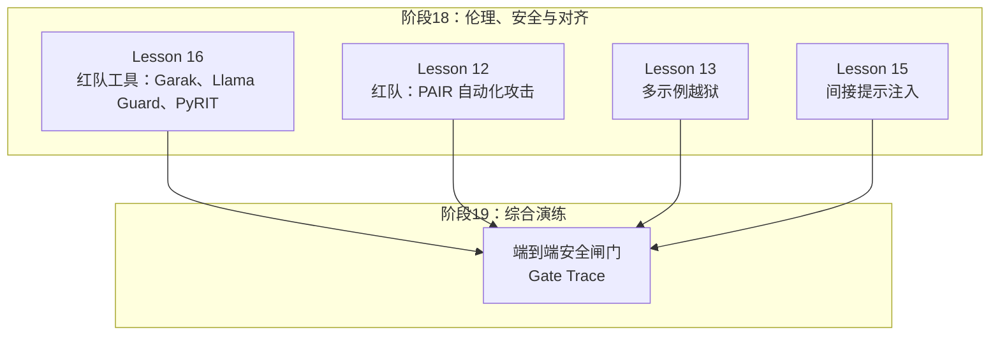
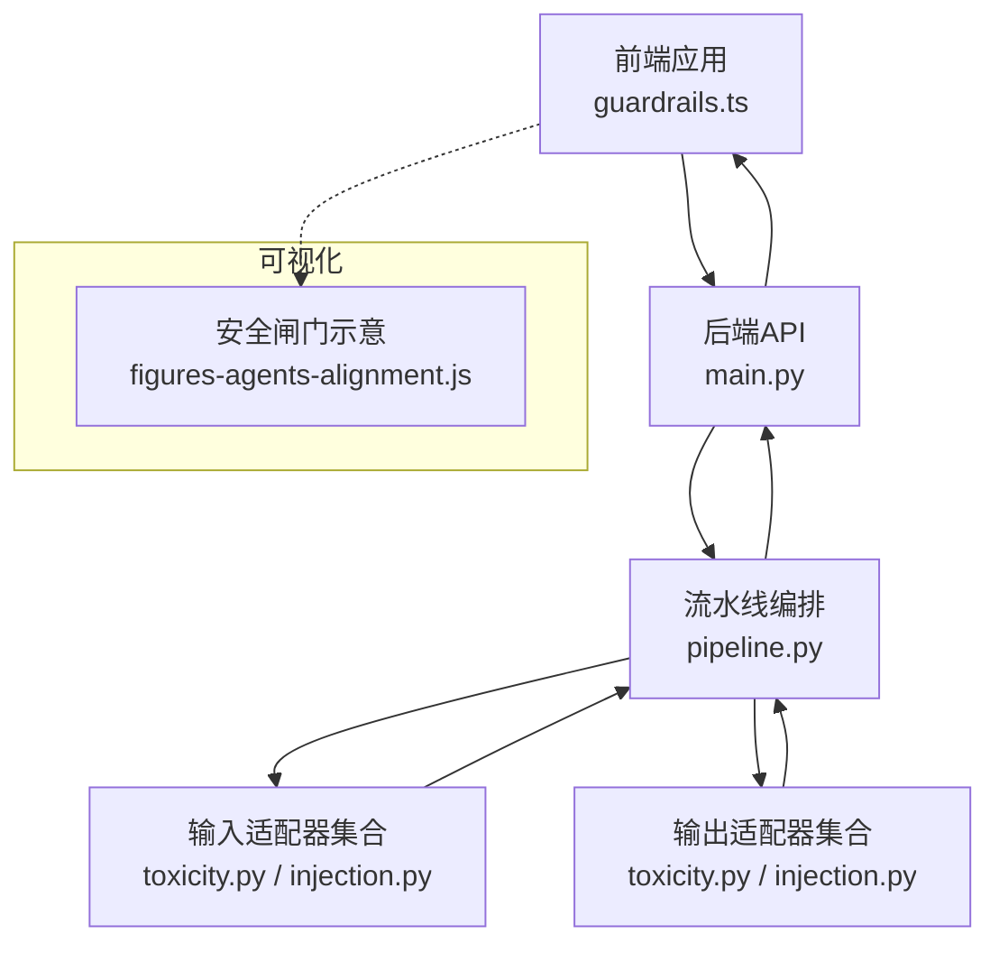
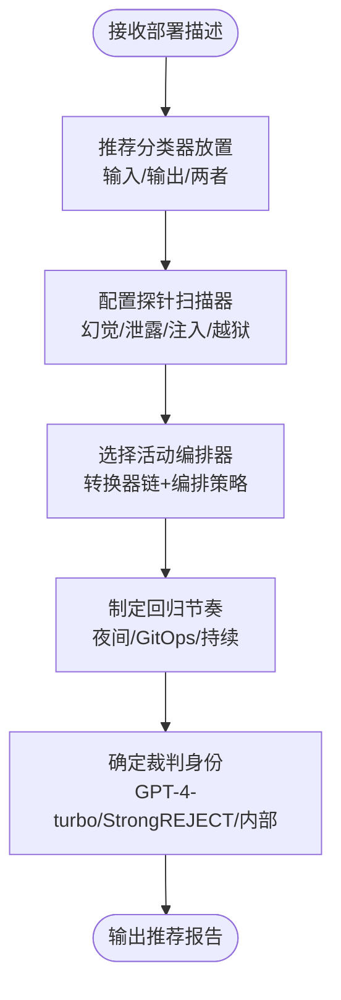
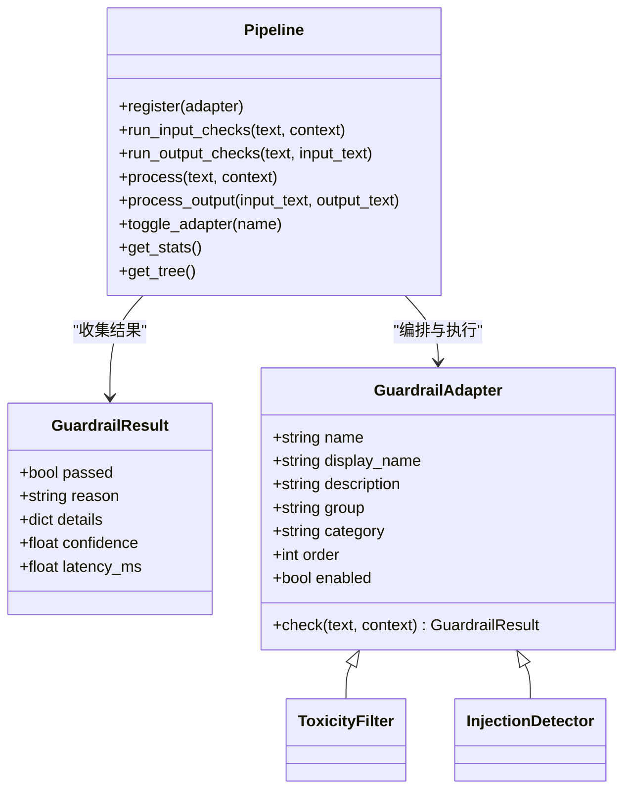
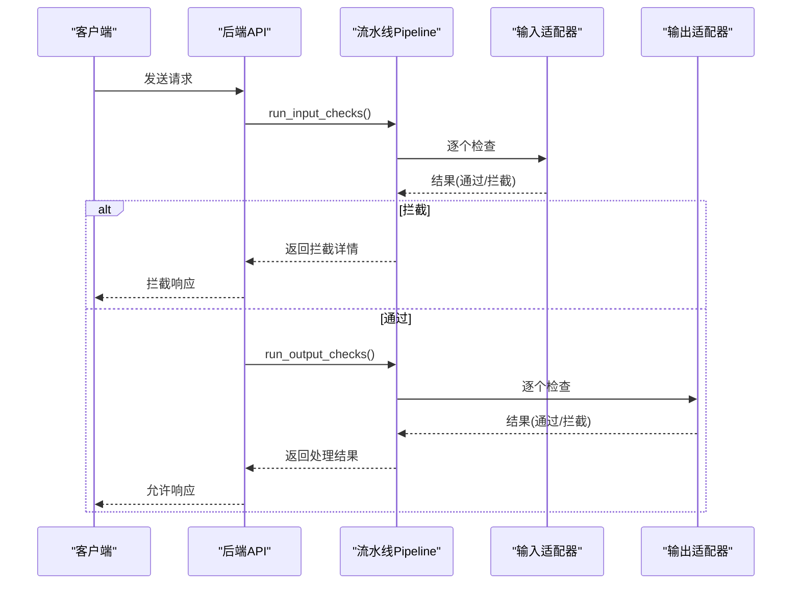
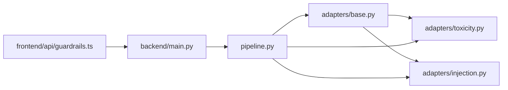
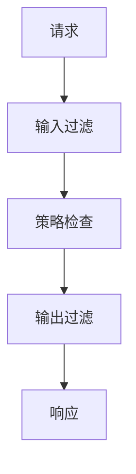

# 红队工具生态系统

<cite>
**本文档引用的文件**
- [README.md](file://README.md)
- [ROADMAP.md](file://ROADMAP.md)
- [site/data.js](file://site/data.js)
- [site/figures-agents-alignment.js](file://site/figures-agents-alignment.js)
- [site/summary/assets/index-CrTox38F.js](file://site/summary/assets/index-CrTox38F.js)
- [phases/18-ethics-safety-alignment/16-red-team-tooling-garak-llamaguard-pyrit/outputs/skill-red-team-stack.md](file://phases/18-ethics-safety-alignment/16-red-team-tooling-garak-llamaguard-pyrit/outputs/skill-red-team-stack.md)
- [phases/18-ethics-safety-alignment/16-red-team-tooling-garak-llamaguard-pyrit/outputs/skill-red-team-stack.zh.md](file://phases/18-ethics-safety-alignment/16-red-team-tooling-garak-llamaguard-pyrit/outputs/skill-red-team-stack.zh.md)
- [guardrails-sandbox/backend/pipeline.py](file://guardrails-sandbox/backend/pipeline.py)
- [guardrails-sandbox/backend/adapters/base.py](file://guardrails-sandbox/backend/adapters/base.py)
- [guardrails-sandbox/backend/adapters/toxicity.py](file://guardrails-sandbox/backend/adapters/toxicity.py)
- [guardrails-sandbox/backend/adapters/injection.py](file://guardrails-sandbox/backend/adapters/injection.py)
- [guardrails-sandbox/backend/main.py](file://guardrails-sandbox/backend/main.py)
- [guardrails-sandbox/frontend/src/api/guardrails.ts](file://guardrails-sandbox/frontend/src/api/guardrails.ts)
- [phases/19-capstone-projects/87-end-to-end-safety-gate/outputs/gate_trace.json](file://phases/19-capstone-projects/87-end-to-end-safety-gate/outputs/gate_trace.json)
</cite>

## 目录
1. [引言](#引言)
2. [项目结构](#项目结构)
3. [核心组件](#核心组件)
4. [架构总览](#架构总览)
5. [详细组件分析](#详细组件分析)
6. [依赖分析](#依赖分析)
7. [性能考虑](#性能考虑)
8. [故障排查指南](#故障排查指南)
9. [结论](#结论)
10. [附录](#附录)

## 引言
本指南面向希望构建企业级红队能力的工程与安全部门，系统梳理红队工具生态（Garak、Llama Guard、PyRIT）在本仓库中的定位与实践路径，并结合安全沙箱（Guardrails Sandbox）展示自动化安全测试平台的架构设计与实施策略。文档同时提供工具选择指南、配置建议、团队建设与流程管理要点，以及在不同应用场景下的最佳实践与注意事项。

## 项目结构
本仓库以“阶段化学习与实践”为主线，第18阶段聚焦伦理、安全与对齐；第19阶段提供端到端能力的综合演练。红队工具相关内容主要分布在：
- 阶段18：伦理、安全与对齐
  - Lesson 16：红队工具：Garak、Llama Guard、PyRIT
  - Lesson 12：红队：PAIR 自动化攻击
  - Lesson 13：多示例越狱
  - Lesson 15：间接提示注入
- 阶段19：综合演练
  - End-to-End Safety Gate：端到端安全闸门与评估流程

**章节来源**
- [README.md:801-832](file://README.md#L801-L832)
- [ROADMAP.md:487-520](file://ROADMAP.md#L487-L520)

## 核心组件
围绕红队工具生态，本项目提供了以下关键构件：
- 红队工具栈推荐与配置：基于部署场景给出分类器放置、探针扫描器、活动编排器、回归节奏与裁判校准的建议。
- 安全沙箱（Guardrails Sandbox）：包含适配器基类、流水线编排、前端API与示例适配器（毒性过滤、注入检测），支撑输入/输出双层安全闸门。
- 可视化与演示：站点脚本中包含安全闸门示意图，Capstone项目提供Gate Trace评估轨迹。

**章节来源**
- [phases/18-ethics-safety-alignment/16-red-team-tooling-garak-llamaguard-pyrit/outputs/skill-red-team-stack.md:10-29](file://phases/18-ethics-safety-alignment/16-red-team-tooling-garak-llamaguard-pyrit/outputs/skill-red-team-stack.md#L10-L29)
- [guardrails-sandbox/backend/pipeline.py:12-127](file://guardrails-sandbox/backend/pipeline.py#L12-L127)
- [guardrails-sandbox/backend/adapters/base.py:14-34](file://guardrails-sandbox/backend/adapters/base.py#L14-L34)
- [site/figures-agents-alignment.js:366-391](file://site/figures-agents-alignment.js#L366-L391)
- [phases/19-capstone-projects/87-end-to-end-safety-gate/outputs/gate_trace.json:972-1218](file://phases/19-capstone-projects/87-end-to-end-safety-gate/outputs/gate_trace.json#L972-L1218)

## 架构总览
下图展示了红队工具生态与安全沙箱的整体交互：前端通过API调用后端，后端经由流水线执行多个适配器（输入/输出），在任一层触发即短路拦截；同时，站点可视化呈现安全闸门的层级关系。

**图表来源**
- [guardrails-sandbox/frontend/src/api/guardrails.ts:14-47](file://guardrails-sandbox/frontend/src/api/guardrails.ts#L14-L47)
- [guardrails-sandbox/backend/main.py:155-177](file://guardrails-sandbox/backend/main.py#L155-L177)
- [guardrails-sandbox/backend/pipeline.py:31-84](file://guardrails-sandbox/backend/pipeline.py#L31-L84)
- [guardrails-sandbox/backend/adapters/toxicity.py:22-63](file://guardrails-sandbox/backend/adapters/toxicity.py#L22-L63)
- [guardrails-sandbox/backend/adapters/injection.py:44-75](file://guardrails-sandbox/backend/adapters/injection.py#L44-L75)
- [site/figures-agents-alignment.js:366-391](file://site/figures-agents-alignment.js#L366-L391)

**章节来源**
- [guardrails-sandbox/backend/main.py:155-177](file://guardrails-sandbox/backend/main.py#L155-L177)
- [guardrails-sandbox/backend/pipeline.py:86-127](file://guardrails-sandbox/backend/pipeline.py#L86-L127)

## 详细组件分析

### 组件A：红队工具栈推荐（Garak、Llama Guard、PyRIT）
该组件提供面向部署场景的工具栈建议，强调三层协同与回归节奏：
- 分类器放置：输入/输出/两者皆有，依据边缘部署、多模态等场景选择不同模型规模。
- 探针扫描器：针对幻觉、数据泄露、提示注入、越狱等威胁类型配置Garak探针，并建议护盾组合。
- 活动编排器：对具备新能力的模型进行发布前红队，指定转换器链与编排策略。
- 回归节奏：Garak夜间回归、PyRIT随发布深度红队、Llama Guard持续部署。
- 裁判校准：明确裁判LLM身份，ASR受其影响。

**章节来源**
- [phases/18-ethics-safety-alignment/16-red-team-tooling-garak-llamaguard-pyrit/outputs/skill-red-team-stack.md:10-29](file://phases/18-ethics-safety-alignment/16-red-team-tooling-garak-llamaguard-pyrit/outputs/skill-red-team-stack.md#L10-L29)
- [phases/18-ethics-safety-alignment/16-red-team-tooling-garak-llamaguard-pyrit/outputs/skill-red-team-stack.zh.md:10-29](file://phases/18-ethics-safety-alignment/16-red-team-tooling-garak-llamaguard-pyrit/outputs/skill-red-team-stack.zh.md#L10-L29)

### 组件B：安全沙箱（Guardrails Sandbox）
该组件提供可扩展的安全闸门流水线，支持输入/输出两阶段检查与适配器插件化：
- 流水线编排：注册适配器、按组/类/顺序排序、短路拦截、统计与拦截历史。
- 适配器基类：统一结果结构与生命周期开关，子类仅需实现check()。
- 示例适配器：毒性过滤（暴力、违法、自残、仇恨、色情）与注入检测（多种模式与编码绕过）。
- 前端API：封装请求超时、错误处理与开关控制。

**图表来源**
- [guardrails-sandbox/backend/adapters/base.py:5-34](file://guardrails-sandbox/backend/adapters/base.py#L5-L34)
- [guardrails-sandbox/backend/adapters/toxicity.py:22-63](file://guardrails-sandbox/backend/adapters/toxicity.py#L22-L63)
- [guardrails-sandbox/backend/adapters/injection.py:44-75](file://guardrails-sandbox/backend/adapters/injection.py#L44-L75)
- [guardrails-sandbox/backend/pipeline.py:12-285](file://guardrails-sandbox/backend/pipeline.py#L12-L285)

**章节来源**
- [guardrails-sandbox/backend/pipeline.py:12-127](file://guardrails-sandbox/backend/pipeline.py#L12-L127)
- [guardrails-sandbox/backend/adapters/base.py:14-34](file://guardrails-sandbox/backend/adapters/base.py#L14-L34)
- [guardrails-sandbox/backend/adapters/toxicity.py:1-63](file://guardrails-sandbox/backend/adapters/toxicity.py#L1-L63)
- [guardrails-sandbox/backend/adapters/injection.py:35-75](file://guardrails-sandbox/backend/adapters/injection.py#L35-L75)
- [guardrails-sandbox/frontend/src/api/guardrails.ts:14-47](file://guardrails-sandbox/frontend/src/api/guardrails.ts#L14-L47)

### 组件C：端到端安全闸门（Gate Trace）
该组件通过Gate Trace记录一次完整评估的预生成、生成中与后处理阶段的行为，体现安全闸门在真实攻击场景中的响应与处置。

**图表来源**
- [guardrails-sandbox/backend/main.py:155-177](file://guardrails-sandbox/backend/main.py#L155-L177)
- [guardrails-sandbox/backend/pipeline.py:31-84](file://guardrails-sandbox/backend/pipeline.py#L31-L84)
- [phases/19-capstone-projects/87-end-to-end-safety-gate/outputs/gate_trace.json:972-1218](file://phases/19-capstone-projects/87-end-to-end-safety-gate/outputs/gate_trace.json#L972-L1218)

**章节来源**
- [guardrails-sandbox/backend/main.py:155-177](file://guardrails-sandbox/backend/main.py#L155-L177)
- [phases/19-capstone-projects/87-end-to-end-safety-gate/outputs/gate_trace.json:972-1218](file://phases/19-capstone-projects/87-end-to-end-safety-gate/outputs/gate_trace.json#L972-L1218)

## 依赖分析
- 组件耦合与内聚
  - Pipeline对适配器采用松耦合设计，通过统一接口与排序机制实现高内聚、低耦合。
  - 适配器之间无直接依赖，仅通过Pipeline串联，便于独立扩展与替换。
- 外部依赖与集成点
  - Llama Guard分类器在站点脚本中有使用示例，体现其作为输入/输出分类器的主力地位。
  - 前端API封装了后端服务访问与超时控制，形成清晰的集成边界。
- 循环依赖
  - 未发现循环导入或循环依赖迹象。

**图表来源**
- [guardrails-sandbox/backend/adapters/base.py:14-34](file://guardrails-sandbox/backend/adapters/base.py#L14-L34)
- [guardrails-sandbox/backend/adapters/toxicity.py:22-63](file://guardrails-sandbox/backend/adapters/toxicity.py#L22-L63)
- [guardrails-sandbox/backend/adapters/injection.py:44-75](file://guardrails-sandbox/backend/adapters/injection.py#L44-L75)
- [guardrails-sandbox/backend/pipeline.py:12-285](file://guardrails-sandbox/backend/pipeline.py#L12-L285)
- [guardrails-sandbox/frontend/src/api/guardrails.ts:14-47](file://guardrails-sandbox/frontend/src/api/guardrails.ts#L14-L47)
- [guardrails-sandbox/backend/main.py:155-177](file://guardrails-sandbox/backend/main.py#L155-L177)

**章节来源**
- [guardrails-sandbox/backend/pipeline.py:12-285](file://guardrails-sandbox/backend/pipeline.py#L12-L285)
- [guardrails-sandbox/frontend/src/api/guardrails.ts:14-47](file://guardrails-sandbox/frontend/src/api/guardrails.ts#L14-L47)

## 性能考虑
- 流水线短路与延迟
  - 输入/输出检查按顺序执行并在首个失败处短路，有助于降低整体延迟。
  - 适配器应尽量保持轻量逻辑，避免复杂外部调用。
- 分类器推理
  - Llama Guard在站点脚本中展示为GPU推理，适合在输入/输出层部署以平衡吞吐与准确性。
- 超时与并发
  - 前端API默认超时时间较长，建议根据业务SLA调整并配合后端限流策略。

[本节为通用指导，无需具体文件分析]

## 故障排查指南
- 请求超时
  - 前端API封装了超时控制与错误抛出，若出现超时，检查后端服务状态与网络连通性。
- 适配器开关
  - 通过后端API切换适配器启用状态，便于快速定位问题来源。
- 拦截历史
  - 流水线维护拦截历史，可在界面或接口查看最近拦截记录，辅助复盘与优化阈值。

**章节来源**
- [guardrails-sandbox/frontend/src/api/guardrails.ts:14-47](file://guardrails-sandbox/frontend/src/api/guardrails.ts#L14-L47)
- [guardrails-sandbox/backend/main.py:141-153](file://guardrails-sandbox/backend/main.py#L141-L153)
- [guardrails-sandbox/backend/pipeline.py:264-285](file://guardrails-sandbox/backend/pipeline.py#L264-L285)

## 结论
本项目以阶段化课程与端到端演练的方式，构建了从工具选型到流水线落地的完整闭环。红队工具栈（Garak、Llama Guard、PyRIT）与安全沙箱（Guardrails Sandbox）相辅相成：前者提供评估与编排能力，后者提供可扩展的输入/输出闸门。通过标准化的适配器接口与流水线编排，企业可快速搭建可演进的红队能力，并在不同场景下迭代优化。

[本节为总结性内容，无需具体文件分析]

## 附录

### 红队工具选择指南与配置建议
- 分类器放置
  - 边缘部署优先：3-1B-INT4；多模态场景优先：Llama Guard 4；通用场景：3-8B。
- 探针扫描器
  - 幻觉（RAG系统）、数据泄露（PII相关）、提示注入（始终）、越狱（始终）。
  - 建议使用Prompt-Guard-86M + Llama-Guard-3-8B护盾组合进行端到端评估。
- 活动编排器
  - 对具备新能力的模型进行发布前红队；转换器链包括释义、编码、翻译、角色扮演；编排策略可选Crescendo（逐步升级）或TAP（分支）。
- 回归节奏
  - Garak夜间回归；PyRIT随发布深度红队；Llama Guard持续部署。
- 裁判校准
  - 明确裁判LLM身份（GPT-4-turbo、StrongREJECT、内部），ASR受其影响。

**章节来源**
- [phases/18-ethics-safety-alignment/16-red-team-tooling-garak-llamaguard-pyrit/outputs/skill-red-team-stack.md:10-29](file://phases/18-ethics-safety-alignment/16-red-team-tooling-garak-llamaguard-pyrit/outputs/skill-red-team-stack.md#L10-L29)
- [site/summary/assets/index-CrTox38F.js:1516-1540](file://site/summary/assets/index-CrTox38F.js#L1516-L1540)

### 安全闸门示意（概念图）

[本图为概念示意，不对应具体源码文件]