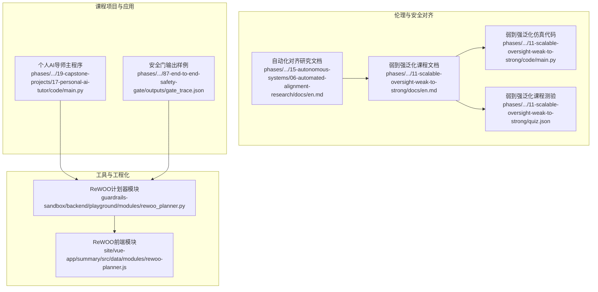
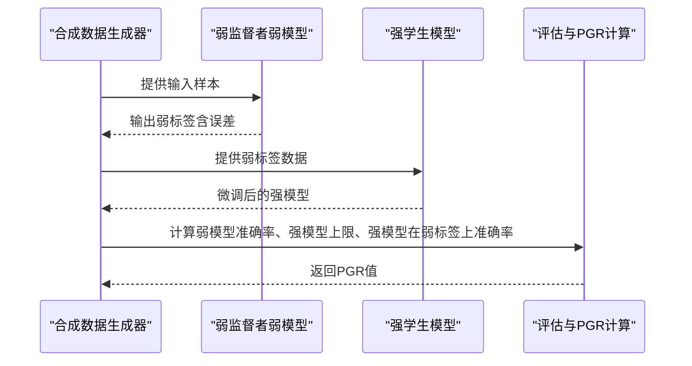
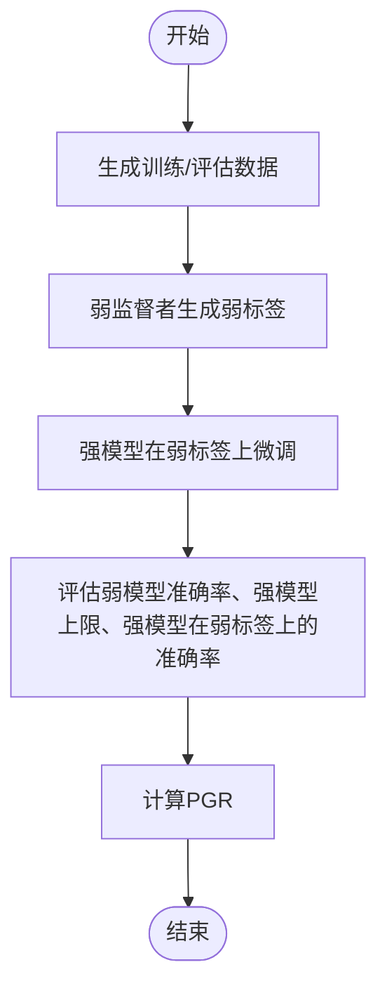
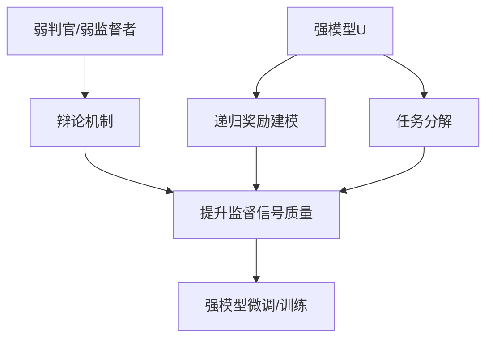
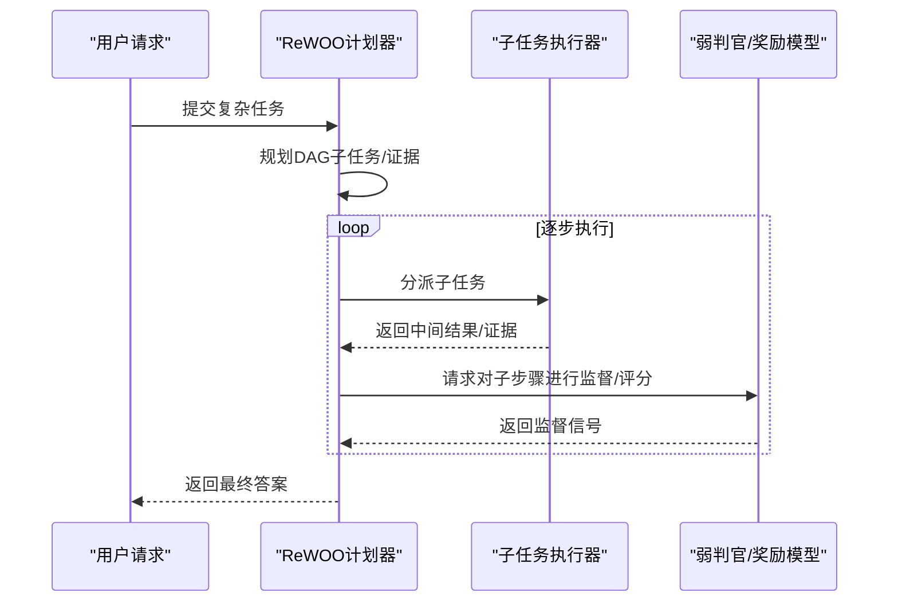
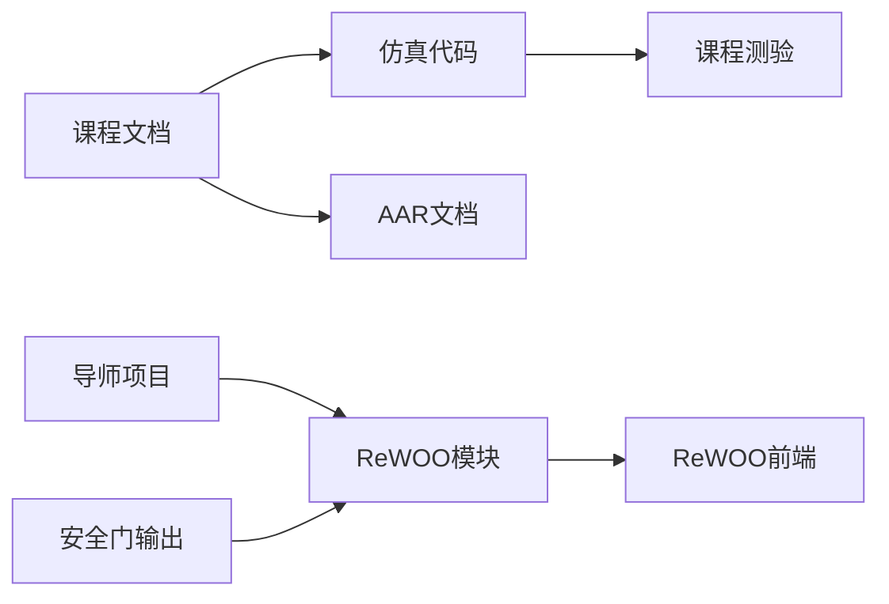

# 可扩展监督与弱到强泛化

<cite>
**本文引用的文件**
- [弱到强泛化课程文档（英文）](file://phases/18-ethics-safety-alignment/11-scalable-oversight-weak-to-strong/docs/en.md)
- [弱到强泛化课程测验（JSON）](file://phases/18-ethics-safety-alignment/11-scalable-oversight-weak-to-strong/quiz.json)
- [弱到强泛化仿真代码（Python）](file://phases/18-ethics-safety-alignment/11-scalable-oversight-weak-to-strong/code/main.py)
- [自动化对齐研究课程文档（英文）](file://phases/15-autonomous-systems/06-automated-alignment-research/docs/en.md)
- [ReWOO 计划器模块（Python）](file://guardrails-sandbox/backend/playground/modules/rewoo_planner.py)
- [ReWOO 计划器前端模块（JS）](file://site/vue-app/summary/src/data/modules/rewoo-planner.js)
- [个人AI导师项目主程序（Python）](file://phases/19-capstone-projects/17-personal-ai-tutor/code/main.py)
- [端到端安全门输出样例（JSON）](file://phases/19-capstone-projects/87-end-to-end-safety-gate/outputs/gate_trace.json)
</cite>

## 目录
1. [引言](#引言)
2. [项目结构](#项目结构)
3. [核心组件](#核心组件)
4. [架构总览](#架构总览)
5. [详细组件分析](#详细组件分析)
6. [依赖分析](#依赖分析)
7. [性能考虑](#性能考虑)
8. [故障排查指南](#故障排查指南)
9. [结论](#结论)
10. [附录](#附录)

## 引言
本文件围绕“可扩展监督与弱到强泛化”主题，系统梳理并实证分析以下关键内容：
- Superalignment议程的核心问题与挑战：如何在人类监督能力有限的情况下，通过可扩展监督机制与弱到强泛化策略，使更强模型仍保持对齐与稳健性能。
- Burns等人（2023）的弱到强泛化方法论：以GPT-2作为弱监督者、GPT-4作为强学生模型的实验范式；给出性能差距恢复（PGR）的定义与计算方法，并展示其在合成二分类任务上的仿真实现。
- 可扩展监督机制：辩论、递归奖励建模与任务分解的技术要点与适用场景；结合ReWOO计划器等工具，说明如何在实践中组织与优化监督流程。
- 实际代码实现与实验结果分析：提供可运行的仿真脚本路径、可视化图表与实验报告模板，帮助读者快速复现实验并进行扩展。

## 项目结构
本仓库中与“可扩展监督与弱到强泛化”直接相关的内容主要分布在以下位置：
- 教学与实践课程：phases/18-ethics-safety-alignment/11-scalable-oversight-weak-to-strong（含文档、代码与测验）
- 自动化对齐研究背景：phases/15-autonomous-systems/06-automated-alignment-research（提供AAR与Burns 2023工作的上下文）
- 工具与工程化示例：guardrails-sandbox/backend/playground/modules/rewoo_planner.py（ReWOO计划器）、site/vue-app/summary/src/data/modules/rewoo-planner.js（前端模块）
- 课程项目与应用案例：phases/19-capstone-projects/17-personal-ai-tutor（自适应教学仿真）、phases/19-capstone-projects/87-end-to-end-safety-gate（安全门输出样例）

**图示来源**
- [弱到强泛化课程文档（英文）](file://phases/18-ethics-safety-alignment/11-scalable-oversight-weak-to-strong/docs/en.md)
- [弱到强泛化课程测验（JSON）](file://phases/18-ethics-safety-alignment/11-scalable-oversight-weak-to-strong/quiz.json)
- [弱到强泛化仿真代码（Python）](file://phases/18-ethics-safety-alignment/11-scalable-oversight-weak-to-strong/code/main.py)
- [ReWOO 计划器模块（Python）](file://guardrails-sandbox/backend/playground/modules/rewoo_planner.py)
- [ReWOO 计划器前端模块（JS）](file://site/vue-app/summary/src/data/modules/rewoo-planner.js)
- [个人AI导师项目主程序（Python）](file://phases/19-capstone-projects/17-personal-ai-tutor/code/main.py)
- [端到端安全门输出样例（JSON）](file://phases/19-capstone-projects/87-end-to-end-safety-gate/outputs/gate_trace.json)

**章节来源**
- [弱到强泛化课程文档（英文）](file://phases/18-ethics-safety-alignment/11-scalable-oversight-weak-to-strong/docs/en.md)
- [弱到强泛化课程测验（JSON）](file://phases/18-ethics-safety-alignment/11-scalable-oversight-weak-to-strong/quiz.json)
- [弱到强泛化仿真代码（Python）](file://phases/18-ethics-safety-alignment/11-scalable-oversight-weak-to-strong/code/main.py)
- [自动化对齐研究课程文档（英文）](file://phases/15-autonomous-systems/06-automated-alignment-research/docs/en.md)
- [ReWOO 计划器模块（Python）](file://guardrails-sandbox/backend/playground/modules/rewoo_planner.py)
- [ReWOO 计划器前端模块（JS）](file://site/vue-app/summary/src/data/modules/rewoo-planner.js)
- [个人AI导师项目主程序（Python）](file://phases/19-capstone-projects/17-personal-ai-tutor/code/main.py)
- [端到端安全门输出样例（JSON）](file://phases/19-capstone-projects/87-end-to-end-safety-gate/outputs/gate_trace.json)

## 核心组件
- 弱到强泛化（W2SG）仿真器：基于合成数据的二分类任务，模拟弱监督者（低准确率）与强学生模型（高上限）之间的知识迁移过程，计算PGR指标并输出对比结果。
- 可扩展监督机制：辩论、递归奖励建模与任务分解三类方法，分别提升监督信号质量、扩大监督范围与降低监督复杂度。
- ReWOO计划器：将复杂任务分解为可执行的子步骤，减少生成过程中的token消耗，便于与可扩展监督结合使用。
- 自动化对齐研究（AAR）：以Burns 2023弱到强泛化为核心抓手，探索自动化研究流程以加速对齐工作迭代。

**章节来源**
- [弱到强泛化课程文档（英文）](file://phases/18-ethics-safety-alignment/11-scalable-oversight-weak-to-strong/docs/en.md)
- [弱到强泛化仿真代码（Python）](file://phases/18-ethics-safety-alignment/11-scalable-oversight-weak-to-strong/code/main.py)
- [ReWOO 计划器模块（Python）](file://guardrails-sandbox/backend/playground/modules/rewoo_planner.py)
- [自动化对齐研究课程文档（英文）](file://phases/15-autonomous-systems/06-automated-alignment-research/docs/en.md)

## 架构总览
下图展示了从“弱监督标签生成”到“强模型微调与评估”的整体流程，以及可扩展监督机制在其中的作用点。

**图示来源**
- [弱到强泛化仿真代码（Python）](file://phases/18-ethics-safety-alignment/11-scalable-oversight-weak-to-strong/code/main.py)

## 详细组件分析

### 组件A：弱到强泛化仿真器
- 功能概述
  - 生成合成二分类数据，定义弱监督者的错误模式（仅利用部分特征），设定强模型的上限准确率。
  - 在弱标签上微调强模型，计算弱模型单独表现、强模型在黄金标签上的上限、强模型在弱标签上的表现，并据此计算PGR。
- 关键流程
  - 数据生成：随机采样特征并按线性规则生成标签。
  - 弱标签生成：基于单一特征阈值加噪声，控制弱监督者准确率。
  - 强模型训练：使用SGD拟合线性分类器。
  - 性能评估：计算准确率并归一化得到PGR。
- PGR定义与意义
  - 定义：PGR = (强模型在弱标签上的准确率 - 弱模型准确率) / (强模型上限 - 弱模型准确率)。
  - 意义：衡量弱监督能否有效“回收”强模型的性能差距，体现强模型对预训练先验的利用能力。

**图示来源**
- [弱到强泛化仿真代码（Python）](file://phases/18-ethics-safety-alignment/11-scalable-oversight-weak-to-strong/code/main.py)

**章节来源**
- [弱到强泛化课程文档（英文）](file://phases/18-ethics-safety-alignment/11-scalable-oversight-weak-to-strong/docs/en.md)
- [弱到强泛化仿真代码（Python）](file://phases/18-ethics-safety-alignment/11-scalable-oversight-weak-to-strong/code/main.py)

### 组件B：可扩展监督机制
- 辩论（Debate）
  - 两份强模型输出相互辩论，由弱判官选择更可信的一方。
  - 优点：通过对抗生成更高质量的证据与推理线索，提升监督信号质量。
  - 局限：效果取决于任务结构与判官能力，且存在“说服力陷阱”风险。
- 递归奖励建模（RRM）
  - 强模型协助训练其自身的奖励模型，形成“越强越能被更好监督”的闭环。
  - 优点：监督能力随模型能力同步增长，缓解“强模型超出人类监督能力”的瓶颈。
  - 局限：需要稳定的奖励建模过程与对抗性数据，避免奖励漂移。
- 任务分解（Task Decomposition）
  - 将复杂任务拆分为人类可核查的子任务，逐级递归监督。
  - 优点：降低单次监督难度，提高可解释性与可审计性。
  - 局限：依赖任务的可分解性与接口设计，否则易出现耦合与传播误差。

**图示来源**
- [弱到强泛化课程文档（英文）](file://phases/18-ethics-safety-alignment/11-scalable-oversight-weak-to-strong/docs/en.md)

**章节来源**
- [弱到强泛化课程文档（英文）](file://phases/18-ethics-safety-alignment/11-scalable-oversight-weak-to-strong/docs/en.md)

### 组件C：ReWOO计划器与可扩展监督的结合
- ReWOO核心思想
  - 先规划（Plan）：将任务分解为可执行步骤，记录证据与中间产物。
  - 后执行（Execute）：按计划调用工具/子模块完成求解。
  - 优势：显著降低每次交互的token消耗，便于与可扩展监督结合。
- 与可扩展监督的协同
  - 使用任务分解思想，将复杂任务拆分为弱判官可核查的子步骤。
  - 结合辩论/RRM，为每个子步骤提供更可靠的监督信号与反馈。

**图示来源**
- [ReWOO 计划器模块（Python）](file://guardrails-sandbox/backend/playground/modules/rewoo_planner.py)
- [ReWOO 计划器前端模块（JS）](file://site/vue-app/summary/src/data/modules/rewoo-planner.js)

**章节来源**
- [ReWOO 计划器模块（Python）](file://guardrails-sandbox/backend/playground/modules/rewoo_planner.py)
- [ReWOO 计划器前端模块（JS）](file://site/vue-app/summary/src/data/modules/rewoo-planner.js)

### 组件D：自动化对齐研究（AAR）与Burns 2023
- AAR目标
  - 利用前沿大模型自动化执行对齐研究，缩短实验周期，提高迭代效率。
- 与W2SG的关系
  - 将Burns 2023的弱到强泛化作为AAR重点子任务之一，探索自动化监督与泛化评估流程。
- 组织与进展
  - OpenAI Superalignment团队解散后，该议程在Anthropic、学术机构继续推进。

**章节来源**
- [自动化对齐研究课程文档（英文）](file://phases/15-autonomous-systems/06-automated-alignment-research/docs/en.md)
- [弱到强泛化课程文档（英文）](file://phases/18-ethics-safety-alignment/11-scalable-oversight-weak-to-strong/docs/en.md)

## 依赖分析
- 文档与代码的依赖
  - 课程文档为仿真代码提供理论基础与实验目标；代码实现验证文档中的假设与指标。
- 工具与课程项目的依赖
  - ReWOO计划器模块与前端模块共同构成任务分解与可视化展示的基础。
  - 个人AI导师项目体现了自适应教学与概念选择策略，可借鉴到可扩展监督的策略设计中。
- 应用与安全的依赖
  - 安全门输出样例展示了在生成过程中对潜在风险的识别与处置流程，为可扩展监督提供实践参考。

**图示来源**
- [弱到强泛化课程文档（英文）](file://phases/18-ethics-safety-alignment/11-scalable-oversight-weak-to-strong/docs/en.md)
- [弱到强泛化课程测验（JSON）](file://phases/18-ethics-safety-alignment/11-scalable-oversight-weak-to-strong/quiz.json)
- [弱到强泛化仿真代码（Python）](file://phases/18-ethics-safety-alignment/11-scalable-oversight-weak-to-strong/code/main.py)
- [ReWOO 计划器模块（Python）](file://guardrails-sandbox/backend/playground/modules/rewoo_planner.py)
- [ReWOO 计划器前端模块（JS）](file://site/vue-app/summary/src/data/modules/rewoo-planner.js)
- [个人AI导师项目主程序（Python）](file://phases/19-capstone-projects/17-personal-ai-tutor/code/main.py)
- [端到端安全门输出样例（JSON）](file://phases/19-capstone-projects/87-end-to-end-safety-gate/outputs/gate_trace.json)

**章节来源**
- [弱到强泛化课程文档（英文）](file://phases/18-ethics-safety-alignment/11-scalable-oversight-weak-to-strong/docs/en.md)
- [弱到强泛化课程测验（JSON）](file://phases/18-ethics-safety-alignment/11-scalable-oversight-weak-to-strong/quiz.json)
- [弱到强泛化仿真代码（Python）](file://phases/18-ethics-safety-alignment/11-scalable-oversight-weak-to-strong/code/main.py)
- [ReWOO 计划器模块（Python）](file://guardrails-sandbox/backend/playground/modules/rewoo_planner.py)
- [ReWOO 计划器前端模块（JS）](file://site/vue-app/summary/src/data/modules/rewoo-planner.js)
- [个人AI导师项目主程序（Python）](file://phases/19-capstone-projects/17-personal-ai-tutor/code/main.py)
- [端到端安全门输出样例（JSON）](file://phases/19-capstone-projects/87-end-to-end-safety-gate/outputs/gate_trace.json)

## 性能考虑
- PGR作为评估指标的稳定性
  - 建议在不同弱监督准确率与误差分布下多次运行，观察PGR曲线的形状与波动。
  - 当弱监督者存在结构性偏差时，需关注强模型是否能“补偿”这些偏差，从而提升PGR。
- 训练与评估的数值稳定性
  - 在计算PGR时加入极小常数以避免除零；在模型训练中注意梯度更新与学习率的选择。
- Token消耗与工程化
  - ReWOO通过任务分解显著降低token消耗，适合与可扩展监督结合，提升整体效率。

[本节为通用指导，无需特定文件来源]

## 故障排查指南
- PGR异常偏低或为负
  - 检查弱监督者准确率与误差分布是否合理；确认强模型上限与弱模型准确率的计算是否一致。
  - 排查数据生成与标签噪声是否符合预期。
- ReWOO计划器token节省效果不明显
  - 检查任务分解粒度是否适中；确认证据收集与中间产物是否充分。
  - 对比ReAct与ReWOO的token用量，核对模块内部统计逻辑。
- 安全门误判或漏判
  - 查看gate_trace.json中的pre_gen/during_gen/post_gen阶段的触发规则与置信度阈值。
  - 根据类别与模式匹配结果调整规则与严重等级。

**章节来源**
- [弱到强泛化仿真代码（Python）](file://phases/18-ethics-safety-alignment/11-scalable-oversight-weak-to-strong/code/main.py)
- [ReWOO 计划器模块（Python）](file://guardrails-sandbox/backend/playground/modules/rewoo_planner.py)
- [ReWOO 计划器前端模块（JS）](file://site/vue-app/summary/src/data/modules/rewoo-planner.js)
- [端到端安全门输出样例（JSON）](file://phases/19-capstone-projects/87-end-to-end-safety-gate/outputs/gate_trace.json)

## 结论
- 可扩展监督与弱到强泛化相辅相成：前者提升监督信号质量，后者确保强模型能从不完美监督中恢复性能。
- Burns 2023的实验证明了强模型在弱监督下的泛化潜力，PGR成为衡量这一潜力的实用指标。
- ReWOO等任务分解工具为规模化监督提供了工程化支撑，配合辩论与递归奖励建模，可在更大范围内实现高效、可解释的监督。
- 自动化对齐研究（AAR）将上述方法论系统化，推动对齐研究的自动化与加速迭代。

[本节为总结性内容，无需特定文件来源]

## 附录
- 实验与练习建议
  - 运行弱到强泛化仿真，比较不同弱监督准确率下的PGR曲线，解释其形状。
  - 修改弱监督者的误差结构（如对特定类别恒错），观察PGR变化并解释原因。
  - 设计一个结合辩论与任务分解的软件工程监督协议，识别各组件的潜在失败模式。
- 参考资料
  - Burns et al. — Weak-to-Strong Generalization（OpenAI 2023）
  - Irving, Christiano, Amodei — AI safety via debate（arXiv:1805.00899）
  - Leike et al. — Scalable agent alignment via reward modeling（arXiv:1811.07871）
  - Khan et al. — Debating with More Persuasive LLMs Leads to More Truthful Answers（arXiv:2402.06782）
  - Lang et al. — Debate Helps Weak-to-Strong Generalization（arXiv:2501.13124）

**章节来源**
- [弱到强泛化课程文档（英文）](file://phases/18-ethics-safety-alignment/11-scalable-oversight-weak-to-strong/docs/en.md)
- [弱到强泛化课程测验（JSON）](file://phases/18-ethics-safety-alignment/11-scalable-oversight-weak-to-strong/quiz.json)
- [弱到强泛化仿真代码（Python）](file://phases/18-ethics-safety-alignment/11-scalable-oversight-weak-to-strong/code/main.py)
- [ReWOO 计划器模块（Python）](file://guardrails-sandbox/backend/playground/modules/rewoo_planner.py)
- [ReWOO 计划器前端模块（JS）](file://site/vue-app/summary/src/data/modules/rewoo-planner.js)
- [个人AI导师项目主程序（Python）](file://phases/19-capstone-projects/17-personal-ai-tutor/code/main.py)
- [端到端安全门输出样例（JSON）](file://phases/19-capstone-projects/87-end-to-end-safety-gate/outputs/gate_trace.json)