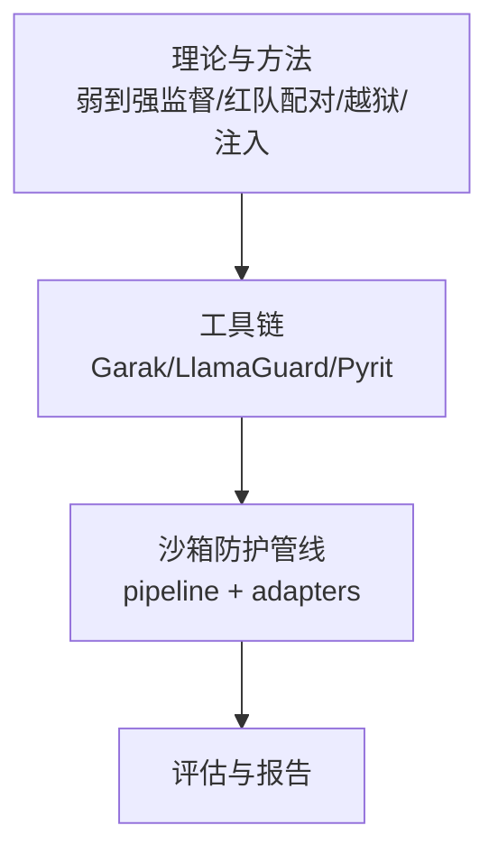
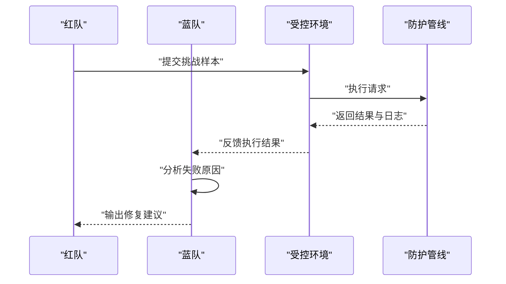
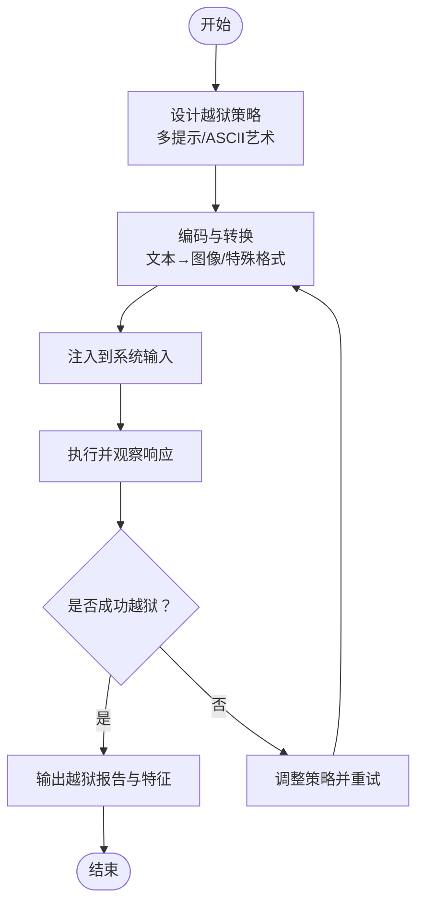
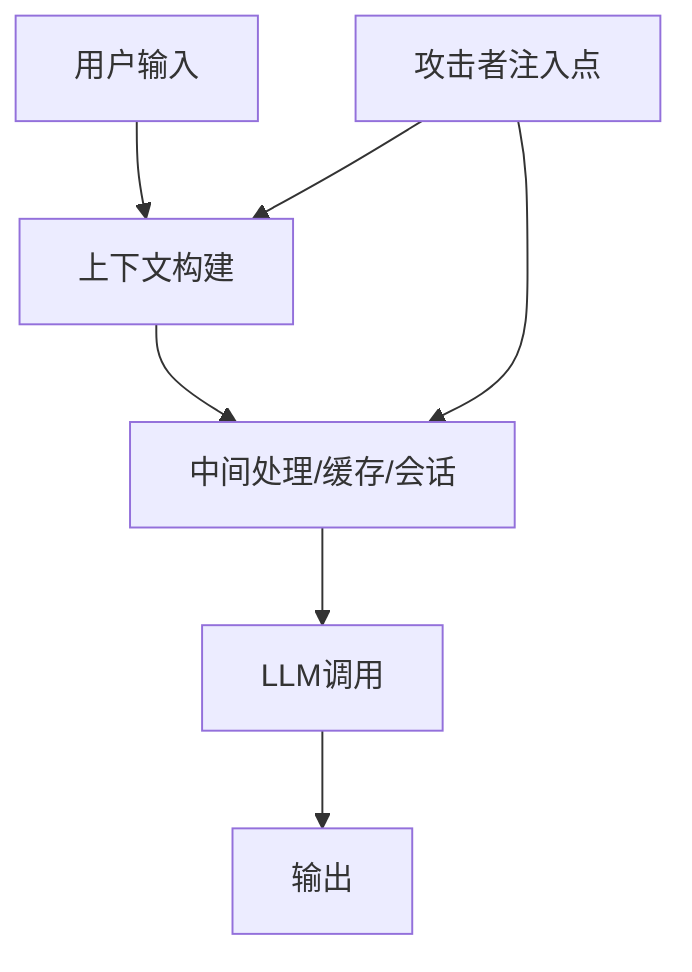
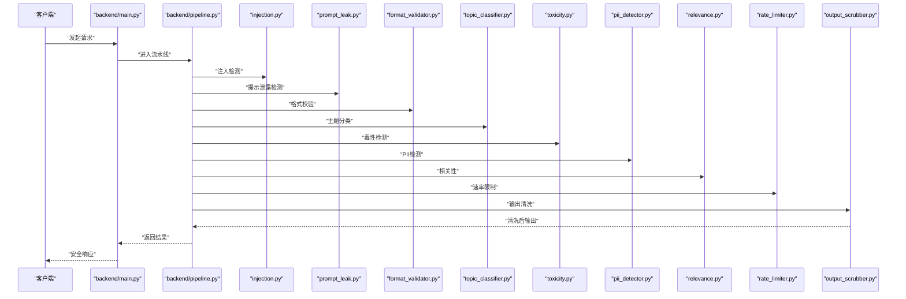
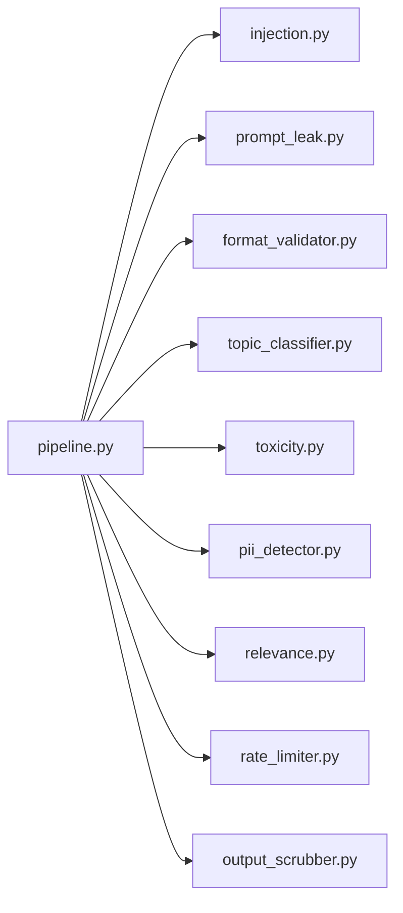

# 安全测试与红队技术

<cite>
**本文引用的文件**
- [phases/18-ethics-safety-alignment/11-scalable-oversight-weak-to-strong/README.md](file://phases/18-ethics-safety-alignment/11-scalable-oversight-weak-to-strong/README.md)
- [phases/18-ethics-safety-alignment/12-red-teaming-pair-automated-attacks/README.md](file://phases/18-ethics-safety-alignment/12-red-teaming-pair-automated-attacks/README.md)
- [phases/18-ethics-safety-alignment/13-many-shot-jailbreaking/README.md](file://phases/18-ethics-safety-alignment/13-many-shot-jailbreaking/README.md)
- [phases/18-ethics-safety-alignment/14-ascii-art-visual-jailbreaks/README.md](file://phases/18-ethics-safety-alignment/14-ascii-art-visual-jailbreaks/README.md)
- [phases/18-ethics-safety-alignment/15-indirect-prompt-injection/README.md](file://phases/18-ethics-safety-alignment/15-indirect-prompt-injection/README.md)
- [phases/18-ethics-safety-alignment/16-red-team-tooling-garak-llamaguard-pyrit/README.md](file://phases/18-ethics-safety-alignment/16-red-team-tooling-garak-llamaguard-pyrit/README.md)
- [guardrails-sandbox/backend/adapters/injection.py](file://guardrails-sandbox/backend/adapters/injection.py)
- [guardrails-sandbox/backend/adapters/prompt_leak.py](file://guardrails-sandbox/backend/adapters/prompt_leak.py)
- [guardrails-sandbox/backend/adapters/format_validator.py](file://guardrails-sandbox/backend/adapters/format_validator.py)
- [guardrails-sandbox/backend/adapters/topic_classifier.py](file://guardrails-sandbox/backend/adapters/topic_classifier.py)
- [guardrails-sandbox/backend/adapters/toxicity.py](file://guardrails-sandbox/backend/adapters/toxicity.py)
- [guardrails-sandbox/backend/adapters/pii_detector.py](file://guardrails-sandbox/backend/adapters/pii_detector.py)
- [guardrails-sandbox/backend/adapters/relevance.py](file://guardrails-sandbox/backend/adapters/relevance.py)
- [guardrails-sandbox/backend/adapters/rate_limiter.py](file://guardrails-sandbox/backend/adapters/rate_limiter.py)
- [guardrails-sandbox/backend/adapters/output_scrubber.py](file://guardrails-sandbox/backend/adapters/output_scrubber.py)
- [guardrails-sandbox/backend/main.py](file://guardrails-sandbox/backend/main.py)
- [guardrails-sandbox/backend/pipeline.py](file://guardrails-sandbox/backend/pipeline.py)
- [guardrails-sandbox/backend/test_cases.py](file://guardrails-sandbox/backend/test_cases.py)
- [guardrails-sandbox/run.sh](file://guardrails-sandbox/run.sh)
- [phases/18-ethics-safety-alignment/README.md](file://phases/18-ethics-safety-alignment/README.md)
</cite>

## 目录
1. [引言](#引言)
2. [项目结构](#项目结构)
3. [核心组件](#核心组件)
4. [架构总览](#架构总览)
5. [详细组件分析](#详细组件分析)
6. [依赖关系分析](#依赖关系分析)
7. [性能考虑](#性能考虑)
8. [故障排查指南](#故障排查指南)
9. [结论](#结论)
10. [附录](#附录)

## 引言
本文件面向安全测试与红队技术，系统梳理并深化以下主题：可扩展监督的弱到强方法论、红队配对与自动化攻击技术、多提示越狱与ASCII艺术视觉越狱等高级攻击手法、间接提示注入等隐蔽攻击方式，并结合仓库中的红队工具链（Garak、LlamaGuard、Pyrit）与沙箱式防护管线（guardrails-sandbox），提供可操作的安全测试框架与实施指南。

## 项目结构
本仓库围绕“伦理、安全与对齐”构建了完整的教学体系，其中与安全测试和红队直接相关的核心模块包括：
- 教学章节：伦理、安全与对齐下的多个专题，涵盖弱到强监督、红队配对、越狱与注入、工具链使用等
- 防护沙箱：后端适配器集合与流水线，用于在可控环境中评估与拦截潜在风险输出

```mermaid
graph TB
subgraph "伦理·安全·对齐教学"
WTS["弱到强监督<br/>11-scalable-oversight-weak-to-strong"]
RTP["红队配对与自动化攻击<br/>12-red-teaming-pair-automated-attacks"]
MJ["多提示越狱<br/>13-many-shot-jailbreaking"]
AA["ASCII艺术视觉越狱<br/>14-ascii-art-visual-jailbreaks"]
IPI["间接提示注入<br/>15-indirect-prompt-injection"]
RTT["红队工具链<br/>16-red-team-tooling-garak-llamaguard-pyrit"]
end
subgraph "防护沙箱"
GMain["backend/main.py"]
GPipe["backend/pipeline.py"]
Adapters["adapters/*<br/>injection/prompt_leak/format_validator/topic_classifier/toxicity/pii_detector/relevance/rate_limiter/output_scrubber"]
end
WTS --> RTP
RTP --> MJ
MJ --> AA
AA --> IPI
IPI --> RTT
GMain --> GPipe
GPipe --> Adapters
```

图示来源
- [phases/18-ethics-safety-alignment/11-scalable-oversight-weak-to-strong/README.md](file://phases/18-ethics-safety-alignment/11-scalable-oversight-weak-to-strong/README.md)
- [phases/18-ethics-safety-alignment/12-red-teaming-pair-automated-attacks/README.md](file://phases/18-ethics-safety-alignment/12-red-teaming-pair-automated-attacks/README.md)
- [phases/18-ethics-safety-alignment/13-many-shot-jailbreaking/README.md](file://phases/18-ethics-safety-alignment/13-many-shot-jailbreaking/README.md)
- [phases/18-ethics-safety-alignment/14-ascii-art-visual-jailbreaks/README.md](file://phases/18-ethics-safety-alignment/14-ascii-art-visual-jailbreaks/README.md)
- [phases/18-ethics-safety-alignment/15-indirect-prompt-injection/README.md](file://phases/18-ethics-safety-alignment/15-indirect-prompt-injection/README.md)
- [phases/18-ethics-safety-alignment/16-red-team-tooling-garak-llamaguard-pyrit/README.md](file://phases/18-ethics-safety-alignment/16-red-team-tooling-garak-llamaguard-pyrit/README.md)
- [guardrails-sandbox/backend/main.py](file://guardrails-sandbox/backend/main.py)
- [guardrails-sandbox/backend/pipeline.py](file://guardrails-sandbox/backend/pipeline.py)

章节来源
- [phases/18-ethics-safety-alignment/README.md](file://phases/18-ethics-safety-alignment/README.md)

## 核心组件
- 可扩展监督的弱到强方法论：通过从较弱模型或规则出发，逐步提升到更强模型或更严格规则，实现成本可控且可验证的安全增强
- 红队配对与自动化攻击：以“红蓝对抗”的形式，自动构造挑战性输入，评估系统鲁棒性
- 多提示越狱与ASCII艺术视觉越狱：利用提示工程与视觉编码绕过内容策略
- 间接提示注入：通过上下文或中间流程注入不可见指令，规避显式触发检测
- 红队工具链：集成Garak、LlamaGuard、Pyrit等工具，形成端到端的评估与加固闭环
- 沙箱式防护管线：在隔离环境中执行与监控，包含注入检测、提示泄露识别、格式校验、毒性检测、PII检测、相关性与速率限制、输出清洗等适配器

章节来源
- [phases/18-ethics-safety-alignment/11-scalable-oversight-weak-to-strong/README.md](file://phases/18-ethics-safety-alignment/11-scalable-oversight-weak-to-strong/README.md)
- [phases/18-ethics-safety-alignment/12-red-teaming-pair-automated-attacks/README.md](file://phases/18-ethics-safety-alignment/12-red-teaming-pair-automated-attacks/README.md)
- [phases/18-ethics-safety-alignment/13-many-shot-jailbreaking/README.md](file://phases/18-ethics-safety-alignment/13-many-shot-jailbreaking/README.md)
- [phases/18-ethics-safety-alignment/14-ascii-art-visual-jailbreaks/README.md](file://phases/18-ethics-safety-alignment/14-ascii-art-visual-jailbreaks/README.md)
- [phases/18-ethics-safety-alignment/15-indirect-prompt-injection/README.md](file://phases/18-ethics-safety-alignment/15-indirect-prompt-injection/README.md)
- [phases/18-ethics-safety-alignment/16-red-team-tooling-garak-llamaguard-pyrit/README.md](file://phases/18-ethics-safety-alignment/16-red-team-tooling-garak-llamaguard-pyrit/README.md)

## 架构总览
下图展示了从教学到实践的端到端路径：先以理论与方法指导，再通过工具链与沙箱进行实证评估与加固。

图示来源
- [phases/18-ethics-safety-alignment/11-scalable-oversight-weak-to-strong/README.md](file://phases/18-ethics-safety-alignment/11-scalable-oversight-weak-to-strong/README.md)
- [phases/18-ethics-safety-alignment/12-red-teaming-pair-automated-attacks/README.md](file://phases/18-ethics-safety-alignment/12-red-teaming-pair-automated-attacks/README.md)
- [phases/18-ethics-safety-alignment/13-many-shot-jailbreaking/README.md](file://phases/18-ethics-safety-alignment/13-many-shot-jailbreaking/README.md)
- [phases/18-ethics-safety-alignment/14-ascii-art-visual-jailbreaks/README.md](file://phases/18-ethics-safety-alignment/14-ascii-art-visual-jailbreaks/README.md)
- [phases/18-ethics-safety-alignment/15-indirect-prompt-injection/README.md](file://phases/18-ethics-safety-alignment/15-indirect-prompt-injection/README.md)
- [phases/18-ethics-safety-alignment/16-red-team-tooling-garak-llamaguard-pyrit/README.md](file://phases/18-ethics-safety-alignment/16-red-team-tooling-garak-llamaguard-pyrit/README.md)
- [guardrails-sandbox/backend/pipeline.py](file://guardrails-sandbox/backend/pipeline.py)

## 详细组件分析

### 可扩展监督的弱到强方法论
- 基本思想：从简单规则或弱模型开始，逐步引入更强规则与更强模型，同时保持可验证性与可回滚性
- 实施要点：
  - 分层规则设计：按风险等级划分规则强度
  - 渐进式部署：小范围灰度，持续观测指标
  - 回退机制：一旦出现副作用，立即回退到上一层级
- 适用场景：内容安全策略、合规检查、风险控制

章节来源
- [phases/18-ethics-safety-alignment/11-scalable-oversight-weak-to-strong/README.md](file://phases/18-ethics-safety-alignment/11-scalable-oversight-weak-to-strong/README.md)

### 红队配对与自动化攻击
- 红蓝对抗：红队负责构造挑战样本，蓝队负责防御与修复
- 自动化攻击：基于模板与启发式生成多样化输入，覆盖边界条件与异常路径
- 关键流程：
  - 攻击生成：模板化提示、对抗扰动、多模态编码
  - 执行与记录：在受控环境执行，记录成功/失败与特征
  - 结果归因：定位失败原因，驱动规则/模型迭代

图示来源
- [phases/18-ethics-safety-alignment/12-red-teaming-pair-automated-attacks/README.md](file://phases/18-ethics-safety-alignment/12-red-teaming-pair-automated-attacks/README.md)
- [guardrails-sandbox/backend/pipeline.py](file://guardrails-sandbox/backend/pipeline.py)

章节来源
- [phases/18-ethics-safety-alignment/12-red-teaming-pair-automated-attacks/README.md](file://phases/18-ethics-safety-alignment/12-red-teaming-pair-automated-attacks/README.md)

### 多提示越狱与ASCII艺术视觉越狱
- 多提示越狱：通过组合多个提示，叠加语义与结构信息，突破单一提示的限制
- ASCII艺术视觉越狱：将文本编码为图像或特殊字符模式，绕过传统文本过滤器
- 技术要点：
  - 提示工程：利用角色扮演、思维链、反向提示等技巧
  - 视觉编码：将敏感内容映射到非敏感视觉表征
  - 多模态融合：文本+图像/表格等混合输入

图示来源
- [phases/18-ethics-safety-alignment/13-many-shot-jailbreaking/README.md](file://phases/18-ethics-safety-alignment/13-many-shot-jailbreaking/README.md)
- [phases/18-ethics-safety-alignment/14-ascii-art-visual-jailbreaks/README.md](file://phases/18-ethics-safety-alignment/14-ascii-art-visual-jailbreaks/README.md)

章节来源
- [phases/18-ethics-safety-alignment/13-many-shot-jailbreaking/README.md](file://phases/18-ethics-safety-alignment/13-many-shot-jailbreaking/README.md)
- [phases/18-ethics-safety-alignment/14-ascii-art-visual-jailbreaks/README.md](file://phases/18-ethics-safety-alignment/14-ascii-art-visual-jailbreaks/README.md)

### 间接提示注入
- 概念：通过上下文、中间变量、外部资源或代理接口，将不可见指令注入到系统中
- 典型路径：用户输入→中间处理→缓存/会话→最终LLM调用
- 防护策略：
  - 上下文审计：检查历史消息与状态
  - 变量与参数校验：防止被篡改
  - 接口白名单与权限控制

图示来源
- [phases/18-ethics-safety-alignment/15-indirect-prompt-injection/README.md](file://phases/18-ethics-safety-alignment/15-indirect-prompt-injection/README.md)

章节来源
- [phases/18-ethics-safety-alignment/15-indirect-prompt-injection/README.md](file://phases/18-ethics-safety-alignment/15-indirect-prompt-injection/README.md)

### 红队工具链：Garak、LlamaGuard、Pyrit
- Garak：通用的提示攻击工具，支持多种攻击模式与评估指标
- LlamaGuard：针对Llama系列模型的安全评估与检测
- Pyrit：支持多种攻击与防御实验，便于快速迭代
- 使用建议：
  - 明确目标与范围：限定模型、数据集与攻击类型
  - 分层执行：先弱后强，先易后难
  - 记录与复现：保留样本与配置，便于回归

章节来源
- [phases/18-ethics-safety-alignment/16-red-team-tooling-garak-llamaguard-pyrit/README.md](file://phases/18-ethics-safety-alignment/16-red-team-tooling-garak-llamaguard-pyrit/README.md)

### 沙箱式防护管线与适配器
- 后端入口与流水线：统一调度各适配器，串联执行
- 适配器职责：
  - 注入检测：识别潜在的注入式输入
  - 提示泄露：检测提示词或内部逻辑暴露
  - 格式校验：确保输入/输出符合预期格式
  - 主题分类：识别敏感话题
  - 毒性检测：识别有害内容
  - PII检测：识别个人身份信息
  - 相关性与速率限制：控制上下文长度与访问频率
  - 输出清洗：去除敏感或不合规内容
- 流程示意：

图示来源
- [guardrails-sandbox/backend/main.py](file://guardrails-sandbox/backend/main.py)
- [guardrails-sandbox/backend/pipeline.py](file://guardrails-sandbox/backend/pipeline.py)
- [guardrails-sandbox/backend/adapters/injection.py](file://guardrails-sandbox/backend/adapters/injection.py)
- [guardrails-sandbox/backend/adapters/prompt_leak.py](file://guardrails-sandbox/backend/adapters/prompt_leak.py)
- [guardrails-sandbox/backend/adapters/format_validator.py](file://guardrails-sandbox/backend/adapters/format_validator.py)
- [guardrails-sandbox/backend/adapters/topic_classifier.py](file://guardrails-sandbox/backend/adapters/topic_classifier.py)
- [guardrails-sandbox/backend/adapters/toxicity.py](file://guardrails-sandbox/backend/adapters/toxicity.py)
- [guardrails-sandbox/backend/adapters/pii_detector.py](file://guardrails-sandbox/backend/adapters/pii_detector.py)
- [guardrails-sandbox/backend/adapters/relevance.py](file://guardrails-sandbox/backend/adapters/relevance.py)
- [guardrails-sandbox/backend/adapters/rate_limiter.py](file://guardrails-sandbox/backend/adapters/rate_limiter.py)
- [guardrails-sandbox/backend/adapters/output_scrubber.py](file://guardrails-sandbox/backend/adapters/output_scrubber.py)

章节来源
- [guardrails-sandbox/backend/main.py](file://guardrails-sandbox/backend/main.py)
- [guardrails-sandbox/backend/pipeline.py](file://guardrails-sandbox/backend/pipeline.py)
- [guardrails-sandbox/backend/adapters/injection.py](file://guardrails-sandbox/backend/adapters/injection.py)
- [guardrails-sandbox/backend/adapters/prompt_leak.py](file://guardrails-sandbox/backend/adapters/prompt_leak.py)
- [guardrails-sandbox/backend/adapters/format_validator.py](file://guardrails-sandbox/backend/adapters/format_validator.py)
- [guardrails-sandbox/backend/adapters/topic_classifier.py](file://guardrails-sandbox/backend/adapters/topic_classifier.py)
- [guardrails-sandbox/backend/adapters/toxicity.py](file://guardrails-sandbox/backend/adapters/toxicity.py)
- [guardrails-sandbox/backend/adapters/pii_detector.py](file://guardrails-sandbox/backend/adapters/pii_detector.py)
- [guardrails-sandbox/backend/adapters/relevance.py](file://guardrails-sandbox/backend/adapters/relevance.py)
- [guardrails-sandbox/backend/adapters/rate_limiter.py](file://guardrails-sandbox/backend/adapters/rate_limiter.py)
- [guardrails-sandbox/backend/adapters/output_scrubber.py](file://guardrails-sandbox/backend/adapters/output_scrubber.py)

## 依赖关系分析
- 组件内聚与耦合：
  - 适配器之间低耦合，通过统一的流水线接口交互
  - 流水线作为编排中心，集中管理执行顺序与错误传播
- 外部依赖与集成点：
  - 工具链（Garak/LlamaGuard/Pyrit）作为外部评估与攻击源
  - 模型服务作为下游执行体，需配合速率限制与相关性控制
- 循环依赖：
  - 当前结构未发现循环依赖，适配器均为单向依赖流水线

图示来源
- [guardrails-sandbox/backend/pipeline.py](file://guardrails-sandbox/backend/pipeline.py)
- [guardrails-sandbox/backend/adapters/injection.py](file://guardrails-sandbox/backend/adapters/injection.py)
- [guardrails-sandbox/backend/adapters/prompt_leak.py](file://guardrails-sandbox/backend/adapters/prompt_leak.py)
- [guardrails-sandbox/backend/adapters/format_validator.py](file://guardrails-sandbox/backend/adapters/format_validator.py)
- [guardrails-sandbox/backend/adapters/topic_classifier.py](file://guardrails-sandbox/backend/adapters/topic_classifier.py)
- [guardrails-sandbox/backend/adapters/toxicity.py](file://guardrails-sandbox/backend/adapters/toxicity.py)
- [guardrails-sandbox/backend/adapters/pii_detector.py](file://guardrails-sandbox/backend/adapters/pii_detector.py)
- [guardrails-sandbox/backend/adapters/relevance.py](file://guardrails-sandbox/backend/adapters/relevance.py)
- [guardrails-sandbox/backend/adapters/rate_limiter.py](file://guardrails-sandbox/backend/adapters/rate_limiter.py)
- [guardrails-sandbox/backend/adapters/output_scrubber.py](file://guardrails-sandbox/backend/adapters/output_scrubber.py)

章节来源
- [guardrails-sandbox/backend/pipeline.py](file://guardrails-sandbox/backend/pipeline.py)

## 性能考虑
- 并发与吞吐：在高并发场景下，优先使用异步适配器与限流器，避免阻塞
- 缓存与预热：对频繁调用的分类器与检测器进行缓存与预热
- 资源隔离：将高开销适配器（如主题分类、毒性检测）置于独立进程或容器中
- 指标监控：建立延迟、错误率、吞吐量等关键指标，及时发现瓶颈

## 故障排查指南
- 注入检测失败：
  - 检查注入模式库与正则表达式
  - 对比正常与异常样本，确认误报/漏报
- 提示泄露：
  - 审计提示词模板与上下文拼接逻辑
  - 禁止将内部策略或实现细节写入可输出字段
- 格式校验失败：
  - 对照期望格式，逐项核对字段与类型
  - 在流水线中插入调试日志，定位具体环节
- 主题分类/毒性检测误判：
  - 更新训练数据与阈值
  - 引入人工复核与二次判定
- PII检测：
  - 校验正则与字典完整性
  - 对边界情况（如编码、缩写）进行补充
- 相关性与速率限制：
  - 调整阈值与窗口大小
  - 与上游系统协商一致的限流策略
- 输出清洗：
  - 保证清洗规则与业务需求一致
  - 避免过度清洗导致信息丢失

章节来源
- [guardrails-sandbox/backend/adapters/injection.py](file://guardrails-sandbox/backend/adapters/injection.py)
- [guardrails-sandbox/backend/adapters/prompt_leak.py](file://guardrails-sandbox/backend/adapters/prompt_leak.py)
- [guardrails-sandbox/backend/adapters/format_validator.py](file://guardrails-sandbox/backend/adapters/format_validator.py)
- [guardrails-sandbox/backend/adapters/topic_classifier.py](file://guardrails-sandbox/backend/adapters/topic_classifier.py)
- [guardrails-sandbox/backend/adapters/toxicity.py](file://guardrails-sandbox/backend/adapters/toxicity.py)
- [guardrails-sandbox/backend/adapters/pii_detector.py](file://guardrails-sandbox/backend/adapters/pii_detector.py)
- [guardrails-sandbox/backend/adapters/relevance.py](file://guardrails-sandbox/backend/adapters/relevance.py)
- [guardrails-sandbox/backend/adapters/rate_limiter.py](file://guardrails-sandbox/backend/adapters/rate_limiter.py)
- [guardrails-sandbox/backend/adapters/output_scrubber.py](file://guardrails-sandbox/backend/adapters/output_scrubber.py)

## 结论
本仓库提供了从理论到实践的完整安全测试与红队技术框架：以弱到强监督为基线，结合红队配对与自动化攻击，覆盖多提示越狱、ASCII艺术视觉越狱与间接提示注入等高级手法；并通过Garak、LlamaGuard、Pyrit等工具链与沙箱防护管线，形成可落地的评估与加固闭环。建议在实际部署中遵循分层演进、可观测与可回滚的原则，持续迭代安全能力。

## 附录
- 快速启动脚本：参考沙箱运行脚本，确保环境与依赖准备就绪
- 测试用例：结合沙箱提供的测试用例，验证各适配器行为与整体流水线稳定性

章节来源
- [guardrails-sandbox/run.sh](file://guardrails-sandbox/run.sh)
- [guardrails-sandbox/backend/test_cases.py](file://guardrails-sandbox/backend/test_cases.py)