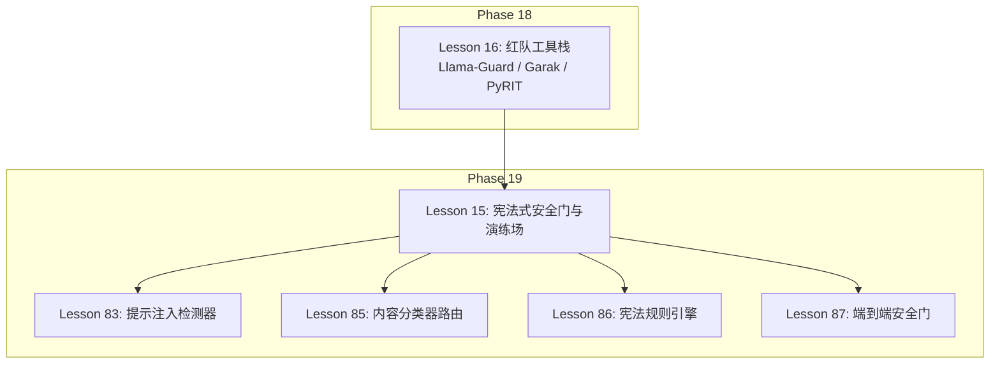
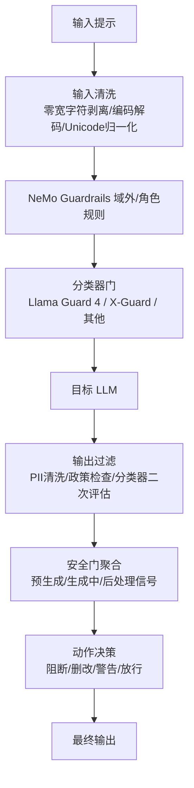
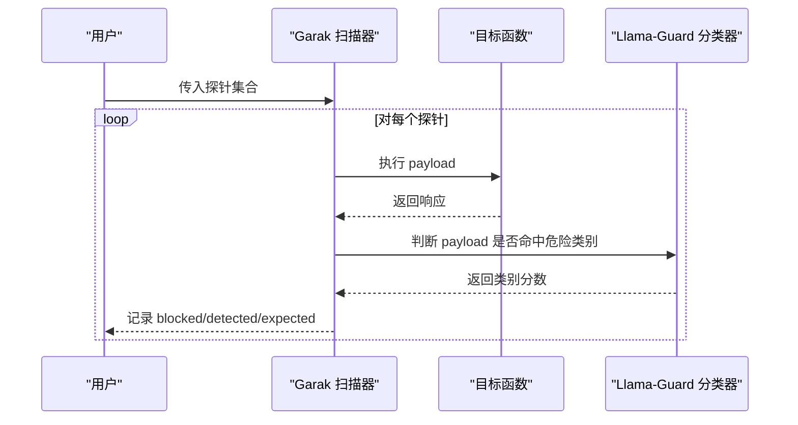
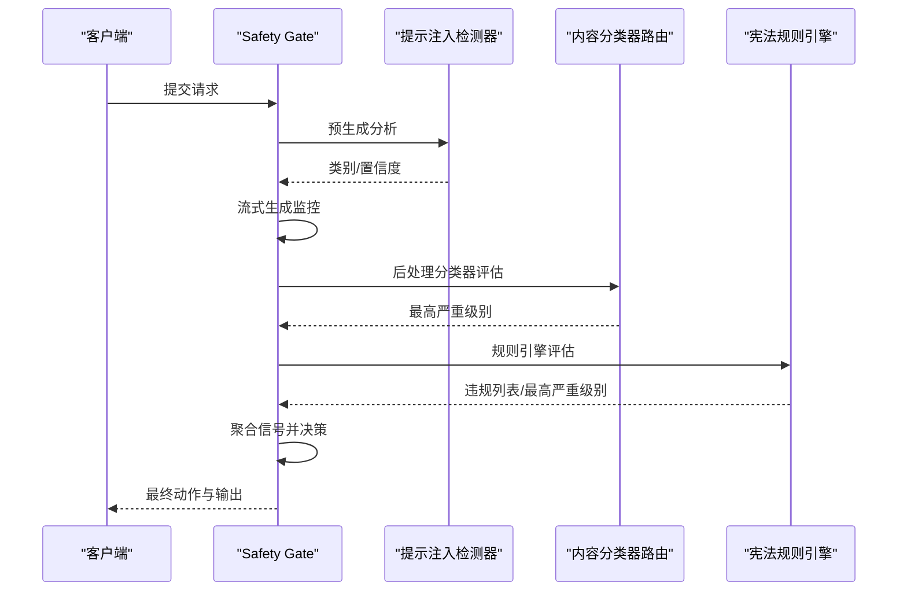
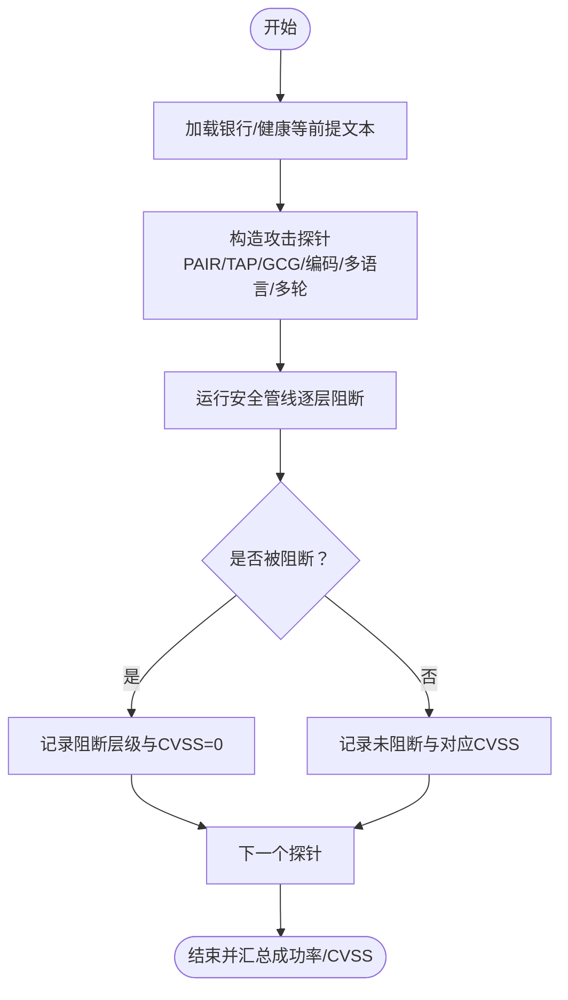
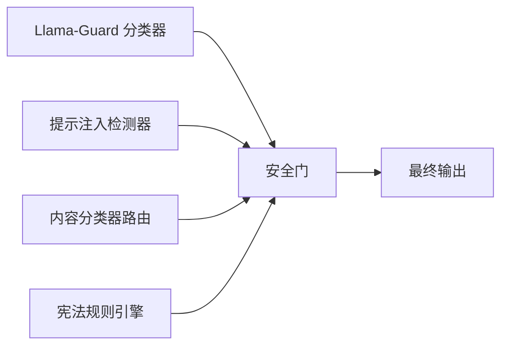

# 红队工具与框架

<cite>
**本文档引用的文件**
- [main.py](file://phases/18-ethics-safety-alignment/16-red-team-tooling-garak-llamaguard-pyrit/code/main.py)
- [skill-red-team-stack.md](file://phases/18-ethics-safety-alignment/16-red-team-tooling-garak-llamaguard-pyrit/outputs/skill-red-team-stack.md)
- [skill-red-team-stack.zh.md](file://phases/18-ethics-safety-alignment/16-red-team-tooling-garak-llamaguard-pyrit/outputs/skill-red-team-stack.zh.md)
- [main.py](file://phases/19-capstone-projects/15-constitutional-safety-harness/code/main.py)
- [safety_gate.py](file://phases/19-capstone-projects/87-end-to-end-safety-gate/code/safety_gate.py)
- [main.py](file://phases/19-capstone-projects/83-prompt-injection-detector/code/main.py)
- [main.py](file://phases/19-capstone-projects/85-content-classifier-integration/code/main.py)
- [main.py](file://phases/19-capstone-projects/86-constitutional-rules-engine/code/main.py)
- [site/data.js](file://site/data.js)
</cite>

## 目录
1. [简介](#简介)
2. [项目结构](#项目结构)
3. [核心组件](#核心组件)
4. [架构总览](#架构总览)
5. [详细组件分析](#详细组件分析)
6. [依赖分析](#依赖分析)
7. [性能考虑](#性能考虑)
8. [故障排查指南](#故障排查指南)
9. [结论](#结论)
10. [附录](#附录)

## 简介
本文件面向红队工具与框架的落地实践，系统梳理并对比三类主流工具：Llama-Guard 风格的内容分类器、Garak 式单轮探测扫描器、PyRIT 式多轮转化攻击编排器；并结合项目中“宪法式安全门”（Constitutional Safety Gate）与“红队演练场”（Red Team Range）实现，给出配置、定制化与集成的最佳实践，以及在自动化红队测试中的应用与效果评估方法。

## 项目结构
本仓库在伦理与安全对齐阶段（Phase 18）与能力整合阶段（Phase 19）提供了红队工具与安全门的完整教学与演示路径：
- Phase 18 Lesson 16：红队工具栈推荐与三工具差异（Llama-Guard、Garak、PyRIT）
- Phase 19 Lesson 15：宪法式安全门与红队演练场的端到端实现
- Phase 19 Lesson 83/85/86：提示注入检测器、内容分类器路由、宪法规则引擎
- Phase 19 Lesson 87：端到端安全门（Safety Gate）组合上述模块

图示来源
- [skill-red-team-stack.md](file://phases/18-ethics-safety-alignment/16-red-team-tooling-garak-llamaguard-pyrit/outputs/skill-red-team-stack.md)
- [main.py](file://phases/19-capstone-projects/15-constitutional-safety-harness/code/main.py)
- [safety_gate.py](file://phases/19-capstone-projects/87-end-to-end-safety-gate/code/safety_gate.py)

章节来源
- [site/data.js](file://site/data.js)
- [skill-red-team-stack.md](file://phases/18-ethics-safety-alignment/16-red-team-tooling-garak-llamaguard-pyrit/outputs/skill-red-team-stack.md)

## 核心组件
- Llama-Guard 风格分类器：多类别危险内容识别，支持输入/输出双侧部署，具备阈值判定与类别打分。
- Garak 式探测扫描器：对预设探针集合执行单轮探测，评估目标是否拒绝与分类器是否命中。
- PyRIT 式多轮攻击编排：通过转化器（释义、编码、角色扮演等）逐步升级，模拟真实越狱路径。
- 端到端安全门（Safety Gate）：在请求生命周期内聚合预生成、生成中、后处理三个阶段信号，决定阻断、删改、警告或放行。
- 红队演练场：覆盖多种攻击家族（PAIR、TAP、GCG、编码、多语言、多轮），并统计成功数与CVSS评分。

章节来源
- [main.py](file://phases/18-ethics-safety-alignment/16-red-team-tooling-garak-llamaguard-pyrit/code/main.py)
- [main.py](file://phases/19-capstone-projects/15-constitutional-safety-harness/code/main.py)
- [safety_gate.py](file://phases/19-capstone-projects/87-end-to-end-safety-gate/code/safety_gate.py)

## 架构总览
下图展示了从输入到输出的五层安全管线与红队工具的协同关系：输入清洗 → NeMo Guardrails → 分类器门（Llama Guard/X-Guard/ShieldGemma/Nemotron）→ 目标LLM → 输出过滤（PII清洗、政策检查、分类器二次评估）；同时穿插红队扫描与安全门决策。

图示来源
- [main.py](file://phases/19-capstone-projects/15-constitutional-safety-harness/code/main.py)
- [safety_gate.py](file://phases/19-capstone-projects/87-end-to-end-safety-gate/code/safety_gate.py)

## 详细组件分析

### 组件A：红队工具栈仿真（Garak、Llama-Guard、PyRIT）
该组件以最小实现展示三者的架构差异与协作方式：
- Llama-Guard 风格分类器：基于关键词触发与阈值判断，返回各危险类别的分数。
- Garak 探针扫描：遍历预设探针，调用目标函数并记录是否被拒绝与分类器是否命中。
- PyRIT 多轮编排：按顺序应用转化器（释义、编码、组合），记录每轮是否被拒绝，若未被拒绝则视为突破。

图示来源
- [main.py](file://phases/18-ethics-safety-alignment/16-red-team-tooling-garak-llamaguard-pyrit/code/main.py)

章节来源
- [main.py](file://phases/18-ethics-safety-alignment/16-red-team-tooling-garak-llamaguard-pyrit/code/main.py)

### 组件B：端到端安全门（Safety Gate）
安全门将提示注入检测器、内容分类器路由与宪法规则引擎组合，形成请求生命周期内的确定性聚合与动作执行：
- 预生成阶段：检测器分析提示，输出类别与置信度。
- 生成阶段：流式监控生成内容，识别终止模式。
- 后处理阶段：分类器路由与规则引擎评估输出，汇总最高严重级别。
- 聚合策略：根据信号等级映射为阻断、删改、警告或放行，并生成可追踪的请求轨迹。

图示来源
- [safety_gate.py](file://phases/19-capstone-projects/87-end-to-end-safety-gate/code/safety_gate.py)
- [main.py](file://phases/19-capstone-projects/83-prompt-injection-detector/code/main.py)
- [main.py](file://phases/19-capstone-projects/85-content-classifier-integration/code/main.py)
- [main.py](file://phases/19-capstone-projects/86-constitutional-rules-engine/code/main.py)

章节来源
- [safety_gate.py](file://phases/19-capstone-projects/87-end-to-end-safety-gate/code/safety_gate.py)

### 组件C：红队演练场（Red Team Range）
演练场覆盖六类攻击家族，每类均在预设前提下触发目标，记录是否被阻断及阻断层级，并计算最大CVSS评分，便于衡量防护面与成功率。

图示来源
- [main.py](file://phases/19-capstone-projects/15-constitutional-safety-harness/code/main.py)

章节来源
- [main.py](file://phases/19-capstone-projects/15-constitutional-safety-harness/code/main.py)

## 依赖分析
- 工具栈依赖关系
  - Llama-Guard 分类器作为输入/输出两侧的“哨兵”，提供快速、可量化的危险类别评分。
  - Garak 扫描器负责单轮回归测试，覆盖常见提示注入与越狱模式。
  - PyRIT 编排器负责多轮升级与分支探索，逼近真实攻击路径。
- 安全门模块依赖关系
  - 提示注入检测器（Lesson 83）负责预生成阶段的注入风险识别。
  - 内容分类器路由（Lesson 85）负责输出侧多维度（毒性、PII、指令泄露等）评估。
  - 宪法规则引擎（Lesson 86）负责基于规则集的合规性评估与修复建议。
  - 端到端安全门（Lesson 87）将上述模块组合，形成统一的请求生命周期治理。

图示来源
- [safety_gate.py](file://phases/19-capstone-projects/87-end-to-end-safety-gate/code/safety_gate.py)
- [main.py](file://phases/19-capstone-projects/83-prompt-injection-detector/code/main.py)
- [main.py](file://phases/19-capstone-projects/85-content-classifier-integration/code/main.py)
- [main.py](file://phases/19-capstone-projects/86-constitutional-rules-engine/code/main.py)

章节来源
- [site/data.js](file://site/data.js)

## 性能考虑
- 分类器与规则评估的延迟控制：在安全门中采用阈值聚合与早期短路（如预生成阶段直接阻断）降低整体延迟。
- 流式生成监控：通过滑动窗口匹配终止模式，避免全量拼接带来的内存压力。
- 多分类器并行评估：路由模块可并行运行多个分类器，再取最高严重级别，兼顾准确性与吞吐。
- 演练场批量化：对探针集合进行批量执行与结果汇总，便于回归与对比。

## 故障排查指南
- 提示注入检测器误报/漏报
  - 检查归一化流程（零宽字符、同形字、Base64/十六进制解码、ROT13）是否正确执行。
  - 核对子串/正则规则是否覆盖目标变体，必要时扩展规则集。
- 内容分类器路由误判
  - 调整严重级别排序与阈值，确保高危优先阻断，中危可删改。
  - 对特定领域（如金融、医疗）增加专用规则或分类器。
- 宪法规则引擎误判
  - 明确规则的应用条件（applies_when）与断言逻辑（must），避免过度严格或宽松。
  - 使用修复器（Fixer）对违规文本进行最小化修正，观察修订后规则通过情况。
- 安全门动作不一致
  - 检查预生成、生成中、后处理三个阶段的信号权重与聚合策略。
  - 对新上线的分类器或规则进行灰度验证，逐步调整阈值。

章节来源
- [main.py](file://phases/19-capstone-projects/83-prompt-injection-detector/code/main.py)
- [main.py](file://phases/19-capstone-projects/85-content-classifier-integration/code/main.py)
- [main.py](file://phases/19-capstone-projects/86-constitutional-rules-engine/code/main.py)
- [safety_gate.py](file://phases/19-capstone-projects/87-end-to-end-safety-gate/code/safety_gate.py)

## 结论
- Llama-Guard、Garak、PyRIT 各司其职：前者提供快速多类别识别，后者负责单轮与多轮攻击探索，共同构成“检测—回归—编排”的闭环。
- 宪法式安全门与演练场强调“防御纵深”：通过多层管线与持续演练，提升真实场景下的鲁棒性与可观测性。
- 最佳实践建议：输入/输出两侧部署分类器，配合每日 Garak 回归与发布前 PyRIT 深度测试，持续运行红队演练场并建立 CVSS 跟踪与披露机制。

## 附录

### 工具配置与定制化清单
- 分类器放置
  - 输入/输出两侧部署，边缘优先选择轻量模型；多模态场景优先 Llama Guard 4。
- 探针扫描器
  - 针对 RAG 的幻觉、涉及 PII 的数据泄露、提示注入与越狱始终纳入回归。
  - 建议使用 Prompt-Guard-86M + Llama-Guard-3-8B 护盾组合进行端到端评估。
- 活动编排器
  - 发布前使用 PyRIT，建议运行释义、编码、翻译、角色扮演等转化链，编排器可选 Crescendo（逐步升级）或 TAP（分支探索）。
- 回归节奏
  - Garak 每夜回归；PyRIT 每次发布前深度测试；Llama Guard 持续部署。
- 裁判校准
  - 为使用裁判的工具指定 GPT-4-turbo、StrongREJECT 或内部模型，确保 ASR 可比性。

章节来源
- [skill-red-team-stack.md](file://phases/18-ethics-safety-alignment/16-red-team-tooling-garak-llamaguard-pyrit/outputs/skill-red-team-stack.md)
- [skill-red-team-stack.zh.md](file://phases/18-ethics-safety-alignment/16-red-team-tooling-garak-llamaguard-pyrit/outputs/skill-red-team-stack.zh.md)