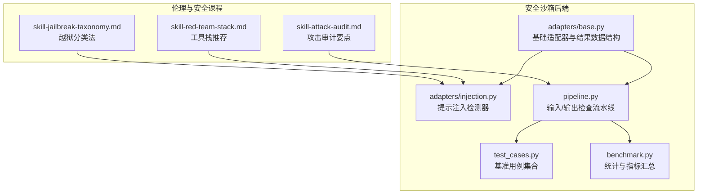
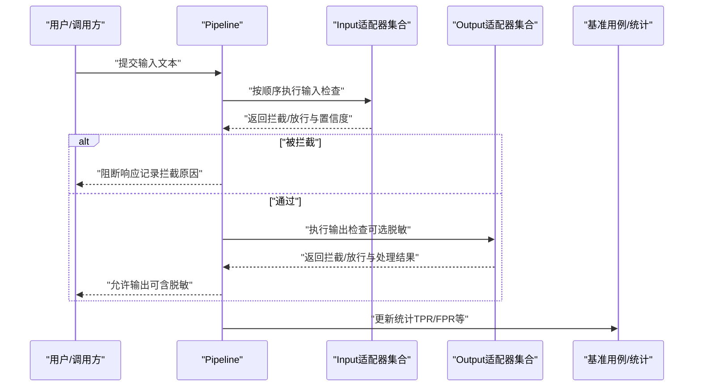
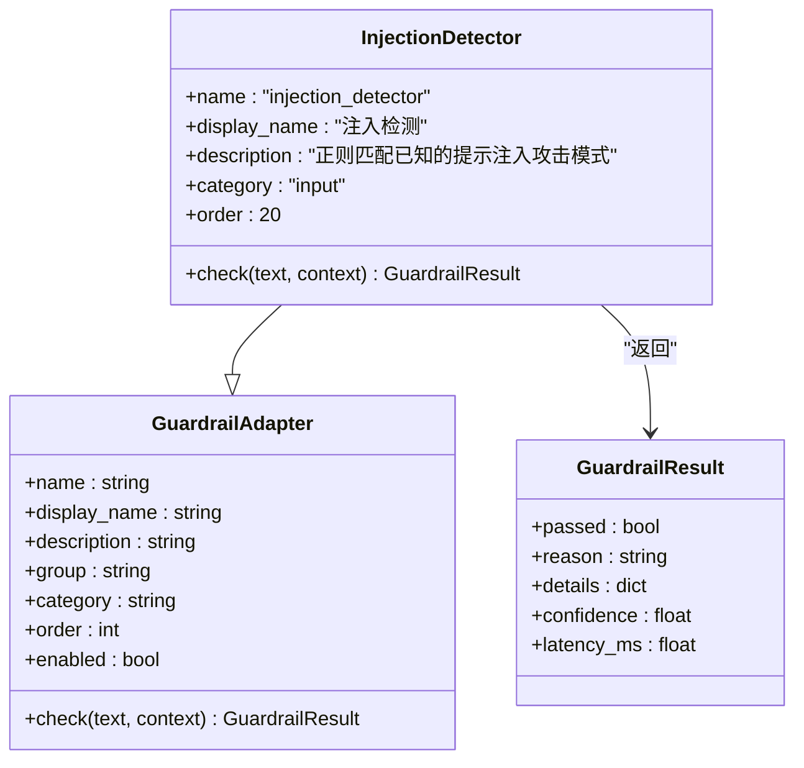
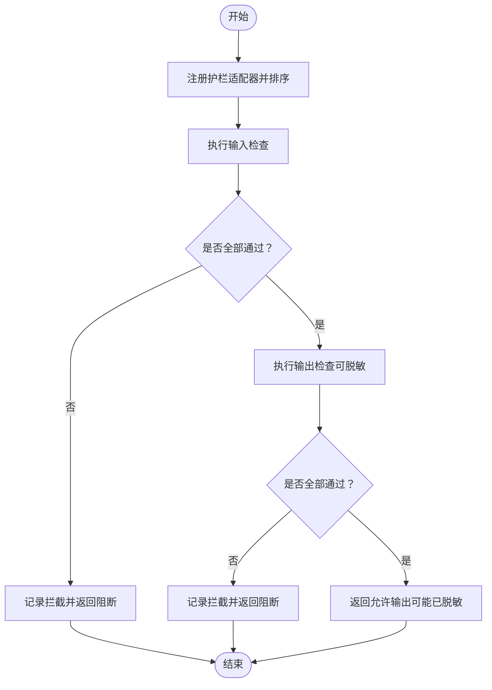
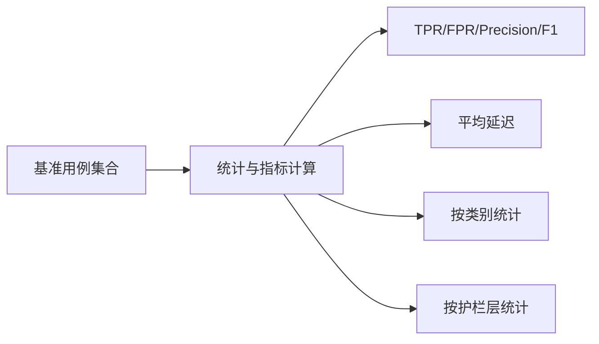
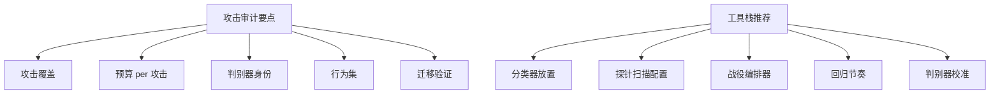
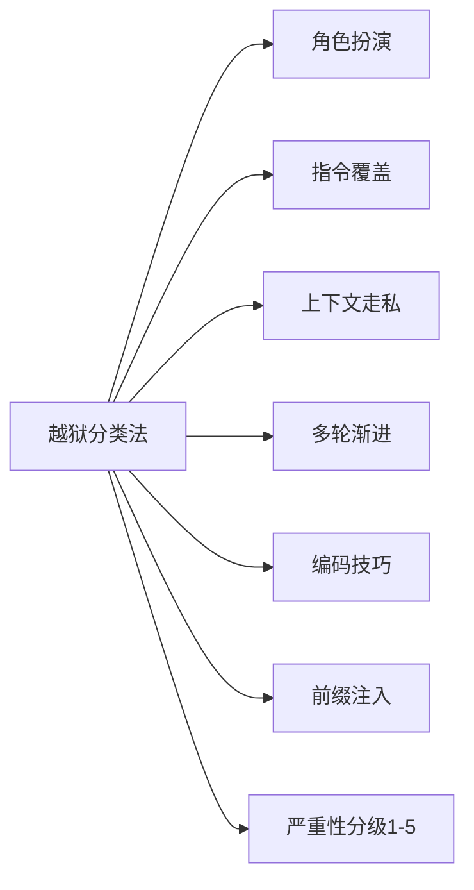
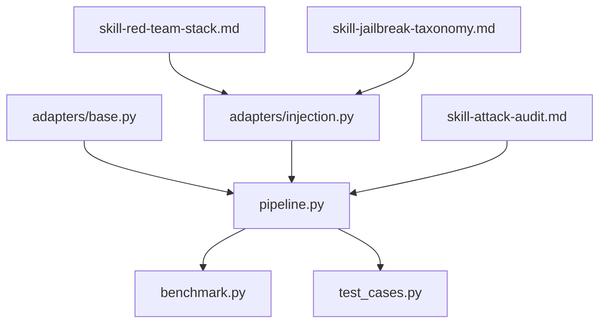

# 红队攻击技术

<cite>
**本文引用的文件**   
- [guardrails-sandbox/backend/adapters/base.py](file://guardrails-sandbox/backend/adapters/base.py)
- [guardrails-sandbox/backend/adapters/injection.py](file://guardrails-sandbox/backend/adapters/injection.py)
- [guardrails-sandbox/backend/pipeline.py](file://guardrails-sandbox/backend/pipeline.py)
- [guardrails-sandbox/backend/benchmark.py](file://guardrails-sandbox/backend/benchmark.py)
- [guardrails-sandbox/backend/test_cases.py](file://guardrails-sandbox/backend/test_cases.py)
- [phases/18-ethics-safety-alignment/12-red-teaming-pair-automated-attacks/outputs/skill-attack-audit.md](file://phases/18-ethics-safety-alignment/12-red-teaming-pair-automated-attacks/outputs/skill-attack-audit.md)
- [phases/18-ethics-safety-alignment/16-red-team-tooling-garak-llamaguard-pyrit/outputs/skill-red-team-stack.md](file://phases/18-ethics-safety-alignment/16-red-team-tooling-garak-llamaguard-pyrit/outputs/skill-red-team-stack.md)
- [phases/19-capstone-projects/82-jailbreak-taxonomy/outputs/skill-jailbreak-taxonomy.md](file://phases/19-capstone-projects/82-jailbreak-taxonomy/outputs/skill-jailbreak-taxonomy.md)
</cite>

## 目录
1. [简介](#简介)
2. [项目结构](#项目结构)
3. [核心组件](#核心组件)
4. [架构总览](#架构总览)
5. [详细组件分析](#详细组件分析)
6. [依赖分析](#依赖分析)
7. [性能考虑](#性能考虑)
8. [故障排查指南](#故障排查指南)
9. [结论](#结论)
10. [附录](#附录)

## 简介
本文件面向红队攻击技术，围绕“配对与自动化攻击”的原理与实现展开，结合仓库中的安全沙箱与伦理安全课程材料，系统阐述如何构建有效的攻击-防御配对以评测模型安全性，并给出自动化攻击生成与评估方法。重点包括：
- 如何基于提示注入与语义相似性构建攻击样本库与检测器
- 如何通过流水线编排实现输入/输出双层安全门禁
- 如何利用基准用例与指标（TPR/FPR/Precision/F1）评估拦截能力
- 如何依据课程技能文档进行攻击审计与工具栈推荐
- 如何以“越狱分类法”对攻击进行归类与分级

## 项目结构
本项目与红队攻击相关的核心位于 guardrails-sandbox 后端与伦理安全课程的若干技能文档。前者提供了可插拔的“护栏适配器”与流水线编排；后者提供了攻击审计、工具栈推荐与越狱分类法等实践指南。

**图表来源**
- [guardrails-sandbox/backend/adapters/base.py:1-34](file://guardrails-sandbox/backend/adapters/base.py#L1-L34)
- [guardrails-sandbox/backend/adapters/injection.py:1-87](file://guardrails-sandbox/backend/adapters/injection.py#L1-L87)
- [guardrails-sandbox/backend/pipeline.py:1-285](file://guardrails-sandbox/backend/pipeline.py#L1-L285)
- [guardrails-sandbox/backend/test_cases.py:1-155](file://guardrails-sandbox/backend/test_cases.py#L1-L155)
- [guardrails-sandbox/backend/benchmark.py:92-168](file://guardrails-sandbox/backend/benchmark.py#L92-L168)
- [phases/18-ethics-safety-alignment/12-red-teaming-pair-automated-attacks/outputs/skill-attack-audit.md:1-30](file://phases/18-ethics-safety-alignment/12-red-teaming-pair-automated-attacks/outputs/skill-attack-audit.md#L1-L30)
- [phases/18-ethics-safety-alignment/16-red-team-tooling-garak-llamaguard-pyrit/outputs/skill-red-team-stack.md:1-30](file://phases/18-ethics-safety-alignment/16-red-team-tooling-garak-llamaguard-pyrit/outputs/skill-red-team-stack.md#L1-L30)
- [phases/19-capstone-projects/82-jailbreak-taxonomy/outputs/skill-jailbreak-taxonomy.md:1-36](file://phases/19-capstone-projects/82-jailbreak-taxonomy/outputs/skill-jailbreak-taxonomy.md#L1-L36)

**章节来源**
- [guardrails-sandbox/backend/adapters/base.py:1-34](file://guardrails-sandbox/backend/adapters/base.py#L1-L34)
- [guardrails-sandbox/backend/adapters/injection.py:1-87](file://guardrails-sandbox/backend/adapters/injection.py#L1-L87)
- [guardrails-sandbox/backend/pipeline.py:1-285](file://guardrails-sandbox/backend/pipeline.py#L1-L285)
- [guardrails-sandbox/backend/test_cases.py:1-155](file://guardrails-sandbox/backend/test_cases.py#L1-L155)
- [guardrails-sandbox/backend/benchmark.py:92-168](file://guardrails-sandbox/backend/benchmark.py#L92-L168)
- [phases/18-ethics-safety-alignment/12-red-teaming-pair-automated-attacks/outputs/skill-attack-audit.md:1-30](file://phases/18-ethics-safety-alignment/12-red-teaming-pair-automated-attacks/outputs/skill-attack-audit.md#L1-L30)
- [phases/18-ethics-safety-alignment/16-red-team-tooling-garak-llamaguard-pyrit/outputs/skill-red-team-stack.md:1-30](file://phases/18-ethics-safety-alignment/16-red-team-tooling-garak-llamaguard-pyrit/outputs/skill-red-team-stack.md#L1-L30)
- [phases/19-capstone-projects/82-jailbreak-taxonomy/outputs/skill-jailbreak-taxonomy.md:1-36](file://phases/19-capstone-projects/82-jailbreak-taxonomy/outputs/skill-jailbreak-taxonomy.md#L1-L36)

## 核心组件
- 基础适配器与结果数据结构：定义统一的 GuardrailAdapter 抽象与 GuardrailResult 结构，便于扩展不同护栏类型（输入/输出、启用状态、执行顺序等）。
- 提示注入检测器：内置常见英文与中文注入模式，支持编码绕过检测，输出置信度与命中详情。
- 流水线编排：按类别与顺序执行护栏，遇到拦截即短路，支持输入/输出两阶段检查与拦截历史记录。
- 基准用例与统计：提供多类用例（正常、注入、语义变种、PII、毒性、边界），并计算 TPR/FPR/Precision/F1 等指标。
- 攻击审计与工具栈：课程技能文档提供攻击覆盖、预算、判别器身份、行为集与迁移验证的审计清单，以及 Llama Guard/Garak/PyRIT 的推荐配置。

**章节来源**
- [guardrails-sandbox/backend/adapters/base.py:5-34](file://guardrails-sandbox/backend/adapters/base.py#L5-L34)
- [guardrails-sandbox/backend/adapters/injection.py:44-87](file://guardrails-sandbox/backend/adapters/injection.py#L44-L87)
- [guardrails-sandbox/backend/pipeline.py:12-161](file://guardrails-sandbox/backend/pipeline.py#L12-L161)
- [guardrails-sandbox/backend/test_cases.py:10-155](file://guardrails-sandbox/backend/test_cases.py#L10-L155)
- [guardrails-sandbox/backend/benchmark.py:92-168](file://guardrails-sandbox/backend/benchmark.py#L92-L168)
- [phases/18-ethics-safety-alignment/12-red-teaming-pair-automated-attacks/outputs/skill-attack-audit.md:10-29](file://phases/18-ethics-safety-alignment/12-red-teaming-pair-automated-attacks/outputs/skill-attack-audit.md#L10-L29)
- [phases/18-ethics-safety-alignment/16-red-team-tooling-garak-llamaguard-pyrit/outputs/skill-red-team-stack.md:10-27](file://phases/18-ethics-safety-alignment/16-red-team-tooling-garak-llamaguard-pyrit/outputs/skill-red-team-stack.md#L10-L27)

## 架构总览
下图展示从输入到输出的完整护栏流水线，以及与课程技能文档的关联。

**图表来源**
- [guardrails-sandbox/backend/pipeline.py:31-127](file://guardrails-sandbox/backend/pipeline.py#L31-L127)
- [guardrails-sandbox/backend/benchmark.py:92-168](file://guardrails-sandbox/backend/benchmark.py#L92-L168)

## 详细组件分析

### 组件A：提示注入检测器（InjectionDetector）
- 功能定位：作为输入护栏，基于正则表达式匹配典型注入模式与编码绕过技巧，输出最大置信度与命中详情。
- 关键点：
  - 注入模式覆盖英文与中文场景，包含“覆盖指令”“越狱关键词”“提示泄露”等。
  - 编码绕过检测覆盖 Unicode、Base64、ROT13、十六进制等。
  - 返回 GuardrailResult，包含 passed/reason/details/confidence/latency_ms。
- 复杂度与性能：正则扫描复杂度近似 O(n)，其中 n 为文本长度；整体延迟毫秒级。

**图表来源**
- [guardrails-sandbox/backend/adapters/base.py:14-34](file://guardrails-sandbox/backend/adapters/base.py#L14-L34)
- [guardrails-sandbox/backend/adapters/injection.py:44-87](file://guardrails-sandbox/backend/adapters/injection.py#L44-L87)

**章节来源**
- [guardrails-sandbox/backend/adapters/injection.py:1-87](file://guardrails-sandbox/backend/adapters/injection.py#L1-L87)
- [guardrails-sandbox/backend/adapters/base.py:5-11](file://guardrails-sandbox/backend/adapters/base.py#L5-L11)

### 组件B：流水线编排（Pipeline）
- 功能定位：注册护栏适配器，按类别与顺序执行输入/输出检查，短路拦截，记录统计与拦截历史。
- 关键点：
  - 输入检查：逐个执行，任一拦截即短路并返回拦截详情。
  - 输出检查：可选对输出进行脱敏与二次过滤，支持上下文传递。
  - 统计维度：总次数、拦截次数、通过次数、按护栏统计的拦截/通过数、拦截率等。
- 复杂度与性能：每次检查为 O(k)（k 为护栏数量），整体开销主要在适配器内部逻辑。

**图表来源**
- [guardrails-sandbox/backend/pipeline.py:12-161](file://guardrails-sandbox/backend/pipeline.py#L12-L161)

**章节来源**
- [guardrails-sandbox/backend/pipeline.py:12-161](file://guardrails-sandbox/backend/pipeline.py#L12-L161)

### 组件C：基准用例与统计（TestCases + Benchmark）
- 基准用例：涵盖正常查询、注入攻击、语义变种、PII、毒性、边界情况，用于训练/评估护栏。
- 统计指标：按类别与拦截层统计，计算 TPR/FPR/Precision/F1，支持平均延迟等性能指标。
- 使用方式：将护栏结果与期望标签比对，生成汇总报告，辅助护栏优化与回归测试。

**图表来源**
- [guardrails-sandbox/backend/test_cases.py:10-155](file://guardrails-sandbox/backend/test_cases.py#L10-L155)
- [guardrails-sandbox/backend/benchmark.py:92-168](file://guardrails-sandbox/backend/benchmark.py#L92-L168)

**章节来源**
- [guardrails-sandbox/backend/test_cases.py:10-155](file://guardrails-sandbox/backend/test_cases.py#L10-L155)
- [guardrails-sandbox/backend/benchmark.py:92-168](file://guardrails-sandbox/backend/benchmark.py#L92-L168)

### 组件D：攻击审计与工具栈（课程技能文档）
- 攻击审计：要求报告攻击覆盖（PAIR/GCG/AutoDAN/TAP/PAP/手动）、预算、判别器身份、行为集与迁移验证，明确硬拒绝与拒绝规则。
- 工具栈推荐：针对部署场景推荐 Llama Guard（输入/输出/两者）、Garak 探针（幻觉/数据泄露/注入/越狱）与 PyRIT 调度器（Crescendo/TAP），并给出回归节奏与判别器校准建议。

**图表来源**
- [phases/18-ethics-safety-alignment/12-red-teaming-pair-automated-attacks/outputs/skill-attack-audit.md:10-29](file://phases/18-ethics-safety-alignment/12-red-teaming-pair-automated-attacks/outputs/skill-attack-audit.md#L10-L29)
- [phases/18-ethics-safety-alignment/16-red-team-tooling-garak-llamaguard-pyrit/outputs/skill-red-team-stack.md:10-27](file://phases/18-ethics-safety-alignment/16-red-team-tooling-garak-llamaguard-pyrit/outputs/skill-red-team-stack.md#L10-L27)

**章节来源**
- [phases/18-ethics-safety-alignment/12-red-teaming-pair-automated-attacks/outputs/skill-attack-audit.md:10-29](file://phases/18-ethics-safety-alignment/12-red-teaming-pair-automated-attacks/outputs/skill-attack-audit.md#L10-L29)
- [phases/18-ethics-safety-alignment/16-red-team-tooling-garak-llamaguard-pyrit/outputs/skill-red-team-stack.md:10-27](file://phases/18-ethics-safety-alignment/16-red-team-tooling-garak-llamaguard-pyrit/outputs/skill-red-team-stack.md#L10-L27)

### 组件E：越狱分类法（Jailbreak Taxonomy）
- 将越狱攻击分为六类：角色扮演、指令覆盖、上下文走私、多轮渐进、编码技巧、前缀注入，提供快速测试与严重性分级。
- 用途：为攻击归类、日志标注与下游分析提供共享词汇表。

**图表来源**
- [phases/19-capstone-projects/82-jailbreak-taxonomy/outputs/skill-jailbreak-taxonomy.md:10-36](file://phases/19-capstone-projects/82-jailbreak-taxonomy/outputs/skill-jailbreak-taxonomy.md#L10-L36)

**章节来源**
- [phases/19-capstone-projects/82-jailbreak-taxonomy/outputs/skill-jailbreak-taxonomy.md:10-36](file://phases/19-capstone-projects/82-jailbreak-taxonomy/outputs/skill-jailbreak-taxonomy.md#L10-L36)

## 依赖分析
- 组件耦合与内聚：
  - GuardrailAdapter 与 GuardrailResult 是护栏系统的统一契约，内聚度高、耦合低，便于扩展新护栏。
  - Pipeline 对适配器按类别与顺序调度，形成清晰的输入/输出双层门禁链路。
  - TestCases 与 Benchmark 提供评估闭环，驱动护栏迭代。
- 外部依赖与集成点：
  - 判别器（如 Llama Guard、StrongREJECT、GPT-4-turbo）作为外部 judge 的集成点，需在工具栈与审计中明确其身份与校准。
  - 课程技能文档为攻击审计与工具栈提供权威参考，指导实际部署与回归策略。

**图表来源**
- [guardrails-sandbox/backend/adapters/base.py:14-34](file://guardrails-sandbox/backend/adapters/base.py#L14-L34)
- [guardrails-sandbox/backend/adapters/injection.py:44-87](file://guardrails-sandbox/backend/adapters/injection.py#L44-L87)
- [guardrails-sandbox/backend/pipeline.py:12-161](file://guardrails-sandbox/backend/pipeline.py#L12-L161)
- [guardrails-sandbox/backend/benchmark.py:92-168](file://guardrails-sandbox/backend/benchmark.py#L92-L168)
- [guardrails-sandbox/backend/test_cases.py:10-155](file://guardrails-sandbox/backend/test_cases.py#L10-L155)
- [phases/18-ethics-safety-alignment/12-red-teaming-pair-automated-attacks/outputs/skill-attack-audit.md:10-29](file://phases/18-ethics-safety-alignment/12-red-teaming-pair-automated-attacks/outputs/skill-attack-audit.md#L10-L29)
- [phases/18-ethics-safety-alignment/16-red-team-tooling-garak-llamaguard-pyrit/outputs/skill-red-team-stack.md:10-27](file://phases/18-ethics-safety-alignment/16-red-team-tooling-garak-llamaguard-pyrit/outputs/skill-red-team-stack.md#L10-L27)
- [phases/19-capstone-projects/82-jailbreak-taxonomy/outputs/skill-jailbreak-taxonomy.md:10-36](file://phases/19-capstone-projects/82-jailbreak-taxonomy/outputs/skill-jailbreak-taxonomy.md#L10-L36)

**章节来源**
- [guardrails-sandbox/backend/adapters/base.py:14-34](file://guardrails-sandbox/backend/adapters/base.py#L14-L34)
- [guardrails-sandbox/backend/pipeline.py:12-161](file://guardrails-sandbox/backend/pipeline.py#L12-L161)
- [guardrails-sandbox/backend/benchmark.py:92-168](file://guardrails-sandbox/backend/benchmark.py#L92-L168)
- [guardrails-sandbox/backend/test_cases.py:10-155](file://guardrails-sandbox/backend/test_cases.py#L10-L155)
- [phases/18-ethics-safety-alignment/12-red-teaming-pair-automated-attacks/outputs/skill-attack-audit.md:10-29](file://phases/18-ethics-safety-alignment/12-red-teaming-pair-automated-attacks/outputs/skill-attack-audit.md#L10-L29)
- [phases/18-ethics-safety-alignment/16-red-team-tooling-garak-llamaguard-pyrit/outputs/skill-red-team-stack.md:10-27](file://phases/18-ethics-safety-alignment/16-red-team-tooling-garak-llamaguard-pyrit/outputs/skill-red-team-stack.md#L10-L27)
- [phases/19-capstone-projects/82-jailbreak-taxonomy/outputs/skill-jailbreak-taxonomy.md:10-36](file://phases/19-capstone-projects/82-jailbreak-taxonomy/outputs/skill-jailbreak-taxonomy.md#L10-L36)

## 性能考虑
- 护栏执行顺序与短路：通过 order 控制执行顺序，优先执行高置信度/低成本护栏，减少后续昂贵检查的概率。
- 并发与批处理：在批量评估时，可并行执行护栏检查（注意护栏内部无共享状态）。
- 判别器延迟：外部判别器（如 Llama Guard/GPT-4）延迟较高，建议在流水线外异步或缓存结果。
- 指标监控：利用平均延迟与拦截率等指标持续观测护栏性能，及时发现退化。

## 故障排查指南
- 拦截历史：Pipeline 维护拦截历史，包含时间戳、输入片段、护栏名称、阶段、原因与置信度，便于回溯。
- 统计报表：Benchmark 提供按类别与护栏层的统计，定位薄弱护栏与误拦热点。
- 用例回归：使用 TestCases 中的用例进行回归测试，确保新增护栏不会破坏正常流量。

**章节来源**
- [guardrails-sandbox/backend/pipeline.py:264-285](file://guardrails-sandbox/backend/pipeline.py#L264-L285)
- [guardrails-sandbox/backend/benchmark.py:92-168](file://guardrails-sandbox/backend/benchmark.py#L92-L168)
- [guardrails-sandbox/backend/test_cases.py:10-155](file://guardrails-sandbox/backend/test_cases.py#L10-L155)

## 结论
本项目通过“护栏适配器 + 流水线编排 + 基准用例 + 指标统计”的组合，为红队攻击与防御配对提供了可落地的技术框架。结合课程技能文档中的攻击审计与工具栈推荐，可在不同部署场景下建立可持续的红队评估与回归体系。越狱分类法则为攻击归类与日志标注提供统一语言，有助于规模化运营与复盘。

## 附录
- 自动化攻击生成建议：
  - 基于注入模式与编码绕过构建攻击样本库，定期更新以覆盖新变种。
  - 使用课程技能文档中的行为集（如 HarmBench/JailbreakBench）作为攻击集合来源。
  - 在工具栈中引入 Garak/PyRIT 进行自动化探索与编排，结合 Llama Guard 进行判别与回归。
- 评估方法：
  - 采用 TPR/FPR/Precision/F1 等指标衡量拦截能力，关注跨模型迁移 ASR 与判别器校准。
  - 通过拦截历史与统计报表持续优化护栏配置与阈值。