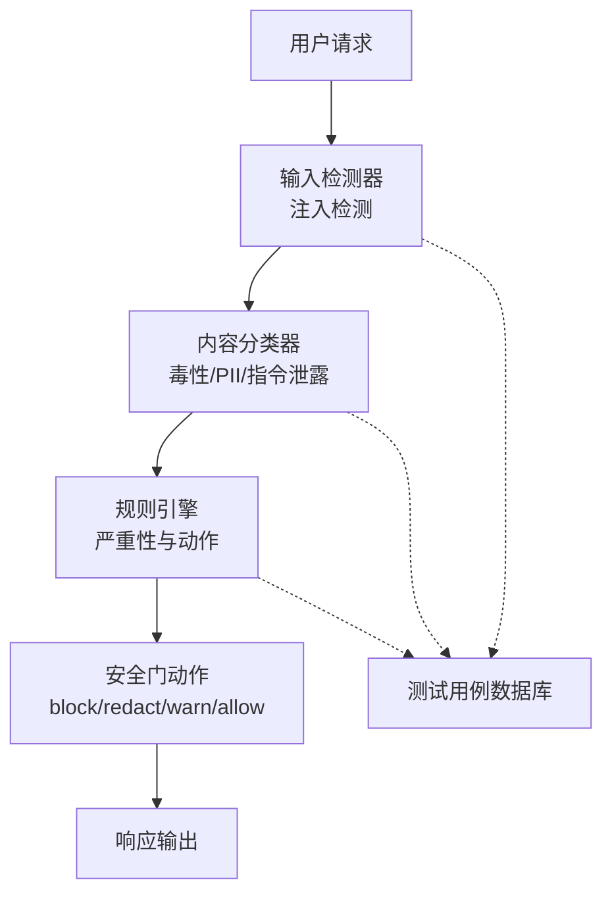
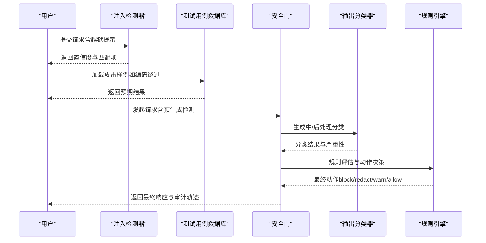
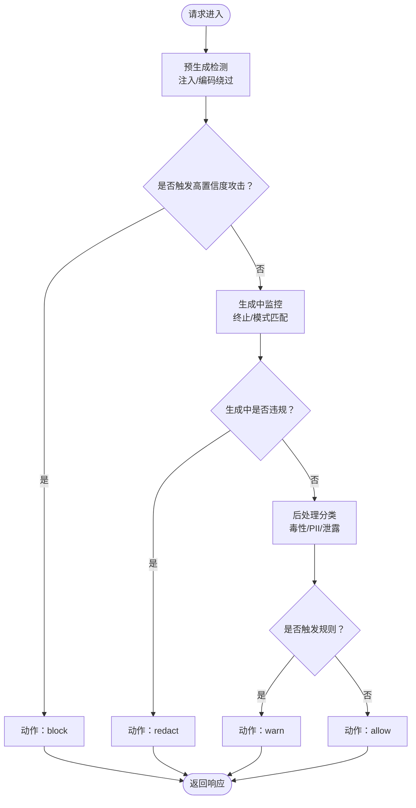
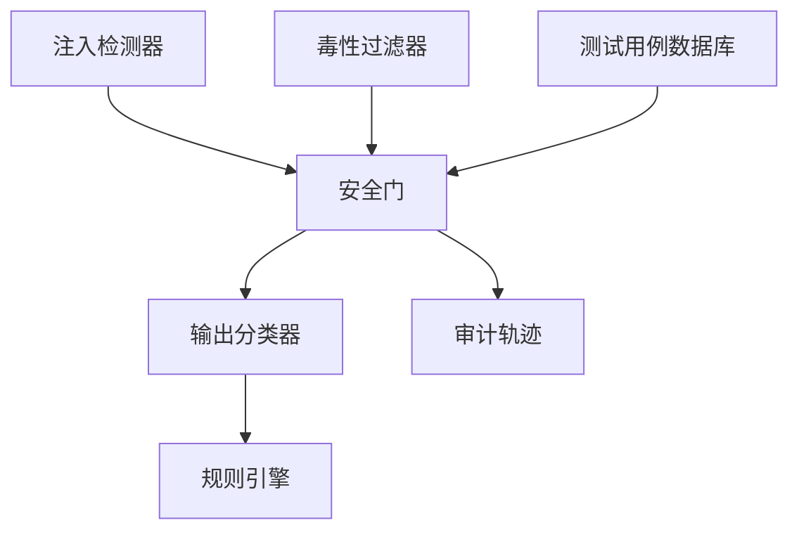

# 越狱攻击技术

<cite>
**本文引用的文件**
- [guardrails-sandbox/backend/adapters/injection.py](file://guardrails-sandbox/backend/adapters/injection.py)
- [guardrails-sandbox/backend/adapters/toxicity.py](file://guardrails-sandbox/backend/adapters/toxicity.py)
- [guardrails-sandbox/backend/test_cases.py](file://guardrails-sandbox/backend/test_cases.py)
- [phases/19-capstone-projects/87-end-to-end-safety-gate/code/safety_gate.py](file://phases/19-capstone-projects/87-end-to-end-safety-gate/code/safety_gate.py)
- [phases/19-capstone-projects/87-end-to-end-safety-gate/outputs/gate_trace.json](file://phases/19-capstone-projects/87-end-to-end-safety-gate/outputs/gate_trace.json)
- [site/data.js](file://site/data.js)
- [site/figures-agents-alignment.js](file://site/figures-agents-alignment.js)
</cite>

## 目录
1. [简介](#简介)
2. [项目结构](#项目结构)
3. [核心组件](#核心组件)
4. [架构总览](#架构总览)
5. [详细组件分析](#详细组件分析)
6. [依赖分析](#依赖分析)
7. [性能考虑](#性能考虑)
8. [故障排查指南](#故障排查指南)
9. [结论](#结论)
10. [附录](#附录)

## 简介
本文件聚焦于越狱攻击技术在安全测试中的应用与对抗实践，围绕两类高级攻击手法展开：多提示越狱（Many-shot Jailbreaking）与 ASCII 艺术/视觉越狱（ASCII Art/Visual Jailbreak）。我们将解释这些攻击如何绕过模型的安全限制与内容过滤机制，分析其原理、实现复杂度与成功率，并结合仓库中的安全门（Safety Gate）与检测器实现，给出具体攻击示例与防御建议。同时讨论越狱攻击在安全测试中的作用与局限性。

## 项目结构
本仓库将越狱攻击测试与安全防护体系整合在“伦理、安全与对齐”阶段，并通过端到端安全门进行串联。关键位置如下：
- 输入侧注入检测：基于正则模式与编码绕过特征的检测器
- 输出侧内容分类与规则引擎：对生成内容进行分类与动作决策
- 测试用例数据库：覆盖正常、注入、语义变种、PII、毒性与边界场景
- 安全门：预生成（pre-gen）、生成中（during-gen）、后处理（post-gen）三阶段决策与审计跟踪

图表来源
- [guardrails-sandbox/backend/adapters/injection.py:1-87](file://guardrails-sandbox/backend/adapters/injection.py#L1-L87)
- [guardrails-sandbox/backend/adapters/toxicity.py:1-63](file://guardrails-sandbox/backend/adapters/toxicity.py#L1-L63)
- [phases/19-capstone-projects/87-end-to-end-safety-gate/code/safety_gate.py:104-119](file://phases/19-capstone-projects/87-end-to-end-safety-gate/code/safety_gate.py#L104-L119)

章节来源
- [site/data.js:18050-18132](file://site/data.js#L18050-L18132)
- [site/data.js:4680-4720](file://site/data.js#L4680-L4720)

## 核心组件
- 注入检测器（InjectionDetector）
  - 基于正则表达式的提示注入攻击模式匹配，包含英文与中文覆盖指令、越狱关键词、系统提示泄露等模式
  - 额外支持编码绕过检测（Unicode、Base64、ROT13、十六进制等）
- 毒性过滤器（ToxicityFilter）
  - 检测暴力、违法、自残、仇恨、色情等敏感主题；对特定安全上下文前缀进行豁免
- 测试用例数据库（test_cases）
  - 覆盖正常查询、注入攻击、语义变种、PII、毒性与边界情况，用于评估检测器与安全门的性能
- 安全门（Safety Gate）
  - 三阶段决策：预生成（pre-gen）检测、生成中（during-gen）终止与模式匹配、后处理（post-gen）分类与规则评估
  - 支持 block、redact、warn、log 等动作，并记录每请求的审计轨迹

章节来源
- [guardrails-sandbox/backend/adapters/injection.py:1-87](file://guardrails-sandbox/backend/adapters/injection.py#L1-L87)
- [guardrails-sandbox/backend/adapters/toxicity.py:1-63](file://guardrails-sandbox/backend/adapters/toxicity.py#L1-L63)
- [guardrails-sandbox/backend/test_cases.py:1-155](file://guardrails-sandbox/backend/test_cases.py#L1-L155)
- [phases/19-capstone-projects/87-end-to-end-safety-gate/code/safety_gate.py:104-119](file://phases/19-capstone-projects/87-end-to-end-safety-gate/code/safety_gate.py#L104-L119)

## 架构总览
下图展示了越狱攻击测试与安全门的整体交互流程，包括攻击样例在三阶段中的触发与处置：

图表来源
- [guardrails-sandbox/backend/adapters/injection.py:53-87](file://guardrails-sandbox/backend/adapters/injection.py#L53-L87)
- [guardrails-sandbox/backend/test_cases.py:47-102](file://guardrails-sandbox/backend/test_cases.py#L47-L102)
- [phases/19-capstone-projects/87-end-to-end-safety-gate/code/safety_gate.py:117-119](file://phases/19-capstone-projects/87-end-to-end-safety-gate/code/safety_gate.py#L117-L119)
- [phases/19-capstone-projects/87-end-to-end-safety-gate/outputs/gate_trace.json:891-937](file://phases/19-capstone-projects/87-end-to-end-safety-gate/outputs/gate_trace.json#L891-L937)

## 详细组件分析

### 多提示越狱（Many-shot Jailbreaking）
- 原理
  - 通过在上下文中插入大量示例或指令，逐步引导模型放弃安全限制，最终在目标提示中实现越狱
  - 本仓库通过“多提示越狱审计”技能与测试用例集合，评估长上下文下的越狱覆盖能力
- 实现复杂度
  - 中等：需要构造多样化的上下文示例，确保覆盖不同语言风格与结构
- 成功率
  - 受限于安全门的预生成检测与规则引擎的阈值设置；成功率取决于注入模式的隐蔽性与安全门的检测强度
- 具体示例
  - 使用测试用例数据库中的注入与语义变种样例，模拟多轮对话中的越狱提示
- 防御建议
  - 强化预生成检测器的编码绕过与结构化规避检测
  - 在规则引擎中设置更严格的严重性阈值与动作策略

章节来源
- [site/data.js:18070-18097](file://site/data.js#L18070-L18097)
- [guardrails-sandbox/backend/test_cases.py:47-86](file://guardrails-sandbox/backend/test_cases.py#L47-L86)

### ASCII 艺术/视觉越狱（ASCII Art/Visual Jailbreak）
- 原理
  - 利用字符编码、零宽字符、特殊空白符等手段，在视觉上隐藏越狱提示，绕过基于文本的正则与编码检测
  - 本仓库通过“编码家族攻击审计”技能，覆盖 artprompt、ASCII 艺术、编码攻击、UTES、结构性规避等类别
- 实现复杂度
  - 中高：需要掌握多种编码与 Unicode 技巧，构造难以被传统正则捕获的提示
- 成功率
  - 对未针对编码绕过的检测器可能较高；在启用编码绕过检测与输出分类器后显著下降
- 具体示例
  - 测试用例与安全门审计轨迹中包含编码技巧类样例，例如使用零宽字符与特殊空白符拼接越狱提示
- 防御建议
  - 在输入侧启用编码绕过检测（Unicode、Base64、ROT13、十六进制等）
  - 在输出侧部署内容分类器与规则引擎，对生成内容进行二次筛查与动作处置

章节来源
- [site/data.js:18100-18129](file://site/data.js#L18100-L18129)
- [guardrails-sandbox/backend/adapters/injection.py:35-41](file://guardrails-sandbox/backend/adapters/injection.py#L35-L41)
- [phases/19-capstone-projects/87-end-to-end-safety-gate/outputs/gate_trace.json:891-937](file://phases/19-capstone-projects/87-end-to-end-safety-gate/outputs/gate_trace.json#L891-L937)

### 安全门与三阶段决策
- 预生成（pre-gen）检测
  - 对输入提示进行注入与编码绕过检测，返回类别与置信度
- 生成中（during-gen）监控
  - 监控生成过程中的终止条件与模式匹配，必要时提前终止
- 后处理（post-gen）评估
  - 对完整输出进行内容分类与规则评估，执行 block、redact、warn 或允许
- 动作与审计
  - 记录每请求的审计轨迹，便于回溯与改进

图表来源
- [phases/19-capstone-projects/87-end-to-end-safety-gate/code/safety_gate.py:117-119](file://phases/19-capstone-projects/87-end-to-end-safety-gate/code/safety_gate.py#L117-L119)
- [phases/19-capstone-projects/87-end-to-end-safety-gate/code/safety_gate.py:184-197](file://phases/19-capstone-projects/87-end-to-end-safety-gate/code/safety_gate.py#L184-L197)

章节来源
- [phases/19-capstone-projects/87-end-to-end-safety-gate/code/safety_gate.py:104-119](file://phases/19-capstone-projects/87-end-to-end-safety-gate/code/safety_gate.py#L104-L119)
- [phases/19-capstone-projects/87-end-to-end-safety-gate/code/safety_gate.py:184-197](file://phases/19-capstone-projects/87-end-to-end-safety-gate/code/safety_gate.py#L184-L197)

### 注入检测器与毒性过滤器
- 注入检测器
  - 包含 21 个英文与中文注入模式，以及编码绕过检测列表
  - 返回最大置信度与匹配详情，作为安全门决策依据
- 毒性过滤器
  - 基于正则的主题检测与安全上下文豁免逻辑
  - 对高置信度的有害内容进行拦截

章节来源
- [guardrails-sandbox/backend/adapters/injection.py:1-87](file://guardrails-sandbox/backend/adapters/injection.py#L1-L87)
- [guardrails-sandbox/backend/adapters/toxicity.py:1-63](file://guardrails-sandbox/backend/adapters/toxicity.py#L1-L63)

## 依赖分析
- 组件耦合
  - 注入检测器与毒性过滤器作为输入侧基础组件，为安全门提供前置判断
  - 输出分类器与规则引擎作为后置组件，负责对生成内容进行二次筛查
- 外部依赖
  - 测试用例数据库为评估提供统一的基准
  - 审计轨迹文件为安全门的可观察性与持续改进提供支撑

图表来源
- [guardrails-sandbox/backend/adapters/injection.py:1-87](file://guardrails-sandbox/backend/adapters/injection.py#L1-L87)
- [guardrails-sandbox/backend/adapters/toxicity.py:1-63](file://guardrails-sandbox/backend/adapters/toxicity.py#L1-L63)
- [phases/19-capstone-projects/87-end-to-end-safety-gate/code/safety_gate.py:104-119](file://phases/19-capstone-projects/87-end-to-end-safety-gate/code/safety_gate.py#L104-L119)
- [phases/19-capstone-projects/87-end-to-end-safety-gate/outputs/gate_trace.json:891-937](file://phases/19-capstone-projects/87-end-to-end-safety-gate/outputs/gate_trace.json#L891-L937)

章节来源
- [guardrails-sandbox/backend/test_cases.py:139-155](file://guardrails-sandbox/backend/test_cases.py#L139-L155)

## 性能考虑
- 检测延迟
  - 注入检测器与毒性过滤器均记录检测耗时，建议在生产环境中对阈值与匹配数量进行权衡
- 生成中监控
  - 安全门在生成过程中进行模式匹配与终止控制，需平衡安全性与用户体验
- 审计开销
  - 审计轨迹记录每请求的详细信息，建议按需采样与归档，避免过度存储

## 故障排查指南
- 注入检测未命中
  - 检查是否使用了编码绕过技巧（Unicode、Base64、ROT13、十六进制等）
  - 确认测试用例数据库中的注入与语义变种样例是否覆盖当前攻击形态
- 生成中未触发
  - 检查 during-gen 的终止条件与模式匹配配置
  - 查看审计轨迹中的 matched_pattern 与 partial_chunks 字段
- 输出分类未拦截
  - 检查输出分类器的严重性阈值与动作策略
  - 结合规则引擎的违规记录，确认是否需要修复器介入

章节来源
- [guardrails-sandbox/backend/adapters/injection.py:53-87](file://guardrails-sandbox/backend/adapters/injection.py#L53-L87)
- [guardrails-sandbox/backend/adapters/toxicity.py:31-63](file://guardrails-sandbox/backend/adapters/toxicity.py#L31-L63)
- [phases/19-capstone-projects/87-end-to-end-safety-gate/outputs/gate_trace.json:891-937](file://phases/19-capstone-projects/87-end-to-end-safety-gate/outputs/gate_trace.json#L891-L937)

## 结论
多提示越狱与 ASCII/视觉越狱代表了两类典型的高级越狱攻击手法。前者通过上下文示例逐步引导，后者通过编码与视觉技巧绕过检测。仓库中的安全门以三阶段决策为核心，结合输入侧检测器与输出侧分类器、规则引擎，形成闭环防护。通过测试用例数据库与审计轨迹，可系统评估与改进安全策略。建议在实际部署中强化编码绕过检测、提升规则引擎阈值，并结合持续审计与回归测试，以应对不断演进的越狱攻击。

## 附录
- 越狱攻击在安全测试中的作用
  - 识别安全门的盲点与绕过路径，指导规则与检测器优化
  - 通过多提示与编码技巧的覆盖评估，完善长上下文与多模态场景的安全策略
- 局限性
  - 攻击样例无法穷尽，需持续迭代
  - 检测器与规则引擎存在误报与漏报风险，需结合人工审核与持续改进