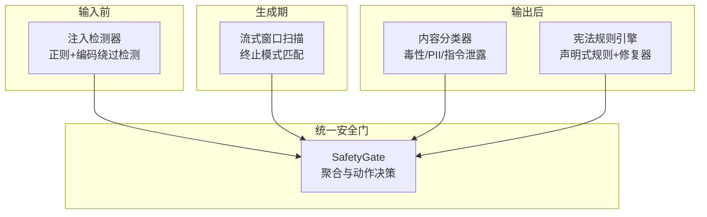
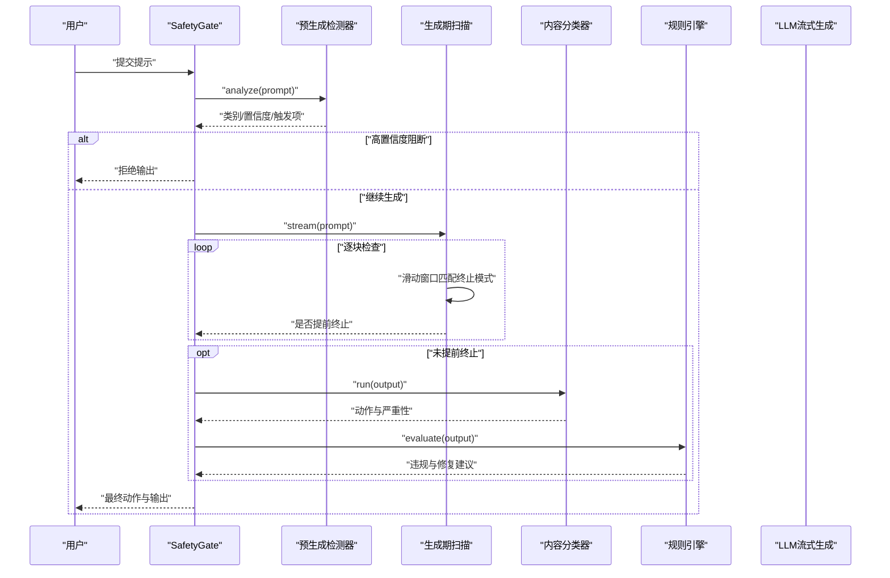
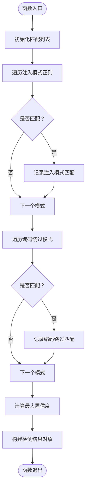
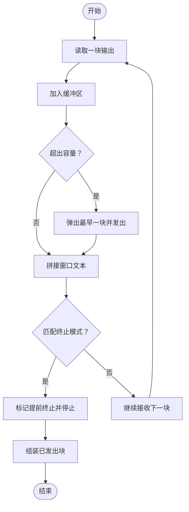
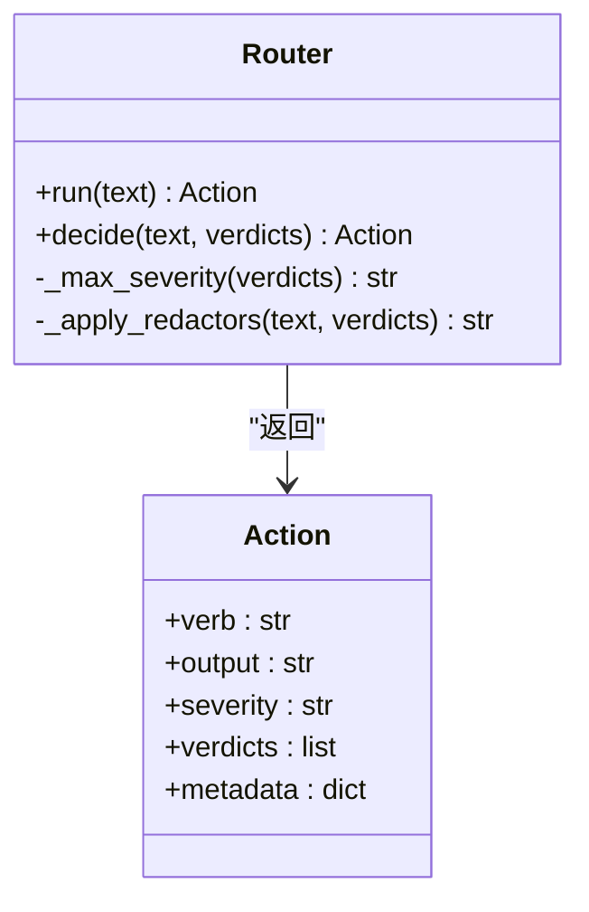
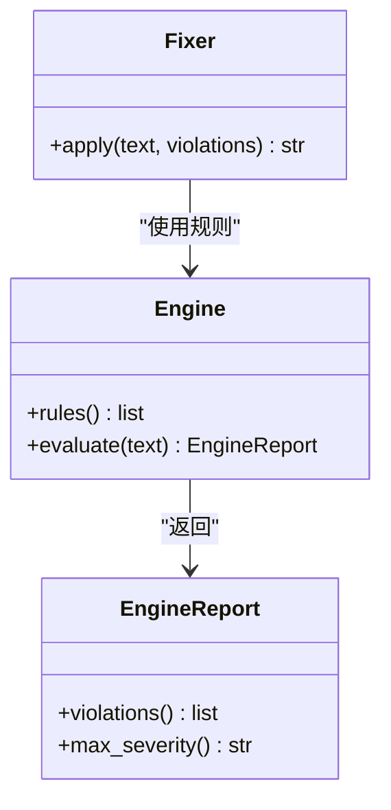
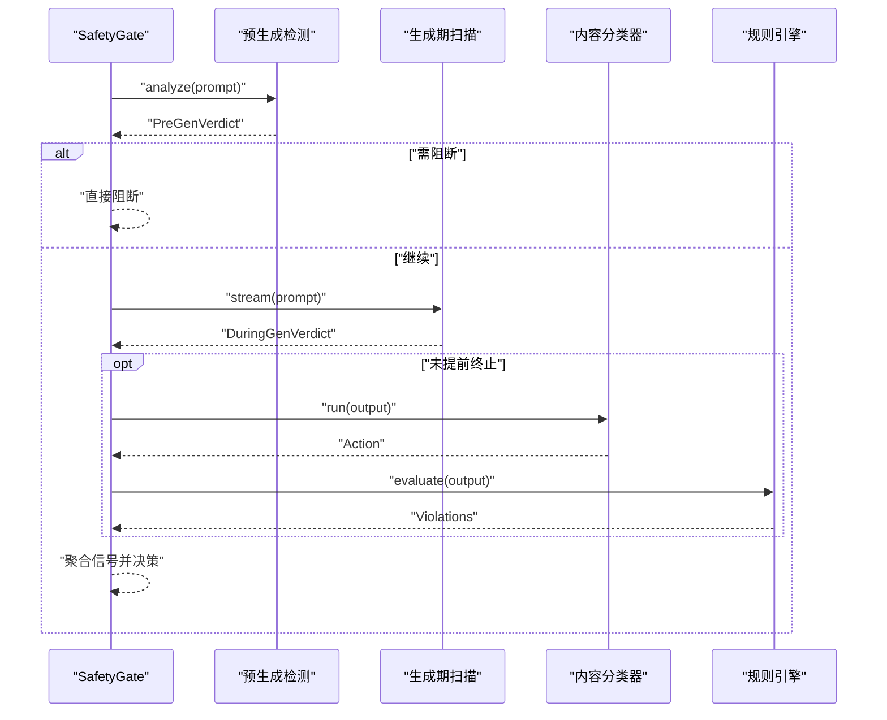
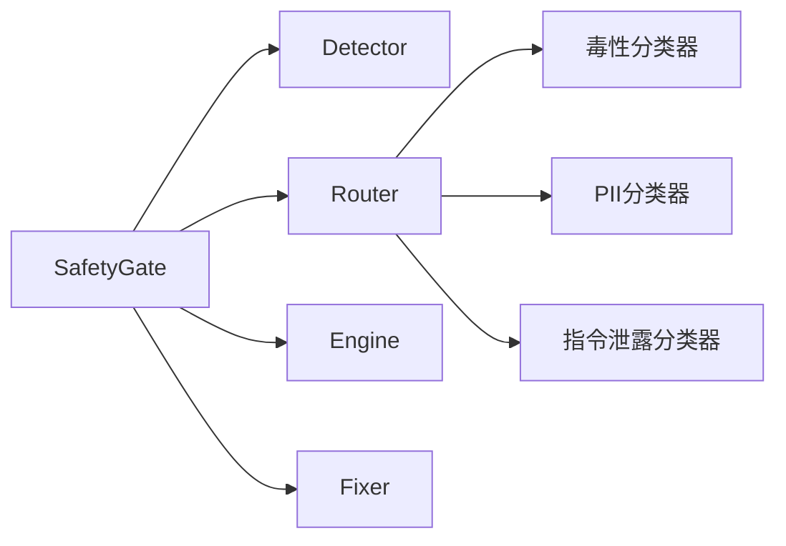

# 间接提示注入

<cite>
**本文引用的文件**
- [guardrails-sandbox/backend/adapters/injection.py](file://guardrails-sandbox/backend/adapters/injection.py)
- [phases/19-capstone-projects/83-prompt-injection-detector/code/main.py](file://phases/19-capstone-projects/83-prompt-injection-detector/code/main.py)
- [phases/19-capstone-projects/85-content-classifier-integration/code/main.py](file://phases/19-capstone-projects/85-content-classifier-integration/code/main.py)
- [phases/19-capstone-projects/86-constitutional-rules-engine/code/main.py](file://phases/19-capstone-projects/86-constitutional-rules-engine/code/main.py)
- [phases/19-capstone-projects/87-end-to-end-safety-gate/code/safety_gate.py](file://phases/19-capstone-projects/87-end-to-end-safety-gate/code/safety_gate.py)
- [phases/19-capstone-projects/87-end-to-end-safety-gate/code/tests.py](file://phases/19-capstone-projects/87-end-to-end-safety-gate/code/tests.py)
- [phases/15-autonomous-systems/11-browser-agents/code/main.py](file://phases/15-autonomous-systems/11-browser-agents/code/main.py)
</cite>

## 目录
1. [引言](#引言)
2. [项目结构](#项目结构)
3. [核心组件](#核心组件)
4. [架构总览](#架构总览)
5. [详细组件分析](#详细组件分析)
6. [依赖分析](#依赖分析)
7. [性能考虑](#性能考虑)
8. [故障排查指南](#故障排查指南)
9. [结论](#结论)
10. [附录](#附录)

## 引言
本文件围绕“间接提示注入”这一隐蔽攻击方式进行系统化解析，重点阐述其与直接注入攻击的区别、在复杂系统中的潜在风险与危害，并结合仓库中的安全组件给出可落地的检测与防御策略。间接注入通过非直接的上下文或外部来源（如页面片段、URL 参数、工具调用参数等）对模型行为产生影响，具有更强的隐蔽性和绕过能力，因此需要在输入、生成过程与输出阶段进行多层防护。

## 项目结构
该代码库在多个阶段提供了针对提示注入与安全门的整体解决方案，包括：
- 输入前检测：基于正则与规范化处理的注入检测器
- 生成期监控：流式窗口扫描终止模式
- 输出后过滤：内容分类器与宪法式规则引擎
- 端到端安全门：统一聚合与动作决策

图表来源
- [guardrails-sandbox/backend/adapters/injection.py:44-87](file://guardrails-sandbox/backend/adapters/injection.py#L44-L87)
- [phases/19-capstone-projects/83-prompt-injection-detector/code/main.py:123-159](file://phases/19-capstone-projects/83-prompt-injection-detector/code/main.py#L123-L159)
- [phases/19-capstone-projects/85-content-classifier-integration/code/main.py:42-82](file://phases/19-capstone-projects/85-content-classifier-integration/code/main.py#L42-L82)
- [phases/19-capstone-projects/86-constitutional-rules-engine/code/main.py:125-171](file://phases/19-capstone-projects/86-constitutional-rules-engine/code/main.py#L125-L171)
- [phases/19-capstone-projects/87-end-to-end-safety-gate/code/safety_gate.py:104-233](file://phases/19-capstone-projects/87-end-to-end-safety-gate/code/safety_gate.py#L104-L233)

章节来源
- [phases/19-capstone-projects/87-end-to-end-safety-gate/code/safety_gate.py:1-247](file://phases/19-capstone-projects/87-end-to-end-safety-gate/code/safety_gate.py#L1-L247)

## 核心组件
- 注入检测器（输入前）
  - 使用预置的注入模式与编码绕过模式进行正则匹配，返回类别、置信度与触发项列表
  - 支持中英文注入模式，包含常见越狱关键词、指令覆盖、系统提示暴露等
- 流式窗口扫描（生成期）
  - 在模型流式生成过程中，以滑动窗口匹配典型前缀攻击模式，必要时提前终止并截断输出
- 内容分类器（输出后）
  - 对输出执行毒性、PII、指令泄露三类分类，按最高严重性选择动作（阻断/清洗/警告/记录）
- 宪法规则引擎（输出后）
  - 基于 YAML 的声明式规则集，支持谓词组合、正则匹配、字数约束等；可对违规文本进行自动修复
- 安全门（统一聚合）
  - 将上述模块串联，定义阈值与聚合规则，输出最终动作与可追踪轨迹

章节来源
- [guardrails-sandbox/backend/adapters/injection.py:7-41](file://guardrails-sandbox/backend/adapters/injection.py#L7-L41)
- [phases/19-capstone-projects/83-prompt-injection-detector/code/main.py:123-159](file://phases/19-capstone-projects/83-prompt-injection-detector/code/main.py#L123-L159)
- [phases/19-capstone-projects/85-content-classifier-integration/code/main.py:42-82](file://phases/19-capstone-projects/85-content-classifier-integration/code/main.py#L42-L82)
- [phases/19-capstone-projects/86-constitutional-rules-engine/code/main.py:125-171](file://phases/19-capstone-projects/86-constitutional-rules-engine/code/main.py#L125-L171)
- [phases/19-capstone-projects/87-end-to-end-safety-gate/code/safety_gate.py:104-233](file://phases/19-capstone-projects/87-end-to-end-safety-gate/code/safety_gate.py#L104-L233)

## 架构总览
下图展示了从请求进入至最终响应的完整路径，以及各组件之间的交互关系与数据流向。

图表来源
- [phases/19-capstone-projects/87-end-to-end-safety-gate/code/safety_gate.py:117-233](file://phases/19-capstone-projects/87-end-to-end-safety-gate/code/safety_gate.py#L117-L233)
- [phases/19-capstone-projects/85-content-classifier-integration/code/main.py:60-82](file://phases/19-capstone-projects/85-content-classifier-integration/code/main.py#L60-L82)
- [phases/19-capstone-projects/86-constitutional-rules-engine/code/main.py:144-171](file://phases/19-capstone-projects/86-constitutional-rules-engine/code/main.py#L144-L171)

## 详细组件分析

### 组件A：注入检测器（输入前）
- 实现要点
  - 预置注入模式与编码绕过模式，分别计算最大置信度
  - 返回检测结果对象，包含匹配详情、最大置信度与匹配数量
- 复杂度与性能
  - 正则匹配线性于文本长度与模式数量，整体近似 O(N·M)
  - 增加编码解码步骤会带来额外开销，但通过短文本与有限模式控制在可接受范围
- 错误处理
  - 正则编译失败或解码异常会被捕获并跳过对应规则，保证鲁棒性

图表来源
- [guardrails-sandbox/backend/adapters/injection.py:53-87](file://guardrails-sandbox/backend/adapters/injection.py#L53-L87)

章节来源
- [guardrails-sandbox/backend/adapters/injection.py:7-41](file://guardrails-sandbox/backend/adapters/injection.py#L7-L41)
- [guardrails-sandbox/backend/adapters/injection.py:53-87](file://guardrails-sandbox/backend/adapters/injection.py#L53-L87)

### 组件B：流式窗口扫描（生成期）
- 实现要点
  - 以滑动窗口匹配典型前缀攻击模式，一旦命中即提前终止并截断输出
  - 通过缓冲区控制输出块数量，避免过早截断
- 复杂度与性能
  - 每块时间近似 O(W·P)，W 为窗口大小，P 为终止模式数量
  - 适合流式场景，延迟可控

图表来源
- [phases/19-capstone-projects/87-end-to-end-safety-gate/code/safety_gate.py:121-145](file://phases/19-capstone-projects/87-end-to-end-safety-gate/code/safety_gate.py#L121-L145)

章节来源
- [phases/19-capstone-projects/87-end-to-end-safety-gate/code/safety_gate.py:60-65](file://phases/19-capstone-projects/87-end-to-end-safety-gate/code/safety_gate.py#L60-L65)
- [phases/19-capstone-projects/87-end-to-end-safety-gate/code/safety_gate.py:121-145](file://phases/19-capstone-projects/87-end-to-end-safety-gate/code/safety_gate.py#L121-L145)

### 组件C：内容分类器（输出后）
- 实现要点
  - 并行运行三类分类器，取最高严重性决定动作
  - 支持对输出进行清洗后再决策
- 复杂度与性能
  - 分类器数量固定，整体近似 O(K·N)，K 为分类器数量

图表来源
- [phases/19-capstone-projects/85-content-classifier-integration/code/main.py:42-82](file://phases/19-capstone-projects/85-content-classifier-integration/code/main.py#L42-L82)

章节来源
- [phases/19-capstone-projects/85-content-classifier-integration/code/main.py:42-82](file://phases/19-capstone-projects/85-content-classifier-integration/code/main.py#L42-L82)

### 组件D：宪法规则引擎（输出后）
- 实现要点
  - 规则以 YAML 声明，支持谓词组合与正则匹配
  - 可对违规文本应用修复器进行自动修正
- 复杂度与性能
  - 规则数量有限，评估近似 O(R·N)

图表来源
- [phases/19-capstone-projects/86-constitutional-rules-engine/code/main.py:125-171](file://phases/19-capstone-projects/86-constitutional-rules-engine/code/main.py#L125-L171)
- [phases/19-capstone-projects/86-constitutional-rules-engine/code/main.py:174-198](file://phases/19-capstone-projects/86-constitutional-rules-engine/code/main.py#L174-L198)

章节来源
- [phases/19-capstone-projects/86-constitutional-rules-engine/code/main.py:125-171](file://phases/19-capstone-projects/86-constitutional-rules-engine/code/main.py#L125-L171)
- [phases/19-capstone-projects/86-constitutional-rules-engine/code/main.py:174-198](file://phases/19-capstone-projects/86-constitutional-rules-engine/code/main.py#L174-L198)

### 组件E：安全门（统一聚合）
- 实现要点
  - 聚合输入前、生成期、输出后的信号，按严重性等级映射为允许/警告/清洗/阻断
  - 提供可序列化的请求轨迹，便于审计与回放
- 复杂度与性能
  - 聚合逻辑常量级，整体延迟由上游组件主导

图表来源
- [phases/19-capstone-projects/87-end-to-end-safety-gate/code/safety_gate.py:158-182](file://phases/19-capstone-projects/87-end-to-end-safety-gate/code/safety_gate.py#L158-L182)
- [phases/19-capstone-projects/87-end-to-end-safety-gate/code/safety_gate.py:184-197](file://phases/19-capstone-projects/87-end-to-end-safety-gate/code/safety_gate.py#L184-L197)
- [phases/19-capstone-projects/87-end-to-end-safety-gate/code/safety_gate.py:199-233](file://phases/19-capstone-projects/87-end-to-end-safety-gate/code/safety_gate.py#L199-L233)

章节来源
- [phases/19-capstone-projects/87-end-to-end-safety-gate/code/safety_gate.py:104-233](file://phases/19-capstone-projects/87-end-to-end-safety-gate/code/safety_gate.py#L104-L233)

## 依赖分析
- 组件耦合
  - SafetyGate 组合了 Detector、Router、Engine/Fixer，形成强内聚的统一安全门
  - 各子模块职责清晰：输入前检测、生成期监控、输出后过滤与修复
- 外部依赖
  - 正则表达式、字符串规范化、JSON 序列化等标准库
- 潜在循环依赖
  - 当前模块间为单向依赖，无明显循环

图表来源
- [phases/19-capstone-projects/87-end-to-end-safety-gate/code/safety_gate.py:46-53](file://phases/19-capstone-projects/87-end-to-end-safety-gate/code/safety_gate.py#L46-L53)
- [phases/19-capstone-projects/85-content-classifier-integration/code/main.py:42-44](file://phases/19-capstone-projects/85-content-classifier-integration/code/main.py#L42-L44)

章节来源
- [phases/19-capstone-projects/87-end-to-end-safety-gate/code/safety_gate.py:46-53](file://phases/19-capstone-projects/87-end-to-end-safety-gate/code/safety_gate.py#L46-L53)

## 性能考虑
- 正则匹配成本
  - 模式数量有限且文本较短，正则匹配通常在毫秒级完成
- 编码解码开销
  - Base64/Hex/Rot13 解码仅在规范化阶段执行，频率低，影响可忽略
- 流式扫描
  - 窗口大小与终止模式数量可控，提前终止可显著降低生成成本
- 聚合与序列化
  - 聚合逻辑常量级，轨迹序列化开销小

## 故障排查指南
- 常见问题
  - 误报/漏报：调整置信度阈值或扩展注入模式
  - 过度清洗：降低严重性阈值或优化修复器策略
  - 生成被提前终止：检查终止模式是否过于宽泛
- 排查步骤
  - 查看 RequestTrace 中 pre_gen、during_gen、post_gen 的详细信息
  - 根据 fired 列表定位具体触发规则
  - 使用单元测试验证边界情况

章节来源
- [phases/19-capstone-projects/87-end-to-end-safety-gate/code/tests.py:27-81](file://phases/19-capstone-projects/87-end-to-end-safety-gate/code/tests.py#L27-L81)
- [phases/19-capstone-projects/87-end-to-end-safety-gate/code/safety_gate.py:236-246](file://phases/19-capstone-projects/87-end-to-end-safety-gate/code/safety_gate.py#L236-L246)

## 结论
间接提示注入通过非直接上下文或外部来源影响模型行为，具备更强的隐蔽性与绕过能力。本方案通过“输入前检测—生成期监控—输出后过滤与修复”的三层防护，结合统一的安全门聚合机制，能够有效降低间接注入带来的风险。实际部署中应持续迭代注入模式、优化阈值与修复策略，并配合日志与审计实现闭环治理。

## 附录

### 间接注入与直接注入的区别与优势
- 直接注入
  - 显式覆盖系统提示或指令，易被正则与上下文隔离检测
- 间接注入
  - 通过页面片段、URL 参数、工具调用参数等间接渠道进入上下文，绕过显式规则
  - 更难被传统检测覆盖，需要多层纵深防御

章节来源
- [phases/15-autonomous-systems/11-browser-agents/code/main.py:1-168](file://phases/15-autonomous-systems/11-browser-agents/code/main.py#L1-L168)

### 攻击实现方法与检测防御策略
- 攻击实现
  - 页面可见文本注入：在页面中嵌入越狱指令
  - URL 片段注入：利用 URL 片段作为隐藏上下文
  - 工具调用参数注入：在外部工具参数中携带恶意指令
- 检测与防御
  - 输入前：注入检测器（正则+编码绕过）
  - 生成期：流式窗口扫描终止模式
  - 输出后：内容分类器与宪法规则引擎
  - 安全门：统一聚合与动作决策

章节来源
- [guardrails-sandbox/backend/adapters/injection.py:53-87](file://guardrails-sandbox/backend/adapters/injection.py#L53-L87)
- [phases/19-capstone-projects/83-prompt-injection-detector/code/main.py:137-159](file://phases/19-capstone-projects/83-prompt-injection-detector/code/main.py#L137-L159)
- [phases/19-capstone-projects/87-end-to-end-safety-gate/code/safety_gate.py:117-145](file://phases/19-capstone-projects/87-end-to-end-safety-gate/code/safety_gate.py#L117-L145)
- [phases/19-capstone-projects/85-content-classifier-integration/code/main.py:60-82](file://phases/19-capstone-projects/85-content-classifier-integration/code/main.py#L60-L82)
- [phases/19-capstone-projects/86-constitutional-rules-engine/code/main.py:144-171](file://phases/19-capstone-projects/86-constitutional-rules-engine/code/main.py#L144-L171)

### 复杂系统中的潜在风险与危害
- 供应链污染：工具或数据源被植入恶意参数
- 权限提升：通过外部上下文诱导模型执行敏感操作
- 数据泄露：指令泄露与 PII 泄露叠加放大风险
- 行为漂移：长期累积的间接注入可能导致模型行为偏离预期

章节来源
- [phases/19-capstone-projects/85-content-classifier-integration/code/main.py:33-40](file://phases/19-capstone-projects/85-content-classifier-integration/code/main.py#L33-L40)
- [phases/19-capstone-projects/86-constitutional-rules-engine/code/main.py:30-45](file://phases/19-capstone-projects/86-constitutional-rules-engine/code/main.py#L30-L45)