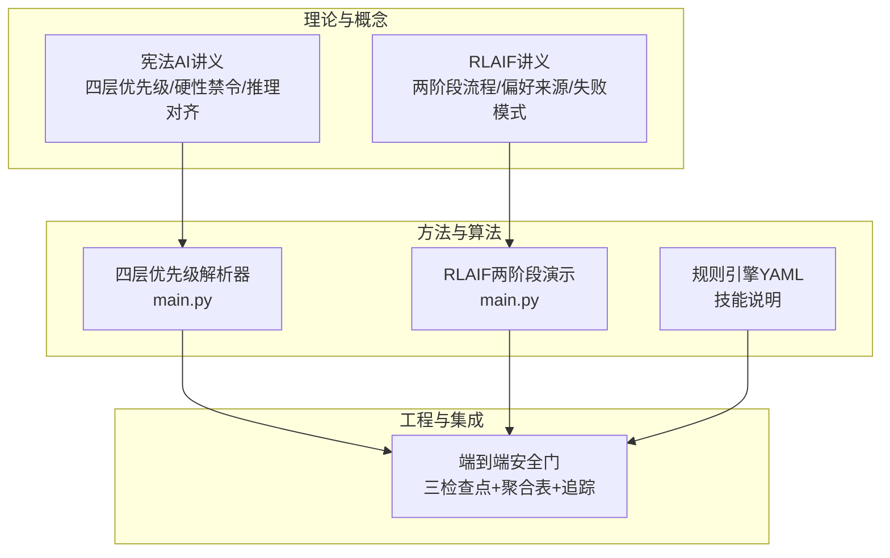
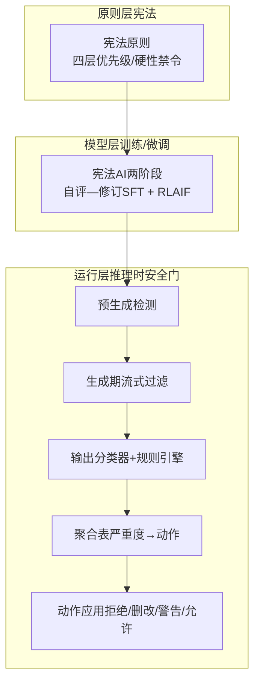
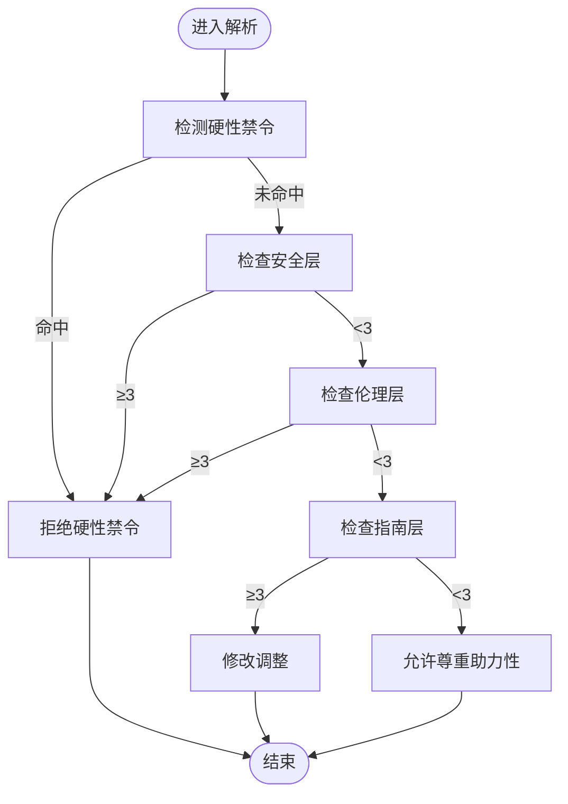
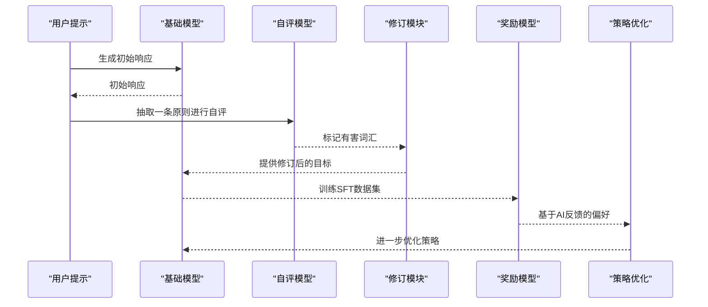
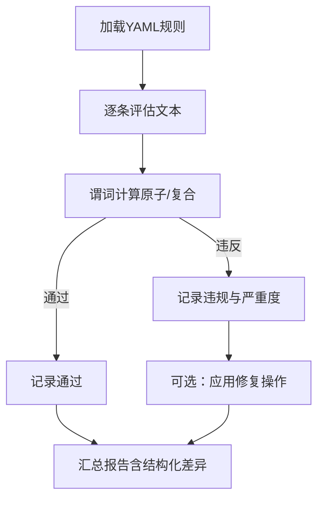
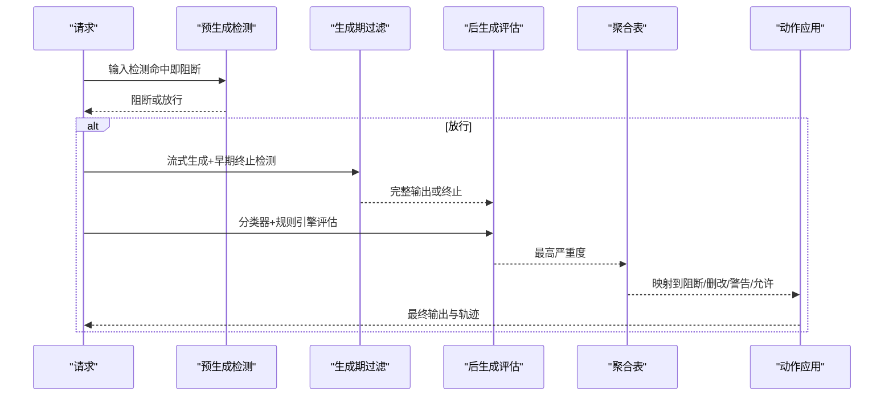
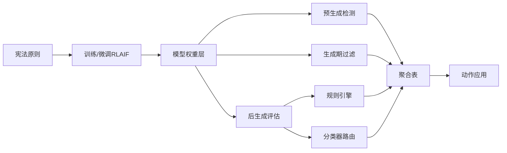

# 宪法AI与RLAIF

<cite>
**本文引用的文件**
- [phases/15-autonomous-systems/17-constitutional-ai/docs/en.md](file://phases/15-autonomous-systems/17-constitutional-ai/docs/en.md)
- [phases/15-autonomous-systems/17-constitutional-ai/code/main.py](file://phases/15-autonomous-systems/17-constitutional-ai/code/main.py)
- [phases/18-ethics-safety-alignment/05-constitutional-ai-rlaif/docs/en.md](file://phases/18-ethics-safety-alignment/05-constitutional-ai-rlaif/docs/en.md)
- [phases/18-ethics-safety-alignment/05-constitutional-ai-rlaif/code/main.py](file://phases/18-ethics-safety-alignment/05-constitutional-ai-rlaif/code/main.py)
- [phases/19-capstone-projects/86-constitutional-rules-engine/outputs/skill-constitutional-rules-engine.md](file://phases/19-capstone-projects/86-constitutional-rules-engine/outputs/skill-constitutional-rules-engine.md)
- [phases/19-capstone-projects/87-end-to-end-safety-gate/outputs/skill-end-to-end-safety-gate.md](file://phases/19-capstone-projects/87-end-to-end-safety-gate/outputs/skill-end-to-end-safety-gate.md)
- [site/figures-agents-alignment.js](file://site/figures-agents-alignment.js)
- [site/data.js](file://site/data.js)
</cite>

## 目录
1. [引言](#引言)
2. [项目结构](#项目结构)
3. [核心组件](#核心组件)
4. [架构总览](#架构总览)
5. [详细组件分析](#详细组件分析)
6. [依赖关系分析](#依赖关系分析)
7. [性能考量](#性能考量)
8. [故障排查指南](#故障排查指南)
9. [结论](#结论)
10. [附录](#附录)

## 引言
本文件围绕“宪法AI”与“基于规则的强化学习（RLAIF）”两大主题，结合仓库中的课程讲义、代码示例与端到端安全门能力说明，系统化梳理理念、架构与实现要点，并给出可操作的工程化路径。重点包括：
- 宪法AI：以原则为中心的对齐范式，四层优先级与硬性禁令的组合；以及从规则驱动向推理驱动演进的治理思路。
- RLAIF：以模型自生成偏好信号进行强化学习的训练范式，强调“可解释偏好来源”和“可审计的失败模式转移”。

同时，文档还展示了如何在复杂决策场景中构建具备宪法约束的AI系统，并与传统对齐方法进行对比。

## 项目结构
本仓库将“宪法AI与RLAIF”的知识与实践拆分为三个层次：
- 理论与概念层：课程讲义与术语定义，阐明宪法原则、四层优先级、硬性禁令与推理对齐的边界。
- 方法与算法层：RLAIF两阶段流程（自评—修订SFT + 基于AI反馈的强化），以及四层优先级解析器。
- 工程与集成层：规则引擎（声明式YAML规则）、端到端安全门（三检查点流水线），形成“输入检测—生成期过滤—输出分类与规则评估—聚合处置”的闭环。

图示来源
- [phases/15-autonomous-systems/17-constitutional-ai/docs/en.md:1-122](file://phases/15-autonomous-systems/17-constitutional-ai/docs/en.md#L1-L122)
- [phases/18-ethics-safety-alignment/05-constitutional-ai-rlaif/docs/en.md:1-113](file://phases/18-ethics-safety-alignment/05-constitutional-ai-rlaif/docs/en.md#L1-L113)
- [phases/15-autonomous-systems/17-constitutional-ai/code/main.py:1-118](file://phases/15-autonomous-systems/17-constitutional-ai/code/main.py#L1-L118)
- [phases/18-ethics-safety-alignment/05-constitutional-ai-rlaif/code/main.py:1-178](file://phases/18-ethics-safety-alignment/05-constitutional-ai-rlaif/code/main.py#L1-L178)
- [phases/19-capstone-projects/86-constitutional-rules-engine/outputs/skill-constitutional-rules-engine.md:1-41](file://phases/19-capstone-projects/86-constitutional-rules-engine/outputs/skill-constitutional-rules-engine.md#L1-L41)
- [phases/19-capstone-projects/87-end-to-end-safety-gate/outputs/skill-end-to-end-safety-gate.md:1-48](file://phases/19-capstone-projects/87-end-to-end-safety-gate/outputs/skill-end-to-end-safety-gate.md#L1-L48)

章节来源
- [phases/15-autonomous-systems/17-constitutional-ai/docs/en.md:1-122](file://phases/15-autonomous-systems/17-constitutional-ai/docs/en.md#L1-L122)
- [phases/18-ethics-safety-alignment/05-constitutional-ai-rlaif/docs/en.md:1-113](file://phases/18-ethics-safety-alignment/05-constitutional-ai-rlaif/docs/en.md#L1-L113)
- [phases/19-capstone-projects/86-constitutional-rules-engine/outputs/skill-constitutional-rules-engine.md:1-41](file://phases/19-capstone-projects/86-constitutional-rules-engine/outputs/skill-constitutional-rules-engine.md#L1-L41)
- [phases/19-capstone-projects/87-end-to-end-safety-gate/outputs/skill-end-to-end-safety-gate.md:1-48](file://phases/19-capstone-projects/87-end-to-end-safety-gate/outputs/skill-end-to-end-safety-gate.md#L1-L48)

## 核心组件
- 四层优先级解析器：以“安全与人类监督支持 > 伦理 > 指南 > 助力性”为冲突解决准则，内置硬性禁令判定与软性默认调整空间。
- RLAIF两阶段演示：自评—修订SFT + 基于AI反馈的强化，强调偏好来源可读与失败模式变化。
- 规则引擎（YAML）：声明式规则（名称、严重度、适用条件、必须满足、解释、修复操作），支持结构化差异输出。
- 端到端安全门：预生成（输入检测）、生成期（流式令牌过滤）、后生成（输出分类器+规则引擎）三阶段，确定性聚合表与每请求追踪。

章节来源
- [phases/15-autonomous-systems/17-constitutional-ai/code/main.py:1-118](file://phases/15-autonomous-systems/17-constitutional-ai/code/main.py#L1-L118)
- [phases/18-ethics-safety-alignment/05-constitutional-ai-rlaif/code/main.py:1-178](file://phases/18-ethics-safety-alignment/05-constitutional-ai-rlaif/code/main.py#L1-L178)
- [phases/19-capstone-projects/86-constitutional-rules-engine/outputs/skill-constitutional-rules-engine.md:1-41](file://phases/19-capstone-projects/86-constitutional-rules-engine/outputs/skill-constitutional-rules-engine.md#L1-L41)
- [phases/19-capstone-projects/87-end-to-end-safety-gate/outputs/skill-end-to-end-safety-gate.md:1-48](file://phases/19-capstone-projects/87-end-to-end-safety-gate/outputs/skill-end-to-end-safety-gate.md#L1-L48)

## 架构总览
下图展示了从“宪法原则”到“运行时处置”的完整链路：原则层（宪法）位于模型权重层，运行层（安全门）负责在推理时执行检测、过滤与规则评估，并通过聚合表映射到最终动作。

图示来源
- [phases/15-autonomous-systems/17-constitutional-ai/docs/en.md:1-122](file://phases/15-autonomous-systems/17-constitutional-ai/docs/en.md#L1-L122)
- [phases/18-ethics-safety-alignment/05-constitutional-ai-rlaif/docs/en.md:1-113](file://phases/18-ethics-safety-alignment/05-constitutional-ai-rlaif/docs/en.md#L1-L113)
- [phases/19-capstone-projects/87-end-to-end-safety-gate/outputs/skill-end-to-end-safety-gate.md:1-48](file://phases/19-capstone-projects/87-end-to-end-safety-gate/outputs/skill-end-to-end-safety-gate.md#L1-L48)

## 详细组件分析

### 组件A：四层优先级解析器
该组件实现“硬性禁令优先 + 推理对齐”的冲突解决策略，核心逻辑如下：
- 硬性禁令检测：对动作文本进行子串匹配，命中即直接拒绝。
- 四层优先级：若未触发禁令，则按严重度阈值（≥3）逐层判定，高优先级胜出。
- 软性默认：在不触犯禁令的前提下，允许运营者在声明边界内调整默认行为。

图示来源
- [phases/15-autonomous-systems/17-constitutional-ai/code/main.py:42-67](file://phases/15-autonomous-systems/17-constitutional-ai/code/main.py#L42-L67)

章节来源
- [phases/15-autonomous-systems/17-constitutional-ai/code/main.py:1-118](file://phases/15-autonomous-systems/17-constitutional-ai/code/main.py#L1-L118)
- [phases/15-autonomous-systems/17-constitutional-ai/docs/en.md:1-122](file://phases/15-autonomous-systems/17-constitutional-ai/docs/en.md#L1-L122)

### 组件B：RLAIF两阶段演示
该演示模拟了“自评—修订SFT + 基于AI反馈的强化”流程，关键点：
- 自评—修订SFT：给定提示，模型生成响应；抽取一条原则进行自评，识别有害标记并替换为安全替代；以修订后的响应作为SFT目标。
- AI反馈强化：对两个补全计算偏好（基于有害标记率），训练奖励模型并用PPO优化。
- 可解释性：偏好来源可追溯至具体原则，优于人类标注的不透明性。

图示来源
- [phases/18-ethics-safety-alignment/05-constitutional-ai-rlaif/code/main.py:81-122](file://phases/18-ethics-safety-alignment/05-constitutional-ai-rlaif/code/main.py#L81-L122)

章节来源
- [phases/18-ethics-safety-alignment/05-constitutional-ai-rlaif/code/main.py:1-178](file://phases/18-ethics-safety-alignment/05-constitutional-ai-rlaif/code/main.py#L1-L178)
- [phases/18-ethics-safety-alignment/05-constitutional-ai-rlaif/docs/en.md:1-113](file://phases/18-ethics-safety-alignment/05-constitutional-ai-rlaif/docs/en.md#L1-L113)

### 组件C：规则引擎（YAML）
规则引擎以声明式方式表达输出约束，支持：
- 原子与复合谓词（包含/起止匹配、字数上下界、all_of/any_of/not_等）
- 修复操作（追加/前置、正则替换）
- 输出报告（每条规则的状态、最严重级别、结构化差异）

图示来源
- [phases/19-capstone-projects/86-constitutional-rules-engine/outputs/skill-constitutional-rules-engine.md:12-40](file://phases/19-capstone-projects/86-constitutional-rules-engine/outputs/skill-constitutional-rules-engine.md#L12-L40)

章节来源
- [phases/19-capstone-projects/86-constitutional-rules-engine/outputs/skill-constitutional-rules-engine.md:1-41](file://phases/19-capstone-projects/86-constitutional-rules-engine/outputs/skill-constitutional-rules-engine.md#L1-L41)

### 组件D：端到端安全门
安全门采用“三检查点”策略，贯穿预生成、生成期与后生成阶段，并通过确定性聚合表映射到最终动作，同时保留每请求的审计轨迹。

图示来源
- [phases/19-capstone-projects/87-end-to-end-safety-gate/outputs/skill-end-to-end-safety-gate.md:12-43](file://phases/19-capstone-projects/87-end-to-end-safety-gate/outputs/skill-end-to-end-safety-gate.md#L12-L43)

章节来源
- [phases/19-capstone-projects/87-end-to-end-safety-gate/outputs/skill-end-to-end-safety-gate.md:1-48](file://phases/19-capstone-projects/87-end-to-end-safety-gate/outputs/skill-end-to-end-safety-gate.md#L1-L48)

## 依赖关系分析
- 原则层与模型层：宪法原则指导训练/微调（RLAIF），使模型内部化原则；运行层安全门在推理时补充“可解释的即时约束”。
- 运行层内部：预生成检测、生成期过滤、后生成评估与规则引擎相互独立但串联，聚合表统一动作决策。
- 外部依赖：安全门的“分类器路由”“规则修复器”等模块在仓库中以技能形式存在，体现“组合即能力”的工程化思想。

图示来源
- [phases/15-autonomous-systems/17-constitutional-ai/docs/en.md:78-88](file://phases/15-autonomous-systems/17-constitutional-ai/docs/en.md#L78-L88)
- [phases/19-capstone-projects/87-end-to-end-safety-gate/outputs/skill-end-to-end-safety-gate.md:12-43](file://phases/19-capstone-projects/87-end-to-end-safety-gate/outputs/skill-end-to-end-safety-gate.md#L12-L43)

章节来源
- [site/figures-agents-alignment.js:366-391](file://site/figures-agents-alignment.js#L366-L391)
- [site/data.js:3081-4721](file://site/data.js#L3081-L4721)

## 性能考量
- 计算开销与可扩展性：规则引擎与安全门应尽量保持低延迟与可缓存；分类器路由与规则修复器需权衡准确率与吞吐。
- 严重度聚合：通过最高严重度映射到动作，避免多信号冗余计算；建议在生成期尽早终止以节省资源。
- 可解释性与可观测性：每请求轨迹便于回放与审计，有助于定位性能瓶颈与误判根因。

## 故障排查指南
- 硬性禁令误伤：确认禁令关键词匹配是否过宽；必要时引入专用检测器替代关键字列表。
- 软性默认越界：检查运营者调整是否超出声明边界；确保冲突时高优先级层仍有效。
- 生成期误杀：核对流式过滤阈值与模式集合；避免对合法但接近的表述过度敏感。
- 后生成误判：验证分类器路由与规则引擎的严重度评分一致性；必要时引入修复器自动纠偏。
- 聚合表异常：检查严重度来源与阈值设定；确保“高优先级优先”原则得到遵守。

章节来源
- [phases/15-autonomous-systems/17-constitutional-ai/code/main.py:42-67](file://phases/15-autonomous-systems/17-constitutional-ai/code/main.py#L42-L67)
- [phases/19-capstone-projects/87-end-to-end-safety-gate/outputs/skill-end-to-end-safety-gate.md:22-43](file://phases/19-capstone-projects/87-end-to-end-safety-gate/outputs/skill-end-to-end-safety-gate.md#L22-L43)

## 结论
宪法AI与RLAIF共同构成了“原则驱动 + 可解释偏好”的对齐体系：前者通过四层优先级与硬性禁令提供稳定边界，后者通过自评—修订与AI反馈强化提升泛化与可审计性。工程上，规则引擎与端到端安全门将抽象原则转化为可落地的运行时约束，适用于复杂决策场景下的安全与合规需求。

## 附录
- 术语对照与参考链接见各讲义末尾的进一步阅读部分。
- 项目站点中关于“安全门”“规则引擎”“宪法AI”等主题的可视化与索引可用于辅助教学与检索。