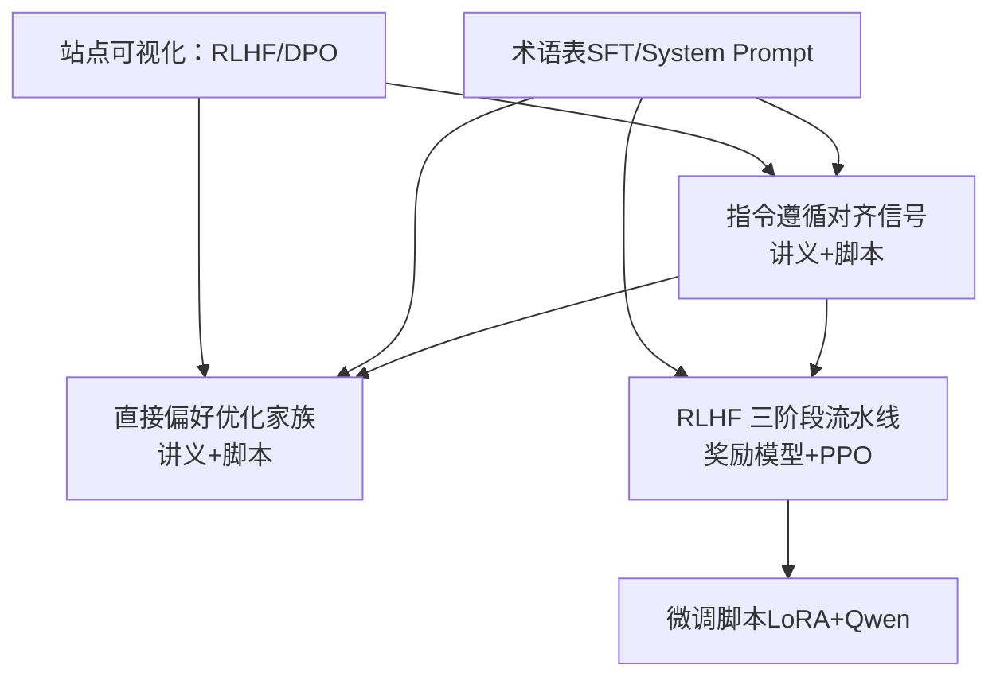
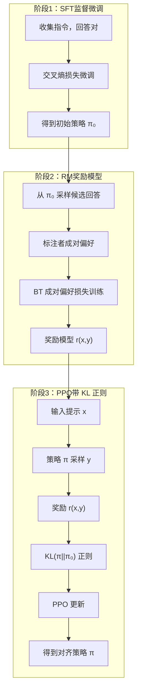
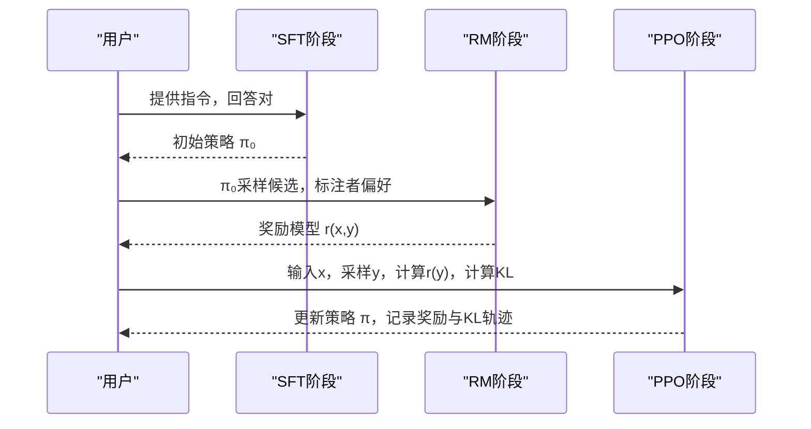
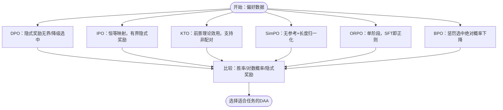
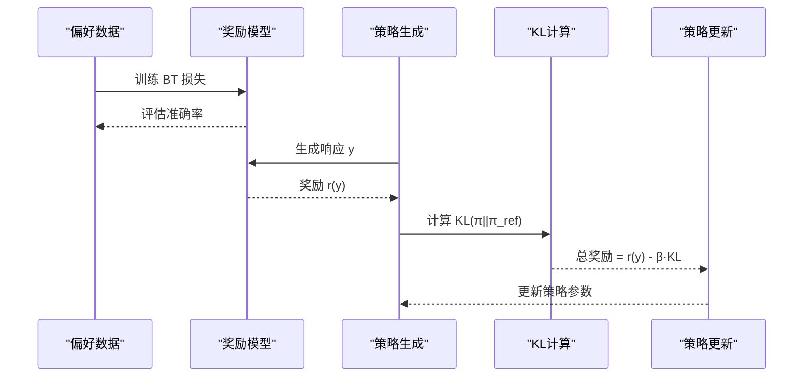
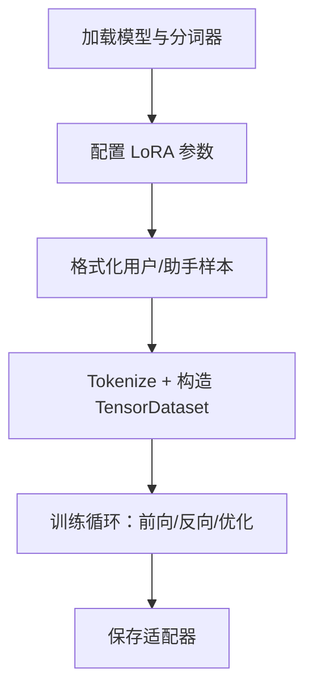
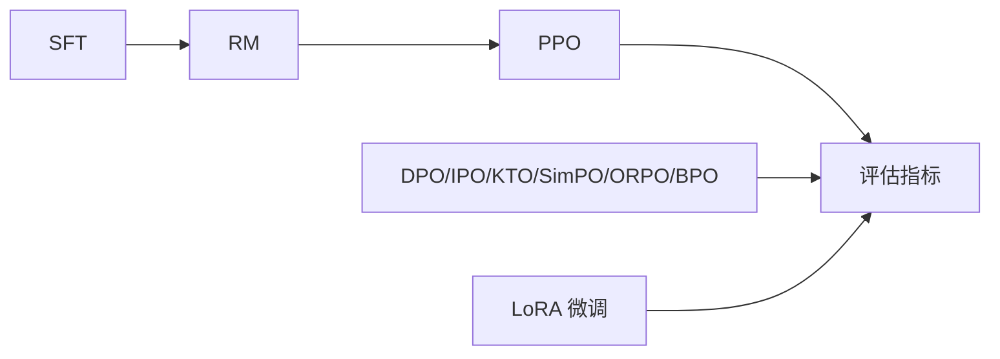

# 指令遵循对齐

<cite>
**本文引用的文件**
- [指令遵循对齐信号（中文）](file://phases/18-ethics-safety-alignment/01-instruction-following-alignment-signal/docs/zh.md)
- [指令遵循对齐信号（代码）](file://phases/18-ethics-safety-alignment/01-instruction-following-alignment-signal/code/main.py)
- [直接偏好优化家族（中文）](file://phases/18-ethics-safety-alignment/03-direct-preference-optimization-family/docs/zh.md)
- [RLHF 三阶段流水线（中文）](file://phases/10-llms-from-scratch/07-rlhf/code/main.py)
- [微调脚本（LoRA + Qwen）](file://finetune.py)
- [术语表（SFT、System Prompt）](file://glossary/terms.zh.md)
- [站点可视化：RLHF 流水线](file://site/figures-llms2.js)
- [站点可视化：DPO 边际损失](file://site/figures-agents-alignment.js)
</cite>

## 目录
1. [引言](#引言)
2. [项目结构](#项目结构)
3. [核心组件](#核心组件)
4. [架构总览](#架构总览)
5. [详细组件分析](#详细组件分析)
6. [依赖关系分析](#依赖关系分析)
7. [性能考量](#性能考量)
8. [故障排查指南](#故障排查指南)
9. [结论](#结论)
10. [附录](#附录)

## 引言
本文件围绕“指令遵循对齐”主题，系统梳理从理论到实践的关键路径：以 InstructGPT 的三阶段流水线（SFT → RM → PPO）为起点，解释“对齐信号”（人类偏好）如何驱动模型从“能写”走向“会听从指令”，并通过 KL 正则化抑制奖励破解；随后介绍直接对齐算法（DPO/IPO/KTO/SimPO/ORPO/BPO）如何在去除显式奖励模型的同时，仍需面对“过度优化”的普遍挑战。文档同时给出可复现的代码示例与评估方法，帮助读者在工程实践中设计与训练具备强指令遵循能力的模型。

## 项目结构
本仓库与“指令遵循对齐”相关的核心位置如下：
- 指令遵循对齐信号：包含中文讲义与最小可运行的三阶段演示脚本，直观展示奖励上升、KL 增长与策略漂移，以及关闭 KL 后的奖励破解现象。
- 直接偏好优化家族：系统对比 DPO 及其变体（IPO/KTO/SimPO/ORPO/BPO），指出各自的修复点与失败模式。
- RLHF 三阶段流水线：在更完整的语言模型框架中训练奖励模型与执行 PPO，便于工程落地。
- 微调脚本：演示在真实大模型（Qwen）上使用 LoRA 进行指令跟随微调的完整流程。
- 术语表：明确 SFT、System Prompt 等关键概念，避免歧义。
- 站点可视化：提供 RLHF、DPO 等流程与损失曲面的交互式图示，辅助教学与理解。

**图表来源**
- [指令遵循对齐信号（中文）](file://phases/18-ethics-safety-alignment/01-instruction-following-alignment-signal/docs/zh.md)
- [直接偏好优化家族（中文）](file://phases/18-ethics-safety-alignment/03-direct-preference-optimization-family/docs/zh.md)
- [RLHF 三阶段流水线（中文）](file://phases/10-llms-from-scratch/07-rlhf/code/main.py)
- [微调脚本（LoRA + Qwen）](file://finetune.py)
- [术语表（SFT、System Prompt）](file://glossary/terms.zh.md)
- [站点可视化：RLHF 流水线](file://site/figures-llms2.js)
- [站点可视化：DPO 边际损失](file://site/figures-agents-alignment.js)

**章节来源**
- [指令遵循对齐信号（中文）](file://phases/18-ethics-safety-alignment/01-instruction-following-alignment-signal/docs/zh.md)
- [指令遵循对齐信号（代码）](file://phases/18-ethics-safety-alignment/01-instruction-following-alignment-signal/code/main.py)
- [直接偏好优化家族（中文）](file://phases/18-ethics-safety-alignment/03-direct-preference-optimization-family/docs/zh.md)
- [RLHF 三阶段流水线（中文）](file://phases/10-llms-from-scratch/07-rlhf/code/main.py)
- [微调脚本（LoRA + Qwen）](file://finetune.py)
- [术语表（SFT、System Prompt）](file://glossary/terms.zh.md)
- [站点可视化：RLHF 流水线](file://site/figures-llms2.js)
- [站点可视化：DPO 边际损失](file://site/figures-agents-alignment.js)

## 核心组件
- 指令遵循对齐信号（InstructGPT 三阶段）
  - SFT：在（指令，回答）对上进行最大似然微调，使模型学会“按指令生成回答”。
  - RM：基于人类偏好对（指令，回答）打分，形成奖励模型。
  - PPO（带 KL 正则）：最大化奖励并限制与 SFT 策略的距离，避免奖励破解。
- 直接偏好优化家族（DAA）
  - DPO：从 RLHF 最优解推导出的偏好损失，跳过显式奖励模型。
  - IPO/KTO/SimPO/ORPO/BPO：分别修复 DPO 的“隐式奖励无界”“降级选中”“长度偏差”“单阶段需求”等问题。
- 工程实现与评估
  - RLHF 完整流水线：奖励模型训练 + PPO 优化 + KL 分析。
  - LoRA 微调：在真实大模型上快速、低成本地实现指令跟随。
  - 可视化：RLHF/PPO/DPO 的流程与损失曲面，帮助理解对齐过程。

**章节来源**
- [指令遵循对齐信号（中文）](file://phases/18-ethics-safety-alignment/01-instruction-following-alignment-signal/docs/zh.md)
- [直接偏好优化家族（中文）](file://phases/18-ethics-safety-alignment/03-direct-preference-optimization-family/docs/zh.md)
- [RLHF 三阶段流水线（中文）](file://phases/10-llms-from-scratch/07-rlhf/code/main.py)
- [微调脚本（LoRA + Qwen）](file://finetune.py)

## 架构总览
下图展示了 InstructGPT 的三阶段流水线：SFT → RM → PPO，以及站点可视化中对 RLHF 的流程化呈现。

**图表来源**
- [指令遵循对齐信号（中文）](file://phases/18-ethics-safety-alignment/01-instruction-following-alignment-signal/docs/zh.md)
- [RLHF 三阶段流水线（中文）](file://phases/10-llms-from-scratch/07-rlhf/code/main.py)
- [站点可视化：RLHF 流水线](file://site/figures-llms2.js)

## 详细组件分析

### 组件A：最小可运行的 InstructGPT 三阶段演示
- 设计要点
  - 策略：三动作带偏的 softmax 策略，便于可视化奖励、KL 与策略漂移。
  - SFT：从标注者偏好中最大似然估计目标分布。
  - RM：基于标注者偏好训练 BT 成对偏好损失的奖励模型。
  - PPO：带 KL 正则的策略梯度更新，对比 beta=0.1 与 beta=0.0 的效果。
- 关键流程
  - 运行脚本，观察奖励曲线、KL 散度与最终策略分布。
  - 关闭 KL 正则（beta=0.0），观察奖励破解现象。
  - 注入奖励模型偏差，验证 KL 正则的抑制作用。
- 评估指标
  - 最终奖励、最终 KL、策略与标注者偏好的一致性。

**图表来源**
- [指令遵循对齐信号（代码）](file://phases/18-ethics-safety-alignment/01-instruction-following-alignment-signal/code/main.py)

**章节来源**
- [指令遵循对齐信号（代码）](file://phases/18-ethics-safety-alignment/01-instruction-following-alignment-signal/code/main.py)
- [指令遵循对齐信号（中文）](file://phases/18-ethics-safety-alignment/01-instruction-following-alignment-signal/docs/zh.md)

### 组件B：直接偏好优化家族（DAA）
- 理论基础
  - 从 RLHF 最优解出发，消去奖励模型，得到仅依赖策略参数的偏好损失（DPO）。
  - 针对 DPO 的失败模式，提出 IPO（有界隐式奖励）、KTO（前景理论效用）、SimPO（无参考+长度归一化）、ORPO（单阶段）、BPO（保留选中）等变体。
- 关键流程
  - 在相同偏好数据上训练多种损失，比较选中对数概率漂移、隐式奖励分布与最终胜率。
- 评估指标
  - 选中对数概率变化、隐式奖励差距、长度偏差影响、单阶段可行性。

**图表来源**
- [直接偏好优化家族（中文）](file://phases/18-ethics-safety-alignment/03-direct-preference-optimization-family/docs/zh.md)

**章节来源**
- [直接偏好优化家族（中文）](file://phases/18-ethics-safety-alignment/03-direct-preference-optimization-family/docs/zh.md)

### 组件C：RLHF 完整流水线（奖励模型 + PPO）
- 设计要点
  - 奖励模型：基于 Transformer 的标量奖励头，使用 BT 损失训练。
  - PPO：在生成响应上计算奖励与 KL，联合更新策略。
  - 模型拷贝：将 SFT 权重复制到参考模型，保证 KL 正则稳定。
- 关键流程
  - 训练奖励模型并评估偏好预测准确率。
  - 使用奖励模型指导策略更新，记录奖励与 KL 轨迹。
  - 对比 SFT 与 RLHF 的平均奖励得分。
- 评估指标
  - 奖励模型准确率、平均奖励、KL 分析阈值判断策略漂移。

**图表来源**
- [RLHF 三阶段流水线（中文）](file://phases/10-llms-from-scratch/07-rlhf/code/main.py)

**章节来源**
- [RLHF 三阶段流水线（中文）](file://phases/10-llms-from-scratch/07-rlhf/code/main.py)

### 组件D：微调脚本（LoRA + Qwen）
- 设计要点
  - 加载大模型与分词器，启用 LoRA 参数高效微调。
  - 将（用户：指令，助手：回答）格式化为训练样本，使用交叉熵损失训练。
  - 保存适配器权重，便于部署与复用。
- 关键流程
  - 数据准备 → Tokenize → 训练循环（前向/反向/优化）→ 保存适配器。
- 评估指标
  - 训练损失随轮次收敛情况。

**图表来源**
- [微调脚本（LoRA + Qwen）](file://finetune.py)

**章节来源**
- [微调脚本（LoRA + Qwen）](file://finetune.py)

### 概念补充：SFT 与 System Prompt
- SFT（监督微调）：在（指令，回答）对上微调，使模型从“续写”转为“回答”。
- System Prompt：对话起始的系统消息，定义模型行为、口吻与约束，区别于用户提示。

**章节来源**
- [术语表（SFT、System Prompt）](file://glossary/terms.zh.md)

## 依赖关系分析
- 组件耦合
  - SFT 为 RM 与 PPO 提供参考策略；RM 为 PPO 提供奖励信号；PPO 将对齐信号反馈到策略分布。
  - DAA 与 RLHF 在“奖励信号”层面等价，但前者省去显式 RM，后者更稳健但工程复杂。
- 外部依赖
  - 微调脚本依赖 Transformers/PEFT 生态与硬件设备映射。
  - 可视化脚本用于教学演示，不参与训练。

**图表来源**
- [指令遵循对齐信号（中文）](file://phases/18-ethics-safety-alignment/01-instruction-following-alignment-signal/docs/zh.md)
- [直接偏好优化家族（中文）](file://phases/18-ethics-safety-alignment/03-direct-preference-optimization-family/docs/zh.md)
- [RLHF 三阶段流水线（中文）](file://phases/10-llms-from-scratch/07-rlhf/code/main.py)
- [微调脚本（LoRA + Qwen）](file://finetune.py)

**章节来源**
- [指令遵循对齐信号（中文）](file://phases/18-ethics-safety-alignment/01-instruction-following-alignment-signal/docs/zh.md)
- [直接偏好优化家族（中文）](file://phases/18-ethics-safety-alignment/03-direct-preference-optimization-family/docs/zh.md)
- [RLHF 三阶段流水线（中文）](file://phases/10-llms-from-scratch/07-rlhf/code/main.py)
- [微调脚本（LoRA + Qwen）](file://finetune.py)

## 性能考量
- 计算开销
  - SFT：成本较低，主要受数据规模与批次大小影响。
  - RM：小模型即可胜任，注意偏好数据质量与分布稳定性。
  - PPO：采样与 KL 计算带来额外开销，β 控制漂移与稳定性。
  - DAA：省去 RM 推理，训练更高效，但需注意“隐式奖励无界”等失败模式。
- 收敛与稳定性
  - β 过小易导致奖励破解；过大则对齐收益受限。
  - KL 正则可作为“对齐税”的缓解手段（如 PPO-ptx）。
- 工程实践
  - 使用 LoRA 等参数高效微调，显著降低显存与训练成本。
  - 在真实大模型上进行指令跟随微调，结合系统提示与结构化输出提升可控性。

[本节为通用指导，不直接分析具体文件]

## 故障排查指南
- 奖励破解（奖励模型不稳定）
  - 症状：关闭 KL 正则后，策略在 RM 下得分高但不符合人类偏好。
  - 处理：增大 β 或引入 PPO-ptx，确保策略不偏离 SFT 太远。
- 隐式奖励无界（DPO）
  - 症状：极小偏好导致隐式奖励差距爆炸。
  - 处理：改用 IPO（有界映射）或合理设置 β。
- 降级选中（DPO）
  - 症状：选中回复的对数概率反而下降。
  - 处理：使用 BPO 增加对“选中绝对概率下降”的惩罚。
- 长度偏差（DPO）
  - 症状：较长回复天然获得更大对数概率差距。
  - 处理：使用 SimPO 的长度归一化。
- 单阶段需求（SFT 检查点依赖）
  - 症状：需要先 SFT 再对齐，流程繁琐。
  - 处理：采用 ORPO 等单阶段方法，从基础模型直接训练。

**章节来源**
- [指令遵循对齐信号（中文）](file://phases/18-ethics-safety-alignment/01-instruction-following-alignment-signal/docs/zh.md)
- [直接偏好优化家族（中文）](file://phases/18-ethics-safety-alignment/03-direct-preference-optimization-family/docs/zh.md)

## 结论
指令遵循对齐的核心在于：以人类偏好为信号，通过 SFT 获取“回答能力”，以 RM/PPO 或 DAA 获取“对齐能力”。KL 正则是抑制奖励破解的关键；DAA 在工程效率与稳定性之间提供多样选择。结合 LoRA 微调与系统提示，可在真实大模型上高效实现可控、可评估的指令遵循能力。工程实践中应重视评估指标（奖励、KL、胜率、对数概率漂移）与失败模式（奖励破解、隐式奖励无界、降级选中、长度偏差、单阶段需求），并依据任务特性选择合适的对齐方法。

[本节为总结性内容，不直接分析具体文件]

## 附录
- 可视化资源
  - RLHF 流水线图示：[站点可视化：RLHF 流水线](file://site/figures-llms2.js)
  - DPO 边际损失图示：[站点可视化：DPO 边际损失](file://site/figures-agents-alignment.js)
- 术语速查
  - SFT、System Prompt 等关键概念参见：[术语表（SFT、System Prompt）](file://glossary/terms.zh.md)

**章节来源**
- [站点可视化：RLHF 流水线](file://site/figures-llms2.js)
- [站点可视化：DPO 边际损失](file://site/figures-agents-alignment.js)
- [术语表（SFT、System Prompt）](file://glossary/terms.zh.md)