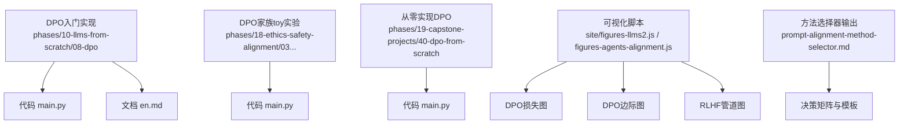
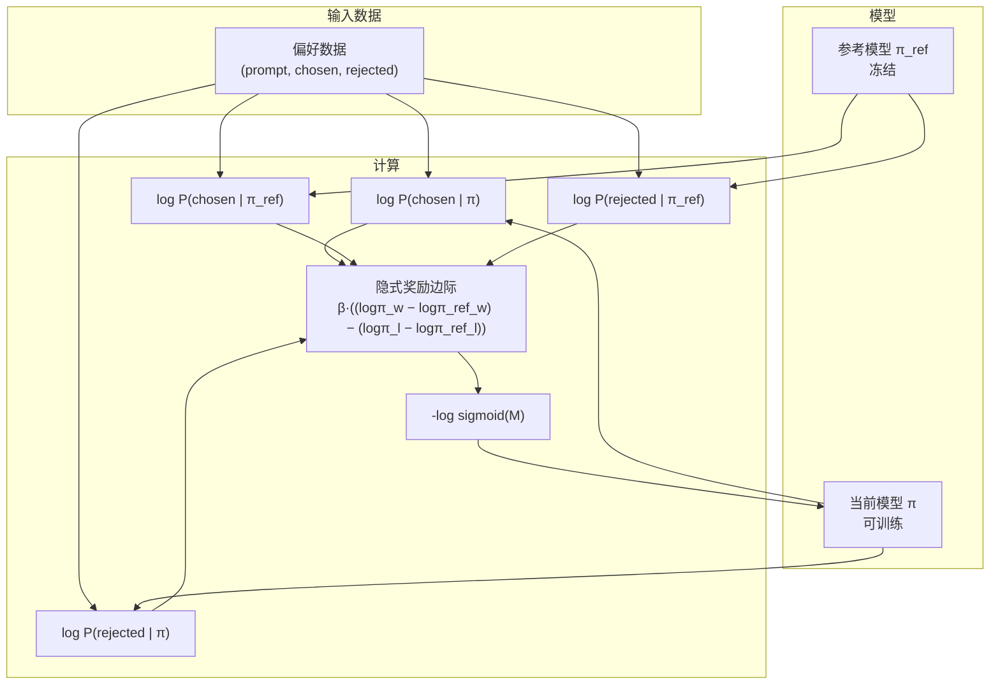
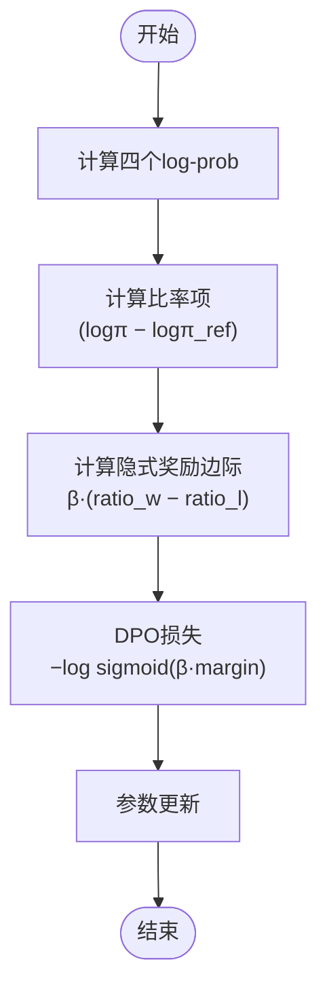
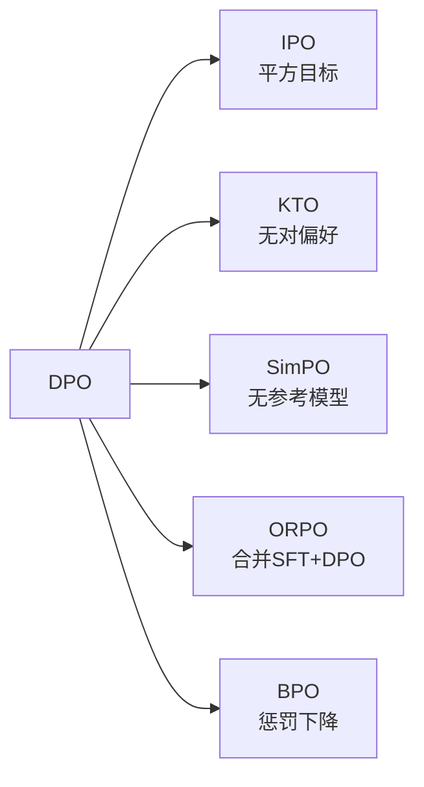
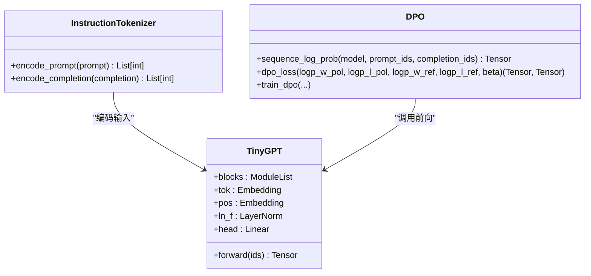
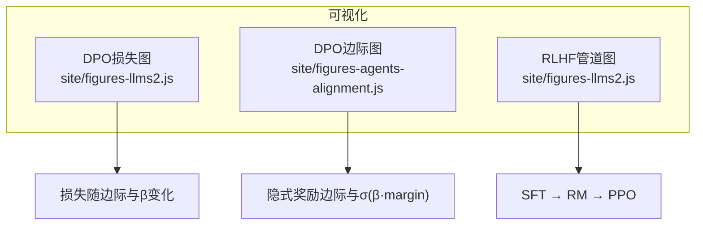
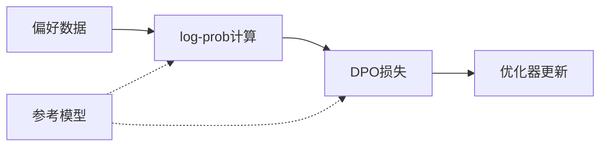

# 直接偏好优化技术

<cite>
**本文引用的文件**
- [phases/10-llms-from-scratch/08-dpo/code/main.py](file://phases/10-llms-from-scratch/08-dpo/code/main.py)
- [phases/10-llms-from-scratch/08-dpo/docs/en.md](file://phases/10-llms-from-scratch/08-dpo/docs/en.md)
- [phases/18-ethics-safety-alignment/03-direct-preference-optimization-family/code/main.py](file://phases/18-ethics-safety-alignment/03-direct-preference-optimization-family/code/main.py)
- [site/figures-llms2.js](file://site/figures-llms2.js)
- [site/figures-agents-alignment.js](file://site/figures-agents-alignment.js)
- [phases/10-llms-from-scratch/08-dpo/outputs/prompt-alignment-method-selector.md](file://phases/10-llms-from-scratch/08-dpo/outputs/prompt-alignment-method-selector.md)
- [phases/19-capstone-projects/40-dpo-from-scratch/code/main.py](file://phases/19-capstone-projects/40-dpo-from-scratch/code/main.py)
</cite>

## 目录
1. [引言](#引言)
2. [项目结构](#项目结构)
3. [核心组件](#核心组件)
4. [架构总览](#架构总览)
5. [详细组件分析](#详细组件分析)
6. [依赖关系分析](#依赖关系分析)
7. [性能考量](#性能考量)
8. [故障排查指南](#故障排查指南)
9. [结论](#结论)
10. [附录](#附录)

## 引言
本文件系统化梳理直接偏好优化（DPO）技术，覆盖其理论基础、损失函数设计、实现细节与工程实践，并与RLHF进行对比。文档基于仓库中的三套实现与配套材料：一个基于numpy的入门级实现、一套toy级多损失比较脚本、以及一个从零到一的PyTorch实现。同时，结合可视化脚本与方法选择器输出，帮助读者建立从理论到工程再到部署的完整认知。

## 项目结构
围绕DPO主题，仓库中与之直接相关的文件主要分布在以下位置：
- phases/10-llms-from-scratch/08-dpo：包含DPO的入门实现与教学文档
- phases/18-ethics-safety-alignment/03-direct-preference-optimization-family：包含DPO家族多种变体的toy实验
- phases/19-capstone-projects/40-dpo-from-scratch：完整的从零实现（含分词器、TinyGPT、损失与训练循环）
- site/figures-*：用于直观理解DPO与RLHF的可视化脚本
- 输出产物：方法选择器（prompt-alignment-method-selector.md）



**图表来源**
- [phases/10-llms-from-scratch/08-dpo/code/main.py:1-480](file://phases/10-llms-from-scratch/08-dpo/code/main.py#L1-L480)
- [phases/18-ethics-safety-alignment/03-direct-preference-optimization-family/code/main.py:1-231](file://phases/18-ethics-safety-alignment/03-direct-preference-optimization-family/code/main.py#L1-L231)
- [phases/19-capstone-projects/40-dpo-from-scratch/code/main.py:1-564](file://phases/19-capstone-projects/40-dpo-from-scratch/code/main.py#L1-L564)
- [site/figures-llms2.js:176-215](file://site/figures-llms2.js#L176-L215)
- [site/figures-agents-alignment.js:297-331](file://site/figures-agents-alignment.js#L297-L331)
- [phases/10-llms-from-scratch/08-dpo/outputs/prompt-alignment-method-selector.md:1-151](file://phases/10-llms-from-scratch/08-dpo/outputs/prompt-alignment-method-selector.md#L1-L151)

**章节来源**
- [phases/10-llms-from-scratch/08-dpo/code/main.py:1-480](file://phases/10-llms-from-scratch/08-dpo/code/main.py#L1-L480)
- [phases/18-ethics-safety-alignment/03-direct-preference-optimization-family/code/main.py:1-231](file://phases/18-ethics-safety-alignment/03-direct-preference-optimization-family/code/main.py#L1-L231)
- [phases/19-capstone-projects/40-dpo-from-scratch/code/main.py:1-564](file://phases/19-capstone-projects/40-dpo-from-scratch/code/main.py#L1-L564)
- [site/figures-llms2.js:176-215](file://site/figures-llms2.js#L176-L215)
- [site/figures-agents-alignment.js:297-331](file://site/figures-agents-alignment.js#L297-L331)
- [phases/10-llms-from-scratch/08-dpo/outputs/prompt-alignment-method-selector.md:1-151](file://phases/10-llms-from-scratch/08-dpo/outputs/prompt-alignment-method-selector.md#L1-L151)

## 核心组件
- 偏好建模与损失函数
  - DPO损失：通过隐式奖励（log-概率比）直接优化偏好对，避免显式的奖励模型与PPO。
  - 变体损失：IPO、KTO、SimPO、ORPO、BPO等，分别在稳定性、数据需求、参考模型依赖等方面权衡。
- 训练流水线
  - 参考模型冻结（frozen reference），当前模型（policy）在每步更新权重。
  - 使用（prompt, chosen, rejected）三元组，计算四个log-prob后求损失并反向传播。
- 工程实现
  - 两套实现：入门级（numpy）与从零实现（PyTorch/TinyGPT），后者包含分词器、序列log-prob计算、损失与训练循环。
- 可视化与评估
  - 损失曲线、边际变化、隐式奖励分析；方法选择器提供不同场景下的最佳实践模板。

**章节来源**
- [phases/10-llms-from-scratch/08-dpo/docs/en.md:64-115](file://phases/10-llms-from-scratch/08-dpo/docs/en.md#L64-L115)
- [phases/18-ethics-safety-alignment/03-direct-preference-optimization-family/code/main.py:77-127](file://phases/18-ethics-safety-alignment/03-direct-preference-optimization-family/code/main.py#L77-L127)
- [phases/19-capstone-projects/40-dpo-from-scratch/code/main.py:236-297](file://phases/19-capstone-projects/40-dpo-from-scratch/code/main.py#L236-L297)

## 架构总览
下图展示了DPO训练的关键步骤与模块交互：输入偏好数据，计算当前模型与参考模型上的log-prob，得到隐式奖励边际，再用DPO损失进行梯度更新。



**图表来源**
- [phases/10-llms-from-scratch/08-dpo/docs/en.md:64-115](file://phases/10-llms-from-scratch/08-dpo/docs/en.md#L64-L115)
- [phases/10-llms-from-scratch/08-dpo/code/main.py:94-118](file://phases/10-llms-from-scratch/08-dpo/code/main.py#L94-L118)
- [phases/19-capstone-projects/40-dpo-from-scratch/code/main.py:236-256](file://phases/19-capstone-projects/40-dpo-from-scratch/code/main.py#L236-L256)

## 详细组件分析

### 组件A：DPO损失与隐式奖励
- 核心公式与动机
  - DPO将奖励建模为隐式函数：R(x, y) ∝ β·log(π(y|x)/π_ref(y|x))，从而无需单独训练奖励模型。
  - 偏好对的排序概率由Bradley-Terry给出，最终得到DPO损失表达式。
- 实现要点
  - 使用logsigmoid（数值稳定）实现损失；返回隐式奖励边际与比率项，便于诊断。
  - 在入门实现中采用numpy，在从零实现中采用torch与log-sigmoid。
- 边际与隐式奖励分析
  - 通过比较“首选响应”与“被拒响应”的log-prob比率，观察训练过程中边际上升趋势。



**图表来源**
- [phases/10-llms-from-scratch/08-dpo/code/main.py:94-118](file://phases/10-llms-from-scratch/08-dpo/code/main.py#L94-L118)
- [phases/19-capstone-projects/40-dpo-from-scratch/code/main.py:236-256](file://phases/19-capstone-projects/40-dpo-from-scratch/code/main.py#L236-L256)

**章节来源**
- [phases/10-llms-from-scratch/08-dpo/docs/en.md:64-115](file://phases/10-llms-from-scratch/08-dpo/docs/en.md#L64-L115)
- [phases/10-llms-from-scratch/08-dpo/code/main.py:94-118](file://phases/10-llms-from-scratch/08-dpo/code/main.py#L94-L118)
- [phases/19-capstone-projects/40-dpo-from-scratch/code/main.py:236-256](file://phases/19-capstone-projects/40-dpo-from-scratch/code/main.py#L236-L256)

### 组件B：DPO训练循环与优化策略
- 训练循环
  - 随机打乱偏好对，对每一对计算四次前向以获得四个log-prob，代入DPO损失，反向传播并更新当前模型。
  - 记录每步损失与边际，用于训练动态分析。
- 优化策略
  - beta超参数控制偏离参考模型的程度；过小易导致退化，过大则收敛慢。
  - 参考模型必须冻结，确保比率项稳定。
- 评估指标
  - 偏好准确率（隐式奖励首选优于被拒）、边际曲线、损失曲线。

```mermaid
sequenceDiagram
participant Data as "偏好数据"
participant Policy as "当前模型 π"
participant Ref as "参考模型 π_ref"
participant Loss as "DPO损失"
participant Opt as "优化器"
Data->>Policy : 计算log P(chosen|π)
Data->>Policy : 计算log P(rejected|π)
Data->>Ref : 计算log P(chosen|π_ref)
Data->>Ref : 计算log P(rejected|π_ref)
Policy->>Loss : 传入四个log-prob
Ref->>Loss : 传入四个log-prob
Loss-->>Opt : 返回损失与梯度
Opt->>Policy : 更新参数
```

**图表来源**
- [phases/10-llms-from-scratch/08-dpo/code/main.py:141-219](file://phases/10-llms-from-scratch/08-dpo/code/main.py#L141-L219)
- [phases/19-capstone-projects/40-dpo-from-scratch/code/main.py:452-493](file://phases/19-capstone-projects/40-dpo-from-scratch/code/main.py#L452-L493)

**章节来源**
- [phases/10-llms-from-scratch/08-dpo/code/main.py:141-219](file://phases/10-llms-from-scratch/08-dpo/code/main.py#L141-L219)
- [phases/19-capstone-projects/40-dpo-from-scratch/code/main.py:452-493](file://phases/19-capstone-projects/40-dpo-from-scratch/code/main.py#L452-L493)

### 组件C：DPO家族变体（IPO、KTO、SimPO、ORPO、BPO）
- IPO：平方损失，目标边际为1/(2β)，避免饱和，提升稳定性。
- KTO：无需成对偏好，仅需“好/坏”标签，引入损失厌恶权重，适用于弱监督场景。
- SimPO：去除参考模型，使用长度归一化的平均log-prob作为隐式奖励，节省内存。
- ORPO：将SFT与DPO合并为单步，通过odds ratio项增强偏好信号。
- BPO：在DPO基础上增加对首选响应log-prob下降的惩罚项，进一步约束。



**图表来源**
- [phases/18-ethics-safety-alignment/03-direct-preference-optimization-family/code/main.py:77-127](file://phases/18-ethics-safety-alignment/03-direct-preference-optimization-family/code/main.py#L77-L127)
- [phases/18-ethics-safety-alignment/03-direct-preference-optimization-family/code/main.py:112-148](file://phases/18-ethics-safety-alignment/03-direct-preference-optimization-family/code/main.py#L112-L148)
- [phases/18-ethics-safety-alignment/03-direct-preference-optimization-family/code/main.py:151-169](file://phases/18-ethics-safety-alignment/03-direct-preference-optimization-family/code/main.py#L151-L169)
- [phases/18-ethics-safety-alignment/03-direct-preference-optimization-family/code/main.py:100-105](file://phases/18-ethics-safety-alignment/03-direct-preference-optimization-family/code/main.py#L100-L105)

**章节来源**
- [phases/18-ethics-safety-alignment/03-direct-preference-optimization-family/code/main.py:77-169](file://phases/18-ethics-safety-alignment/03-direct-preference-optimization-family/code/main.py#L77-L169)

### 组件D：从零实现（TinyGPT + 分词器 + 训练循环）
- 模型与分词器
  - InstructionTokenizer：支持指令与回复特殊标记的字节级分词。
  - TinyGPT：因果解码器架构，带注意力掩码与残差路径。
- 关键函数
  - sequence_log_prob：对完成序列求log-prob之和，支持截断与设备一致性。
  - dpo_loss/ipo_loss：分别实现DPO与IPO损失，返回标量损失与边际。
  - train_dpo：完整的训练循环，冻结参考模型，记录损失与边际。
- 可视化与演示
  - run_demo：预热参考模型、打印每轮损失与边际、校验边际上升与损失下降。



**图表来源**
- [phases/19-capstone-projects/40-dpo-from-scratch/code/main.py:40-117](file://phases/19-capstone-projects/40-dpo-from-scratch/code/main.py#L40-L117)
- [phases/19-capstone-projects/40-dpo-from-scratch/code/main.py:195-234](file://phases/19-capstone-projects/40-dpo-from-scratch/code/main.py#L195-L234)
- [phases/19-capstone-projects/40-dpo-from-scratch/code/main.py:236-297](file://phases/19-capstone-projects/40-dpo-from-scratch/code/main.py#L236-L297)
- [phases/19-capstone-projects/40-dpo-from-scratch/code/main.py:452-493](file://phases/19-capstone-projects/40-dpo-from-scratch/code/main.py#L452-L493)

**章节来源**
- [phases/19-capstone-projects/40-dpo-from-scratch/code/main.py:40-117](file://phases/19-capstone-projects/40-dpo-from-scratch/code/main.py#L40-L117)
- [phases/19-capstone-projects/40-dpo-from-scratch/code/main.py:195-297](file://phases/19-capstone-projects/40-dpo-from-scratch/code/main.py#L195-L297)
- [phases/19-capstone-projects/40-dpo-from-scratch/code/main.py:452-493](file://phases/19-capstone-projects/40-dpo-from-scratch/code/main.py#L452-L493)

### 组件E：可视化与理解
- DPO损失与边际
  - 通过交互式图形展示β与边际对损失的影响，直观理解正负边际的惩罚强度。
- RLHF管道
  - 展示SFT、RM、PPO三阶段数据流与目标函数，强调KL惩罚的作用。



**图表来源**
- [site/figures-llms2.js:176-215](file://site/figures-llms2.js#L176-L215)
- [site/figures-agents-alignment.js:297-331](file://site/figures-agents-alignment.js#L297-L331)
- [site/figures-llms2.js:111-174](file://site/figures-llms2.js#L111-L174)

**章节来源**
- [site/figures-llms2.js:111-174](file://site/figures-llms2.js#L111-L174)
- [site/figures-llms2.js:176-215](file://site/figures-llms2.js#L176-L215)
- [site/figures-agents-alignment.js:297-331](file://site/figures-agents-alignment.js#L297-L331)

## 依赖关系分析
- 模块耦合
  - DPO损失与log-prob计算强耦合，二者共同决定隐式奖励边际。
  - 训练循环依赖于参考模型冻结与beta超参设置。
- 外部依赖
  - 从零实现依赖torch与torch.nn.functional；入门实现依赖numpy。
- 可能的环依赖
  - 代码组织清晰，未见循环导入；训练循环与损失函数分离良好。



**图表来源**
- [phases/10-llms-from-scratch/08-dpo/code/main.py:52-85](file://phases/10-llms-from-scratch/08-dpo/code/main.py#L52-L85)
- [phases/10-llms-from-scratch/08-dpo/code/main.py:94-118](file://phases/10-llms-from-scratch/08-dpo/code/main.py#L94-L118)
- [phases/19-capstone-projects/40-dpo-from-scratch/code/main.py:195-256](file://phases/19-capstone-projects/40-dpo-from-scratch/code/main.py#L195-L256)

**章节来源**
- [phases/10-llms-from-scratch/08-dpo/code/main.py:52-118](file://phases/10-llms-from-scratch/08-dpo/code/main.py#L52-L118)
- [phases/19-capstone-projects/40-dpo-from-scratch/code/main.py:195-256](file://phases/19-capstone-projects/40-dpo-from-scratch/code/main.py#L195-L256)

## 性能考量
- 计算复杂度
  - DPO每步需四次前向（当前模型两对，参考模型两对），相较RLHF的生成+评分+价值估计+PPO更轻量。
- 内存占用
  - 仅需两个模型在内存（当前+参考），显著低于RLHF的三至四个模型拷贝。
- 超参敏感性
  - beta对稳定性与学习速度影响大，建议进行小范围扫描；学习率与批次规模根据模型规模调整。
- 长度偏差
  - 使用长度归一化log-prob可缓解偏好短回答的偏差。

[本节为通用指导，不直接分析具体文件]

## 故障排查指南
- 训练不收敛或震荡
  - 检查beta是否过高或过低；适当降低学习率；确认参考模型已冻结。
- 边际不升反降
  - 核对log-prob计算逻辑与截断策略；检查prompt与completion拼接顺序。
- 评估指标异常
  - 使用偏好准确率与边际曲线交叉验证；关注长回答倾向与模式崩溃风险。

**章节来源**
- [phases/10-llms-from-scratch/08-dpo/docs/en.md:505-506](file://phases/10-llms-from-scratch/08-dpo/docs/en.md#L505-L506)
- [phases/19-capstone-projects/40-dpo-from-scratch/code/main.py:548-559](file://phases/19-capstone-projects/40-dpo-from-scratch/code/main.py#L548-L559)

## 结论
DPO以“隐式奖励”为核心思想，将RLHF的三阶段简化为两阶段（SFT + DPO），在保持对齐质量的同时大幅降低复杂度与成本。仓库提供了从入门到从零实现的完整路径，并通过可视化与方法选择器帮助在不同数据规模与资源约束下做出合理取舍。对于需要快速迭代与小数据场景，DPO是首选；在需要复杂多目标对齐与在线迭代时，可考虑RLHF；两者结合亦是业界常见做法。

[本节为总结性内容，不直接分析具体文件]

## 附录
- 方法选择器要点
  - 快速选择矩阵与详细对比表，涵盖数据需求、内存占用、训练轮数、稳定性与最佳规模。
  - 针对SFT、RLHF、DPO、KTO、ORPO、SimPO的配置建议与管线模板。
- 可视化脚本
  - DPO损失与边际图、RLHF管道图，辅助理解目标函数与训练流程。

**章节来源**
- [phases/10-llms-from-scratch/08-dpo/outputs/prompt-alignment-method-selector.md:24-151](file://phases/10-llms-from-scratch/08-dpo/outputs/prompt-alignment-method-selector.md#L24-L151)
- [site/figures-llms2.js:111-174](file://site/figures-llms2.js#L111-L174)
- [site/figures-llms2.js:176-215](file://site/figures-llms2.js#L176-L215)
- [site/figures-agents-alignment.js:297-331](file://site/figures-agents-alignment.js#L297-L331)