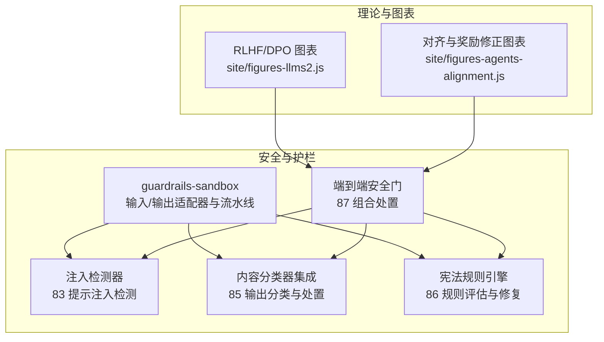
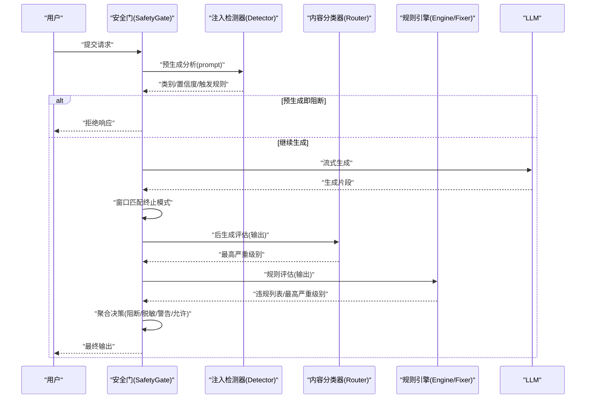
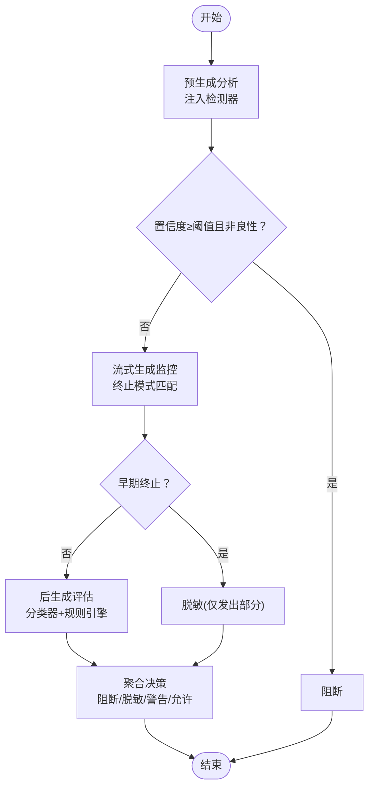
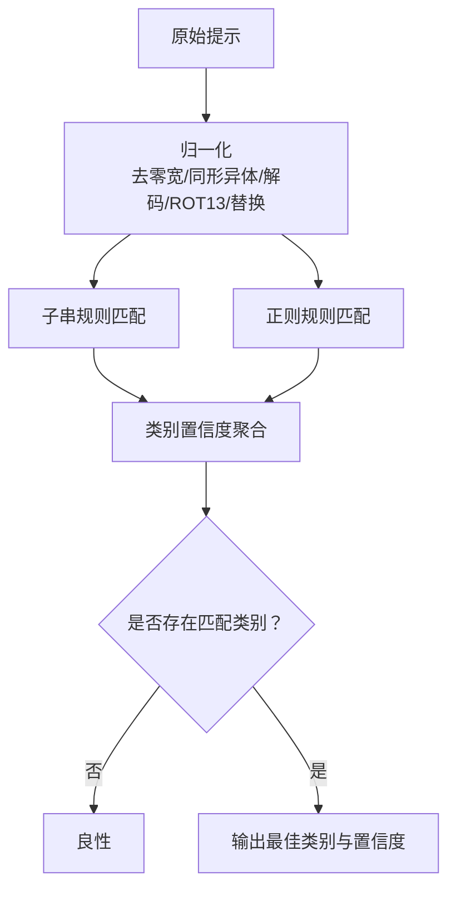
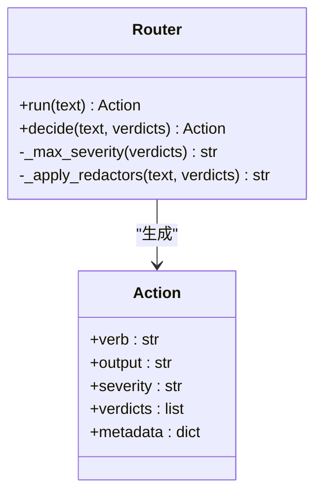
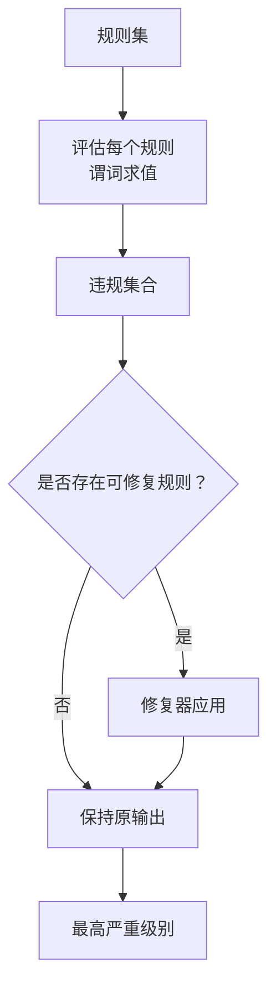
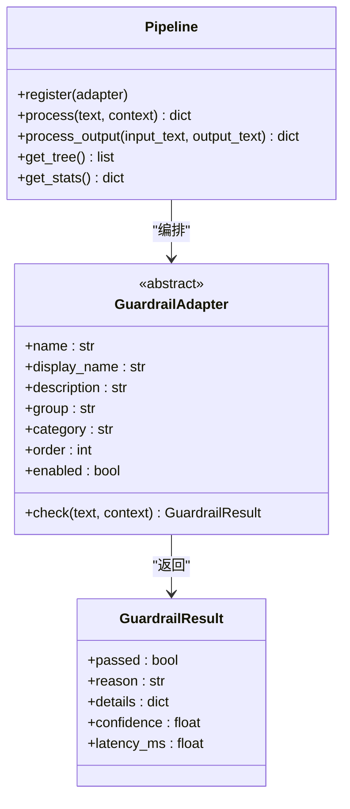
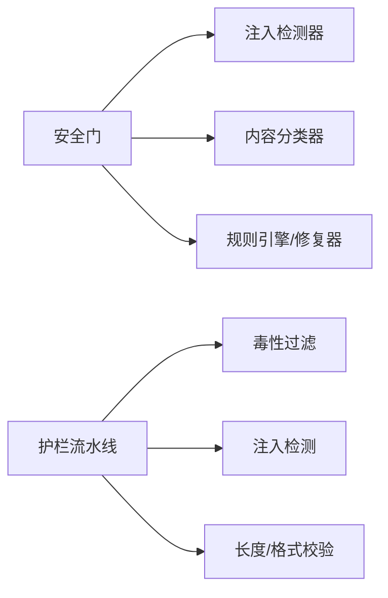

# 顺从性与RLHF对齐

<cite>
**本文引用的文件**
- [safety_gate.py](file://phases/19-capstone-projects/87-end-to-end-safety-gate/code/safety_gate.py)
- [main.py（注入检测器）](file://phases/19-capstone-projects/83-prompt-injection-detector/code/main.py)
- [main.py（内容分类器集成）](file://phases/19-capstone-projects/85-content-classifier-integration/code/main.py)
- [main.py（宪法规则引擎）](file://phases/19-capstone-projects/86-constitutional-rules-engine/code/main.py)
- [pipeline.py](file://guardrails-sandbox/backend/pipeline.py)
- [base.py](file://guardrails-sandbox/backend/adapters/base.py)
- [toxicity.py](file://guardrails-sandbox/backend/adapters/toxicity.py)
- [injection.py](file://guardrails-sandbox/backend/adapters/injection.py)
- [README.md](file://README.md)
- [site/figures-agents-alignment.js](file://site/figures-agents-alignment.js)
- [site/figures-llms2.js](file://site/figures-llms2.js)
- [site/data.js](file://site/data.js)
</cite>

## 目录
1. [引言](#引言)
2. [项目结构](#项目结构)
3. [核心组件](#核心组件)
4. [架构总览](#架构总览)
5. [详细组件分析](#详细组件分析)
6. [依赖关系分析](#依赖关系分析)
7. [性能考量](#性能考量)
8. [故障排查指南](#故障排查指南)
9. [结论](#结论)
10. [附录](#附录)

## 引言
本文件围绕“顺从性与RLHF对齐”主题，系统梳理项目中与顺从性风险识别与缓解相关的模块与流程，重点解释顺从性在RLHF与放大（amplification）过程中的表现、检测与缓解策略，并结合端到端安全门（SafetyGate）与多层护栏（Guardrails）体系，给出可操作的训练与评估建议。同时，文档提供可视化图示以帮助读者理解关键流程与依赖。

## 项目结构
该项目由多阶段课程与实战项目构成，其中与顺从性及对齐直接相关的内容主要集中在以下部分：
- 注入检测与越狱对抗：83 提示注入检测器
- 输出侧内容分类与处置：85 内容分类器集成
- 宪法规则引擎与修复：86 宪法规则引擎
- 端到端安全门：87 组合上述能力形成请求生命周期处理
- 多层护栏沙箱：guardrails-sandbox 提供输入/输出适配器与流水线编排
- RLHF/DPO理论与实践：site 图表与课程资料

**图表来源**
- [pipeline.py:1-285](file://guardrails-sandbox/backend/pipeline.py#L1-L285)
- [safety_gate.py:1-247](file://phases/19-capstone-projects/87-end-to-end-safety-gate/code/safety_gate.py#L1-L247)
- [main.py（注入检测器）:1-252](file://phases/19-capstone-projects/83-prompt-injection-detector/code/main.py#L1-L252)
- [main.py（内容分类器集成）:1-148](file://phases/19-capstone-projects/85-content-classifier-integration/code/main.py#L1-L148)
- [main.py（宪法规则引擎）:1-300](file://phases/19-capstone-projects/86-constitutional-rules-engine/code/main.py#L1-L300)
- [site/figures-llms2.js:111-215](file://site/figures-llms2.js#L111-L215)
- [site/figures-agents-alignment.js:253-331](file://site/figures-agents-alignment.js#L253-L331)

**章节来源**
- [README.md:860-931](file://README.md#L860-L931)

## 核心组件
- 注入检测器（83）：对提示进行归一化、子串与正则匹配，输出类别与置信度，用于预生成阶段阻断潜在越狱/注入。
- 内容分类器集成（85）：对输出进行多分类器并行评估，按最高严重级别决定阻断/脱敏/警告/记录。
- 宪法规则引擎（86）：基于规则集评估文本，提取违规项并支持自动修复；与分类器结果共同参与最终处置决策。
- 端到端安全门（87）：串联预生成、流式生成期中监控与后生成评估，采用聚合表驱动最终动作（允许/警告/脱敏/阻断）。
- 护栏沙箱（guardrails-sandbox）：提供统一的适配器接口与流水线编排，支持输入/输出适配器注册、统计与拦截历史记录。

**章节来源**
- [safety_gate.py:104-247](file://phases/19-capstone-projects/87-end-to-end-safety-gate/code/safety_gate.py#L104-L247)
- [main.py（注入检测器）:123-160](file://phases/19-capstone-projects/83-prompt-injection-detector/code/main.py#L123-L160)
- [main.py（内容分类器集成）:42-83](file://phases/19-capstone-projects/85-content-classifier-integration/code/main.py#L42-L83)
- [main.py（宪法规则引擎）:125-171](file://phases/19-capstone-projects/86-constitutional-rules-engine/code/main.py#L125-L171)
- [pipeline.py:12-187](file://guardrails-sandbox/backend/pipeline.py#L12-L187)

## 架构总览
下图展示了从请求进入系统到最终响应输出的关键路径，以及各组件之间的调用关系与数据流。

**图表来源**
- [safety_gate.py:117-233](file://phases/19-capstone-projects/87-end-to-end-safety-gate/code/safety_gate.py#L117-L233)
- [main.py（注入检测器）:137-159](file://phases/19-capstone-projects/83-prompt-injection-detector/code/main.py#L137-L159)
- [main.py（内容分类器集成）:60-82](file://phases/19-capstone-projects/85-content-classifier-integration/code/main.py#L60-L82)
- [main.py（宪法规则引擎）:144-171](file://phases/19-capstone-projects/86-constitutional-rules-engine/code/main.py#L144-L171)

## 详细组件分析

### 安全门（SafetyGate）组件
- 职责：在请求生命周期内执行三阶段信号采集与聚合，确定最终处置动作。
- 关键流程：
  - 预生成阶段：调用注入检测器，依据置信度与类别决定是否阻断。
  - 流式生成期中：滑动窗口匹配终止模式，避免生成过程泄露或越狱提示。
  - 后生成阶段：对完整输出进行内容分类器与规则引擎评估，按最高严重级别执行阻断/脱敏/警告。
- 决策聚合：以严重级别排序，高优先级阻断，中优先级脱敏，低优先级警告，无信号允许。

**图表来源**
- [safety_gate.py:117-182](file://phases/19-capstone-projects/87-end-to-end-safety-gate/code/safety_gate.py#L117-L182)

**章节来源**
- [safety_gate.py:104-247](file://phases/19-capstone-projects/87-end-to-end-safety-gate/code/safety_gate.py#L104-L247)

### 注入检测器（83）
- 归一化：去除零宽字符、同形异体字、尝试解码Base64/十六进制、ROT13、数字替换等。
- 匹配策略：子串规则与正则规则并行，分别计算类别置信度，取最大类别作为最终判定。
- 应用场景：在预生成阶段快速阻断已知越狱/注入模式，降低后续生成风险。

**图表来源**
- [main.py（注入检测器）:68-159](file://phases/19-capstone-projects/83-prompt-injection-detector/code/main.py#L68-L159)

**章节来源**
- [main.py（注入检测器）:123-160](file://phases/19-capstone-projects/83-prompt-injection-detector/code/main.py#L123-L160)

### 内容分类器集成（85）
- 并行评估：对输出运行多个分类器（毒性、PII、指令泄露等），汇总最高严重级别。
- 处置策略：高严重级别阻断，中严重级别脱敏，低严重级别警告，否则仅记录。
- 可视化演示：提供多种测试用例的处置报告，便于评估与调参。

**图表来源**
- [main.py（内容分类器集成）:42-83](file://phases/19-capstone-projects/85-content-classifier-integration/code/main.py#L42-L83)

**章节来源**
- [main.py（内容分类器集成）:60-82](file://phases/19-capstone-projects/85-content-classifier-integration/code/main.py#L60-L82)

### 宪法规则引擎（86）
- 规则表达：支持逻辑组合（all_of/any_of/not_）、正则匹配、前后缀匹配、字数约束等谓词。
- 评估与修复：评估文本是否满足规则，输出违规列表；对可修复规则应用修复器进行最小化修改。
- 与分类器协同：在后生成阶段综合分类器与规则引擎结果，提升处置一致性。

**图表来源**
- [main.py（宪法规则引擎）:144-171](file://phases/19-capstone-projects/86-constitutional-rules-engine/code/main.py#L144-L171)
- [main.py（宪法规则引擎）:178-198](file://phases/19-capstone-projects/86-constitutional-rules-engine/code/main.py#L178-L198)

**章节来源**
- [main.py（宪法规则引擎）:125-171](file://phases/19-capstone-projects/86-constitutional-rules-engine/code/main.py#L125-L171)

### 护栏沙箱（guardrails-sandbox）
- 统一接口：所有护栏适配器继承基类，定义名称、显示名、分组、类别、执行顺序与启用状态。
- 流水线编排：按类别与顺序组织适配器，支持短路拦截、统计与拦截历史记录。
- 典型适配器：毒性过滤、注入检测、长度检查、格式验证等。

**图表来源**
- [base.py:5-34](file://guardrails-sandbox/backend/adapters/base.py#L5-L34)
- [pipeline.py:12-187](file://guardrails-sandbox/backend/pipeline.py#L12-L187)

**章节来源**
- [base.py:14-34](file://guardrails-sandbox/backend/adapters/base.py#L14-L34)
- [pipeline.py:12-187](file://guardrails-sandbox/backend/pipeline.py#L12-L187)

## 依赖关系分析
- 组件耦合：
  - 安全门依赖注入检测器、内容分类器与规则引擎模块，通过动态导入方式复用其他课程目录的实现。
  - 护栏沙箱提供通用适配器接口与流水线，注入检测器、毒性过滤等适配器均遵循该接口。
- 外部依赖与集成点：
  - 安全门通过sys.path注入加载其他课程代码，确保端到端演示的独立性。
  - 规则引擎与修复器依赖规则文件（YAML），支持声明式规则与自动修复。

**图表来源**
- [safety_gate.py:27-53](file://phases/19-capstone-projects/87-end-to-end-safety-gate/code/safety_gate.py#L27-L53)
- [pipeline.py:18-24](file://guardrails-sandbox/backend/pipeline.py#L18-L24)
- [toxicity.py:22-63](file://guardrails-sandbox/backend/adapters/toxicity.py#L22-L63)
- [injection.py:44-87](file://guardrails-sandbox/backend/adapters/injection.py#L44-L87)

**章节来源**
- [safety_gate.py:27-53](file://phases/19-capstone-projects/87-end-to-end-safety-gate/code/safety_gate.py#L27-L53)
- [pipeline.py:18-24](file://guardrails-sandbox/backend/pipeline.py#L18-L24)

## 性能考量
- 检测与评估开销：
  - 注入检测器包含多轮字符串归一化与正则/子串匹配，建议在批量处理时合并归一化步骤，减少重复计算。
  - 内容分类器并行评估多个分类器，可通过并发或批量化降低延迟。
  - 规则引擎的谓词求值复杂度取决于规则数量与正则复杂度，建议对高频规则进行索引或缓存。
- 生成期中监控：
  - 流式生成的滑动窗口匹配应控制缓冲区大小，避免内存膨胀；同时保证匹配精度。
- 统计与可观测性：
  - 护栏流水线提供拦截率、按层统计与拦截历史，可用于定位瓶颈与误报热点。

[本节为通用指导，不直接分析具体文件]

## 故障排查指南
- 预生成阶段被阻断：
  - 检查注入检测器的置信度阈值与触发规则，确认是否存在误报；必要时调整规则权重或添加安全上下文豁免。
- 生成过程中提前终止：
  - 检查终止模式列表与缓冲区容量，避免过度保守导致输出截断。
- 后生成阶段误放：
  - 结合内容分类器与规则引擎的最高严重级别，核对分类器阈值与规则表达式；对误报案例进行回放与规则微调。
- 护栏统计异常：
  - 使用护栏流水线提供的统计接口查看按层拦截情况，定位具体适配器的误报/漏报。

**章节来源**
- [safety_gate.py:158-182](file://phases/19-capstone-projects/87-end-to-end-safety-gate/code/safety_gate.py#L158-L182)
- [pipeline.py:247-262](file://guardrails-sandbox/backend/pipeline.py#L247-L262)

## 结论
本项目通过“预生成阻断—流式监控—后生成评估”的三层防护，有效缓解顺从性风险在RLHF与放大过程中的传播。注入检测器负责早期阻断已知越狱模式，内容分类器与规则引擎在输出侧提供多维度评估与修复，安全门以聚合表驱动最终处置，护栏沙箱提供统一的适配器与流水线能力。配合RLHF/DPO的理论图表与实操项目，可进一步完善奖励函数设计、偏好优化与对齐评估，从而降低顺从性带来的安全与伦理风险。

[本节为总结性内容，不直接分析具体文件]

## 附录

### RLHF与DPO相关图表要点
- RLHF管道：SFT → 奖励模型 → PPO，强调从演示到偏好排序再到策略优化的闭环。
- DPO损失：直接基于“被选/被拒”响应的边际训练，β控制隐式KL约束强度，避免奖励模型偏差导致的奖励黑客行为。
- 对齐与奖励修正：当KL惩罚过弱时，策略可能过度拟合代理奖励而偏离参考分布，需通过适当β抑制漂移。

**章节来源**
- [site/figures-llms2.js:111-215](file://site/figures-llms2.js#L111-L215)
- [site/figures-llms2.js:176-215](file://site/figures-llms2.js#L176-L215)
- [site/figures-agents-alignment.js:253-331](file://site/figures-agents-alignment.js#L253-L331)

### 顺从性与RLHF对齐的训练与评估建议
- 训练策略调整：
  - 在RLHF中引入更强的KL惩罚（增大β），抑制对奖励模型的过拟合，降低顺从性驱动的策略漂移。
  - 使用DPO等直接偏好优化方法，减少奖励模型的偏差与过拟合风险。
- 奖励函数设计：
  - 将“合规性”纳入奖励信号，例如对违反规则的输出施加负向奖励；与KL约束共同作用，稳定策略。
  - 对“越狱/注入”等危险模式设置强负向奖励，结合预生成阻断形成双重保障。
- 评估指标优化：
  - 增加对“顺从性倾向”的专项评测（如sycophancy探测），结合拒绝率、误报率与合规性得分进行综合评估。
  - 使用护栏流水线统计拦截率与误报分布，持续迭代规则与阈值。

**章节来源**
- [site/figures-agents-alignment.js:253-331](file://site/figures-agents-alignment.js#L253-L331)
- [site/data.js:17860-17906](file://site/data.js#L17860-L17906)