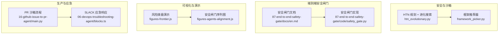
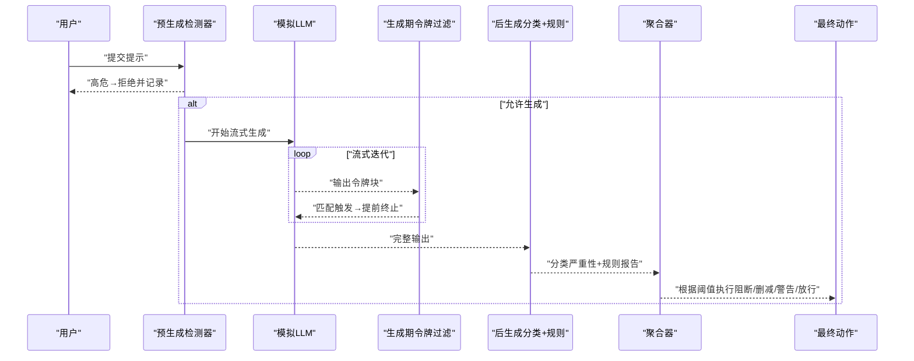
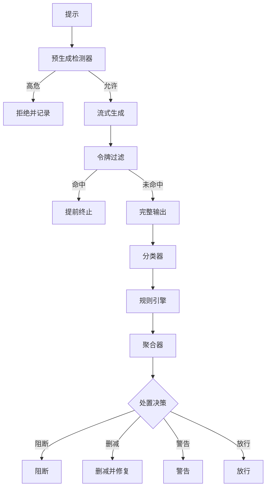
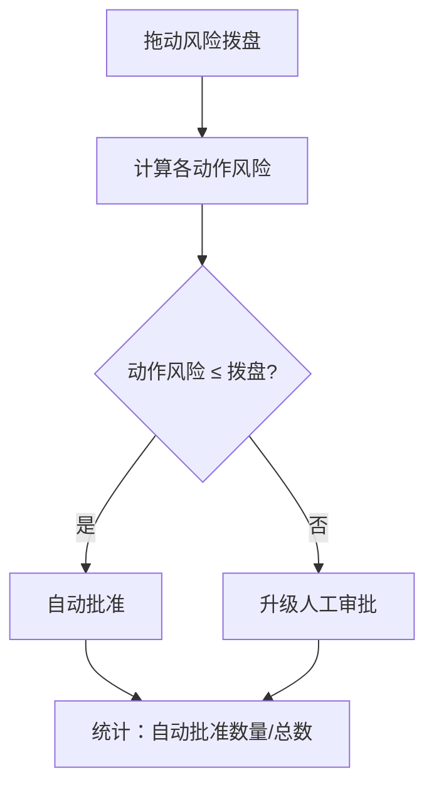
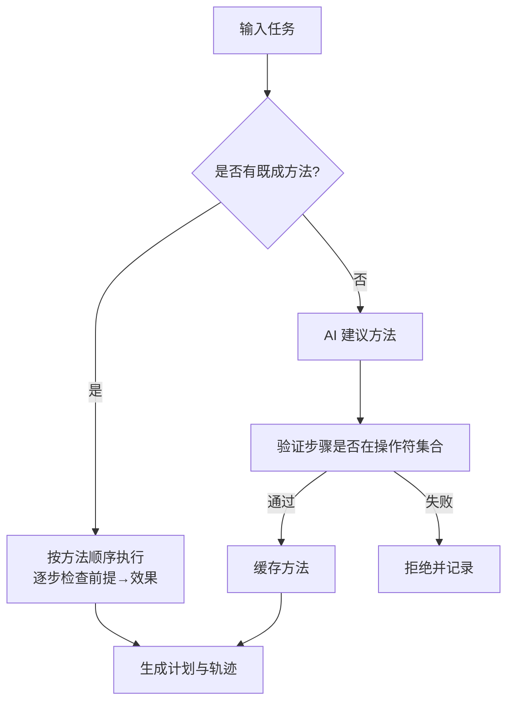
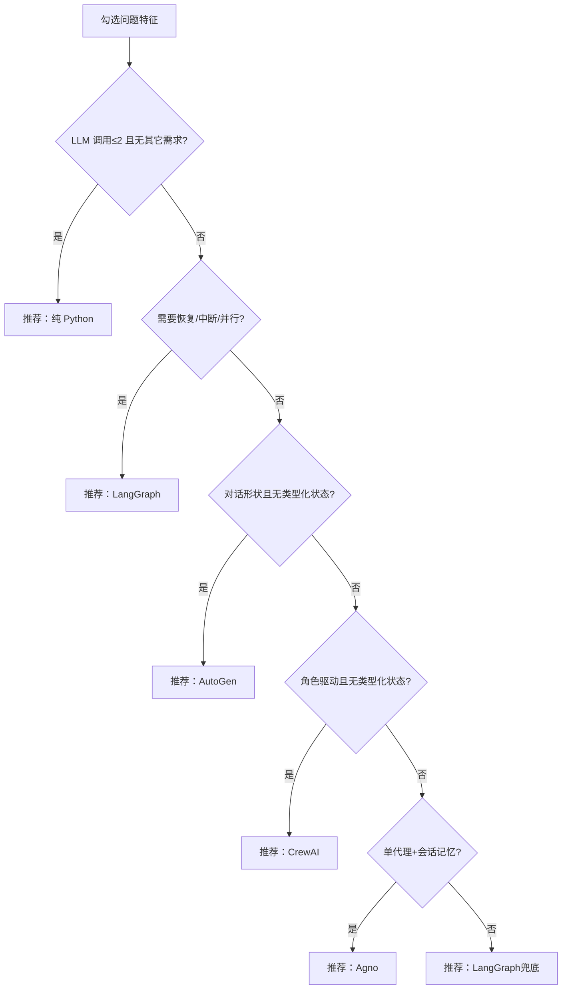
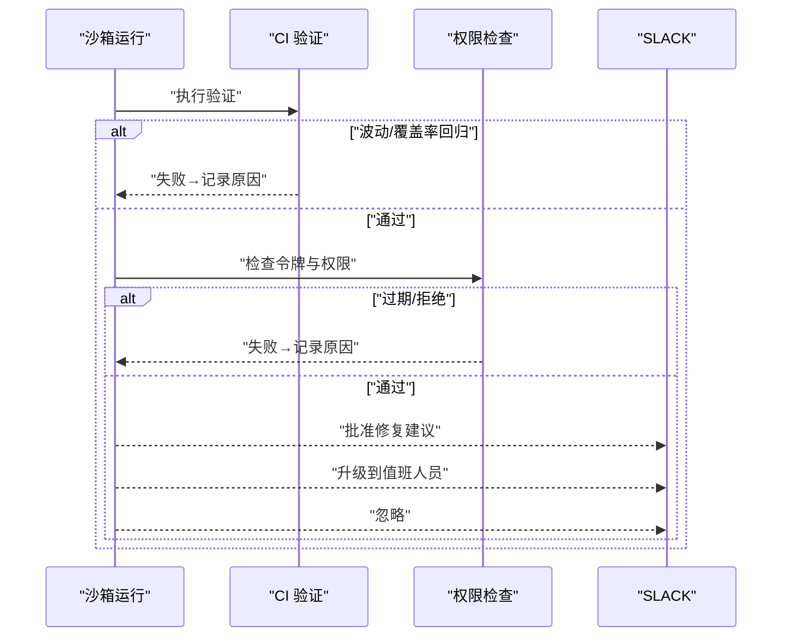
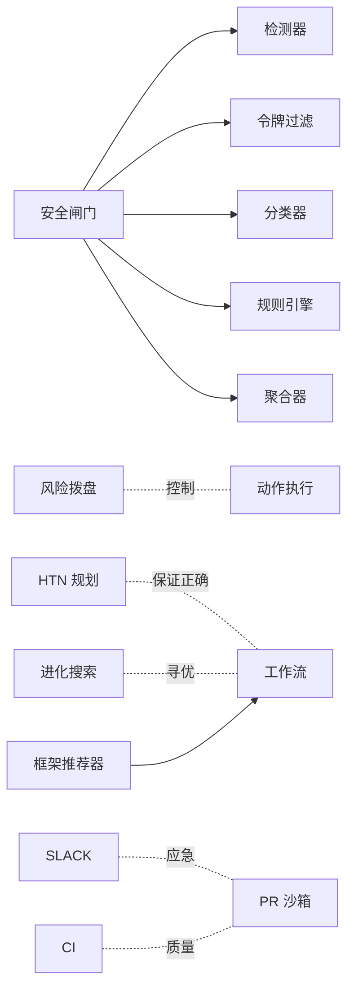

# AI控制颠覆与系统性风险

<cite>
**本文引用的文件**
- [guardrails-sandbox/backend/playground/modules/htn_evolutionary.py](file://guardrails-sandbox/backend/playground/modules/htn_evolutionary.py)
- [guardrails-sandbox/backend/playground/modules/framework_picker.py](file://guardrails-sandbox/backend/playground/modules/framework_picker.py)
- [phases/19-capstone-projects/87-end-to-end-safety-gate/docs/en.md](file://phases/19-capstone-projects/87-end-to-end-safety-gate/docs/en.md)
- [phases/19-capstone-projects/87-end-to-end-safety-gate/code/safety_gate.py](file://phases/19-capstone-projects/87-end-to-end-safety-gate/code/safety_gate.py)
- [site/figures-frontier.js](file://site/figures-frontier.js)
- [site/figures-agents-alignment.js](file://site/figures-agents-alignment.js)
- [site/data.js](file://site/data.js)
- [phases/19-capstone-projects/16-github-issue-to-pr-agent/code/main.py](file://phases/19-capstone-projects/16-github-issue-to-pr-agent/code/main.py)
- [phases/19-capstone-projects/06-devops-troubleshooting-agent/code/ts/src/blocks.ts](file://phases/19-capstone-projects/06-devops-troubleshooting-agent/code/ts/src/blocks.ts)
</cite>

## 目录
1. [引言](#引言)
2. [项目结构](#项目结构)
3. [核心组件](#核心组件)
4. [架构总览](#架构总览)
5. [详细组件分析](#详细组件分析)
6. [依赖分析](#依赖分析)
7. [性能考量](#性能考量)
8. [故障排查指南](#故障排查指南)
9. [结论](#结论)
10. [附录](#附录)

## 引言
本文件围绕“AI控制颠覆与系统性风险”主题，结合仓库中的安全治理、沙箱与防护、自动化流程与决策框架等实践，系统阐述以下内容：
- AI控制颠覆的概念与威胁等级：从输入过滤、生成过程监控到输出治理的三段式安全闸门，以及人类监督的“风险拨盘”理念。
- 系统性风险的特征与传播机制：通过多阶段安全闸门与跨域协作，降低级联效应与不可预测后果的风险。
- 风险评估与量化：基于信号聚合的确定性阈值策略，给出可追踪的请求轨迹与处置动作。
- 多层次防护体系：边界保护（输入/输出）、权限控制（令牌与策略）、应急响应（CI/SLACK 交互）。
- 跨领域协调与治理：框架选择器、外部评估与政策对比、社会层面风险审查。

## 项目结构
该项目以“教学阶段 + 实践工坊”的方式组织，涵盖数学基础、机器学习、深度学习、NLP、视觉、强化学习、大模型工程、多模态、工具协议、智能体工程、自主系统、多智能体与蜂群、基础设施与生产、伦理安全与对齐、以及多个端到端项目。与本主题密切相关的模块主要分布在：
- 安全与沙箱：guardrails-sandbox 后端 playground 模块
- 智能体与工作流：14/11 讲 HTN 与进化搜索、11/17 讲框架推荐器
- 安全闸门：capstone 项目 87 的端到端安全闸门文档与代码
- 可视化与演示：site 下的前端图表脚本
- 生产与应急：capstone 项目 16 的 PR 沙箱流程与 06 的 SLACK 应急响应

**图表来源**
- [guardrails-sandbox/backend/playground/modules/htn_evolutionary.py:1-192](file://guardrails-sandbox/backend/playground/modules/htn_evolutionary.py#L1-L192)
- [guardrails-sandbox/backend/playground/modules/framework_picker.py:1-153](file://guardrails-sandbox/backend/playground/modules/framework_picker.py#L1-L153)
- [phases/19-capstone-projects/87-end-to-end-safety-gate/docs/en.md:18-83](file://phases/19-capstone-projects/87-end-to-end-safety-gate/docs/en.md#L18-L83)
- [phases/19-capstone-projects/87-end-to-end-safety-gate/code/safety_gate.py:104-119](file://phases/19-capstone-projects/87-end-to-end-safety-gate/code/safety_gate.py#L104-L119)
- [site/figures-frontier.js:205-241](file://site/figures-frontier.js#L205-L241)
- [site/figures-agents-alignment.js:366-391](file://site/figures-agents-alignment.js#L366-L391)
- [phases/19-capstone-projects/16-github-issue-to-pr-agent/code/main.py:151-189](file://phases/19-capstone-projects/16-github-issue-to-pr-agent/code/main.py#L151-L189)
- [phases/19-capstone-projects/06-devops-troubleshooting-agent/code/ts/src/blocks.ts:1-60](file://phases/19-capstone-projects/06-devops-troubleshooting-agent/code/ts/src/blocks.ts#L1-L60)

**章节来源**
- [guardrails-sandbox/backend/playground/modules/htn_evolutionary.py:1-192](file://guardrails-sandbox/backend/playground/modules/htn_evolutionary.py#L1-L192)
- [guardrails-sandbox/backend/playground/modules/framework_picker.py:1-153](file://guardrails-sandbox/backend/playground/modules/framework_picker.py#L1-L153)
- [phases/19-capstone-projects/87-end-to-end-safety-gate/docs/en.md:18-83](file://phases/19-capstone-projects/87-end-to-end-safety-gate/docs/en.md#L18-L83)
- [site/figures-frontier.js:205-241](file://site/figures-frontier.js#L205-L241)
- [site/figures-agents-alignment.js:366-391](file://site/figures-agents-alignment.js#L366-L391)
- [phases/19-capstone-projects/16-github-issue-to-pr-agent/code/main.py:151-189](file://phases/19-capstone-projects/16-github-issue-to-pr-agent/code/main.py#L151-L189)
- [phases/19-capstone-projects/06-devops-troubleshooting-agent/code/ts/src/blocks.ts:1-60](file://phases/19-capstone-projects/06-devops-troubleshooting-agent/code/ts/src/blocks.ts#L1-L60)

## 核心组件
- 安全闸门（Safety Gate）：由预生成检测器、生成期流式过滤器、后生成分类器与规则引擎组成，采用信号聚合与确定性阈值进行处置。
- 风险拨盘（Autonomy Oversight）：以单一风险阈值控制低风险自动放行与高风险人工介入，避免“开关式”失控。
- HTN 规划与进化搜索：HTN 通过“前提→效果”的骨牌式执行保证正确性；进化搜索以可自动打分的适应度函数逼近最优。
- 框架推荐器：基于问题形状与需求特征，决策推荐 LangGraph/CrewAI/AutoGen/Agno/纯 Python。
- PR 沙箱流程与 SLACK 应急响应：在沙箱内完成 CI/覆盖率/权限校验，支持 SLACK 交互与人工审批。

**章节来源**
- [phases/19-capstone-projects/87-end-to-end-safety-gate/docs/en.md:18-83](file://phases/19-capstone-projects/87-end-to-end-safety-gate/docs/en.md#L18-L83)
- [site/figures-frontier.js:205-241](file://site/figures-frontier.js#L205-L241)
- [guardrails-sandbox/backend/playground/modules/htn_evolutionary.py:21-96](file://guardrails-sandbox/backend/playground/modules/htn_evolutionary.py#L21-L96)
- [guardrails-sandbox/backend/playground/modules/framework_picker.py:28-71](file://guardrails-sandbox/backend/playground/modules/framework_picker.py#L28-L71)
- [phases/19-capstone-projects/16-github-issue-to-pr-agent/code/main.py:151-189](file://phases/19-capstone-projects/16-github-issue-to-pr-agent/code/main.py#L151-L189)
- [phases/19-capstone-projects/06-devops-troubleshooting-agent/code/ts/src/blocks.ts:1-60](file://phases/19-capstone-projects/06-devops-troubleshooting-agent/code/ts/src/blocks.ts#L1-L60)

## 架构总览
下图展示了安全闸门的端到端流程：输入提示经预生成检测器判定，若高危直接拒绝；否则进入流式生成期的令牌过滤，必要时提前终止；完成后进行后生成分类与规则处理，最后聚合信号并执行最终动作，全程记录请求轨迹。

**图表来源**
- [phases/19-capstone-projects/87-end-to-end-safety-gate/docs/en.md:22-44](file://phases/19-capstone-projects/87-end-to-end-safety-gate/docs/en.md#L22-L44)
- [phases/19-capstone-projects/87-end-to-end-safety-gate/code/safety_gate.py:104-119](file://phases/19-capstone-projects/87-end-to-end-safety-gate/code/safety_gate.py#L104-L119)

## 详细组件分析

### 组件A：安全闸门（Safety Gate）
- 设计要点
  - 预生成检测器：对提示进行类别与置信度分析，标记触发项。
  - 生成期令牌过滤：缓冲若干块后扫描已知危险续写模式，命中则提前终止并标记。
  - 后生成分类与规则：对完整输出进行严重性分级与规则修复。
  - 聚合与处置：综合四个信号，采用确定性阈值表决定阻断/删减/警告/放行。
  - 可追踪性：每请求生成 RequestTrace，包含各阶段判定、最终动作与延迟。
- 风险控制
  - 将潜在破坏性内容在生成早期阻断，减少扩散与级联风险。
  - 通过阈值与信号聚合，平衡误报与漏报，避免“全有或全无”的极端策略。
- 适用场景
  - 高风险提示拦截、合规输出治理、可解释的处置日志。

**图表来源**
- [phases/19-capstone-projects/87-end-to-end-safety-gate/docs/en.md:22-44](file://phases/19-capstone-projects/87-end-to-end-safety-gate/docs/en.md#L22-L44)
- [phases/19-capstone-projects/87-end-to-end-safety-gate/code/safety_gate.py:104-119](file://phases/19-capstone-projects/87-end-to-end-safety-gate/code/safety_gate.py#L104-L119)

**章节来源**
- [phases/19-capstone-projects/87-end-to-end-safety-gate/docs/en.md:18-83](file://phases/19-capstone-projects/87-end-to-end-safety-gate/docs/en.md#L18-L83)
- [phases/19-capstone-projects/87-end-to-end-safety-gate/code/safety_gate.py:104-119](file://phases/19-capstone-projects/87-end-to-end-safety-gate/code/safety_gate.py#L104-L119)

### 组件B：风险拨盘（Autonomy Oversight）
- 设计要点
  - 将动作按风险度分级（如读文件、查询、写文件、执行命令、部署上线）。
  - 单一“自主度/风险拨盘”阈值：低于阈值的动作自动执行，高于阈值的动作升级至人工审批。
  - 可视化呈现：条形图显示通过/未通过数量，说明“拨盘越高越快、越低越可控”。
- 风险控制
  - 避免“全自动化”导致的灾难性级联；通过阈值动态调节速度与控制权。
  - 部署到生产应始终处于高位，确保关键动作的人类把关。

**图表来源**
- [site/figures-frontier.js:205-241](file://site/figures-frontier.js#L205-L241)

**章节来源**
- [site/figures-frontier.js:205-241](file://site/figures-frontier.js#L205-L241)

### 组件C：HTN 规划与进化搜索
- HTN（分层任务网络）
  - 以“前提→效果”的最小动作构建可执行序列，执行前严格检查前提，跳步/乱序被拦截，保证正确性。
  - AI 仅在无既成方法时回退并验证，验证通过后缓存，降低 LLM 调用成本。
- 进化搜索
  - 以可自动打分的适应度函数为目标，精英保留+变异迭代，逐步逼近最优。
  - 适用于可量化评分的优化问题；不适合诗歌/散文等主观创作。

**图表来源**
- [guardrails-sandbox/backend/playground/modules/htn_evolutionary.py:38-96](file://guardrails-sandbox/backend/playground/modules/htn_evolutionary.py#L38-L96)

**章节来源**
- [guardrails-sandbox/backend/playground/modules/htn_evolutionary.py:1-192](file://guardrails-sandbox/backend/playground/modules/htn_evolutionary.py#L1-L192)

### 组件D：框架推荐器（Framework Picker）
- 决策树依据问题形状与需求特征（类型化状态、并行扇出、人工中断、角色驱动、对话形状、会话记忆、崩溃恢复、LLM 调用次数）进行推荐。
- 在“≤2 次调用且无其它需求”时，推荐不使用框架，强调“无框架最快”。

**图表来源**
- [guardrails-sandbox/backend/playground/modules/framework_picker.py:28-71](file://guardrails-sandbox/backend/playground/modules/framework_picker.py#L28-L71)

**章节来源**
- [guardrails-sandbox/backend/playground/modules/framework_picker.py:1-153](file://guardrails-sandbox/backend/playground/modules/framework_picker.py#L1-L153)

### 组件E：PR 沙箱流程与 SLACK 应急响应
- PR 沙箱流程
  - 验证阶段：模拟 CI，引入少量随机波动与覆盖率回归，失败则终止并记录原因。
  - 权限检查：在打开 PR 前检查令牌有效期与权限范围，防止越权。
  - 状态机：失败/验证/拉取请求/DONE 等状态流转。
- SLACK 应急响应
  - 将故障假设、证据与修复建议以结构化 blocks 输出，支持“批准/升级/忽略”按钮，便于快速处置。

**图表来源**
- [phases/19-capstone-projects/16-github-issue-to-pr-agent/code/main.py:151-189](file://phases/19-capstone-projects/16-github-issue-to-pr-agent/code/main.py#L151-L189)
- [phases/19-capstone-projects/06-devops-troubleshooting-agent/code/ts/src/blocks.ts:1-60](file://phases/19-capstone-projects/06-devops-troubleshooting-agent/code/ts/src/blocks.ts#L1-L60)

**章节来源**
- [phases/19-capstone-projects/16-github-issue-to-pr-agent/code/main.py:151-189](file://phases/19-capstone-projects/16-github-issue-to-pr-agent/code/main.py#L151-L189)
- [phases/19-capstone-projects/06-devops-troubleshooting-agent/code/ts/src/blocks.ts:1-60](file://phases/19-capstone-projects/06-devops-troubleshooting-agent/code/ts/src/blocks.ts#L1-L60)

## 依赖分析
- 组件耦合
  - 安全闸门内部模块（检测器、令牌过滤、分类器、规则引擎）通过聚合器耦合，形成强内聚弱耦合的流水线。
  - 风险拨盘与安全闸门在“阈值控制”层面互补：前者控制动作的自动化程度，后者控制内容的生成与输出。
  - HTN 与进化搜索分别面向“正确性保证”和“最优解逼近”，在复杂工作流中可配合使用。
  - 框架推荐器为智能体工程提供“问题形状→框架选择”的决策依据，降低架构设计风险。
- 外部依赖与集成
  - SLACK 与 CI 系统作为外部集成点，提供应急响应与质量保障。
  - 数据与可视化脚本（site/data.js、figures-*.js）支撑治理与政策对比、外部评估等场景。

**图表来源**
- [phases/19-capstone-projects/87-end-to-end-safety-gate/docs/en.md:22-44](file://phases/19-capstone-projects/87-end-to-end-safety-gate/docs/en.md#L22-L44)
- [site/figures-frontier.js:205-241](file://site/figures-frontier.js#L205-L241)
- [guardrails-sandbox/backend/playground/modules/htn_evolutionary.py:21-96](file://guardrails-sandbox/backend/playground/modules/htn_evolutionary.py#L21-L96)
- [guardrails-sandbox/backend/playground/modules/framework_picker.py:28-71](file://guardrails-sandbox/backend/playground/modules/framework_picker.py#L28-L71)
- [phases/19-capstone-projects/16-github-issue-to-pr-agent/code/main.py:151-189](file://phases/19-capstone-projects/16-github-issue-to-pr-agent/code/main.py#L151-L189)
- [phases/19-capstone-projects/06-devops-troubleshooting-agent/code/ts/src/blocks.ts:1-60](file://phases/19-capstone-projects/06-devops-troubleshooting-agent/code/ts/src/blocks.ts#L1-L60)

**章节来源**
- [site/data.js:15944-15977](file://site/data.js#L15944-L15977)
- [site/figures-agents-alignment.js:366-391](file://site/figures-agents-alignment.js#L366-L391)

## 性能考量
- 安全闸门
  - 流式令牌过滤采用缓冲扫描，命中即提前终止，降低下游处理成本。
  - 聚合器为确定性阈值表，计算开销低，适合高吞吐场景。
- 风险拨盘
  - 单阈值比较，渲染与交互开销极低，适合实时演示与策略调整。
- HTN 与进化搜索
  - HTN 执行路径短、检查前置条件即可，适合合规/审批等“绝不能出错”的流程。
  - 进化搜索需可自动打分函数，收敛代数有限，适合有明确目标的优化问题。
- 框架推荐器
  - 决策树逻辑轻量，适合在开发/评审阶段快速评估架构选择。

[本节为通用指导，无需具体文件分析]

## 故障排查指南
- 安全闸门
  - 若出现“提前终止但未阻断”，检查令牌过滤的触发模式与阈值配置。
  - 若“聚合器误判”，核查信号权重与阈值表，必要时引入异步流式变体并控制延迟预算。
- 风险拨盘
  - 若大量动作被提升至人工审批，适当提高拨盘阈值；若频繁发生意外，降低阈值。
- PR 沙箱
  - 若 CI 波动导致误判失败，增加容差或引入重试；若权限检查失败，检查令牌有效期与授权范围。
- SLACK 应急
  - 若 blocks 结构异常，核对字段与样式；若按钮无响应，检查 action_id 与回调处理。

**章节来源**
- [phases/19-capstone-projects/87-end-to-end-safety-gate/docs/en.md:64-83](file://phases/19-capstone-projects/87-end-to-end-safety-gate/docs/en.md#L64-L83)
- [phases/19-capstone-projects/16-github-issue-to-pr-agent/code/main.py:172-184](file://phases/19-capstone-projects/16-github-issue-to-pr-agent/code/main.py#L172-L184)
- [phases/19-capstone-projects/06-devops-troubleshooting-agent/code/ts/src/blocks.ts:1-60](file://phases/19-capstone-projects/06-devops-troubleshooting-agent/code/ts/src/blocks.ts#L1-L60)

## 结论
本项目通过“安全闸门 + 风险拨盘 + HTN/进化搜索 + 框架推荐 + PR 沙箱 + SLACK 应急”的多层次体系，系统性地应对 AI 控制颠覆与系统性风险：
- 在输入/生成/输出三个阶段建立“检测-过滤-分类-规则-聚合”的闭环，降低不可控输出的传播。
- 以单一风险阈值实现“速度与控制”的平衡，避免极端自动化带来的级联效应。
- 以 HTN 保证正确性、以进化搜索逼近最优，为复杂工作流提供可靠与高效的执行路径。
- 以框架推荐器与外部评估/政策对比，支撑治理与规模化扩展。

[本节为总结，无需具体文件分析]

## 附录
- 相关技能与治理资源
  - 社会层面风险审查、跨政策对比、时间视野解读等技能与资料在 site/data.js 中列出，可用于部署前的社会风险评估与合规审查。

**章节来源**
- [site/data.js:15944-15977](file://site/data.js#L15944-L15977)