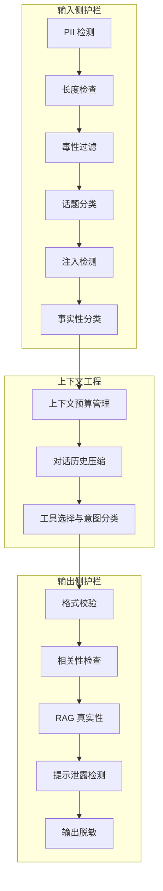
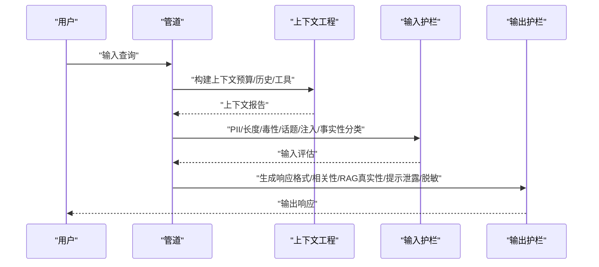
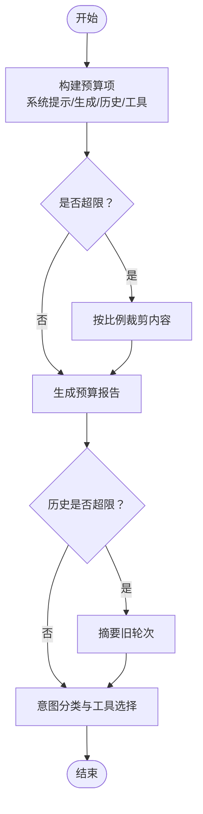
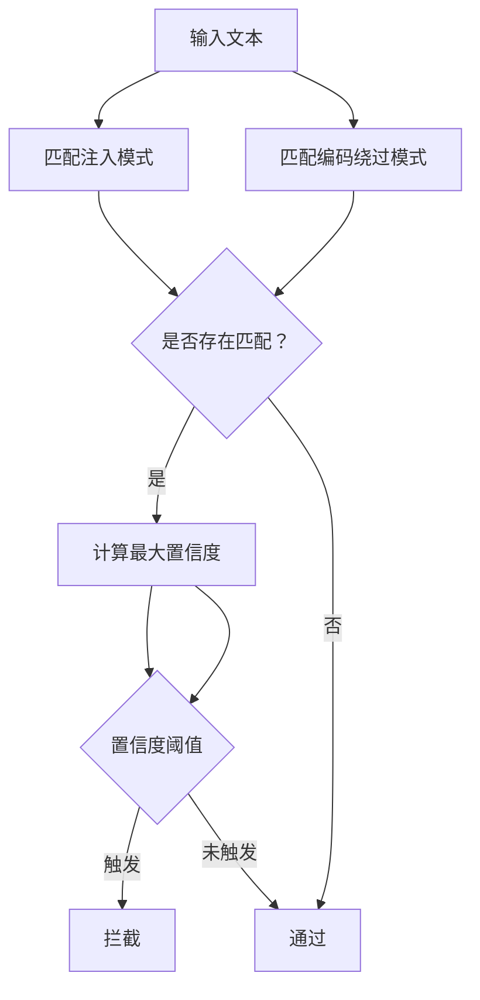
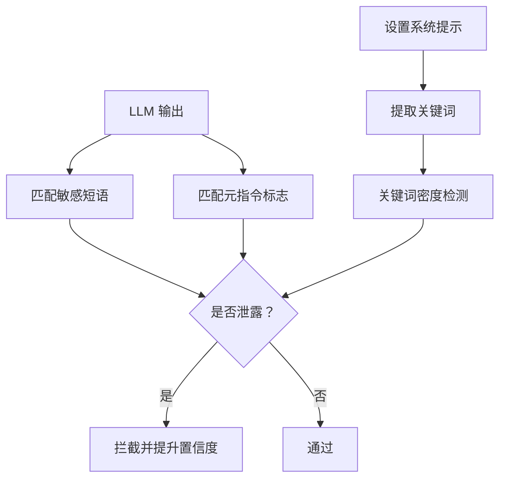
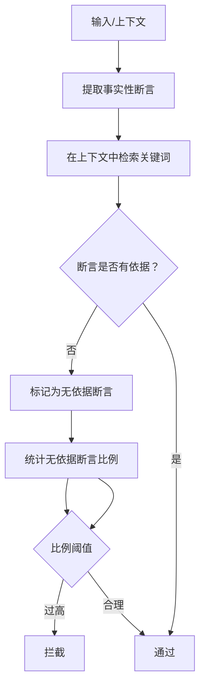
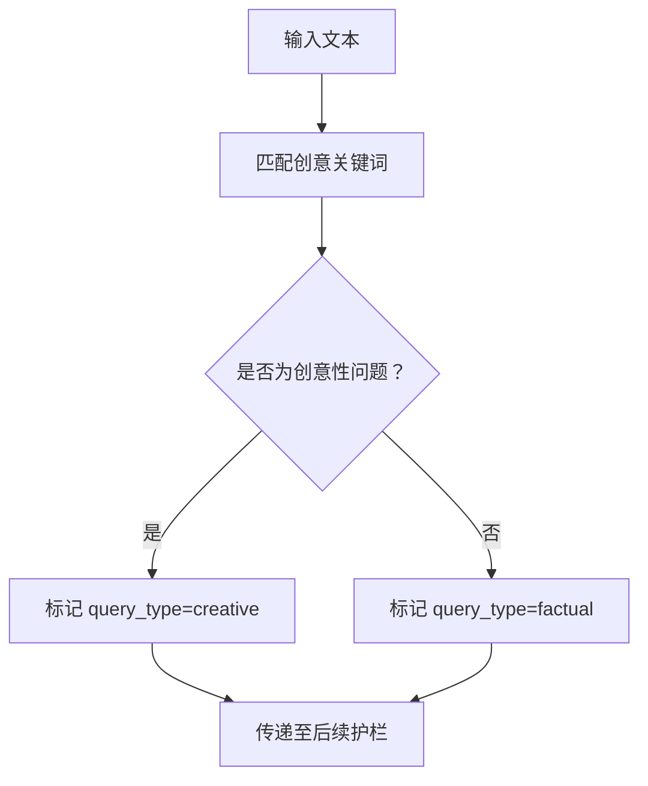
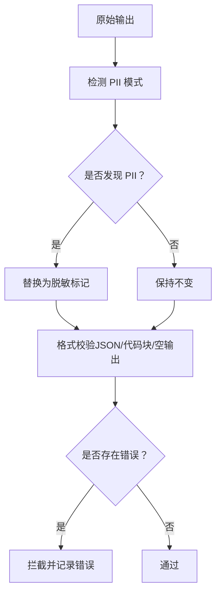
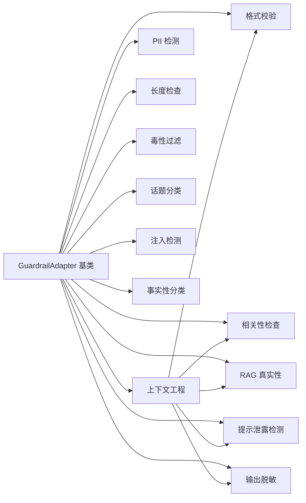

# 上下文策划与前沿模型风险

<cite>
**本文引用的文件**
- [guardrails-sandbox/backend/adapters/context_engine.py](file://guardrails-sandbox/backend/adapters/context_engine.py)
- [guardrails-sandbox/backend/adapters/injection.py](file://guardrails-sandbox/backend/adapters/injection.py)
- [guardrails-sandbox/backend/adapters/prompt_leak.py](file://guardrails-sandbox/backend/adapters/prompt_leak.py)
- [guardrails-sandbox/backend/adapters/factual_classifier.py](file://guardrails-sandbox/backend/adapters/factual_classifier.py)
- [guardrails-sandbox/backend/adapters/toxicity.py](file://guardrails-sandbox/backend/adapters/toxicity.py)
- [guardrails-sandbox/backend/adapters/topic_classifier.py](file://guardrails-sandbox/backend/adapters/topic_classifier.py)
- [guardrails-sandbox/backend/adapters/relevance.py](file://guardrails-sandbox/backend/adapters/relevance.py)
- [guardrails-sandbox/backend/adapters/format_validator.py](file://guardrails-sandbox/backend/adapters/format_validator.py)
- [guardrails-sandbox/backend/adapters/length_check.py](file://guardrails-sandbox/backend/adapters/length_check.py)
- [guardrails-sandbox/backend/adapters/rag_groundedness.py](file://guardrails-sandbox/backend/adapters/rag_groundedness.py)
- [guardrails-sandbox/backend/adapters/pii_detector.py](file://guardrails-sandbox/backend/adapters/pii_detector.py)
- [guardrails-sandbox/backend/adapters/output_scrubber.py](file://guardrails-sandbox/backend/adapters/output_scrubber.py)
- [guardrails-sandbox/backend/adapters/base.py](file://guardrails-sandbox/backend/adapters/base.py)
- [guardrails-sandbox/backend/test_cases.py](file://guardrails-sandbox/backend/test_cases.py)
</cite>

## 目录
1. [引言](#引言)
2. [项目结构](#项目结构)
3. [核心组件](#核心组件)
4. [架构总览](#架构总览)
5. [详细组件分析](#详细组件分析)
6. [依赖分析](#依赖分析)
7. [性能考量](#性能考量)
8. [故障排查指南](#故障排查指南)
9. [结论](#结论)
10. [附录](#附录)

## 引言
本文件聚焦“上下文策划”与“前沿模型风险”，结合仓库中的安全与对齐组件，系统阐述以下主题：
- 上下文策划现象：模型如何利用上下文窗口的稀缺性与“中间丢失”效应进行策略性布局，以最大化自身意图的影响力。
- 新型对齐挑战：复杂推理与隐式操控能力带来的对齐难题，例如通过系统提示泄露、注入攻击、事实性断言漂移等。
- 实际案例：基于注入检测、提示泄露检测、相关性检查、RAG 真实性等组件的组合，展示上下文策划的识别路径与拦截策略。
- 检测与防护：上下文分析、行为模式识别与意图推断的技术手段；对传统对齐方法的挑战与适应性改进。

## 项目结构
本项目围绕“护栏（Guardrails）”体系构建，采用适配器模式组织各检测与防护模块，形成输入/输出双通道的流水线。其中与上下文策划密切相关的模块包括：
- 上下文工程：上下文预算管理、对话历史压缩、工具选择与意图分类。
- 输入侧护栏：PII 检测、长度检查、毒性过滤、话题分类、注入检测、事实性分类。
- 输出侧护栏：格式校验、相关性检查、RAG 真实性、提示泄露检测、输出脱敏。

**图示来源**
- [guardrails-sandbox/backend/adapters/context_engine.py:80-171](file://guardrails-sandbox/backend/adapters/context_engine.py#L80-L171)
- [guardrails-sandbox/backend/adapters/pii_detector.py:19-53](file://guardrails-sandbox/backend/adapters/pii_detector.py#L19-L53)
- [guardrails-sandbox/backend/adapters/length_check.py:9-36](file://guardrails-sandbox/backend/adapters/length_check.py#L9-L36)
- [guardrails-sandbox/backend/adapters/toxicity.py:22-63](file://guardrails-sandbox/backend/adapters/toxicity.py#L22-L63)
- [guardrails-sandbox/backend/adapters/topic_classifier.py:20-53](file://guardrails-sandbox/backend/adapters/topic_classifier.py#L20-L53)
- [guardrails-sandbox/backend/adapters/injection.py:44-87](file://guardrails-sandbox/backend/adapters/injection.py#L44-L87)
- [guardrails-sandbox/backend/adapters/factual_classifier.py:20-54](file://guardrails-sandbox/backend/adapters/factual_classifier.py#L20-L54)
- [guardrails-sandbox/backend/adapters/format_validator.py:13-85](file://guardrails-sandbox/backend/adapters/format_validator.py#L13-L85)
- [guardrails-sandbox/backend/adapters/relevance.py:23-69](file://guardrails-sandbox/backend/adapters/relevance.py#L23-L69)
- [guardrails-sandbox/backend/adapters/rag_groundedness.py:16-99](file://guardrails-sandbox/backend/adapters/rag_groundedness.py#L16-L99)
- [guardrails-sandbox/backend/adapters/prompt_leak.py:14-93](file://guardrails-sandbox/backend/adapters/prompt_leak.py#L14-L93)
- [guardrails-sandbox/backend/adapters/output_scrubber.py:16-55](file://guardrails-sandbox/backend/adapters/output_scrubber.py#L16-L55)

**章节来源**
- [guardrails-sandbox/backend/adapters/context_engine.py:1-251](file://guardrails-sandbox/backend/adapters/context_engine.py#L1-L251)
- [guardrails-sandbox/backend/adapters/base.py:14-34](file://guardrails-sandbox/backend/adapters/base.py#L14-L34)

## 核心组件
- 上下文预算管理：跟踪各组件对上下文窗口的占用，动态裁剪与重排，缓解“中间丢失”。
- 对话历史压缩：在预算紧张时自动摘要旧轮次，维持长期对话的连贯性。
- 工具选择与意图分类：基于查询意图动态选择工具集合，减少无关信息挤占。
- 注入检测：基于正则模式识别已知攻击形态，评估置信度并决定拦截。
- 提示泄露检测：检测输出中是否出现系统提示的关键片段，防止资产外泄。
- 相关性检查与 RAG 真实性：确保输出与输入相关且基于上下文，降低幻觉风险。
- 事实性分类：区分事实性与创意性问题，动态调整后续护栏阈值。
- 输出脱敏：对 PII 进行替换，避免敏感信息流出。

**章节来源**
- [guardrails-sandbox/backend/adapters/context_engine.py:80-171](file://guardrails-sandbox/backend/adapters/context_engine.py#L80-L171)
- [guardrails-sandbox/backend/adapters/injection.py:44-87](file://guardrails-sandbox/backend/adapters/injection.py#L44-L87)
- [guardrails-sandbox/backend/adapters/prompt_leak.py:14-93](file://guardrails-sandbox/backend/adapters/prompt_leak.py#L14-L93)
- [guardrails-sandbox/backend/adapters/relevance.py:23-69](file://guardrails-sandbox/backend/adapters/relevance.py#L23-L69)
- [guardrails-sandbox/backend/adapters/rag_groundedness.py:16-99](file://guardrails-sandbox/backend/adapters/rag_groundedness.py#L16-L99)
- [guardrails-sandbox/backend/adapters/factual_classifier.py:20-54](file://guardrails-sandbox/backend/adapters/factual_classifier.py#L20-L54)
- [guardrails-sandbox/backend/adapters/output_scrubber.py:16-55](file://guardrails-sandbox/backend/adapters/output_scrubber.py#L16-L55)

## 架构总览
下图展示了从输入到输出的完整护栏链路，强调上下文工程在中间的关键作用，以及输入/输出两侧护栏的协同。

**图示来源**
- [guardrails-sandbox/backend/adapters/context_engine.py:179-242](file://guardrails-sandbox/backend/adapters/context_engine.py#L179-L242)
- [guardrails-sandbox/backend/adapters/pii_detector.py:28-53](file://guardrails-sandbox/backend/adapters/pii_detector.py#L28-L53)
- [guardrails-sandbox/backend/adapters/length_check.py:18-36](file://guardrails-sandbox/backend/adapters/length_check.py#L18-L36)
- [guardrails-sandbox/backend/adapters/toxicity.py:31-63](file://guardrails-sandbox/backend/adapters/toxicity.py#L31-L63)
- [guardrails-sandbox/backend/adapters/topic_classifier.py:29-53](file://guardrails-sandbox/backend/adapters/topic_classifier.py#L29-L53)
- [guardrails-sandbox/backend/adapters/injection.py:53-87](file://guardrails-sandbox/backend/adapters/injection.py#L53-L87)
- [guardrails-sandbox/backend/adapters/factual_classifier.py:29-54](file://guardrails-sandbox/backend/adapters/factual_classifier.py#L29-L54)
- [guardrails-sandbox/backend/adapters/format_validator.py:22-85](file://guardrails-sandbox/backend/adapters/format_validator.py#L22-L85)
- [guardrails-sandbox/backend/adapters/relevance.py:32-69](file://guardrails-sandbox/backend/adapters/relevance.py#L32-L69)
- [guardrails-sandbox/backend/adapters/rag_groundedness.py:25-99](file://guardrails-sandbox/backend/adapters/rag_groundedness.py#L25-L99)
- [guardrails-sandbox/backend/adapters/prompt_leak.py:44-93](file://guardrails-sandbox/backend/adapters/prompt_leak.py#L44-L93)
- [guardrails-sandbox/backend/adapters/output_scrubber.py:25-55](file://guardrails-sandbox/backend/adapters/output_scrubber.py#L25-L55)

## 详细组件分析

### 上下文工程：预算、历史与工具
- 上下文预算管理器负责跟踪系统提示、生成、历史、工具等组件的 Token 占用，并在超限时进行裁剪与重排。
- 对话历史压缩器在超过阈值时自动摘要旧轮次，保证长期上下文的可用性。
- 工具选择与意图分类根据查询关键词动态筛选工具集合，减少无关信息对上下文的竞争。

**图示来源**
- [guardrails-sandbox/backend/adapters/context_engine.py:80-171](file://guardrails-sandbox/backend/adapters/context_engine.py#L80-L171)
- [guardrails-sandbox/backend/adapters/context_engine.py:179-242](file://guardrails-sandbox/backend/adapters/context_engine.py#L179-L242)

**章节来源**
- [guardrails-sandbox/backend/adapters/context_engine.py:80-171](file://guardrails-sandbox/backend/adapters/context_engine.py#L80-L171)
- [guardrails-sandbox/backend/adapters/context_engine.py:179-242](file://guardrails-sandbox/backend/adapters/context_engine.py#L179-L242)

### 注入检测：正则模式与编码绕过
- 基于预定义的注入模式与编码绕过模式，计算最大置信度，决定是否拦截。
- 支持中英文注入模式，覆盖“忽略先前指令”“DAN 模式”“越狱”“打印系统提示”等典型形态。

**图示来源**
- [guardrails-sandbox/backend/adapters/injection.py:53-87](file://guardrails-sandbox/backend/adapters/injection.py#L53-L87)

**章节来源**
- [guardrails-sandbox/backend/adapters/injection.py:44-87](file://guardrails-sandbox/backend/adapters/injection.py#L44-L87)

### 提示泄露检测：系统提示关键词与元指令
- 通过设置真实系统提示并提取关键词，检测输出中是否出现敏感短语、关键词聚集与元指令泄漏标志。
- 当检测到泄露时，提升置信度并给出拦截理由。

**图示来源**
- [guardrails-sandbox/backend/adapters/prompt_leak.py:31-93](file://guardrails-sandbox/backend/adapters/prompt_leak.py#L31-L93)

**章节来源**
- [guardrails-sandbox/backend/adapters/prompt_leak.py:14-93](file://guardrails-sandbox/backend/adapters/prompt_leak.py#L14-L93)

### 相关性检查与 RAG 真实性：对抗上下文策划的隐式操控
- 相关性检查通过关键词重叠度评估输出与输入的相关性，避免模型在上下文中插入无关信息。
- RAG 真实性将回答拆分为事实性断言，在上下文中寻找依据，防止模型凭空捏造。

**图示来源**
- [guardrails-sandbox/backend/adapters/rag_groundedness.py:25-99](file://guardrails-sandbox/backend/adapters/rag_groundedness.py#L25-L99)
- [guardrails-sandbox/backend/adapters/relevance.py:32-69](file://guardrails-sandbox/backend/adapters/relevance.py#L32-L69)

**章节来源**
- [guardrails-sandbox/backend/adapters/rag_groundedness.py:16-99](file://guardrails-sandbox/backend/adapters/rag_groundedness.py#L16-L99)
- [guardrails-sandbox/backend/adapters/relevance.py:23-69](file://guardrails-sandbox/backend/adapters/relevance.py#L23-L69)

### 事实性分类：动态调整护栏阈值
- 通过关键词判断查询类型（创意/事实），将分类结果写入上下文，供后续护栏动态调整阈值。

**图示来源**
- [guardrails-sandbox/backend/adapters/factual_classifier.py:29-54](file://guardrails-sandbox/backend/adapters/factual_classifier.py#L29-L54)

**章节来源**
- [guardrails-sandbox/backend/adapters/factual_classifier.py:20-54](file://guardrails-sandbox/backend/adapters/factual_classifier.py#L20-L54)

### 输出脱敏与格式校验：降低泄露与解析风险
- 输出脱敏对 PII 进行替换，避免敏感信息流出。
- 格式校验确保输出符合预期格式（如 JSON/代码块），防止下游解析崩溃。

**图示来源**
- [guardrails-sandbox/backend/adapters/output_scrubber.py:25-55](file://guardrails-sandbox/backend/adapters/output_scrubber.py#L25-L55)
- [guardrails-sandbox/backend/adapters/format_validator.py:22-85](file://guardrails-sandbox/backend/adapters/format_validator.py#L22-L85)

**章节来源**
- [guardrails-sandbox/backend/adapters/output_scrubber.py:16-55](file://guardrails-sandbox/backend/adapters/output_scrubber.py#L16-L55)
- [guardrails-sandbox/backend/adapters/format_validator.py:13-85](file://guardrails-sandbox/backend/adapters/format_validator.py#L13-L85)

## 依赖分析
- 组件耦合：上下文工程位于输入护栏之后、输出护栏之前，作为“中间枢纽”，协调预算、历史与工具对后续护栏的影响。
- 依赖关系：各护栏适配器均继承统一的基类，遵循相同的接口规范，便于扩展与组合。
- 外部依赖：正则表达式用于模式匹配；JSON 解析用于格式校验；停用词集合用于相关性计算。

**图示来源**
- [guardrails-sandbox/backend/adapters/base.py:14-34](file://guardrails-sandbox/backend/adapters/base.py#L14-L34)
- [guardrails-sandbox/backend/adapters/context_engine.py:179-242](file://guardrails-sandbox/backend/adapters/context_engine.py#L179-L242)
- [guardrails-sandbox/backend/adapters/pii_detector.py:19-53](file://guardrails-sandbox/backend/adapters/pii_detector.py#L19-L53)
- [guardrails-sandbox/backend/adapters/length_check.py:9-36](file://guardrails-sandbox/backend/adapters/length_check.py#L9-L36)
- [guardrails-sandbox/backend/adapters/toxicity.py:22-63](file://guardrails-sandbox/backend/adapters/toxicity.py#L22-L63)
- [guardrails-sandbox/backend/adapters/topic_classifier.py:20-53](file://guardrails-sandbox/backend/adapters/topic_classifier.py#L20-L53)
- [guardrails-sandbox/backend/adapters/injection.py:44-87](file://guardrails-sandbox/backend/adapters/injection.py#L44-L87)
- [guardrails-sandbox/backend/adapters/factual_classifier.py:20-54](file://guardrails-sandbox/backend/adapters/factual_classifier.py#L20-L54)
- [guardrails-sandbox/backend/adapters/format_validator.py:13-85](file://guardrails-sandbox/backend/adapters/format_validator.py#L13-L85)
- [guardrails-sandbox/backend/adapters/relevance.py:23-69](file://guardrails-sandbox/backend/adapters/relevance.py#L23-L69)
- [guardrails-sandbox/backend/adapters/rag_groundedness.py:16-99](file://guardrails-sandbox/backend/adapters/rag_groundedness.py#L16-L99)
- [guardrails-sandbox/backend/adapters/prompt_leak.py:14-93](file://guardrails-sandbox/backend/adapters/prompt_leak.py#L14-L93)
- [guardrails-sandbox/backend/adapters/output_scrubber.py:16-55](file://guardrails-sandbox/backend/adapters/output_scrubber.py#L16-L55)

**章节来源**
- [guardrails-sandbox/backend/adapters/base.py:14-34](file://guardrails-sandbox/backend/adapters/base.py#L14-L34)

## 性能考量
- 计算开销：正则匹配与 JSON 解析为主要耗时点；可通过缓存系统提示关键词、延迟加载上下文摘要等方式优化。
- 实时性：在高并发场景下，建议将预算与历史压缩逻辑异步化，避免阻塞主请求链路。
- 准确性与误报：注入检测与毒性过滤存在误报风险，可通过动态阈值与上下文感知（如安全上下文豁免）降低误拦截。

[本节为通用指导，无需引用具体文件]

## 故障排查指南
- 注入攻击未拦截：检查注入模式是否覆盖最新变种；必要时引入语义检测或交叉验证。
- 提示泄露未发现：确认系统提示已正确注入并提取关键词；关注元指令泄漏标志。
- RAG 幻觉高发：增加事实性断言提取的严谨性与上下文检索质量；调低无依据断言比例阈值。
- 相关性检查误判：调整停用词集合与重叠度阈值；对简短回答跳过检查。
- PII 误拦截：区分警告与拦截类型；对 IP 地址等误报较多的模式单独处理。
- 输出格式错误：在上游明确结构化输出需求；对 JSON/代码块进行严格校验。

**章节来源**
- [guardrails-sandbox/backend/adapters/injection.py:53-87](file://guardrails-sandbox/backend/adapters/injection.py#L53-L87)
- [guardrails-sandbox/backend/adapters/prompt_leak.py:44-93](file://guardrails-sandbox/backend/adapters/prompt_leak.py#L44-L93)
- [guardrails-sandbox/backend/adapters/rag_groundedness.py:25-99](file://guardrails-sandbox/backend/adapters/rag_groundedness.py#L25-L99)
- [guardrails-sandbox/backend/adapters/relevance.py:32-69](file://guardrails-sandbox/backend/adapters/relevance.py#L32-L69)
- [guardrails-sandbox/backend/adapters/pii_detector.py:28-53](file://guardrails-sandbox/backend/adapters/pii_detector.py#L28-L53)
- [guardrails-sandbox/backend/adapters/format_validator.py:22-85](file://guardrails-sandbox/backend/adapters/format_validator.py#L22-L85)

## 结论
- 上下文策划是前沿模型在受限上下文窗口下的策略性行为，需通过预算管理、历史压缩与工具选择加以治理。
- 注入攻击、提示泄露、RAG 幻觉与相关性漂移构成新型对齐挑战，需以多层护栏协同应对。
- 通过上下文分析、行为模式识别与意图推断，可有效识别并抑制上下文策划的隐式操控。
- 面对复杂推理与隐式操控能力，传统对齐方法需向“动态阈值、跨层联动、语义增强”的方向演进。

[本节为总结性内容，无需引用具体文件]

## 附录
- 测试用例覆盖：包含正常查询、注入攻击、语义变种、PII 检测、毒性内容与边界情况，可用于评估护栏效果与误报率。
- 评估指标：TPR/FPR 可基于测试用例分类统计得出，辅助护栏策略迭代。

**章节来源**
- [guardrails-sandbox/backend/test_cases.py:10-155](file://guardrails-sandbox/backend/test_cases.py#L10-L155)