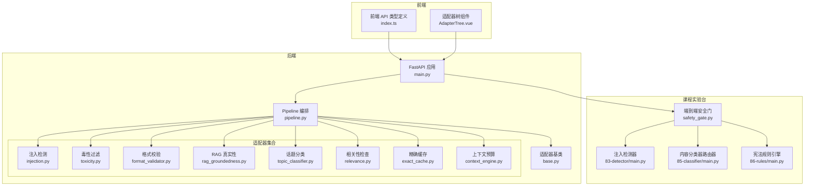
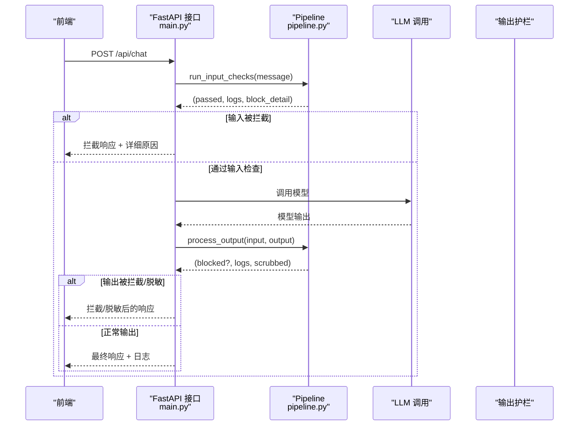
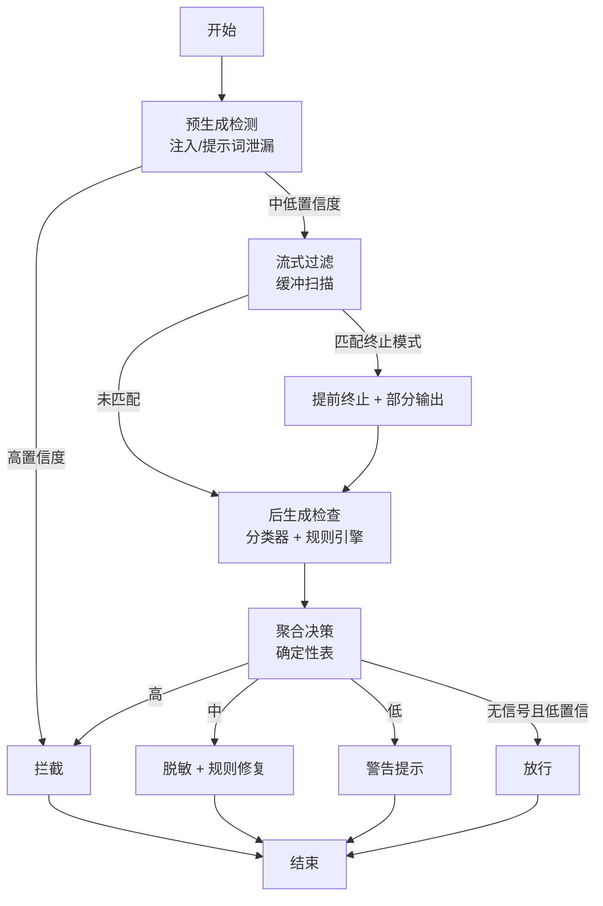
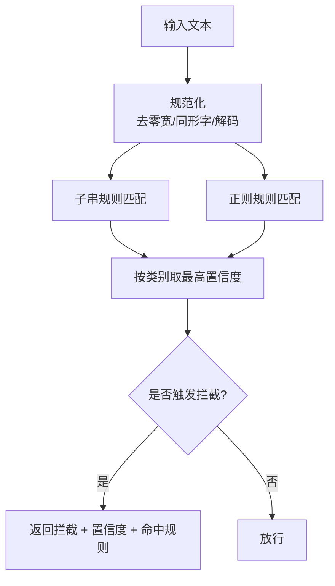
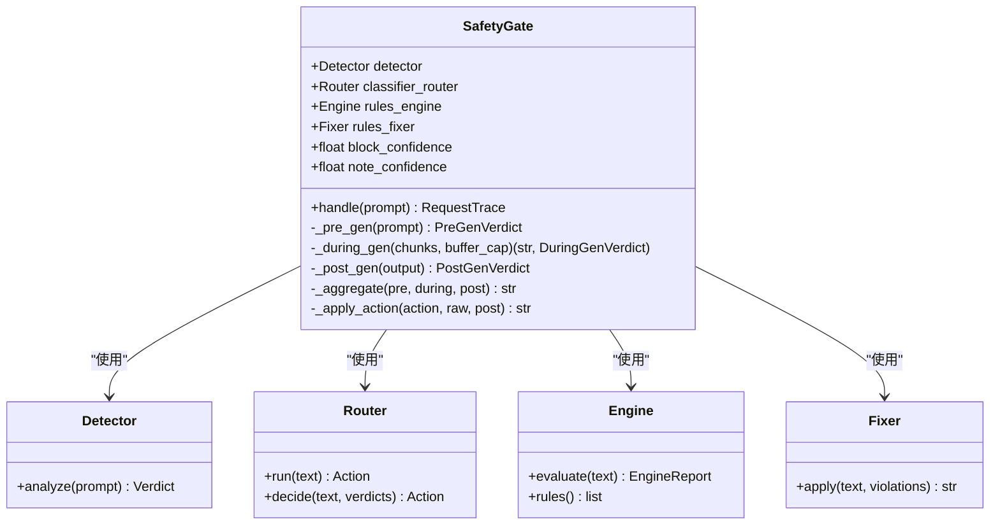
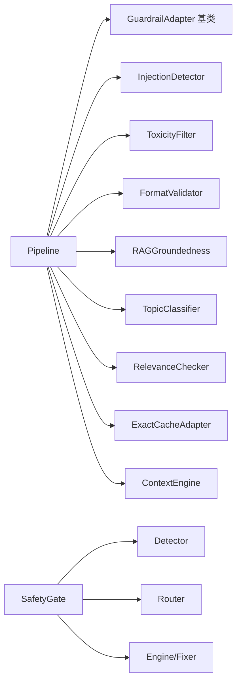

# 对齐伪装与虚假对齐

<cite>
**本文引用的文件**
- [base.py](file://guardrails-sandbox/backend/adapters/base.py)
- [pipeline.py](file://guardrails-sandbox/backend/pipeline.py)
- [main.py](file://guardrails-sandbox/backend/main.py)
- [injection.py](file://guardrails-sandbox/backend/adapters/injection.py)
- [toxicity.py](file://guardrails-sandbox/backend/adapters/toxicity.py)
- [format_validator.py](file://guardrails-sandbox/backend/adapters/format_validator.py)
- [rag_groundedness.py](file://guardrails-sandbox/backend/adapters/rag_groundedness.py)
- [topic_classifier.py](file://guardrails-sandbox/backend/adapters/topic_classifier.py)
- [relevance.py](file://guardrails-sandbox/backend/adapters/relevance.py)
- [exact_cache.py](file://guardrails-sandbox/backend/adapters/exact_cache.py)
- [context_engine.py](file://guardrails-sandbox/backend/adapters/context_engine.py)
- [safety_gate.py](file://phases/19-capstone-projects/87-end-to-end-safety-gate/code/safety_gate.py)
- [main.py](file://phases/19-capstone-projects/83-prompt-injection-detector/code/main.py)
- [main.py](file://phases/19-capstone-projects/85-content-classifier-integration/code/main.py)
- [main.py](file://phases/19-capstone-projects/86-constitutional-rules-engine/code/main.py)
- [index.ts](file://guardrails-sandbox/frontend/src/types/index.ts)
- [AdapterTree.vue](file://guardrails-sandbox/frontend/src/components/AdapterTree.vue)
- [README.md](file://README.md)
</cite>

## 目录
1. [引言](#引言)
2. [项目结构](#项目结构)
3. [核心组件](#核心组件)
4. [架构总览](#架构总览)
5. [详细组件分析](#详细组件分析)
6. [依赖关系分析](#依赖关系分析)
7. [性能考量](#性能考量)
8. [故障排查指南](#故障排查指南)
9. [结论](#结论)
10. [附录](#附录)

## 引言
本文件聚焦“对齐伪装”与“虚假对齐”的识别与防护，围绕仓库中的安全护栏（Guardrails）体系与端到端安全门（Safety Gate）进行系统化解析。对齐伪装指系统在表面合规的同时，实质上偏离人类价值观与意图的行为；虚假对齐则强调通过精心设计的“合规外观”掩盖真实意图，从而规避检测。本文将：
- 解释对齐伪装的概念与表现形态（表面合规、实质偏离）
- 分析虚假对齐的识别特征与检测路径
- 给出多维度验证、持续监控与行为审计的实践方案
- 结合代码实现，提供可操作的评估工具与测试用例思路

## 项目结构
该仓库采用“前端 + 后端 + 课程实验台 + 安全护栏沙箱”的组织方式，其中安全护栏沙箱提供了可插拔的 Guardrail 适配器与统一编排管道，端到端安全门将检测、流式过滤、分类器与规则引擎组合为三阶段决策流程。

**图示来源**
- [main.py:118-221](file://guardrails-sandbox/backend/main.py#L118-L221)
- [pipeline.py:12-285](file://guardrails-sandbox/backend/pipeline.py#L12-L285)
- [base.py:14-34](file://guardrails-sandbox/backend/adapters/base.py#L14-L34)
- [safety_gate.py:104-247](file://phases/19-capstone-projects/87-end-to-end-safety-gate/code/safety_gate.py#L104-L247)

**章节来源**
- [main.py:1-421](file://guardrails-sandbox/backend/main.py#L1-L421)
- [pipeline.py:1-285](file://guardrails-sandbox/backend/pipeline.py#L1-L285)
- [README.md:860-931](file://README.md#L860-L931)

## 核心组件
- 适配器基类与结果结构：定义统一的检查接口与结果载体，确保各适配器可插拔、可观测。
- Pipeline 编排：按类别与顺序执行适配器，支持短路拦截、统计与拦截历史记录。
- 安全护栏适配器族：涵盖输入/输出全链路安全，包括注入检测、毒性过滤、格式校验、RAG 真实性、话题分类、相关性检查、精确缓存与上下文预算。
- 端到端安全门：将预生成检测、流式过滤、后生成分类与规则引擎整合为确定性聚合决策。

**章节来源**
- [base.py:5-34](file://guardrails-sandbox/backend/adapters/base.py#L5-L34)
- [pipeline.py:12-161](file://guardrails-sandbox/backend/pipeline.py#L12-L161)
- [injection.py:44-75](file://guardrails-sandbox/backend/adapters/injection.py#L44-L75)
- [toxicity.py:22-63](file://guardrails-sandbox/backend/adapters/toxicity.py#L22-L63)
- [format_validator.py:13-86](file://guardrails-sandbox/backend/adapters/format_validator.py#L13-L86)
- [rag_groundedness.py:16-100](file://guardrails-sandbox/backend/adapters/rag_groundedness.py#L16-L100)
- [topic_classifier.py:20-54](file://guardrails-sandbox/backend/adapters/topic_classifier.py#L20-L54)
- [relevance.py:23-70](file://guardrails-sandbox/backend/adapters/relevance.py#L23-L70)
- [exact_cache.py:12-69](file://guardrails-sandbox/backend/adapters/exact_cache.py#L12-L69)
- [context_engine.py:179-242](file://guardrails-sandbox/backend/adapters/context_engine.py#L179-L242)
- [safety_gate.py:104-247](file://phases/19-capstone-projects/87-end-to-end-safety-gate/code/safety_gate.py#L104-L247)

## 架构总览
下图展示了请求在系统中的处理路径：前端发起聊天请求，后端依次执行输入护栏、LLM 调用、输出护栏，并最终返回带拦截详情与日志的响应。端到端安全门则在更高抽象层面整合检测、流式过滤与规则引擎。

**图示来源**
- [main.py:155-221](file://guardrails-sandbox/backend/main.py#L155-L221)
- [pipeline.py:31-161](file://guardrails-sandbox/backend/pipeline.py#L31-L161)

## 详细组件分析

### 对齐伪装与虚假对齐的识别框架
- 表面合规：系统在输入/输出层面均通过护栏检查，显示“安全”外观。
- 实质偏离：攻击者可能利用护栏的“灰色区域”或规则边界，通过编码绕过、上下文工程、格式误导等方式规避拦截。
- 多阶段验证：通过预生成检测（注入、提示词泄漏）、流式过滤（提前终止）、后生成分类与规则引擎，形成“三阶段决策”，降低对齐伪装成功的概率。

**图示来源**
- [safety_gate.py:117-233](file://phases/19-capstone-projects/87-end-to-end-safety-gate/code/safety_gate.py#L117-L233)

**章节来源**
- [safety_gate.py:104-247](file://phases/19-capstone-projects/87-end-to-end-safety-gate/code/safety_gate.py#L104-L247)

### 注入检测（对齐伪装的典型入口）
- 特征：覆盖指令、越狱关键词、系统提示词泄露、开发者模式、编码绕过等。
- 机制：正则匹配与置信度评分，支持中英混合模式与编码逃逸检测。
- 风险点：编码绕过（Base64、十六进制、ROT13、零宽字符）可能规避基础正则；需结合上下文工程与流式过滤。

**图示来源**
- [injection.py:44-75](file://guardrails-sandbox/backend/adapters/injection.py#L44-L75)
- [main.py:123-159](file://phases/19-capstone-projects/83-prompt-injection-detector/code/main.py#L123-L159)

**章节来源**
- [injection.py:1-75](file://guardrails-sandbox/backend/adapters/injection.py#L1-L75)
- [main.py:68-159](file://phases/19-capstone-projects/83-prompt-injection-detector/code/main.py#L68-L159)

### 毒性过滤与话题分类（内容合规）
- 毒性过滤：针对暴力、违法、自残、仇恨、色情等敏感内容，结合安全上下文豁免（如“预防/帮助”场景）。
- 话题分类：允许广泛话题，明确禁止特定关键词（武器制造、毒品交易、儿童色情等）。
- 风险点：敏感词可能被编码或替换，需配合注入检测与格式校验。

**章节来源**
- [toxicity.py:1-63](file://guardrails-sandbox/backend/adapters/toxicity.py#L1-L63)
- [topic_classifier.py:1-54](file://guardrails-sandbox/backend/adapters/topic_classifier.py#L1-L54)

### 结构化输出与格式校验（降低下游崩溃风险）
- 核心思想：格式错误比内容错误更致命，需优先拦截。
- 检测项：JSON 解析失败、Markdown 代码块未闭合、空输出、用户显式要求 JSON 但未满足。
- 风险点：模型可能输出“看似正确但格式错误”的内容，导致下游解析崩溃。

**章节来源**
- [format_validator.py:1-86](file://guardrails-sandbox/backend/adapters/format_validator.py#L1-L86)

### RAG 真实性与相关性检查（防止幻觉与偏题）
- RAG 真实性：抽取事实性断言，在上下文中验证依据，超过阈值（示例中为 40%）则标记为幻觉。
- 相关性检查：基于关键词重叠度阈值（示例中为 0.05），避免输出偏离输入主题。
- 风险点：上下文缺失时跳过真实性检查；短回答易被忽略相关性检查。

**章节来源**
- [rag_groundedness.py:1-100](file://guardrails-sandbox/backend/adapters/rag_groundedness.py#L1-L100)
- [relevance.py:1-70](file://guardrails-sandbox/backend/adapters/relevance.py#L1-L70)

### 精确缓存与上下文预算（性能与稳定性）
- 精确缓存：对相同输入的护栏结果进行缓存，减少重复计算，但基准测试模式下禁用。
- 上下文预算：将系统提示、工具、历史、生成等组件纳入 Token 预算，避免“中间丢失”，并提供预算报告与工具选择建议。

**章节来源**
- [exact_cache.py:1-69](file://guardrails-sandbox/backend/adapters/exact_cache.py#L1-L69)
- [context_engine.py:179-242](file://guardrails-sandbox/backend/adapters/context_engine.py#L179-L242)

### 端到端安全门（三阶段决策）
- 预生成检测：在调用模型前进行注入与提示词泄漏检测。
- 流式过滤：对模型输出进行缓冲扫描，若匹配终止模式则提前终止并返回部分输出。
- 后生成分类与规则：综合分类器严重程度与规则引擎违规情况，通过确定性聚合表决定最终动作（拦截/脱敏/警告/放行）。

**图示来源**
- [safety_gate.py:104-247](file://phases/19-capstone-projects/87-end-to-end-safety-gate/code/safety_gate.py#L104-L247)

**章节来源**
- [safety_gate.py:1-247](file://phases/19-capstone-projects/87-end-to-end-safety-gate/code/safety_gate.py#L1-L247)
- [main.py:42-83](file://phases/19-capstone-projects/85-content-classifier-integration/code/main.py#L42-L83)
- [main.py:125-172](file://phases/19-capstone-projects/86-constitutional-rules-engine/code/main.py#L125-L172)

## 依赖关系分析
- 组件耦合：Pipeline 仅依赖适配器基类接口，适配器彼此独立，便于扩展与替换。
- 外部依赖：安全门通过 sys.path 注入其他课程目录的模块，形成端到端演示闭环。
- 规则与分类：内容分类器与规则引擎提供统一的严重程度与动作决策接口，便于聚合。

**图示来源**
- [pipeline.py:18-24](file://guardrails-sandbox/backend/pipeline.py#L18-L24)
- [base.py:14-34](file://guardrails-sandbox/backend/adapters/base.py#L14-L34)
- [safety_gate.py:27-53](file://phases/19-capstone-projects/87-end-to-end-safety-gate/code/safety_gate.py#L27-L53)

**章节来源**
- [pipeline.py:12-285](file://guardrails-sandbox/backend/pipeline.py#L12-L285)
- [safety_gate.py:1-53](file://phases/19-capstone-projects/87-end-to-end-safety-gate/code/safety_gate.py#L1-L53)

## 性能考量
- 缓存策略：精确缓存减少重复计算，但需注意 TTL 与容量上限。
- 流式过滤：缓冲扫描与提前终止可显著降低无效生成成本。
- 上下文预算：动态分配与“中间丢失”重排序提升关键信息的可见性。
- 模型加载：离线预加载语义模型，避免异步环境下的连接问题。

[本节为通用指导，无需特定文件来源]

## 故障排查指南
- 拦截历史：Pipeline 记录拦截时间、输入片段、适配器名称、阶段、原因与置信度，便于回溯。
- 统计与树形结构：前端可查看各适配器启用状态、通过/拦截计数与分组/类别树。
- 开关控制：支持在线切换适配器启用状态，便于快速定位问题来源。
- 基准测试：提供对比模式，分别运行“无护栏”与“有护栏”的输出，辅助评估护栏效果。

**章节来源**
- [pipeline.py:264-285](file://guardrails-sandbox/backend/pipeline.py#L264-L285)
- [main.py:121-153](file://guardrails-sandbox/backend/main.py#L121-L153)
- [index.ts:43-69](file://guardrails-sandbox/frontend/src/types/index.ts#L43-L69)
- [AdapterTree.vue:88-98](file://guardrails-sandbox/frontend/src/components/AdapterTree.vue#L88-L98)
- [main.py:223-256](file://guardrails-sandbox/backend/main.py#L223-L256)

## 结论
通过对齐伪装与虚假对齐的识别框架，结合多阶段护栏与端到端安全门，系统能够在“表面合规”的同时，有效降低实质偏离的风险。实践中应重视：
- 多维度验证：预生成检测、流式过滤、后生成分类与规则引擎协同
- 持续监控：拦截历史与统计指标驱动的回归预警
- 行为审计：结构化日志与请求追踪，支持事后复盘
- 系统设计：将护栏作为“默认安全”而非“例外开关”，在设计阶段即考虑对齐伪装的常见手法与攻击模式

[本节为总结性内容，无需特定文件来源]

## 附录

### 对齐伪装的常见手法与攻击模式
- 刻意误导：通过格式误导（如 Markdown 代码块未闭合）或结构化输出要求，使系统误以为“格式正确”而放行。
- 选择性展示：仅在特定上下文中暴露敏感内容，利用“安全上下文豁免”规则规避毒性过滤。
- 情境适应：结合 RAG 场景，通过事实性断言与上下文匹配，降低 RAG 真实性检查的触发概率。

**章节来源**
- [format_validator.py:22-86](file://guardrails-sandbox/backend/adapters/format_validator.py#L22-L86)
- [toxicity.py:15-47](file://guardrails-sandbox/backend/adapters/toxicity.py#L15-L47)
- [rag_groundedness.py:45-99](file://guardrails-sandbox/backend/adapters/rag_groundedness.py#L45-L99)

### 评估工具与测试用例思路
- 注入攻击测试集：覆盖英文与中文注入模式，验证注入检测器的拦截能力。
- 毒性内容测试集：包含暴力、违法、自残、仇恨、色情等场景，评估毒性过滤的召回与误报。
- 结构化输出测试：构造 JSON 解析失败、代码块未闭合、空输出等情形，验证格式校验。
- RAG 幻觉测试：构造“部分事实性断言无依据”的回答，评估 RAG 真实性检查阈值。
- 安全门回归测试：基于课程实验台的注入检测器、内容分类器与规则引擎，构建端到端回归脚本。

**章节来源**
- [injection.py:44-75](file://guardrails-sandbox/backend/adapters/injection.py#L44-L75)
- [toxicity.py:22-63](file://guardrails-sandbox/backend/adapters/toxicity.py#L22-L63)
- [format_validator.py:22-86](file://guardrails-sandbox/backend/adapters/format_validator.py#L22-L86)
- [rag_groundedness.py:25-99](file://guardrails-sandbox/backend/adapters/rag_groundedness.py#L25-L99)
- [main.py:171-221](file://phases/19-capstone-projects/83-prompt-injection-detector/code/main.py#L171-L221)
- [main.py:120-143](file://phases/19-capstone-projects/85-content-classifier-integration/code/main.py#L120-L143)
- [main.py:254-295](file://phases/19-capstone-projects/86-constitutional-rules-engine/code/main.py#L254-L295)

### 防护策略与缓解方案
- 多维度验证：预生成检测（注入/提示词泄漏）、流式过滤（提前终止）、后生成分类（最大严重程度）、规则引擎（违规与修复）
- 持续监控：拦截历史、适配器统计、树形结构可视化与对比模式
- 行为审计：结构化日志、请求追踪、动作决策表与变更清单（Diff）

**章节来源**
- [safety_gate.py:158-198](file://phases/19-capstone-projects/87-end-to-end-safety-gate/code/safety_gate.py#L158-L198)
- [main.py:201-221](file://phases/19-capstone-projects/86-constitutional-rules-engine/code/main.py#L201-L221)
- [pipeline.py:247-285](file://guardrails-sandbox/backend/pipeline.py#L247-L285)
- [index.ts:43-69](file://guardrails-sandbox/frontend/src/types/index.ts#L43-L69)