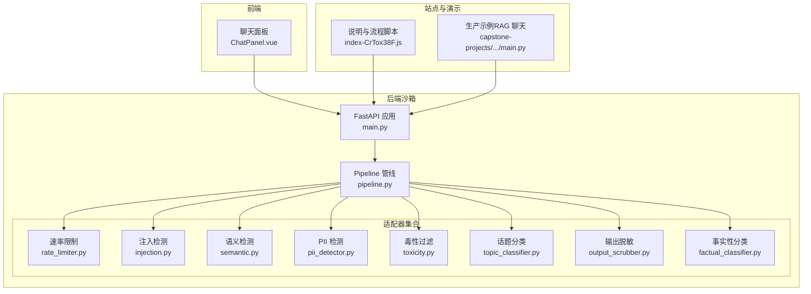
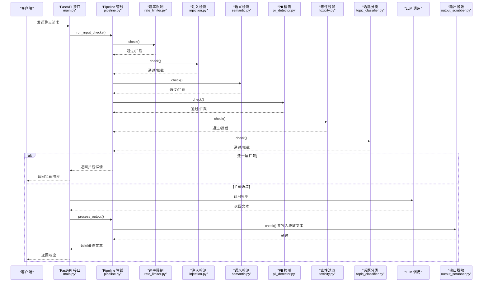
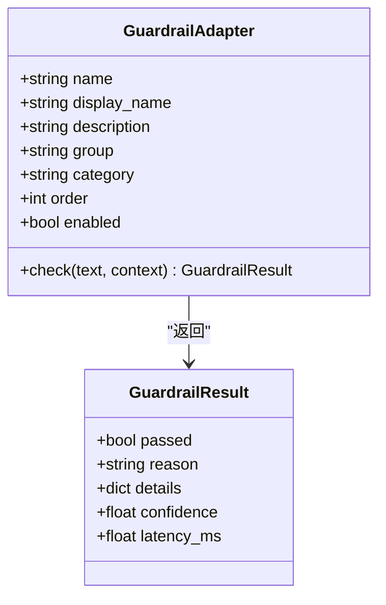
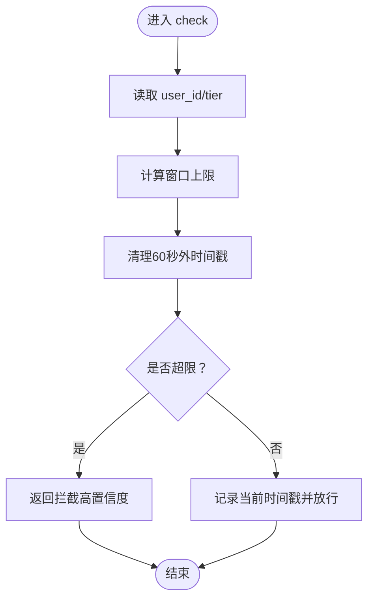
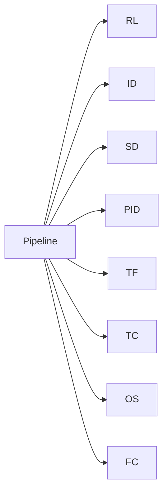

# 内容审核系统

<cite>
**本文引用的文件**
- [backend/main.py](file://guardrails-sandbox/backend/main.py)
- [backend/pipeline.py](file://guardrails-sandbox/backend/pipeline.py)
- [backend/adapters/base.py](file://guardrails-sandbox/backend/adapters/base.py)
- [backend/adapters/rate_limiter.py](file://guardrails-sandbox/backend/adapters/rate_limiter.py)
- [backend/adapters/injection.py](file://guardrails-sandbox/backend/adapters/injection.py)
- [backend/adapters/semantic.py](file://guardrails-sandbox/backend/adapters/semantic.py)
- [backend/adapters/pii_detector.py](file://guardrails-sandbox/backend/adapters/pii_detector.py)
- [backend/adapters/toxicity.py](file://guardrails-sandbox/backend/adapters/toxicity.py)
- [backend/adapters/topic_classifier.py](file://guardrails-sandbox/backend/adapters/topic_classifier.py)
- [backend/adapters/output_scrubber.py](file://guardrails-sandbox/backend/adapters/output_scrubber.py)
- [backend/adapters/factual_classifier.py](file://guardrails-sandbox/backend/adapters/factual_classifier.py)
- [frontend/src/components/ChatPanel.vue](file://guardrails-sandbox/frontend/src/components/ChatPanel.vue)
- [site/summary/assets/index-CrTox38F.js](file://site/summary/assets/index-CrTox38F.js)
- [phases/19-capstone-projects/08-production-rag-chatbot/code/main.py](file://phases/19-capstone-projects/08-production-rag-chatbot/code/main.py)
</cite>

## 目录
1. [简介](#简介)
2. [项目结构](#项目结构)
3. [核心组件](#核心组件)
4. [架构总览](#架构总览)
5. [详细组件分析](#详细组件分析)
6. [依赖关系分析](#依赖关系分析)
7. [性能考量](#性能考量)
8. [故障排查指南](#故障排查指南)
9. [结论](#结论)
10. [附录](#附录)

## 简介
本文件面向内容审核系统的技术文档，围绕 Guardrails 沙箱与生产实践展开，重点解析以下能力：
- 输入层：速率限制、提示注入检测、语义相似度检测、PII 检测、毒性过滤、话题分类
- 输出层：PII 脱敏
- LLM 输出：Moderation API（免费内容审核）作为“免费防线”
- 系统集成：FastAPI 接口、分层防护策略、响应与统计、拦截历史
- 运维要点：准确性评估、误报控制、持续优化与自定义规则扩展

## 项目结构
本项目采用“适配器 + 管线”的分层设计，核心位于后端沙箱与前端展示，配合站点侧的说明与演示脚本。

图表来源
- [backend/main.py:118-221](file://guardrails-sandbox/backend/main.py#L118-L221)
- [backend/pipeline.py:12-84](file://guardrails-sandbox/backend/pipeline.py#L12-L84)
- [backend/adapters/rate_limiter.py:7-56](file://guardrails-sandbox/backend/adapters/rate_limiter.py#L7-L56)
- [backend/adapters/injection.py:44-88](file://guardrails-sandbox/backend/adapters/injection.py#L44-L88)
- [backend/adapters/semantic.py:38-93](file://guardrails-sandbox/backend/adapters/semantic.py#L38-L93)
- [backend/adapters/pii_detector.py:19-54](file://guardrails-sandbox/backend/adapters/pii_detector.py#L19-L54)
- [backend/adapters/toxicity.py:22-63](file://guardrails-sandbox/backend/adapters/toxicity.py#L22-L63)
- [backend/adapters/topic_classifier.py:20-54](file://guardrails-sandbox/backend/adapters/topic_classifier.py#L20-L54)
- [backend/adapters/output_scrubber.py:16-56](file://guardrails-sandbox/backend/adapters/output_scrubber.py#L16-L56)
- [backend/adapters/factual_classifier.py:20-55](file://guardrails-sandbox/backend/adapters/factual_classifier.py#L20-L55)
- [frontend/src/components/ChatPanel.vue:20-46](file://guardrails-sandbox/frontend/src/components/ChatPanel.vue#L20-L46)
- [site/summary/assets/index-CrTox38F.js:1542-1686](file://site/summary/assets/index-CrTox38F.js#L1542-L1686)
- [phases/19-capstone-projects/08-production-rag-chatbot/code/main.py:161-186](file://phases/19-capstone-projects/08-production-rag-chatbot/code/main.py#L161-L186)

章节来源
- [backend/main.py:118-221](file://guardrails-sandbox/backend/main.py#L118-L221)
- [backend/pipeline.py:12-84](file://guardrails-sandbox/backend/pipeline.py#L12-L84)

## 核心组件
- 适配器基类与结果封装：统一的 GuardrailAdapter 接口与 GuardrailResult 结构，便于扩展与统计。
- 分层防护：按 order 顺序执行，任一层拦截即短路，避免昂贵的 LLM 调用。
- 输入/输出分层：input 与 output 两类适配器分别在请求进入与响应返回时执行。
- 统计与历史：记录总次数、拦截次数、按层统计、拦截历史，支撑运维与优化。

章节来源
- [backend/adapters/base.py:5-34](file://guardrails-sandbox/backend/adapters/base.py#L5-L34)
- [backend/pipeline.py:12-84](file://guardrails-sandbox/backend/pipeline.py#L12-L84)

## 架构总览
下图展示了从客户端到 LLM 的完整审核链路，以及各层适配器的职责与顺序。

图表来源
- [backend/main.py:155-221](file://guardrails-sandbox/backend/main.py#L155-L221)
- [backend/pipeline.py:31-84](file://guardrails-sandbox/backend/pipeline.py#L31-L84)
- [backend/adapters/rate_limiter.py:22-55](file://guardrails-sandbox/backend/adapters/rate_limiter.py#L22-L55)
- [backend/adapters/injection.py:53-87](file://guardrails-sandbox/backend/adapters/injection.py#L53-L87)
- [backend/adapters/semantic.py:65-92](file://guardrails-sandbox/backend/adapters/semantic.py#L65-L92)
- [backend/adapters/pii_detector.py:28-53](file://guardrails-sandbox/backend/adapters/pii_detector.py#L28-L53)
- [backend/adapters/toxicity.py:31-63](file://guardrails-sandbox/backend/adapters/toxicity.py#L31-L63)
- [backend/adapters/topic_classifier.py:29-53](file://guardrails-sandbox/backend/adapters/topic_classifier.py#L29-L53)
- [backend/adapters/output_scrubber.py:25-55](file://guardrails-sandbox/backend/adapters/output_scrubber.py#L25-L55)

## 详细组件分析

### 适配器基类与结果结构
- GuardrailAdapter：定义统一接口与元信息（name/display_name/description/group/category/order/enabled），子类仅需实现 check()。
- GuardrailResult：封装 passed/reason/details/confidence/latency_ms，用于日志与统计。

图表来源
- [backend/adapters/base.py:5-34](file://guardrails-sandbox/backend/adapters/base.py#L5-L34)

章节来源
- [backend/adapters/base.py:5-34](file://guardrails-sandbox/backend/adapters/base.py#L5-L34)

### 速率限制（Layer 1）
- 策略：基于滑动窗口的 RPM 限制，按 tier（free/pro/enterprise）设置不同上限。
- 行为：超过限额即拦截，否则记录当前窗口数量，延迟极低（~1ms）。

图表来源
- [backend/adapters/rate_limiter.py:22-55](file://guardrails-sandbox/backend/adapters/rate_limiter.py#L22-L55)

章节来源
- [backend/adapters/rate_limiter.py:7-56](file://guardrails-sandbox/backend/adapters/rate_limiter.py#L7-L56)

### 提示注入检测（Layer 2）
- 策略：正则匹配已知攻击模式（英文/中文），并检测编码绕过（如 unicode、base64、rot13、十六进制）。
- 行为：累计最大置信度，超过阈值（0.75）拦截；记录匹配项与数量。

章节来源
- [backend/adapters/injection.py:74-87](file://guardrails-sandbox/backend/adapters/injection.py#L74-L87)

### 语义相似度检测（Layer 3）
- 策略：使用中文句子向量模型，对输入与攻击种子进行余弦相似度比较，阈值 0.70。
- 行为：捕获未见过的变种，相似度越高置信度越高；延迟约 20ms。

章节来源
- [backend/adapters/semantic.py:38-93](file://guardrails-sandbox/backend/adapters/semantic.py#L38-L93)

### PII 检测（Layer 4）
- 策略：检测手机号、邮箱、身份证、信用卡、IP 地址等；IP 地址仅警告不拦截。
- 行为：若存在高置信度阻断项则拦截；记录检测到的类型与数量。

章节来源
- [backend/adapters/pii_detector.py:19-54](file://guardrails-sandbox/backend/adapters/pii_detector.py#L19-L54)

### 毒性过滤（Layer 6）
- 策略：针对暴力、违法、自残、仇恨、色情等类别构建正则模式，并设置不同置信度阈值。
- 特殊：对特定安全上下文前缀（如“如何预防”）豁免拦截。
- 行为：累计最大置信度低于阈值（0.80）放行。

章节来源
- [backend/adapters/toxicity.py:22-63](file://guardrails-sandbox/backend/adapters/toxicity.py#L22-L63)

### 话题分类（Layer 7）
- 策略：先检查明确禁止关键词，再允许非禁止的对话话题。
- 行为：命中禁止关键词即拦截，否则放行。

章节来源
- [backend/adapters/topic_classifier.py:20-54](file://guardrails-sandbox/backend/adapters/topic_classifier.py#L20-L54)

### 输出脱敏（Layer 10）
- 策略：对 LLM 输出中的邮箱、SSN、信用卡、手机号、身份证进行替换。
- 行为：始终放行，但将脱敏后的文本写入上下文，供最终返回使用。

章节来源
- [backend/adapters/output_scrubber.py:16-56](file://guardrails-sandbox/backend/adapters/output_scrubber.py#L16-L56)

### 事实性分类（Layer 5）
- 策略：通过关键词区分“事实性/创意性”问题，动态影响后续适配器阈值。
- 行为：仅写入上下文标记，不拦截。

章节来源
- [backend/adapters/factual_classifier.py:20-55](file://guardrails-sandbox/backend/adapters/factual_classifier.py#L20-L55)

### LlamaGuard 与 Moderation API（生产集成参考）
- LlamaGuard：基于分类模型的语义检测，延迟约 50ms，覆盖 14 类安全类别。
- Moderation API：免费内容审核，无用量限制，检测 13 种类别，延迟约 100ms。
- 生产建议：先只记录不拦截跑一周，再逐步开启拦截；目标误杀率（FPR）< 1%。

章节来源
- [site/summary/assets/index-CrTox38F.js:1542-1686](file://site/summary/assets/index-CrTox38F.js#L1542-L1686)
- [phases/19-capstone-projects/08-production-rag-chatbot/code/main.py:161-186](file://phases/19-capstone-projects/08-production-rag-chatbot/code/main.py#L161-L186)

## 依赖关系分析
- 组件耦合：Pipeline 对各适配器无具体实现依赖，仅依赖其接口；适配器之间相互独立。
- 执行顺序：按 group/category/order 排序，input 优先于 output。
- 外部依赖：语义检测依赖 sentence-transformers；LlamaGuard/Moderation 为外部服务或模型。

图表来源
- [backend/pipeline.py:18-24](file://guardrails-sandbox/backend/pipeline.py#L18-L24)

章节来源
- [backend/pipeline.py:18-24](file://guardrails-sandbox/backend/pipeline.py#L18-L24)

## 性能考量
- 分层优先：越早拦截越节省成本。建议顺序为：速率限制（~1ms）→ LlamaGuard（~50ms）→ 语义检测（~20ms）→ LLM（~300-2000ms）→ Moderation（~100ms）→ PII 脱敏（~10ms）。
- 模型懒加载：语义检测在首次使用时加载模型，避免启动时阻塞。
- 日志与统计：记录每层延迟与通过/拦截数，便于定位瓶颈与评估效果。

章节来源
- [site/summary/assets/index-CrTox38F.js:1542-1686](file://site/summary/assets/index-CrTox38F.js#L1542-L1686)
- [backend/adapters/semantic.py:51-64](file://guardrails-sandbox/backend/adapters/semantic.py#L51-L64)

## 故障排查指南
- 拦截历史：Pipeline 维护最近 50 条拦截记录，包含时间戳、输入片段、适配器名、阶段、原因与置信度。
- 统计指标：总次数、拦截次数、通过次数、按层统计、拦截率百分比。
- 常见问题：
  - 误杀率偏高：降低阈值或减少拦截项；先只记录不拦截观察一周。
  - 漏检：增加攻击样本库、引入语义检测、定期更新正则。
  - 性能下降：检查模型加载与缓存、减少不必要的适配器、优化正则复杂度。

章节来源
- [backend/pipeline.py:264-285](file://guardrails-sandbox/backend/pipeline.py#L264-L285)
- [backend/pipeline.py:247-262](file://guardrails-sandbox/backend/pipeline.py#L247-L262)

## 结论
该内容审核系统通过“分层防护 + 适配器扩展”的架构，在保证低延迟的前提下，覆盖提示注入、PII、毒性、话题、输出脱敏等关键场景。结合 LlamaGuard 与 Moderation API 的生产实践，可形成稳定、可演进的安全防线。建议以“只记录不拦截”起步，逐步启用拦截并持续优化阈值与规则，确保安全性与可用性的平衡。

## 附录

### 系统集成指南（API 与参数）
- 接口路径
  - 获取适配器树与统计：GET /api/guardrails
  - 切换适配器开关：POST /api/guardrails/toggle
  - 对比模式（有/无 Guardrails）：POST /api/chat/compare
  - 基准测试：POST /api/benchmark
- 请求体示例（简化）
  - ChatRequest：message、history、system_prompt、user_id、tier
  - ToggleRequest：name
- 响应体示例（简化）
  - ChatResponse：response、blocked、block_stage、block_reason、block_detail、guardrail_logs、total_latency_ms、llm_latency_ms
- 注意事项
  - LLM 调用失败会返回错误并标记 block_stage=llm_error
  - 输出脱敏不会改变最终文本，仅在 process_output 成功时生效

章节来源
- [backend/main.py:121-153](file://guardrails-sandbox/backend/main.py#L121-L153)
- [backend/main.py:155-221](file://guardrails-sandbox/backend/main.py#L155-L221)
- [backend/main.py:223-281](file://guardrails-sandbox/backend/main.py#L223-L281)

### 准确性评估与误报处理
- 评估方法
  - 历史数据回放：先只记录不拦截运行一周，统计拦截率与误杀率（FPR）。
  - A/B 对比：使用对比接口比较开启/关闭 Guardrails 的差异。
- 误报处理
  - 降低阈值或放宽规则；对误报较多的类型（如 IP 地址）仅警告。
  - 引入语义检测补充正则盲区，提高对变种的识别能力。

章节来源
- [site/summary/assets/index-CrTox38F.js:1589-1686](file://site/summary/assets/index-CrTox38F.js#L1589-L1686)

### 自定义审核规则开发方法
- 新增适配器步骤
  - 继承 GuardrailAdapter，实现 check()，设置 name/display_name/description/group/category/order/enabled。
  - 在 main.py 中注册适配器实例。
  - 在 Pipeline 中自动按 order 排序执行。
- 最佳实践
  - 保持 check() 纯函数式，避免副作用；记录详细 details 便于审计。
  - 使用置信度与阈值分离，便于分级处理。
  - 对高成本检测（如语义/LLM）放在靠后层，或按 tier 动态启用。

章节来源
- [backend/adapters/base.py:14-34](file://guardrails-sandbox/backend/adapters/base.py#L14-L34)
- [backend/main.py:24-58](file://guardrails-sandbox/backend/main.py#L24-L58)
- [backend/pipeline.py:18-24](file://guardrails-sandbox/backend/pipeline.py#L18-L24)

### 前端展示与适配器命名映射
- 前端组件维护适配器中文名与英文名映射，便于 UI 展示与国际化。

章节来源
- [frontend/src/components/ChatPanel.vue:20-46](file://guardrails-sandbox/frontend/src/components/ChatPanel.vue#L20-L46)