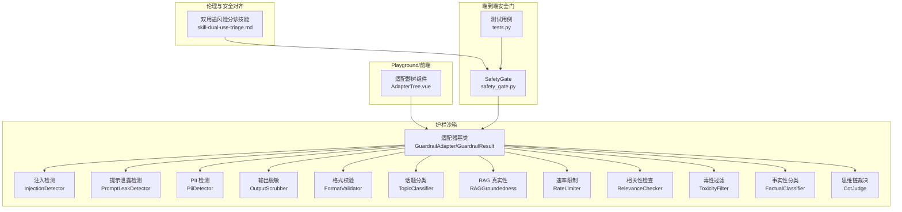
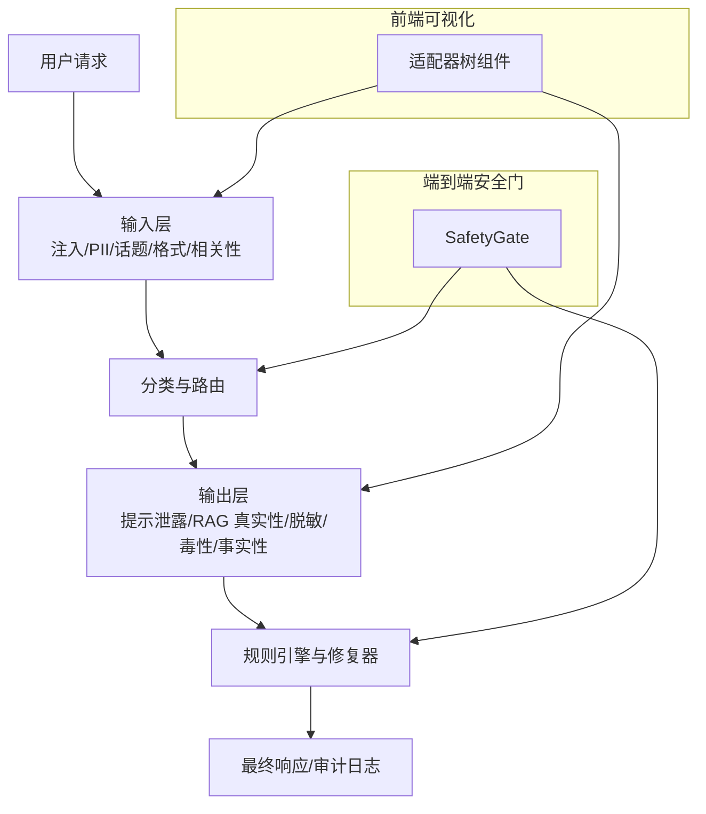
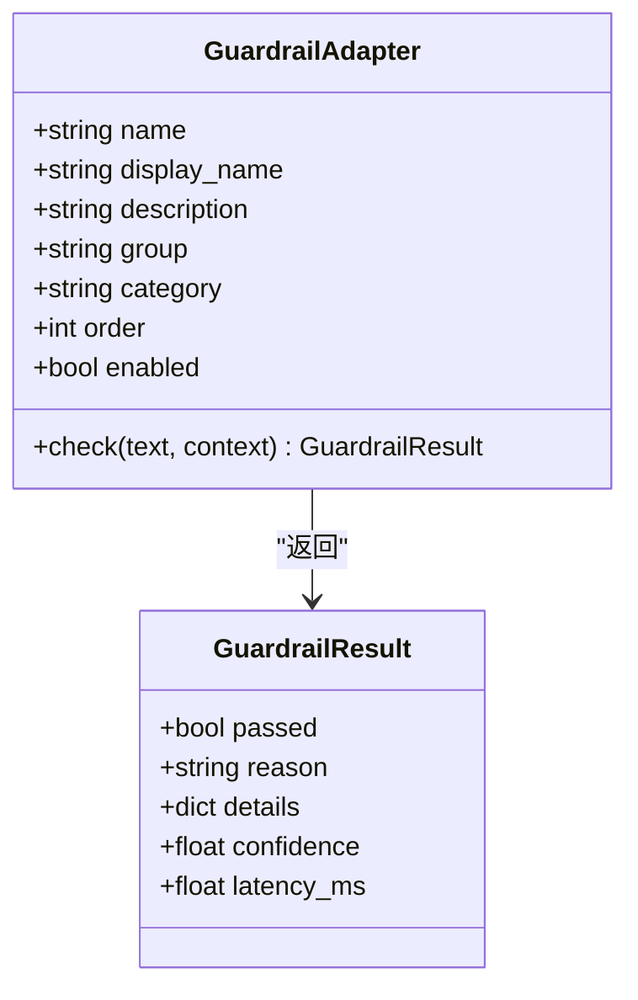
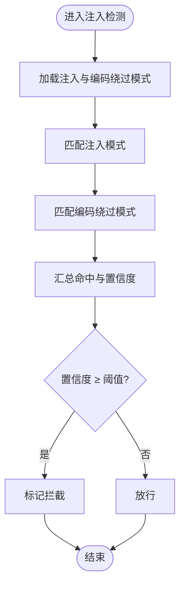
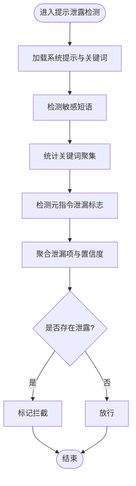
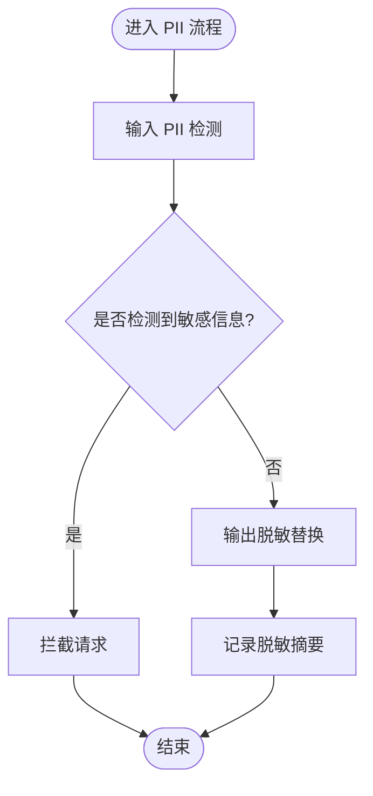
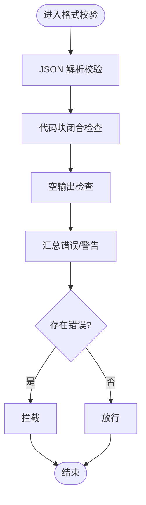
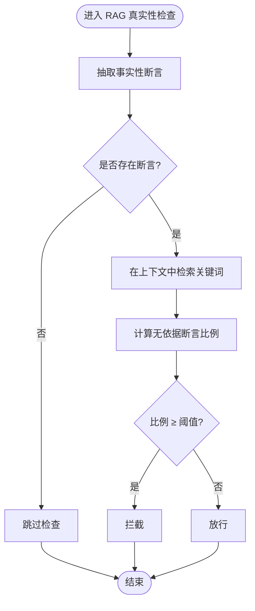
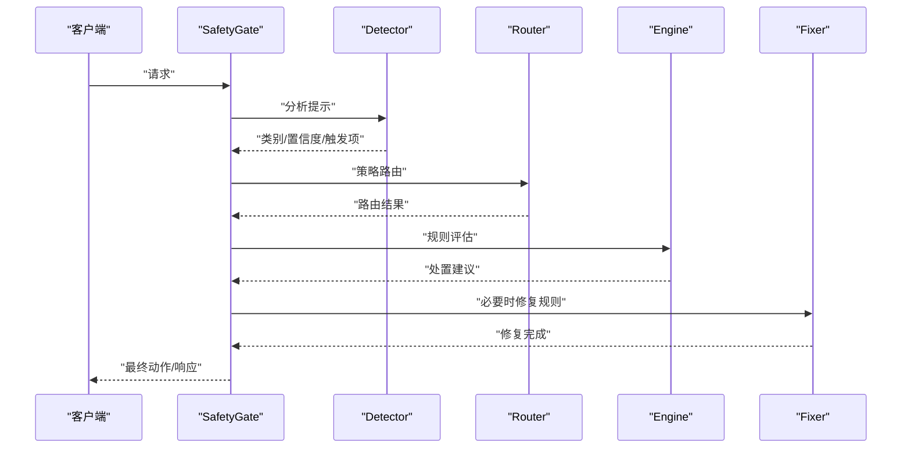
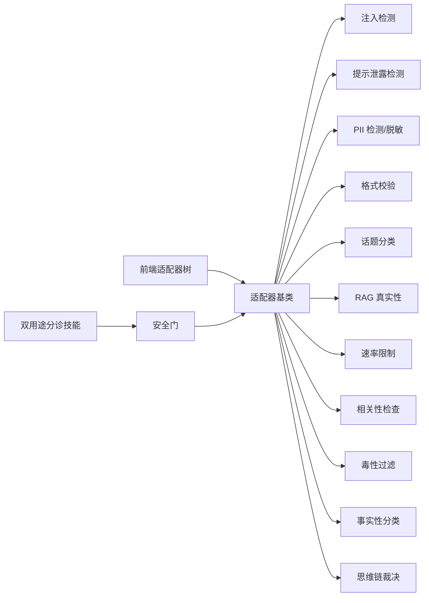

# 双用途风险评估

<cite>
**本文引用的文件**
- [guardrails-sandbox/backend/adapters/base.py](file://guardrails-sandbox/backend/adapters/base.py)
- [guardrails-sandbox/backend/adapters/injection.py](file://guardrails-sandbox/backend/adapters/injection.py)
- [guardrails-sandbox/backend/adapters/prompt_leak.py](file://guardrails-sandbox/backend/adapters/prompt_leak.py)
- [guardrails-sandbox/backend/adapters/topic_classifier.py](file://guardrails-sandbox/backend/adapters/topic_classifier.py)
- [guardrails-sandbox/backend/adapters/pii_detector.py](file://guardrails-sandbox/backend/adapters/pii_detector.py)
- [guardrails-sandbox/backend/adapters/output_scrubber.py](file://guardrails-sandbox/backend/adapters/output_scrubber.py)
- [guardrails-sandbox/backend/adapters/format_validator.py](file://guardrails-sandbox/backend/adapters/format_validator.py)
- [guardrails-sandbox/backend/adapters/rag_groundedness.py](file://guardrails-sandbox/backend/adapters/rag_groundedness.py)
- [guardrails-sandbox/backend/adapters/rate_limiter.py](file://guardrails-sandbox/backend/adapters/rate_limiter.py)
- [guardrails-sandbox/backend/adapters/relevance.py](file://guardrails-sandbox/backend/adapters/relevance.py)
- [guardrails-sandbox/backend/adapters/toxicity.py](file://guardrails-sandbox/backend/adapters/toxicity.py)
- [guardrails-sandbox/backend/adapters/factual_classifier.py](file://guardrails-sandbox/backend/adapters/factual_classifier.py)
- [guardrails-sandbox/backend/adapters/cot_judge.py](file://guardrails-sandbox/backend/adapters/cot_judge.py)
- [guardrails-sandbox/backend/adapters/exact_cache.py](file://guardrails-sandbox/backend/adapters/exact_cache.py)
- [guardrails-sandbox/backend/adapters/context_engine.py](file://guardrails-sandbox/backend/adapters/context_engine.py)
- [guardrails-sandbox/backend/playground/modules/](file://guardrails-sandbox/backend/playground/modules/)
- [guardrails-sandbox/frontend/src/components/AdapterTree.vue](file://guardrails-sandbox/frontend/src/components/AdapterTree.vue)
- [phases/18-ethics-safety-alignment/30-dual-use-risk-cyber-bio-chem-nuclear/outputs/skill-dual-use-triage.md](file://phases/18-ethics-safety-alignment/30-dual-use-risk-cyber-bio-chem-nuclear/outputs/skill-dual-use-triage.md)
- [site/figures-agents-alignment.js](file://site/figures-agents-alignment.js)
- [site/data.js](file://site/data.js)
- [phases/19-capstone-projects/87-end-to-end-safety-gate/code/safety_gate.py](file://phases/19-capstone-projects/87-end-to-end-safety-gate/code/safety_gate.py)
- [phases/19-capstone-projects/87-end-to-end-safety-gate/code/tests.py](file://phases/19-capstone-projects/87-end-to-end-safety-gate/code/tests.py)
</cite>

## 目录
1. [引言](#引言)
2. [项目结构](#项目结构)
3. [核心组件](#核心组件)
4. [架构总览](#架构总览)
5. [详细组件分析](#详细组件分析)
6. [依赖分析](#依赖分析)
7. [性能考虑](#性能考虑)
8. [故障排查指南](#故障排查指南)
9. [结论](#结论)
10. [附录](#附录)

## 引言
本技术文档面向双用途风险评估场景，聚焦网络安全、生物化学、核能等敏感领域。文档系统化阐述技术的潜在恶意用途与安全防护设计原则，提供风险评估框架与实施指南（威胁建模、影响分析、缓解策略），并结合仓库中的护栏体系与端到端安全门样例，给出可落地的工程化路径。同时讨论国际法规、行业标准与最佳实践在风险管理中的应用，并介绍负责任披露与事件响应流程。

## 项目结构
本仓库围绕“护栏沙箱”与“伦理与安全对齐”阶段展开，形成“适配器层-运行时-前端可视化-评估技能”的闭环。其中：
- 护栏适配器层：覆盖输入/输出全链路安全检测与处理（注入、提示泄露、PII、格式、相关性、毒性、事实性、RAG 真实性、速率限制等）。
- Playground 与前端：以树形结构展示适配器分组与职责，辅助理解执行顺序与策略。
- 伦理与安全对齐阶段：提供双用途风险分诊技能，指导跨 CBRN 领域的评估与基准对比。
- 端到端安全门：提供可复用的安全决策流水线与测试用例，便于集成到生产环境。

图表来源
- [guardrails-sandbox/backend/adapters/base.py:14-34](file://guardrails-sandbox/backend/adapters/base.py#L14-L34)
- [guardrails-sandbox/backend/adapters/injection.py:44-88](file://guardrails-sandbox/backend/adapters/injection.py#L44-L88)
- [guardrails-sandbox/backend/adapters/prompt_leak.py:14-94](file://guardrails-sandbox/backend/adapters/prompt_leak.py#L14-L94)
- [guardrails-sandbox/backend/adapters/pii_detector.py:19-54](file://guardrails-sandbox/backend/adapters/pii_detector.py#L19-L54)
- [guardrails-sandbox/backend/adapters/output_scrubber.py:16-56](file://guardrails-sandbox/backend/adapters/output_scrubber.py#L16-L56)
- [guardrails-sandbox/backend/adapters/format_validator.py:13-86](file://guardrails-sandbox/backend/adapters/format_validator.py#L13-L86)
- [guardrails-sandbox/backend/adapters/topic_classifier.py:20-54](file://guardrails-sandbox/backend/adapters/topic_classifier.py#L20-L54)
- [guardrails-sandbox/backend/adapters/rag_groundedness.py:16-100](file://guardrails-sandbox/backend/adapters/rag_groundedness.py#L16-L100)
- [guardrails-sandbox/backend/adapters/rate_limiter.py](file://guardrails-sandbox/backend/adapters/rate_limiter.py)
- [guardrails-sandbox/backend/adapters/relevance.py](file://guardrails-sandbox/backend/adapters/relevance.py)
- [guardrails-sandbox/backend/adapters/toxicity.py](file://guardrails-sandbox/backend/adapters/toxicity.py)
- [guardrails-sandbox/backend/adapters/factual_classifier.py](file://guardrails-sandbox/backend/adapters/factual_classifier.py)
- [guardrails-sandbox/backend/adapters/cot_judge.py](file://guardrails-sandbox/backend/adapters/cot_judge.py)
- [guardrails-sandbox/frontend/src/components/AdapterTree.vue:88-98](file://guardrails-sandbox/frontend/src/components/AdapterTree.vue#L88-L98)
- [phases/18-ethics-safety-alignment/30-dual-use-risk-cyber-bio-chem-nuclear/outputs/skill-dual-use-triage.md:10-30](file://phases/18-ethics-safety-alignment/30-dual-use-risk-cyber-bio-chem-nuclear/outputs/skill-dual-use-triage.md#L10-L30)
- [phases/19-capstone-projects/87-end-to-end-safety-gate/code/safety_gate.py:104-119](file://phases/19-capstone-projects/87-end-to-end-safety-gate/code/safety_gate.py#L104-L119)
- [phases/19-capstone-projects/87-end-to-end-safety-gate/code/tests.py:60-84](file://phases/19-capstone-projects/87-end-to-end-safety-gate/code/tests.py#L60-L84)

章节来源
- [site/data.js:3908-3915](file://site/data.js#L3908-L3915)
- [site/figures-agents-alignment.js:366-391](file://site/figures-agents-alignment.js#L366-L391)

## 核心组件
- 适配器基类与结果模型：定义统一接口与结果载体，确保各适配器具备一致的启用/禁用、分组、类别、执行顺序与返回结构。
- 注入检测：基于正则与编码绕过模式识别提示注入与越狱尝试，提供置信度与命中详情。
- 提示泄露检测：检测 LLM 输出是否泄露系统提示中的敏感短语与关键词，保护系统提示资产。
- PII 检测与输出脱敏：识别输入中的敏感信息并拦截；对输出进行脱敏替换，避免敏感数据外泄。
- 格式校验：保障结构化输出（JSON/代码块/空输出）符合预期，降低下游解析崩溃风险。
- 话题分类：对输入进行允许/禁止话题判定，阻断高风险主题对话。
- RAG 真实性：对事实性断言进行上下文溯源，防止幻觉与编造信息传播。
- 速率限制、相关性检查、毒性过滤、事实性分类、思维链裁决：覆盖输入/输出全链路的合规与质量控制。
- 前端适配器树：以可视化方式呈现分组与职责，帮助理解执行顺序与策略。
- 双用途风险分诊技能：提供跨 CBRN 领域的评估模板与基准对比，支持新手相对增益与专家绝对能力的分解。
- 端到端安全门：封装检测-路由-规则引擎-修复器的闭环，提供可序列化的追踪与测试用例。

章节来源
- [guardrails-sandbox/backend/adapters/base.py:5-34](file://guardrails-sandbox/backend/adapters/base.py#L5-L34)
- [guardrails-sandbox/backend/adapters/injection.py:44-88](file://guardrails-sandbox/backend/adapters/injection.py#L44-L88)
- [guardrails-sandbox/backend/adapters/prompt_leak.py:14-94](file://guardrails-sandbox/backend/adapters/prompt_leak.py#L14-L94)
- [guardrails-sandbox/backend/adapters/pii_detector.py:19-54](file://guardrails-sandbox/backend/adapters/pii_detector.py#L19-L54)
- [guardrails-sandbox/backend/adapters/output_scrubber.py:16-56](file://guardrails-sandbox/backend/adapters/output_scrubber.py#L16-L56)
- [guardrails-sandbox/backend/adapters/format_validator.py:13-86](file://guardrails-sandbox/backend/adapters/format_validator.py#L13-L86)
- [guardrails-sandbox/backend/adapters/topic_classifier.py:20-54](file://guardrails-sandbox/backend/adapters/topic_classifier.py#L20-L54)
- [guardrails-sandbox/backend/adapters/rag_groundedness.py:16-100](file://guardrails-sandbox/backend/adapters/rag_groundedness.py#L16-L100)
- [guardrails-sandbox/frontend/src/components/AdapterTree.vue:88-98](file://guardrails-sandbox/frontend/src/components/AdapterTree.vue#L88-L98)
- [phases/18-ethics-safety-alignment/30-dual-use-risk-cyber-bio-chem-nuclear/outputs/skill-dual-use-triage.md:10-30](file://phases/18-ethics-safety-alignment/30-dual-use-risk-cyber-bio-chem-nuclear/outputs/skill-dual-use-triage.md#L10-L30)
- [phases/19-capstone-projects/87-end-to-end-safety-gate/code/safety_gate.py:104-119](file://phases/19-capstone-projects/87-end-to-end-safety-gate/code/safety_gate.py#L104-L119)

## 架构总览
下图展示了护栏适配器在输入/输出链路上的分层与协作，以及前端可视化与端到端安全门的集成关系。

图表来源
- [site/figures-agents-alignment.js:366-391](file://site/figures-agents-alignment.js#L366-L391)
- [guardrails-sandbox/frontend/src/components/AdapterTree.vue:88-98](file://guardrails-sandbox/frontend/src/components/AdapterTree.vue#L88-L98)
- [phases/19-capstone-projects/87-end-to-end-safety-gate/code/safety_gate.py:104-119](file://phases/19-capstone-projects/87-end-to-end-safety-gate/code/safety_gate.py#L104-L119)

## 详细组件分析

### 组件 A：护栏适配器基类与结果模型
- 设计要点：统一的字段与接口，便于扩展与组合；通过 group/category/order 控制执行顺序与分组。
- 数据结构：结果对象包含通过状态、原因、细节、置信度与延迟，支撑可观测性与自动化决策。

图表来源
- [guardrails-sandbox/backend/adapters/base.py:5-34](file://guardrails-sandbox/backend/adapters/base.py#L5-L34)

章节来源
- [guardrails-sandbox/backend/adapters/base.py:14-34](file://guardrails-sandbox/backend/adapters/base.py#L14-L34)

### 组件 B：注入检测（提示注入与编码绕过）
- 功能：基于预置正则模式与编码绕过特征，识别越狱、覆盖指令、打印系统提示等攻击。
- 策略：提供置信度与命中详情，便于灰区裁决与规则迭代。

图表来源
- [guardrails-sandbox/backend/adapters/injection.py:44-88](file://guardrails-sandbox/backend/adapters/injection.py#L44-L88)

章节来源
- [guardrails-sandbox/backend/adapters/injection.py:44-88](file://guardrails-sandbox/backend/adapters/injection.py#L44-L88)

### 组件 C：提示泄露检测（保护系统提示资产）
- 功能：检测输出中是否出现系统提示中的敏感短语、关键词聚集与元指令泄漏标志。
- 策略：支持外部注入真实系统提示以提取关键词，提升检测准确性。

图表来源
- [guardrails-sandbox/backend/adapters/prompt_leak.py:14-94](file://guardrails-sandbox/backend/adapters/prompt_leak.py#L14-L94)

章节来源
- [guardrails-sandbox/backend/adapters/prompt_leak.py:14-94](file://guardrails-sandbox/backend/adapters/prompt_leak.py#L14-L94)

### 组件 D：PII 检测与输出脱敏
- 功能：输入侧拦截敏感信息（手机号、邮箱、身份证、信用卡等），输出侧进行脱敏替换。
- 策略：对不同类型采用差异化处置（拦截/警告/脱敏），并记录哈希摘要用于审计。

图表来源
- [guardrails-sandbox/backend/adapters/pii_detector.py:19-54](file://guardrails-sandbox/backend/adapters/pii_detector.py#L19-L54)
- [guardrails-sandbox/backend/adapters/output_scrubber.py:16-56](file://guardrails-sandbox/backend/adapters/output_scrubber.py#L16-L56)

章节来源
- [guardrails-sandbox/backend/adapters/pii_detector.py:19-54](file://guardrails-sandbox/backend/adapters/pii_detector.py#L19-L54)
- [guardrails-sandbox/backend/adapters/output_scrubber.py:16-56](file://guardrails-sandbox/backend/adapters/output_scrubber.py#L16-L56)

### 组件 E：格式校验（结构化输出）
- 功能：校验 JSON/代码块/空输出等格式，降低下游解析崩溃风险。
- 策略：对错误与警告分别计数，错误级别拦截，警告级别提醒。

图表来源
- [guardrails-sandbox/backend/adapters/format_validator.py:13-86](file://guardrails-sandbox/backend/adapters/format_validator.py#L13-L86)

章节来源
- [guardrails-sandbox/backend/adapters/format_validator.py:13-86](file://guardrails-sandbox/backend/adapters/format_validator.py#L13-L86)

### 组件 F：RAG 真实性（防止幻觉）
- 功能：抽取事实性断言并在上下文中溯源，若无依据比例过高则拦截。
- 策略：对含数字/日期/金额等句子进行断言提取与关键词匹配，设定阈值控制风险。

图表来源
- [guardrails-sandbox/backend/adapters/rag_groundedness.py:16-100](file://guardrails-sandbox/backend/adapters/rag_groundedness.py#L16-L100)

章节来源
- [guardrails-sandbox/backend/adapters/rag_groundedness.py:16-100](file://guardrails-sandbox/backend/adapters/rag_groundedness.py#L16-L100)

### 组件 G：端到端安全门（SafetyGate）
- 功能：串联检测、路由与规则引擎，支持修复器与可序列化追踪，提供测试用例验证关键行为。
- 策略：前置分析、策略检查、输出过滤三道闸门，优先级与阻断逻辑清晰。

图表来源
- [phases/19-capstone-projects/87-end-to-end-safety-gate/code/safety_gate.py:104-119](file://phases/19-capstone-projects/87-end-to-end-safety-gate/code/safety_gate.py#L104-L119)
- [phases/19-capstone-projects/87-end-to-end-safety-gate/code/tests.py:60-84](file://phases/19-capstone-projects/87-end-to-end-safety-gate/code/tests.py#L60-L84)

章节来源
- [phases/19-capstone-projects/87-end-to-end-safety-gate/code/safety_gate.py:104-119](file://phases/19-capstone-projects/87-end-to-end-safety-gate/code/safety_gate.py#L104-L119)
- [phases/19-capstone-projects/87-end-to-end-safety-gate/code/tests.py:60-84](file://phases/19-capstone-projects/87-end-to-end-safety-gate/code/tests.py#L60-L84)

## 依赖分析
- 组件耦合：适配器均依赖基类接口，彼此独立，可通过 group/category/order 组合形成流水线。
- 外部依赖：前端组件依赖适配器树描述；安全门依赖检测/路由/规则引擎/修复器模块；双用途分诊技能依赖伦理与安全对齐阶段知识。
- 集成点：Playground 模块提供可视化与交互入口；site 图表与数据文件承载课程索引与技能标签。

图表来源
- [guardrails-sandbox/backend/adapters/base.py:14-34](file://guardrails-sandbox/backend/adapters/base.py#L14-L34)
- [guardrails-sandbox/frontend/src/components/AdapterTree.vue:88-98](file://guardrails-sandbox/frontend/src/components/AdapterTree.vue#L88-L98)
- [phases/18-ethics-safety-alignment/30-dual-use-risk-cyber-bio-chem-nuclear/outputs/skill-dual-use-triage.md:10-30](file://phases/18-ethics-safety-alignment/30-dual-use-risk-cyber-bio-chem-nuclear/outputs/skill-dual-use-triage.md#L10-L30)
- [phases/19-capstone-projects/87-end-to-end-safety-gate/code/safety_gate.py:104-119](file://phases/19-capstone-projects/87-end-to-end-safety-gate/code/safety_gate.py#L104-L119)

章节来源
- [site/data.js:3908-3915](file://site/data.js#L3908-L3915)

## 性能考虑
- 适配器执行顺序：通过 order 字段控制，优先执行低开销、高拦截率的适配器（如注入、PII、格式），减少后续昂贵检测的压力。
- 置信度与阈值：灰区裁决（如思维链二次判断）应谨慎设置阈值，避免误杀与漏判。
- 观测性：记录延迟与置信度，便于定位瓶颈与优化策略。
- 缓存与成本：针对事实性问题与创意性问题采用差异化阈值，结合缓存策略降低成本。

## 故障排查指南
- 注入与提示泄露：确认系统提示是否正确注入、关键词提取是否合理；检查正则模式是否覆盖最新攻击变种。
- PII 检测与脱敏：核对输入拦截与输出脱敏策略是否一致；关注误报（如 IP 地址）与漏报（如新格式）。
- 格式校验：优先修复 JSON 解析失败与代码块未闭合；对空输出进行兜底处理。
- RAG 真实性：提高断言提取与关键词匹配的鲁棒性；调整无依据断言比例阈值。
- 安全门：通过测试用例验证拦截优先级与序列化一致性；检查追踪日志的完整性与可读性。

章节来源
- [phases/19-capstone-projects/87-end-to-end-safety-gate/code/tests.py:60-84](file://phases/19-capstone-projects/87-end-to-end-safety-gate/code/tests.py#L60-L84)

## 结论
本仓库提供了从护栏适配器到端到端安全门的完整工程化方案，并配套双用途风险分诊技能，能够支撑网络安全、生物化学、核能等敏感领域的双用途风险评估与治理。通过可视化前端与可测试的安全门，团队可以快速落地威胁建模、影响分析与缓解策略，并持续迭代以应对不断演进的攻击面与监管要求。

## 附录
- 国际法规与行业标准：结合课程中的合规矩阵与安全计划技能，映射 SOC 2、HIPAA、GDPR、PCI-DSS、EU AI Act、Colorado AI Act、ISO 42001 等框架，形成控制措施清单。
- 负责任披露与事件响应：建立事件分级、告警通道（如钉钉/飞书 webhook）、审计日志（JSON Lines）与回溯流程，确保在发生泄露或滥用时能快速响应与修复。