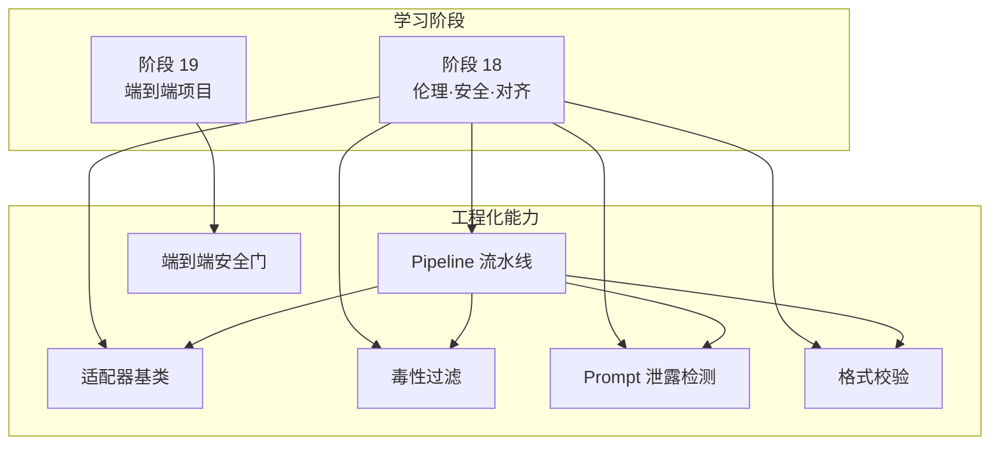
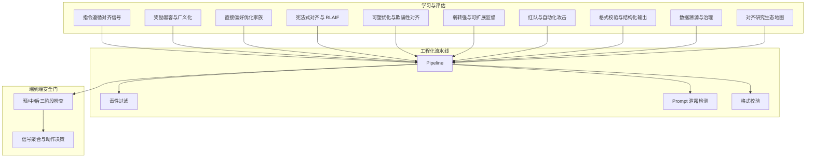
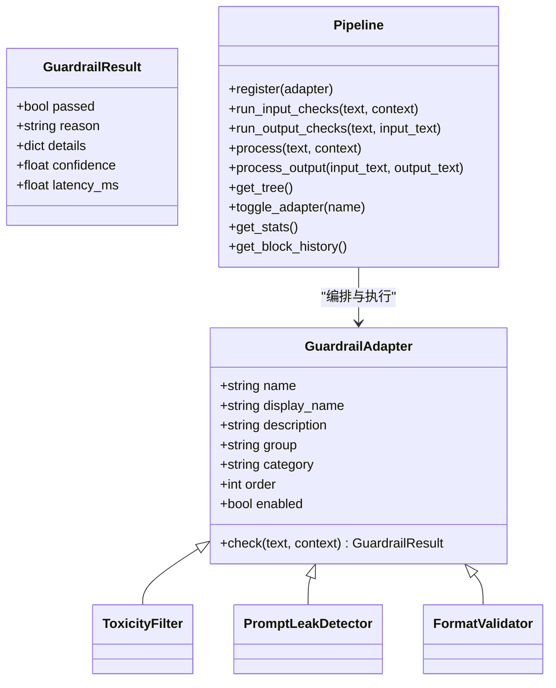
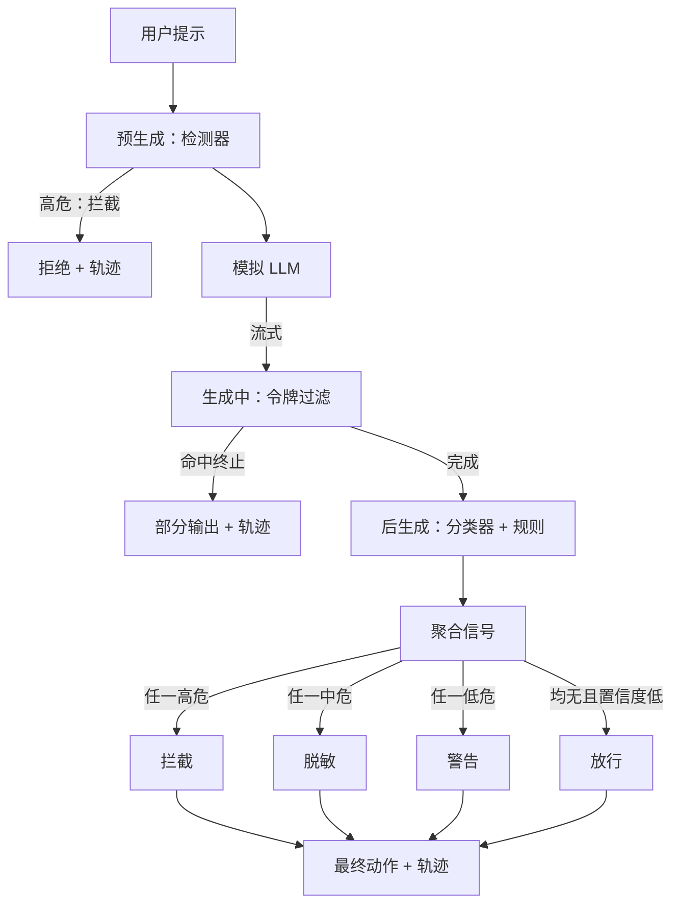
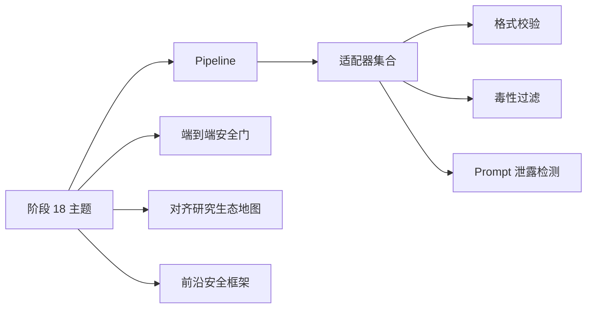

# 对齐研究生态

<cite>
**本文引用的文件**   
- [site/data.js](file://site/data.js)
- [ROADMAP.md](file://ROADMAP.md)
- [phases/18-ethics-safety-alignment/README.md](file://phases/18-ethics-safety-alignment/README.md)
- [phases/19-capstone-projects/87-end-to-end-safety-gate/docs/en.md](file://phases/19-capstone-projects/87-end-to-end-safety-gate/docs/en.md)
- [phases/19-capstone-projects/87-end-to-end-safety-gate/code/safety_gate.py](file://phases/19-capstone-projects/87-end-to-end-safety-gate/code/safety_gate.py)
- [guardrails-sandbox/backend/adapters/base.py](file://guardrails-sandbox/backend/adapters/base.py)
- [guardrails-sandbox/backend/adapters/toxicity.py](file://guardrails-sandbox/backend/adapters/toxicity.py)
- [guardrails-sandbox/backend/adapters/prompt_leak.py](file://guardrails-sandbox/backend/adapters/prompt_leak.py)
- [guardrails-sandbox/backend/adapters/format_validator.py](file://guardrails-sandbox/backend/adapters/format_validator.py)
- [guardrails-sandbox/backend/pipeline.py](file://guardrails-sandbox/backend/pipeline.py)
</cite>

## 目录
1. [引言](#引言)
2. [项目结构](#项目结构)
3. [核心组件](#核心组件)
4. [架构总览](#架构总览)
5. [详细组件分析](#详细组件分析)
6. [依赖分析](#依赖分析)
7. [性能考量](#性能考量)
8. [故障排查指南](#故障排查指南)
9. [结论](#结论)
10. [附录](#附录)

## 引言
本文件面向“对齐研究生态”的综合性技术文档，围绕对齐研究的发展脉络、当前状态与未来趋势展开；系统梳理学术界、产业界与政府机构在对齐研究中的合作模式与分工机制；明确不同类型研究机构、实验室与项目的定位与作用；总结开放源代码、共享数据与协作平台等基础设施建设现状，并给出参与对齐研究的最佳实践与资源获取路径。文档同时结合仓库内“伦理、安全与对齐”阶段与“安全门”“防护栏沙盒”等工程化能力，提供可落地的技术参考。

## 项目结构
该仓库以“学习路径与课程阶段”组织内容，其中第18阶段聚焦伦理、安全与对齐，涵盖从基础信号到前沿评估方法的完整知识体系；第19阶段以“端到端安全门”为代表的工程化能力，体现对齐研究在生产环境中的落地实践。配套的“防护栏沙盒”提供了可插拔的适配器与流水线编排，便于快速集成与扩展。

**图表来源**
- [ROADMAP.md:487-520](file://ROADMAP.md#L487-L520)
- [guardrails-sandbox/backend/pipeline.py:12-285](file://guardrails-sandbox/backend/pipeline.py#L12-L285)
- [guardrails-sandbox/backend/adapters/base.py:14-34](file://guardrails-sandbox/backend/adapters/base.py#L14-L34)
- [guardrails-sandbox/backend/adapters/toxicity.py:22-64](file://guardrails-sandbox/backend/adapters/toxicity.py#L22-L64)
- [guardrails-sandbox/backend/adapters/prompt_leak.py:14-94](file://guardrails-sandbox/backend/adapters/prompt_leak.py#L14-L94)
- [guardrails-sandbox/backend/adapters/format_validator.py:13-86](file://guardrails-sandbox/backend/adapters/format_validator.py#L13-L86)
- [phases/19-capstone-projects/87-end-to-end-safety-gate/docs/en.md:18-46](file://phases/19-capstone-projects/87-end-to-end-safety-gate/docs/en.md#L18-L46)

**章节来源**
- [ROADMAP.md:487-520](file://ROADMAP.md#L487-L520)
- [phases/18-ethics-safety-alignment/README.md:1-6](file://phases/18-ethics-safety-alignment/README.md#L1-L6)

## 核心组件
- 阶段化学习体系：第18阶段覆盖对齐研究的关键主题，包括指令遵循、奖励黑客、直接偏好优化、宪法式对齐、可塑优化、欺骗性对齐、子回路计划、对齐伪装、AI 控制、可扩展监督与弱转强、红队与自动化攻击、多示例越狱、间接提示注入、红队工具链、双重用途风险评估、前沿安全框架、模型福利、偏见与表征伤害、公平性准则、差分隐私、水印、监管框架、数据溯源与治理、对齐研究生态地图、审核系统与双用风险等。
- 工程化流水线：防护栏沙盒提供统一的 GuardrailAdapter 抽象与 Pipeline 编排，支持输入/输出两类检查、按 order 排序执行、短路拦截、统计与拦截历史记录。
- 端到端安全门：在预生成、生成中、后生成三个检查点进行判定，聚合多信号并输出最终动作，形成可审计的请求轨迹。

**章节来源**
- [ROADMAP.md:487-520](file://ROADMAP.md#L487-L520)
- [site/data.js:3735-4720](file://site/data.js#L3735-L4720)
- [guardrails-sandbox/backend/pipeline.py:12-285](file://guardrails-sandbox/backend/pipeline.py#L12-L285)
- [phases/19-capstone-projects/87-end-to-end-safety-gate/docs/en.md:18-46](file://phases/19-capstone-projects/87-end-to-end-safety-gate/docs/en.md#L18-L46)

## 架构总览
下图展示从学习阶段到工程化落地的整体架构：学习阶段沉淀方法论与评估体系，工程化流水线与安全门负责在实际系统中执行与验证。

**图表来源**
- [ROADMAP.md:487-520](file://ROADMAP.md#L487-L520)
- [site/data.js:3735-4720](file://site/data.js#L3735-L4720)
- [guardrails-sandbox/backend/pipeline.py:12-285](file://guardrails-sandbox/backend/pipeline.py#L12-L285)
- [guardrails-sandbox/backend/adapters/toxicity.py:22-64](file://guardrails-sandbox/backend/adapters/toxicity.py#L22-L64)
- [guardrails-sandbox/backend/adapters/prompt_leak.py:14-94](file://guardrails-sandbox/backend/adapters/prompt_leak.py#L14-L94)
- [guardrails-sandbox/backend/adapters/format_validator.py:13-86](file://guardrails-sandbox/backend/adapters/format_validator.py#L13-L86)
- [phases/19-capstone-projects/87-end-to-end-safety-gate/docs/en.md:18-46](file://phases/19-capstone-projects/87-end-to-end-safety-gate/docs/en.md#L18-L46)

## 详细组件分析

### 组件A：防护栏适配器与流水线
- 适配器抽象：定义统一的 GuardrailResult 与 GuardrailAdapter 接口，子类仅需实现 check()，并声明分组、类别、执行顺序与启用状态。
- 典型适配器：
  - 毒性过滤：检测暴力、违法、自残、仇恨、色情等敏感内容，支持安全上下文豁免与置信度评分。
  - Prompt 泄露检测：基于敏感短语与系统提示关键词密度判断是否泄露系统提示。
  - 格式校验：确保输出符合 JSON/代码/文本等预期格式，避免下游解析崩溃。
- 流水线编排：按类别与顺序执行适配器，遇到拦截即短路；记录统计与拦截历史；支持树形结构可视化与开关控制。

**图表来源**
- [guardrails-sandbox/backend/adapters/base.py:5-34](file://guardrails-sandbox/backend/adapters/base.py#L5-L34)
- [guardrails-sandbox/backend/adapters/toxicity.py:22-64](file://guardrails-sandbox/backend/adapters/toxicity.py#L22-L64)
- [guardrails-sandbox/backend/adapters/prompt_leak.py:14-94](file://guardrails-sandbox/backend/adapters/prompt_leak.py#L14-L94)
- [guardrails-sandbox/backend/adapters/format_validator.py:13-86](file://guardrails-sandbox/backend/adapters/format_validator.py#L13-L86)
- [guardrails-sandbox/backend/pipeline.py:12-285](file://guardrails-sandbox/backend/pipeline.py#L12-L285)

**章节来源**
- [guardrails-sandbox/backend/adapters/base.py:14-34](file://guardrails-sandbox/backend/adapters/base.py#L14-L34)
- [guardrails-sandbox/backend/adapters/toxicity.py:22-64](file://guardrails-sandbox/backend/adapters/toxicity.py#L22-L64)
- [guardrails-sandbox/backend/adapters/prompt_leak.py:14-94](file://guardrails-sandbox/backend/adapters/prompt_leak.py#L14-L94)
- [guardrails-sandbox/backend/adapters/format_validator.py:13-86](file://guardrails-sandbox/backend/adapters/format_validator.py#L13-L86)
- [guardrails-sandbox/backend/pipeline.py:12-285](file://guardrails-sandbox/backend/pipeline.py#L12-L285)

### 组件B：端到端安全门（预/中/后三阶段）
- 概念：在预生成、生成中、后生成三个检查点分别进行判定，聚合四个严重度信号，采用确定性表格进行动作选择。
- 关键流程：预生成检测器、生成中流式令牌过滤（可早期终止）、后生成分类器与规则引擎，最终输出拒绝、脱敏、警告或允许，并附带可审计的请求轨迹。

**图表来源**
- [phases/19-capstone-projects/87-end-to-end-safety-gate/docs/en.md:18-46](file://phases/19-capstone-projects/87-end-to-end-safety-gate/docs/en.md#L18-L46)
- [phases/19-capstone-projects/87-end-to-end-safety-gate/code/safety_gate.py:184-197](file://phases/19-capstone-projects/87-end-to-end-safety-gate/code/safety_gate.py#L184-L197)

**章节来源**
- [phases/19-capstone-projects/87-end-to-end-safety-gate/docs/en.md:18-46](file://phases/19-capstone-projects/87-end-to-end-safety-gate/docs/en.md#L18-L46)
- [phases/19-capstone-projects/87-end-to-end-safety-gate/code/safety_gate.py:184-197](file://phases/19-capstone-projects/87-end-to-end-safety-gate/code/safety_gate.py#L184-L197)

### 组件C：对齐研究生态地图与评估技能
- 生态地图：将对齐主张与评估映射到组织、方法学与交叉验证，覆盖 MATS、红杉、Apollo、METR、Eleos 等主体。
- 技能清单：包含宪法撰写、可塑诊断、控制协议审计、W2SG-PGR 审计、攻击审计、合规缺口、数据溯源检查、生态地图绘制等，支撑从理论到实证的闭环。

**章节来源**
- [site/data.js:18546-18563](file://site/data.js#L18546-L18563)

## 依赖分析
- 学习阶段与工程化能力的耦合关系：学习阶段提供方法论与评估工具，工程化流水线与安全门作为落地载体，二者在“格式校验”“提示泄露”“毒性过滤”等具体场景上形成直接依赖。
- 组织生态与方法学：生态地图与前沿安全框架（RSP/PF/FSF）共同构成评估与治理的组织与制度保障。

**图表来源**
- [ROADMAP.md:487-520](file://ROADMAP.md#L487-L520)
- [guardrails-sandbox/backend/pipeline.py:12-285](file://guardrails-sandbox/backend/pipeline.py#L12-L285)
- [guardrails-sandbox/backend/adapters/format_validator.py:13-86](file://guardrails-sandbox/backend/adapters/format_validator.py#L13-L86)
- [guardrails-sandbox/backend/adapters/toxicity.py:22-64](file://guardrails-sandbox/backend/adapters/toxicity.py#L22-L64)
- [guardrails-sandbox/backend/adapters/prompt_leak.py:14-94](file://guardrails-sandbox/backend/adapters/prompt_leak.py#L14-L94)
- [site/data.js:18546-18563](file://site/data.js#L18546-L18563)

**章节来源**
- [ROADMAP.md:487-520](file://ROADMAP.md#L487-L520)
- [site/data.js:3735-4720](file://site/data.js#L3735-L4720)

## 性能考量
- 流水线短路与排序：通过按 order 排序与短路拦截减少无效计算，提升吞吐。
- 适配器粒度与置信度：针对不同风险等级设定阈值与置信度，平衡误报与漏报。
- 可观测性与统计：记录拦截率、各层统计与拦截历史，支撑持续优化与回归预警。

[本节为通用指导，无需列出具体文件来源]

## 故障排查指南
- 拦截历史：查看最近拦截事件的时间戳、触发适配器、阶段与原因，定位异常输入模式。
- 统计与开关：通过统计接口观察整体拦截率与各适配器通过/拦截次数，必要时临时禁用适配器进行隔离排查。
- 动作与脱敏：确认最终动作（拦截/脱敏/警告/放行）是否符合预期，若脱敏后为空则回退为拒绝。

**章节来源**
- [guardrails-sandbox/backend/pipeline.py:247-285](file://guardrails-sandbox/backend/pipeline.py#L247-L285)
- [phases/19-capstone-projects/87-end-to-end-safety-gate/code/safety_gate.py:184-197](file://phases/19-capstone-projects/87-end-to-end-safety-gate/code/safety_gate.py#L184-L197)

## 结论
本仓库以阶段化学习与工程化落地双轮驱动对齐研究：前者构建方法论与评估体系，后者提供可复用的防护栏与安全门能力。通过生态地图与前沿安全框架，形成从理论到实践再到治理的闭环。建议在研究与实践中优先关注：生态协同、方法学标准化、工程化流水线的可观测性与可演进性，以及跨学科、跨部门的协作机制建设。

[本节为总结性内容，无需列出具体文件来源]

## 附录

### 参与对齐研究的最佳实践
- 从学习阶段入手：系统掌握指令遵循、奖励黑客、直接偏好优化、宪法式对齐、可扩展监督、红队与自动化攻击、格式校验、数据溯源与治理等主题。
- 在工程化流水线中落地：使用 Pipeline 与适配器组合，建立输入/输出双通道检查，配置短路拦截与统计分析。
- 构建端到端安全门：在预/中/后三阶段部署检测器、令牌过滤与分类器/规则引擎，形成可审计的请求轨迹。
- 加入生态地图：将自身主张与评估纳入组织、方法学与交叉验证框架，推动开放协作与互操作。

**章节来源**
- [ROADMAP.md:487-520](file://ROADMAP.md#L487-L520)
- [site/data.js:3735-4720](file://site/data.js#L3735-L4720)
- [guardrails-sandbox/backend/pipeline.py:12-285](file://guardrails-sandbox/backend/pipeline.py#L12-L285)
- [phases/19-capstone-projects/87-end-to-end-safety-gate/docs/en.md:18-46](file://phases/19-capstone-projects/87-end-to-end-safety-gate/docs/en.md#L18-L46)