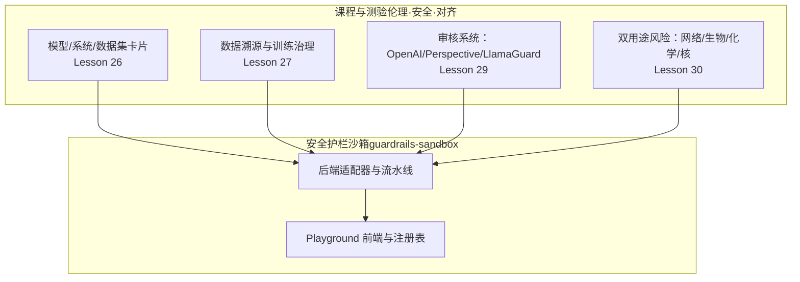
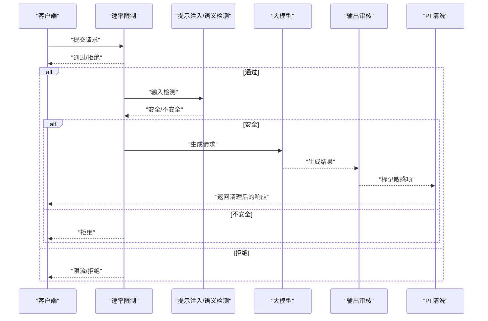
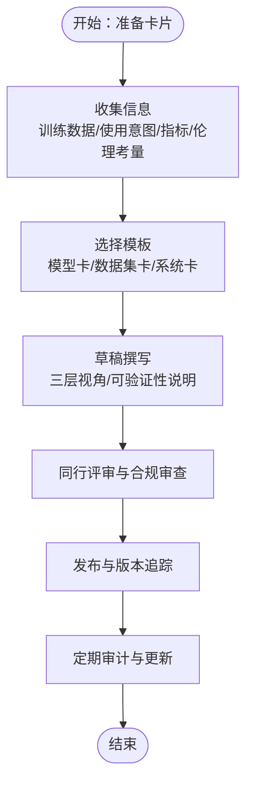
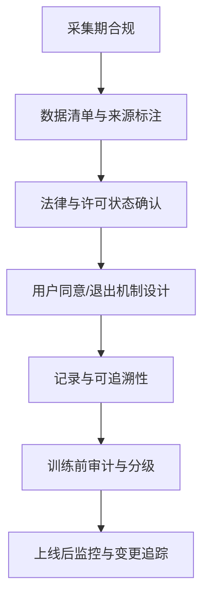
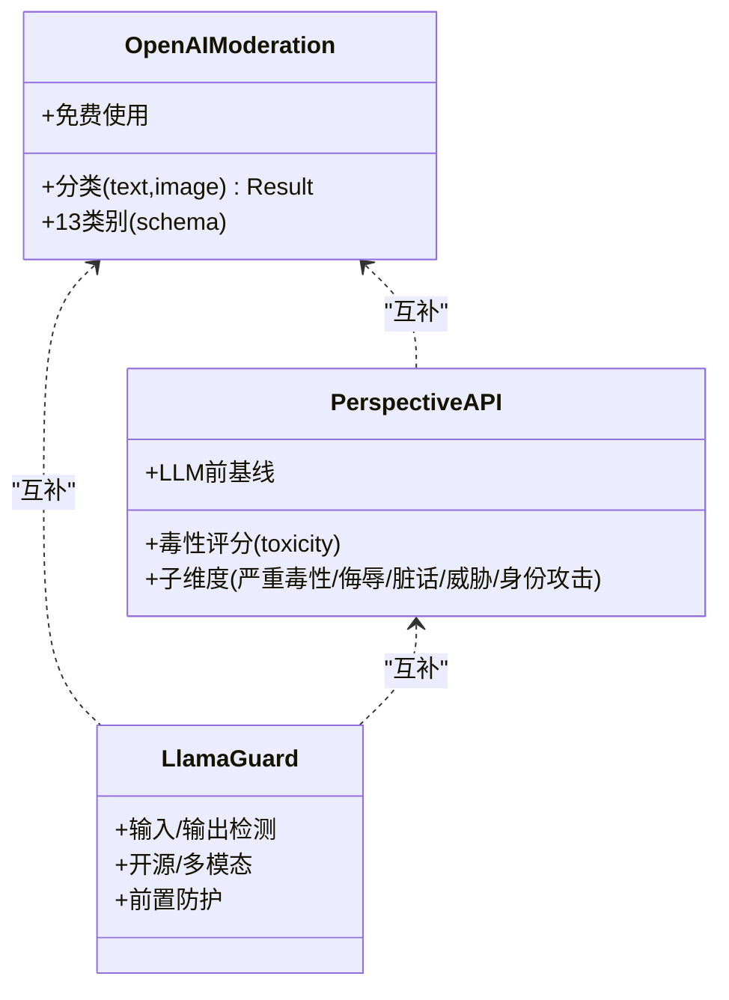
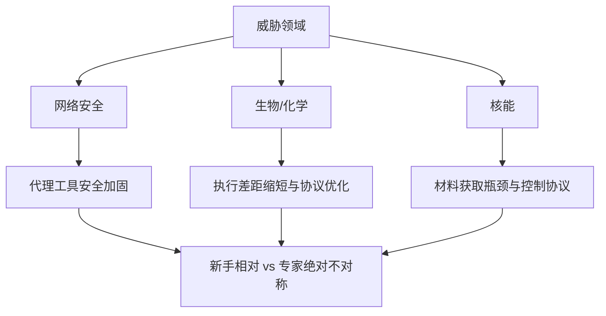
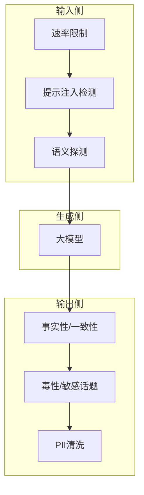
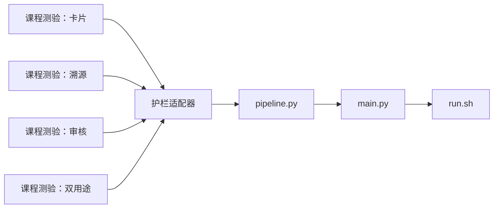

# 数据治理与伦理

<cite>
**本文引用的文件**
- [site/data.js](file://site/data.js)
- [phases/18-ethics-safety-alignment/26-model-system-dataset-cards/quiz.json](file://phases/18-ethics-safety-alignment/26-model-system-dataset-cards/quiz.json)
- [phases/18-ethics-safety-alignment/27-data-provenance-training-governance/quiz.json](file://phases/18-ethics-safety-alignment/27-data-provenance-training-governance/quiz.json)
- [phases/18-ethics-safety-alignment/29-moderation-systems-openai-perspective-llamaguard/quiz.json](file://phases/18-ethics-safety-alignment/29-moderation-systems-openai-perspective-llamaguard/quiz.json)
- [phases/18-ethics-safety-alignment/30-dual-use-risk-cyber-bio-chem-nuclear/quiz.json](file://phases/18-ethics-safety-alignment/30-dual-use-risk-cyber-bio-chem-nuclear/quiz.json)
- [guardrails-sandbox/backend/adapters/toxicity.py](file://guardrails-sandbox/backend/adapters/toxicity.py)
- [guardrails-sandbox/backend/adapters/topic_classifier.py](file://guardrails-sandbox/backend/adapters/topic_classifier.py)
- [guardrails-sandbox/backend/adapters/format_validator.py](file://guardrails-sandbox/backend/adapters/format_validator.py)
- [guardrails-sandbox/backend/adapters/length_check.py](file://guardrails-sandbox/backend/adapters/length_check.py)
- [guardrails-sandbox/backend/adapters/pii_detector.py](file://guardrails-sandbox/backend/adapters/pii_detector.py)
- [guardrails-sandbox/backend/adapters/output_scrubber.py](file://guardrails-sandbox/backend/adapters/output_scrubber.py)
- [guardrails-sandbox/backend/adapters/rate_limiter.py](file://guardrails-sandbox/backend/adapters/rate_limiter.py)
- [guardrails-sandbox/backend/adapters/prompt_leak.py](file://guardrails-sandbox/backend/adapters/prompt_leak.py)
- [guardrails-sandbox/backend/adapters/relevance.py](file://guardrails-sandbox/backend/adapters/relevance.py)
- [guardrails-sandbox/backend/adapters/injection.py](file://guardrails-sandbox/backend/adapters/injection.py)
- [guardrails-sandbox/backend/adapters/exact_cache.py](file://guardrails-sandbox/backend/adapters/exact_cache.py)
- [guardrails-sandbox/backend/adapters/context_engine.py](file://guardrails-sandbox/backend/adapters/context_engine.py)
- [guardrails-sandbox/backend/adapters/factual_classifier.py](file://guardrails-sandbox/backend/adapters/factual_classifier.py)
- [guardrails-sandbox/backend/adapters/rag_groundedness.py](file://guardrails-sandbox/backend/adapters/rag_groundedness.py)
- [guardrails-sandbox/backend/playground/modules/](file://guardrails-sandbox/backend/playground/modules/)
- [guardrails-sandbox/backend/playground/registry.py](file://guardrails-sandbox/backend/playground/registry.py)
- [guardrails-sandbox/backend/playground/checkpoint_db.py](file://guardrails-sandbox/backend/playground/checkpoint_db.py)
- [guardrails-sandbox/backend/test_cases.py](file://guardrails-sandbox/backend/test_cases.py)
- [guardrails-sandbox/backend/benchmark.py](file://guardrails-sandbox/backend/benchmark.py)
- [guardrails-sandbox/backend/llm_client.py](file://guardrails-sandbox/backend/llm_client.py)
- [guardrails-sandbox/backend/main.py](file://guardrails-sandbox/backend/main.py)
- [guardrails-sandbox/backend/pipeline.py](file://guardrails-sandbox/backend/pipeline.py)
- [guardrails-sandbox/run.sh](file://guardrails-sandbox/run.sh)
</cite>

## 目录
1. 引言
2. 项目结构
3. 核心组件
4. 架构总览
5. 详细组件分析
6. 依赖关系分析
7. 性能考量
8. 故障排查指南
9. 结论
10. 附录

## 引言
本文件面向“数据治理与伦理”主题，结合仓库中已有的课程与工具资源，系统化梳理模型系统数据集卡片标准、数据溯源与训练治理、审核系统的原理与实践、双用途风险（网络安全、生物化学、核能）评估与管控，以及负责任的数据管理与AI开发实践建议。文档以循序渐进的方式组织，既适合初学者建立整体认知，也为工程团队提供可落地的参考。

## 项目结构
围绕数据治理与伦理，仓库内主要由以下两类资源构成：
- 课程与测验：第18阶段“伦理、安全与对齐”中的若干课时，涵盖模型/系统/数据集卡片、数据溯源与训练治理、审核系统、双用途风险等主题，并配有测验题。
- 安全护栏沙箱（guardrails-sandbox）：一套后端适配器与前端Playground，用于构建多层内容安全与合规管线，包含输入/输出审核、格式校验、PII检测、速率限制、上下文与事实一致性等模块。

图示来源
- [site/data.js:3869-3916](file://site/data.js#L3869-L3916)
- [guardrails-sandbox/backend/main.py](file://guardrails-sandbox/backend/main.py)
- [guardrails-sandbox/backend/pipeline.py](file://guardrails-sandbox/backend/pipeline.py)
- [guardrails-sandbox/backend/playground/registry.py](file://guardrails-sandbox/backend/playground/registry.py)

章节来源
- [site/data.js:3869-3916](file://site/data.js#L3869-L3916)

## 核心组件
- 模型/系统/数据集卡片：定义透明度与可审计性的“营养标签”，覆盖训练数据、使用意图、指标、伦理考量等维度；系统卡扩展到端到端AI系统及其安全与部署上下文。
- 数据溯源与训练治理：强调在采集期完成合规，因训练后难以完全移除权重；涉及AB 2013、欧盟TDM退出权、合法利益原则、数据保护协议（DPA）等。
- 审核系统：三层次模式（输入前、生成后、自定义领域规则），对比OpenAI Moderation API、Perspective API、Llama Guard等技术路线与失败模式。
- 双用途风险：从网络安全、生物/化学、核能三个维度评估能力提升对“新手相对”与“专家绝对”的影响，提出分诊与管控策略。
- 护栏沙箱：提供可插拔的适配器（毒性、话题分类、格式校验、长度检查、PII检测、输出清洗、速率限制、提示注入检测、相关性、上下文一致性、事实分类、RAG稳健性等），支持在生产环境构建多层安全防线。

章节来源
- [phases/18-ethics-safety-alignment/26-model-system-dataset-cards/quiz.json:1-79](file://phases/18-ethics-safety-alignment/26-model-system-dataset-cards/quiz.json#L1-L79)
- [phases/18-ethics-safety-alignment/27-data-provenance-training-governance/quiz.json:1-79](file://phases/18-ethics-safety-alignment/27-data-provenance-training-governance/quiz.json#L1-L79)
- [phases/18-ethics-safety-alignment/29-moderation-systems-openai-perspective-llamaguard/quiz.json:1-79](file://phases/18-ethics-safety-alignment/29-moderation-systems-openai-perspective-llamaguard/quiz.json#L1-L79)
- [phases/18-ethics-safety-alignment/30-dual-use-risk-cyber-bio-chem-nuclear/quiz.json:1-79](file://phases/18-ethics-safety-alignment/30-dual-use-risk-cyber-bio-chem-nuclear/quiz.json#L1-L79)

## 架构总览
下图展示生产级内容安全与合规的典型分层架构：输入预处理（速率限制、提示注入检测、语义探测）、模型生成、输出后处理（事实性/一致性、毒性/敏感话题、PII清洗）、以及可选的领域规则与缓存。

图示来源
- [site/summary/assets/index-CrTox38F.js:1660-1686](file://site/summary/assets/index-CrTox38F.js#L1660-L1686)
- [guardrails-sandbox/backend/adapters/rate_limiter.py](file://guardrails-sandbox/backend/adapters/rate_limiter.py)
- [guardrails-sandbox/backend/adapters/injection.py](file://guardrails-sandbox/backend/adapters/injection.py)
- [guardrails-sandbox/backend/adapters/toxicity.py](file://guardrails-sandbox/backend/adapters/toxicity.py)
- [guardrails-sandbox/backend/adapters/pii_detector.py](file://guardrails-sandbox/backend/adapters/pii_detector.py)
- [guardrails-sandbox/backend/adapters/output_scrubber.py](file://guardrails-sandbox/backend/adapters/output_scrubber.py)

## 详细组件分析

### 组件A：模型/系统/数据集卡片（标准与填写指南）
- 目标与范围
  - 模型卡：借鉴Mitchell et al.（2019）的“营养标签”理念，覆盖训练数据、使用意图、关键因素、指标、评估数据、量化细分分析、伦理考量与注意事项。
  - 数据集卡：参考Datasheets for Datasets（Gebru et al., 2018）与Data Cards（Pushkarna et al., Google 2022），提供“望远镜/潜望镜/显微镜”三层视角，满足不同读者需求。
  - 系统卡：扩展至端到端AI系统，包括模型+安全栈+部署上下文，涵盖安全能力、提示注入防护、数据外泄检测、对齐与事件响应。
- 填写要点
  - 训练数据：来源与所有者、是否持续使用合成数据、清洗与处理修改、收集时间窗口、法律与许可状态。
  - 使用意图：预期任务、目标用户、地理与人口统计学分布、性能指标与分解分析。
  - 伦理与社会影响：潜在偏见、代表性伤害、隐私与安全风险、可解释性与可审计性。
  - 可验证性：采用硬件TEE/密码学签名等技术，使卡片具备“经验证的声明”而非仅是声明。
- 课程测验要点
  - Mitchell模型卡定位、Oreamuno关于伦理考量采纳率、Data Cards三层结构、System Card相较Model Card的扩展范围、Liang关于卡片细节与下载量的关系、Laminator的可验证性贡献。

章节来源
- [phases/18-ethics-safety-alignment/26-model-system-dataset-cards/quiz.json:1-79](file://phases/18-ethics-safety-alignment/26-model-system-dataset-cards/quiz.json#L1-L79)
- [site/data.js:3869-3879](file://site/data.js#L3869-L3879)

### 组件B：数据溯源与训练治理（实施方法）
- 合规窗口与采集期控制
  - 训练后难以完全移除权重，唯一彻底补救方式是重新训练，成本极高；因此合规必须在采集期完成。
- 法律与框架
  - 加州AB 2013：要求开发者在数据集摘要中发布约12项法定信息，新增项包括是否使用/持续使用合成数据生成。
  - 欧盟TDM退出权与合法利益：在公开可用的第一方内容上进行LLM训练，可在提供退出机制与适当保障的前提下，基于合法利益进行而无需明确同意。
- 部分补救措施
  - 包括近似删除（MIA度量）、基于影响函数的定位与选择性更新、针对源自该数据的输出进行微调抑制等；但GDPR强制权重删除不可行。
- 课程测验要点
  - 合规窗口在采集期的原因、AB 2013法定条目数量、相较Datasheets的新增项、2025年DPA关于第一方内容的原则、不可行的部分补救类型、Data Provenance Initiative关于robots.txt限制收缩的发现。

章节来源
- [phases/18-ethics-safety-alignment/27-data-provenance-training-governance/quiz.json:1-79](file://phases/18-ethics-safety-alignment/27-data-provenance-training-governance/quiz.json#L1-L79)
- [site/data.js:3881-3885](file://site/data.js#L3881-L3885)

### 组件C：审核系统（OpenAI Perspective、LlamaGuard等）
- 三层次模式
  - 输入前：输入审核（预生成），阻断高风险输入。
  - 生成后：输出审核（后生成），检测生成内容的敏感类别。
  - 自定义领域规则：针对特定业务场景的补充规则。
- 技术对比
  - OpenAI Moderation API（omni-moderation-latest, 2024）：基于GPT-4o的文本与图像联合分类器，返回13类响应（含子类），免费供大多数开发者使用。
  - Perspective API（Google Jigsaw）：主要用于毒性评分（严重毒性、侮辱、脏话、威胁、身份攻击等），作为LLM出现前的内容审核基线。
  - Llama Guard 3/4：开源的多模态审核工具，常用于输入/输出的前置检测。
- 失败模式与迁移
  - 输入仅审核无法捕获模型输出失败或幻觉；编码式攻击可绕过输入分类器；Azure Content Moderator已停用，迁移目标为Azure AI Content Safety（集成Azure OpenAI）。
- 课程测验要点
  - OpenAI omni-moderation定位、非主要类别识别、三层次模式、Perspective主要评分维度、输入仅审核的失败模式、Azure迁移路径。

图示来源
- [phases/18-ethics-safety-alignment/29-moderation-systems-openai-perspective-llamaguard/quiz.json:1-79](file://phases/18-ethics-safety-alignment/29-moderation-systems-openai-perspective-llamaguard/quiz.json#L1-L79)

章节来源
- [phases/18-ethics-safety-alignment/29-moderation-systems-openai-perspective-llamaguard/quiz.json:1-79](file://phases/18-ethics-safety-alignment/29-moderation-systems-openai-perspective-llamaguard/quiz.json#L1-L79)

### 组件D：双用途风险（网络安全、生物化学、核能）
- 生物/化学：2024-2025叙事从“无显著提升”演进到“对新手在已知生物威胁方面有实质性帮助”，Anthropic实验显示2.53倍提升；视觉增强的前沿模型正缩短“化学/生物执行差距”。
- 网络安全：2025年11月报告指出，中国关联的国家行为体利用Claude的代理式编程工具自动化了近90%的网络攻击活动；防御方也在探索“受信任访问”试点，向经认证的安全组织开放能力用于防御性双重用途工作。
- 核能：由于裂变材料获取存在物理瓶颈，信息层面的AI提升对“新手相对”有限，但对“专家绝对”仍具挑战，需额外控制协议。
- 新手相对 vs 专家绝对不对称：仅解决新手相对提升不足以应对专家绝对能力，还需强化引导硬化、能力消解与控制协议。
- 课程测验要点
  - 生物/化学叙事演变、网络安全报告发现、视觉模型如何缩短执行差距、核能提升受限原因、新手相对与专家绝对的不对称含义、OpenAI“受信任访问”试点。

章节来源
- [phases/18-ethics-safety-alignment/30-dual-use-risk-cyber-bio-chem-nuclear/quiz.json:1-79](file://phases/18-ethics-safety-alignment/30-dual-use-risk-cyber-bio-chem-nuclear/quiz.json#L1-L79)

### 组件E：护栏沙箱（适配器与流水线）
- 适配器模块（节选）
  - 输入/输出审核：toxicity、topic_classifier、format_validator、length_check、prompt_leak、injection、relevance、context_engine、factual_classifier、rag_groundedness。
  - 数据与隐私：pii_detector、output_scrubber、exact_cache。
  - 运行时控制：rate_limiter。
- Playground
  - 提供模块注册表与检查点数据库，便于快速组装与迭代安全护栏。
- 流水线与运行
  - 通过pipeline.py串联各适配器，main.py作为入口，run.sh提供一键启动脚本。

图示来源
- [guardrails-sandbox/backend/pipeline.py](file://guardrails-sandbox/backend/pipeline.py)
- [guardrails-sandbox/backend/main.py](file://guardrails-sandbox/backend/main.py)
- [guardrails-sandbox/run.sh](file://guardrails-sandbox/run.sh)
- [guardrails-sandbox/backend/adapters/toxicity.py](file://guardrails-sandbox/backend/adapters/toxicity.py)
- [guardrails-sandbox/backend/adapters/topic_classifier.py](file://guardrails-sandbox/backend/adapters/topic_classifier.py)
- [guardrails-sandbox/backend/adapters/format_validator.py](file://guardrails-sandbox/backend/adapters/format_validator.py)
- [guardrails-sandbox/backend/adapters/length_check.py](file://guardrails-sandbox/backend/adapters/length_check.py)
- [guardrails-sandbox/backend/adapters/pii_detector.py](file://guardrails-sandbox/backend/adapters/pii_detector.py)
- [guardrails-sandbox/backend/adapters/output_scrubber.py](file://guardrails-sandbox/backend/adapters/output_scrubber.py)
- [guardrails-sandbox/backend/adapters/rate_limiter.py](file://guardrails-sandbox/backend/adapters/rate_limiter.py)
- [guardrails-sandbox/backend/adapters/injection.py](file://guardrails-sandbox/backend/adapters/injection.py)
- [guardrails-sandbox/backend/adapters/exact_cache.py](file://guardrails-sandbox/backend/adapters/exact_cache.py)
- [guardrails-sandbox/backend/adapters/context_engine.py](file://guardrails-sandbox/backend/adapters/context_engine.py)
- [guardrails-sandbox/backend/adapters/factual_classifier.py](file://guardrails-sandbox/backend/adapters/factual_classifier.py)
- [guardrails-sandbox/backend/adapters/rag_groundedness.py](file://guardrails-sandbox/backend/adapters/rag_groundedness.py)

章节来源
- [guardrails-sandbox/backend/pipeline.py](file://guardrails-sandbox/backend/pipeline.py)
- [guardrails-sandbox/backend/main.py](file://guardrails-sandbox/backend/main.py)
- [guardrails-sandbox/run.sh](file://guardrails-sandbox/run.sh)

## 依赖关系分析
- 课程与护栏沙箱的耦合点
  - 课程提供治理与审核的理论与框架，护栏沙箱提供可落地的实现与测试用例，二者共同支撑从规范到工程的闭环。
- 适配器间的内聚与耦合
  - 输入/输出审核适配器围绕“安全”与“合规”目标内聚；与LLM生成链路弱耦合，通过统一接口接入。
- 外部依赖与集成
  - OpenAI Moderation API、Perspective API、Llama Guard等外部服务作为可替换的审核后端；Azure Content Safety为迁移目标。

图示来源
- [site/data.js:3869-3916](file://site/data.js#L3869-L3916)
- [guardrails-sandbox/backend/pipeline.py](file://guardrails-sandbox/backend/pipeline.py)
- [guardrails-sandbox/backend/main.py](file://guardrails-sandbox/backend/main.py)
- [guardrails-sandbox/run.sh](file://guardrails-sandbox/run.sh)

章节来源
- [site/data.js:3869-3916](file://site/data.js#L3869-L3916)

## 性能考量
- 分层审核的吞吐与延迟
  - 速率限制与提示注入检测通常为毫秒级；语义检测与LLM生成为几十到数百毫秒级；输出审核与PII清洗为百毫秒级。应按优先级与成本排序，避免阻塞主路径。
- 缓存与去重
  - 使用exact_cache减少重复计算；在输入/输出相似度较高场景显著降低延迟。
- 资源与弹性
  - 在高峰期启用速率限制与降级策略；对LLM生成设置超时与重试上限，防止级联故障。

## 故障排查指南
- 常见问题定位
  - 输入被误杀：检查提示注入检测与语义探测阈值；必要时加入白名单或放宽规则。
  - 输出漏检：确认事实性/一致性与毒性/敏感话题模块配置；增加领域规则补充。
  - PII泄露：核查输出清洗流程与PII检测覆盖率；确保在生成后阶段执行。
  - 性能退化：检查缓存命中率、速率限制触发频率、LLM生成耗时分布。
- 工程化手段
  - 使用playground的注册表与检查点数据库快速回滚与验证修复。
  - 通过test_cases.py与benchmark.py进行回归与基准测试。

章节来源
- [guardrails-sandbox/backend/test_cases.py](file://guardrails-sandbox/backend/test_cases.py)
- [guardrails-sandbox/backend/benchmark.py](file://guardrails-sandbox/backend/benchmark.py)
- [guardrails-sandbox/backend/playground/checkpoint_db.py](file://guardrails-sandbox/backend/playground/checkpoint_db.py)
- [guardrails-sandbox/backend/playground/registry.py](file://guardrails-sandbox/backend/playground/registry.py)

## 结论
本文件将课程体系与护栏沙箱相结合，系统阐述了数据治理与伦理的关键议题：以模型/系统/数据集卡片提升透明度与可审计性；以采集期合规与溯源治理应对训练后不可逆性；以三层次审核体系与外部工具（OpenAI/Perspective/Llama Guard）构建生产级安全防线；以双用途风险评估指导对网络安全、生物化学、核能等领域的管控策略。护栏沙箱提供了可复用的适配器与流水线，便于团队在工程实践中落地这些原则与方法。

## 附录
- 术语与概念
  - 模型卡（Mitchell et al., 2019）、数据集说明书（Datasheets for Datasets, Gebru et al., 2018）、数据卡（Data Cards, Pushkarna et al., 2022）、系统卡（System Card）、数据溯源（Data Provenance）、训练治理（Training Data Governance）、三层次审核（输入/输出/自定义规则）、双用途风险（Dual-Use Risk, CBRN）。
- 参考资料
  - 课程测验与站点索引：[site/data.js:3869-3916](file://site/data.js#L3869-L3916)